# Azure Durable Functions as an Execution Framework for AI Agents

### Feasibility and Applicability Research — Single-Agent and Multi-Agent Workloads

**Prepared for:** R&D Initiative — Agentic AI Platform Evaluation
**Date:** September 17, 2026
**Status:** Research document — v2.0 (expanded operational coverage, new diagrams, requirements gap closure)

---

## Table of Contents

1. [Executive Summary](#1-executive-summary)
2. [Introduction and Objectives](#2-introduction-and-objectives)
   - 2.1 [Purpose and Scope](#21-purpose-and-scope)
   - 2.2 [Methodology and Changes Since v1](#22-methodology-and-changes-since-v1)
3. [Azure Durable Functions: Platform Capabilities Overview](#3-azure-durable-functions-platform-capabilities-overview)
   - 3.1 [Core Programming Model](#31-core-programming-model)
   - 3.2 [Reliability Model: Event Sourcing and Checkpointing](#32-reliability-model-event-sourcing-and-checkpointing)
   - 3.3 [Hosting Plans and Scalability](#33-hosting-plans-and-scalability)
   - 3.4 [State Management and Storage Backends](#34-state-management-and-storage-backends)
   - 3.5 [Monitoring, Diagnostics, and Observability](#35-monitoring-diagnostics-and-observability)
   - 3.6 [Event-Driven Execution and Triggers](#36-event-driven-execution-and-triggers)
4. [Orchestration Patterns for AI Agent Workloads](#4-orchestration-patterns-for-ai-agent-workloads)
   - 4.1 [Foundational Durable Functions Patterns](#41-foundational-durable-functions-patterns)
   - 4.2 [Deterministic Workflow Patterns for Agentic AI](#42-deterministic-workflow-patterns-for-agentic-ai)
   - 4.3 [Agent-Directed Workflows (Agent Loops)](#43-agent-directed-workflows-agent-loops)
   - 4.4 [Multi-Agent Orchestration Patterns](#44-multi-agent-orchestration-patterns)
   - 4.5 [Human-in-the-Loop Patterns](#45-human-in-the-loop-patterns)
   - 4.6 [The Durable Task Extension for Microsoft Agent Framework](#46-the-durable-task-extension-for-microsoft-agent-framework)
5. [Architectural Considerations](#5-architectural-considerations)
   - 5.1 [Determinism and Orchestrator Code Constraints](#51-determinism-and-orchestrator-code-constraints)
   - 5.2 [State, Payload, and Session Limits](#52-state-payload-and-session-limits)
   - 5.3 [Security and Governance](#53-security-and-governance)
   - 5.4 [Cost Model](#54-cost-model)
   - 5.5 [Orchestrator Versioning and Safe Deployment](#55-orchestrator-versioning-and-safe-deployment)
   - 5.6 [LLM Rate Limits, Quotas, and Backpressure](#56-llm-rate-limits-quotas-and-backpressure)
   - 5.7 [Disaster Recovery and Multi-Region Considerations](#57-disaster-recovery-and-multi-region-considerations)
6. [Benefits, Limitations, and Trade-offs vs. Alternative Approaches](#6-benefits-limitations-and-trade-offs-vs-alternative-approaches)
   - 6.1 [Durable Functions vs. Stateless Azure Functions (No Orchestration)](#61-durable-functions-vs-stateless-azure-functions-no-orchestration)
   - 6.2 [Durable Functions vs. Standalone Durable Task SDKs](#62-durable-functions-vs-standalone-durable-task-sdks-container-apps--aks)
   - 6.3 [Durable Task vs. Agent Framework Workflows vs. Logic Apps Agent Loop](#63-durable-task-vs-agent-framework-workflows-vs-logic-apps-agent-loop)
   - 6.4 [Where Durable Functions Fits Among Agent Frameworks](#64-where-durable-functions-fits-among-agent-frameworks)
   - 6.5 [Summary of Benefits, Limitations, and Risk Register](#65-summary-of-benefits-limitations-and-risk-register)
7. [Enterprise Use Cases and Pattern Mapping](#7-enterprise-use-cases-and-pattern-mapping)
8. [High-Level Reference Architecture](#8-high-level-reference-architecture)
   - 8.1 [Single-Agent Reference Architecture](#81-single-agent-reference-architecture)
   - 8.2 [Multi-Agent Reference Architecture](#82-multi-agent-reference-architecture)
   - 8.3 [Implementation Considerations](#83-implementation-considerations)
9. [Recommendations for R&D Adoption](#9-recommendations-for-rd-adoption)
   - 9.1 [Proof-of-Concept Roadmap](#91-proof-of-concept-roadmap)
   - 9.2 [Production Readiness Checklist](#92-production-readiness-checklist)
10. [Conclusion](#10-conclusion)
11. [Diagram Index](#11-diagram-index)
12. [Appendix A: Glossary](#12-appendix-a-glossary)
13. [Sources](#13-sources)

---

## 1. Executive Summary

Azure Durable Functions — the stateful-orchestration extension of Azure Functions built on the Durable Task Framework — has matured from a general-purpose workflow engine into a first-class execution framework for AI agents. As of late 2026, Microsoft ships purpose-built tooling for this scenario: the Durable Task programming model documents "Durable Task for AI agents" as a named capability, and the Durable Task extension for Microsoft Agent Framework lets a developer register a standard agent and make it durable — with persistent sessions, checkpointing, and HTTP endpoints — in a single line of configuration.

This document concludes that Azure Durable Functions is a strong, production-viable execution framework for AI agent workloads that are long-running, tool-augmented, require human approval steps, or must survive infrastructure failures without losing conversation state or re-spending LLM tokens. It is a weaker fit for latency-sensitive conversational agents that need sub-second, streaming responses, and for very large or GPU-bound inference workloads, which are better served by Azure Container Apps or Azure AI Foundry Agent Service (optionally still using Durable Task underneath for orchestration).

Key findings:

- Durable Functions provides automatic checkpointing, replay-based recovery, exactly-once activity execution semantics, and built-in retry policies — solving the three production problems most agent frameworks leave to the application: lost token spend on failure, lost conversation state on restart, and unbounded wait times for human input.
- Two complementary programming approaches cover the great majority of agentic scenarios: deterministic orchestrations (code defines the control flow; the LLM performs work inside steps) and agent-directed loops (the LLM decides the next action, checkpointed as it goes). Both patterns are natively supported and can be combined in the same application.
- Multi-agent coordination — sequential hand-offs, parallel fan-out/fan-in, conditional routing, and human-in-the-loop approval gates — is supported out of the box through orchestrations, durable entities, and the newer Agent Framework graph-based workflows, with automatic checkpointing at every step.
- Orchestrations and activities can be started not only from HTTP calls but from Blob, Event Grid, Service Bus, Queue, and timer triggers, making Durable Functions a native fit for event-driven agent ingestion (a document lands in storage, a message arrives on a queue, a business event fires) rather than only a request/response API.
- The recommended backend, the Durable Task Scheduler, removes the historical operational overhead of the Azure Storage backend (queue polling, storage account management) and adds a purpose-built monitoring dashboard, at a modest, usage-based cost.
- Known limitations are concrete and must be designed around: a 1 MB payload/state ceiling per orchestration input, activity output, and entity state; added latency versus in-memory agent execution; streaming responses that require a side-channel (for example, Redis Streams) rather than native support; and two operational disciplines that catch most teams by surprise the first time they hit them — safe versioning of orchestrator code while instances are in flight, and coordinating Durable Functions' automatic retries with Azure OpenAI's per-minute token and request quotas.
- For a .NET-centric enterprise already invested in Azure, Durable Functions offers the lowest-friction path to reliable agentic workloads because it reuses existing skills (C#, Azure Functions, Application Insights, Azure DevOps/GitHub Actions pipelines) rather than introducing a new hosting paradigm.

The document recommends a phased adoption path starting with a single deterministic-workflow PoC (e.g., a document-processing or research-and-summarize agent), followed by a human-in-the-loop approval workflow, and then a multi-agent fan-out scenario, before committing to production-scale investment in the Durable Task Scheduler and associated governance, versioning, and disaster-recovery controls.

## 2. Introduction and Objectives

### 2.1 Purpose and Scope

This research was commissioned to investigate the feasibility and applicability of implementing AI agents using Azure Durable Functions, and to determine where it can serve as an execution framework for single-agent and multi-agent workloads within enterprise R&D initiatives. The scope covers: orchestration patterns applicable to agentic AI; the relevant Azure platform capabilities (state management, long-running execution, event-driven triggers, scalability, and monitoring); architectural considerations and constraints; a comparison against alternative hosting and orchestration approaches — including plain stateless Azure Functions, container-hosted agents, and other agent frameworks; and a set of enterprise use cases mapped to recommended patterns.

The document is deliberately platform- and pattern-focused rather than a step-by-step implementation guide. It is intended to inform an architectural decision — whether, and where, to adopt Durable Functions for agentic workloads — and to seed subsequent proof-of-concept (PoC) design.

**Assumptions and scope boundaries**, made explicit in this revision:

- The target audience is a .NET/Azure-literate R&D engineering team; language-specific code samples are intentionally omitted in favor of pattern- and architecture-level guidance that applies across the supported languages (C#, Python, Java, JavaScript/TypeScript, PowerShell).
- The document evaluates Durable Functions as an *execution and orchestration layer*, not as an agent-definition framework; it assumes the reader will pair it with an agent SDK of choice (Microsoft Agent Framework, Semantic Kernel, LangChain/LangGraph, AutoGen, or direct model API calls).
- Cost figures, quota values, and SKU limits cited throughout are illustrative and current as of the publication date; they change over time and must be re-verified against Microsoft Learn and the Azure pricing calculator before being used in a business case or capacity plan.
- The document does not cover model selection, prompt engineering, evaluation/observability of model output quality, or responsible-AI governance in depth — these are treated as orthogonal concerns owned by the agent-framework and MLOps layers, not the execution framework evaluated here.
- Non-goal: this is not a decision to adopt Durable Functions; it is the evidence base for that decision, to be validated against the PoC roadmap in Section 9 before any production commitment.

## 3. Azure Durable Functions: Platform Capabilities Overview

Durable Functions is an extension of Azure Functions that adds stateful orchestration to an otherwise stateless, event-driven serverless platform. It is built on the open-source Durable Task Framework and, since 2025, shares its core engine (the "Durable Task" stack) with a set of standalone Durable Task SDKs that can run on any compute (Container Apps, AKS, App Service, VMs) without the Azure Functions runtime. This section summarizes the capabilities most relevant to hosting AI agents.

The system context below situates the Durable Functions agent application among the people and external systems it depends on — the same context applies whether the application hosts a single agent or many.

**Diagram 1 (C4 Context) — Durable Agent Application in its environment**

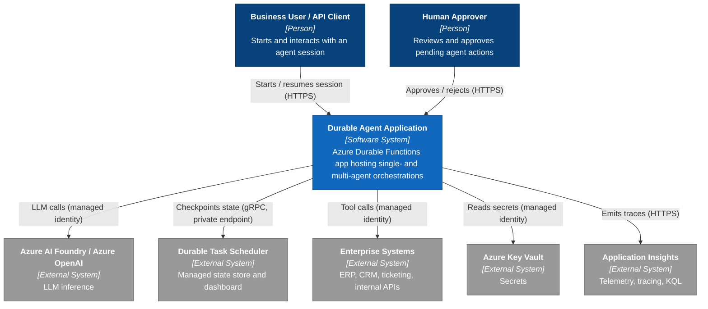
```mermaid
flowchart TB
    User["<b>Business User / API Client</b><br/><i>[Person]</i><br/>Starts and interacts with an agent session"]
    Approver["<b>Human Approver</b><br/><i>[Person]</i><br/>Reviews and approves pending agent actions"]

    System["<b>Durable Agent Application</b><br/><i>[Software System]</i><br/>Azure Durable Functions app hosting single- and multi-agent orchestrations"]

    AOAI["<b>Azure AI Foundry / Azure OpenAI</b><br/><i>[External System]</i><br/>LLM inference"]
    DTS["<b>Durable Task Scheduler</b><br/><i>[External System]</i><br/>Managed state store and dashboard"]
    Ent["<b>Enterprise Systems</b><br/><i>[External System]</i><br/>ERP, CRM, ticketing, internal APIs"]
    KV["<b>Azure Key Vault</b><br/><i>[External System]</i><br/>Secrets"]
    AppI["<b>Application Insights</b><br/><i>[External System]</i><br/>Telemetry, tracing, KQL"]

    User -->|"Starts / resumes session (HTTPS)"| System
    Approver -->|"Approves / rejects (HTTPS)"| System
    System -->|"LLM calls (managed identity)"| AOAI
    System -->|"Checkpoints state (gRPC, private endpoint)"| DTS
    System -->|"Tool calls (managed identity)"| Ent
    System -->|"Reads secrets (managed identity)"| KV
    System -->|"Emits traces (HTTPS)"| AppI

    classDef person fill:#08427b,stroke:#052e56,color:#fff
    classDef system fill:#1168bd,stroke:#0b4884,color:#fff
    classDef ext fill:#999999,stroke:#6b6b6b,color:#fff
    class User,Approver person
    class System system
    class AOAI,DTS,Ent,KV,AppI ext
```

### 3.1 Core Programming Model

A Durable Functions application is composed of four specialized function roles:

| Component | Role | Relevance to AI agents |
|---|---|---|
| Orchestrator | Coordinates workflow logic using ordinary code (loops, conditionals, try/catch); automatically checkpointed. | Encodes the agent's control flow — deterministic pipelines or LLM-directed tool loops — as durable, replayable code. |
| Activity | Performs a single unit of work; can run arbitrary, non-deterministic code (I/O, LLM calls, tool invocations). | Wraps every LLM call and every tool call so it is checkpointed exactly once and distributable across compute. |
| Entity | Manages a small, addressable piece of state with serialized (single-threaded) operations; no determinism restrictions. | Models a single agent session or conversation — the basis of the "entity-based agent loop" pattern used by the Agent Framework Durable Task extension. |
| Client | Starts, queries, signals, and terminates orchestrations and entities from outside the orchestration (e.g., an HTTP trigger). | The entry point an application, API gateway, or upstream system uses to launch or resume an agent session. |

**Diagram 2 (Class Diagram) — Durable Task core programming model**

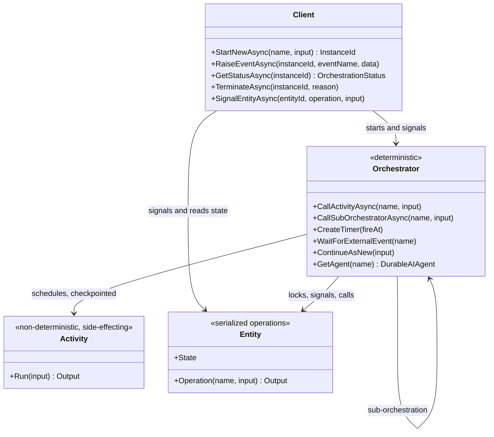
```mermaid
classDiagram
    class Client {
        +StartNewAsync(name, input) InstanceId
        +RaiseEventAsync(instanceId, eventName, data)
        +GetStatusAsync(instanceId) OrchestrationStatus
        +TerminateAsync(instanceId, reason)
        +SignalEntityAsync(entityId, operation, input)
    }
    class Orchestrator {
        <<deterministic>>
        +CallActivityAsync(name, input)
        +CallSubOrchestratorAsync(name, input)
        +CreateTimer(fireAt)
        +WaitForExternalEvent(name)
        +ContinueAsNew(input)
        +GetAgent(name) DurableAIAgent
    }
    class Activity {
        <<non-deterministic, side-effecting>>
        +Run(input) Output
    }
    class Entity {
        <<serialized operations>>
        +State
        +Operation(name, input) Output
    }
    Client --> Orchestrator : starts and signals
    Client --> Entity : signals and reads state
    Orchestrator --> Activity : schedules, checkpointed
    Orchestrator --> Entity : locks, signals, calls
    Orchestrator --> Orchestrator : sub-orchestration
```

### 3.2 Reliability Model: Event Sourcing and Checkpointing

Orchestrator functions use the event-sourcing pattern to maintain execution state reliably: rather than persisting a snapshot of current state, the Durable Task engine appends every scheduled action (activity call, sub-orchestration, timer) to an append-only history store. On every 'await'/'yield', the dispatcher commits new history events to storage and can then unload the orchestrator from memory. When new work arrives (an activity result, an external event, a timer firing), the orchestrator function replays from the start, and the runtime substitutes the already-recorded results for any call that already completed, so previously executed activities — crucially, already-completed and already-paid-for LLM calls — are never re-executed.

This is the single most consequential capability for AI agents in production: a failure between step 4 and step 5 of a ten-step agent workflow resumes at step 5, not step 1, so tokens already spent and time already elapsed are not wasted. Automatic, configurable retry policies (with back-off) apply the same reliability guarantee to individual LLM or tool calls that fail transiently.

**Diagram 3 (State Diagram) — Orchestration instance lifecycle**

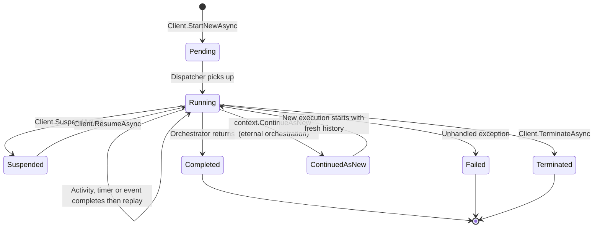
```mermaid
stateDiagram-v2
    [*] --> Pending : Client.StartNewAsync
    Pending --> Running : Dispatcher picks up
    Running --> Running : Activity, timer or event completes then replay
    Running --> Suspended : Client.SuspendAsync
    Suspended --> Running : Client.ResumeAsync
    Running --> Completed : Orchestrator returns
    Running --> Failed : Unhandled exception
    Running --> Terminated : Client.TerminateAsync
    Running --> ContinuedAsNew : context.ContinueAsNew (eternal orchestration)
    ContinuedAsNew --> Running : New execution starts with fresh history
    Completed --> [*]
    Failed --> [*]
    Terminated --> [*]
```

**Diagram 4 (Sequence Diagram) — Checkpoint and replay after a mid-workflow failure**

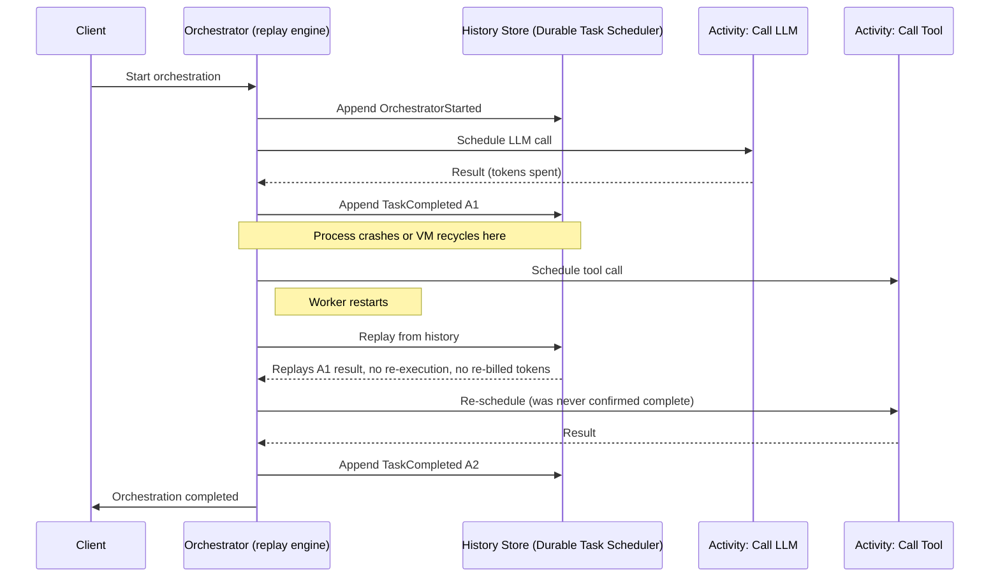
```mermaid
sequenceDiagram
    participant C as Client
    participant O as Orchestrator (replay engine)
    participant H as History Store (Durable Task Scheduler)
    participant A1 as Activity: Call LLM
    participant A2 as Activity: Call Tool

    C->>O: Start orchestration
    O->>H: Append OrchestratorStarted
    O->>A1: Schedule LLM call
    A1-->>O: Result (tokens spent)
    O->>H: Append TaskCompleted A1
    Note over O,H: Process crashes or VM recycles here
    O->>A2: Schedule tool call
    Note right of O: Worker restarts
    O->>H: Replay from history
    H-->>O: Replays A1 result, no re-execution, no re-billed tokens
    O->>A2: Re-schedule (was never confirmed complete)
    A2-->>O: Result
    O->>H: Append TaskCompleted A2
    O->>C: Orchestration completed
```

### 3.3 Hosting Plans and Scalability

Durable Functions inherits Azure Functions' hosting plan choices. The Flex Consumption plan is now Microsoft's recommended default for new serverless workloads (the legacy Windows/Linux Consumption plan is being phased out); Premium and Dedicated (App Service) plans remain available for workloads needing always-on instances, custom VM sizing, or larger scale. Azure Functions can also run inside Azure Container Apps for teams that want the Functions programming model with container flexibility and Kubernetes-based (KEDA) autoscaling.

| Plan | Scale-to-zero | Cold start mitigation | Max instances | VNet / private endpoints | Best fit for agent workloads |
|---|---|---|---|---|---|
| Flex Consumption (recommended) | Yes | Optional always-ready instances | 1,000 (per function group) | Yes | Default choice: bursty agent traffic, pay-per-execution, fast per-function scaling. |
| Premium | No (min. 1 instance) | Always-ready / pre-warmed instances | 100 (Win) / 20–100 (Linux) | Yes | Near-continuous agent traffic needing predictable latency and no cold starts. |
| Dedicated (App Service) | No | Not applicable (always on) | 10–30 (100 in ASE) | Yes | Workloads needing custom images, longest execution times, or App Service isolation. |
| Azure Functions on Container Apps | Yes (via KEDA, minReplicas=0) | Depends on minReplicas | 300–1,000 | Yes (Container Apps networking) | Agents needing custom containers, GPU-backed tool execution, Dapr, or co-location with other microservices. |

Regardless of plan, Durable Functions triggers (orchestration, activity, entity) scale as a group under Flex Consumption and Consumption, which matters for capacity planning: a spike in concurrent agent sessions scales the whole durable function group, not just the busiest function.

### 3.4 State Management and Storage Backends

Orchestration and entity state must be persisted to a backend so that execution history survives process recycling. Durable Functions supports several storage providers; Microsoft now recommends the Durable Task Scheduler as the default for new applications:

| Backend | Management overhead | Throughput | Monitoring | Notes |
|---|---|---|---|---|
| Durable Task Scheduler (recommended) | Fully managed — no storage account to provision | Up to 2,000 actions/sec per Capacity Unit (Dedicated SKU); 500 actions/sec (Consumption SKU) | Purpose-built dashboard + Application Insights | Push-based (gRPC) work-item delivery, no queue polling; migrating an existing app requires configuration only, no code changes. |
| Azure Storage (legacy default) | You own and manage the storage account | Lower; bounded by storage queue/table throughput and partition design | Application Insights + Storage Explorer | Still supported; higher operational overhead and less throughput at scale. |
| Netherite / Microsoft SQL Server | Self-managed | Netherite: very high throughput; MSSQL: moderate | Application Insights | Specialist backends for very high-scale or SQL-Server-centric enterprises. |

### 3.5 Monitoring, Diagnostics, and Observability

Application Insights is the recommended monitoring surface for Durable Functions and integrates by default: every orchestration lifecycle event (started, completed, failed) is emitted as a tracking event queryable via Kusto (KQL), distributed tracing produces Gantt-chart views of orchestration/activity timelines, and built-in Azure portal diagnostics ("Durable Functions detector") surface extension-version issues, stuck orchestrations, and performance regressions automatically. Applications on the Durable Task Scheduler additionally get a dedicated dashboard that shows per-agent-session conversation history, tool-call inspection, and orchestration/workflow execution traces — materially improving debuggability of agent behavior compared to inspecting raw LLM API logs.

Two disciplines are worth calling out for agent workloads specifically: replay-safe logging (orchestrator code re-executes on every replay, so naive logging duplicates messages unless the 'is-replaying' flag is checked) and input/output payload logging (disabled by default, since conversation content may be sensitive and full payload logging materially increases Application Insights cost).

### 3.6 Event-Driven Execution and Triggers

Beyond the HTTP-triggered client function used throughout Sections 3–4, Durable Functions inherits the full Azure Functions trigger surface for **starting or signaling** an agent orchestration, which is what the platform's "event-driven execution" capability refers to in practice. This matters for agent workloads whose work arrives as a system event rather than a user request — a document landing in storage, a business event on a bus, or a message on a queue.

| Trigger | Typical agent use | Notes |
|---|---|---|
| Blob storage trigger (event-based) | A new or updated document (contract, invoice, support ticket attachment) starts a document-intake or summarization orchestration. | The event-based implementation (backed by Event Grid) is recommended for lower latency and is the only implementation supported on Flex Consumption; it is required for storage accounts with a hierarchical namespace (ADLS Gen2). |
| Event Grid trigger | A business event (order placed, case escalated, resource provisioned) starts or signals an agent orchestration; conversely, Durable Functions can *publish* orchestration lifecycle events (`durable/orchestrator/Running`, `Completed`, etc.) to Event Grid for downstream systems to react to. | Bidirectional: Event Grid can both start orchestrations and receive status events emitted by them, which is useful for wiring an agent workflow into a broader enterprise event mesh. |
| Service Bus / Storage Queue trigger | A message from an upstream system (an integration queue, a batch job dispatcher) starts an orchestration via the client binding (`ScheduleNewOrchestrationInstanceAsync`) inside a queue-triggered function. | Service Bus is preferred over Storage Queues when message size, ordering (sessions), or dead-lettering semantics matter for the ingestion path. |
| Timer trigger | A recurring schedule (nightly batch enrichment, periodic compliance sweep) starts a fan-out/fan-in or Monitor-pattern orchestration without an external caller. | Complements, rather than duplicates, the in-orchestration Monitor pattern (Section 4.1), which handles polling *after* an orchestration has started. |

Because the orchestration/activity/entity triggers themselves poll the configured durable store internally (not the event source directly), the event-source trigger's only job is to call the durable client and start (or signal) an instance; all of the reliability guarantees described in Section 3.2 apply identically regardless of how the instance was started.

**Diagram 5 (Sequence Diagram) — Event-driven orchestration start from a Blob upload**

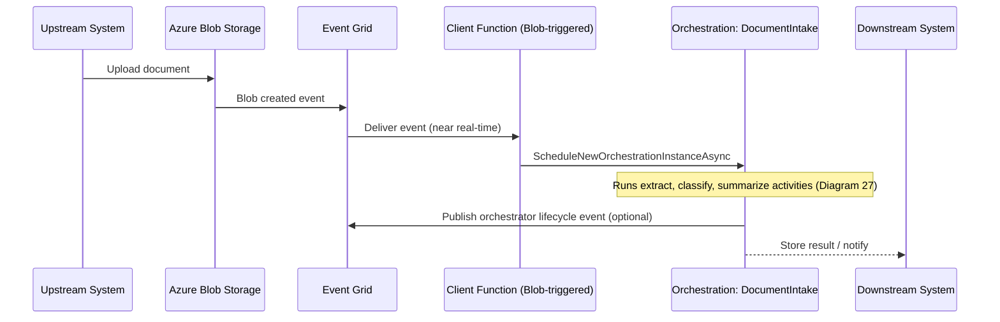
```mermaid
sequenceDiagram
    participant U as Upstream System
    participant Blob as Azure Blob Storage
    participant EG as Event Grid
    participant CF as Client Function (Blob-triggered)
    participant O as Orchestration: DocumentIntake
    participant Sink as Downstream System

    U->>Blob: Upload document
    Blob->>EG: Blob created event
    EG->>CF: Deliver event (near real-time)
    CF->>O: ScheduleNewOrchestrationInstanceAsync
    Note over O: Runs extract, classify, summarize activities (Diagram 27)
    O->>EG: Publish orchestrator lifecycle event (optional)
    O-->>Sink: Store result / notify
```

## 4. Orchestration Patterns for AI Agent Workloads

Durable Functions patterns fall into two layers: the long-standing, general-purpose Durable Functions patterns (applicable to any long-running workflow) and a newer set of agent-specific patterns documented directly against LLM-driven workloads. Both layers are additive — an agentic system typically composes several of them.

### 4.1 Foundational Durable Functions Patterns

- **Function chaining** — a sequence of activities executed in order, each consuming the previous step's output. The simplest building block for a single-agent pipeline (retrieve → reason → respond).
- **Fan-out / fan-in** — execute multiple activities (or agents) concurrently and aggregate their results once all complete. The documented pattern for translating one response into several languages concurrently, or for polling multiple specialist agents for independent opinions.
- **Async HTTP APIs** — orchestrations expose a built-in status-polling endpoint automatically, so a caller can start a long-running agent task and poll (or be notified) for completion without a custom implementation.
- **Monitor** — a recurring, durable-timer-driven check (e.g., polling an external system or watching for a condition) that can run indefinitely at low cost since compute is released between checks.
- **Human interaction / external events** — an orchestration waits for a named external event (e.g., an approval, an SMS confirmation code) with an optional timeout, releasing all compute while it waits.
- **Aggregator (stateful entities)** — durable entities accumulate state from multiple, possibly out-of-order, event sources — useful for maintaining a running conversation or shared 'scratchpad' across agent calls.
- **Event-driven / trigger-initiated orchestration** — rather than a caller invoking an HTTP endpoint, a system event (a blob upload, an Event Grid business event, a Service Bus message, or a timer) starts or signals the orchestration, as described in Section 3.6. This is the pattern behind system-of-record-driven agent ingestion (document intake, event-triggered enrichment) as distinct from user-initiated conversational sessions.

**Diagram 6 (Flowchart) — Function chaining pattern**

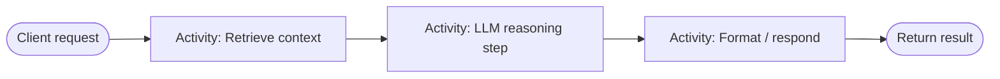
```mermaid
flowchart LR
    Start(["Client request"]) --> A1["Activity: Retrieve context"]
    A1 --> A2["Activity: LLM reasoning step"]
    A2 --> A3["Activity: Format / respond"]
    A3 --> End(["Return result"])
```

**Diagram 7 (Flowchart) — Fan-out / fan-in pattern**

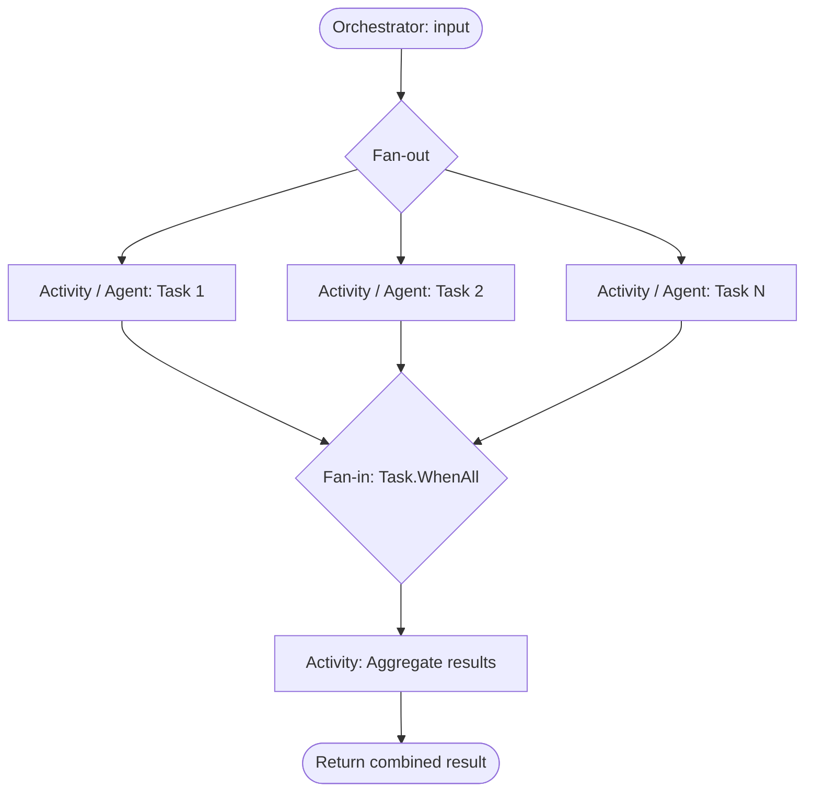
```mermaid
flowchart TB
    Start(["Orchestrator: input"]) --> F{"Fan-out"}
    F --> T1["Activity / Agent: Task 1"]
    F --> T2["Activity / Agent: Task 2"]
    F --> T3["Activity / Agent: Task N"]
    T1 --> J{"Fan-in: Task.WhenAll"}
    T2 --> J
    T3 --> J
    J --> Agg["Activity: Aggregate results"]
    Agg --> End(["Return combined result"])
```

**Diagram 8 (Sequence Diagram) — Async HTTP API (start / poll / status) pattern**

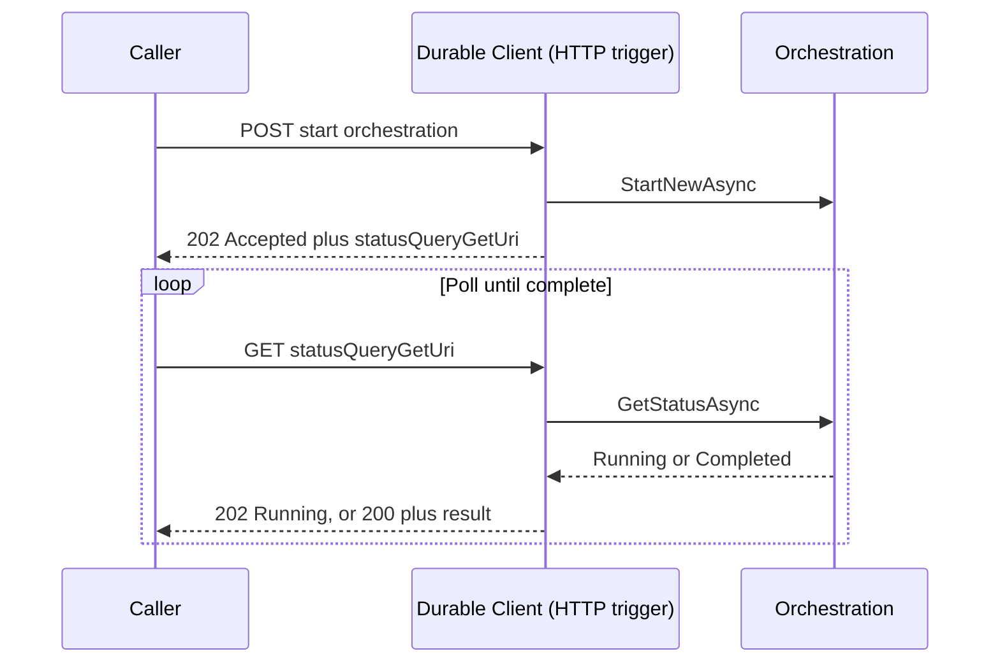
```mermaid
sequenceDiagram
    participant C as Caller
    participant Client as Durable Client (HTTP trigger)
    participant O as Orchestration
    C->>Client: POST start orchestration
    Client->>O: StartNewAsync
    Client-->>C: 202 Accepted plus statusQueryGetUri
    loop Poll until complete
        C->>Client: GET statusQueryGetUri
        Client->>O: GetStatusAsync
        O-->>Client: Running or Completed
        Client-->>C: 202 Running, or 200 plus result
    end
```

**Diagram 9 (Flowchart) — Monitor pattern**

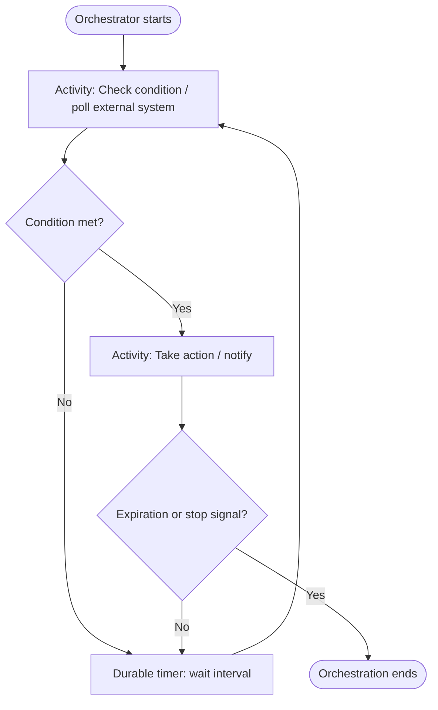
```mermaid
flowchart TB
    Start(["Orchestrator starts"]) --> Chk["Activity: Check condition / poll external system"]
    Chk --> D1{"Condition met?"}
    D1 -- No --> T["Durable timer: wait interval"]
    T --> Chk
    D1 -- Yes --> Act["Activity: Take action / notify"]
    Act --> Done{"Expiration or stop signal?"}
    Done -- No --> T
    Done -- Yes --> End(["Orchestration ends"])
```

**Diagram 10 (Sequence Diagram) — Human interaction / external event pattern**

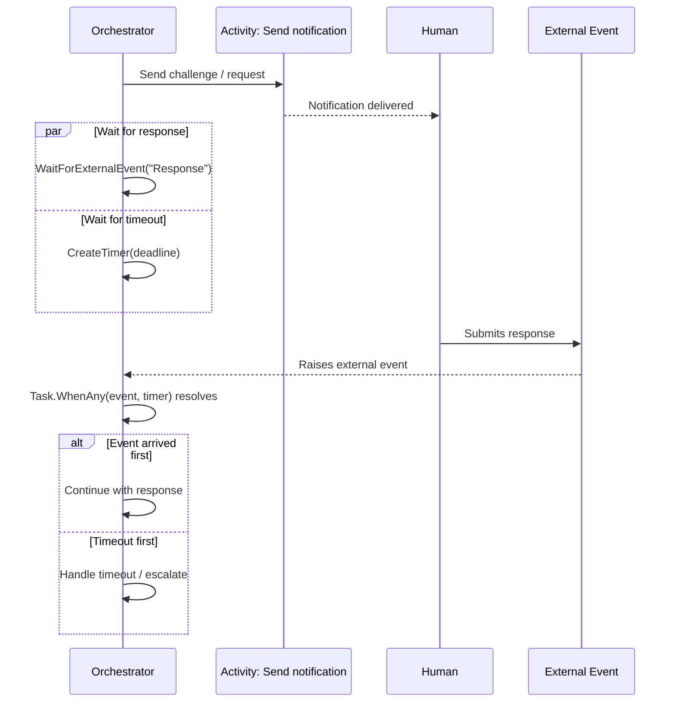
```mermaid
sequenceDiagram
    participant O as Orchestrator
    participant N as Activity: Send notification
    participant H as Human
    participant E as External Event

    O->>N: Send challenge / request
    N-->>H: Notification delivered
    par Wait for response
        O->>O: WaitForExternalEvent("Response")
    and Wait for timeout
        O->>O: CreateTimer(deadline)
    end
    H->>E: Submits response
    E-->>O: Raises external event
    O->>O: Task.WhenAny(event, timer) resolves
    alt Event arrived first
        O->>O: Continue with response
    else Timeout first
        O->>O: Handle timeout / escalate
    end
```

**Diagram 11 (Flowchart) — Aggregator entity pattern**

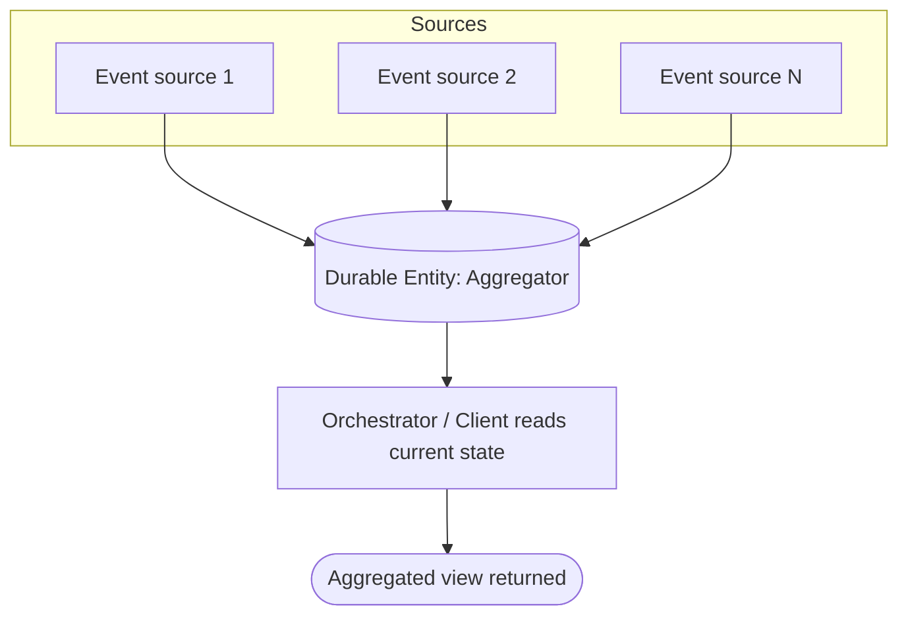
```mermaid
flowchart TB
    subgraph Sources
      S1["Event source 1"]
      S2["Event source 2"]
      S3["Event source N"]
    end
    S1 --> E[("Durable Entity: Aggregator")]
    S2 --> E
    S3 --> E
    E --> Q["Orchestrator / Client reads current state"]
    Q --> Out(["Aggregated view returned"])
```

### 4.2 Deterministic Workflow Patterns for Agentic AI

In a deterministic workflow, the orchestration code defines the control flow, and the LLM performs work inside individual steps but does not decide what happens next. Microsoft's Durable Task documentation explicitly aligns these with Anthropic's published agentic design patterns ("Building Effective Agents"):

| Pattern | Description | When to use |
|---|---|---|
| Prompt chaining | Sequential LLM calls with validation gates between steps. | Multi-stage generation with quality checks (e.g., draft → fact-check → finalize). |
| Routing | Classify the input, then dispatch to a specialized downstream agent or activity. | Triage / classification front doors (e.g., support ticket routing, spam detection). |
| Parallelization | Fan-out/fan-in across independent subtasks. | Independent analyses that can run concurrently (e.g., multi-perspective review). |
| Orchestrator-workers | An LLM plans a set of subtasks; workers execute them, dynamically. | Complex search or research tasks where the subtask list isn't known in advance. |
| Evaluator-optimizer | An iterative generate → critique → refine loop. | Iterative content refinement, code generation with automated review, literary translation. |

Deterministic workflows are the right default when the sequence of steps is knowable ahead of time, when compliance or auditability requires a reviewable control flow, or when the application must combine several AI frameworks (e.g., Semantic Kernel and direct model API calls) inside one workflow.

**Diagram 12 (Flowchart) — Prompt chaining with validation gates**

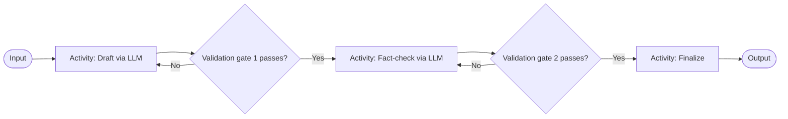
```mermaid
flowchart LR
    In(["Input"]) --> D1["Activity: Draft via LLM"]
    D1 --> V1{"Validation gate 1 passes?"}
    V1 -- No --> D1
    V1 -- Yes --> D2["Activity: Fact-check via LLM"]
    D2 --> V2{"Validation gate 2 passes?"}
    V2 -- No --> D2
    V2 -- Yes --> D3["Activity: Finalize"]
    D3 --> Out(["Output"])
```

**Diagram 13 (Flowchart) — Routing pattern**

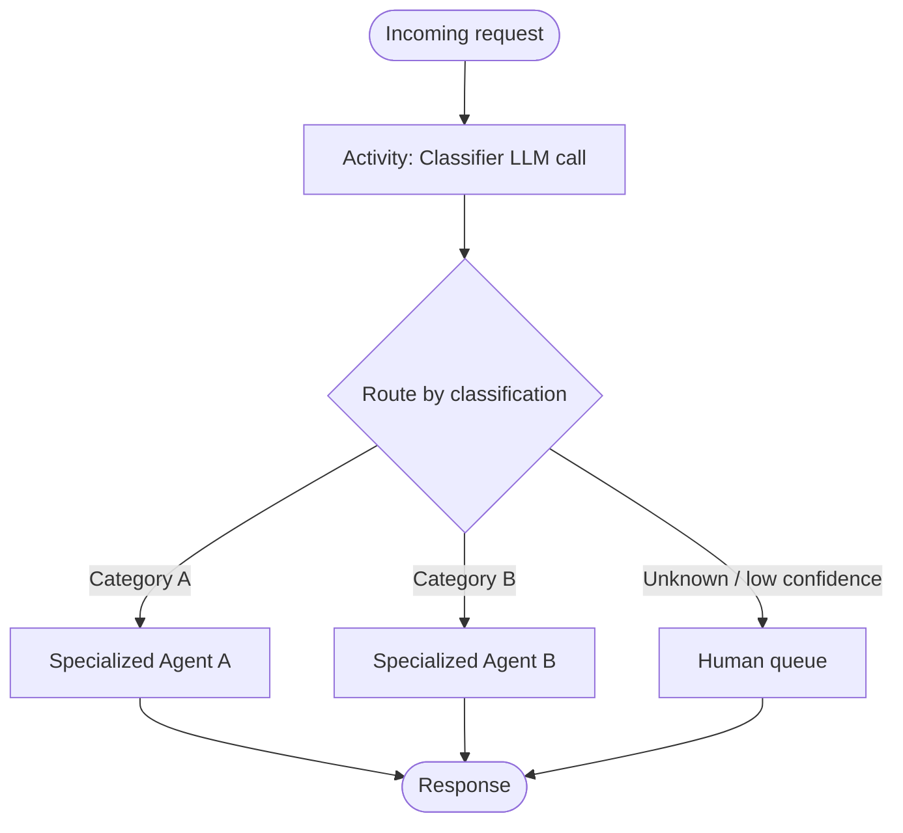
```mermaid
flowchart TB
    In(["Incoming request"]) --> C["Activity: Classifier LLM call"]
    C --> R{"Route by classification"}
    R -- Category A --> AgA["Specialized Agent A"]
    R -- Category B --> AgB["Specialized Agent B"]
    R -- Unknown / low confidence --> Human["Human queue"]
    AgA --> Out(["Response"])
    AgB --> Out
    Human --> Out
```

**Diagram 14 (Flowchart) — Orchestrator-workers pattern**

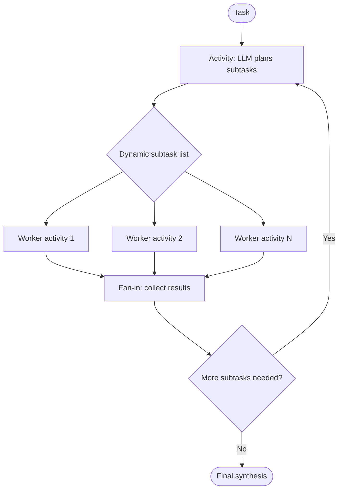
```mermaid
flowchart TB
    In(["Task"]) --> Plan["Activity: LLM plans subtasks"]
    Plan --> Dyn{"Dynamic subtask list"}
    Dyn --> W1["Worker activity 1"]
    Dyn --> W2["Worker activity 2"]
    Dyn --> Wn["Worker activity N"]
    W1 --> Collect["Fan-in: collect results"]
    W2 --> Collect
    Wn --> Collect
    Collect --> Review{"More subtasks needed?"}
    Review -- Yes --> Plan
    Review -- No --> Out(["Final synthesis"])
```

**Diagram 15 (Flowchart) — Evaluator-optimizer pattern**

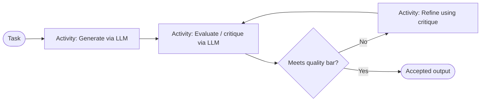
```mermaid
flowchart LR
    In(["Task"]) --> Gen["Activity: Generate via LLM"]
    Gen --> Eval["Activity: Evaluate / critique via LLM"]
    Eval --> Ok{"Meets quality bar?"}
    Ok -- No --> Refine["Activity: Refine using critique"]
    Refine --> Eval
    Ok -- Yes --> Out(["Accepted output"])
```

### 4.3 Agent-Directed Workflows (Agent Loops)

In an agent loop, the LLM itself decides which tools to call, in what order, and when the task is complete — the classic ReAct-style tool-calling loop. Durable Task supports two ways to make an agent loop durable:

| Approach | How it works | When to use |
|---|---|---|
| Orchestration-based | The loop itself is a durable orchestration: each iteration sends context to the LLM (via an activity or entity), executes any tool calls as activities, optionally waits on an external event for human input, and continues — using eternal orchestrations (continue-as-new) to bound memory. | Fine-grained control, per-tool retry policies, distributed tool execution, and step-by-step debuggability are required. |
| Entity-based | An existing agent framework's own loop (e.g., Microsoft Agent Framework, LangChain) is wrapped inside a durable entity, one entity instance per session; the entity persists conversation state and delegates execution to the framework's native loop. | You already use an agent framework with its own loop and want durability added as a hosting concern, with minimal code change. |

The entity-based approach is what the Durable Task extension for Microsoft Agent Framework implements internally (see section 4.6), and is generally the fastest path to production for teams already standardized on an agent SDK.

**Diagram 16 (Sequence Diagram) — Orchestration-based agent loop**

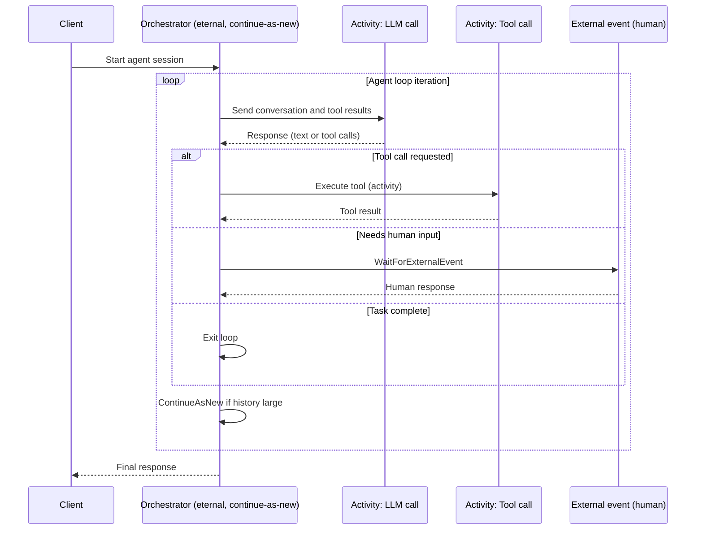
```mermaid
sequenceDiagram
    participant C as Client
    participant O as Orchestrator (eternal, continue-as-new)
    participant LLM as Activity: LLM call
    participant Tool as Activity: Tool call
    participant Ext as External event (human)

    C->>O: Start agent session
    loop Agent loop iteration
        O->>LLM: Send conversation and tool results
        LLM-->>O: Response (text or tool calls)
        alt Tool call requested
            O->>Tool: Execute tool (activity)
            Tool-->>O: Tool result
        else Needs human input
            O->>Ext: WaitForExternalEvent
            Ext-->>O: Human response
        else Task complete
            O->>O: Exit loop
        end
        O->>O: ContinueAsNew if history large
    end
    O-->>C: Final response
```

**Diagram 17 (Sequence Diagram) — Entity-based agent loop**

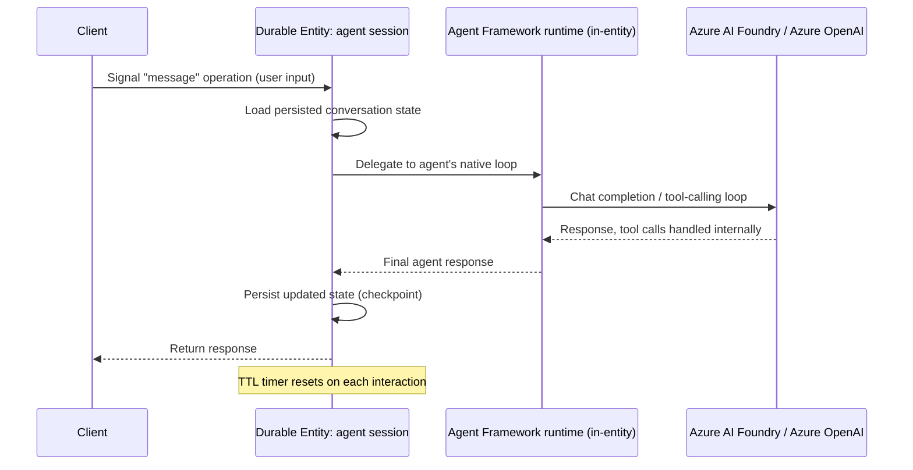
```mermaid
sequenceDiagram
    participant C as Client
    participant E as Durable Entity: agent session
    participant AF as Agent Framework runtime (in-entity)
    participant LLM as Azure AI Foundry / Azure OpenAI

    C->>E: Signal "message" operation (user input)
    E->>E: Load persisted conversation state
    E->>AF: Delegate to agent's native loop
    AF->>LLM: Chat completion / tool-calling loop
    LLM-->>AF: Response, tool calls handled internally
    AF-->>E: Final agent response
    E->>E: Persist updated state (checkpoint)
    E-->>C: Return response
    Note over E: TTL timer resets on each interaction
```

**Diagram 18 (State Diagram) — Durable agent session lifecycle with TTL**

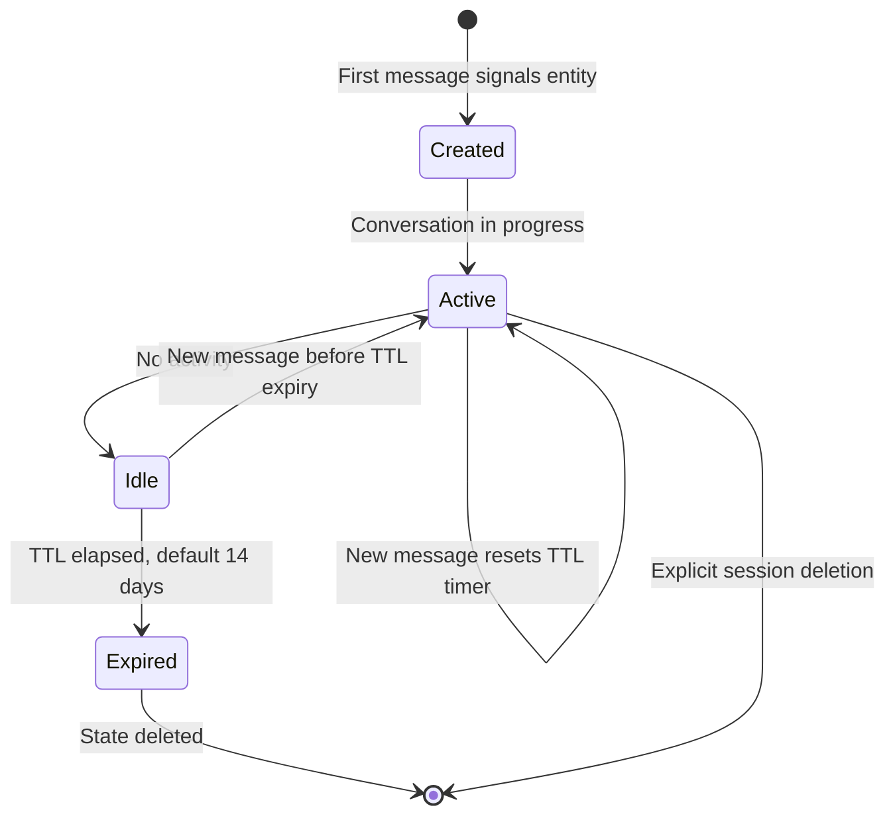
```mermaid
stateDiagram-v2
    [*] --> Created : First message signals entity
    Created --> Active : Conversation in progress
    Active --> Active : New message resets TTL timer
    Active --> Idle : No activity
    Idle --> Active : New message before TTL expiry
    Idle --> Expired : TTL elapsed, default 14 days
    Expired --> [*] : State deleted
    Active --> [*] : Explicit session deletion
```

### 4.4 Multi-Agent Orchestration Patterns

Multiple specialized agents can be coordinated as steps inside a single deterministic orchestration, with every agent call automatically checkpointed — the orchestration recovers and resumes without repeating completed agent calls if a step later fails.

- **Sequential orchestration** — agents run in a defined order and each agent's output can influence the next agent's execution or branching logic (e.g., a research agent feeds a writer agent, which feeds a publisher activity).
- **Parallel orchestration** — several agents execute concurrently against the same input (e.g., a physicist agent and a chemist agent both answer a science question) and their outputs are aggregated once all complete; failures during aggregation do not force already-completed agent calls to re-run.
- **Conditional / routing orchestration** — an agent's structured output (e.g., a spam/not-spam classification) determines which branch of the workflow executes next.
- **Graph-based workflows** — the newer, declarative WorkflowBuilder model in the Microsoft Agent Framework expresses a fixed graph topology of executors and agents (sequential, fan-out/fan-in, switch-case) with type-validated message routing; each step is automatically checkpointed. Workflows suit fixed topologies, while orchestrations suit imperative logic with conditional branching — the two are complementary, not competing, and can be combined.

**Diagram 19 (Sequence Diagram) — Sequential multi-agent orchestration**

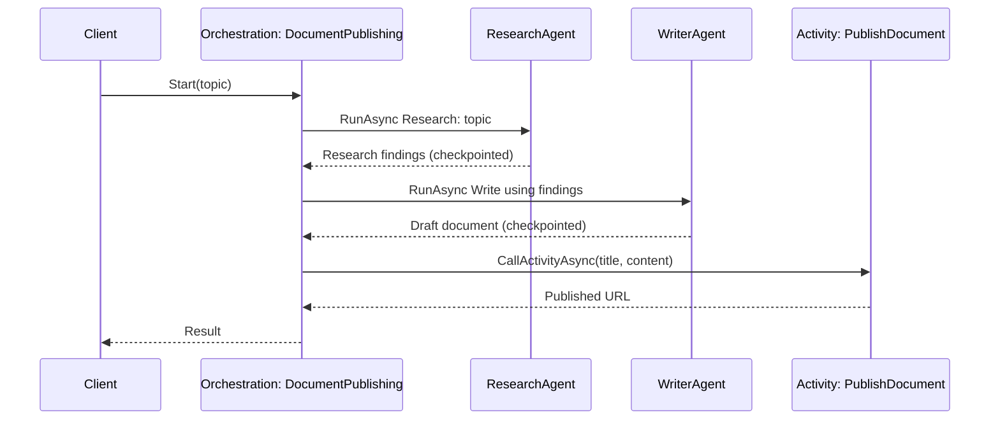
```mermaid
sequenceDiagram
    participant C as Client
    participant O as Orchestration: DocumentPublishing
    participant R as ResearchAgent
    participant W as WriterAgent
    participant P as Activity: PublishDocument

    C->>O: Start(topic)
    O->>R: RunAsync Research: topic
    R-->>O: Research findings (checkpointed)
    O->>W: RunAsync Write using findings
    W-->>O: Draft document (checkpointed)
    O->>P: CallActivityAsync(title, content)
    P-->>O: Published URL
    O-->>C: Result
```

**Diagram 20 (Flowchart) — Parallel multi-agent orchestration**

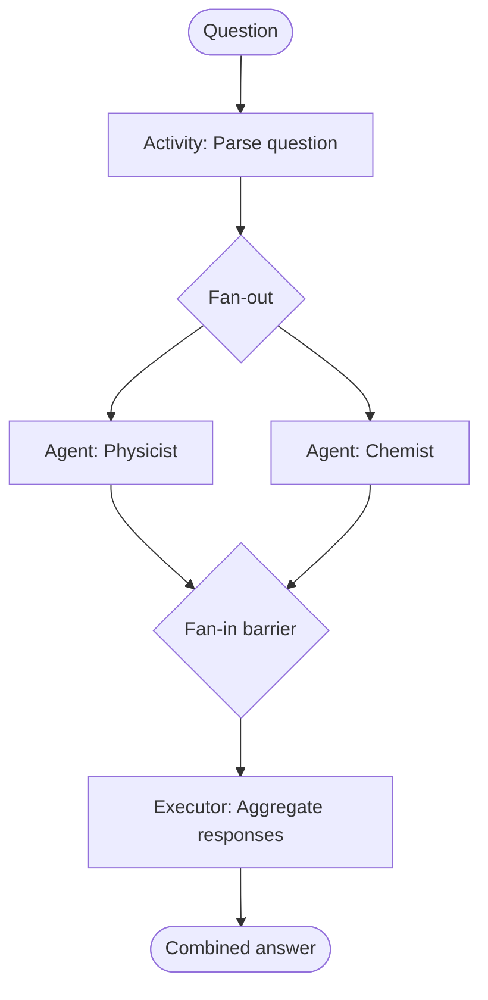
```mermaid
flowchart TB
    In(["Question"]) --> Parse["Activity: Parse question"]
    Parse --> FO{"Fan-out"}
    FO --> Phy["Agent: Physicist"]
    FO --> Chem["Agent: Chemist"]
    Phy --> FI{"Fan-in barrier"}
    Chem --> FI
    FI --> Agg["Executor: Aggregate responses"]
    Agg --> Out(["Combined answer"])
```

**Diagram 21 (Flowchart) — Conditional / routing multi-agent orchestration**

```mermaid
flowchart TB
    In(["Incoming email"]) --> Spam["Agent: SpamDetection"]
    Spam --> Chk{"is_spam?"}
    Chk -- true --> Handle["Executor: SpamHandler"]
    Chk -- false --> Assist["Agent: EmailAssistant"]
    Assist --> Send["Executor: EmailSender"]
    Handle --> Out(["Workflow output"])
    Send --> Out
```

**Diagram 22 (Flowchart) — Graph-based workflow (Agent Framework WorkflowBuilder)**

```mermaid
flowchart LR
    subgraph GraphWorkflow["Graph-Based Workflow"]
    N1["Executor: Start"] --> N2["Executor / Agent A"]
    N2 --> N3{"Switch-case"}
    N3 -- Case 1 --> N4["Executor / Agent B"]
    N3 -- Default --> N5["Executor / Agent C"]
    N4 --> N6["Fan-in"]
    N5 --> N6
    N6 --> N7["Executor: Yield output"]
    end
```

### 4.5 Human-in-the-Loop Patterns

Because an orchestration or a graph-based workflow can pause on a durable timer or an external event without consuming any compute while it waits, human approval steps that take minutes, hours, days, or weeks are inexpensive and reliable to model — a critical differentiator for enterprise agent workflows subject to review or compliance gates. The Agent Framework's graph-based workflow model formalizes this with a RequestPort primitive (C#) / ctx.request_info() (Python) that auto-generates three HTTP endpoints per workflow: start, status (including pending approvals), and respond. A documented example implements an expense-reimbursement workflow with a manager approval step followed by parallel budget and compliance approvals — directly analogous to common enterprise approval chains.

**Diagram 23 (Sequence Diagram) — Human-in-the-loop expense reimbursement workflow**

```mermaid
sequenceDiagram
    participant Emp as Employee
    participant O as Orchestration: ExpenseReimbursement
    participant Mgr as RequestPort: ManagerApproval
    participant Fin as Executor: PrepareFinanceReview
    participant Bud as RequestPort: BudgetApproval
    participant Comp as RequestPort: ComplianceApproval
    participant Reimb as Executor: Reimburse

    Emp->>O: POST /run expense request
    O->>Mgr: Pause, request manager approval
    Note over O: Zero compute consumed while waiting
    Mgr-->>O: POST /respond approved
    O->>Fin: PrepareFinanceReview
    par Parallel approvals
        O->>Bud: Pause, request budget approval
        Bud-->>O: Approved
    and
        O->>Comp: Pause, request compliance approval
        Comp-->>O: Approved
    end
    O->>Reimb: Process reimbursement
    Reimb-->>O: Done
    O-->>Emp: GET /status Completed
```

### 4.6 The Durable Task Extension for Microsoft Agent Framework

Released as part of the current Microsoft Agent Framework, the Durable Task extension is purpose-built to make agentic AI on Durable Functions turnkey. It registers a standard Agent Framework agent and, with a single configuration call, gives it:

- Persistent conversation sessions that survive process crashes, restarts, and scale events, implemented internally as an entity-based agent loop (one durable entity per session).
- Built-in HTTP API endpoints for starting, resuming, and querying agent sessions, with no custom endpoint code.
- Distributed, serverless scaling to thousands of concurrent sessions (or to zero) on the Flex Consumption plan.
- Configurable time-to-live (TTL) per agent or globally (default 14 days) that automatically deletes idle session state to bound storage growth and cost; each new interaction resets the TTL clock.
- Multi-agent orchestration via context.GetAgent() / app.get_agent(), which returns a checkpoint-aware DurableAIAgent wrapper usable inside a durable orchestration exactly like the sequential/parallel patterns above.

Because the extension is explicitly framework-agnostic at the Durable Task layer ("Durable Task isn't an agent framework — it works with any AI agent framework, including Microsoft Agent Framework, LangChain, or direct LLM API calls"), an organization is not locked into Microsoft Agent Framework to get durability; teams using other frameworks can adopt the more manual entity-wrapping pattern described in section 4.3.
## 5. Architectural Considerations

### 5.1 Determinism and Orchestrator Code Constraints

Orchestrator functions must be deterministic because they are rebuilt by replaying history on every wake-up: given the same history, an orchestrator must take the same actions. This rules out direct use of wall-clock time (use the context's CurrentUtcDateTime instead), random number/GUID generation (use the context's deterministic GUID API or push it into an activity), and any direct I/O or blocking call (wrap it in an activity). This constraint is well understood in the Azure Functions ecosystem but is new territory for teams arriving from general-purpose agent frameworks, and is the most common source of 'stuck orchestration' defects reported in the field. Entities and activities carry no such restriction, so LLM calls, tool calls, and any nondeterministic logic belong there, not in the orchestrator.

A related but distinct discipline — what happens when *deployed orchestrator code itself* changes while instances are still running — is covered separately in Section 5.5, because it is a deployment-time concern rather than an authoring-time one.

### 5.2 State, Payload, and Session Limits

The Durable Task Scheduler enforces a maximum payload size of 1 MB for orchestrator inputs/outputs, activity inputs/outputs, external event data, custom status, and entity state. For durable agents specifically, this caps total conversation history size: long-running conversations with large tool outputs can reach this ceiling, and Microsoft's documented mitigation is manual compaction — starting a new session and summarizing prior context — rather than automatic truncation. Orchestration instance IDs are capped at 100 characters. These limits should be treated as firm architectural inputs, not edge cases, for any conversational agent expected to run long sessions or process large documents or tool outputs; large-payload workarounds (external blob storage plus a reference) exist but add design complexity.

Two further constraints are specific to the durable-agent implementation: added latency, because every agent interaction is routed through the Durable Task Scheduler rather than served in-memory (an explicit, deliberate trade for durability and distributed scaling); and streaming, because the underlying entity communication model is request/response — token-level streaming to a client requires a side channel such as pushing tokens to a Redis Stream while the entity returns the complete response once generation finishes.

### 5.3 Security and Governance

Durable Functions inherits standard Azure Functions security controls, all of which apply directly to agent workloads that call external tools, internal enterprise APIs, or hold conversation data subject to compliance requirements:

- Managed identity for all outbound calls to Azure OpenAI / Azure AI Foundry, Key Vault, Service Bus, storage, and the Durable Task Scheduler itself — eliminating stored secrets and connection strings.
- Virtual network integration and private endpoints, available on Flex Consumption, Premium, and Dedicated plans (not on the legacy Consumption plan), to keep agent traffic, tool calls, and Durable Task Scheduler traffic off the public internet; the Scheduler itself supports private endpoints independently of the Functions app's networking.
- Azure Key Vault integration (including Flex Consumption's network-restricted Key Vault references) for any secrets that cannot be replaced by managed identity, with automatic rotation.
- Encryption at rest by default for the Durable Task Scheduler, with an optional customer-managed key (Dedicated SKU, preview) for organizations with key-lifecycle or separation-of-duties requirements.
- Network Security Perimeter and Web Application Firewall (via Application Gateway or Front Door) as additional layers for internet-facing agent endpoints.

None of this is agent-specific tooling — it is the same governance surface an enterprise already applies to any Azure Functions workload — which is itself a benefit: security and platform teams do not need a new operating model to bring agentic workloads under existing controls.

### 5.4 Cost Model

Total cost has two independent components: compute (billed by the Functions hosting plan) and the Durable Task Scheduler (billed separately, either Consumption SKU — pay-per-action-dispatched, up to 500 actions/sec, 30-day retention — or Dedicated SKU — fixed monthly cost per Capacity Unit, up to 2,000 actions/sec and 50 GB of orchestration data per CU, 90-day retention, and required for high availability). An 'action' is any dispatched message: starting an orchestration, scheduling an activity, completing a timer, or processing a result — so an agent loop with many small tool calls generates proportionally more billed actions than a coarse-grained pipeline of the same business value, which is worth accounting for when comparing an agent-loop design against a deterministic-workflow design for the same task.

Because compute scales to zero on Flex Consumption and idle agent sessions expire via TTL on the Durable Task Scheduler side, cost for spiky or long-tail enterprise agent traffic (the common shape for internal tools and approval workflows) is generally favorable compared to an always-on container or VM footprint sized for peak load.

### 5.5 Orchestrator Versioning and Safe Deployment

A durable orchestration can run for minutes, days, or indefinitely (an eternal, continue-as-new agent loop). Because the runtime rebuilds an orchestrator's state by replaying its history against the *currently deployed* orchestrator code, deploying a change to that code while instances created under the old code are still in flight is a distinct operational risk from the authoring-time determinism constraints in Section 5.1 — and one that is frequently missed until the first production incident.

**What counts as a breaking change.** Microsoft Learn identifies three question a team should ask before any deployment: did the change alter the name, input type, or output type of an activity or entity function; did it add, remove, or reorder calls to activities, sub-orchestrations, timers, or external events inside orchestrator code; and did it rename or remove a function that in-flight orchestrations might still call. A "yes" to any of these means an in-flight instance that resumes after the deployment will replay history against code that no longer produces the same sequence of calls — the runtime detects the mismatch and raises a nondeterminism error, and the affected instance can fail outright or get stuck indefinitely in the `Running` state.

**Mitigation strategies**, from most to least recommended for a production R&D platform:

| Strategy | Mechanism | Trade-off |
|---|---|---|
| Orchestration versioning (recommended) | A built-in runtime feature: each orchestration instance is permanently tagged with a version at creation; orchestrator code can branch on its own version; new workers can execute old-version instances, but old workers cannot execute new-version instances. Works with any storage backend, including the Durable Task Scheduler. | Requires the orchestrator to carry version-aware branching logic in the same codebase until old instances drain — a small, ongoing code-hygiene cost in exchange for zero-downtime deployment of breaking changes. |
| Side-by-side deployment (new task hub, new storage account, or deployment slots) | Deploy the changed code as a fully separate function app / task hub so old and new instances never share history. Deployment slots make the cutover a slot swap. | Full isolation, but doubles running infrastructure during the transition and (for non-HTTP triggers) requires trigger configuration to be driven from an app setting that the slot swap updates. |
| Stop all in-flight instances | Clear the control/work-item queues (or restart the app) so old instances stop rather than fail loudly. | Simplest option, but loses any in-flight agent sessions — acceptable for prototyping and local development, not for a production conversational agent or an in-progress approval workflow. |

For a durable AI agent specifically, orchestration versioning is the most consequential of the three: an entity-based or eternal agent-loop session can be "in flight" for the entire TTL window (14 days by default), so a team shipping weekly is guaranteed to have live sessions spanning a code change. The recommendation for this R&D initiative is to adopt orchestration versioning from the first PoC that moves beyond a throwaway prototype, rather than retrofitting it once real users depend on long-lived sessions.

**Diagram 24 (Flowchart) — Orchestrator versioning during a rolling deployment**

```mermaid
flowchart TB
    subgraph Before["Before deployment"]
        OldWorkers["Workers: orchestrator v1"]
        OldInstances["Running instances: version 1"]
        OldWorkers -->|executes| OldInstances
    end

    Deploy["Deploy orchestrator v2 with version-aware branching"] --> During

    subgraph During["During rolling deployment"]
        NewWorkers["Workers: orchestrator v1 and v2 coexist"]
        V1Instances["Existing instances: version 1"]
        V2Instances["New instances: version 2 (defaultVersion)"]
        NewWorkers -->|"can execute (backward compatible)"| V1Instances
        NewWorkers -->|"executes"| V2Instances
    end

    During --> After

    subgraph After["Old instances drained"]
        AllWorkers["Workers: orchestrator v2"]
        AllInstances["All running instances: version 2"]
        AllWorkers --> AllInstances
    end
```

### 5.6 LLM Rate Limits, Quotas, and Backpressure

Durable Functions' automatic retry policies interact directly with Azure OpenAI / Azure AI Foundry Models' quota system, and the interaction is easy to get wrong in a way that makes throttling worse rather than better. Azure OpenAI assigns each deployment a Tokens-Per-Minute (TPM) and a proportional Requests-Per-Minute (RPM) limit; both are enforced on rolling short windows (not evenly over a full minute), so even traffic that is below the per-minute average can trigger a `429` response if it arrives in a burst. Every response includes rate-limit headers (`x-ratelimit-remaining-requests`, `x-ratelimit-remaining-tokens`, and on a `429`, `retry-after-ms`) that an activity function can read to throttle proactively rather than reactively.

This matters architecturally for two reasons specific to durable agent workloads:

- **Fan-out amplifies burst risk.** The fan-out/fan-in and batch-enrichment patterns (Sections 4.1 and 7) can schedule hundreds or thousands of activities that each call the LLM; without deliberate throttling, the durable runtime's own retry-on-transient-failure behavior can compound with the client SDK's retry-on-429 behavior, multiplying request volume during exactly the window when the deployment is already saturated. Unsuccessful requests still count toward the per-minute limit, so naive, unbounded retries actively worsen a throttling episode.
- **Retry policy configuration should defer to the `retry-after` signal.** The Azure OpenAI SDKs implement exponential backoff with jitter and honor `retry-after-ms` by default; when an activity function wraps the SDK call in a Durable Functions retry policy as well, the two retry layers should be reconciled deliberately (for example, by disabling the SDK's own retries and handling backoff once, at the activity-retry-policy level) rather than left to compound implicitly.

**Practical mitigations**, in order of architectural leverage: cap `max_tokens` to the scenario's real needs (the TPM estimate counts the requested maximum, not the actual completion length); distribute high fan-out workloads across multiple deployments or regions rather than a single deployment; prefer asynchronous/queued processing for batch or non-interactive scenarios so requests can be paced deliberately instead of arriving as a burst; and, for an agent loop or fan-out orchestration with a known concurrency profile, use a durable entity as an explicit token-budget or concurrency gate that activities check in with before calling the model — turning an implicit, retry-driven throttle into an explicit, observable one. Provisioned Throughput Units (PTUs) are the platform-level alternative for workloads that need guaranteed, non-shared throughput rather than best-effort pay-as-you-go capacity.

**Diagram 25 (Sequence Diagram) — Rate-limit-aware LLM call with entity-based throttling**

```mermaid
sequenceDiagram
    participant O as Orchestrator (fan-out)
    participant Gate as Durable Entity: TokenBudgetGate
    participant A as Activity: Call LLM
    participant AOAI as Azure OpenAI deployment

    O->>Gate: Signal: request budget slot
    Gate-->>O: Slot granted (within TPM/RPM budget)
    O->>A: Schedule LLM call
    A->>AOAI: Chat completion request
    alt Within limits
        AOAI-->>A: 200 response plus rate-limit headers
        A-->>O: Result
    else 429 Too Many Requests
        AOAI-->>A: 429 plus retry-after-ms
        A->>A: Backoff for retry-after-ms (single retry layer)
        A->>AOAI: Retry request
        AOAI-->>A: 200 response
        A-->>O: Result
    end
    O->>Gate: Signal: release budget slot
```

### 5.7 Disaster Recovery and Multi-Region Considerations

Durable Functions state (orchestration and entity history) is only as resilient as the backend it is persisted to, so a disaster-recovery plan for a durable agent application must address compute and state as separate failure domains. Microsoft documents three active/passive configurations; for applications on the Durable Task Scheduler, the recommended approach is the regional-storage pattern:

| Scenario | Protects against | Data loss on failover | Cross-region latency | Relative cost |
|---|---|---|---|---|
| Shared storage/scheduler across regions | Compute outage only | None | Yes (state stays in the primary region) | Low |
| Regional storage/scheduler per region (recommended for Durable Task Scheduler) | Compute *and* storage/scheduler outage | In-flight orchestrations and entities are paused (not lost) until the primary region recovers | None after failover | Medium |
| Shared geo-redundant storage (Azure Storage backend only) | Compute and storage outage, with data replication | Possible loss of the most recent transactions (asynchronous replication lag) | Yes, until DNS failover completes | High |

For an agent application, the practical implication of the recommended (regional-storage) scenario is important to set expectations on: a regional failover does not resume in-progress agent sessions in the failover region — they remain paused, unavailable until the primary region recovers, while Azure Traffic Manager (or an equivalent) redirects new traffic to the healthy region. This is an acceptable trade-off for most internal enterprise agent tools (a paused approval workflow resumes once the region recovers, with no data loss) but should be stated explicitly in any production readiness sign-off, since it differs from "seamless failover" as commonly understood for stateless APIs. Applications with a harder continuity requirement should evaluate the Durable Task Scheduler's private-endpoint and regional-deployment options together with an explicit RTO/RPO target as part of production hardening (Section 9.1, Phase 4).

## 6. Benefits, Limitations, and Trade-offs vs. Alternative Approaches

Several viable approaches exist on Azure for hosting agentic workloads. This section compares Durable Functions against the most relevant alternatives along the dimensions that matter for an enterprise adoption decision, starting with the most basic alternative — not using Durable Functions' orchestration capability at all.

### 6.1 Durable Functions vs. Stateless Azure Functions (No Orchestration)

The simplest alternative to Durable Functions is not a different product but a different design choice: a plain, stateless Azure Function (HTTP-, queue-, or Event Grid-triggered) that calls the LLM directly and returns a response, with no orchestration extension involved. Microsoft's own guidance for Azure Functions in general recommends writing functions to be stateless and idempotent by default, associating any required state with the data being processed rather than with the function itself — which is precisely the model a simple single-turn agent call (classify this ticket, summarize this paragraph) fits well.

| Dimension | Stateless Azure Function | Durable Functions |
|---|---|---|
| State across steps/turns | None built in — the caller or an external store (Cosmos DB, a cache, a database row) must carry state between calls. | Built in — orchestration history and entity state are automatically persisted and replayed. |
| Multi-step workflows | Must be hand-built: a second function, a queue message, or a Logic App is needed to chain steps, and failure-recovery logic (what ran, what didn't) is the application's responsibility. | Native: function chaining, fan-out/fan-in, and agent loops are first-class, automatically checkpointed constructs (Section 4). |
| Failure recovery mid-workflow | Whatever the function's own retry/idempotency design provides; a crash mid-multi-step-process typically means re-doing completed steps (and re-spending LLM tokens) unless the application implements its own checkpointing. | Automatic: replay-based recovery resumes at the last incomplete step, without re-executing completed activities (Section 3.2). |
| Long waits (human approval, polling) | Impractical to hold a function instance open for minutes to weeks; requires an external durable store plus a re-entry mechanism built by hand. | Native: `WaitForExternalEvent` and durable timers release compute while waiting, for durations from seconds to months (Section 4.5). |
| Operational complexity | Lower — no orchestration engine, no task hub/Scheduler backend to provision, no determinism discipline to learn. | Higher — an additional backend (Durable Task Scheduler or Azure Storage), the determinism constraint (5.1), and the versioning discipline (5.5) are new surface area. |
| Cost | Marginally lower — no Scheduler action-dispatch cost on top of compute. | Compute plus Scheduler actions-dispatched cost (Section 5.4), generally modest for bursty traffic but a real second line item. |
| Best fit | A single-turn, stateless agent call with no multi-step workflow, no human-in-the-loop wait, and where the caller can tolerate re-issuing the request on failure (e.g., a synchronous classification or extraction endpoint called from a UI that will retry on error). | Any workload where the value comes from a multi-step, stateful, or long-waiting process — which, per the enterprise use cases in Section 7, is the majority of enterprise agent scenarios that justify R&D investment. |

The practical decision rule this comparison supports: reach for a plain stateless Azure Function when an agent interaction is genuinely a single request/response call with no state to carry forward and no wait longer than an HTTP timeout; reach for Durable Functions as soon as the workload has more than one step whose completion must survive a failure, or any wait — human approval, a scheduled follow-up, a multi-turn conversation — measured in more than a few seconds. Most of the enterprise use cases motivating this research (Section 7) fall on the Durable Functions side of that line, which is why the remainder of this document treats Durable Functions, not stateless Functions, as the default execution framework under evaluation; this section exists so that the "why not just a stateless function" question raised in the original research TODO has an explicit, evidence-based answer rather than an implicit one.

### 6.2 Durable Functions vs. Standalone Durable Task SDKs (Container Apps / AKS)

Since 2025, the Durable Task engine underlying Durable Functions is also available as standalone SDKs that run on any compute platform without the Azure Functions runtime — the same orchestration, activity, entity, timer, and external-event primitives, the same recommended Durable Task Scheduler backend, but a different hosting and operational model.

| Dimension | Durable Functions (Azure Functions) | Standalone Durable Task SDKs (Container Apps / AKS / VMs) |
|---|---|---|
| Compute coupling | Coupled to the Azure Functions runtime | Decoupled — runs on any container platform |
| Triggers | Built-in HTTP, Queue, Timer, Event Grid, and other Functions triggers | You define your own entry points |
| Management HTTP APIs | Built in (start / status / raise-event / terminate) | You implement them yourself |
| Storage backends | Durable Task Scheduler, Azure Storage, MSSQL, Netherite | Durable Task Scheduler only |
| Portability | Requires the Azure Functions runtime | Runs unchanged on AKS, App Service, VMs, on-premises |
| Pricing model | Serverless (Consumption/Flex) or dedicated compute | Pay for your own container/VM compute |
| Best fit | Quick prototyping, declarative triggers/bindings, teams standardized on Azure Functions, scale-to-zero economics | Teams with existing Kubernetes/container platforms, need for GPU workload profiles or Dapr, or requiring compute portability across clouds |

For a .NET shop already operating on Azure Functions, Durable Functions is the lower-friction choice; for a team standardized on AKS/Container Apps with existing GPU or Dapr requirements, the standalone SDKs deliver the same durability guarantees without adopting a second compute runtime.

### 6.3 Durable Task vs. Agent Framework Workflows vs. Logic Apps Agent Loop

Microsoft documentation directly compares three agentic-workflow options on Azure that are easy to conflate:

| Capability | Durable Task | Agent Framework workflows | Logic Apps agent loop |
|---|---|---|---|
| Control flow | Imperative (code) | Graph-based (code) | Declarative (designer / JSON) |
| Languages | .NET, Python, Java, JS/TS | .NET, Python | Visual designer / JSON |
| AI framework support | Any (Semantic Kernel, LangChain, AutoGen, direct API) | Optimized for Agent Framework | Built-in AI connectors |
| Hosting | Azure Functions or any host | Any; first-class Foundry Hosted Agents | Logic Apps managed service |
| State storage | Durable Task Scheduler (managed) | Bring your own (checkpoint manager) | Logic Apps runtime (managed) |
| Long-running tasks | First-class (hours to eternal) | Via developer-controlled checkpointing | Stateful workflows only (up to 90 days) |
| Failure recovery | Automatic | Manual | Automatic |
| Target audience | Backend developers | Application developers | Integration / low-code users |

For an R&D team of professional .NET developers, Durable Task (via Durable Functions) sits in the sweet spot: full code control and automatic failure recovery, without the declarative low-code constraints of Logic Apps or the currently more manual checkpointing story of raw Agent Framework workflows outside the Durable Task extension.

### 6.4 Where Durable Functions Fits Among Agent Frameworks

It is important to separate orchestration frameworks that define how agents collaborate (Semantic Kernel's Agent Orchestration — Concurrent, Sequential, Handoff, Group Chat, Magentic — or LangGraph) from execution frameworks that define how that logic runs reliably in production (Durable Functions / Durable Task). These are complementary, not competing, layers: Semantic Kernel or Agent Framework can define which agents talk to which, in what pattern, while Durable Functions/Durable Task ensures that pattern executes reliably, checkpointed, and recoverable across process restarts, deployments, and scaling events. The Durable Task extension for Microsoft Agent Framework is precisely this combination made turnkey. Teams should resist framing this as an either/or choice: the realistic architecture for most enterprises is an agent framework of choice for agent definition and tool-calling, hosted durably on Azure Functions.

The decision tree below summarizes how these dimensions combine into a practical framework and hosting choice, now including the stateless-function branch from Section 6.1 as the first decision point.

**Diagram 26 (Flowchart) — Decision tree for agent framework and hosting choice**

```mermaid
flowchart TD
    Q1{"Multi-step workflow, or any wait beyond an HTTP timeout?"} -- No --> Simple["Stateless Azure Function (Section 6.1)"]
    Q1 -- Yes --> Q1b{"Need automatic checkpointing and failure recovery?"}
    Q1b -- No --> Simple2["Stateless Function plus hand-rolled state store"]
    Q1b -- Yes --> Q2{"Already standardized on Azure Functions runtime?"}
    Q2 -- Yes --> Q3{"Need custom containers, GPU, or Dapr?"}
    Q3 -- Yes --> AFCA["Azure Functions on Container Apps"]
    Q3 -- No --> DF["Durable Functions + Durable Task Scheduler"]
    Q2 -- No --> Q4{"Need Kubernetes/AKS or multi-cloud portability?"}
    Q4 -- Yes --> SDK["Standalone Durable Task SDK on AKS, Container Apps, or VM"]
    Q4 -- No --> Q5{"Low-code integration team, declarative designer preferred?"}
    Q5 -- Yes --> Logic["Logic Apps Agent Loop"]
    Q5 -- No --> Q6{"Building purely with Microsoft Agent Framework graphs?"}
    Q6 -- Yes --> AFW["Agent Framework Workflows with own checkpoint manager"]
    Q6 -- No --> DF
```

### 6.5 Summary of Benefits, Limitations, and Risk Register

**Benefits**

- Automatic checkpointing and replay-based recovery eliminate repeated LLM spend and lost state on failure — the single highest-value capability for production agent workloads.
- Native support for both deterministic pipelines and LLM-directed agent loops, plus multi-agent fan-out/fan-in, sequential hand-off, and conditional routing, without bespoke state-machine code.
- First-class, low-cost human-in-the-loop support: an orchestration can wait hours or weeks for approval while consuming zero compute.
- Native event-driven ingestion (Blob, Event Grid, Service Bus, Queue, timer triggers) in addition to HTTP, so agent workflows can be started by system events, not only by direct API calls (Section 3.6).
- Serverless economics (scale to zero, pay-per-action Durable Task Scheduler Consumption SKU) fit the bursty, long-tail traffic shape typical of internal enterprise agent tools.
- Reuses existing enterprise Azure governance: managed identity, VNet/private endpoints, Key Vault, Application Insights, and existing CI/CD — no new operating model for security or platform teams.
- Framework-agnostic at the Durable Task layer: works with Microsoft Agent Framework, Semantic Kernel, LangChain, AutoGen, or direct model API calls.
- A built-in, backend-agnostic orchestration-versioning feature enables zero-downtime deployment of breaking orchestrator changes without hand-rolled side-by-side infrastructure (Section 5.5).

**Limitations**

- 1 MB payload/state ceiling on orchestration inputs/outputs, activity I/O, external events, and entity state — a hard constraint for very large documents, tool outputs, or unbounded conversation history without manual compaction or external blob references.
- Added latency versus in-memory agent execution, because interactions are routed through the Durable Task Scheduler; not the right fit for sub-second, highly interactive chat experiences.
- No native token-level streaming; a side channel (e.g., Redis Streams) is required to stream partial LLM output to a client.
- Orchestrator determinism constraints are an additional discipline for teams new to the platform, and the most common source of production defects ('stuck' orchestrations) when violated.
- Deploying changed orchestrator code to instances already in flight is a distinct, easy-to-miss operational risk that requires a deliberate versioning strategy (Section 5.5), not just careful authoring.
- Durable Functions' own retry policies can compound with an LLM SDK's built-in retry-on-429 behavior, worsening a rate-limit episode if the two are not reconciled deliberately (Section 5.6).
- A regional failover pauses, rather than resumes, in-flight agent sessions in the recovery region under the recommended DR topology — an explicit continuity trade-off that must be documented, not assumed away (Section 5.7).
- GPU-bound inference or heavy media/vision processing is not a Durable Functions strength; such workloads are better delegated to Container Apps (serverless or dedicated GPU workload profiles) or a dedicated inference service, invoked as an activity.
- Migrating to the Durable Task Scheduler, while low-effort, is an additional resource and cost line versus a pure compute bill, and requires regional co-location planning for latency-sensitive scenarios.

**Risk register.** The table below reframes the limitations above as a prioritized register with severity, likelihood, and the primary mitigation, to make the trade-offs actionable for a go/no-go and production-readiness discussion rather than only descriptive.

| Risk | Severity if unmitigated | Likelihood | Primary mitigation |
|---|---|---|---|
| Breaking orchestrator change deployed without a versioning strategy corrupts in-flight sessions | High (stuck/failed instances, lost agent sessions) | High — the default deployment path has no built-in protection | Adopt orchestration versioning from the first non-throwaway PoC (5.5); production readiness checklist item (9.2) |
| LLM rate-limit storms during fan-out under load | Medium–High (cascading 429s, degraded throughput, wasted retries) | Medium — grows with scale and fan-out width | Reconcile SDK and Durable Functions retry layers; entity-based throttle gate for high-fan-out scenarios (5.6) |
| Conversation/document payload exceeds the 1 MB ceiling | Medium (hard failure or truncation if undesigned) | Medium — common for long conversations or large document tool outputs | Design compaction/summarization and blob-reference patterns before they are needed (5.2, 8.3) |
| Regional outage during an in-flight, long-running approval workflow | Medium (delayed, not lost, business process) | Low–Medium | Regional Scheduler deployment plus Traffic Manager failover; document the pause-not-resume behavior to stakeholders (5.7) |
| Determinism violation in orchestrator code | Medium (stuck orchestration, requires code fix and redeploy) | Medium — most common in early PoC work before the team internalizes the constraint | Roslyn Analyzer (C#) / code-review checklist; keep all I/O in activities (5.1) |
| Streaming/low-latency requirement misapplied to a durable-agent design | Low–Medium (poor UX, not a data-loss risk) | Low, if the decision tree (6.4) is used during framework selection | Route latency-sensitive, sub-second conversational scenarios to Container Apps or a non-durable path instead |
## 7. Enterprise Use Cases and Pattern Mapping

The following use cases represent common enterprise and R&D scenarios where Durable Functions is a strong architectural fit, mapped to the orchestration pattern(s) from section 4 that apply. A dedicated flow diagram follows the table for each use case. Several of these — most directly the document-intake pipeline and the compliance-monitoring agent — are natural fits for the event-driven, trigger-initiated pattern introduced in Sections 3.6 and 4.1, rather than a caller-invoked HTTP start.

| Use case | Primary pattern(s) | Why Durable Functions fits |
|---|---|---|
| Document / contract intake and summarization pipeline | Function chaining; deterministic prompt-chaining; event-driven (Blob/Event Grid) start | Predictable, auditable multi-step pipeline (extract → classify → summarize → store) with guaranteed exactly-once processing per document, startable directly from a document landing in storage. |
| Expense, procurement, or contract approval assistant | Human-in-the-loop; sequential + parallel approvals | Orchestration can wait hours to weeks for manager and finance approval at zero compute cost, with full audit trail via execution history. |
| Customer support triage and routing | Routing pattern; conditional workflow | LLM classifies intent/sentiment, then deterministically routes to a specialized agent or human queue, with retry on transient LLM/API failures. |
| Multi-perspective research or due-diligence assistant | Fan-out/fan-in; parallel multi-agent orchestration | Several specialist agents (legal, financial, technical) analyze the same input concurrently; results are aggregated once all complete, with no wasted work if one branch fails and retries. |
| Autonomous coding / DevOps agent (code generation with review) | Evaluator-optimizer; orchestration-based agent loop | Iterative generate-review-refine loop benefits from per-iteration checkpointing and the ability to pause for a human code-review gate. |
| Long-running conversational assistant / internal copilot | Entity-based agent loop; Agent Framework Durable Task extension | Persistent, checkpointed session state per user survives restarts and scale events; TTL bounds storage growth for inactive users. |
| Autonomous research agent with open-ended tool use | Orchestrator-workers; agent-directed loop | Subtask list is not known in advance; the LLM plans and the orchestration distributes and checkpoints each generated subtask as an activity. |
| Compliance monitoring / scheduled data-quality agent | Monitor pattern (durable timers); event-driven (timer-triggered) start | Recurring, low-cost checks that release compute between runs, with a durable, queryable history of every check performed. |
| Cross-department multi-agent workflow (e.g., quote-to-order) | Sequential + conditional multi-agent orchestration; graph-based workflow | Multiple specialized agents and deterministic business steps interleave, with type-validated message routing and automatic recovery at each stage. |
| Batch enrichment of a large dataset via LLM (e.g., product catalog tagging) | Fan-out/fan-in at scale | Thousands of independent, parallelizable LLM calls distributed across compute with automatic retry and result aggregation; scale-to-zero after completion — see Section 5.6 for rate-limit-aware design at this scale. |

Across these use cases, the common enabling thread is that the enterprise value comes from reliability and auditability of a multi-step process at least as much as from raw model capability — which is precisely the property Durable Functions is designed to guarantee.

**Diagram 27 — Use case: Document / contract intake and summarization pipeline**

```mermaid
flowchart LR
    Doc(["Incoming document"]) --> Ex["Activity: Extract text / fields"]
    Ex --> Cl["Activity: Classify document type"]
    Cl --> Sum["Activity: Summarize via LLM"]
    Sum --> St["Activity: Store result and index"]
    St --> Done(["Stored, exactly-once processed"])
```

**Diagram 28 — Use case: Expense / procurement approval assistant**

```mermaid
sequenceDiagram
    participant Req as Requester
    participant O as Orchestration
    participant Mgr as Manager (external event)
    participant Fin as Finance (external event)
    Req->>O: Submit request
    O->>Mgr: Wait for approval (durable timer + event)
    Mgr-->>O: Approved
    O->>Fin: Wait for finance sign-off
    Fin-->>O: Approved
    O-->>Req: Notify approved and processed
```

**Diagram 29 — Use case: Customer support triage and routing**

```mermaid
flowchart TB
    T(["Support ticket"]) --> Cls["Activity: LLM intent and sentiment classification"]
    Cls --> Dec{"Route"}
    Dec -- Billing --> AgentBilling["Specialist Agent: Billing"]
    Dec -- Technical --> AgentTech["Specialist Agent: Technical"]
    Dec -- Escalation needed --> HumanQ["Human agent queue"]
    AgentBilling --> Resp(["Response to customer"])
    AgentTech --> Resp
    HumanQ --> Resp
```

**Diagram 30 — Use case: Multi-perspective research / due-diligence assistant**

```mermaid
flowchart TB
    In(["Due-diligence request"]) --> FO{"Fan-out"}
    FO --> Legal["Agent: Legal review"]
    FO --> Fin2["Agent: Financial review"]
    FO --> Tech["Agent: Technical review"]
    Legal --> FI{"Fan-in"}
    Fin2 --> FI
    Tech --> FI
    FI --> Report["Activity: Compile combined report"]
    Report --> Out(["Due-diligence report"])
```

**Diagram 31 — Use case: Autonomous coding / DevOps agent**

```mermaid
flowchart LR
    Task(["Coding task"]) --> Gen["Activity: LLM generates code / PR"]
    Gen --> AutoReview["Activity: Automated review and tests"]
    AutoReview --> Pass{"Tests pass?"}
    Pass -- No --> Gen
    Pass -- Yes --> Human["External event: Human code review"]
    Human --> Approved{"Approved?"}
    Approved -- No, changes requested --> Gen
    Approved -- Yes --> Merge["Activity: Merge / deploy"]
    Merge --> Out(["Change shipped"])
```

**Diagram 32 — Use case: Long-running conversational assistant / internal copilot**

```mermaid
sequenceDiagram
    participant User
    participant E as Durable Entity: User Session
    participant Agent as Internal Copilot Agent
    participant LLM as Azure OpenAI
    User->>E: Message (Monday)
    E->>Agent: Delegate with persisted history
    Agent->>LLM: Chat call
    LLM-->>Agent: Response
    Agent-->>E: Persist and reply
    E-->>User: Reply (Monday)
    Note over E: App restarts or redeploys, session state intact
    User->>E: Message (Thursday)
    E->>Agent: Delegate with persisted history
    Agent-->>E: Reply
    E-->>User: Reply (Thursday)
```

**Diagram 33 — Use case: Autonomous research agent with open-ended tool use**

```mermaid
flowchart TB
    Q(["Research question"]) --> Plan["LLM: Plan subtopics"]
    Plan --> Sub1["Worker: Investigate subtopic 1"]
    Plan --> Sub2["Worker: Investigate subtopic 2"]
    Plan --> SubN["Worker: Investigate subtopic N"]
    Sub1 --> Merge["Fan-in: Merge findings"]
    Sub2 --> Merge
    SubN --> Merge
    Merge --> More{"Gaps identified?"}
    More -- Yes --> Plan
    More -- No --> Final["LLM: Synthesize final report"]
    Final --> Out(["Research report"])
```

**Diagram 34 — Use case: Compliance monitoring / scheduled data-quality agent**

```mermaid
flowchart TB
    Start(["Eternal orchestration starts"]) --> Check["Activity: Run data-quality / compliance check"]
    Check --> Issue{"Issue found?"}
    Issue -- Yes --> Alert["Activity: Raise alert / ticket"]
    Alert --> Wait["Durable timer: wait next interval"]
    Issue -- No --> Wait
    Wait --> Check
```

**Diagram 35 — Use case: Cross-department multi-agent workflow (quote-to-order)**

```mermaid
flowchart LR
    Quote(["Quote request"]) --> Sales["Agent: Sales configurator"]
    Sales --> Pricing["Activity: Pricing engine"]
    Pricing --> Credit{"Credit check agent"}
    Credit -- Approved --> Legal2["Agent: Contract review"]
    Credit -- Declined --> Reject(["Reject / escalate"])
    Legal2 --> Order["Activity: Create order in ERP"]
    Order --> Fulfill(["Order fulfillment triggered"])
```

**Diagram 36 — Use case: Batch enrichment of a large dataset via LLM**

```mermaid
flowchart TB
    Batch(["Product catalog: N items"]) --> FO{"Fan-out N activities"}
    FO --> I1["Activity: Enrich item 1 via LLM"]
    FO --> I2["Activity: Enrich item 2 via LLM"]
    FO --> In2["Activity: Enrich item N via LLM"]
    I1 --> FI{"Fan-in"}
    I2 --> FI
    In2 --> FI
    FI --> Write["Activity: Bulk write enriched catalog"]
    Write --> Out(["Catalog updated, scale-to-zero"])
```

## 8. High-Level Reference Architecture

### 8.1 Single-Agent Reference Architecture

A minimal, production-oriented single-agent deployment on Durable Functions consists of the following components:

- **Client entry point:** an HTTP-triggered client function (or the Agent Framework extension's auto-generated endpoints) that starts or resumes an agent session and returns a status/polling URL; for event-driven scenarios (Section 3.6), a Blob-, Event Grid-, or Service Bus-triggered function fills the same role.
- **Orchestrator or durable entity:** the agent's control flow — either an orchestration implementing an agent loop, or a durable entity wrapping an existing agent framework's own loop (entity-based pattern).
- **Activities:** one activity per external effect — the LLM call itself (e.g., to Azure AI Foundry / Azure OpenAI via managed identity), each tool invocation, and any call to internal enterprise APIs or data stores.
- **Durable Task Scheduler:** the managed backend for orchestration/entity state, accessed over a private endpoint from within the application's virtual network.
- **Downstream services:** Azure AI Foundry / Azure OpenAI for model inference, Azure Key Vault for any remaining secrets, and enterprise systems of record accessed via managed identity and private endpoints.
- **Observability:** Application Insights (distributed tracing, KQL queries, replay-safe logging) paired with the Durable Task Scheduler dashboard for conversation-level and orchestration-level visibility.

**Diagram 37 (C4 Container) — Single-agent reference architecture**

```mermaid
flowchart TB
    User["<b>Client / Upstream System</b><br/><i>[Person]</i><br/>Starts or resumes an agent session"]

    subgraph Boundary["Durable Functions App — Flex Consumption [Software System Boundary]"]
        direction TB
        ClientFn["<b>Client Function</b><br/><i>[Container: HTTP / event trigger]</i><br/>Starts/resumes sessions, returns status URL"]
        Orchestrator["<b>Orchestrator / Durable Entity</b><br/><i>[Container: Durable Task]</i><br/>Agent control flow: deterministic pipeline or agent loop"]
        Activities["<b>Activity Functions</b><br/><i>[Container: Durable Task Activities]</i><br/>LLM calls, tool calls, enterprise API calls"]
    end

    DTS[("<b>Durable Task Scheduler</b><br/><i>[External Container: Managed PaaS]</i><br/>Orchestration and entity state, checkpoint history")]
    AOAI["<b>Azure AI Foundry / Azure OpenAI</b><br/><i>[External System]</i><br/>LLM inference"]
    Ent["<b>Enterprise APIs / Data Stores</b><br/><i>[External System]</i><br/>Systems of record"]
    Blob[("<b>Azure Blob Storage</b><br/><i>[External Container: Object store]</i><br/>Large documents and tool outputs")]
    KV["<b>Azure Key Vault</b><br/><i>[External System]</i><br/>Secrets"]
    AppI["<b>Application Insights</b><br/><i>[External System]</i><br/>Observability"]

    User -->|"HTTPS, or Blob/Event Grid/Service Bus event"| ClientFn
    ClientFn -->|"Starts / signals"| Orchestrator
    Orchestrator -->|"Schedules, checkpointed"| Activities
    Orchestrator -->|"Checkpoints history (gRPC, private endpoint)"| DTS
    Activities -->|"Inference calls (managed identity)"| AOAI
    Activities -->|"Tool / API calls (managed identity)"| Ent
    Activities -->|"Reads/writes large payloads"| Blob
    Orchestrator -->|"Reads secrets"| KV
    ClientFn -.->|Telemetry| AppI
    Orchestrator -.->|Telemetry| AppI

    classDef person fill:#08427b,stroke:#052e56,color:#fff
    classDef container fill:#1168bd,stroke:#0b4884,color:#fff
    classDef ext fill:#999999,stroke:#6b6b6b,color:#fff
    class User person
    class ClientFn,Orchestrator,Activities container
    class DTS,AOAI,Ent,Blob,KV,AppI ext
```

### 8.2 Multi-Agent Reference Architecture

A multi-agent deployment layers on top of the single-agent architecture:

- A top-level orchestration (or graph-based workflow) coordinates two or more specialized agents, each registered independently at application startup and retrieved inside the orchestration via the durable-agent accessor (context.GetAgent() / app.get_agent()).
- Sequential, parallel (fan-out/fan-in), and conditional edges compose the multi-agent flow; RequestPort / request_info() nodes introduce human-approval gates where required by business process.
- Each specialized agent can itself be a full agent loop (durable entity or sub-orchestration) with its own tools, so complexity is encapsulated rather than flattened into one giant orchestration.
- A shared durable entity (or entities) can serve as a coordination point — an aggregator, a distributed lock (critical section), a shared scratchpad, or the token-budget throttle gate described in Section 5.6 — when agents need to synchronize on shared state outside the parent orchestration's direct control flow.

**Diagram 38 (C4 Container) — Multi-agent reference architecture**

```mermaid
flowchart TB
    User["<b>Client / Upstream System</b><br/><i>[Person]</i>"]
    Approver["<b>Human Approver</b><br/><i>[Person]</i>"]

    subgraph Boundary["Durable Functions App [Software System Boundary]"]
        direction TB
        ClientFn["<b>Client Function</b><br/><i>[Container: HTTP trigger]</i><br/>Starts multi-agent workflow"]
        TopOrch["<b>Top-Level Orchestration / Graph Workflow</b><br/><i>[Container: Durable Task]</i><br/>Sequential, parallel and conditional coordination"]
        AgentA["<b>Agent: Research</b><br/><i>[Container: Durable Entity]</i>"]
        AgentB["<b>Agent: Writer</b><br/><i>[Container: Durable Entity]</i>"]
        AgentC["<b>Agent: Reviewer</b><br/><i>[Container: Durable Entity]</i>"]
        Shared["<b>Shared Aggregator Entity</b><br/><i>[Container: Durable Entity]</i><br/>Cross-agent scratchpad, lock, and rate-limit gate"]
        Activities["<b>Activity Functions</b><br/><i>[Container: Durable Task Activities]</i><br/>Tool calls, publishing"]
    end

    DTS[("<b>Durable Task Scheduler</b><br/><i>[External Container: Managed PaaS]</i><br/>State and checkpoint history for orchestration and all agent entities")]
    AOAI["<b>Azure AI Foundry / Azure OpenAI</b><br/><i>[External System]</i>"]

    User -->|HTTPS| ClientFn
    ClientFn --> TopOrch
    TopOrch -->|"context.GetAgent / RunAsync"| AgentA
    TopOrch -->|"context.GetAgent / RunAsync"| AgentB
    TopOrch -->|"context.GetAgent / RunAsync"| AgentC
    TopOrch -->|"Signals / reads state"| Shared
    TopOrch --> Activities
    TopOrch -->|"RequestPort: waits for approval"| Approver
    AgentA -->|Inference| AOAI
    AgentB -->|Inference| AOAI
    AgentC -->|Inference| AOAI
    TopOrch -->|"Checkpoints (gRPC)"| DTS

    classDef person fill:#08427b,stroke:#052e56,color:#fff
    classDef container fill:#1168bd,stroke:#0b4884,color:#fff
    classDef ext fill:#999999,stroke:#6b6b6b,color:#fff
    class User,Approver person
    class ClientFn,TopOrch,AgentA,AgentB,AgentC,Shared,Activities container
    class DTS,AOAI ext
```

### 8.3 Implementation Considerations

- **Backend selection:** start new projects on the Durable Task Scheduler (Consumption SKU for PoC/dev, Dedicated SKU sized by projected actions/second for production) rather than the legacy Azure Storage provider.
- **Networking:** deploy on Flex Consumption or Premium (not legacy Consumption) if VNet integration or private endpoints to the Scheduler, Key Vault, or Azure AI Foundry are required, which is the norm for enterprise data-governance requirements.
- **Identity:** use managed identity end-to-end — to the Durable Task Scheduler, to Azure AI Foundry/Azure OpenAI, to Key Vault, and to any internal APIs — to avoid storing model or tool credentials.
- **Payload discipline:** keep orchestration/activity/entity payloads well under the 1 MB ceiling; store large documents or tool outputs in Blob Storage and pass references, and design conversation-history compaction (summarization) before it is needed rather than after a session fails.
- **Determinism discipline:** enforce orchestrator code constraints via the Durable Functions Roslyn Analyzer (for C#) and code review checklists for other languages; keep all LLM calls, tool calls, and other I/O inside activities or entities, never directly in orchestrator code.
- **Versioning discipline:** decide on an orchestration-versioning strategy (Section 5.5) before the first PoC that will carry real, multi-day agent sessions — retrofitting it after a breaking deployment has already stuck production instances is materially more expensive than adopting it up front.
- **Rate-limit discipline:** for any fan-out or batch-enrichment design, model the expected concurrent LLM call volume against the target deployment's TPM/RPM quota during design, not after the first throttling incident in testing (Section 5.6).
- **Testing and local development:** the Durable Task Scheduler emulator (a Docker container) plus the Azurite storage emulator together provide a full local development loop with no Azure subscription required, including a local copy of the Scheduler's monitoring dashboard; pair this with the built-in unit-testing approach for orchestrator functions (mocking the orchestration context in C#/Python, or the in-memory `DurableTaskTestHost` / `TestOrchestrationWorker` test harnesses available for the standalone SDKs) so that orchestrator control-flow logic is covered by fast, deterministic tests before a change reaches the versioning concerns above.
- **Cost governance:** configure TTL per agent to bound storage growth from abandoned sessions, and monitor actions-dispatched against the chosen Scheduler SKU's throughput ceiling before it becomes a production incident.
- **Language and team fit:** C#/.NET and Python have the deepest, most current first-party support (including the Agent Framework Durable Task extension); JavaScript/TypeScript and Java support exists but trails slightly in agent-specific tooling as of this writing.

## 9. Recommendations for R&D Adoption

### 9.1 Proof-of-Concept Roadmap

A staged approach lets the team validate platform fit and build internal expertise before committing to production-scale investment:

- **Phase 1 — Deterministic single-agent pipeline (2–4 weeks):** implement a function-chaining or prompt-chaining pipeline for a real internal task (e.g., document summarization or ticket triage) on Flex Consumption with the Durable Task Scheduler Consumption SKU, using the Durable Task Scheduler emulator and Azurite for local development from day one. Goal: validate the core developer experience, checkpointing behavior under induced failures, and Application Insights / Scheduler dashboard observability.
- **Phase 2 — Human-in-the-loop workflow (2–3 weeks):** extend or build a second PoC that pauses for an approval step using external events or a graph-based workflow's RequestPort, to validate the zero-compute-while-waiting model and the auto-generated status/respond endpoints.
- **Phase 3 — Multi-agent fan-out (3–4 weeks):** implement a sequential-plus-parallel multi-agent scenario (e.g., a research agent feeding two or three specialist review agents) using either raw orchestrations or the Agent Framework Durable Task extension's context.GetAgent() pattern, to validate multi-agent checkpointing and aggregation, and to exercise the rate-limit-aware design from Section 5.6 under realistic fan-out width.
- **Phase 4 — Production hardening:** introduce VNet integration and private endpoints, managed identity across all downstream calls, an orchestration-versioning strategy, TTL and payload governance, a chosen and documented disaster-recovery topology, load testing against the target Durable Task Scheduler SKU and Azure OpenAI deployment quota, and a security/compliance review before promoting any PoC to a production workload handling real customer or business data.

**Diagram 39 (Gantt Chart) — Proof-of-concept roadmap timeline**

```mermaid
gantt
    title Proof-of-Concept Roadmap
    dateFormat  YYYY-MM-DD
    axisFormat  %b %d
    section Phase 1 - Deterministic pipeline
    Design and local dev setup   :p1a, 2026-10-01, 5d
    Build pipeline               :p1b, after p1a, 10d
    Validate checkpointing       :p1c, after p1b, 5d
    section Phase 2 - Human-in-the-loop
    Design approval flow        :p2a, after p1c, 5d
    Build and test               :p2b, after p2a, 8d
    section Phase 3 - Multi-agent fan-out
    Design multi-agent and rate-limit handling :p3a, after p2b, 5d
    Build and test                :p3b, after p3a, 12d
    section Phase 4 - Production hardening
    Networking, identity, versioning strategy :p4a, after p3b, 7d
    DR topology and load/resilience testing   :p4b, after p4a, 7d
    Security and compliance review             :p4c, after p4b, 5d
```

### 9.2 Production Readiness Checklist

- Backend: Durable Task Scheduler sized (Consumption vs. Dedicated) by measured actions-per-second, with a documented capacity-planning calculation.
- Networking: VNet integration and private endpoints configured for the Functions app, the Scheduler, and all downstream Azure services.
- Identity: managed identity used for every downstream call; no connection strings or API keys in application settings.
- Observability: Application Insights distributed tracing and replay-safe logging enabled; Durable Task Scheduler dashboard access provisioned for the operations team; alerting on failed/stuck orchestrations via the built-in detector or custom KQL alerts.
- Data governance: payload size discipline enforced; conversation TTL configured; any input/output payload logging reviewed against data-classification policy before enabling.
- **Versioning: an orchestration-versioning or side-by-side deployment strategy is documented and has been exercised at least once against a real breaking change before go-live (Section 5.5).**
- **Rate limits: fan-out/high-volume paths have been load-tested against the target Azure OpenAI deployment's TPM/RPM quota, with retry-layer reconciliation (SDK vs. Durable Functions) confirmed (Section 5.6).**
- **Disaster recovery: a DR topology has been selected and its data-loss/latency/cost trade-offs documented and accepted by the business owner, including the pause-not-resume behavior of in-flight sessions on regional failover (Section 5.7).**
- Resilience testing: induced-failure testing (kill the process mid-orchestration, mid-activity) to confirm resumption behavior matches expectations before go-live.
- Cost monitoring: budget alerts on both the Functions compute plan and the Durable Task Scheduler SKU, reviewed against the capacity-planning baseline.

## 10. Conclusion

Azure Durable Functions, paired with the Durable Task Scheduler and the newly introduced Durable Task extension for Microsoft Agent Framework, is a credible and increasingly purpose-built execution framework for enterprise AI agents — particularly for workloads whose defining requirement is reliability, auditability, and graceful recovery across long-running, tool-augmented, and human-gated processes rather than sub-second conversational latency. It integrates cleanly with an existing Azure and .NET investment, imposes a well-documented (if initially unfamiliar) determinism discipline, supports both request-driven and event-driven ingestion, and interoperates with, rather than competes against, agent-definition frameworks such as Microsoft Agent Framework, Semantic Kernel, and LangChain. Against the simplest alternative — a plain stateless Azure Function — the case for Durable Functions rests specifically on multi-step state, failure recovery, and long waits (Section 6.1); for a single-turn, stateless agent call, the added operational surface of Durable Functions is not justified. For scenarios demanding GPU-bound inference, sub-second streaming interaction, or full container/Kubernetes portability, Azure Container Apps or the standalone Durable Task SDKs are the more appropriate execution layer — optionally still built on the same Durable Task engine.

This revision's additional coverage of orchestrator versioning, LLM rate-limit interaction, and disaster recovery (Sections 5.5–5.7) does not change the overall recommendation, but it does change what "production-ready" means in practice: these three disciplines, not just the determinism constraint already documented in v1.1, should be treated as first-class production-readiness gates (Section 9.2) rather than issues to be discovered in operation. The recommended path forward remains the phased PoC program in Section 9, informing a subsequent, use-case-specific investment decision for production adoption within the R&D initiative.

## 11. Diagram Index

| # | Diagram | Type | Section |
|---|---|---|---|
| 1 | Durable Agent Application — system context | C4 Context (flowchart) | 3 |
| 2 | Durable Task core programming model | Class diagram | 3.1 |
| 3 | Orchestration instance lifecycle | State diagram | 3.2 |
| 4 | Checkpoint and replay after failure | Sequence diagram | 3.2 |
| 5 | Event-driven orchestration start from a Blob upload | Sequence diagram | 3.6 |
| 6 | Function chaining pattern | Flowchart | 4.1 |
| 7 | Fan-out / fan-in pattern | Flowchart | 4.1 |
| 8 | Async HTTP API pattern | Sequence diagram | 4.1 |
| 9 | Monitor pattern | Flowchart | 4.1 |
| 10 | Human interaction / external event pattern | Sequence diagram | 4.1 |
| 11 | Aggregator entity pattern | Flowchart | 4.1 |
| 12 | Prompt chaining with validation gates | Flowchart | 4.2 |
| 13 | Routing pattern | Flowchart | 4.2 |
| 14 | Orchestrator-workers pattern | Flowchart | 4.2 |
| 15 | Evaluator-optimizer pattern | Flowchart | 4.2 |
| 16 | Orchestration-based agent loop | Sequence diagram | 4.3 |
| 17 | Entity-based agent loop | Sequence diagram | 4.3 |
| 18 | Durable agent session lifecycle (TTL) | State diagram | 4.3 |
| 19 | Sequential multi-agent orchestration | Sequence diagram | 4.4 |
| 20 | Parallel multi-agent orchestration | Flowchart | 4.4 |
| 21 | Conditional / routing multi-agent orchestration | Flowchart | 4.4 |
| 22 | Graph-based workflow (WorkflowBuilder) | Flowchart | 4.4 |
| 23 | Human-in-the-loop expense reimbursement | Sequence diagram | 4.5 |
| 24 | Orchestrator versioning during a rolling deployment | Flowchart | 5.5 |
| 25 | Rate-limit-aware LLM call with entity-based throttling | Sequence diagram | 5.6 |
| 26 | Decision tree: framework and hosting choice | Flowchart | 6.4 |
| 27 | Use case: document / contract intake | Flowchart | 7 |
| 28 | Use case: expense / procurement approval | Sequence diagram | 7 |
| 29 | Use case: customer support triage | Flowchart | 7 |
| 30 | Use case: multi-perspective due-diligence | Flowchart | 7 |
| 31 | Use case: autonomous coding / DevOps agent | Flowchart | 7 |
| 32 | Use case: internal copilot | Sequence diagram | 7 |
| 33 | Use case: autonomous research agent | Flowchart | 7 |
| 34 | Use case: compliance monitoring | Flowchart | 7 |
| 35 | Use case: quote-to-order multi-agent workflow | Flowchart | 7 |
| 36 | Use case: batch enrichment at scale | Flowchart | 7 |
| 37 | Single-agent reference architecture | C4 Container (flowchart) | 8.1 |
| 38 | Multi-agent reference architecture | C4 Container (flowchart) | 8.2 |
| 39 | Proof-of-concept roadmap timeline | Gantt chart | 9.1 |

## 12. Appendix A: Glossary

| Term | Meaning |
|---|---|
| Orchestrator (function) | The deterministic code that defines an agent's or workflow's control flow; checkpointed automatically via event sourcing. |
| Orchestration (instance) | A specific running execution of an orchestrator function, with its own instance ID, input, and history. |
| Activity (function) | A non-deterministic, side-effecting unit of work (an LLM call, a tool call, any I/O) scheduled by an orchestrator and checkpointed exactly once. |
| Entity (function) | An addressable, single-threaded piece of durable state (e.g., one agent session) with no determinism restriction. |
| Task hub | The logical container for the storage resources (queues, tables, or a Scheduler task hub) backing a set of orchestrations and entities; orchestrator, activity, and entity functions can interact only within the same task hub. |
| Durable Task Scheduler (DTS) | Microsoft's recommended, fully managed backend for orchestration/entity state, replacing self-managed Azure Storage for new applications; also provides a monitoring dashboard. |
| Continue-as-new / eternal orchestration | A technique for resetting an orchestration's history to bound its size, used to implement indefinitely long-running agent loops. |
| Replay | The mechanism by which an orchestrator's history is re-executed against current code to rebuild in-memory state after a checkpoint; the source of the determinism requirement. |
| Determinism constraint | The rule that orchestrator code must produce the same sequence of scheduled actions given the same history — no wall-clock time, random values, or direct I/O in orchestrator code. |
| Orchestration versioning | A built-in runtime feature that tags each orchestration instance with a version at creation, so orchestrator code can safely branch between old and new logic during a rolling deployment. |
| TTL (time-to-live) | A configurable expiry (default 14 days for the Agent Framework Durable Task extension) after which idle agent session state is automatically deleted. |
| RequestPort / request_info() | The Agent Framework graph-based workflow primitive that pauses a workflow and auto-generates start/status/respond HTTP endpoints for a human-approval step. |
| Fan-out / fan-in | Executing multiple activities or agents concurrently, then aggregating their results once all complete. |
| TPM / RPM | Tokens-Per-Minute and Requests-Per-Minute — the two dimensions of an Azure OpenAI deployment's rate-limit quota. |
| PTU (Provisioned Throughput Unit) | A dedicated, reserved-capacity Azure OpenAI pricing/throughput model, as an alternative to shared pay-as-you-go quota. |
| Flex Consumption plan | Microsoft's recommended default Azure Functions hosting plan for new serverless workloads: scale-to-zero, optional pre-warmed instances, VNet support. |
| Managed identity | An Azure AD identity automatically assigned to a resource (e.g., a Function App) that eliminates the need for stored secrets/connection strings on outbound calls. |
| Durable Task Framework / Durable Task SDKs | The open-source engine underlying Durable Functions, also available as standalone SDKs that run on any compute (Container Apps, AKS, VMs) without the Azure Functions runtime. |

## 13. Sources

1. [Durable orchestrations (Durable Task / Durable Functions) — Microsoft Learn](https://learn.microsoft.com/azure/durable-task/common/durable-task-orchestrations)
2. [Programming model overview — Microsoft Learn](https://learn.microsoft.com/azure/durable-task/common/programming-model-overview)
3. [Durable Task extension for Microsoft Agent Framework — Microsoft Learn](https://learn.microsoft.com/azure/durable-task/sdks/durable-agents-microsoft-agent-framework)
4. [Durable Task for AI agents — Microsoft Learn](https://learn.microsoft.com/azure/durable-task/sdks/durable-task-for-ai-agents)
5. [Agentic application patterns — Microsoft Learn](https://learn.microsoft.com/azure/durable-task/sdks/durable-agents-patterns)
6. [Durable Extension — Azure Functions hosting tutorial — Microsoft Learn](https://learn.microsoft.com/agent-framework/hosting/azure-functions)
7. [Durable Task Scheduler — Microsoft Learn](https://learn.microsoft.com/azure/durable-task/scheduler/durable-task-scheduler)
8. [Durable Task Scheduler billing — Microsoft Learn](https://learn.microsoft.com/azure/durable-task/scheduler/durable-task-scheduler-billing)
9. [Choose your Durable Task hosting model — Microsoft Learn](https://learn.microsoft.com/azure/durable-task/common/choose-orchestration-framework)
10. [Azure Functions hosting options — Microsoft Learn](https://learn.microsoft.com/azure/azure-functions/functions-scale)
11. [Azure Functions Flex Consumption plan hosting — Microsoft Learn](https://learn.microsoft.com/azure/azure-functions/flex-consumption-plan)
12. [Diagnose and troubleshoot issues in Durable Functions — Microsoft Learn](https://learn.microsoft.com/azure/durable-task/durable-functions/durable-functions-diagnostics)
13. [Durable entities — Microsoft Learn](https://learn.microsoft.com/azure/durable-task/common/durable-task-entities)
14. [Orchestrator function code constraints — Microsoft Learn](https://learn.microsoft.com/azure/durable-task/common/durable-task-code-constraints)
15. [Architecture best practices for Azure Functions (Well-Architected Framework) — Microsoft Learn](https://learn.microsoft.com/azure/well-architected/service-guides/azure-functions)
16. [Securing Azure Functions — Microsoft Learn](https://learn.microsoft.com/azure/azure-functions/security-concepts)
17. [Comparing Container Apps with other Azure container options — Microsoft Learn](https://learn.microsoft.com/azure/container-apps/compare-options)
18. [Azure Functions on Azure Container Apps overview — Microsoft Learn](https://learn.microsoft.com/azure/container-apps/functions-overview)
19. [Workflow in Azure Container Apps — Microsoft Learn](https://learn.microsoft.com/azure/container-apps/workflows-overview)
20. [Semantic Kernel Agent Orchestration — Microsoft Learn](https://learn.microsoft.com/semantic-kernel/frameworks/agent/agent-orchestration/)
21. [Versioning challenges and mitigation strategies in Durable Functions — Microsoft Learn](https://learn.microsoft.com/azure/durable-task/durable-functions/durable-functions-versioning)
22. [Orchestration versioning (durable-functions) — Microsoft Learn](https://learn.microsoft.com/azure/durable-task/common/durable-orchestration-versioning)
23. [Zero-downtime deployment for Durable Functions — Microsoft Learn](https://learn.microsoft.com/azure/durable-task/durable-functions/durable-functions-zero-downtime-deployment)
24. [Configure Durable Functions publishing to Azure Event Grid — Microsoft Learn](https://learn.microsoft.com/azure/durable-task/durable-functions/durable-functions-event-publishing)
25. [Azure Blob storage trigger for Azure Functions — Microsoft Learn](https://learn.microsoft.com/azure/azure-functions/functions-bindings-storage-blob-trigger)
26. [Bindings for Durable Functions in Azure Functions — Microsoft Learn](https://learn.microsoft.com/azure/durable-task/durable-functions/durable-functions-bindings)
27. [Manage Azure OpenAI in Microsoft Foundry Models quota — Microsoft Learn](https://learn.microsoft.com/azure/foundry/openai/how-to/quota)
28. [Azure OpenAI Dynamic quota (Preview) — Microsoft Learn](https://learn.microsoft.com/azure/ai-foundry/openai/how-to/dynamic-quota)
29. [Unit test Durable Functions and Durable Task SDKs — Microsoft Learn](https://learn.microsoft.com/azure/durable-task/durable-functions/durable-functions-unit-testing)
30. [Quickstart: Configure a Durable Functions app to use Durable Task Scheduler — Microsoft Learn](https://learn.microsoft.com/azure/durable-task/scheduler/quickstart-durable-task-scheduler)
31. [Disaster recovery and geo-distribution in Durable Functions — Microsoft Learn](https://learn.microsoft.com/azure/durable-task/durable-functions/durable-functions-disaster-recovery-geo-distribution)
32. [Data persistence and serialization in Durable Functions — Microsoft Learn](https://learn.microsoft.com/azure/durable-task/durable-functions/durable-functions-serialization-and-persistence)
33. [Improve the performance and reliability of Azure Functions — Microsoft Learn](https://learn.microsoft.com/azure/azure-functions/performance-reliability)
