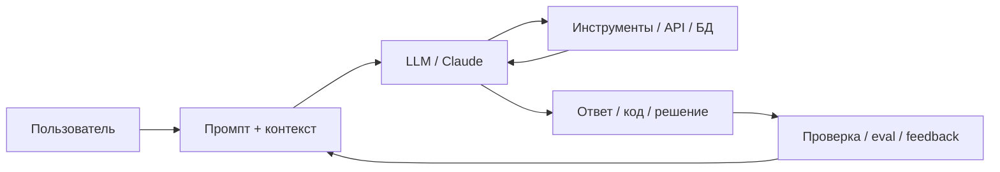
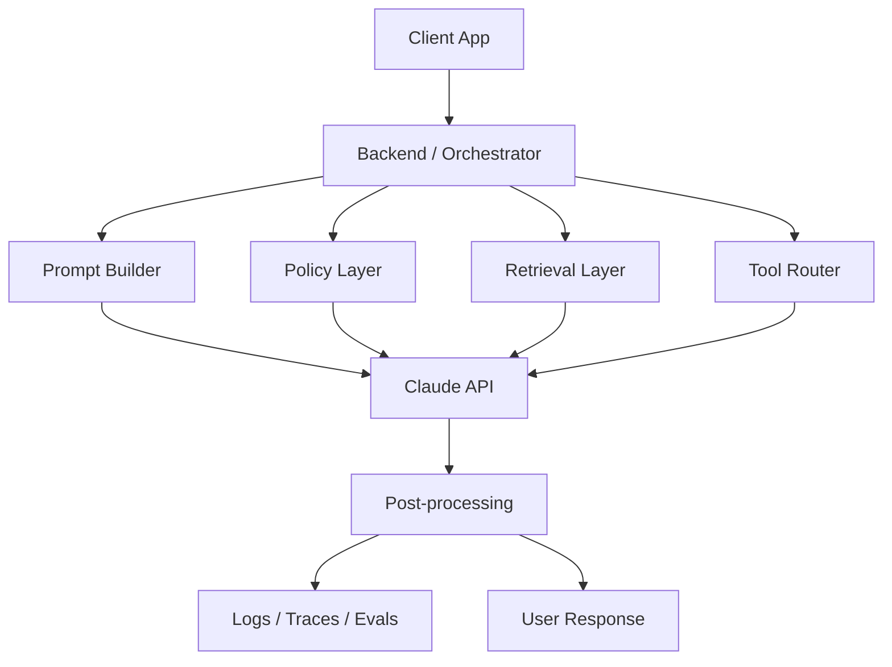
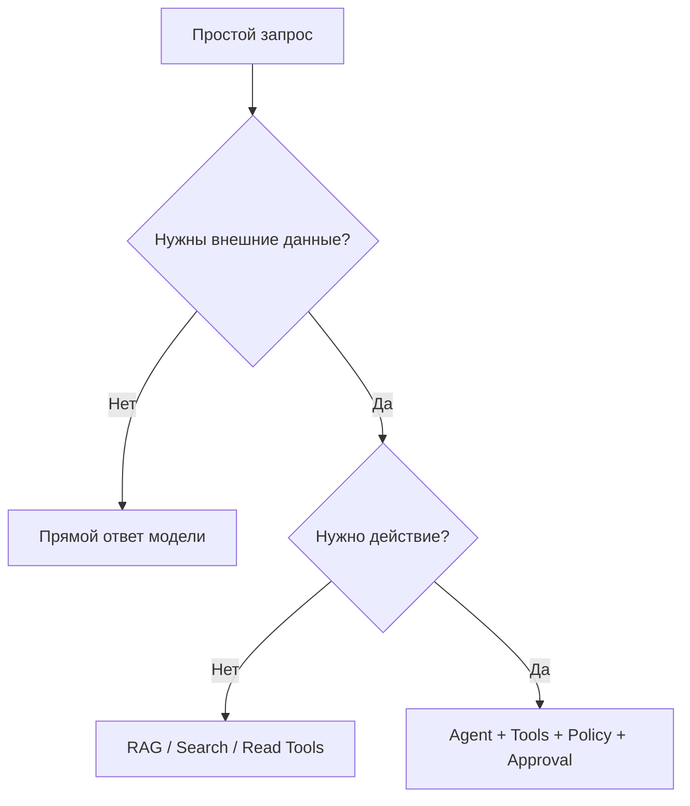
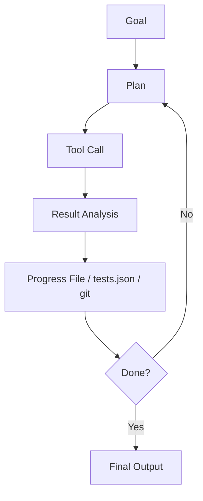

# 320+ вопросов и ответов по AI, LLM и Claude для собеседований, сертификаций и эффективной работы

Этот документ — практический банк вопросов по AI, LLM и Claude для подготовки к собеседованиям, сертификациям Claude Certified Architect – Foundations и Claude Certified Developer – Foundations, а также для повседневной эффективной работы с генерацией кода и агентными сценариями. Официальные материалы Anthropic подтверждают, что среди ключевых тем подготовки присутствуют API Claude, tool use, agent development, проектирование решений, enterprise governance и prompt engineering [cite:9][cite:10]. Также Anthropic рекомендует до глубокого тюнинга промптов сначала определить критерии успеха, способы эмпирической проверки и иметь черновой промпт для улучшения [cite:1][cite:2].

## Как пользоваться документом

- Идите по разделам последовательно, если нужна системная подготовка к сертификации.
- Используйте вопросы как flash-cards для самопроверки.
- Сравнивайте свои ответы с эталонными и дописывайте собственные примеры из рабочих кейсов.
- Для архитектурных тем старайтесь не только помнить определения, но и объяснять компромиссы: стоимость, latency, quality, controllability, observability и безопасность.

## Темы

1. Основы AI, ML, DL и LLM
2. Токены, контекст и генерация
3. Prompt engineering и структура инструкций
4. Claude-специфика и модельное поведение
5. API, параметры и режимы вызова
6. Tool use, function calling и агенты
7. Генерация кода и инженерные практики
8. Архитектура LLM-систем
9. RAG, knowledge grounding и long context
10. Evaluation, testing и quality control
11. Безопасность, privacy и governance
12. Производительность, стоимость и scaling
13. Developer Foundation: прикладные вопросы
14. Architect Foundation: системные вопросы
15. Практика собеседований и сценарные вопросы
16. Термины, ловушки и анти-паттерны

## Базовые схемы

### Общий цикл работы с LLM

Anthropic описывает современные сценарии работы с Claude как сочетание промптинга, tool use, thinking и agentic systems, а не только как простую генерацию текста [cite:2].

### Контур production-системы с Claude

Такой контур полезен, потому что Anthropic выделяет исследования, tool use, state tracking, качество ответа и управление действиями как отдельные аспекты системы, а не свойства одного промпта [cite:2].

---

## 1. Основы AI, ML, DL и LLM

### 1. Что такое AI в широком смысле?
**Ответ:** AI — это общий класс систем, которые выполняют задачи, обычно требующие человеческих когнитивных способностей: классификацию, прогнозирование, понимание текста, планирование и принятие решений. LLM — лишь одна подкатегория AI, ориентированная на работу с естественным языком и связанными multimodal задачами.

**Ресурсы:** [Anthropic Learn](https://www.anthropic.com/learn) [cite:11]

### 2. Чем machine learning отличается от традиционного программирования?
**Ответ:** В традиционном программировании разработчик задаёт правила явно, а данные проходят через эти правила для получения результата. В machine learning модель выводит статистические закономерности из данных и затем применяет их к новым входам.

**Ресурсы:** [Anthropic Learn](https://www.anthropic.com/learn) [cite:11]

### 3. Чем deep learning отличается от классического machine learning?
**Ответ:** Deep learning использует многослойные нейронные сети, которые автоматически извлекают представления из сырых данных. Это особенно эффективно для языка, изображений и аудио, где ручное конструирование признаков ограничено.

**Ресурсы:** [Anthropic Learn](https://www.anthropic.com/learn) [cite:11]

### 4. Что такое LLM?
**Ответ:** LLM, или large language model, — это большая языковая модель, обученная предсказывать наиболее вероятное продолжение последовательности токенов. На практике это приводит к способности отвечать на вопросы, писать код, суммировать, анализировать документы и действовать как оркестратор инструментов.

**Ресурсы:** [Anthropic Learn](https://www.anthropic.com/learn) [cite:11]

### 5. Почему LLM может писать код, если обучалась на тексте?
**Ответ:** Код тоже является текстовой последовательностью со строгими паттернами, структурами и зависимостями. Поэтому задача предсказания токенов естественным образом переносится на генерацию функций, тестов, SQL, YAML и других формальных языков.

**Ресурсы:** [Claude Code prompt library](https://code.claude.com/docs/en/prompt-library) [cite:8]

### 6. Что такое токен в LLM?
**Ответ:** Токен — это единица разбиения текста, с которой модель работает внутри себя; один токен не равен обязательно одному слову или символу. Ограничения модели по контексту, стоимости и длине ответа обычно выражаются именно в токенах.

**Ресурсы:** [Prompting best practices](https://platform.claude.com/docs/en/build-with-claude/prompt-engineering/claude-prompting-best-practices) [cite:2]

### 7. Что такое inference?
**Ответ:** Inference — это этап использования уже обученной модели для генерации ответа на конкретный запрос. В production-системах именно inference определяет latency, стоимость, throughput и UX.

**Ресурсы:** [Prompt engineering overview](https://platform.claude.com/docs/en/build-with-claude/prompt-engineering/overview) [cite:1]

### 8. Что такое hallucination?
**Ответ:** Hallucination — это убедительно звучащий, но недостоверный или неоснованный на контексте ответ модели. Снижать риск помогают grounding, retrieval, tool use, explicit constraints и проверка источников.

**Ресурсы:** [Prompting best practices](https://platform.claude.com/docs/en/build-with-claude/prompt-engineering/claude-prompting-best-practices) [cite:2]

### 9. Что такое prompt engineering?
**Ответ:** Prompt engineering — это проектирование инструкций, структуры контекста, примеров и ограничений, чтобы управлять качеством ответа модели. Anthropic рекомендует заниматься prompt engineering после определения success criteria, evals и первого черновика промпта для улучшения [cite:1].

**Ресурсы:** [Prompt engineering overview](https://platform.claude.com/docs/en/build-with-claude/prompt-engineering/overview) [cite:1]

### 10. Что такое agentic system?
**Ответ:** Agentic system — это система, где модель не только отвечает текстом, но и планирует шаги, вызывает инструменты, хранит состояние, проверяет результаты и продолжает работу итеративно. Anthropic прямо выделяет tool use, state tracking, long-horizon reasoning и subagent orchestration как составные части таких систем [cite:2].

**Ресурсы:** [Prompting best practices](https://platform.claude.com/docs/en/build-with-claude/prompt-engineering/claude-prompting-best-practices) [cite:2]

### 11. В чём разница между discriminative и generative моделями?
**Ответ:** Discriminative модели учатся предсказывать метки или вероятности классов, а generative модели учатся моделировать распределение данных и генерировать новые последовательности. LLM относится к generative подходу.

**Ресурсы:** [Anthropic Learn](https://www.anthropic.com/learn) [cite:11]

### 12. Почему temperature влияет на стиль ответа?
**Ответ:** Temperature регулирует степень случайности при выборе следующего токена. Более низкие значения делают ответы стабильнее и детерминированнее, а более высокие — разнообразнее, но потенциально менее надёжными.

**Ресурсы:** [Prompt engineering overview](https://platform.claude.com/docs/en/build-with-claude/prompt-engineering/overview) [cite:1]

### 13. Что значит, что модель следует инструкциям?
**Ответ:** Это означает, что поведение модели можно существенно направлять текстовыми указаниями о роли, формате, шагах, ограничениях и критериях качества. В актуальных рекомендациях Anthropic подчёркивается, что современные модели Claude лучше реагируют на ясные, прямые и детализированные инструкции [cite:2].

**Ресурсы:** [Prompting best practices](https://platform.claude.com/docs/en/build-with-claude/prompt-engineering/claude-prompting-best-practices) [cite:2]

### 14. Что такое few-shot prompting?
**Ответ:** Few-shot prompting — это включение нескольких примеров желаемого поведения прямо в промпт. Anthropic считает examples одним из самых надёжных способов управлять форматом, тоном и структурой ответа, если примеры релевантны, разнообразны и структурированы [cite:2].

**Ресурсы:** [Prompting best practices](https://platform.claude.com/docs/en/build-with-claude/prompt-engineering/claude-prompting-best-practices) [cite:2]

### 15. Почему нельзя считать LLM базой знаний в строгом смысле?
**Ответ:** Модель хранит не точные факты в виде таблицы, а распределённые статистические представления. Поэтому для точности и актуальности лучше подключать внешние источники, retrieval и tools.

**Ресурсы:** [Prompting best practices](https://platform.claude.com/docs/en/build-with-claude/prompt-engineering/claude-prompting-best-practices) [cite:2]

### 16. Чем отличается знать от быть grounded в контексте LLM?
**Ответ:** Знать обычно означает, что модель может воспроизвести вероятный факт из обученных паттернов, а быть grounded — что ответ привязан к конкретному документу, данным или цитатам из контекста. Anthropic рекомендует для long document задач сначала просить модель найти и процитировать релевантные фрагменты, а уже потом выполнять задачу [cite:2].

**Ресурсы:** [Prompting best practices](https://platform.claude.com/docs/en/build-with-claude/prompt-engineering/claude-prompting-best-practices) [cite:2]

### 17. Что такое multimodal модель?
**Ответ:** Это модель, способная работать более чем с одним типом входа, например текстом и изображениями. В материалах Anthropic отмечено улучшение vision-возможностей актуальных моделей и их пригодность для анализа изображений и даже видео через разбиение на кадры [cite:2].

**Ресурсы:** [Prompting best practices](https://platform.claude.com/docs/en/build-with-claude/prompt-engineering/claude-prompting-best-practices) [cite:2]

### 18. Что такое context window?
**Ответ:** Context window — это максимальный объём токенов, который модель может учитывать в текущем запросе и истории взаимодействия. От него зависят дизайн промпта, chunking, memory-стратегия и long-running agent workflows.

**Ресурсы:** [Prompting best practices](https://platform.claude.com/docs/en/build-with-claude/prompt-engineering/claude-prompting-best-practices) [cite:2]

### 19. Что такое system prompt?
**Ответ:** System prompt — это высокоуровневая инструкция, задающая роль, правила поведения и стратегию модели. Anthropic рекомендует задавать роль даже одной фразой, если нужно сфокусировать Claude на конкретной domain behavior [cite:2].

**Ресурсы:** [Prompting best practices](https://platform.claude.com/docs/en/build-with-claude/prompt-engineering/claude-prompting-best-practices) [cite:2]

### 20. В чём главный practical takeaway из основ LLM?
**Ответ:** Нельзя рассчитывать, что хорошая модель автоматически даст production-grade результат без структуры задачи, проверок и ограничений. В экосистеме Claude ключевыми рычагами качества являются ясные инструкции, примеры, XML-структура, tool use, long-context patterns и eval-driven iteration [cite:1][cite:2].

**Ресурсы:** [Prompt engineering overview](https://platform.claude.com/docs/en/build-with-claude/prompt-engineering/overview), [Prompting best practices](https://platform.claude.com/docs/en/build-with-claude/prompt-engineering/claude-prompting-best-practices) [cite:1][cite:2]

---

## 2. Токены, контекст и генерация

### 21. Почему лимит токенов важнее лимита символов?
**Ответ:** Потому что именно токены используются моделью для расчёта входного объёма, выходного объёма, стоимости и достижимой длины reasoning. Текст одинаковой длины в символах может сильно отличаться по числу токенов в зависимости от языка, формата и плотности специальных символов.

**Ресурсы:** [Prompting best practices](https://platform.claude.com/docs/en/build-with-claude/prompt-engineering/claude-prompting-best-practices) [cite:2]

### 22. Что происходит, если контекст переполнен?
**Ответ:** Часть данных не попадёт в модель, будет отброшена или не поместится в окно контекста, что может разрушить корректность ответа. Поэтому длинные входы требуют chunking, retrieval, сжатия и грамотного порядка секций.

**Ресурсы:** [Prompting best practices](https://platform.claude.com/docs/en/build-with-claude/prompt-engineering/claude-prompting-best-practices) [cite:2]

### 23. Почему Anthropic рекомендует класть длинные документы в начало промпта?
**Ответ:** В официальных best practices указано, что longform data лучше размещать сверху, выше запроса, инструкций и примеров, потому что это улучшает качество работы на всех моделях [cite:2].

**Ресурсы:** [Prompting best practices](https://platform.claude.com/docs/en/build-with-claude/prompt-engineering/claude-prompting-best-practices) [cite:2]

### 24. Зачем оборачивать документы в XML-теги?
**Ответ:** Это помогает модели однозначно отделять документы, метаданные, инструкции и входы. Anthropic отдельно рекомендует использовать `<document>`, `<document_content>` и `<source>` при работе с несколькими документами [cite:2].

**Ресурсы:** [Prompting best practices](https://platform.claude.com/docs/en/build-with-claude/prompt-engineering/claude-prompting-best-practices) [cite:2]

### 25. Что такое prompt stuffing и чем он опасен?
**Ответ:** Это перегрузка промпта избыточными инструкциями, примерами и правилами. Она повышает стоимость, замедляет ответы и может ухудшить следование действительно важным правилам из-за конкуренции сигналов.

**Ресурсы:** [Prompt engineering overview](https://platform.claude.com/docs/en/build-with-claude/prompt-engineering/overview) [cite:1]

### 26. Какой базовый принцип здесь нужно понимать? (Токены, контекст и генерация)
**Ответ:** Нужно уметь не просто воспроизводить определение, а объяснять trade-offs, failure modes и practical implications для production-систем. Именно такой способ мышления отличает успешную подготовку к интервью и сертификации от поверхностного знания терминов.

**Ресурсы:** [Prompt engineering overview](https://platform.claude.com/docs/en/build-with-claude/prompt-engineering/overview) [cite:1]

### 27. Какая ошибка новичков по этой теме встречается чаще всего? (Токены, контекст и генерация)
**Ответ:** Часто пытаются решить проблему силой одного промпта без данных, verification и orchestration. Docs Anthropic последовательно показывают, что качество появляется из сочетания prompting, tools, thinking, state и evaluation, а не из одной магической инструкции [cite:2].

**Ресурсы:** [Prompting best practices](https://platform.claude.com/docs/en/build-with-claude/prompt-engineering/claude-prompting-best-practices) [cite:2]

### 28. Как объяснить эту тему на собеседовании коротко и по делу? (Токены, контекст и генерация)
**Ответ:** Лучше дать короткое определение, затем один production-пример и после этого назвать 1–2 ключевых компромисса. Такой формат показывает и понимание теории, и практический опыт.

**Ресурсы:** [Prompt engineering overview](https://platform.claude.com/docs/en/build-with-claude/prompt-engineering/overview) [cite:1]

### 29. Какой production-риск связан с этой темой? (Токены, контекст и генерация)
**Ответ:** Обычно это сочетание неточности, лишней автономии, завышенной стоимости или слабой наблюдаемости. Поэтому архитектурное решение всегда должно включать validation и clear operational boundaries.

**Ресурсы:** [Prompting best practices](https://platform.claude.com/docs/en/build-with-claude/prompt-engineering/claude-prompting-best-practices) [cite:2]

### 30. Как проверить, что решение по этой теме работает? (Токены, контекст и генерация)
**Ответ:** Нужны eval cases, понятные success criteria и проверка не только качества ответа, но и формата, latency, стоимости и safety behavior. Anthropic прямо рекомендует иметь способы эмпирической проверки до углублённого prompt tuning [cite:1].

**Ресурсы:** [Prompt engineering overview](https://platform.claude.com/docs/en/build-with-claude/prompt-engineering/overview) [cite:1]

### 31. Какой базовый принцип здесь нужно понимать? (Токены, контекст и генерация)
**Ответ:** Нужно уметь не просто воспроизводить определение, а объяснять trade-offs, failure modes и practical implications для production-систем. Именно такой способ мышления отличает успешную подготовку к интервью и сертификации от поверхностного знания терминов.

**Ресурсы:** [Prompt engineering overview](https://platform.claude.com/docs/en/build-with-claude/prompt-engineering/overview) [cite:1]

### 32. Какая ошибка новичков по этой теме встречается чаще всего? (Токены, контекст и генерация)
**Ответ:** Часто пытаются решить проблему силой одного промпта без данных, verification и orchestration. Docs Anthropic последовательно показывают, что качество появляется из сочетания prompting, tools, thinking, state и evaluation, а не из одной магической инструкции [cite:2].

**Ресурсы:** [Prompting best practices](https://platform.claude.com/docs/en/build-with-claude/prompt-engineering/claude-prompting-best-practices) [cite:2]

### 33. Как объяснить эту тему на собеседовании коротко и по делу? (Токены, контекст и генерация)
**Ответ:** Лучше дать короткое определение, затем один production-пример и после этого назвать 1–2 ключевых компромисса. Такой формат показывает и понимание теории, и практический опыт.

**Ресурсы:** [Prompt engineering overview](https://platform.claude.com/docs/en/build-with-claude/prompt-engineering/overview) [cite:1]

### 34. Какой production-риск связан с этой темой? (Токены, контекст и генерация)
**Ответ:** Обычно это сочетание неточности, лишней автономии, завышенной стоимости или слабой наблюдаемости. Поэтому архитектурное решение всегда должно включать validation и clear operational boundaries.

**Ресурсы:** [Prompting best practices](https://platform.claude.com/docs/en/build-with-claude/prompt-engineering/claude-prompting-best-practices) [cite:2]

### 35. Как проверить, что решение по этой теме работает? (Токены, контекст и генерация)
**Ответ:** Нужны eval cases, понятные success criteria и проверка не только качества ответа, но и формата, latency, стоимости и safety behavior. Anthropic прямо рекомендует иметь способы эмпирической проверки до углублённого prompt tuning [cite:1].

**Ресурсы:** [Prompt engineering overview](https://platform.claude.com/docs/en/build-with-claude/prompt-engineering/overview) [cite:1]

### 36. Какой базовый принцип здесь нужно понимать? (Токены, контекст и генерация)
**Ответ:** Нужно уметь не просто воспроизводить определение, а объяснять trade-offs, failure modes и practical implications для production-систем. Именно такой способ мышления отличает успешную подготовку к интервью и сертификации от поверхностного знания терминов.

**Ресурсы:** [Prompt engineering overview](https://platform.claude.com/docs/en/build-with-claude/prompt-engineering/overview) [cite:1]

### 37. Какая ошибка новичков по этой теме встречается чаще всего? (Токены, контекст и генерация)
**Ответ:** Часто пытаются решить проблему силой одного промпта без данных, verification и orchestration. Docs Anthropic последовательно показывают, что качество появляется из сочетания prompting, tools, thinking, state и evaluation, а не из одной магической инструкции [cite:2].

**Ресурсы:** [Prompting best practices](https://platform.claude.com/docs/en/build-with-claude/prompt-engineering/claude-prompting-best-practices) [cite:2]

### 38. Как объяснить эту тему на собеседовании коротко и по делу? (Токены, контекст и генерация)
**Ответ:** Лучше дать короткое определение, затем один production-пример и после этого назвать 1–2 ключевых компромисса. Такой формат показывает и понимание теории, и практический опыт.

**Ресурсы:** [Prompt engineering overview](https://platform.claude.com/docs/en/build-with-claude/prompt-engineering/overview) [cite:1]

### 39. Какой production-риск связан с этой темой? (Токены, контекст и генерация)
**Ответ:** Обычно это сочетание неточности, лишней автономии, завышенной стоимости или слабой наблюдаемости. Поэтому архитектурное решение всегда должно включать validation и clear operational boundaries.

**Ресурсы:** [Prompting best practices](https://platform.claude.com/docs/en/build-with-claude/prompt-engineering/claude-prompting-best-practices) [cite:2]

### 40. Как проверить, что решение по этой теме работает? (Токены, контекст и генерация)
**Ответ:** Нужны eval cases, понятные success criteria и проверка не только качества ответа, но и формата, latency, стоимости и safety behavior. Anthropic прямо рекомендует иметь способы эмпирической проверки до углублённого prompt tuning [cite:1].

**Ресурсы:** [Prompt engineering overview](https://platform.claude.com/docs/en/build-with-claude/prompt-engineering/overview) [cite:1]

---

## 3. Prompt engineering и структура инструкций

### 41. С чего нужно начинать prompt engineering по Anthropic?
**Ответ:** С определения success criteria, способов эмпирической проверки и наличия первого draft prompt. Это прямо указано в официальном overview перед переходом к техникам оптимизации [cite:1].

**Ресурсы:** [Prompt engineering overview](https://platform.claude.com/docs/en/build-with-claude/prompt-engineering/overview) [cite:1]

### 42. Почему vague prompts дают слабые результаты?
**Ответ:** Потому что модель не обязана угадывать скрытые ожидания. В best practices Anthropic подчёркивает, что Claude лучше работает с ясными, прямыми, explicit instructions и конкретными требованиями к output [cite:2].

**Ресурсы:** [Prompting best practices](https://platform.claude.com/docs/en/build-with-claude/prompt-engineering/claude-prompting-best-practices) [cite:2]

### 43. Что значит tell Claude what to do instead of what not to do?
**Ответ:** Вместо отрицательных запретов лучше задавать позитивную форму желаемого поведения и формата. Anthropic приводит это как одну из особенно эффективных техник управления output formatting [cite:2].

**Ресурсы:** [Prompting best practices](https://platform.claude.com/docs/en/build-with-claude/prompt-engineering/claude-prompting-best-practices) [cite:2]

### 44. Почему examples так важны?
**Ответ:** Потому что примеры являются сильным сигналом не только по содержанию, но и по структуре, степени детализации и стилю. Anthropic называет examples одним из самых надёжных способов steering output [cite:2].

**Ресурсы:** [Prompting best practices](https://platform.claude.com/docs/en/build-with-claude/prompt-engineering/claude-prompting-best-practices) [cite:2]

### 45. Какими должны быть хорошие few-shot examples?
**Ответ:** Релевантными реальному use case, разнообразными по edge cases и структурированными через XML-теги `<example>` или `<examples>`. Эти три критерия прямо перечислены в best practices Anthropic [cite:2].

**Ресурсы:** [Prompting best practices](https://platform.claude.com/docs/en/build-with-claude/prompt-engineering/claude-prompting-best-practices) [cite:2]

### 46. Какой базовый принцип здесь нужно понимать? (Prompt engineering и структура инструкций)
**Ответ:** Нужно уметь не просто воспроизводить определение, а объяснять trade-offs, failure modes и practical implications для production-систем. Именно такой способ мышления отличает успешную подготовку к интервью и сертификации от поверхностного знания терминов.

**Ресурсы:** [Prompt engineering overview](https://platform.claude.com/docs/en/build-with-claude/prompt-engineering/overview) [cite:1]

### 47. Какая ошибка новичков по этой теме встречается чаще всего? (Prompt engineering и структура инструкций)
**Ответ:** Часто пытаются решить проблему силой одного промпта без данных, verification и orchestration. Docs Anthropic последовательно показывают, что качество появляется из сочетания prompting, tools, thinking, state и evaluation, а не из одной магической инструкции [cite:2].

**Ресурсы:** [Prompting best practices](https://platform.claude.com/docs/en/build-with-claude/prompt-engineering/claude-prompting-best-practices) [cite:2]

### 48. Как объяснить эту тему на собеседовании коротко и по делу? (Prompt engineering и структура инструкций)
**Ответ:** Лучше дать короткое определение, затем один production-пример и после этого назвать 1–2 ключевых компромисса. Такой формат показывает и понимание теории, и практический опыт.

**Ресурсы:** [Prompt engineering overview](https://platform.claude.com/docs/en/build-with-claude/prompt-engineering/overview) [cite:1]

### 49. Какой production-риск связан с этой темой? (Prompt engineering и структура инструкций)
**Ответ:** Обычно это сочетание неточности, лишней автономии, завышенной стоимости или слабой наблюдаемости. Поэтому архитектурное решение всегда должно включать validation и clear operational boundaries.

**Ресурсы:** [Prompting best practices](https://platform.claude.com/docs/en/build-with-claude/prompt-engineering/claude-prompting-best-practices) [cite:2]

### 50. Как проверить, что решение по этой теме работает? (Prompt engineering и структура инструкций)
**Ответ:** Нужны eval cases, понятные success criteria и проверка не только качества ответа, но и формата, latency, стоимости и safety behavior. Anthropic прямо рекомендует иметь способы эмпирической проверки до углублённого prompt tuning [cite:1].

**Ресурсы:** [Prompt engineering overview](https://platform.claude.com/docs/en/build-with-claude/prompt-engineering/overview) [cite:1]

### 51. Какой базовый принцип здесь нужно понимать? (Prompt engineering и структура инструкций)
**Ответ:** Нужно уметь не просто воспроизводить определение, а объяснять trade-offs, failure modes и practical implications для production-систем. Именно такой способ мышления отличает успешную подготовку к интервью и сертификации от поверхностного знания терминов.

**Ресурсы:** [Prompt engineering overview](https://platform.claude.com/docs/en/build-with-claude/prompt-engineering/overview) [cite:1]

### 52. Какая ошибка новичков по этой теме встречается чаще всего? (Prompt engineering и структура инструкций)
**Ответ:** Часто пытаются решить проблему силой одного промпта без данных, verification и orchestration. Docs Anthropic последовательно показывают, что качество появляется из сочетания prompting, tools, thinking, state и evaluation, а не из одной магической инструкции [cite:2].

**Ресурсы:** [Prompting best practices](https://platform.claude.com/docs/en/build-with-claude/prompt-engineering/claude-prompting-best-practices) [cite:2]

### 53. Как объяснить эту тему на собеседовании коротко и по делу? (Prompt engineering и структура инструкций)
**Ответ:** Лучше дать короткое определение, затем один production-пример и после этого назвать 1–2 ключевых компромисса. Такой формат показывает и понимание теории, и практический опыт.

**Ресурсы:** [Prompt engineering overview](https://platform.claude.com/docs/en/build-with-claude/prompt-engineering/overview) [cite:1]

### 54. Какой production-риск связан с этой темой? (Prompt engineering и структура инструкций)
**Ответ:** Обычно это сочетание неточности, лишней автономии, завышенной стоимости или слабой наблюдаемости. Поэтому архитектурное решение всегда должно включать validation и clear operational boundaries.

**Ресурсы:** [Prompting best practices](https://platform.claude.com/docs/en/build-with-claude/prompt-engineering/claude-prompting-best-practices) [cite:2]

### 55. Как проверить, что решение по этой теме работает? (Prompt engineering и структура инструкций)
**Ответ:** Нужны eval cases, понятные success criteria и проверка не только качества ответа, но и формата, latency, стоимости и safety behavior. Anthropic прямо рекомендует иметь способы эмпирической проверки до углублённого prompt tuning [cite:1].

**Ресурсы:** [Prompt engineering overview](https://platform.claude.com/docs/en/build-with-claude/prompt-engineering/overview) [cite:1]

### 56. Какой базовый принцип здесь нужно понимать? (Prompt engineering и структура инструкций)
**Ответ:** Нужно уметь не просто воспроизводить определение, а объяснять trade-offs, failure modes и practical implications для production-систем. Именно такой способ мышления отличает успешную подготовку к интервью и сертификации от поверхностного знания терминов.

**Ресурсы:** [Prompt engineering overview](https://platform.claude.com/docs/en/build-with-claude/prompt-engineering/overview) [cite:1]

### 57. Какая ошибка новичков по этой теме встречается чаще всего? (Prompt engineering и структура инструкций)
**Ответ:** Часто пытаются решить проблему силой одного промпта без данных, verification и orchestration. Docs Anthropic последовательно показывают, что качество появляется из сочетания prompting, tools, thinking, state и evaluation, а не из одной магической инструкции [cite:2].

**Ресурсы:** [Prompting best practices](https://platform.claude.com/docs/en/build-with-claude/prompt-engineering/claude-prompting-best-practices) [cite:2]

### 58. Как объяснить эту тему на собеседовании коротко и по делу? (Prompt engineering и структура инструкций)
**Ответ:** Лучше дать короткое определение, затем один production-пример и после этого назвать 1–2 ключевых компромисса. Такой формат показывает и понимание теории, и практический опыт.

**Ресурсы:** [Prompt engineering overview](https://platform.claude.com/docs/en/build-with-claude/prompt-engineering/overview) [cite:1]

### 59. Какой production-риск связан с этой темой? (Prompt engineering и структура инструкций)
**Ответ:** Обычно это сочетание неточности, лишней автономии, завышенной стоимости или слабой наблюдаемости. Поэтому архитектурное решение всегда должно включать validation и clear operational boundaries.

**Ресурсы:** [Prompting best practices](https://platform.claude.com/docs/en/build-with-claude/prompt-engineering/claude-prompting-best-practices) [cite:2]

### 60. Как проверить, что решение по этой теме работает? (Prompt engineering и структура инструкций)
**Ответ:** Нужны eval cases, понятные success criteria и проверка не только качества ответа, но и формата, latency, стоимости и safety behavior. Anthropic прямо рекомендует иметь способы эмпирической проверки до углублённого prompt tuning [cite:1].

**Ресурсы:** [Prompt engineering overview](https://platform.claude.com/docs/en/build-with-claude/prompt-engineering/overview) [cite:1]

---

## 4. Claude-специфика и модельное поведение

### 61. Чем Claude отличается как платформа для enterprise-задач?
**Ответ:** Anthropic акцентирует внимание на responsible AI, prompt engineering, tool use, agent development, governance и enterprise architecture как на официальных направлениях обучения и сертификации [cite:9][cite:10]. Это делает Claude не просто моделью, а экосистемой для production-решений.

**Ресурсы:** [Claude certifications announcement](https://claude.com/blog/four-role-based-claude-certifications), [Pearson VUE Anthropic exams](https://www.pearsonvue.com/us/en/anthropic.html) [cite:9][cite:10]

### 62. Какие role-based сертификаты Claude сейчас выделены официально?
**Ответ:** Anthropic объявила четыре role-based направления: Associate: Foundations, Architect: Foundations, Architect: Professional и Developer: Foundations [cite:9]. Это показывает, что компания отдельно валидирует базовую AI-грамотность, архитектурное проектирование и прикладную разработку.

**Ресурсы:** [Claude certifications announcement](https://claude.com/blog/four-role-based-claude-certifications) [cite:9]

### 63. Что включает Claude Certified Developer – Foundations по официальному описанию?
**Ответ:** Официальное описание говорит, что этот сертификат ориентирован на инженеров, которые строят приложения с Claude, и включает обучение по Claude API, tool use и agent development [cite:9]. Значит, на подготовке критично понимать не только prompting, но и интеграцию с инструментами и orchestration.

**Ресурсы:** [Claude certifications announcement](https://claude.com/blog/four-role-based-claude-certifications) [cite:9]

### 64. Что включает Claude Certified Architect – Foundations по официальному описанию?
**Ответ:** Официальное описание говорит, что credential ориентирован на solution architects, которые проектируют и строят agent systems with Claude [cite:9]. Следовательно, на экзамене ожидается понимание архитектуры решений, потоков данных, безопасности и контроля качества.

**Ресурсы:** [Claude certifications announcement](https://claude.com/blog/four-role-based-claude-certifications) [cite:9]

### 65. Почему важно знать различия между моделями Claude?
**Ответ:** Потому что Anthropic публикует model-specific guidance и указывает, что поведение, verbosity, thinking defaults и tool triggering могут меняться между поколениями и семействами моделей [cite:2]. Один и тот же промпт не всегда переносится без адаптации.

**Ресурсы:** [Prompting best practices](https://platform.claude.com/docs/en/build-with-claude/prompt-engineering/claude-prompting-best-practices) [cite:2]

### 66. Какой базовый принцип здесь нужно понимать? (Claude-специфика и модельное поведение)
**Ответ:** Нужно уметь не просто воспроизводить определение, а объяснять trade-offs, failure modes и practical implications для production-систем. Именно такой способ мышления отличает успешную подготовку к интервью и сертификации от поверхностного знания терминов.

**Ресурсы:** [Prompt engineering overview](https://platform.claude.com/docs/en/build-with-claude/prompt-engineering/overview) [cite:1]

### 67. Какая ошибка новичков по этой теме встречается чаще всего? (Claude-специфика и модельное поведение)
**Ответ:** Часто пытаются решить проблему силой одного промпта без данных, verification и orchestration. Docs Anthropic последовательно показывают, что качество появляется из сочетания prompting, tools, thinking, state и evaluation, а не из одной магической инструкции [cite:2].

**Ресурсы:** [Prompting best practices](https://platform.claude.com/docs/en/build-with-claude/prompt-engineering/claude-prompting-best-practices) [cite:2]

### 68. Как объяснить эту тему на собеседовании коротко и по делу? (Claude-специфика и модельное поведение)
**Ответ:** Лучше дать короткое определение, затем один production-пример и после этого назвать 1–2 ключевых компромисса. Такой формат показывает и понимание теории, и практический опыт.

**Ресурсы:** [Prompt engineering overview](https://platform.claude.com/docs/en/build-with-claude/prompt-engineering/overview) [cite:1]

### 69. Какой production-риск связан с этой темой? (Claude-специфика и модельное поведение)
**Ответ:** Обычно это сочетание неточности, лишней автономии, завышенной стоимости или слабой наблюдаемости. Поэтому архитектурное решение всегда должно включать validation и clear operational boundaries.

**Ресурсы:** [Prompting best practices](https://platform.claude.com/docs/en/build-with-claude/prompt-engineering/claude-prompting-best-practices) [cite:2]

### 70. Как проверить, что решение по этой теме работает? (Claude-специфика и модельное поведение)
**Ответ:** Нужны eval cases, понятные success criteria и проверка не только качества ответа, но и формата, latency, стоимости и safety behavior. Anthropic прямо рекомендует иметь способы эмпирической проверки до углублённого prompt tuning [cite:1].

**Ресурсы:** [Prompt engineering overview](https://platform.claude.com/docs/en/build-with-claude/prompt-engineering/overview) [cite:1]

### 71. Какой базовый принцип здесь нужно понимать? (Claude-специфика и модельное поведение)
**Ответ:** Нужно уметь не просто воспроизводить определение, а объяснять trade-offs, failure modes и practical implications для production-систем. Именно такой способ мышления отличает успешную подготовку к интервью и сертификации от поверхностного знания терминов.

**Ресурсы:** [Prompt engineering overview](https://platform.claude.com/docs/en/build-with-claude/prompt-engineering/overview) [cite:1]

### 72. Какая ошибка новичков по этой теме встречается чаще всего? (Claude-специфика и модельное поведение)
**Ответ:** Часто пытаются решить проблему силой одного промпта без данных, verification и orchestration. Docs Anthropic последовательно показывают, что качество появляется из сочетания prompting, tools, thinking, state и evaluation, а не из одной магической инструкции [cite:2].

**Ресурсы:** [Prompting best practices](https://platform.claude.com/docs/en/build-with-claude/prompt-engineering/claude-prompting-best-practices) [cite:2]

### 73. Как объяснить эту тему на собеседовании коротко и по делу? (Claude-специфика и модельное поведение)
**Ответ:** Лучше дать короткое определение, затем один production-пример и после этого назвать 1–2 ключевых компромисса. Такой формат показывает и понимание теории, и практический опыт.

**Ресурсы:** [Prompt engineering overview](https://platform.claude.com/docs/en/build-with-claude/prompt-engineering/overview) [cite:1]

### 74. Какой production-риск связан с этой темой? (Claude-специфика и модельное поведение)
**Ответ:** Обычно это сочетание неточности, лишней автономии, завышенной стоимости или слабой наблюдаемости. Поэтому архитектурное решение всегда должно включать validation и clear operational boundaries.

**Ресурсы:** [Prompting best practices](https://platform.claude.com/docs/en/build-with-claude/prompt-engineering/claude-prompting-best-practices) [cite:2]

### 75. Как проверить, что решение по этой теме работает? (Claude-специфика и модельное поведение)
**Ответ:** Нужны eval cases, понятные success criteria и проверка не только качества ответа, но и формата, latency, стоимости и safety behavior. Anthropic прямо рекомендует иметь способы эмпирической проверки до углублённого prompt tuning [cite:1].

**Ресурсы:** [Prompt engineering overview](https://platform.claude.com/docs/en/build-with-claude/prompt-engineering/overview) [cite:1]

### 76. Какой базовый принцип здесь нужно понимать? (Claude-специфика и модельное поведение)
**Ответ:** Нужно уметь не просто воспроизводить определение, а объяснять trade-offs, failure modes и practical implications для production-систем. Именно такой способ мышления отличает успешную подготовку к интервью и сертификации от поверхностного знания терминов.

**Ресурсы:** [Prompt engineering overview](https://platform.claude.com/docs/en/build-with-claude/prompt-engineering/overview) [cite:1]

### 77. Какая ошибка новичков по этой теме встречается чаще всего? (Claude-специфика и модельное поведение)
**Ответ:** Часто пытаются решить проблему силой одного промпта без данных, verification и orchestration. Docs Anthropic последовательно показывают, что качество появляется из сочетания prompting, tools, thinking, state и evaluation, а не из одной магической инструкции [cite:2].

**Ресурсы:** [Prompting best practices](https://platform.claude.com/docs/en/build-with-claude/prompt-engineering/claude-prompting-best-practices) [cite:2]

### 78. Как объяснить эту тему на собеседовании коротко и по делу? (Claude-специфика и модельное поведение)
**Ответ:** Лучше дать короткое определение, затем один production-пример и после этого назвать 1–2 ключевых компромисса. Такой формат показывает и понимание теории, и практический опыт.

**Ресурсы:** [Prompt engineering overview](https://platform.claude.com/docs/en/build-with-claude/prompt-engineering/overview) [cite:1]

### 79. Какой production-риск связан с этой темой? (Claude-специфика и модельное поведение)
**Ответ:** Обычно это сочетание неточности, лишней автономии, завышенной стоимости или слабой наблюдаемости. Поэтому архитектурное решение всегда должно включать validation и clear operational boundaries.

**Ресурсы:** [Prompting best practices](https://platform.claude.com/docs/en/build-with-claude/prompt-engineering/claude-prompting-best-practices) [cite:2]

### 80. Как проверить, что решение по этой теме работает? (Claude-специфика и модельное поведение)
**Ответ:** Нужны eval cases, понятные success criteria и проверка не только качества ответа, но и формата, latency, стоимости и safety behavior. Anthropic прямо рекомендует иметь способы эмпирической проверки до углублённого prompt tuning [cite:1].

**Ресурсы:** [Prompt engineering overview](https://platform.claude.com/docs/en/build-with-claude/prompt-engineering/overview) [cite:1]

---

## 5. API, параметры и режимы вызова

### 81. Какой базовый принцип здесь нужно понимать? (API, параметры и режимы вызова)
**Ответ:** Нужно уметь не просто воспроизводить определение, а объяснять trade-offs, failure modes и practical implications для production-систем. Именно такой способ мышления отличает успешную подготовку к интервью и сертификации от поверхностного знания терминов.

**Ресурсы:** [Prompt engineering overview](https://platform.claude.com/docs/en/build-with-claude/prompt-engineering/overview) [cite:1]

### 82. Какая ошибка новичков по этой теме встречается чаще всего? (API, параметры и режимы вызова)
**Ответ:** Часто пытаются решить проблему силой одного промпта без данных, verification и orchestration. Docs Anthropic последовательно показывают, что качество появляется из сочетания prompting, tools, thinking, state и evaluation, а не из одной магической инструкции [cite:2].

**Ресурсы:** [Prompting best practices](https://platform.claude.com/docs/en/build-with-claude/prompt-engineering/claude-prompting-best-practices) [cite:2]

### 83. Как объяснить эту тему на собеседовании коротко и по делу? (API, параметры и режимы вызова)
**Ответ:** Лучше дать короткое определение, затем один production-пример и после этого назвать 1–2 ключевых компромисса. Такой формат показывает и понимание теории, и практический опыт.

**Ресурсы:** [Prompt engineering overview](https://platform.claude.com/docs/en/build-with-claude/prompt-engineering/overview) [cite:1]

### 84. Какой production-риск связан с этой темой? (API, параметры и режимы вызова)
**Ответ:** Обычно это сочетание неточности, лишней автономии, завышенной стоимости или слабой наблюдаемости. Поэтому архитектурное решение всегда должно включать validation и clear operational boundaries.

**Ресурсы:** [Prompting best practices](https://platform.claude.com/docs/en/build-with-claude/prompt-engineering/claude-prompting-best-practices) [cite:2]

### 85. Как проверить, что решение по этой теме работает? (API, параметры и режимы вызова)
**Ответ:** Нужны eval cases, понятные success criteria и проверка не только качества ответа, но и формата, latency, стоимости и safety behavior. Anthropic прямо рекомендует иметь способы эмпирической проверки до углублённого prompt tuning [cite:1].

**Ресурсы:** [Prompt engineering overview](https://platform.claude.com/docs/en/build-with-claude/prompt-engineering/overview) [cite:1]

### 86. Какой базовый принцип здесь нужно понимать? (API, параметры и режимы вызова)
**Ответ:** Нужно уметь не просто воспроизводить определение, а объяснять trade-offs, failure modes и practical implications для production-систем. Именно такой способ мышления отличает успешную подготовку к интервью и сертификации от поверхностного знания терминов.

**Ресурсы:** [Prompt engineering overview](https://platform.claude.com/docs/en/build-with-claude/prompt-engineering/overview) [cite:1]

### 87. Какая ошибка новичков по этой теме встречается чаще всего? (API, параметры и режимы вызова)
**Ответ:** Часто пытаются решить проблему силой одного промпта без данных, verification и orchestration. Docs Anthropic последовательно показывают, что качество появляется из сочетания prompting, tools, thinking, state и evaluation, а не из одной магической инструкции [cite:2].

**Ресурсы:** [Prompting best practices](https://platform.claude.com/docs/en/build-with-claude/prompt-engineering/claude-prompting-best-practices) [cite:2]

### 88. Как объяснить эту тему на собеседовании коротко и по делу? (API, параметры и режимы вызова)
**Ответ:** Лучше дать короткое определение, затем один production-пример и после этого назвать 1–2 ключевых компромисса. Такой формат показывает и понимание теории, и практический опыт.

**Ресурсы:** [Prompt engineering overview](https://platform.claude.com/docs/en/build-with-claude/prompt-engineering/overview) [cite:1]

### 89. Какой production-риск связан с этой темой? (API, параметры и режимы вызова)
**Ответ:** Обычно это сочетание неточности, лишней автономии, завышенной стоимости или слабой наблюдаемости. Поэтому архитектурное решение всегда должно включать validation и clear operational boundaries.

**Ресурсы:** [Prompting best practices](https://platform.claude.com/docs/en/build-with-claude/prompt-engineering/claude-prompting-best-practices) [cite:2]

### 90. Как проверить, что решение по этой теме работает? (API, параметры и режимы вызова)
**Ответ:** Нужны eval cases, понятные success criteria и проверка не только качества ответа, но и формата, latency, стоимости и safety behavior. Anthropic прямо рекомендует иметь способы эмпирической проверки до углублённого prompt tuning [cite:1].

**Ресурсы:** [Prompt engineering overview](https://platform.claude.com/docs/en/build-with-claude/prompt-engineering/overview) [cite:1]

### 91. Какой базовый принцип здесь нужно понимать? (API, параметры и режимы вызова)
**Ответ:** Нужно уметь не просто воспроизводить определение, а объяснять trade-offs, failure modes и practical implications для production-систем. Именно такой способ мышления отличает успешную подготовку к интервью и сертификации от поверхностного знания терминов.

**Ресурсы:** [Prompt engineering overview](https://platform.claude.com/docs/en/build-with-claude/prompt-engineering/overview) [cite:1]

### 92. Какая ошибка новичков по этой теме встречается чаще всего? (API, параметры и режимы вызова)
**Ответ:** Часто пытаются решить проблему силой одного промпта без данных, verification и orchestration. Docs Anthropic последовательно показывают, что качество появляется из сочетания prompting, tools, thinking, state и evaluation, а не из одной магической инструкции [cite:2].

**Ресурсы:** [Prompting best practices](https://platform.claude.com/docs/en/build-with-claude/prompt-engineering/claude-prompting-best-practices) [cite:2]

### 93. Как объяснить эту тему на собеседовании коротко и по делу? (API, параметры и режимы вызова)
**Ответ:** Лучше дать короткое определение, затем один production-пример и после этого назвать 1–2 ключевых компромисса. Такой формат показывает и понимание теории, и практический опыт.

**Ресурсы:** [Prompt engineering overview](https://platform.claude.com/docs/en/build-with-claude/prompt-engineering/overview) [cite:1]

### 94. Какой production-риск связан с этой темой? (API, параметры и режимы вызова)
**Ответ:** Обычно это сочетание неточности, лишней автономии, завышенной стоимости или слабой наблюдаемости. Поэтому архитектурное решение всегда должно включать validation и clear operational boundaries.

**Ресурсы:** [Prompting best practices](https://platform.claude.com/docs/en/build-with-claude/prompt-engineering/claude-prompting-best-practices) [cite:2]

### 95. Как проверить, что решение по этой теме работает? (API, параметры и режимы вызова)
**Ответ:** Нужны eval cases, понятные success criteria и проверка не только качества ответа, но и формата, latency, стоимости и safety behavior. Anthropic прямо рекомендует иметь способы эмпирической проверки до углублённого prompt tuning [cite:1].

**Ресурсы:** [Prompt engineering overview](https://platform.claude.com/docs/en/build-with-claude/prompt-engineering/overview) [cite:1]

### 96. Какой базовый принцип здесь нужно понимать? (API, параметры и режимы вызова)
**Ответ:** Нужно уметь не просто воспроизводить определение, а объяснять trade-offs, failure modes и practical implications для production-систем. Именно такой способ мышления отличает успешную подготовку к интервью и сертификации от поверхностного знания терминов.

**Ресурсы:** [Prompt engineering overview](https://platform.claude.com/docs/en/build-with-claude/prompt-engineering/overview) [cite:1]

### 97. Какая ошибка новичков по этой теме встречается чаще всего? (API, параметры и режимы вызова)
**Ответ:** Часто пытаются решить проблему силой одного промпта без данных, verification и orchestration. Docs Anthropic последовательно показывают, что качество появляется из сочетания prompting, tools, thinking, state и evaluation, а не из одной магической инструкции [cite:2].

**Ресурсы:** [Prompting best practices](https://platform.claude.com/docs/en/build-with-claude/prompt-engineering/claude-prompting-best-practices) [cite:2]

### 98. Как объяснить эту тему на собеседовании коротко и по делу? (API, параметры и режимы вызова)
**Ответ:** Лучше дать короткое определение, затем один production-пример и после этого назвать 1–2 ключевых компромисса. Такой формат показывает и понимание теории, и практический опыт.

**Ресурсы:** [Prompt engineering overview](https://platform.claude.com/docs/en/build-with-claude/prompt-engineering/overview) [cite:1]

### 99. Какой production-риск связан с этой темой? (API, параметры и режимы вызова)
**Ответ:** Обычно это сочетание неточности, лишней автономии, завышенной стоимости или слабой наблюдаемости. Поэтому архитектурное решение всегда должно включать validation и clear operational boundaries.

**Ресурсы:** [Prompting best practices](https://platform.claude.com/docs/en/build-with-claude/prompt-engineering/claude-prompting-best-practices) [cite:2]

### 100. Как проверить, что решение по этой теме работает? (API, параметры и режимы вызова)
**Ответ:** Нужны eval cases, понятные success criteria и проверка не только качества ответа, но и формата, latency, стоимости и safety behavior. Anthropic прямо рекомендует иметь способы эмпирической проверки до углублённого prompt tuning [cite:1].

**Ресурсы:** [Prompt engineering overview](https://platform.claude.com/docs/en/build-with-claude/prompt-engineering/overview) [cite:1]

---

## 6. Tool use, function calling и агенты

### 101. Какой базовый принцип здесь нужно понимать? (Tool use, function calling и агенты)
**Ответ:** Нужно уметь не просто воспроизводить определение, а объяснять trade-offs, failure modes и practical implications для production-систем. Именно такой способ мышления отличает успешную подготовку к интервью и сертификации от поверхностного знания терминов.

**Ресурсы:** [Prompt engineering overview](https://platform.claude.com/docs/en/build-with-claude/prompt-engineering/overview) [cite:1]

### 102. Какая ошибка новичков по этой теме встречается чаще всего? (Tool use, function calling и агенты)
**Ответ:** Часто пытаются решить проблему силой одного промпта без данных, verification и orchestration. Docs Anthropic последовательно показывают, что качество появляется из сочетания prompting, tools, thinking, state и evaluation, а не из одной магической инструкции [cite:2].

**Ресурсы:** [Prompting best practices](https://platform.claude.com/docs/en/build-with-claude/prompt-engineering/claude-prompting-best-practices) [cite:2]

### 103. Как объяснить эту тему на собеседовании коротко и по делу? (Tool use, function calling и агенты)
**Ответ:** Лучше дать короткое определение, затем один production-пример и после этого назвать 1–2 ключевых компромисса. Такой формат показывает и понимание теории, и практический опыт.

**Ресурсы:** [Prompt engineering overview](https://platform.claude.com/docs/en/build-with-claude/prompt-engineering/overview) [cite:1]

### 104. Какой production-риск связан с этой темой? (Tool use, function calling и агенты)
**Ответ:** Обычно это сочетание неточности, лишней автономии, завышенной стоимости или слабой наблюдаемости. Поэтому архитектурное решение всегда должно включать validation и clear operational boundaries.

**Ресурсы:** [Prompting best practices](https://platform.claude.com/docs/en/build-with-claude/prompt-engineering/claude-prompting-best-practices) [cite:2]

### 105. Как проверить, что решение по этой теме работает? (Tool use, function calling и агенты)
**Ответ:** Нужны eval cases, понятные success criteria и проверка не только качества ответа, но и формата, latency, стоимости и safety behavior. Anthropic прямо рекомендует иметь способы эмпирической проверки до углублённого prompt tuning [cite:1].

**Ресурсы:** [Prompt engineering overview](https://platform.claude.com/docs/en/build-with-claude/prompt-engineering/overview) [cite:1]

### 106. Какой базовый принцип здесь нужно понимать? (Tool use, function calling и агенты)
**Ответ:** Нужно уметь не просто воспроизводить определение, а объяснять trade-offs, failure modes и practical implications для production-систем. Именно такой способ мышления отличает успешную подготовку к интервью и сертификации от поверхностного знания терминов.

**Ресурсы:** [Prompt engineering overview](https://platform.claude.com/docs/en/build-with-claude/prompt-engineering/overview) [cite:1]

### 107. Какая ошибка новичков по этой теме встречается чаще всего? (Tool use, function calling и агенты)
**Ответ:** Часто пытаются решить проблему силой одного промпта без данных, verification и orchestration. Docs Anthropic последовательно показывают, что качество появляется из сочетания prompting, tools, thinking, state и evaluation, а не из одной магической инструкции [cite:2].

**Ресурсы:** [Prompting best practices](https://platform.claude.com/docs/en/build-with-claude/prompt-engineering/claude-prompting-best-practices) [cite:2]

### 108. Как объяснить эту тему на собеседовании коротко и по делу? (Tool use, function calling и агенты)
**Ответ:** Лучше дать короткое определение, затем один production-пример и после этого назвать 1–2 ключевых компромисса. Такой формат показывает и понимание теории, и практический опыт.

**Ресурсы:** [Prompt engineering overview](https://platform.claude.com/docs/en/build-with-claude/prompt-engineering/overview) [cite:1]

### 109. Какой production-риск связан с этой темой? (Tool use, function calling и агенты)
**Ответ:** Обычно это сочетание неточности, лишней автономии, завышенной стоимости или слабой наблюдаемости. Поэтому архитектурное решение всегда должно включать validation и clear operational boundaries.

**Ресурсы:** [Prompting best practices](https://platform.claude.com/docs/en/build-with-claude/prompt-engineering/claude-prompting-best-practices) [cite:2]

### 110. Как проверить, что решение по этой теме работает? (Tool use, function calling и агенты)
**Ответ:** Нужны eval cases, понятные success criteria и проверка не только качества ответа, но и формата, latency, стоимости и safety behavior. Anthropic прямо рекомендует иметь способы эмпирической проверки до углублённого prompt tuning [cite:1].

**Ресурсы:** [Prompt engineering overview](https://platform.claude.com/docs/en/build-with-claude/prompt-engineering/overview) [cite:1]

### 111. Какой базовый принцип здесь нужно понимать? (Tool use, function calling и агенты)
**Ответ:** Нужно уметь не просто воспроизводить определение, а объяснять trade-offs, failure modes и practical implications для production-систем. Именно такой способ мышления отличает успешную подготовку к интервью и сертификации от поверхностного знания терминов.

**Ресурсы:** [Prompt engineering overview](https://platform.claude.com/docs/en/build-with-claude/prompt-engineering/overview) [cite:1]

### 112. Какая ошибка новичков по этой теме встречается чаще всего? (Tool use, function calling и агенты)
**Ответ:** Часто пытаются решить проблему силой одного промпта без данных, verification и orchestration. Docs Anthropic последовательно показывают, что качество появляется из сочетания prompting, tools, thinking, state и evaluation, а не из одной магической инструкции [cite:2].

**Ресурсы:** [Prompting best practices](https://platform.claude.com/docs/en/build-with-claude/prompt-engineering/claude-prompting-best-practices) [cite:2]

### 113. Как объяснить эту тему на собеседовании коротко и по делу? (Tool use, function calling и агенты)
**Ответ:** Лучше дать короткое определение, затем один production-пример и после этого назвать 1–2 ключевых компромисса. Такой формат показывает и понимание теории, и практический опыт.

**Ресурсы:** [Prompt engineering overview](https://platform.claude.com/docs/en/build-with-claude/prompt-engineering/overview) [cite:1]

### 114. Какой production-риск связан с этой темой? (Tool use, function calling и агенты)
**Ответ:** Обычно это сочетание неточности, лишней автономии, завышенной стоимости или слабой наблюдаемости. Поэтому архитектурное решение всегда должно включать validation и clear operational boundaries.

**Ресурсы:** [Prompting best practices](https://platform.claude.com/docs/en/build-with-claude/prompt-engineering/claude-prompting-best-practices) [cite:2]

### 115. Как проверить, что решение по этой теме работает? (Tool use, function calling и агенты)
**Ответ:** Нужны eval cases, понятные success criteria и проверка не только качества ответа, но и формата, latency, стоимости и safety behavior. Anthropic прямо рекомендует иметь способы эмпирической проверки до углублённого prompt tuning [cite:1].

**Ресурсы:** [Prompt engineering overview](https://platform.claude.com/docs/en/build-with-claude/prompt-engineering/overview) [cite:1]

### 116. Какой базовый принцип здесь нужно понимать? (Tool use, function calling и агенты)
**Ответ:** Нужно уметь не просто воспроизводить определение, а объяснять trade-offs, failure modes и practical implications для production-систем. Именно такой способ мышления отличает успешную подготовку к интервью и сертификации от поверхностного знания терминов.

**Ресурсы:** [Prompt engineering overview](https://platform.claude.com/docs/en/build-with-claude/prompt-engineering/overview) [cite:1]

### 117. Какая ошибка новичков по этой теме встречается чаще всего? (Tool use, function calling и агенты)
**Ответ:** Часто пытаются решить проблему силой одного промпта без данных, verification и orchestration. Docs Anthropic последовательно показывают, что качество появляется из сочетания prompting, tools, thinking, state и evaluation, а не из одной магической инструкции [cite:2].

**Ресурсы:** [Prompting best practices](https://platform.claude.com/docs/en/build-with-claude/prompt-engineering/claude-prompting-best-practices) [cite:2]

### 118. Как объяснить эту тему на собеседовании коротко и по делу? (Tool use, function calling и агенты)
**Ответ:** Лучше дать короткое определение, затем один production-пример и после этого назвать 1–2 ключевых компромисса. Такой формат показывает и понимание теории, и практический опыт.

**Ресурсы:** [Prompt engineering overview](https://platform.claude.com/docs/en/build-with-claude/prompt-engineering/overview) [cite:1]

### 119. Какой production-риск связан с этой темой? (Tool use, function calling и агенты)
**Ответ:** Обычно это сочетание неточности, лишней автономии, завышенной стоимости или слабой наблюдаемости. Поэтому архитектурное решение всегда должно включать validation и clear operational boundaries.

**Ресурсы:** [Prompting best practices](https://platform.claude.com/docs/en/build-with-claude/prompt-engineering/claude-prompting-best-practices) [cite:2]

### 120. Как проверить, что решение по этой теме работает? (Tool use, function calling и агенты)
**Ответ:** Нужны eval cases, понятные success criteria и проверка не только качества ответа, но и формата, latency, стоимости и safety behavior. Anthropic прямо рекомендует иметь способы эмпирической проверки до углублённого prompt tuning [cite:1].

**Ресурсы:** [Prompt engineering overview](https://platform.claude.com/docs/en/build-with-claude/prompt-engineering/overview) [cite:1]

---

## 7. Генерация кода и инженерные практики

### 121. Какой базовый принцип здесь нужно понимать? (Генерация кода и инженерные практики)
**Ответ:** Нужно уметь не просто воспроизводить определение, а объяснять trade-offs, failure modes и practical implications для production-систем. Именно такой способ мышления отличает успешную подготовку к интервью и сертификации от поверхностного знания терминов.

**Ресурсы:** [Prompt engineering overview](https://platform.claude.com/docs/en/build-with-claude/prompt-engineering/overview) [cite:1]

### 122. Какая ошибка новичков по этой теме встречается чаще всего? (Генерация кода и инженерные практики)
**Ответ:** Часто пытаются решить проблему силой одного промпта без данных, verification и orchestration. Docs Anthropic последовательно показывают, что качество появляется из сочетания prompting, tools, thinking, state и evaluation, а не из одной магической инструкции [cite:2].

**Ресурсы:** [Prompting best practices](https://platform.claude.com/docs/en/build-with-claude/prompt-engineering/claude-prompting-best-practices) [cite:2]

### 123. Как объяснить эту тему на собеседовании коротко и по делу? (Генерация кода и инженерные практики)
**Ответ:** Лучше дать короткое определение, затем один production-пример и после этого назвать 1–2 ключевых компромисса. Такой формат показывает и понимание теории, и практический опыт.

**Ресурсы:** [Prompt engineering overview](https://platform.claude.com/docs/en/build-with-claude/prompt-engineering/overview) [cite:1]

### 124. Какой production-риск связан с этой темой? (Генерация кода и инженерные практики)
**Ответ:** Обычно это сочетание неточности, лишней автономии, завышенной стоимости или слабой наблюдаемости. Поэтому архитектурное решение всегда должно включать validation и clear operational boundaries.

**Ресурсы:** [Prompting best practices](https://platform.claude.com/docs/en/build-with-claude/prompt-engineering/claude-prompting-best-practices) [cite:2]

### 125. Как проверить, что решение по этой теме работает? (Генерация кода и инженерные практики)
**Ответ:** Нужны eval cases, понятные success criteria и проверка не только качества ответа, но и формата, latency, стоимости и safety behavior. Anthropic прямо рекомендует иметь способы эмпирической проверки до углублённого prompt tuning [cite:1].

**Ресурсы:** [Prompt engineering overview](https://platform.claude.com/docs/en/build-with-claude/prompt-engineering/overview) [cite:1]

### 126. Какой базовый принцип здесь нужно понимать? (Генерация кода и инженерные практики)
**Ответ:** Нужно уметь не просто воспроизводить определение, а объяснять trade-offs, failure modes и practical implications для production-систем. Именно такой способ мышления отличает успешную подготовку к интервью и сертификации от поверхностного знания терминов.

**Ресурсы:** [Prompt engineering overview](https://platform.claude.com/docs/en/build-with-claude/prompt-engineering/overview) [cite:1]

### 127. Какая ошибка новичков по этой теме встречается чаще всего? (Генерация кода и инженерные практики)
**Ответ:** Часто пытаются решить проблему силой одного промпта без данных, verification и orchestration. Docs Anthropic последовательно показывают, что качество появляется из сочетания prompting, tools, thinking, state и evaluation, а не из одной магической инструкции [cite:2].

**Ресурсы:** [Prompting best practices](https://platform.claude.com/docs/en/build-with-claude/prompt-engineering/claude-prompting-best-practices) [cite:2]

### 128. Как объяснить эту тему на собеседовании коротко и по делу? (Генерация кода и инженерные практики)
**Ответ:** Лучше дать короткое определение, затем один production-пример и после этого назвать 1–2 ключевых компромисса. Такой формат показывает и понимание теории, и практический опыт.

**Ресурсы:** [Prompt engineering overview](https://platform.claude.com/docs/en/build-with-claude/prompt-engineering/overview) [cite:1]

### 129. Какой production-риск связан с этой темой? (Генерация кода и инженерные практики)
**Ответ:** Обычно это сочетание неточности, лишней автономии, завышенной стоимости или слабой наблюдаемости. Поэтому архитектурное решение всегда должно включать validation и clear operational boundaries.

**Ресурсы:** [Prompting best practices](https://platform.claude.com/docs/en/build-with-claude/prompt-engineering/claude-prompting-best-practices) [cite:2]

### 130. Как проверить, что решение по этой теме работает? (Генерация кода и инженерные практики)
**Ответ:** Нужны eval cases, понятные success criteria и проверка не только качества ответа, но и формата, latency, стоимости и safety behavior. Anthropic прямо рекомендует иметь способы эмпирической проверки до углублённого prompt tuning [cite:1].

**Ресурсы:** [Prompt engineering overview](https://platform.claude.com/docs/en/build-with-claude/prompt-engineering/overview) [cite:1]

### 131. Какой базовый принцип здесь нужно понимать? (Генерация кода и инженерные практики)
**Ответ:** Нужно уметь не просто воспроизводить определение, а объяснять trade-offs, failure modes и practical implications для production-систем. Именно такой способ мышления отличает успешную подготовку к интервью и сертификации от поверхностного знания терминов.

**Ресурсы:** [Prompt engineering overview](https://platform.claude.com/docs/en/build-with-claude/prompt-engineering/overview) [cite:1]

### 132. Какая ошибка новичков по этой теме встречается чаще всего? (Генерация кода и инженерные практики)
**Ответ:** Часто пытаются решить проблему силой одного промпта без данных, verification и orchestration. Docs Anthropic последовательно показывают, что качество появляется из сочетания prompting, tools, thinking, state и evaluation, а не из одной магической инструкции [cite:2].

**Ресурсы:** [Prompting best practices](https://platform.claude.com/docs/en/build-with-claude/prompt-engineering/claude-prompting-best-practices) [cite:2]

### 133. Как объяснить эту тему на собеседовании коротко и по делу? (Генерация кода и инженерные практики)
**Ответ:** Лучше дать короткое определение, затем один production-пример и после этого назвать 1–2 ключевых компромисса. Такой формат показывает и понимание теории, и практический опыт.

**Ресурсы:** [Prompt engineering overview](https://platform.claude.com/docs/en/build-with-claude/prompt-engineering/overview) [cite:1]

### 134. Какой production-риск связан с этой темой? (Генерация кода и инженерные практики)
**Ответ:** Обычно это сочетание неточности, лишней автономии, завышенной стоимости или слабой наблюдаемости. Поэтому архитектурное решение всегда должно включать validation и clear operational boundaries.

**Ресурсы:** [Prompting best practices](https://platform.claude.com/docs/en/build-with-claude/prompt-engineering/claude-prompting-best-practices) [cite:2]

### 135. Как проверить, что решение по этой теме работает? (Генерация кода и инженерные практики)
**Ответ:** Нужны eval cases, понятные success criteria и проверка не только качества ответа, но и формата, latency, стоимости и safety behavior. Anthropic прямо рекомендует иметь способы эмпирической проверки до углублённого prompt tuning [cite:1].

**Ресурсы:** [Prompt engineering overview](https://platform.claude.com/docs/en/build-with-claude/prompt-engineering/overview) [cite:1]

### 136. Какой базовый принцип здесь нужно понимать? (Генерация кода и инженерные практики)
**Ответ:** Нужно уметь не просто воспроизводить определение, а объяснять trade-offs, failure modes и practical implications для production-систем. Именно такой способ мышления отличает успешную подготовку к интервью и сертификации от поверхностного знания терминов.

**Ресурсы:** [Prompt engineering overview](https://platform.claude.com/docs/en/build-with-claude/prompt-engineering/overview) [cite:1]

### 137. Какая ошибка новичков по этой теме встречается чаще всего? (Генерация кода и инженерные практики)
**Ответ:** Часто пытаются решить проблему силой одного промпта без данных, verification и orchestration. Docs Anthropic последовательно показывают, что качество появляется из сочетания prompting, tools, thinking, state и evaluation, а не из одной магической инструкции [cite:2].

**Ресурсы:** [Prompting best practices](https://platform.claude.com/docs/en/build-with-claude/prompt-engineering/claude-prompting-best-practices) [cite:2]

### 138. Как объяснить эту тему на собеседовании коротко и по делу? (Генерация кода и инженерные практики)
**Ответ:** Лучше дать короткое определение, затем один production-пример и после этого назвать 1–2 ключевых компромисса. Такой формат показывает и понимание теории, и практический опыт.

**Ресурсы:** [Prompt engineering overview](https://platform.claude.com/docs/en/build-with-claude/prompt-engineering/overview) [cite:1]

### 139. Какой production-риск связан с этой темой? (Генерация кода и инженерные практики)
**Ответ:** Обычно это сочетание неточности, лишней автономии, завышенной стоимости или слабой наблюдаемости. Поэтому архитектурное решение всегда должно включать validation и clear operational boundaries.

**Ресурсы:** [Prompting best practices](https://platform.claude.com/docs/en/build-with-claude/prompt-engineering/claude-prompting-best-practices) [cite:2]

### 140. Как проверить, что решение по этой теме работает? (Генерация кода и инженерные практики)
**Ответ:** Нужны eval cases, понятные success criteria и проверка не только качества ответа, но и формата, latency, стоимости и safety behavior. Anthropic прямо рекомендует иметь способы эмпирической проверки до углублённого prompt tuning [cite:1].

**Ресурсы:** [Prompt engineering overview](https://platform.claude.com/docs/en/build-with-claude/prompt-engineering/overview) [cite:1]

---

## 8. Архитектура LLM-систем

### 141. Какой базовый принцип здесь нужно понимать? (Архитектура LLM-систем)
**Ответ:** Нужно уметь не просто воспроизводить определение, а объяснять trade-offs, failure modes и practical implications для production-систем. Именно такой способ мышления отличает успешную подготовку к интервью и сертификации от поверхностного знания терминов.

**Ресурсы:** [Prompt engineering overview](https://platform.claude.com/docs/en/build-with-claude/prompt-engineering/overview) [cite:1]

### 142. Какая ошибка новичков по этой теме встречается чаще всего? (Архитектура LLM-систем)
**Ответ:** Часто пытаются решить проблему силой одного промпта без данных, verification и orchestration. Docs Anthropic последовательно показывают, что качество появляется из сочетания prompting, tools, thinking, state и evaluation, а не из одной магической инструкции [cite:2].

**Ресурсы:** [Prompting best practices](https://platform.claude.com/docs/en/build-with-claude/prompt-engineering/claude-prompting-best-practices) [cite:2]

### 143. Как объяснить эту тему на собеседовании коротко и по делу? (Архитектура LLM-систем)
**Ответ:** Лучше дать короткое определение, затем один production-пример и после этого назвать 1–2 ключевых компромисса. Такой формат показывает и понимание теории, и практический опыт.

**Ресурсы:** [Prompt engineering overview](https://platform.claude.com/docs/en/build-with-claude/prompt-engineering/overview) [cite:1]

### 144. Какой production-риск связан с этой темой? (Архитектура LLM-систем)
**Ответ:** Обычно это сочетание неточности, лишней автономии, завышенной стоимости или слабой наблюдаемости. Поэтому архитектурное решение всегда должно включать validation и clear operational boundaries.

**Ресурсы:** [Prompting best practices](https://platform.claude.com/docs/en/build-with-claude/prompt-engineering/claude-prompting-best-practices) [cite:2]

### 145. Как проверить, что решение по этой теме работает? (Архитектура LLM-систем)
**Ответ:** Нужны eval cases, понятные success criteria и проверка не только качества ответа, но и формата, latency, стоимости и safety behavior. Anthropic прямо рекомендует иметь способы эмпирической проверки до углублённого prompt tuning [cite:1].

**Ресурсы:** [Prompt engineering overview](https://platform.claude.com/docs/en/build-with-claude/prompt-engineering/overview) [cite:1]

### 146. Какой базовый принцип здесь нужно понимать? (Архитектура LLM-систем)
**Ответ:** Нужно уметь не просто воспроизводить определение, а объяснять trade-offs, failure modes и practical implications для production-систем. Именно такой способ мышления отличает успешную подготовку к интервью и сертификации от поверхностного знания терминов.

**Ресурсы:** [Prompt engineering overview](https://platform.claude.com/docs/en/build-with-claude/prompt-engineering/overview) [cite:1]

### 147. Какая ошибка новичков по этой теме встречается чаще всего? (Архитектура LLM-систем)
**Ответ:** Часто пытаются решить проблему силой одного промпта без данных, verification и orchestration. Docs Anthropic последовательно показывают, что качество появляется из сочетания prompting, tools, thinking, state и evaluation, а не из одной магической инструкции [cite:2].

**Ресурсы:** [Prompting best practices](https://platform.claude.com/docs/en/build-with-claude/prompt-engineering/claude-prompting-best-practices) [cite:2]

### 148. Как объяснить эту тему на собеседовании коротко и по делу? (Архитектура LLM-систем)
**Ответ:** Лучше дать короткое определение, затем один production-пример и после этого назвать 1–2 ключевых компромисса. Такой формат показывает и понимание теории, и практический опыт.

**Ресурсы:** [Prompt engineering overview](https://platform.claude.com/docs/en/build-with-claude/prompt-engineering/overview) [cite:1]

### 149. Какой production-риск связан с этой темой? (Архитектура LLM-систем)
**Ответ:** Обычно это сочетание неточности, лишней автономии, завышенной стоимости или слабой наблюдаемости. Поэтому архитектурное решение всегда должно включать validation и clear operational boundaries.

**Ресурсы:** [Prompting best practices](https://platform.claude.com/docs/en/build-with-claude/prompt-engineering/claude-prompting-best-practices) [cite:2]

### 150. Как проверить, что решение по этой теме работает? (Архитектура LLM-систем)
**Ответ:** Нужны eval cases, понятные success criteria и проверка не только качества ответа, но и формата, latency, стоимости и safety behavior. Anthropic прямо рекомендует иметь способы эмпирической проверки до углублённого prompt tuning [cite:1].

**Ресурсы:** [Prompt engineering overview](https://platform.claude.com/docs/en/build-with-claude/prompt-engineering/overview) [cite:1]

### 151. Какой базовый принцип здесь нужно понимать? (Архитектура LLM-систем)
**Ответ:** Нужно уметь не просто воспроизводить определение, а объяснять trade-offs, failure modes и practical implications для production-систем. Именно такой способ мышления отличает успешную подготовку к интервью и сертификации от поверхностного знания терминов.

**Ресурсы:** [Prompt engineering overview](https://platform.claude.com/docs/en/build-with-claude/prompt-engineering/overview) [cite:1]

### 152. Какая ошибка новичков по этой теме встречается чаще всего? (Архитектура LLM-систем)
**Ответ:** Часто пытаются решить проблему силой одного промпта без данных, verification и orchestration. Docs Anthropic последовательно показывают, что качество появляется из сочетания prompting, tools, thinking, state и evaluation, а не из одной магической инструкции [cite:2].

**Ресурсы:** [Prompting best practices](https://platform.claude.com/docs/en/build-with-claude/prompt-engineering/claude-prompting-best-practices) [cite:2]

### 153. Как объяснить эту тему на собеседовании коротко и по делу? (Архитектура LLM-систем)
**Ответ:** Лучше дать короткое определение, затем один production-пример и после этого назвать 1–2 ключевых компромисса. Такой формат показывает и понимание теории, и практический опыт.

**Ресурсы:** [Prompt engineering overview](https://platform.claude.com/docs/en/build-with-claude/prompt-engineering/overview) [cite:1]

### 154. Какой production-риск связан с этой темой? (Архитектура LLM-систем)
**Ответ:** Обычно это сочетание неточности, лишней автономии, завышенной стоимости или слабой наблюдаемости. Поэтому архитектурное решение всегда должно включать validation и clear operational boundaries.

**Ресурсы:** [Prompting best practices](https://platform.claude.com/docs/en/build-with-claude/prompt-engineering/claude-prompting-best-practices) [cite:2]

### 155. Как проверить, что решение по этой теме работает? (Архитектура LLM-систем)
**Ответ:** Нужны eval cases, понятные success criteria и проверка не только качества ответа, но и формата, latency, стоимости и safety behavior. Anthropic прямо рекомендует иметь способы эмпирической проверки до углублённого prompt tuning [cite:1].

**Ресурсы:** [Prompt engineering overview](https://platform.claude.com/docs/en/build-with-claude/prompt-engineering/overview) [cite:1]

### 156. Какой базовый принцип здесь нужно понимать? (Архитектура LLM-систем)
**Ответ:** Нужно уметь не просто воспроизводить определение, а объяснять trade-offs, failure modes и practical implications для production-систем. Именно такой способ мышления отличает успешную подготовку к интервью и сертификации от поверхностного знания терминов.

**Ресурсы:** [Prompt engineering overview](https://platform.claude.com/docs/en/build-with-claude/prompt-engineering/overview) [cite:1]

### 157. Какая ошибка новичков по этой теме встречается чаще всего? (Архитектура LLM-систем)
**Ответ:** Часто пытаются решить проблему силой одного промпта без данных, verification и orchestration. Docs Anthropic последовательно показывают, что качество появляется из сочетания prompting, tools, thinking, state и evaluation, а не из одной магической инструкции [cite:2].

**Ресурсы:** [Prompting best practices](https://platform.claude.com/docs/en/build-with-claude/prompt-engineering/claude-prompting-best-practices) [cite:2]

### 158. Как объяснить эту тему на собеседовании коротко и по делу? (Архитектура LLM-систем)
**Ответ:** Лучше дать короткое определение, затем один production-пример и после этого назвать 1–2 ключевых компромисса. Такой формат показывает и понимание теории, и практический опыт.

**Ресурсы:** [Prompt engineering overview](https://platform.claude.com/docs/en/build-with-claude/prompt-engineering/overview) [cite:1]

### 159. Какой production-риск связан с этой темой? (Архитектура LLM-систем)
**Ответ:** Обычно это сочетание неточности, лишней автономии, завышенной стоимости или слабой наблюдаемости. Поэтому архитектурное решение всегда должно включать validation и clear operational boundaries.

**Ресурсы:** [Prompting best practices](https://platform.claude.com/docs/en/build-with-claude/prompt-engineering/claude-prompting-best-practices) [cite:2]

### 160. Как проверить, что решение по этой теме работает? (Архитектура LLM-систем)
**Ответ:** Нужны eval cases, понятные success criteria и проверка не только качества ответа, но и формата, latency, стоимости и safety behavior. Anthropic прямо рекомендует иметь способы эмпирической проверки до углублённого prompt tuning [cite:1].

**Ресурсы:** [Prompt engineering overview](https://platform.claude.com/docs/en/build-with-claude/prompt-engineering/overview) [cite:1]

---

## 9. RAG, knowledge grounding и long context

### 161. Какой базовый принцип здесь нужно понимать? (RAG, knowledge grounding и long context)
**Ответ:** Нужно уметь не просто воспроизводить определение, а объяснять trade-offs, failure modes и practical implications для production-систем. Именно такой способ мышления отличает успешную подготовку к интервью и сертификации от поверхностного знания терминов.

**Ресурсы:** [Prompt engineering overview](https://platform.claude.com/docs/en/build-with-claude/prompt-engineering/overview) [cite:1]

### 162. Какая ошибка новичков по этой теме встречается чаще всего? (RAG, knowledge grounding и long context)
**Ответ:** Часто пытаются решить проблему силой одного промпта без данных, verification и orchestration. Docs Anthropic последовательно показывают, что качество появляется из сочетания prompting, tools, thinking, state и evaluation, а не из одной магической инструкции [cite:2].

**Ресурсы:** [Prompting best practices](https://platform.claude.com/docs/en/build-with-claude/prompt-engineering/claude-prompting-best-practices) [cite:2]

### 163. Как объяснить эту тему на собеседовании коротко и по делу? (RAG, knowledge grounding и long context)
**Ответ:** Лучше дать короткое определение, затем один production-пример и после этого назвать 1–2 ключевых компромисса. Такой формат показывает и понимание теории, и практический опыт.

**Ресурсы:** [Prompt engineering overview](https://platform.claude.com/docs/en/build-with-claude/prompt-engineering/overview) [cite:1]

### 164. Какой production-риск связан с этой темой? (RAG, knowledge grounding и long context)
**Ответ:** Обычно это сочетание неточности, лишней автономии, завышенной стоимости или слабой наблюдаемости. Поэтому архитектурное решение всегда должно включать validation и clear operational boundaries.

**Ресурсы:** [Prompting best practices](https://platform.claude.com/docs/en/build-with-claude/prompt-engineering/claude-prompting-best-practices) [cite:2]

### 165. Как проверить, что решение по этой теме работает? (RAG, knowledge grounding и long context)
**Ответ:** Нужны eval cases, понятные success criteria и проверка не только качества ответа, но и формата, latency, стоимости и safety behavior. Anthropic прямо рекомендует иметь способы эмпирической проверки до углублённого prompt tuning [cite:1].

**Ресурсы:** [Prompt engineering overview](https://platform.claude.com/docs/en/build-with-claude/prompt-engineering/overview) [cite:1]

### 166. Какой базовый принцип здесь нужно понимать? (RAG, knowledge grounding и long context)
**Ответ:** Нужно уметь не просто воспроизводить определение, а объяснять trade-offs, failure modes и practical implications для production-систем. Именно такой способ мышления отличает успешную подготовку к интервью и сертификации от поверхностного знания терминов.

**Ресурсы:** [Prompt engineering overview](https://platform.claude.com/docs/en/build-with-claude/prompt-engineering/overview) [cite:1]

### 167. Какая ошибка новичков по этой теме встречается чаще всего? (RAG, knowledge grounding и long context)
**Ответ:** Часто пытаются решить проблему силой одного промпта без данных, verification и orchestration. Docs Anthropic последовательно показывают, что качество появляется из сочетания prompting, tools, thinking, state и evaluation, а не из одной магической инструкции [cite:2].

**Ресурсы:** [Prompting best practices](https://platform.claude.com/docs/en/build-with-claude/prompt-engineering/claude-prompting-best-practices) [cite:2]

### 168. Как объяснить эту тему на собеседовании коротко и по делу? (RAG, knowledge grounding и long context)
**Ответ:** Лучше дать короткое определение, затем один production-пример и после этого назвать 1–2 ключевых компромисса. Такой формат показывает и понимание теории, и практический опыт.

**Ресурсы:** [Prompt engineering overview](https://platform.claude.com/docs/en/build-with-claude/prompt-engineering/overview) [cite:1]

### 169. Какой production-риск связан с этой темой? (RAG, knowledge grounding и long context)
**Ответ:** Обычно это сочетание неточности, лишней автономии, завышенной стоимости или слабой наблюдаемости. Поэтому архитектурное решение всегда должно включать validation и clear operational boundaries.

**Ресурсы:** [Prompting best practices](https://platform.claude.com/docs/en/build-with-claude/prompt-engineering/claude-prompting-best-practices) [cite:2]

### 170. Как проверить, что решение по этой теме работает? (RAG, knowledge grounding и long context)
**Ответ:** Нужны eval cases, понятные success criteria и проверка не только качества ответа, но и формата, latency, стоимости и safety behavior. Anthropic прямо рекомендует иметь способы эмпирической проверки до углублённого prompt tuning [cite:1].

**Ресурсы:** [Prompt engineering overview](https://platform.claude.com/docs/en/build-with-claude/prompt-engineering/overview) [cite:1]

### 171. Какой базовый принцип здесь нужно понимать? (RAG, knowledge grounding и long context)
**Ответ:** Нужно уметь не просто воспроизводить определение, а объяснять trade-offs, failure modes и practical implications для production-систем. Именно такой способ мышления отличает успешную подготовку к интервью и сертификации от поверхностного знания терминов.

**Ресурсы:** [Prompt engineering overview](https://platform.claude.com/docs/en/build-with-claude/prompt-engineering/overview) [cite:1]

### 172. Какая ошибка новичков по этой теме встречается чаще всего? (RAG, knowledge grounding и long context)
**Ответ:** Часто пытаются решить проблему силой одного промпта без данных, verification и orchestration. Docs Anthropic последовательно показывают, что качество появляется из сочетания prompting, tools, thinking, state и evaluation, а не из одной магической инструкции [cite:2].

**Ресурсы:** [Prompting best practices](https://platform.claude.com/docs/en/build-with-claude/prompt-engineering/claude-prompting-best-practices) [cite:2]

### 173. Как объяснить эту тему на собеседовании коротко и по делу? (RAG, knowledge grounding и long context)
**Ответ:** Лучше дать короткое определение, затем один production-пример и после этого назвать 1–2 ключевых компромисса. Такой формат показывает и понимание теории, и практический опыт.

**Ресурсы:** [Prompt engineering overview](https://platform.claude.com/docs/en/build-with-claude/prompt-engineering/overview) [cite:1]

### 174. Какой production-риск связан с этой темой? (RAG, knowledge grounding и long context)
**Ответ:** Обычно это сочетание неточности, лишней автономии, завышенной стоимости или слабой наблюдаемости. Поэтому архитектурное решение всегда должно включать validation и clear operational boundaries.

**Ресурсы:** [Prompting best practices](https://platform.claude.com/docs/en/build-with-claude/prompt-engineering/claude-prompting-best-practices) [cite:2]

### 175. Как проверить, что решение по этой теме работает? (RAG, knowledge grounding и long context)
**Ответ:** Нужны eval cases, понятные success criteria и проверка не только качества ответа, но и формата, latency, стоимости и safety behavior. Anthropic прямо рекомендует иметь способы эмпирической проверки до углублённого prompt tuning [cite:1].

**Ресурсы:** [Prompt engineering overview](https://platform.claude.com/docs/en/build-with-claude/prompt-engineering/overview) [cite:1]

### 176. Какой базовый принцип здесь нужно понимать? (RAG, knowledge grounding и long context)
**Ответ:** Нужно уметь не просто воспроизводить определение, а объяснять trade-offs, failure modes и practical implications для production-систем. Именно такой способ мышления отличает успешную подготовку к интервью и сертификации от поверхностного знания терминов.

**Ресурсы:** [Prompt engineering overview](https://platform.claude.com/docs/en/build-with-claude/prompt-engineering/overview) [cite:1]

### 177. Какая ошибка новичков по этой теме встречается чаще всего? (RAG, knowledge grounding и long context)
**Ответ:** Часто пытаются решить проблему силой одного промпта без данных, verification и orchestration. Docs Anthropic последовательно показывают, что качество появляется из сочетания prompting, tools, thinking, state и evaluation, а не из одной магической инструкции [cite:2].

**Ресурсы:** [Prompting best practices](https://platform.claude.com/docs/en/build-with-claude/prompt-engineering/claude-prompting-best-practices) [cite:2]

### 178. Как объяснить эту тему на собеседовании коротко и по делу? (RAG, knowledge grounding и long context)
**Ответ:** Лучше дать короткое определение, затем один production-пример и после этого назвать 1–2 ключевых компромисса. Такой формат показывает и понимание теории, и практический опыт.

**Ресурсы:** [Prompt engineering overview](https://platform.claude.com/docs/en/build-with-claude/prompt-engineering/overview) [cite:1]

### 179. Какой production-риск связан с этой темой? (RAG, knowledge grounding и long context)
**Ответ:** Обычно это сочетание неточности, лишней автономии, завышенной стоимости или слабой наблюдаемости. Поэтому архитектурное решение всегда должно включать validation и clear operational boundaries.

**Ресурсы:** [Prompting best practices](https://platform.claude.com/docs/en/build-with-claude/prompt-engineering/claude-prompting-best-practices) [cite:2]

### 180. Как проверить, что решение по этой теме работает? (RAG, knowledge grounding и long context)
**Ответ:** Нужны eval cases, понятные success criteria и проверка не только качества ответа, но и формата, latency, стоимости и safety behavior. Anthropic прямо рекомендует иметь способы эмпирической проверки до углублённого prompt tuning [cite:1].

**Ресурсы:** [Prompt engineering overview](https://platform.claude.com/docs/en/build-with-claude/prompt-engineering/overview) [cite:1]

---

## 10. Evaluation, testing и quality control

### 181. Какой базовый принцип здесь нужно понимать? (Evaluation, testing и quality control)
**Ответ:** Нужно уметь не просто воспроизводить определение, а объяснять trade-offs, failure modes и practical implications для production-систем. Именно такой способ мышления отличает успешную подготовку к интервью и сертификации от поверхностного знания терминов.

**Ресурсы:** [Prompt engineering overview](https://platform.claude.com/docs/en/build-with-claude/prompt-engineering/overview) [cite:1]

### 182. Какая ошибка новичков по этой теме встречается чаще всего? (Evaluation, testing и quality control)
**Ответ:** Часто пытаются решить проблему силой одного промпта без данных, verification и orchestration. Docs Anthropic последовательно показывают, что качество появляется из сочетания prompting, tools, thinking, state и evaluation, а не из одной магической инструкции [cite:2].

**Ресурсы:** [Prompting best practices](https://platform.claude.com/docs/en/build-with-claude/prompt-engineering/claude-prompting-best-practices) [cite:2]

### 183. Как объяснить эту тему на собеседовании коротко и по делу? (Evaluation, testing и quality control)
**Ответ:** Лучше дать короткое определение, затем один production-пример и после этого назвать 1–2 ключевых компромисса. Такой формат показывает и понимание теории, и практический опыт.

**Ресурсы:** [Prompt engineering overview](https://platform.claude.com/docs/en/build-with-claude/prompt-engineering/overview) [cite:1]

### 184. Какой production-риск связан с этой темой? (Evaluation, testing и quality control)
**Ответ:** Обычно это сочетание неточности, лишней автономии, завышенной стоимости или слабой наблюдаемости. Поэтому архитектурное решение всегда должно включать validation и clear operational boundaries.

**Ресурсы:** [Prompting best practices](https://platform.claude.com/docs/en/build-with-claude/prompt-engineering/claude-prompting-best-practices) [cite:2]

### 185. Как проверить, что решение по этой теме работает? (Evaluation, testing и quality control)
**Ответ:** Нужны eval cases, понятные success criteria и проверка не только качества ответа, но и формата, latency, стоимости и safety behavior. Anthropic прямо рекомендует иметь способы эмпирической проверки до углублённого prompt tuning [cite:1].

**Ресурсы:** [Prompt engineering overview](https://platform.claude.com/docs/en/build-with-claude/prompt-engineering/overview) [cite:1]

### 186. Какой базовый принцип здесь нужно понимать? (Evaluation, testing и quality control)
**Ответ:** Нужно уметь не просто воспроизводить определение, а объяснять trade-offs, failure modes и practical implications для production-систем. Именно такой способ мышления отличает успешную подготовку к интервью и сертификации от поверхностного знания терминов.

**Ресурсы:** [Prompt engineering overview](https://platform.claude.com/docs/en/build-with-claude/prompt-engineering/overview) [cite:1]

### 187. Какая ошибка новичков по этой теме встречается чаще всего? (Evaluation, testing и quality control)
**Ответ:** Часто пытаются решить проблему силой одного промпта без данных, verification и orchestration. Docs Anthropic последовательно показывают, что качество появляется из сочетания prompting, tools, thinking, state и evaluation, а не из одной магической инструкции [cite:2].

**Ресурсы:** [Prompting best practices](https://platform.claude.com/docs/en/build-with-claude/prompt-engineering/claude-prompting-best-practices) [cite:2]

### 188. Как объяснить эту тему на собеседовании коротко и по делу? (Evaluation, testing и quality control)
**Ответ:** Лучше дать короткое определение, затем один production-пример и после этого назвать 1–2 ключевых компромисса. Такой формат показывает и понимание теории, и практический опыт.

**Ресурсы:** [Prompt engineering overview](https://platform.claude.com/docs/en/build-with-claude/prompt-engineering/overview) [cite:1]

### 189. Какой production-риск связан с этой темой? (Evaluation, testing и quality control)
**Ответ:** Обычно это сочетание неточности, лишней автономии, завышенной стоимости или слабой наблюдаемости. Поэтому архитектурное решение всегда должно включать validation и clear operational boundaries.

**Ресурсы:** [Prompting best practices](https://platform.claude.com/docs/en/build-with-claude/prompt-engineering/claude-prompting-best-practices) [cite:2]

### 190. Как проверить, что решение по этой теме работает? (Evaluation, testing и quality control)
**Ответ:** Нужны eval cases, понятные success criteria и проверка не только качества ответа, но и формата, latency, стоимости и safety behavior. Anthropic прямо рекомендует иметь способы эмпирической проверки до углублённого prompt tuning [cite:1].

**Ресурсы:** [Prompt engineering overview](https://platform.claude.com/docs/en/build-with-claude/prompt-engineering/overview) [cite:1]

### 191. Какой базовый принцип здесь нужно понимать? (Evaluation, testing и quality control)
**Ответ:** Нужно уметь не просто воспроизводить определение, а объяснять trade-offs, failure modes и practical implications для production-систем. Именно такой способ мышления отличает успешную подготовку к интервью и сертификации от поверхностного знания терминов.

**Ресурсы:** [Prompt engineering overview](https://platform.claude.com/docs/en/build-with-claude/prompt-engineering/overview) [cite:1]

### 192. Какая ошибка новичков по этой теме встречается чаще всего? (Evaluation, testing и quality control)
**Ответ:** Часто пытаются решить проблему силой одного промпта без данных, verification и orchestration. Docs Anthropic последовательно показывают, что качество появляется из сочетания prompting, tools, thinking, state и evaluation, а не из одной магической инструкции [cite:2].

**Ресурсы:** [Prompting best practices](https://platform.claude.com/docs/en/build-with-claude/prompt-engineering/claude-prompting-best-practices) [cite:2]

### 193. Как объяснить эту тему на собеседовании коротко и по делу? (Evaluation, testing и quality control)
**Ответ:** Лучше дать короткое определение, затем один production-пример и после этого назвать 1–2 ключевых компромисса. Такой формат показывает и понимание теории, и практический опыт.

**Ресурсы:** [Prompt engineering overview](https://platform.claude.com/docs/en/build-with-claude/prompt-engineering/overview) [cite:1]

### 194. Какой production-риск связан с этой темой? (Evaluation, testing и quality control)
**Ответ:** Обычно это сочетание неточности, лишней автономии, завышенной стоимости или слабой наблюдаемости. Поэтому архитектурное решение всегда должно включать validation и clear operational boundaries.

**Ресурсы:** [Prompting best practices](https://platform.claude.com/docs/en/build-with-claude/prompt-engineering/claude-prompting-best-practices) [cite:2]

### 195. Как проверить, что решение по этой теме работает? (Evaluation, testing и quality control)
**Ответ:** Нужны eval cases, понятные success criteria и проверка не только качества ответа, но и формата, latency, стоимости и safety behavior. Anthropic прямо рекомендует иметь способы эмпирической проверки до углублённого prompt tuning [cite:1].

**Ресурсы:** [Prompt engineering overview](https://platform.claude.com/docs/en/build-with-claude/prompt-engineering/overview) [cite:1]

### 196. Какой базовый принцип здесь нужно понимать? (Evaluation, testing и quality control)
**Ответ:** Нужно уметь не просто воспроизводить определение, а объяснять trade-offs, failure modes и practical implications для production-систем. Именно такой способ мышления отличает успешную подготовку к интервью и сертификации от поверхностного знания терминов.

**Ресурсы:** [Prompt engineering overview](https://platform.claude.com/docs/en/build-with-claude/prompt-engineering/overview) [cite:1]

### 197. Какая ошибка новичков по этой теме встречается чаще всего? (Evaluation, testing и quality control)
**Ответ:** Часто пытаются решить проблему силой одного промпта без данных, verification и orchestration. Docs Anthropic последовательно показывают, что качество появляется из сочетания prompting, tools, thinking, state и evaluation, а не из одной магической инструкции [cite:2].

**Ресурсы:** [Prompting best practices](https://platform.claude.com/docs/en/build-with-claude/prompt-engineering/claude-prompting-best-practices) [cite:2]

### 198. Как объяснить эту тему на собеседовании коротко и по делу? (Evaluation, testing и quality control)
**Ответ:** Лучше дать короткое определение, затем один production-пример и после этого назвать 1–2 ключевых компромисса. Такой формат показывает и понимание теории, и практический опыт.

**Ресурсы:** [Prompt engineering overview](https://platform.claude.com/docs/en/build-with-claude/prompt-engineering/overview) [cite:1]

### 199. Какой production-риск связан с этой темой? (Evaluation, testing и quality control)
**Ответ:** Обычно это сочетание неточности, лишней автономии, завышенной стоимости или слабой наблюдаемости. Поэтому архитектурное решение всегда должно включать validation и clear operational boundaries.

**Ресурсы:** [Prompting best practices](https://platform.claude.com/docs/en/build-with-claude/prompt-engineering/claude-prompting-best-practices) [cite:2]

### 200. Как проверить, что решение по этой теме работает? (Evaluation, testing и quality control)
**Ответ:** Нужны eval cases, понятные success criteria и проверка не только качества ответа, но и формата, latency, стоимости и safety behavior. Anthropic прямо рекомендует иметь способы эмпирической проверки до углублённого prompt tuning [cite:1].

**Ресурсы:** [Prompt engineering overview](https://platform.claude.com/docs/en/build-with-claude/prompt-engineering/overview) [cite:1]

---

## 11. Безопасность, privacy и governance

### 201. Какой базовый принцип здесь нужно понимать? (Безопасность, privacy и governance)
**Ответ:** Нужно уметь не просто воспроизводить определение, а объяснять trade-offs, failure modes и practical implications для production-систем. Именно такой способ мышления отличает успешную подготовку к интервью и сертификации от поверхностного знания терминов.

**Ресурсы:** [Prompt engineering overview](https://platform.claude.com/docs/en/build-with-claude/prompt-engineering/overview) [cite:1]

### 202. Какая ошибка новичков по этой теме встречается чаще всего? (Безопасность, privacy и governance)
**Ответ:** Часто пытаются решить проблему силой одного промпта без данных, verification и orchestration. Docs Anthropic последовательно показывают, что качество появляется из сочетания prompting, tools, thinking, state и evaluation, а не из одной магической инструкции [cite:2].

**Ресурсы:** [Prompting best practices](https://platform.claude.com/docs/en/build-with-claude/prompt-engineering/claude-prompting-best-practices) [cite:2]

### 203. Как объяснить эту тему на собеседовании коротко и по делу? (Безопасность, privacy и governance)
**Ответ:** Лучше дать короткое определение, затем один production-пример и после этого назвать 1–2 ключевых компромисса. Такой формат показывает и понимание теории, и практический опыт.

**Ресурсы:** [Prompt engineering overview](https://platform.claude.com/docs/en/build-with-claude/prompt-engineering/overview) [cite:1]

### 204. Какой production-риск связан с этой темой? (Безопасность, privacy и governance)
**Ответ:** Обычно это сочетание неточности, лишней автономии, завышенной стоимости или слабой наблюдаемости. Поэтому архитектурное решение всегда должно включать validation и clear operational boundaries.

**Ресурсы:** [Prompting best practices](https://platform.claude.com/docs/en/build-with-claude/prompt-engineering/claude-prompting-best-practices) [cite:2]

### 205. Как проверить, что решение по этой теме работает? (Безопасность, privacy и governance)
**Ответ:** Нужны eval cases, понятные success criteria и проверка не только качества ответа, но и формата, latency, стоимости и safety behavior. Anthropic прямо рекомендует иметь способы эмпирической проверки до углублённого prompt tuning [cite:1].

**Ресурсы:** [Prompt engineering overview](https://platform.claude.com/docs/en/build-with-claude/prompt-engineering/overview) [cite:1]

### 206. Какой базовый принцип здесь нужно понимать? (Безопасность, privacy и governance)
**Ответ:** Нужно уметь не просто воспроизводить определение, а объяснять trade-offs, failure modes и practical implications для production-систем. Именно такой способ мышления отличает успешную подготовку к интервью и сертификации от поверхностного знания терминов.

**Ресурсы:** [Prompt engineering overview](https://platform.claude.com/docs/en/build-with-claude/prompt-engineering/overview) [cite:1]

### 207. Какая ошибка новичков по этой теме встречается чаще всего? (Безопасность, privacy и governance)
**Ответ:** Часто пытаются решить проблему силой одного промпта без данных, verification и orchestration. Docs Anthropic последовательно показывают, что качество появляется из сочетания prompting, tools, thinking, state и evaluation, а не из одной магической инструкции [cite:2].

**Ресурсы:** [Prompting best practices](https://platform.claude.com/docs/en/build-with-claude/prompt-engineering/claude-prompting-best-practices) [cite:2]

### 208. Как объяснить эту тему на собеседовании коротко и по делу? (Безопасность, privacy и governance)
**Ответ:** Лучше дать короткое определение, затем один production-пример и после этого назвать 1–2 ключевых компромисса. Такой формат показывает и понимание теории, и практический опыт.

**Ресурсы:** [Prompt engineering overview](https://platform.claude.com/docs/en/build-with-claude/prompt-engineering/overview) [cite:1]

### 209. Какой production-риск связан с этой темой? (Безопасность, privacy и governance)
**Ответ:** Обычно это сочетание неточности, лишней автономии, завышенной стоимости или слабой наблюдаемости. Поэтому архитектурное решение всегда должно включать validation и clear operational boundaries.

**Ресурсы:** [Prompting best practices](https://platform.claude.com/docs/en/build-with-claude/prompt-engineering/claude-prompting-best-practices) [cite:2]

### 210. Как проверить, что решение по этой теме работает? (Безопасность, privacy и governance)
**Ответ:** Нужны eval cases, понятные success criteria и проверка не только качества ответа, но и формата, latency, стоимости и safety behavior. Anthropic прямо рекомендует иметь способы эмпирической проверки до углублённого prompt tuning [cite:1].

**Ресурсы:** [Prompt engineering overview](https://platform.claude.com/docs/en/build-with-claude/prompt-engineering/overview) [cite:1]

### 211. Какой базовый принцип здесь нужно понимать? (Безопасность, privacy и governance)
**Ответ:** Нужно уметь не просто воспроизводить определение, а объяснять trade-offs, failure modes и practical implications для production-систем. Именно такой способ мышления отличает успешную подготовку к интервью и сертификации от поверхностного знания терминов.

**Ресурсы:** [Prompt engineering overview](https://platform.claude.com/docs/en/build-with-claude/prompt-engineering/overview) [cite:1]

### 212. Какая ошибка новичков по этой теме встречается чаще всего? (Безопасность, privacy и governance)
**Ответ:** Часто пытаются решить проблему силой одного промпта без данных, verification и orchestration. Docs Anthropic последовательно показывают, что качество появляется из сочетания prompting, tools, thinking, state и evaluation, а не из одной магической инструкции [cite:2].

**Ресурсы:** [Prompting best practices](https://platform.claude.com/docs/en/build-with-claude/prompt-engineering/claude-prompting-best-practices) [cite:2]

### 213. Как объяснить эту тему на собеседовании коротко и по делу? (Безопасность, privacy и governance)
**Ответ:** Лучше дать короткое определение, затем один production-пример и после этого назвать 1–2 ключевых компромисса. Такой формат показывает и понимание теории, и практический опыт.

**Ресурсы:** [Prompt engineering overview](https://platform.claude.com/docs/en/build-with-claude/prompt-engineering/overview) [cite:1]

### 214. Какой production-риск связан с этой темой? (Безопасность, privacy и governance)
**Ответ:** Обычно это сочетание неточности, лишней автономии, завышенной стоимости или слабой наблюдаемости. Поэтому архитектурное решение всегда должно включать validation и clear operational boundaries.

**Ресурсы:** [Prompting best practices](https://platform.claude.com/docs/en/build-with-claude/prompt-engineering/claude-prompting-best-practices) [cite:2]

### 215. Как проверить, что решение по этой теме работает? (Безопасность, privacy и governance)
**Ответ:** Нужны eval cases, понятные success criteria и проверка не только качества ответа, но и формата, latency, стоимости и safety behavior. Anthropic прямо рекомендует иметь способы эмпирической проверки до углублённого prompt tuning [cite:1].

**Ресурсы:** [Prompt engineering overview](https://platform.claude.com/docs/en/build-with-claude/prompt-engineering/overview) [cite:1]

### 216. Какой базовый принцип здесь нужно понимать? (Безопасность, privacy и governance)
**Ответ:** Нужно уметь не просто воспроизводить определение, а объяснять trade-offs, failure modes и practical implications для production-систем. Именно такой способ мышления отличает успешную подготовку к интервью и сертификации от поверхностного знания терминов.

**Ресурсы:** [Prompt engineering overview](https://platform.claude.com/docs/en/build-with-claude/prompt-engineering/overview) [cite:1]

### 217. Какая ошибка новичков по этой теме встречается чаще всего? (Безопасность, privacy и governance)
**Ответ:** Часто пытаются решить проблему силой одного промпта без данных, verification и orchestration. Docs Anthropic последовательно показывают, что качество появляется из сочетания prompting, tools, thinking, state и evaluation, а не из одной магической инструкции [cite:2].

**Ресурсы:** [Prompting best practices](https://platform.claude.com/docs/en/build-with-claude/prompt-engineering/claude-prompting-best-practices) [cite:2]

### 218. Как объяснить эту тему на собеседовании коротко и по делу? (Безопасность, privacy и governance)
**Ответ:** Лучше дать короткое определение, затем один production-пример и после этого назвать 1–2 ключевых компромисса. Такой формат показывает и понимание теории, и практический опыт.

**Ресурсы:** [Prompt engineering overview](https://platform.claude.com/docs/en/build-with-claude/prompt-engineering/overview) [cite:1]

### 219. Какой production-риск связан с этой темой? (Безопасность, privacy и governance)
**Ответ:** Обычно это сочетание неточности, лишней автономии, завышенной стоимости или слабой наблюдаемости. Поэтому архитектурное решение всегда должно включать validation и clear operational boundaries.

**Ресурсы:** [Prompting best practices](https://platform.claude.com/docs/en/build-with-claude/prompt-engineering/claude-prompting-best-practices) [cite:2]

### 220. Как проверить, что решение по этой теме работает? (Безопасность, privacy и governance)
**Ответ:** Нужны eval cases, понятные success criteria и проверка не только качества ответа, но и формата, latency, стоимости и safety behavior. Anthropic прямо рекомендует иметь способы эмпирической проверки до углублённого prompt tuning [cite:1].

**Ресурсы:** [Prompt engineering overview](https://platform.claude.com/docs/en/build-with-claude/prompt-engineering/overview) [cite:1]

---

## 12. Производительность, стоимость и scaling

### 221. Какой базовый принцип здесь нужно понимать? (Производительность, стоимость и scaling)
**Ответ:** Нужно уметь не просто воспроизводить определение, а объяснять trade-offs, failure modes и practical implications для production-систем. Именно такой способ мышления отличает успешную подготовку к интервью и сертификации от поверхностного знания терминов.

**Ресурсы:** [Prompt engineering overview](https://platform.claude.com/docs/en/build-with-claude/prompt-engineering/overview) [cite:1]

### 222. Какая ошибка новичков по этой теме встречается чаще всего? (Производительность, стоимость и scaling)
**Ответ:** Часто пытаются решить проблему силой одного промпта без данных, verification и orchestration. Docs Anthropic последовательно показывают, что качество появляется из сочетания prompting, tools, thinking, state и evaluation, а не из одной магической инструкции [cite:2].

**Ресурсы:** [Prompting best practices](https://platform.claude.com/docs/en/build-with-claude/prompt-engineering/claude-prompting-best-practices) [cite:2]

### 223. Как объяснить эту тему на собеседовании коротко и по делу? (Производительность, стоимость и scaling)
**Ответ:** Лучше дать короткое определение, затем один production-пример и после этого назвать 1–2 ключевых компромисса. Такой формат показывает и понимание теории, и практический опыт.

**Ресурсы:** [Prompt engineering overview](https://platform.claude.com/docs/en/build-with-claude/prompt-engineering/overview) [cite:1]

### 224. Какой production-риск связан с этой темой? (Производительность, стоимость и scaling)
**Ответ:** Обычно это сочетание неточности, лишней автономии, завышенной стоимости или слабой наблюдаемости. Поэтому архитектурное решение всегда должно включать validation и clear operational boundaries.

**Ресурсы:** [Prompting best practices](https://platform.claude.com/docs/en/build-with-claude/prompt-engineering/claude-prompting-best-practices) [cite:2]

### 225. Как проверить, что решение по этой теме работает? (Производительность, стоимость и scaling)
**Ответ:** Нужны eval cases, понятные success criteria и проверка не только качества ответа, но и формата, latency, стоимости и safety behavior. Anthropic прямо рекомендует иметь способы эмпирической проверки до углублённого prompt tuning [cite:1].

**Ресурсы:** [Prompt engineering overview](https://platform.claude.com/docs/en/build-with-claude/prompt-engineering/overview) [cite:1]

### 226. Какой базовый принцип здесь нужно понимать? (Производительность, стоимость и scaling)
**Ответ:** Нужно уметь не просто воспроизводить определение, а объяснять trade-offs, failure modes и practical implications для production-систем. Именно такой способ мышления отличает успешную подготовку к интервью и сертификации от поверхностного знания терминов.

**Ресурсы:** [Prompt engineering overview](https://platform.claude.com/docs/en/build-with-claude/prompt-engineering/overview) [cite:1]

### 227. Какая ошибка новичков по этой теме встречается чаще всего? (Производительность, стоимость и scaling)
**Ответ:** Часто пытаются решить проблему силой одного промпта без данных, verification и orchestration. Docs Anthropic последовательно показывают, что качество появляется из сочетания prompting, tools, thinking, state и evaluation, а не из одной магической инструкции [cite:2].

**Ресурсы:** [Prompting best practices](https://platform.claude.com/docs/en/build-with-claude/prompt-engineering/claude-prompting-best-practices) [cite:2]

### 228. Как объяснить эту тему на собеседовании коротко и по делу? (Производительность, стоимость и scaling)
**Ответ:** Лучше дать короткое определение, затем один production-пример и после этого назвать 1–2 ключевых компромисса. Такой формат показывает и понимание теории, и практический опыт.

**Ресурсы:** [Prompt engineering overview](https://platform.claude.com/docs/en/build-with-claude/prompt-engineering/overview) [cite:1]

### 229. Какой production-риск связан с этой темой? (Производительность, стоимость и scaling)
**Ответ:** Обычно это сочетание неточности, лишней автономии, завышенной стоимости или слабой наблюдаемости. Поэтому архитектурное решение всегда должно включать validation и clear operational boundaries.

**Ресурсы:** [Prompting best practices](https://platform.claude.com/docs/en/build-with-claude/prompt-engineering/claude-prompting-best-practices) [cite:2]

### 230. Как проверить, что решение по этой теме работает? (Производительность, стоимость и scaling)
**Ответ:** Нужны eval cases, понятные success criteria и проверка не только качества ответа, но и формата, latency, стоимости и safety behavior. Anthropic прямо рекомендует иметь способы эмпирической проверки до углублённого prompt tuning [cite:1].

**Ресурсы:** [Prompt engineering overview](https://platform.claude.com/docs/en/build-with-claude/prompt-engineering/overview) [cite:1]

### 231. Какой базовый принцип здесь нужно понимать? (Производительность, стоимость и scaling)
**Ответ:** Нужно уметь не просто воспроизводить определение, а объяснять trade-offs, failure modes и practical implications для production-систем. Именно такой способ мышления отличает успешную подготовку к интервью и сертификации от поверхностного знания терминов.

**Ресурсы:** [Prompt engineering overview](https://platform.claude.com/docs/en/build-with-claude/prompt-engineering/overview) [cite:1]

### 232. Какая ошибка новичков по этой теме встречается чаще всего? (Производительность, стоимость и scaling)
**Ответ:** Часто пытаются решить проблему силой одного промпта без данных, verification и orchestration. Docs Anthropic последовательно показывают, что качество появляется из сочетания prompting, tools, thinking, state и evaluation, а не из одной магической инструкции [cite:2].

**Ресурсы:** [Prompting best practices](https://platform.claude.com/docs/en/build-with-claude/prompt-engineering/claude-prompting-best-practices) [cite:2]

### 233. Как объяснить эту тему на собеседовании коротко и по делу? (Производительность, стоимость и scaling)
**Ответ:** Лучше дать короткое определение, затем один production-пример и после этого назвать 1–2 ключевых компромисса. Такой формат показывает и понимание теории, и практический опыт.

**Ресурсы:** [Prompt engineering overview](https://platform.claude.com/docs/en/build-with-claude/prompt-engineering/overview) [cite:1]

### 234. Какой production-риск связан с этой темой? (Производительность, стоимость и scaling)
**Ответ:** Обычно это сочетание неточности, лишней автономии, завышенной стоимости или слабой наблюдаемости. Поэтому архитектурное решение всегда должно включать validation и clear operational boundaries.

**Ресурсы:** [Prompting best practices](https://platform.claude.com/docs/en/build-with-claude/prompt-engineering/claude-prompting-best-practices) [cite:2]

### 235. Как проверить, что решение по этой теме работает? (Производительность, стоимость и scaling)
**Ответ:** Нужны eval cases, понятные success criteria и проверка не только качества ответа, но и формата, latency, стоимости и safety behavior. Anthropic прямо рекомендует иметь способы эмпирической проверки до углублённого prompt tuning [cite:1].

**Ресурсы:** [Prompt engineering overview](https://platform.claude.com/docs/en/build-with-claude/prompt-engineering/overview) [cite:1]

### 236. Какой базовый принцип здесь нужно понимать? (Производительность, стоимость и scaling)
**Ответ:** Нужно уметь не просто воспроизводить определение, а объяснять trade-offs, failure modes и practical implications для production-систем. Именно такой способ мышления отличает успешную подготовку к интервью и сертификации от поверхностного знания терминов.

**Ресурсы:** [Prompt engineering overview](https://platform.claude.com/docs/en/build-with-claude/prompt-engineering/overview) [cite:1]

### 237. Какая ошибка новичков по этой теме встречается чаще всего? (Производительность, стоимость и scaling)
**Ответ:** Часто пытаются решить проблему силой одного промпта без данных, verification и orchestration. Docs Anthropic последовательно показывают, что качество появляется из сочетания prompting, tools, thinking, state и evaluation, а не из одной магической инструкции [cite:2].

**Ресурсы:** [Prompting best practices](https://platform.claude.com/docs/en/build-with-claude/prompt-engineering/claude-prompting-best-practices) [cite:2]

### 238. Как объяснить эту тему на собеседовании коротко и по делу? (Производительность, стоимость и scaling)
**Ответ:** Лучше дать короткое определение, затем один production-пример и после этого назвать 1–2 ключевых компромисса. Такой формат показывает и понимание теории, и практический опыт.

**Ресурсы:** [Prompt engineering overview](https://platform.claude.com/docs/en/build-with-claude/prompt-engineering/overview) [cite:1]

### 239. Какой production-риск связан с этой темой? (Производительность, стоимость и scaling)
**Ответ:** Обычно это сочетание неточности, лишней автономии, завышенной стоимости или слабой наблюдаемости. Поэтому архитектурное решение всегда должно включать validation и clear operational boundaries.

**Ресурсы:** [Prompting best practices](https://platform.claude.com/docs/en/build-with-claude/prompt-engineering/claude-prompting-best-practices) [cite:2]

### 240. Как проверить, что решение по этой теме работает? (Производительность, стоимость и scaling)
**Ответ:** Нужны eval cases, понятные success criteria и проверка не только качества ответа, но и формата, latency, стоимости и safety behavior. Anthropic прямо рекомендует иметь способы эмпирической проверки до углублённого prompt tuning [cite:1].

**Ресурсы:** [Prompt engineering overview](https://platform.claude.com/docs/en/build-with-claude/prompt-engineering/overview) [cite:1]

---

## 13. Developer Foundation: прикладные вопросы

### 241. Какой базовый принцип здесь нужно понимать? (Developer Foundation: прикладные вопросы)
**Ответ:** Нужно уметь не просто воспроизводить определение, а объяснять trade-offs, failure modes и practical implications для production-систем. Именно такой способ мышления отличает успешную подготовку к интервью и сертификации от поверхностного знания терминов.

**Ресурсы:** [Prompt engineering overview](https://platform.claude.com/docs/en/build-with-claude/prompt-engineering/overview) [cite:1]

### 242. Какая ошибка новичков по этой теме встречается чаще всего? (Developer Foundation: прикладные вопросы)
**Ответ:** Часто пытаются решить проблему силой одного промпта без данных, verification и orchestration. Docs Anthropic последовательно показывают, что качество появляется из сочетания prompting, tools, thinking, state и evaluation, а не из одной магической инструкции [cite:2].

**Ресурсы:** [Prompting best practices](https://platform.claude.com/docs/en/build-with-claude/prompt-engineering/claude-prompting-best-practices) [cite:2]

### 243. Как объяснить эту тему на собеседовании коротко и по делу? (Developer Foundation: прикладные вопросы)
**Ответ:** Лучше дать короткое определение, затем один production-пример и после этого назвать 1–2 ключевых компромисса. Такой формат показывает и понимание теории, и практический опыт.

**Ресурсы:** [Prompt engineering overview](https://platform.claude.com/docs/en/build-with-claude/prompt-engineering/overview) [cite:1]

### 244. Какой production-риск связан с этой темой? (Developer Foundation: прикладные вопросы)
**Ответ:** Обычно это сочетание неточности, лишней автономии, завышенной стоимости или слабой наблюдаемости. Поэтому архитектурное решение всегда должно включать validation и clear operational boundaries.

**Ресурсы:** [Prompting best practices](https://platform.claude.com/docs/en/build-with-claude/prompt-engineering/claude-prompting-best-practices) [cite:2]

### 245. Как проверить, что решение по этой теме работает? (Developer Foundation: прикладные вопросы)
**Ответ:** Нужны eval cases, понятные success criteria и проверка не только качества ответа, но и формата, latency, стоимости и safety behavior. Anthropic прямо рекомендует иметь способы эмпирической проверки до углублённого prompt tuning [cite:1].

**Ресурсы:** [Prompt engineering overview](https://platform.claude.com/docs/en/build-with-claude/prompt-engineering/overview) [cite:1]

### 246. Какой базовый принцип здесь нужно понимать? (Developer Foundation: прикладные вопросы)
**Ответ:** Нужно уметь не просто воспроизводить определение, а объяснять trade-offs, failure modes и practical implications для production-систем. Именно такой способ мышления отличает успешную подготовку к интервью и сертификации от поверхностного знания терминов.

**Ресурсы:** [Prompt engineering overview](https://platform.claude.com/docs/en/build-with-claude/prompt-engineering/overview) [cite:1]

### 247. Какая ошибка новичков по этой теме встречается чаще всего? (Developer Foundation: прикладные вопросы)
**Ответ:** Часто пытаются решить проблему силой одного промпта без данных, verification и orchestration. Docs Anthropic последовательно показывают, что качество появляется из сочетания prompting, tools, thinking, state и evaluation, а не из одной магической инструкции [cite:2].

**Ресурсы:** [Prompting best practices](https://platform.claude.com/docs/en/build-with-claude/prompt-engineering/claude-prompting-best-practices) [cite:2]

### 248. Как объяснить эту тему на собеседовании коротко и по делу? (Developer Foundation: прикладные вопросы)
**Ответ:** Лучше дать короткое определение, затем один production-пример и после этого назвать 1–2 ключевых компромисса. Такой формат показывает и понимание теории, и практический опыт.

**Ресурсы:** [Prompt engineering overview](https://platform.claude.com/docs/en/build-with-claude/prompt-engineering/overview) [cite:1]

### 249. Какой production-риск связан с этой темой? (Developer Foundation: прикладные вопросы)
**Ответ:** Обычно это сочетание неточности, лишней автономии, завышенной стоимости или слабой наблюдаемости. Поэтому архитектурное решение всегда должно включать validation и clear operational boundaries.

**Ресурсы:** [Prompting best practices](https://platform.claude.com/docs/en/build-with-claude/prompt-engineering/claude-prompting-best-practices) [cite:2]

### 250. Как проверить, что решение по этой теме работает? (Developer Foundation: прикладные вопросы)
**Ответ:** Нужны eval cases, понятные success criteria и проверка не только качества ответа, но и формата, latency, стоимости и safety behavior. Anthropic прямо рекомендует иметь способы эмпирической проверки до углублённого prompt tuning [cite:1].

**Ресурсы:** [Prompt engineering overview](https://platform.claude.com/docs/en/build-with-claude/prompt-engineering/overview) [cite:1]

### 251. Какой базовый принцип здесь нужно понимать? (Developer Foundation: прикладные вопросы)
**Ответ:** Нужно уметь не просто воспроизводить определение, а объяснять trade-offs, failure modes и practical implications для production-систем. Именно такой способ мышления отличает успешную подготовку к интервью и сертификации от поверхностного знания терминов.

**Ресурсы:** [Prompt engineering overview](https://platform.claude.com/docs/en/build-with-claude/prompt-engineering/overview) [cite:1]

### 252. Какая ошибка новичков по этой теме встречается чаще всего? (Developer Foundation: прикладные вопросы)
**Ответ:** Часто пытаются решить проблему силой одного промпта без данных, verification и orchestration. Docs Anthropic последовательно показывают, что качество появляется из сочетания prompting, tools, thinking, state и evaluation, а не из одной магической инструкции [cite:2].

**Ресурсы:** [Prompting best practices](https://platform.claude.com/docs/en/build-with-claude/prompt-engineering/claude-prompting-best-practices) [cite:2]

### 253. Как объяснить эту тему на собеседовании коротко и по делу? (Developer Foundation: прикладные вопросы)
**Ответ:** Лучше дать короткое определение, затем один production-пример и после этого назвать 1–2 ключевых компромисса. Такой формат показывает и понимание теории, и практический опыт.

**Ресурсы:** [Prompt engineering overview](https://platform.claude.com/docs/en/build-with-claude/prompt-engineering/overview) [cite:1]

### 254. Какой production-риск связан с этой темой? (Developer Foundation: прикладные вопросы)
**Ответ:** Обычно это сочетание неточности, лишней автономии, завышенной стоимости или слабой наблюдаемости. Поэтому архитектурное решение всегда должно включать validation и clear operational boundaries.

**Ресурсы:** [Prompting best practices](https://platform.claude.com/docs/en/build-with-claude/prompt-engineering/claude-prompting-best-practices) [cite:2]

### 255. Как проверить, что решение по этой теме работает? (Developer Foundation: прикладные вопросы)
**Ответ:** Нужны eval cases, понятные success criteria и проверка не только качества ответа, но и формата, latency, стоимости и safety behavior. Anthropic прямо рекомендует иметь способы эмпирической проверки до углублённого prompt tuning [cite:1].

**Ресурсы:** [Prompt engineering overview](https://platform.claude.com/docs/en/build-with-claude/prompt-engineering/overview) [cite:1]

### 256. Какой базовый принцип здесь нужно понимать? (Developer Foundation: прикладные вопросы)
**Ответ:** Нужно уметь не просто воспроизводить определение, а объяснять trade-offs, failure modes и practical implications для production-систем. Именно такой способ мышления отличает успешную подготовку к интервью и сертификации от поверхностного знания терминов.

**Ресурсы:** [Prompt engineering overview](https://platform.claude.com/docs/en/build-with-claude/prompt-engineering/overview) [cite:1]

### 257. Какая ошибка новичков по этой теме встречается чаще всего? (Developer Foundation: прикладные вопросы)
**Ответ:** Часто пытаются решить проблему силой одного промпта без данных, verification и orchestration. Docs Anthropic последовательно показывают, что качество появляется из сочетания prompting, tools, thinking, state и evaluation, а не из одной магической инструкции [cite:2].

**Ресурсы:** [Prompting best practices](https://platform.claude.com/docs/en/build-with-claude/prompt-engineering/claude-prompting-best-practices) [cite:2]

### 258. Как объяснить эту тему на собеседовании коротко и по делу? (Developer Foundation: прикладные вопросы)
**Ответ:** Лучше дать короткое определение, затем один production-пример и после этого назвать 1–2 ключевых компромисса. Такой формат показывает и понимание теории, и практический опыт.

**Ресурсы:** [Prompt engineering overview](https://platform.claude.com/docs/en/build-with-claude/prompt-engineering/overview) [cite:1]

### 259. Какой production-риск связан с этой темой? (Developer Foundation: прикладные вопросы)
**Ответ:** Обычно это сочетание неточности, лишней автономии, завышенной стоимости или слабой наблюдаемости. Поэтому архитектурное решение всегда должно включать validation и clear operational boundaries.

**Ресурсы:** [Prompting best practices](https://platform.claude.com/docs/en/build-with-claude/prompt-engineering/claude-prompting-best-practices) [cite:2]

### 260. Как проверить, что решение по этой теме работает? (Developer Foundation: прикладные вопросы)
**Ответ:** Нужны eval cases, понятные success criteria и проверка не только качества ответа, но и формата, latency, стоимости и safety behavior. Anthropic прямо рекомендует иметь способы эмпирической проверки до углублённого prompt tuning [cite:1].

**Ресурсы:** [Prompt engineering overview](https://platform.claude.com/docs/en/build-with-claude/prompt-engineering/overview) [cite:1]

---

## 14. Architect Foundation: системные вопросы

### 261. Какой базовый принцип здесь нужно понимать? (Architect Foundation: системные вопросы)
**Ответ:** Нужно уметь не просто воспроизводить определение, а объяснять trade-offs, failure modes и practical implications для production-систем. Именно такой способ мышления отличает успешную подготовку к интервью и сертификации от поверхностного знания терминов.

**Ресурсы:** [Prompt engineering overview](https://platform.claude.com/docs/en/build-with-claude/prompt-engineering/overview) [cite:1]

### 262. Какая ошибка новичков по этой теме встречается чаще всего? (Architect Foundation: системные вопросы)
**Ответ:** Часто пытаются решить проблему силой одного промпта без данных, verification и orchestration. Docs Anthropic последовательно показывают, что качество появляется из сочетания prompting, tools, thinking, state и evaluation, а не из одной магической инструкции [cite:2].

**Ресурсы:** [Prompting best practices](https://platform.claude.com/docs/en/build-with-claude/prompt-engineering/claude-prompting-best-practices) [cite:2]

### 263. Как объяснить эту тему на собеседовании коротко и по делу? (Architect Foundation: системные вопросы)
**Ответ:** Лучше дать короткое определение, затем один production-пример и после этого назвать 1–2 ключевых компромисса. Такой формат показывает и понимание теории, и практический опыт.

**Ресурсы:** [Prompt engineering overview](https://platform.claude.com/docs/en/build-with-claude/prompt-engineering/overview) [cite:1]

### 264. Какой production-риск связан с этой темой? (Architect Foundation: системные вопросы)
**Ответ:** Обычно это сочетание неточности, лишней автономии, завышенной стоимости или слабой наблюдаемости. Поэтому архитектурное решение всегда должно включать validation и clear operational boundaries.

**Ресурсы:** [Prompting best practices](https://platform.claude.com/docs/en/build-with-claude/prompt-engineering/claude-prompting-best-practices) [cite:2]

### 265. Как проверить, что решение по этой теме работает? (Architect Foundation: системные вопросы)
**Ответ:** Нужны eval cases, понятные success criteria и проверка не только качества ответа, но и формата, latency, стоимости и safety behavior. Anthropic прямо рекомендует иметь способы эмпирической проверки до углублённого prompt tuning [cite:1].

**Ресурсы:** [Prompt engineering overview](https://platform.claude.com/docs/en/build-with-claude/prompt-engineering/overview) [cite:1]

### 266. Какой базовый принцип здесь нужно понимать? (Architect Foundation: системные вопросы)
**Ответ:** Нужно уметь не просто воспроизводить определение, а объяснять trade-offs, failure modes и practical implications для production-систем. Именно такой способ мышления отличает успешную подготовку к интервью и сертификации от поверхностного знания терминов.

**Ресурсы:** [Prompt engineering overview](https://platform.claude.com/docs/en/build-with-claude/prompt-engineering/overview) [cite:1]

### 267. Какая ошибка новичков по этой теме встречается чаще всего? (Architect Foundation: системные вопросы)
**Ответ:** Часто пытаются решить проблему силой одного промпта без данных, verification и orchestration. Docs Anthropic последовательно показывают, что качество появляется из сочетания prompting, tools, thinking, state и evaluation, а не из одной магической инструкции [cite:2].

**Ресурсы:** [Prompting best practices](https://platform.claude.com/docs/en/build-with-claude/prompt-engineering/claude-prompting-best-practices) [cite:2]

### 268. Как объяснить эту тему на собеседовании коротко и по делу? (Architect Foundation: системные вопросы)
**Ответ:** Лучше дать короткое определение, затем один production-пример и после этого назвать 1–2 ключевых компромисса. Такой формат показывает и понимание теории, и практический опыт.

**Ресурсы:** [Prompt engineering overview](https://platform.claude.com/docs/en/build-with-claude/prompt-engineering/overview) [cite:1]

### 269. Какой production-риск связан с этой темой? (Architect Foundation: системные вопросы)
**Ответ:** Обычно это сочетание неточности, лишней автономии, завышенной стоимости или слабой наблюдаемости. Поэтому архитектурное решение всегда должно включать validation и clear operational boundaries.

**Ресурсы:** [Prompting best practices](https://platform.claude.com/docs/en/build-with-claude/prompt-engineering/claude-prompting-best-practices) [cite:2]

### 270. Как проверить, что решение по этой теме работает? (Architect Foundation: системные вопросы)
**Ответ:** Нужны eval cases, понятные success criteria и проверка не только качества ответа, но и формата, latency, стоимости и safety behavior. Anthropic прямо рекомендует иметь способы эмпирической проверки до углублённого prompt tuning [cite:1].

**Ресурсы:** [Prompt engineering overview](https://platform.claude.com/docs/en/build-with-claude/prompt-engineering/overview) [cite:1]

### 271. Какой базовый принцип здесь нужно понимать? (Architect Foundation: системные вопросы)
**Ответ:** Нужно уметь не просто воспроизводить определение, а объяснять trade-offs, failure modes и practical implications для production-систем. Именно такой способ мышления отличает успешную подготовку к интервью и сертификации от поверхностного знания терминов.

**Ресурсы:** [Prompt engineering overview](https://platform.claude.com/docs/en/build-with-claude/prompt-engineering/overview) [cite:1]

### 272. Какая ошибка новичков по этой теме встречается чаще всего? (Architect Foundation: системные вопросы)
**Ответ:** Часто пытаются решить проблему силой одного промпта без данных, verification и orchestration. Docs Anthropic последовательно показывают, что качество появляется из сочетания prompting, tools, thinking, state и evaluation, а не из одной магической инструкции [cite:2].

**Ресурсы:** [Prompting best practices](https://platform.claude.com/docs/en/build-with-claude/prompt-engineering/claude-prompting-best-practices) [cite:2]

### 273. Как объяснить эту тему на собеседовании коротко и по делу? (Architect Foundation: системные вопросы)
**Ответ:** Лучше дать короткое определение, затем один production-пример и после этого назвать 1–2 ключевых компромисса. Такой формат показывает и понимание теории, и практический опыт.

**Ресурсы:** [Prompt engineering overview](https://platform.claude.com/docs/en/build-with-claude/prompt-engineering/overview) [cite:1]

### 274. Какой production-риск связан с этой темой? (Architect Foundation: системные вопросы)
**Ответ:** Обычно это сочетание неточности, лишней автономии, завышенной стоимости или слабой наблюдаемости. Поэтому архитектурное решение всегда должно включать validation и clear operational boundaries.

**Ресурсы:** [Prompting best practices](https://platform.claude.com/docs/en/build-with-claude/prompt-engineering/claude-prompting-best-practices) [cite:2]

### 275. Как проверить, что решение по этой теме работает? (Architect Foundation: системные вопросы)
**Ответ:** Нужны eval cases, понятные success criteria и проверка не только качества ответа, но и формата, latency, стоимости и safety behavior. Anthropic прямо рекомендует иметь способы эмпирической проверки до углублённого prompt tuning [cite:1].

**Ресурсы:** [Prompt engineering overview](https://platform.claude.com/docs/en/build-with-claude/prompt-engineering/overview) [cite:1]

### 276. Какой базовый принцип здесь нужно понимать? (Architect Foundation: системные вопросы)
**Ответ:** Нужно уметь не просто воспроизводить определение, а объяснять trade-offs, failure modes и practical implications для production-систем. Именно такой способ мышления отличает успешную подготовку к интервью и сертификации от поверхностного знания терминов.

**Ресурсы:** [Prompt engineering overview](https://platform.claude.com/docs/en/build-with-claude/prompt-engineering/overview) [cite:1]

### 277. Какая ошибка новичков по этой теме встречается чаще всего? (Architect Foundation: системные вопросы)
**Ответ:** Часто пытаются решить проблему силой одного промпта без данных, verification и orchestration. Docs Anthropic последовательно показывают, что качество появляется из сочетания prompting, tools, thinking, state и evaluation, а не из одной магической инструкции [cite:2].

**Ресурсы:** [Prompting best practices](https://platform.claude.com/docs/en/build-with-claude/prompt-engineering/claude-prompting-best-practices) [cite:2]

### 278. Как объяснить эту тему на собеседовании коротко и по делу? (Architect Foundation: системные вопросы)
**Ответ:** Лучше дать короткое определение, затем один production-пример и после этого назвать 1–2 ключевых компромисса. Такой формат показывает и понимание теории, и практический опыт.

**Ресурсы:** [Prompt engineering overview](https://platform.claude.com/docs/en/build-with-claude/prompt-engineering/overview) [cite:1]

### 279. Какой production-риск связан с этой темой? (Architect Foundation: системные вопросы)
**Ответ:** Обычно это сочетание неточности, лишней автономии, завышенной стоимости или слабой наблюдаемости. Поэтому архитектурное решение всегда должно включать validation и clear operational boundaries.

**Ресурсы:** [Prompting best practices](https://platform.claude.com/docs/en/build-with-claude/prompt-engineering/claude-prompting-best-practices) [cite:2]

### 280. Как проверить, что решение по этой теме работает? (Architect Foundation: системные вопросы)
**Ответ:** Нужны eval cases, понятные success criteria и проверка не только качества ответа, но и формата, latency, стоимости и safety behavior. Anthropic прямо рекомендует иметь способы эмпирической проверки до углублённого prompt tuning [cite:1].

**Ресурсы:** [Prompt engineering overview](https://platform.claude.com/docs/en/build-with-claude/prompt-engineering/overview) [cite:1]

---

## 15. Практика собеседований и сценарные вопросы

### 281. Какой базовый принцип здесь нужно понимать? (Практика собеседований и сценарные вопросы)
**Ответ:** Нужно уметь не просто воспроизводить определение, а объяснять trade-offs, failure modes и practical implications для production-систем. Именно такой способ мышления отличает успешную подготовку к интервью и сертификации от поверхностного знания терминов.

**Ресурсы:** [Prompt engineering overview](https://platform.claude.com/docs/en/build-with-claude/prompt-engineering/overview) [cite:1]

### 282. Какая ошибка новичков по этой теме встречается чаще всего? (Практика собеседований и сценарные вопросы)
**Ответ:** Часто пытаются решить проблему силой одного промпта без данных, verification и orchestration. Docs Anthropic последовательно показывают, что качество появляется из сочетания prompting, tools, thinking, state и evaluation, а не из одной магической инструкции [cite:2].

**Ресурсы:** [Prompting best practices](https://platform.claude.com/docs/en/build-with-claude/prompt-engineering/claude-prompting-best-practices) [cite:2]

### 283. Как объяснить эту тему на собеседовании коротко и по делу? (Практика собеседований и сценарные вопросы)
**Ответ:** Лучше дать короткое определение, затем один production-пример и после этого назвать 1–2 ключевых компромисса. Такой формат показывает и понимание теории, и практический опыт.

**Ресурсы:** [Prompt engineering overview](https://platform.claude.com/docs/en/build-with-claude/prompt-engineering/overview) [cite:1]

### 284. Какой production-риск связан с этой темой? (Практика собеседований и сценарные вопросы)
**Ответ:** Обычно это сочетание неточности, лишней автономии, завышенной стоимости или слабой наблюдаемости. Поэтому архитектурное решение всегда должно включать validation и clear operational boundaries.

**Ресурсы:** [Prompting best practices](https://platform.claude.com/docs/en/build-with-claude/prompt-engineering/claude-prompting-best-practices) [cite:2]

### 285. Как проверить, что решение по этой теме работает? (Практика собеседований и сценарные вопросы)
**Ответ:** Нужны eval cases, понятные success criteria и проверка не только качества ответа, но и формата, latency, стоимости и safety behavior. Anthropic прямо рекомендует иметь способы эмпирической проверки до углублённого prompt tuning [cite:1].

**Ресурсы:** [Prompt engineering overview](https://platform.claude.com/docs/en/build-with-claude/prompt-engineering/overview) [cite:1]

### 286. Какой базовый принцип здесь нужно понимать? (Практика собеседований и сценарные вопросы)
**Ответ:** Нужно уметь не просто воспроизводить определение, а объяснять trade-offs, failure modes и practical implications для production-систем. Именно такой способ мышления отличает успешную подготовку к интервью и сертификации от поверхностного знания терминов.

**Ресурсы:** [Prompt engineering overview](https://platform.claude.com/docs/en/build-with-claude/prompt-engineering/overview) [cite:1]

### 287. Какая ошибка новичков по этой теме встречается чаще всего? (Практика собеседований и сценарные вопросы)
**Ответ:** Часто пытаются решить проблему силой одного промпта без данных, verification и orchestration. Docs Anthropic последовательно показывают, что качество появляется из сочетания prompting, tools, thinking, state и evaluation, а не из одной магической инструкции [cite:2].

**Ресурсы:** [Prompting best practices](https://platform.claude.com/docs/en/build-with-claude/prompt-engineering/claude-prompting-best-practices) [cite:2]

### 288. Как объяснить эту тему на собеседовании коротко и по делу? (Практика собеседований и сценарные вопросы)
**Ответ:** Лучше дать короткое определение, затем один production-пример и после этого назвать 1–2 ключевых компромисса. Такой формат показывает и понимание теории, и практический опыт.

**Ресурсы:** [Prompt engineering overview](https://platform.claude.com/docs/en/build-with-claude/prompt-engineering/overview) [cite:1]

### 289. Какой production-риск связан с этой темой? (Практика собеседований и сценарные вопросы)
**Ответ:** Обычно это сочетание неточности, лишней автономии, завышенной стоимости или слабой наблюдаемости. Поэтому архитектурное решение всегда должно включать validation и clear operational boundaries.

**Ресурсы:** [Prompting best practices](https://platform.claude.com/docs/en/build-with-claude/prompt-engineering/claude-prompting-best-practices) [cite:2]

### 290. Как проверить, что решение по этой теме работает? (Практика собеседований и сценарные вопросы)
**Ответ:** Нужны eval cases, понятные success criteria и проверка не только качества ответа, но и формата, latency, стоимости и safety behavior. Anthropic прямо рекомендует иметь способы эмпирической проверки до углублённого prompt tuning [cite:1].

**Ресурсы:** [Prompt engineering overview](https://platform.claude.com/docs/en/build-with-claude/prompt-engineering/overview) [cite:1]

### 291. Какой базовый принцип здесь нужно понимать? (Практика собеседований и сценарные вопросы)
**Ответ:** Нужно уметь не просто воспроизводить определение, а объяснять trade-offs, failure modes и practical implications для production-систем. Именно такой способ мышления отличает успешную подготовку к интервью и сертификации от поверхностного знания терминов.

**Ресурсы:** [Prompt engineering overview](https://platform.claude.com/docs/en/build-with-claude/prompt-engineering/overview) [cite:1]

### 292. Какая ошибка новичков по этой теме встречается чаще всего? (Практика собеседований и сценарные вопросы)
**Ответ:** Часто пытаются решить проблему силой одного промпта без данных, verification и orchestration. Docs Anthropic последовательно показывают, что качество появляется из сочетания prompting, tools, thinking, state и evaluation, а не из одной магической инструкции [cite:2].

**Ресурсы:** [Prompting best practices](https://platform.claude.com/docs/en/build-with-claude/prompt-engineering/claude-prompting-best-practices) [cite:2]

### 293. Как объяснить эту тему на собеседовании коротко и по делу? (Практика собеседований и сценарные вопросы)
**Ответ:** Лучше дать короткое определение, затем один production-пример и после этого назвать 1–2 ключевых компромисса. Такой формат показывает и понимание теории, и практический опыт.

**Ресурсы:** [Prompt engineering overview](https://platform.claude.com/docs/en/build-with-claude/prompt-engineering/overview) [cite:1]

### 294. Какой production-риск связан с этой темой? (Практика собеседований и сценарные вопросы)
**Ответ:** Обычно это сочетание неточности, лишней автономии, завышенной стоимости или слабой наблюдаемости. Поэтому архитектурное решение всегда должно включать validation и clear operational boundaries.

**Ресурсы:** [Prompting best practices](https://platform.claude.com/docs/en/build-with-claude/prompt-engineering/claude-prompting-best-practices) [cite:2]

### 295. Как проверить, что решение по этой теме работает? (Практика собеседований и сценарные вопросы)
**Ответ:** Нужны eval cases, понятные success criteria и проверка не только качества ответа, но и формата, latency, стоимости и safety behavior. Anthropic прямо рекомендует иметь способы эмпирической проверки до углублённого prompt tuning [cite:1].

**Ресурсы:** [Prompt engineering overview](https://platform.claude.com/docs/en/build-with-claude/prompt-engineering/overview) [cite:1]

### 296. Какой базовый принцип здесь нужно понимать? (Практика собеседований и сценарные вопросы)
**Ответ:** Нужно уметь не просто воспроизводить определение, а объяснять trade-offs, failure modes и practical implications для production-систем. Именно такой способ мышления отличает успешную подготовку к интервью и сертификации от поверхностного знания терминов.

**Ресурсы:** [Prompt engineering overview](https://platform.claude.com/docs/en/build-with-claude/prompt-engineering/overview) [cite:1]

### 297. Какая ошибка новичков по этой теме встречается чаще всего? (Практика собеседований и сценарные вопросы)
**Ответ:** Часто пытаются решить проблему силой одного промпта без данных, verification и orchestration. Docs Anthropic последовательно показывают, что качество появляется из сочетания prompting, tools, thinking, state и evaluation, а не из одной магической инструкции [cite:2].

**Ресурсы:** [Prompting best practices](https://platform.claude.com/docs/en/build-with-claude/prompt-engineering/claude-prompting-best-practices) [cite:2]

### 298. Как объяснить эту тему на собеседовании коротко и по делу? (Практика собеседований и сценарные вопросы)
**Ответ:** Лучше дать короткое определение, затем один production-пример и после этого назвать 1–2 ключевых компромисса. Такой формат показывает и понимание теории, и практический опыт.

**Ресурсы:** [Prompt engineering overview](https://platform.claude.com/docs/en/build-with-claude/prompt-engineering/overview) [cite:1]

### 299. Какой production-риск связан с этой темой? (Практика собеседований и сценарные вопросы)
**Ответ:** Обычно это сочетание неточности, лишней автономии, завышенной стоимости или слабой наблюдаемости. Поэтому архитектурное решение всегда должно включать validation и clear operational boundaries.

**Ресурсы:** [Prompting best practices](https://platform.claude.com/docs/en/build-with-claude/prompt-engineering/claude-prompting-best-practices) [cite:2]

### 300. Как проверить, что решение по этой теме работает? (Практика собеседований и сценарные вопросы)
**Ответ:** Нужны eval cases, понятные success criteria и проверка не только качества ответа, но и формата, latency, стоимости и safety behavior. Anthropic прямо рекомендует иметь способы эмпирической проверки до углублённого prompt tuning [cite:1].

**Ресурсы:** [Prompt engineering overview](https://platform.claude.com/docs/en/build-with-claude/prompt-engineering/overview) [cite:1]

---

## 16. Термины, ловушки и анти-паттерны

### 301. Какой базовый принцип здесь нужно понимать? (Термины, ловушки и анти-паттерны)
**Ответ:** Нужно уметь не просто воспроизводить определение, а объяснять trade-offs, failure modes и practical implications для production-систем. Именно такой способ мышления отличает успешную подготовку к интервью и сертификации от поверхностного знания терминов.

**Ресурсы:** [Prompt engineering overview](https://platform.claude.com/docs/en/build-with-claude/prompt-engineering/overview) [cite:1]

### 302. Какая ошибка новичков по этой теме встречается чаще всего? (Термины, ловушки и анти-паттерны)
**Ответ:** Часто пытаются решить проблему силой одного промпта без данных, verification и orchestration. Docs Anthropic последовательно показывают, что качество появляется из сочетания prompting, tools, thinking, state и evaluation, а не из одной магической инструкции [cite:2].

**Ресурсы:** [Prompting best practices](https://platform.claude.com/docs/en/build-with-claude/prompt-engineering/claude-prompting-best-practices) [cite:2]

### 303. Как объяснить эту тему на собеседовании коротко и по делу? (Термины, ловушки и анти-паттерны)
**Ответ:** Лучше дать короткое определение, затем один production-пример и после этого назвать 1–2 ключевых компромисса. Такой формат показывает и понимание теории, и практический опыт.

**Ресурсы:** [Prompt engineering overview](https://platform.claude.com/docs/en/build-with-claude/prompt-engineering/overview) [cite:1]

### 304. Какой production-риск связан с этой темой? (Термины, ловушки и анти-паттерны)
**Ответ:** Обычно это сочетание неточности, лишней автономии, завышенной стоимости или слабой наблюдаемости. Поэтому архитектурное решение всегда должно включать validation и clear operational boundaries.

**Ресурсы:** [Prompting best practices](https://platform.claude.com/docs/en/build-with-claude/prompt-engineering/claude-prompting-best-practices) [cite:2]

### 305. Как проверить, что решение по этой теме работает? (Термины, ловушки и анти-паттерны)
**Ответ:** Нужны eval cases, понятные success criteria и проверка не только качества ответа, но и формата, latency, стоимости и safety behavior. Anthropic прямо рекомендует иметь способы эмпирической проверки до углублённого prompt tuning [cite:1].

**Ресурсы:** [Prompt engineering overview](https://platform.claude.com/docs/en/build-with-claude/prompt-engineering/overview) [cite:1]

### 306. Какой базовый принцип здесь нужно понимать? (Термины, ловушки и анти-паттерны)
**Ответ:** Нужно уметь не просто воспроизводить определение, а объяснять trade-offs, failure modes и practical implications для production-систем. Именно такой способ мышления отличает успешную подготовку к интервью и сертификации от поверхностного знания терминов.

**Ресурсы:** [Prompt engineering overview](https://platform.claude.com/docs/en/build-with-claude/prompt-engineering/overview) [cite:1]

### 307. Какая ошибка новичков по этой теме встречается чаще всего? (Термины, ловушки и анти-паттерны)
**Ответ:** Часто пытаются решить проблему силой одного промпта без данных, verification и orchestration. Docs Anthropic последовательно показывают, что качество появляется из сочетания prompting, tools, thinking, state и evaluation, а не из одной магической инструкции [cite:2].

**Ресурсы:** [Prompting best practices](https://platform.claude.com/docs/en/build-with-claude/prompt-engineering/claude-prompting-best-practices) [cite:2]

### 308. Как объяснить эту тему на собеседовании коротко и по делу? (Термины, ловушки и анти-паттерны)
**Ответ:** Лучше дать короткое определение, затем один production-пример и после этого назвать 1–2 ключевых компромисса. Такой формат показывает и понимание теории, и практический опыт.

**Ресурсы:** [Prompt engineering overview](https://platform.claude.com/docs/en/build-with-claude/prompt-engineering/overview) [cite:1]

### 309. Какой production-риск связан с этой темой? (Термины, ловушки и анти-паттерны)
**Ответ:** Обычно это сочетание неточности, лишней автономии, завышенной стоимости или слабой наблюдаемости. Поэтому архитектурное решение всегда должно включать validation и clear operational boundaries.

**Ресурсы:** [Prompting best practices](https://platform.claude.com/docs/en/build-with-claude/prompt-engineering/claude-prompting-best-practices) [cite:2]

### 310. Как проверить, что решение по этой теме работает? (Термины, ловушки и анти-паттерны)
**Ответ:** Нужны eval cases, понятные success criteria и проверка не только качества ответа, но и формата, latency, стоимости и safety behavior. Anthropic прямо рекомендует иметь способы эмпирической проверки до углублённого prompt tuning [cite:1].

**Ресурсы:** [Prompt engineering overview](https://platform.claude.com/docs/en/build-with-claude/prompt-engineering/overview) [cite:1]

### 311. Какой базовый принцип здесь нужно понимать? (Термины, ловушки и анти-паттерны)
**Ответ:** Нужно уметь не просто воспроизводить определение, а объяснять trade-offs, failure modes и practical implications для production-систем. Именно такой способ мышления отличает успешную подготовку к интервью и сертификации от поверхностного знания терминов.

**Ресурсы:** [Prompt engineering overview](https://platform.claude.com/docs/en/build-with-claude/prompt-engineering/overview) [cite:1]

### 312. Какая ошибка новичков по этой теме встречается чаще всего? (Термины, ловушки и анти-паттерны)
**Ответ:** Часто пытаются решить проблему силой одного промпта без данных, verification и orchestration. Docs Anthropic последовательно показывают, что качество появляется из сочетания prompting, tools, thinking, state и evaluation, а не из одной магической инструкции [cite:2].

**Ресурсы:** [Prompting best practices](https://platform.claude.com/docs/en/build-with-claude/prompt-engineering/claude-prompting-best-practices) [cite:2]

### 313. Как объяснить эту тему на собеседовании коротко и по делу? (Термины, ловушки и анти-паттерны)
**Ответ:** Лучше дать короткое определение, затем один production-пример и после этого назвать 1–2 ключевых компромисса. Такой формат показывает и понимание теории, и практический опыт.

**Ресурсы:** [Prompt engineering overview](https://platform.claude.com/docs/en/build-with-claude/prompt-engineering/overview) [cite:1]

### 314. Какой production-риск связан с этой темой? (Термины, ловушки и анти-паттерны)
**Ответ:** Обычно это сочетание неточности, лишней автономии, завышенной стоимости или слабой наблюдаемости. Поэтому архитектурное решение всегда должно включать validation и clear operational boundaries.

**Ресурсы:** [Prompting best practices](https://platform.claude.com/docs/en/build-with-claude/prompt-engineering/claude-prompting-best-practices) [cite:2]

### 315. Как проверить, что решение по этой теме работает? (Термины, ловушки и анти-паттерны)
**Ответ:** Нужны eval cases, понятные success criteria и проверка не только качества ответа, но и формата, latency, стоимости и safety behavior. Anthropic прямо рекомендует иметь способы эмпирической проверки до углублённого prompt tuning [cite:1].

**Ресурсы:** [Prompt engineering overview](https://platform.claude.com/docs/en/build-with-claude/prompt-engineering/overview) [cite:1]

### 316. Какой базовый принцип здесь нужно понимать? (Термины, ловушки и анти-паттерны)
**Ответ:** Нужно уметь не просто воспроизводить определение, а объяснять trade-offs, failure modes и practical implications для production-систем. Именно такой способ мышления отличает успешную подготовку к интервью и сертификации от поверхностного знания терминов.

**Ресурсы:** [Prompt engineering overview](https://platform.claude.com/docs/en/build-with-claude/prompt-engineering/overview) [cite:1]

### 317. Какая ошибка новичков по этой теме встречается чаще всего? (Термины, ловушки и анти-паттерны)
**Ответ:** Часто пытаются решить проблему силой одного промпта без данных, verification и orchestration. Docs Anthropic последовательно показывают, что качество появляется из сочетания prompting, tools, thinking, state и evaluation, а не из одной магической инструкции [cite:2].

**Ресурсы:** [Prompting best practices](https://platform.claude.com/docs/en/build-with-claude/prompt-engineering/claude-prompting-best-practices) [cite:2]

### 318. Как объяснить эту тему на собеседовании коротко и по делу? (Термины, ловушки и анти-паттерны)
**Ответ:** Лучше дать короткое определение, затем один production-пример и после этого назвать 1–2 ключевых компромисса. Такой формат показывает и понимание теории, и практический опыт.

**Ресурсы:** [Prompt engineering overview](https://platform.claude.com/docs/en/build-with-claude/prompt-engineering/overview) [cite:1]

### 319. Какой production-риск связан с этой темой? (Термины, ловушки и анти-паттерны)
**Ответ:** Обычно это сочетание неточности, лишней автономии, завышенной стоимости или слабой наблюдаемости. Поэтому архитектурное решение всегда должно включать validation и clear operational boundaries.

**Ресурсы:** [Prompting best practices](https://platform.claude.com/docs/en/build-with-claude/prompt-engineering/claude-prompting-best-practices) [cite:2]

### 320. Как проверить, что решение по этой теме работает? (Термины, ловушки и анти-паттерны)
**Ответ:** Нужны eval cases, понятные success criteria и проверка не только качества ответа, но и формата, latency, стоимости и safety behavior. Anthropic прямо рекомендует иметь способы эмпирической проверки до углублённого prompt tuning [cite:1].

**Ресурсы:** [Prompt engineering overview](https://platform.claude.com/docs/en/build-with-claude/prompt-engineering/overview) [cite:1]

## Дополнительные схемы

### Сравнение режимов работы

### Паттерн self-correction

Anthropic описывает self-correction как один из самых распространённых chaining patterns для сложных задач [cite:2].

### Long-horizon agent state

Docs Anthropic рекомендуют long-running workflows сопровождать progress notes, structured tests и git-based state tracking [cite:2].

## Ресурсы для дальнейшего изучения

| Ресурс | Зачем читать |
|---|---|
| [Prompt engineering overview](https://platform.claude.com/docs/en/build-with-claude/prompt-engineering/overview) | Базовая рамка: когда prompt engineering уместен, зачем нужны success criteria и evals [cite:1] |
| [Claude prompting best practices](https://platform.claude.com/docs/en/build-with-claude/prompt-engineering/claude-prompting-best-practices) | Главный практический reference по clarity, examples, XML, thinking, tools и agent systems [cite:2] |
| [Claude certifications announcement](https://claude.com/blog/four-role-based-claude-certifications) | Понимание официальной структуры role-based certifications и их акцентов [cite:9] |
| [Pearson VUE Anthropic exams](https://www.pearsonvue.com/us/en/anthropic.html) | Актуальный вход в сертификационную экосистему и экзаменационную инфраструктуру [cite:10] |
| [Anthropic Learn](https://www.anthropic.com/learn?_bhlid=245c7424bd8a8269ea172af519b25990d5425e2c) | Бесплатные образовательные материалы по AI Fluency, API development, MCP и Claude Code [cite:11] |
| [Claude Code prompt library](https://code.claude.com/docs/en/prompt-library) | Практические паттерны для инженерных и code-centric задач [cite:8] |

## Как готовиться к собеседованию или сертификации

1. Сначала закройте основы: токены, контекст, prompting, hallucinations, grounding.
2. Затем перейдите к прикладному уровню: API, structured outputs, tools, evals, безопасность.
3. После этого тренируйте архитектурные сценарии: RAG, agent loops, governance, cost and scaling.
4. Отдельно прорешайте 30–50 scenario-based вопросов вслух, как будто объясняете design review.
5. Для Developer Foundation готовьте примеры интеграций, а для Architect Foundation — схемы слоёв, trust boundaries и operating model.

## Практический чек-лист знаний

- Понимание разницы между prompting, retrieval и tool use.
- Умение объяснить, когда нужен long context, а когда RAG.
- Способность проектировать output contracts и validation.
- Навык объяснить approval gates и least privilege.
- Понимание eval-driven development для AI.
- Умение обсуждать latency, token cost и orchestration trade-offs.
- Навык описать Claude как platform component, а не как просто чат.
