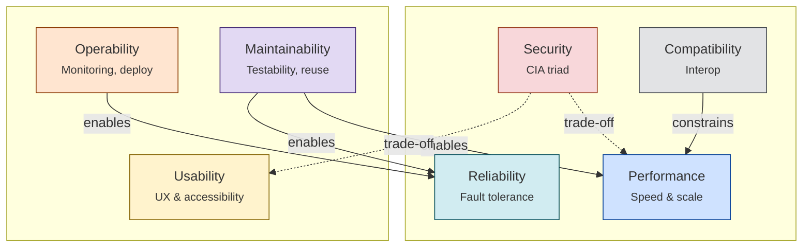
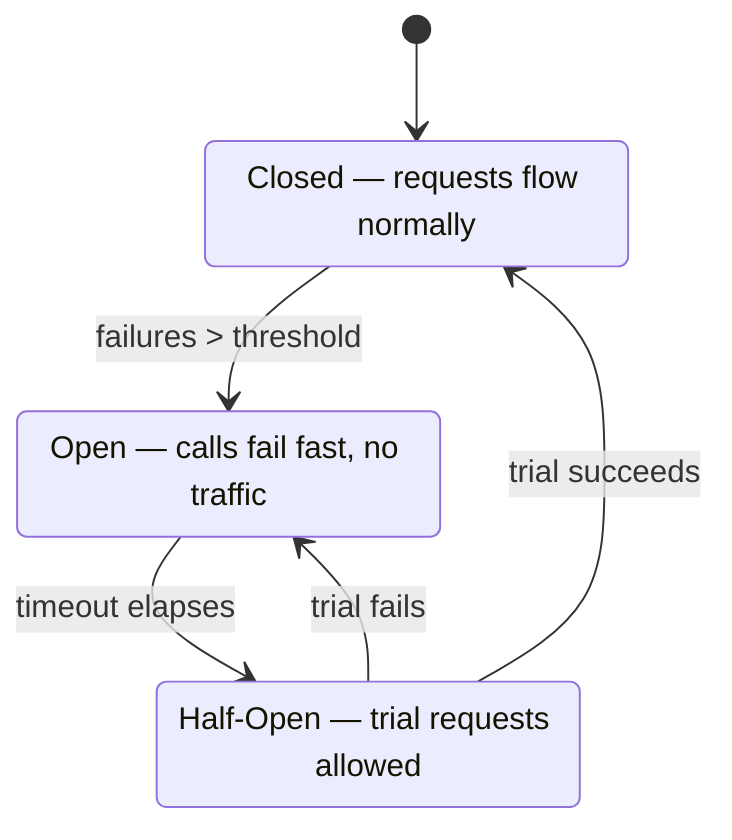
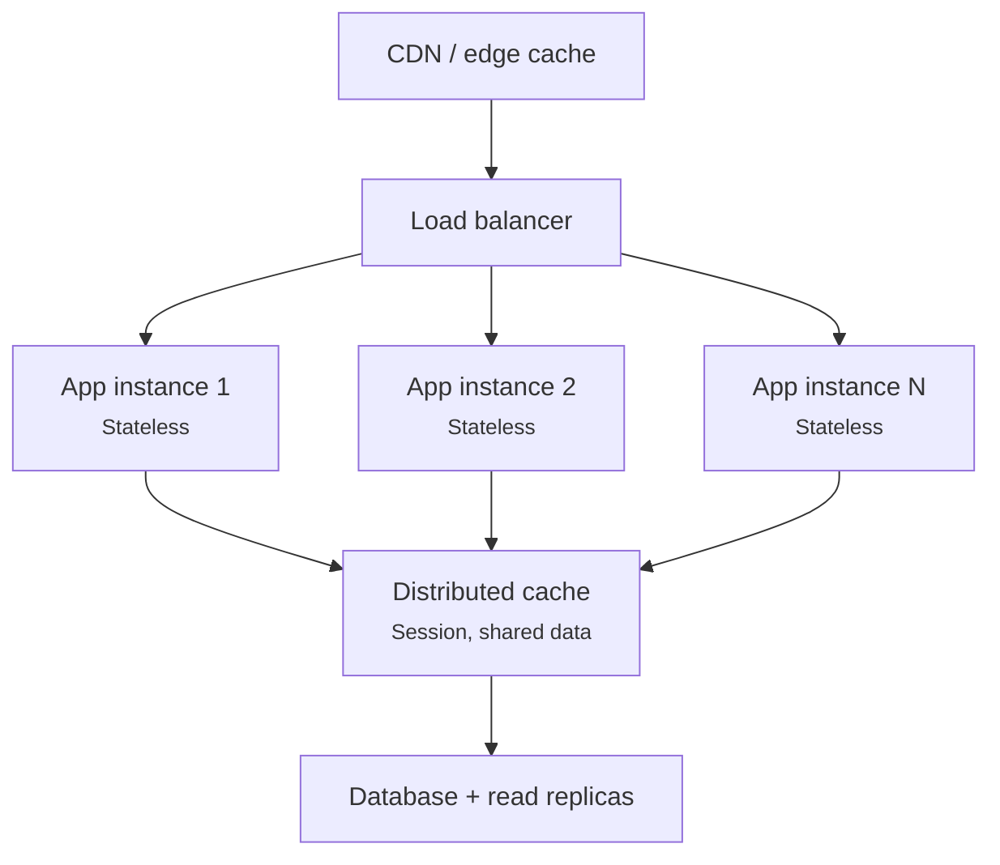

# Software Architecture & Design NFRs

A reference guide to non-functional requirements (NFRs): categories, relationships, importance weighting, and deep dives on reliability and performance.

---

## 1. NFR Dependency & Relationship Graph

**Solid arrow** = enables / supports &nbsp;&nbsp; **Dashed arrow** = trade-off / tension

**Key relationships:**
- **Testability → Reliability**: you can't trust what you can't verify — usually the highest-leverage NFR investment.
- **Observability → Reliability & Security**: you can't fix or detect what you can't see; monitoring underpins both incident response and audit trails.
- **Security ↔ Performance/Usability**: encryption, extra auth hops, and MFA all add latency and friction — a deliberate trade-off, not an oversight.
- **Compatibility → Performance**: locking into platform-native APIs (e.g. an Azure-native feature) can boost performance but reduce portability — the inverse trade-off.
- **Maintainability underlies almost everything else**: a system that's hard to change is also hard to make more secure, performant, or reliable over time — it's the "enabler of enablers."

---

## 2. NFR Categories

### 2.1 Performance Efficiency

| NFR | Description | Weight |
|---|---|---|
| Performance | Response time and processing speed under expected load | 5 |
| Scalability | Ability to handle growth in users/data by adding resources (vertical/horizontal) | 5 |
| Efficiency | Resource usage (CPU, memory, I/O, bandwidth) per unit of work | 4 |
| Capacity | Maximum load the system can handle before degrading | 3 |

### 2.2 Reliability & Resilience

| NFR | Description | Weight |
|---|---|---|
| Availability | % of time the system is operational (e.g. 99.9%) | 5 |
| Reliability | Consistency of correct behavior over time | 5 |
| Fault tolerance | Ability to continue operating despite component failures | 4 |
| Recoverability (DR) | Ability to restore service/data after a failure or disaster | 4 |
| Robustness | Graceful handling of unexpected input or conditions | 3 |

### 2.3 Security & Trust

| NFR | Description | Weight |
|---|---|---|
| Confidentiality | Data is accessible only to authorized parties | 5 |
| Integrity | Data/processes can't be tampered with undetected | 5 |
| Authentication | Verifying identity of users/systems | 5 |
| Authorization | Enforcing access rights per identity/role | 5 |
| Auditability | Traceable logs of who did what, when | 3 |
| Non-repudiation | Actions can't be denied after the fact (relevant for compliance/legal) | 2 |

### 2.4 Maintainability & Evolvability

| NFR | Description | Weight |
|---|---|---|
| Maintainability | Ease of fixing bugs and making changes safely | 5 |
| Modifiability | Ease of changing behavior with localized impact | 4 |
| Testability | Ease of verifying behavior via automated tests | 4 |
| Extensibility | Ease of adding new features without breaking existing ones | 4 |
| Reusability | Components can be reused in other contexts | 3 |
| Portability | Ease of running the system on different platforms/environments | 3 |

### 2.5 Usability & Accessibility

| NFR | Description | Weight |
|---|---|---|
| Usability | Ease of use and learnability for end users | 4 |
| Accessibility | Usable by people with disabilities (WCAG compliance etc.) | 3 |
| Learnability | How quickly a new user becomes productive | 2 |

### 2.6 Operability & Observability

| NFR | Description | Weight |
|---|---|---|
| Observability | Ability to understand internal state from logs/metrics/traces | 5 |
| Monitorability | Real-time visibility into health and performance | 4 |
| Deployability | Ease and safety of releasing new versions (CI/CD) | 4 |
| Configurability | Ability to change behavior via config without code changes | 3 |
| Manageability | Ease of day-to-day operations (scaling, patching, admin) | 3 |

### 2.7 Compatibility & Compliance

| NFR | Description | Weight |
|---|---|---|
| Interoperability | Ability to exchange data/work with other systems (APIs, standards) | 4 |
| Compatibility | Works correctly with specified hardware/software versions (backward/forward) | 3 |
| Compliance | Adherence to legal, regulatory, or industry standards (GDPR, SOC2, etc.) | 4 |

*Weight scale: 1 (low) to 5 (near-universal first-class concern in enterprise systems). Weights are indicative — actual priority shifts significantly by system type (e.g. a trading API weighs performance/reliability far higher than a marketing site).*

---

## 3. Reliability NFRs — Deep Dive

### 3.1 Availability

The percentage of time a system is operational and able to serve requests.

`Availability = Uptime / (Uptime + Downtime)`

| SLA target | Downtime/year | Downtime/month |
|---|---|---|
| 99% ("two nines") | 3.65 days | 7.3 hours |
| 99.9% ("three nines") | 8.76 hours | 43.8 minutes |
| 99.95% | 4.38 hours | 21.9 minutes |
| 99.99% ("four nines") | 52.6 minutes | 4.4 minutes |
| 99.999% ("five nines") | 5.26 minutes | 26 seconds |

**Achieved via:** redundancy at every tier, multi-AZ/multi-region deployments, health-probe-based instance replacement, zero-downtime deployments (blue-green, rolling, canary).

**Composite availability:** dependent services multiply, not max. Three services each at 99.9% combine to roughly 99.7% effective availability — worse than any individual component. Removing single points of failure is the core design principle behind availability.

### 3.2 Reliability

The probability that a system performs its intended function correctly, without failure, over a specified period. Distinct from availability — a system can be "up" but returning wrong answers or silently corrupting data.

**Key metrics:** MTBF (Mean Time Between Failures), failure rate.

**Achieved via:** idempotent operations (safe retries without duplicate side effects), defensive coding and input validation, comprehensive automated test coverage, chaos engineering (Azure Chaos Studio, AWS Fault Injection Simulator) to validate behavior under injected failure rather than assuming it.

### 3.3 Fault Tolerance

The ability to continue operating, possibly degraded, when a component fails — rather than failing entirely.

**Circuit breaker pattern (e.g. via Polly in .NET):**

**Key patterns:**

| Pattern | What it does |
|---|---|
| Circuit breaker | Stops calling a failing dependency for a cooldown period, so it can recover and so you fail fast instead of piling up timeouts |
| Retry (with backoff/jitter) | Re-attempts transient failures — only for idempotent operations |
| Bulkhead isolation | Limits concurrent calls to a dependency so one slow/failing service can't exhaust threads/connections app-wide |
| Timeout | Bounds how long you'll wait, so a hung dependency doesn't cascade |
| Fallback | Returns a cached/default value when the primary path fails |
| Graceful degradation | Disables non-critical features under load/failure rather than failing the whole request |

### 3.4 Recoverability (Disaster Recovery)

How quickly and completely the system can restore service and data after a significant failure (hardware loss, region outage, data corruption, ransomware).

| Metric | Meaning |
|---|---|
| RTO (Recovery Time Objective) | Maximum acceptable time to restore service after an incident |
| RPO (Recovery Point Objective) | Maximum acceptable data loss, measured in time |

**DR strategy tiers** (cost increases, RTO/RPO decrease going down):
1. Backup & restore — cheapest, slowest (hours of RTO)
2. Pilot light — minimal standby infrastructure, scaled up on failover
3. Warm standby — scaled-down but running replica in a second region
4. Multi-region active-active — near-zero RTO/RPO, most expensive

On Azure/AWS: geo-redundant storage (GRS), read replicas, Azure Site Recovery / AWS Backup, multi-region deployments with Traffic Manager / Route 53 failover routing.

### 3.5 Robustness

The system's ability to handle unexpected, invalid, or edge-case input gracefully rather than crashing or producing undefined behavior.

**Achieved via:** input validation at every trust boundary, explicit error handling instead of unhandled exceptions bubbling up, type safety and nullable reference types (`#nullable enable` in modern .NET), defensive defaults for missing config/dependencies.

### How reliability NFRs interlock
- **Fault tolerance** keeps the system available *during* partial failure — the mechanism; availability is the outcome metric.
- **Robustness** prevents reliability problems from bad input; **fault tolerance** handles infrastructure problems.
- **Recoverability** is the safety net for failures fault tolerance couldn't absorb.
- All four roll up into **availability** as the umbrella SLA number.

---

## 4. Performance NFRs — Deep Dive

### 4.1 Performance (Response Time & Throughput)

How fast the system responds and how much work it can process per unit time.

**Always measure percentiles, never just averages:**

| Metric | What it means | Why it matters |
|---|---|---|
| P50 (median) latency | Typical user experience | Baseline expectation |
| P95 latency | 95% of requests are faster than this | Catches moderate outliers |
| P99 latency | 99% of requests are faster than this | Reveals tail latency averages hide entirely |
| Throughput | Requests/transactions per second | Capacity under real load |
| TTFB (time to first byte) | Server responsiveness before payload delivery | Perceived speed, especially APIs/web |

An average of 50ms can hide a P99 of 4 seconds — SLOs should be written as "P99 < 300ms," not "average < 300ms."

**Achieved via:** caching at multiple layers (in-memory `IMemoryCache`, distributed Redis, CDN), async/await and non-blocking I/O, connection pooling, query optimization (indexing, avoiding N+1 in EF Core, pagination), response compression and payload minimization.

### 4.2 Scalability

The ability to handle increased load by adding resources, ideally without redesigning the system.

| Type | How it works | Trade-offs |
|---|---|---|
| Vertical (scale up) | Bigger machine — more CPU/RAM on the same instance | Simple, but hard ceiling, downtime to resize |
| Horizontal (scale out) | More machines running the same workload | Near-limitless ceiling, requires stateless design + load balancing |

Horizontal scaling requires the app to be **stateless** — session state, in-process caches, and local file writes all break it unless externalized (session state in Redis, files in Blob Storage/S3).

**Typical horizontally-scaled request path:**

**Further techniques:** auto-scaling on CPU/memory/queue-length metrics, database sharding, read replicas, event-driven/queue-based decoupling (Azure Service Bus / AWS SQS), watching DB connection pool limits — often the real scaling ceiling even when app instances scale fine.

### 4.3 Efficiency

How economically the system uses resources (CPU, memory, disk I/O, network bandwidth, cost) per unit of work delivered. You can always scale a wasteful system with more hardware — efficiency is what keeps the cloud bill sane.

**Watch:** memory allocations and GC pressure (`Span<T>`, object pooling, avoiding boxing in .NET), CPU utilization per request (inefficient LINQ, unnecessary serialization, sync-over-async), cost-efficiency per transaction (right-sizing VM SKUs, reserved instances, serverless for spiky workloads).

### 4.4 Capacity

The maximum load (concurrent users, requests/sec, data volume) the system can sustain before performance degrades unacceptably.

**Determined via:** load testing (JMeter, k6, Azure Load Testing) to find where latency/error rate starts climbing, stress testing to find the actual breaking point and failure mode, capacity planning based on growth projections with provisioning margin.

### How performance NFRs interlock
- **Efficiency** determines **capacity** per unit of hardware.
- **Scalability** is the answer when capacity is exceeded — add resources rather than redesign.
- **Performance** (latency) degrades sharply, not linearly, as load approaches capacity (queueing theory / Little's Law).
- Sits under the **Compatibility** trade-off: platform-native optimizations reduce portability.

---

*Weights and priorities in this document are indicative starting points — actual priority should be recalibrated per system type (e.g. high-throughput trading API vs. internal line-of-business app).*
