# C# Language Spec & Features — вопросы для собеседований (Intermediate → Advanced/Guru)

> 200+ вопросов, сгруппированных по темам, с детальными ответами, ссылками на дополнительные материалы и диаграммами там, где это упрощает понимание.
> Уровень сложности указан для каждого вопроса: **[I]** — Intermediate, **[A]** — Advanced, **[G]** — Guru/Expert.

---

## Оглавление

1. [Система типов, value/reference types, boxing](#1-система-типов-valuereference-types-boxing)
2. [Классы, структуры, records](#2-классы-структуры-records)
3. [ООП: наследование, полиморфизм, модификаторы доступа](#3-ооп-наследование-полиморфизм-модификаторы-доступа)
4. [Интерфейсы](#4-интерфейсы)
5. [Дженерики (Generics)](#5-дженерики-generics)
6. [Делегаты и события](#6-делегаты-и-события)
7. [Лямбда-выражения и замыкания](#7-лямбда-выражения-и-замыкания)
8. [LINQ](#8-linq)
9. [Методы расширения](#9-методы-расширения)
10. [Обработка исключений](#10-обработка-исключений)
11. [Коллекции, IEnumerable/IEnumerator, yield](#11-коллекции-ienumerableienumerator-yield)
12. [Async/await, Task, TAP](#12-asyncawait-task-tap)
13. [Многопоточность и синхронизация](#13-многопоточность-и-синхронизация)
14. [Управление памятью, GC, IDisposable](#14-управление-памятью-gc-idisposable)
15. [Nullable reference types и Nullable&lt;T&gt;](#15-nullable-reference-types-и-nullablet)
16. [Pattern matching и switch expressions](#16-pattern-matching-и-switch-expressions)
17. [Равенство: Equals, GetHashCode, ==](#17-равенство-equals-gethashcode-)
18. [Перегрузка операторов и конверсии](#18-перегрузка-операторов-и-конверсии)
19. [Reflection и атрибуты](#19-reflection-и-атрибуты)
20. [Span&lt;T&gt;, Memory&lt;T&gt;, производительность](#20-spant-memoryt-производительность)
21. [Unsafe код и указатели](#21-unsafe-код-и-указатели)
22. [Свойства и индексаторы](#22-свойства-и-индексаторы)
23. [Статические члены и конструкторы](#23-статические-члены-и-конструкторы)
24. [Современный C# (8–12): новые возможности языка](#24-современный-c-812-новые-возможности-языка)
25. [Сериализация](#25-сериализация)
26. [Namespaces, сборки, модули](#26-namespaces-сборки-модули)

---

## 1. Система типов, value/reference types, boxing

### 1. В чём разница между value type и reference type? `[I]`

**Ответ.** Value type (struct, enum, встроенные числовые типы) хранит сами данные непосредственно в переменной. При копировании переменной копируются все данные — получаются два независимых экземпляра. Reference type (class, delegate, string, массив, interface-переменная) хранит в переменной лишь ссылку (указатель) на объект в куче; копирование переменной копирует ссылку, а не сам объект, поэтому обе переменные указывают на один и тот же объект. Отсюда разное поведение при передаче в методы, сравнении и присваивании.

**Ресурсы:**
- [Value types (C# reference) — Microsoft Learn](https://learn.microsoft.com/en-us/dotnet/csharp/language-reference/builtin-types/value-types)
- [Reference types (C# reference) — Microsoft Learn](https://learn.microsoft.com/en-us/dotnet/csharp/language-reference/keywords/reference-types)

---

### 2. Где физически хранятся value types и reference types — в стеке или в куче? `[I]`

**Ответ.** Распространённое упрощение "value types всегда в стеке, reference types всегда в куче" неточно. Реальное правило: место хранения определяется *временем жизни переменной*, а не типом. Локальная value-переменная метода лежит на стеке. Но если value type является полем класса (reference type) или элементом массива reference-типа, то он хранится в куче вместе с объектом-владельцем, потому что живёт столько же, сколько владелец. Замыкания (closures) и итераторы (yield) также "поднимают" локальные value-переменные в кучу через compiler-generated классы.

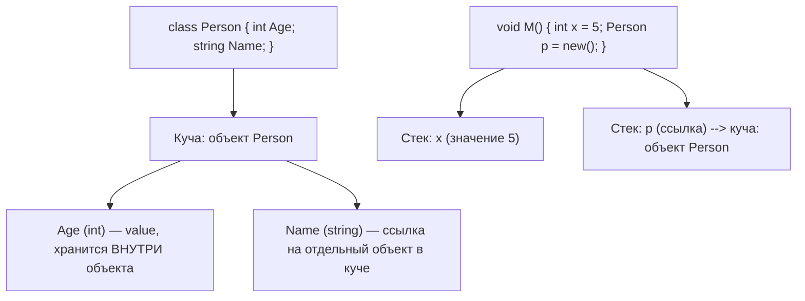

**Ресурсы:**
- [.NET Type System](https://learn.microsoft.com/en-us/dotnet/standard/base-types/common-type-system)
- Eric Lippert, "The Truth About Value Types" (блог, ключевая статья, развенчивающая миф про стек/кучу)

---

### 3. Что такое boxing и unboxing? Почему это дорого? `[I]`

**Ответ.** Boxing — неявное преобразование value type в object (или в интерфейс, который тип реализует): CLR выделяет в куче новый объект, копирует туда значение и оборачивает его в заголовок объекта (type handle + sync block). Unboxing — обратная операция: извлечение значения из "коробки" обратно в value type переменную (требует явного каста и проверки типа в рантайме). Дорого это по двум причинам: (1) каждый boxing — это выделение памяти в куче и, соответственно, дополнительная нагрузка на GC; (2) unboxing требует проверки типа (InvalidCastException при несовпадении). В горячих путях (циклы, коллекции без generics, интерфейсы типа `IComparable` на структурах) boxing — частый источник скрытых аллокаций.

**Ресурсы:**
- [Boxing and Unboxing — Microsoft Learn](https://learn.microsoft.com/en-us/dotnet/csharp/programming-guide/types/boxing-and-unboxing)

---

### 4. Что происходит при передаче struct в метод по значению? `[I]`

**Ответ.** По умолчанию struct передаётся *по значению*: создаётся полная битовая копия всех полей на стеке (или в месте хранения аргумента). Изменения внутри метода не влияют на оригинал. Для больших структур это может быть дороже, чем передача ссылки на класс, поэтому большие изменяемые структуры — антипаттерн. Чтобы избежать копирования (но сохранить value-семантику доступа), используют `in` для readonly-передачи по ссылке или `ref`/`ref readonly` при необходимости мутации/избежания копий.

**Ресурсы:**
- [Passing value-type parameters — Microsoft Learn](https://learn.microsoft.com/en-us/dotnet/csharp/language-reference/keywords/method-parameters)

---

### 5. Как работает `default(T)` и что такое default value для разных типов? `[A]`

**Ответ.** `default(T)` (или `default` с выводом типа) возвращает "нулевое" значение типа: для числовых типов — 0, для bool — false, для enum — значение соответствующее 0, для reference types и Nullable<T> — null, для struct — экземпляр со всеми полями, установленными в default рекурсивно (аналог `new T()` для parameterless case, но без вызова конструктора — просто zero-инициализация памяти через `initobj` в IL). Это особенно полезно в generic-коде, где неизвестно, value type перед нами или reference type.

**Ресурсы:**
- [default value expressions — Microsoft Learn](https://learn.microsoft.com/en-us/dotnet/csharp/language-reference/operators/default)

---

### 6. В чём разница между `ref`, `out` и `in` параметрами? `[A]`

**Ответ.** Все три передают параметр *по ссылке*, но с разной семантикой: `ref` требует, чтобы переменная была инициализирована до вызова, и позволяет читать/писать внутри метода — изменения видны вызывающей стороне. `out` не требует инициализации снаружи, но обязывает метод присвоить значение перед выходом (компилятор проверяет definite assignment). `in` передаёт по ссылке *только для чтения* — компилятор запрещает изменение параметра внутри метода и (для больших структур) избегает копирования, сохраняя семантику "как будто передано по значению", но без затрат на копирование.

**Ресурсы:**
- [ref keyword](https://learn.microsoft.com/en-us/dotnet/csharp/language-reference/keywords/ref) · [out keyword](https://learn.microsoft.com/en-us/dotnet/csharp/language-reference/keywords/out-parameter-modifier) · [in keyword](https://learn.microsoft.com/en-us/dotnet/csharp/language-reference/keywords/in-parameter-modifier)

---

### 7. Что такое `ref locals` и `ref returns`? Где это применяется? `[G]`

**Ответ.** `ref return` позволяет методу вернуть *ссылку* на переменную (например, элемент массива или поля объекта) вместо копии значения; вызывающий код может присвоить эту ссылку `ref`-локальной переменной (`ref var x = ref SomeMethod();`) и модифицировать оригинал напрямую, без повторного поиска/индексации. Это применяется в высокопроизводительном коде — например, в реализациях `Span<T>`, работе с элементами больших массивов/матриц в игровых движках или численных библиотеках, где избегание копирования критично. Ограничение: нельзя возвращать ref на локальную переменную метода (она умрёт вместе со стек-фреймом) — компилятор это отслеживает через анализ "safe-to-escape".

**Ресурсы:**
- [Reference return values — Microsoft Learn](https://learn.microsoft.com/en-us/dotnet/csharp/programming-guide/classes-and-structs/ref-return-example)

---

### 8. Что такое `readonly struct` и зачем он нужен? `[A]`

**Ответ.** `readonly struct` — структура, все поля которой неизменяемы после конструктора (компилятор это гарантирует статически). Главное практическое преимущество: когда такая структура передаётся через `in`-параметр, компилятор *точно знает*, что метод не может её мутировать, и поэтому не обязан создавать защитную копию (defensive copy). Без `readonly` при вызове любого метода/свойства структуры через `in`-ссылку компилятор вынужден на всякий случай копировать структуру целиком (ведь метод мог бы быть не-readonly и мутировать её), что сводит на нет выгоду от передачи по ссылке.

**Ресурсы:**
- [readonly struct — Microsoft Learn](https://learn.microsoft.com/en-us/dotnet/csharp/language-reference/builtin-types/struct#readonly-struct)

---

### 9. Почему рекомендуется делать структуры неизменяемыми (immutable)? `[I]`

**Ответ.** Структуры копируются при каждом присваивании, передаче в метод, помещении в коллекцию. Если структура изменяема, легко случайно мутировать *копию*, а не оригинал, что приводит к трудноуловимым багам (классический пример — мутация структуры, полученной как элемент `List<T>` через индексатор, или свойства-структуры через getter). Immutable-структуры устраняют этот класс ошибок: раз объект нельзя изменить, неважно, копия перед вами или оригинал — поведение предсказуемо.

**Ресурсы:**
- [Write safe and efficient C# code — Microsoft Learn](https://learn.microsoft.com/en-us/dotnet/csharp/write-safe-efficient-code)

---

### 10. Как `System.Object` служит универсальным базовым типом для value и reference types? `[I]`

**Ответ.** В CTS (Common Type System) все типы, включая примитивы и структуры, неявно наследуются от `System.Object` (через промежуточный `System.ValueType` для value types). Это обеспечивает единый набор базовых операций (`ToString`, `Equals`, `GetHashCode`, `GetType`) для любого типа. Для value types присвоение переменной типа `object` вызывает boxing — создаётся объект в куче, содержащий копию значения плюс служебные метаданные (method table pointer, sync block index).

**Ресурсы:**
- [Common Type System — Microsoft Learn](https://learn.microsoft.com/en-us/dotnet/standard/base-types/common-type-system)

---

### 11. В чём разница между `const` и `readonly` (и `static readonly`)? `[I]`

**Ответ.** `const` — компиляционная константа: значение вычисляется на этапе компиляции, встраивается (inlined) во все места использования и не может зависеть от рантайм-данных; допустимы только примитивные типы, строки и enum. `readonly` — поле, значение которого можно присвоить только в объявлении или в конструкторе, но вычисляется оно в рантайме (может зависеть от параметров конструктора, конфигурации и т.д.). Важное следствие "инлайнинга" `const`: если библиотека A объявляет `public const int X = 1`, а сборка B использует `A.X`, значение 1 "зашивается" в B при компиляции — если A обновится до `X = 2` без пересборки B, B продолжит использовать старое значение 1. `readonly`-поля этой проблемы не имеют, так как читаются через обращение к полю в рантайме.

**Ресурсы:**
- [const keyword](https://learn.microsoft.com/en-us/dotnet/csharp/language-reference/keywords/const) · [readonly keyword](https://learn.microsoft.com/en-us/dotnet/csharp/language-reference/keywords/readonly)

---

### 12. Как устроен `Nullable<T>` изнутри и что такое "lifted operators"? `[A]`

**Ответ.** `Nullable<T>` (`T?` для value types) — это generic-структура с двумя полями: `bool hasValue` и `T value`. Она не меняет "value-type природу" `T`: `int?` остаётся value type, просто дополненным флагом наличия значения. Компилятор генерирует специальную логику ("lifted operators") для операторов (`+`, `==`, `<` и т.д.) над `Nullable<T>`: если хотя бы один операнд — null, результат арифметических операций — null, а результат сравнения `==`/`!=` вычисляется явно (null == null → true, null == 5 → false), без выброса исключения. Присвоение `null` переменной `int?` устанавливает `hasValue = false`; обращение к `.Value`, когда `hasValue == false`, бросает `InvalidOperationException`.

**Ресурсы:**
- [Nullable value types — Microsoft Learn](https://learn.microsoft.com/en-us/dotnet/csharp/language-reference/builtin-types/nullable-value-types)

---

## 2. Классы, структуры, records

### 13. В чём разница между `class` и `struct`, когда что выбирать? `[I]`

**Ответ.** `class` — reference type: живёт в куче, поддерживает наследование, работает через ссылки, дешёвое присваивание (копируется только ссылка). `struct` — value type: копируется целиком при присваивании/передаче, не поддерживает наследование от других структур (только реализацию интерфейсов), не может иметь `null` (кроме как через `Nullable<T>`). Microsoft рекомендует struct для небольших (условно ≤ 16 байт), логически неизменяемых значений, представляющих одно значение (Point, Money, Vector), которые часто создаются и уничтожаются — так вы избегаете нагрузки на GC. Для всего остального (бизнес-сущности, объекты с identity, изменяемое состояние, полиморфизм) — class.

**Ресурсы:**
- [Choosing Between Class and Struct — Microsoft Learn](https://learn.microsoft.com/en-us/dotnet/standard/design-guidelines/choosing-between-class-and-struct)

---

### 14. Что такое `record` и `record struct`? Чем принципиально отличаются от `class`? `[I]`

**Ответ.** `record` (C# 9+) — это class (по умолчанию reference type) с синтезированной компилятором *value-based equality*: два record-объекта равны, если равны все их публичные свойства, а не по ссылке, как у обычного class. Компилятор также генерирует `ToString()` с перечислением свойств, `Clone`-подобный механизм для `with`-выражений и (для positional records) `Deconstruct`. `record struct` (C# 10+) — то же самое, но как value type: копируется по значению, как обычная struct, но с той же синтезированной equality/ToString-инфраструктурой. Ключевое отличие record от class — именно семантика равенства "по значению" и удобный immutable-ориентированный синтаксис.

**Ресурсы:**
- [Records — Microsoft Learn](https://learn.microsoft.com/en-us/dotnet/csharp/fundamentals/types/records)

---

### 15. Как именно работает синтезированная equality у records? Что такое `EqualityContract`? `[A]`

**Ответ.** Компилятор генерирует для record переопределённые `Equals(object)`, строго типизированный `Equals(RecordType)` (реализуя `IEquatable<T>`), `GetHashCode()` и операторы `==`/`!=`. Сравнение идёт по типу времени выполнения и по значению каждого поля/свойства (включая базовые, если есть наследование). Для поддержки корректного сравнения в иерархии наследования генерируется виртуальное protected свойство `EqualityContract`, возвращающее `typeof(текущий record)`; `Equals` сначала проверяет, что `EqualityContract` у обоих объектов совпадает (это гарантирует, что `Base b = new Derived(); b.Equals(new Base())` вернёт false, даже если поля базового класса совпали — типы разные).

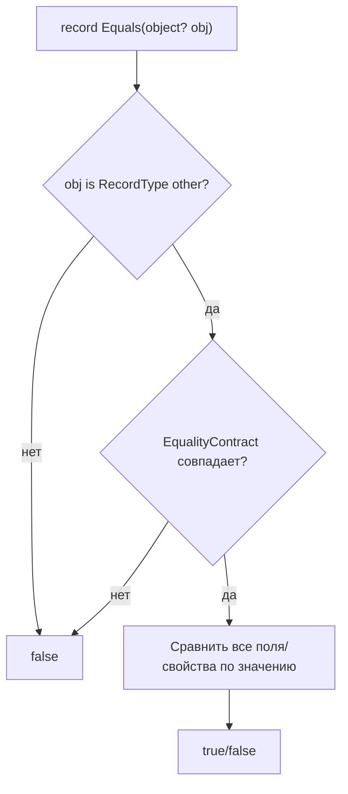

**Ресурсы:**
- [Record types — equality — Microsoft Learn](https://learn.microsoft.com/en-us/dotnet/csharp/fundamentals/types/records#value-equality)

---

### 16. Что такое `with`-выражения и non-destructive mutation? `[I]`

**Ответ.** `with`-выражение создаёт *новый* экземпляр record, копируя все значения из исходного и заменяя только явно указанные свойства: `var p2 = p1 with { Age = 30 };`. Компилятор генерирует скрытый метод `<Clone>$`, который делает поверхностную (shallow) копию объекта; затем на копии применяются присвоения из инициализатора. Это позволяет писать в immutable-стиле: вместо мутации существующего объекта вы производите новую версию, оставляя оригинал нетронутым — что упрощает рассуждения о состоянии, особенно в многопоточном коде.

**Ресурсы:**
- [with expression — Microsoft Learn](https://learn.microsoft.com/en-us/dotnet/csharp/language-reference/operators/with-expression)

---

### 17. Что такое primary constructors (C# 12) и как они ведут себя в классах/структурах по сравнению с records? `[A]`

**Ответ.** Primary constructor — синтаксис, при котором параметры конструктора объявляются прямо в заголовке типа: `class Point(int x, int y) { }`. В `record` эти параметры автоматически становятся публичными init-only свойствами (для positional records). В обычном `class`/`struct` (C# 12) параметры primary constructor'а — это НЕ свойства автоматически: они доступны как приватные "захваченные" параметры внутри тела класса (похоже на замыкание) и не видны снаружи, если явно не объявить соответствующие свойства. Это частая ловушка на собеседовании: разработчики ожидают, что primary constructor в plain class тоже создаёт публичные свойства, как в record, но это не так.

**Ресурсы:**
- [Primary constructors — Microsoft Learn](https://learn.microsoft.com/en-us/dotnet/csharp/whats-new/csharp-12#primary-constructors)

---

### 18. Что такое positional records и как генерируется `Deconstruct`? `[I]`

**Ответ.** Positional record — `record Person(string Name, int Age);` — компилятор автоматически создаёт: init-only свойства `Name` и `Age`, конструктор, принимающий эти параметры, и метод `Deconstruct(out string Name, out int Age)`, позволяющий деконструкцию: `var (name, age) = person;`. Это удобно для функционального стиля работы с данными и pattern matching (`if (person is ("Alice", var age))`).

**Ресурсы:**
- [Positional syntax for property definition — Microsoft Learn](https://learn.microsoft.com/en-us/dotnet/csharp/language-reference/builtin-types/record#positional-syntax-for-property-definition)

---

### 19. В чём разница поведения `record class` и `record struct` при копировании/сравнении? `[A]`

**Ответ.** `record class` (эквивалент просто `record`) — reference type: переменные хранят ссылку, но `Equals`/`==` переопределены на value-based сравнение полей. `record struct` — value type: копируется целиком при присваивании (как обычная struct), а equality генерируется по тем же правилам value-сравнения — но здесь она *дополняет*, а не заменяет стандартное struct equality (структуры и так сравниваются по значению через `ValueType.Equals`, но синтезированный код для record struct эффективнее — без рефлексии). По умолчанию `record struct` изменяемый (в отличие от record class, где свойства init-only по умолчанию); для immutable-варианта нужно писать `readonly record struct`.

**Ресурсы:**
- [record struct — Microsoft Learn](https://learn.microsoft.com/en-us/dotnet/csharp/language-reference/builtin-types/record#record-structs)

---

### 20. Как работает наследование у records и что компилятор генерирует дополнительно? `[G]`

**Ответ.** `record` может наследоваться от другого `record` (но не от `record struct`, и `record class` не может наследовать обычный `class`, кроме `object`). При наследовании компилятор переопределяет `EqualityContract` в каждом производном типе, обеспечивая, что экземпляры разных типов в иерархии никогда не считаются равными, даже с идентичными полями. Также генерируется цепочка вызовов `Equals`/`GetHashCode`, которая включает поля базового record'а (через вызов `base.Equals` и комбинирование хэшей). Копирующий конструктор (`protected Derived(Derived original)`) тоже генерируется для поддержки `with` в иерархии наследования.

**Ресурсы:**
- [Inheritance in records — Microsoft Learn](https://learn.microsoft.com/en-us/dotnet/csharp/fundamentals/types/records#inheritance)

---

### 21. Что такое `init`-accessor и чем отличается от `set`? `[I]`

**Ответ.** `init` — модификатор доступа свойства (введён в C# 9 вместе с records), позволяющий присваивать значение свойству только во время инициализации объекта: в object initializer (`new Foo { Bar = 1 }`) или в конструкторе самого типа. После завершения инициализации объект становится неизменяемым по этому свойству — попытка присвоить `foo.Bar = 2` вне инициализации приведёт к ошибке компиляции. Это даёт immutability без необходимости объявлять все свойства через конструктор с длинным списком параметров, сохраняя читаемость object initializer syntax.

**Ресурсы:**
- [init keyword — Microsoft Learn](https://learn.microsoft.com/en-us/dotnet/csharp/language-reference/keywords/init)

---

### 22. Зачем ограничивать наследование records через `sealed`? `[A]`

**Ответ.** Синтезированная equality у records построена на предположении, что `Equals` сравнивает объекты именно ожидаемого типа через `EqualityContract`. Если оставить record открытым для неограниченного наследования, легко получить неочевидное поведение equality в глубоких иерархиях, а также нарушить принцип подстановки Лисков применительно к value-семантике (расширение набора полей в наследнике меняет смысл "равенства"). Поэтому на практике, если наследование не задумано намеренно как часть модели, records часто помечают `sealed` — как и обычные immutable value-like классы, чтобы зафиксировать контракт equality и избежать хрупкой иерархии.

**Ресурсы:**
- [sealed — Microsoft Learn](https://learn.microsoft.com/en-us/dotnet/csharp/language-reference/keywords/sealed)

---

## 3. ООП: наследование, полиморфизм, модификаторы доступа

### 23. В чём разница между overloading (перегрузкой) и overriding (переопределением)? `[I]`

**Ответ.** Overloading — это несколько методов с одинаковым именем, но разной сигнатурой (набором/типами параметров) в пределах одного типа; выбор конкретной перегрузки происходит **на этапе компиляции** по типам аргументов (static/compile-time polymorphism). Overriding — переопределение поведения `virtual`/`abstract` метода базового класса в производном классе с той же сигнатурой; выбор реализации происходит **в рантайме** по фактическому типу объекта (dynamic polymorphism), независимо от того, через переменную какого статического типа вызван метод.

**Ресурсы:**
- [Polymorphism — Microsoft Learn](https://learn.microsoft.com/en-us/dotnet/csharp/fundamentals/object-oriented/polymorphism)

---

### 24. Как работает `virtual`/`override` под капотом (v-table)? `[A]`

**Ответ.** Каждый класс с виртуальными членами имеет связанную "таблицу виртуальных методов" (method table в CLR) — массив указателей на реализации. Экземпляр объекта хранит указатель на method table своего *реального* типа. При вызове `virtual`-метода через ссылку/переменную базового типа CLR не смотрит на статический тип переменной — он берёт method table по фактическому типу объекта (из его заголовка) и вызывает метод по соответствующему слоту. `override` в производном классе замещает указатель в этом слоте на свою реализацию; если метод не virtual, вызов резолвится статически по типу переменной (early binding), без обращения к таблице.

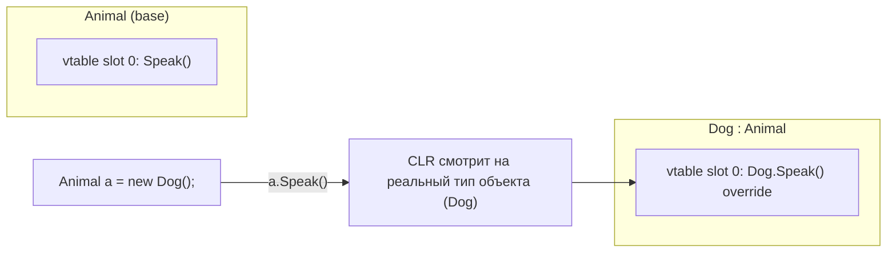

**Ресурсы:**
- [Знать про virtual method table — CLR via C# (Jeffrey Richter)]
- [Versioning with the Override and New Keywords — Microsoft Learn](https://learn.microsoft.com/en-us/dotnet/csharp/programming-guide/classes-and-structs/knowing-when-to-use-override-and-new-keywords)

---

### 25. Что такое method hiding через `new` и почему оно может привести к багам? `[A]`

**Ответ.** Если в производном классе объявить метод с той же сигнатурой, что у метода базового класса, но без `override` (и базовый метод не абстрактный/не virtual, либо явно скрывается через `new`), компилятор создаёт *новый, независимый* метод — он "прячет" (hides) базовую версию для статического типа производного класса, но не участвует в виртуальной диспетчеризации. Опасность: вызов через переменную базового типа всегда попадёт в базовую реализацию, а через переменную производного типа — в новую, даже если физически это один и тот же объект. Это классическая ловушка на собеседовании: `Base b = new Derived(); b.Method();` вызовет `Base.Method()`, если `Method` скрыт через `new`, а не переопределён через `override`.

**Ресурсы:**
- [new modifier — Microsoft Learn](https://learn.microsoft.com/en-us/dotnet/csharp/language-reference/keywords/new-modifier)

---

### 26. Abstract class vs interface — когда что выбирать? `[I]`

**Ответ.** `abstract class` может содержать реализованные члены, поля, конструкторы, состояние и модификаторы доступа; поддерживает только одиночное наследование. `interface` традиционно описывал только контракт (сигнатуры без реализации), но начиная с C# 8 может содержать default-реализации методов; класс может реализовывать множество интерфейсов. Правило выбора: abstract class — когда есть общее состояние/реализация и явная связь "is-a" в единой иерархии; interface — когда нужен контракт поведения, который могут разделять несовместимые по иерархии типы ("can-do"), либо нужна множественная реализация нескольких ролей.

**Ресурсы:**
- [Abstract and Sealed Classes — Microsoft Learn](https://learn.microsoft.com/en-us/dotnet/csharp/fundamentals/object-oriented/abstract-and-sealed-classes-and-class-members)

---

### 27. Что дают `sealed class` и `sealed override method`? `[I]`

**Ответ.** `sealed class` запрещает наследование от данного класса вообще. `sealed` на переопределённом (`override`) методе запрещает дальнейшее переопределение этого конкретного метода в более глубоких наследниках, при этом сам класс может оставаться не-sealed. Помимо смысловых причин (фиксация контракта, защита инвариантов), sealed даёт и практическую пользу для JIT: вызовы методов sealed-класса или sealed-метода могут быть более агрессивно инлайнены/девиртуализированы, так как компилятор точно знает, что переопределений не будет.

**Ресурсы:**
- [sealed — Microsoft Learn](https://learn.microsoft.com/en-us/dotnet/csharp/language-reference/keywords/sealed)

---

### 28. Перечислите модификаторы доступа в C#. Чем `protected internal` отличается от `private protected`? `[I]`

**Ответ.** `public` — доступ отовсюду. `private` — только внутри содержащего типа. `protected` — внутри типа и его наследников (в любой сборке). `internal` — внутри той же сборки. `protected internal` — объединение через ИЛИ: доступ разрешён, если код находится в той же сборке **ИЛИ** является наследником (даже в другой сборке). `private protected` (C# 7.2) — объединение через И: доступ разрешён, только если код одновременно и в той же сборке, и является наследником. Это самый узкий из "family"-модификаторов.

```
protected internal  =  (same assembly)  OR  (derived class, любая сборка)
private protected   =  (same assembly)  AND (derived class)
```

**Ресурсы:**
- [Access Modifiers — Microsoft Learn](https://learn.microsoft.com/en-us/dotnet/csharp/programming-guide/classes-and-structs/access-modifiers)

---

### 29. В каком порядке вызываются конструкторы при наследовании? `[I]`

**Ответ.** Сначала выполняется инициализация полей базового класса, затем тело конструктора базового класса (через явный или неявный `base()`), и только после этого — инициализация полей производного класса и тело его конструктора. То есть конструкторы вызываются "сверху вниз" по иерархии (от самого базового к самому производному), но фактическое выполнение тел начинается с самого базового и разворачивается наружу. Важный нюанс: если базовый конструктор вызывает virtual-метод, а производный класс его переопределяет, будет вызвана переопределённая версия — даже несмотря на то, что поля производного класса ещё не инициализированы (частый источник NRE/багов).

**Ресурсы:**
- [Using Constructors — Microsoft Learn](https://learn.microsoft.com/en-us/dotnet/csharp/programming-guide/classes-and-structs/using-constructors)

---

### 30. В чём разница между статическим (compile-time) и динамическим (runtime) полиморфизмом в C#? `[I]`

**Ответ.** Статический полиморфизм разрешается компилятором на основе статически известных типов: overload resolution, generics (в значительной степени), операторная перегрузка. Динамический полиморфизм разрешается в рантайме на основе фактического типа объекта: virtual/override, интерфейсные вызовы, `dynamic`-типизация (DLR). C# — гибридный язык: он активно использует оба механизма, и то, какой из них сработает в конкретном вызове, зависит от того, объявлен ли член как `virtual`/`abstract`/`override`, и от статического типа переменной, через которую идёт вызов.

**Ресурсы:**
- [Polymorphism — Microsoft Learn](https://learn.microsoft.com/en-us/dotnet/csharp/fundamentals/object-oriented/polymorphism)

---

### 31. Что такое принцип "composition over inheritance" и почему он актуален для C#? `[I]`

**Ответ.** Принцип рекомендует собирать поведение объекта из независимых компонентов (композиция через интерфейсы/делегирование), а не выстраивать глубокие иерархии наследования. Наследование создаёт жёсткую связь между базовым и производным классом (изменение базового класса может сломать все наследники — "хрупкий базовый класс"), тогда как композиция даёт гибкость: поведение можно комбинировать и заменять в рантайме (например, через Dependency Injection). В C# это выражается в широком использовании интерфейсов и внедрения зависимостей вместо построения многоуровневых `abstract class` иерархий.

**Ресурсы:**
- [Design Guidelines — Choosing Between Class and Interface](https://learn.microsoft.com/en-us/dotnet/standard/design-guidelines/interface)

---

### 32. Что такое `partial class` и `partial method`? Для чего используются? `[I]`

**Ответ.** `partial class` позволяет разделить определение одного класса на несколько файлов; компилятор собирает их в единый тип при компиляции. Основное применение — code generation (например, WinForms-дизайнер, Entity Framework, source generators, Blazor): сгенерированный код лежит в одном файле, а ручной код разработчика — в другом, не смешиваясь. `partial method` — метод, объявление которого может быть в одной части класса, а реализация — в другой (или отсутствовать вовсе, тогда вызов вырезается компилятором без накладных расходов) — удобно для "точек расширения" в сгенерированном коде.

**Ресурсы:**
- [Partial Classes and Methods — Microsoft Learn](https://learn.microsoft.com/en-us/dotnet/csharp/programming-guide/classes-and-structs/partial-classes-and-methods)

---

### 33. Почему в C# нет множественного наследования классов ("diamond problem")? `[A]`

**Ответ.** Diamond problem возникает, когда класс D наследует от B и C, которые оба наследуют от A, и B/C по-разному переопределяют один и тот же член A — неясно, какую версию должен унаследовать D. C# (как и .NET CLR в целом) сознательно избегает этой проблемы, разрешая **только одиночное наследование классов**. Множественность достигается через интерфейсы: класс может реализовывать сколько угодно интерфейсов, а с C# 8 интерфейсы могут иметь default-реализации — но конфликт default-реализаций при этом требует **обязательного явного переопределения** в реализующем классе, что убирает неоднозначность руками разработчика, а не решением компилятора "по умолчанию".

**Ресурсы:**
- [Interfaces with default interface methods — Microsoft Learn](https://learn.microsoft.com/en-us/dotnet/csharp/whats-new/tutorials/default-interface-methods-versions)

---

### 34. Можно ли переопределить только `get` или только `set` виртуального свойства? `[A]`

**Ответ.** Да. Свойство в C# по сути — пара accessor-методов (`get_X`/`set_X`), и каждый может быть virtual независимо. В производном классе можно переопределить только один accessor, оставив второй использовать реализацию базового класса — но при этом переопределяемый accessor должен как минимум иметь ту же (или более широкую) доступность, что и в базовом объявлении свойства, а модификаторы доступа отдельных accessor'ов не могут делать accessor **более закрытым**, чем сам override предполагает у базового свойства для этого accessor'а. На практике переопределение только одного accessor'а — редкий, но валидный приём, полезный, когда логика чтения общая, а логика записи в наследнике требует валидации.

**Ресурсы:**
- [Properties — Microsoft Learn](https://learn.microsoft.com/en-us/dotnet/csharp/programming-guide/classes-and-structs/properties)

---

## 4. Интерфейсы

### 35. Что такое explicit interface implementation и зачем она нужна? `[I]`

**Ответ.** Явная реализация (`void IFoo.Method() { }`) привязывает реализацию к конкретному интерфейсу так, что метод недоступен через переменную типа класса — вызвать его можно только через переменную/приведение к типу интерфейса. Применяется в двух случаях: (1) класс реализует два интерфейса с одинаковой сигнатурой члена, но с разной семантикой — явная реализация разруливает конфликт имён; (2) нужно "спрятать" технический член интерфейса из публичного API класса, оставив его доступным только тем, кто явно работает через интерфейс (уменьшение поверхности API).

**Ресурсы:**
- [Explicit Interface Implementation — Microsoft Learn](https://learn.microsoft.com/en-us/dotnet/csharp/programming-guide/interfaces/explicit-interface-implementation)

---

### 36. Что такое default interface methods (DIM, C# 8)? `[A]`

**Ответ.** Начиная с C# 8 интерфейсы могут содержать реализацию методов по умолчанию, а не только сигнатуры. Это позволяет добавлять новые члены в существующий интерфейс без нарушения обратной совместимости — все классы, уже реализующие интерфейс, автоматически получают default-реализацию, не будучи обязанными её переопределять. Основной драйвер появления фичи — эволюция публичных API библиотек (в частности, для Java-подобной совместимости в Xamarin/Android bindings), а не замена абстрактных классов: DIM не может иметь поля состояния экземпляра, только через явно реализуемые свойства/методы.

**Ресурсы:**
- [Default interface methods tutorial — Microsoft Learn](https://learn.microsoft.com/en-us/dotnet/csharp/whats-new/tutorials/default-interface-methods-versions)

---

### 37. Как разрешается конфликт, если класс реализует два интерфейса с одинаковой default-реализацией метода? `[A]`

**Ответ.** Компилятор **не** выбирает "победителя" автоматически — если класс реализует `IA` и `IB`, оба с одинаковой сигнатурой метода и обе имеют default-реализацию, попытка вызвать этот метод через класс приведёт к ошибке компиляции (неоднозначность). Разработчик обязан явно реализовать метод в классе (можно вызвать нужную версию явно через `((IA)this).Method()`), тем самым разрешив конфликт руками. Это намеренное архитектурное решение — избежать неявного, "магического" разрешения diamond problem, характерного для некоторых других языков.

**Ресурсы:**
- [Default interface methods — versioning — Microsoft Learn](https://learn.microsoft.com/en-us/dotnet/csharp/whats-new/tutorials/default-interface-methods-versions)

---

### 38. Что такое static abstract members в интерфейсах (C# 11) и зачем они нужны (generic math)? `[G]`

**Ответ.** C# 11 разрешил интерфейсам объявлять `static abstract`/`static virtual` члены — то есть требовать от реализующего типа наличия статических операторов/методов (например, `static abstract T operator +(T a, T b)`). Это открывает "generic math": можно написать generic-метод с ограничением `where T : INumber<T>` и внутри использовать `T.Zero`, `a + b`, не зная конкретного числового типа — компилятор гарантирует, что любой T, подставленный в generic, реализует нужные статические операторы. До этого статические члены нельзя было выразить через интерфейсы вообще, что было давним ограничением generics в C# по сравнению, например, с концепциями шаблонов в C++.

**Ресурсы:**
- [Static virtual members in interfaces — Microsoft Learn](https://learn.microsoft.com/en-us/dotnet/csharp/whats-new/csharp-11#generic-math-support)
- [System.Numerics generic math](https://learn.microsoft.com/en-us/dotnet/standard/generics/math)

---

### 39. Могут ли интерфейсы содержать `private`/`protected` члены? Зачем? `[A]`

**Ответ.** Да, начиная с C# 8. Приватные члены интерфейса — это вспомогательный, неэкспортируемый код, используемый исключительно внутри default-реализаций других членов того же интерфейса (переиспользование логики без дублирования её в каждой default-реализации). `protected`-члены доступны реализующим/наследующим интерфейсам. Ни те, ни другие не являются частью публичного контракта и не могут быть вызваны извне интерфейса — это чисто механизм организации кода внутри самого интерфейса.

**Ресурсы:**
- [Interfaces — Microsoft Learn](https://learn.microsoft.com/en-us/dotnet/csharp/fundamentals/types/interfaces)

---

### 40. Почему `ICloneable` считается неудачно спроектированным интерфейсом? `[A]`

**Ответ.** `ICloneable.Clone()` возвращает `object` и явно не документирует, выполняет ли реализация *глубокое* (deep) или *поверхностное* (shallow) копирование — контракт интерфейса это не фиксирует, оставляя решение на усмотрение каждой реализации. Это делает `ICloneable` практически бесполезным как обобщённый контракт: потребитель кода не может полагаться на конкретное поведение без чтения документации/исходников конкретного типа. Microsoft прямо не рекомендует использовать `ICloneable` в публичных API именно по этой причине — предпочтительнее собственный метод копирования с явно задокументированной (или отражённой в имени, например `DeepClone()`) семантикой, либо records с `with`-выражениями для value-подобного копирования.

**Ресурсы:**
- [ICloneable Interface — Microsoft Learn (Remarks section)](https://learn.microsoft.com/en-us/dotnet/api/system.icloneable)

---

### 41. Как принцип разделения интерфейсов (ISP) применяется в C#? `[I]`

**Ответ.** Interface Segregation Principle гласит: клиенты не должны зависеть от методов, которые они не используют. В C# это выражается в предпочтении множества маленьких, сфокусированных интерфейсов (`IReadable`, `IWritable`) вместо одного "толстого" интерфейса (`IReadWrite`) с десятком членов. Практическое следствие в .NET BCL — разделение `IEnumerable`/`ICollection`/`IList`, `IReadOnlyCollection` и т.д.: класс может реализовать только то, что реально поддерживает, а потребитель API может запрашивать минимально достаточный интерфейс через параметр метода, увеличивая гибкость и тестируемость (легче замокать маленький интерфейс).

**Ресурсы:**
- [SOLID principles overview — Microsoft Learn](https://learn.microsoft.com/en-us/dotnet/architecture/modern-web-apps-azure/architectural-principles#solid-principles)

---

### 42. Могут ли интерфейсы содержать поля (fields)? Как обойти это ограничение? `[I]`

**Ответ.** Нет, интерфейсы не могут содержать поля экземпляра (instance fields) — только методы, свойства, события, индексаторы (и с C# 8/11 — default-реализации и static members). Причина — интерфейс описывает контракт поведения, а не состояние/хранение данных; поле подразумевало бы конкретную схему хранения, которую не все реализующие типы могут/хотят разделять. Обходной путь для "требования состояния" — объявить в интерфейсе `abstract`-свойство (`string Name { get; set; }`), а хранение конкретного поля делегировать реализующему классу через auto-property.

**Ресурсы:**
- [Interfaces — Microsoft Learn](https://learn.microsoft.com/en-us/dotnet/csharp/fundamentals/types/interfaces)

---

### 43. Как компилятор выбирает между явной и неявной реализацией члена при разных типах ссылки? `[A]`

**Ответ.** Диспетчеризация члена интерфейса всегда идёт по **статическому типу** переменной, через которую делается вызов, в сочетании с тем, была ли реализация явной. Если реализация неявная (`public`), член виден и вызывается как через тип класса, так и через тип интерфейса — но фактически исполняется через таблицу интерфейсных методов объекта (виртуально по факту, даже без `virtual`). Если реализация явная, член *вообще невиден* через тип класса — компилятор просто не находит его в списке членов при статической проверке типов, и единственный путь вызова — привести переменную к типу интерфейса.

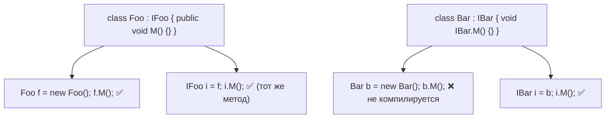

**Ресурсы:**
- [Explicit Interface Implementation — Microsoft Learn](https://learn.microsoft.com/en-us/dotnet/csharp/programming-guide/interfaces/explicit-interface-implementation)

---

### 44. В каких случаях предпочтительнее extension-методы над интерфейсом, а не default interface methods? `[A]`

**Ответ.** Extension-методы — статические методы, синтаксически вызываемые как методы экземпляра, но не являющиеся частью контракта типа: их нельзя переопределить, они не участвуют в виртуальной диспетчеризации, и они применимы к типам, над которыми у вас нет контроля (включая сторонние интерфейсы без DIM). DIM, напротив, часть контракта, может быть переопределена реализующим типом и обращается к состоянию через другие члены интерфейса. Extension-методы предпочтительны, когда: нужно расширить API стороннего/запечатанного интерфейса; логика — чистая функция от публичных членов интерфейса, не требующая индивидуального переопределения для каждой реализации; важно не увеличивать поверхность контракта, который обязаны реализовывать все типы.

**Ресурсы:**
- [Extension Methods — Microsoft Learn](https://learn.microsoft.com/en-us/dotnet/csharp/programming-guide/classes-and-structs/extension-methods)

---

## 5. Дженерики (Generics)

### 45. Что такое generics и зачем они нужны? `[I]`

**Ответ.** Generics позволяют параметризовать типы и методы типом-параметром (`List<T>`, `Dictionary<TKey, TValue>`), откладывая указание конкретного типа до момента использования. До generics (в .NET 1.x) для типобезопасных коллекций использовали `object` (`ArrayList`), что требовало boxing/unboxing для value types и постоянных явных приведений типов с риском `InvalidCastException` в рантайме. Generics дают: (1) типобезопасность на этапе компиляции, (2) отсутствие boxing для value types, (3) переиспользуемый код без дублирования под каждый конкретный тип, (4) производительность, близкую к неродовому коду за счёт JIT-специализации.

**Ресурсы:**
- [Generics — Microsoft Learn](https://learn.microsoft.com/en-us/dotnet/csharp/fundamentals/types/generics)

---

### 46. Как CLR реализует generics "под капотом" — почему это не type erasure, как в Java? `[G]`

**Ответ.** CLR использует **reified generics**: информация о типе-параметре сохраняется в метаданных и доступна в рантайме (`typeof(T)`, `default(T)` работают правильно для каждого T). Для этого JIT-компилятор применяет разные стратегии в зависимости от категории T: для **value types** JIT генерирует **отдельный специализированный машинный код** для каждой уникальной комбинации value-type параметров (`List<int>` и `List<double>` получают разный сгенерированный код) — это даёт максимальную производительность без boxing, но увеличивает объём кода (code bloat). Для **reference types** JIT генерирует **один общий (shared) код**, единый для всех reference-type подстановок (`List<string>` и `List<object>` используют одну и ту же скомпилированную реализацию), потому что все ссылки имеют одинаковый размер (указатель) и единообразную работу с GC — экономия памяти за счёт переиспользования кода.

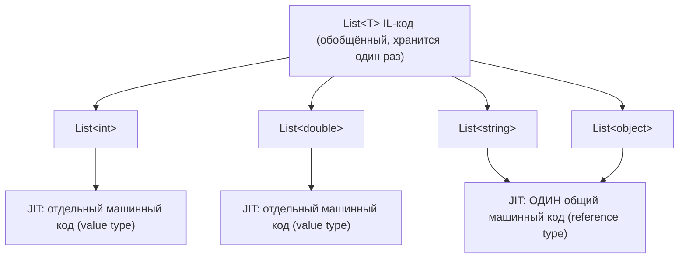

**Ресурсы:**
- [Generics under the hood — .NET Blog](https://devblogs.microsoft.com/dotnet/)
- [Generics — Microsoft Learn](https://learn.microsoft.com/en-us/dotnet/standard/generics/)

---

### 47. Что такое generic constraints (`where T : ...`) и какие бывают виды? `[I]`

**Ответ.** Constraints ограничивают, какие типы допустимы в качестве подстановки T, и одновременно открывают компилятору доступ к членам этого ограничения внутри generic-кода. Основные виды: `where T : class` (reference type), `where T : struct` (value type, не Nullable), `where T : new()` (публичный parameterless-конструктор), `where T : BaseClass` (наследник конкретного класса), `where T : IInterface` (реализует интерфейс), `where T : U` (T должен быть тем же типом или наследником другого type-параметра U). Можно комбинировать несколько ограничений через запятую, порядок фиксирован (class/struct → base class → interfaces → new()).

**Ресурсы:**
- [Constraints on type parameters — Microsoft Learn](https://learn.microsoft.com/en-us/dotnet/csharp/programming-guide/generics/constraints-on-type-parameters)

---

### 48. Что такое covariance (`out`) и contravariance (`in`) в generic-интерфейсах? `[A]`

**Ответ.** Covariance (`out T`) позволяет использовать более производный тип там, где ожидается менее производный: `IEnumerable<string>` можно присвоить переменной `IEnumerable<object>`, потому что интерфейс только *возвращает* T (в позиции out). Contravariance (`in T`) — обратное: позволяет использовать менее производный тип там, где ожидается более производный: `Action<object>` можно присвоить `Action<string>`, потому что делегат только *принимает* T как параметр (in-позицию). Компилятор проверяет, что параметр, помеченный `out`, используется только в выходных позициях (возвращаемые значения), а `in` — только во входных (параметры методов); иначе — ошибка компиляции.

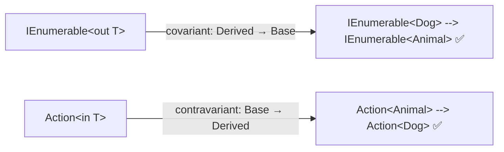

**Ресурсы:**
- [Covariance and Contravariance — Microsoft Learn](https://learn.microsoft.com/en-us/dotnet/csharp/programming-guide/concepts/covariance-contravariance/)

---

### 49. Почему массивы в C# ковариантны, и почему это может привести к `ArrayTypeMismatchException` в рантайме? `[A]`

**Ответ.** Массивы reference types в C#/CLR ковариантны "исторически" (ради совместимости с Java-подобной моделью, заложенной ещё в ранних версиях .NET): `string[]` можно присвоить переменной `object[]`. Но, в отличие от generic-интерфейсов, эта ковариантность **не проверяется статически на безопасность записи** — компилятор разрешит `object[] arr = new string[3]; arr[0] = 42;`, что скомпилируется, но упадёт в рантайме с `ArrayTypeMismatchException`, потому что CLR на каждой записи в ковариантный массив reference-типа выполняет проверку соответствия фактического типа элемента. Это считается "design flaw" в ретроспективе — generic-коллекции (`List<T>`) специально сделаны **нековариантными** для мутируемых операций именно во избежание этой проблемы.

**Ресурсы:**
- [Array Covariance — Microsoft Learn](https://learn.microsoft.com/en-us/dotnet/csharp/programming-guide/arrays/covariance-in-arrays)

---

### 50. Как работает вывод типов (type inference) в generic-методах? `[I]`

**Ответ.** Компилятор пытается вывести type-параметры generic-метода из типов переданных аргументов, без необходимости указывать их явно: `List<int> list = ...; var first = Enumerable.First(list);` — компилятор выводит `T = int` из типа `list`. Вывод происходит по каждому параметру метода, где встречается T, и должен дать согласованный результат по всем позициям (если из разных аргументов выводятся конфликтующие типы — ошибка, либо ищется общий базовый тип для reference types). Если вывод невозможен (например, T участвует только в возвращаемом значении), нужно указывать type-аргумент явно: `Enumerable.Empty<int>()`.

**Ресурсы:**
- [Type inference — Microsoft Learn](https://learn.microsoft.com/en-us/dotnet/csharp/programming-guide/generics/generic-methods)

---

### 51. Что дают constraints `unmanaged`, `notnull` и `new()`? `[A]`

**Ответ.** `unmanaged` (C# 7.3) ограничивает T value-типами, которые не содержат никаких reference-полей на любом уровне вложенности (примитивы, enum, struct только из unmanaged-полей) — это открывает возможность использовать T в unsafe-контексте (например, `sizeof(T)`, работа с указателями, interop с нативным кодом). `notnull` (C# 8, вместе с nullable reference types) требует, чтобы T был non-nullable типом (value type или non-nullable reference type) — используется для более строгой типизации в API, где null логически недопустим. `new()` требует наличия публичного parameterless-конструктора, позволяя писать `new T()` внутри generic-кода — единственный способ создать экземпляр T без рефлексии в обобщённом коде (до C# 11 static abstract members).

**Ресурсы:**
- [Constraints on type parameters — Microsoft Learn](https://learn.microsoft.com/en-us/dotnet/csharp/programming-guide/generics/constraints-on-type-parameters)

---

### 52. Что произойдёт со `static`-полем generic-класса при использовании разных T? `[A]`

**Ответ.** Каждая **закрытая (closed) специализация** generic-типа получает **собственный, независимый** набор static-полей: `static`-поле в `Counter<T>` — это фактически отдельное поле для `Counter<int>`, отдельное для `Counter<string>` и т.д., они не разделяют состояние между собой. Это прямое следствие того, как CLR трактует generic-типы: `Counter<int>` и `Counter<string>` — разные типы времени выполнения, каждый со своим статическим состоянием, инициализируемым отдельно при первом обращении к соответствующей специализации. Частая ошибка на собеседовании — предполагать общий счётчик на все T, тогда как на деле у каждого T — свой.

**Ресурсы:**
- [Static Constructors — Microsoft Learn](https://learn.microsoft.com/en-us/dotnet/csharp/programming-guide/classes-and-structs/static-constructors)

---

### 53. В чём разница между open, closed и constructed generic type? `[I]`

**Ответ.** Open generic type — тип с неподставленными type-параметрами, например `List<>` или `Dictionary<,>` (используется в основном через reflection и DI-контейнеры для регистрации "generic по T" сервисов). Constructed generic type — тип с подставленными аргументами, например `List<int>`. Closed constructed type — все type-параметры заменены конкретными типами (нет ни одного оставшегося T) — это то, что реально может быть инстанцировано (`new List<int>()`). Если хотя бы один параметр остаётся открытым (актуально внутри тела другого generic-типа/метода, например `List<T>` внутри `class Wrapper<T>`), это "open constructed type" — его нельзя инстанцировать напрямую.

**Ресурсы:**
- [Generic Type Parameters — Microsoft Learn](https://learn.microsoft.com/en-us/dotnet/csharp/programming-guide/generics/generics-and-reflection)

---

### 54. Как компилятор выбирает между generic и non-generic перегрузкой с одинаковым именем метода? `[A]`

**Ответ.** При наличии и generic, и non-generic перегрузки с совместимой сигнатурой правило overload resolution в C# отдаёт приоритет **non-generic (более специфичной, не-параметризованной)** версии, если она применима без потери информации — компилятор считает "точное совпадение конкретным типом" более специфичным, чем generic. Это можно наблюдать классически на примере `void Print(int x)` и `void Print<T>(T x)` — вызов `Print(5)` выберет non-generic версию. Явное указание type-аргумента (`Print<int>(5)`) форсирует выбор именно generic-перегрузки.

**Ресурсы:**
- [Overload resolution — C# language specification](https://learn.microsoft.com/en-us/dotnet/csharp/language-reference/language-specification/expressions#overload-resolution)

---

### 55. Почему `IEnumerable<out T>` ковариантен, а `IList<T>` — нет? `[A]`

**Ответ.** Ковариантность (`out T`) безопасна только если T используется исключительно в "выходных" позициях — интерфейс только *отдаёт* значения T наружу, никогда не принимает их как входной параметр от вызывающего кода. `IEnumerable<T>` идеально этому соответствует: единственная операция — получить следующий элемент (`Current`), T нигде не принимается как аргумент. `IList<T>`, напротив, имеет методы вроде `Add(T item)` и индексатор с сеттером `this[int index] = T value` — T используется и на вход, и на выход, что делает интерфейс инвариантным: если бы `IList<Dog>` можно было присвоить `IList<Animal>`, вызывающий код мог бы добавить в список произвольное `Animal` (например, `Cat`) через ковариантную ссылку, нарушив типобезопасность реального списка `Dog`.

**Ресурсы:**
- [Variance in Generic Interfaces — Microsoft Learn](https://learn.microsoft.com/en-us/dotnet/csharp/programming-guide/concepts/covariance-contravariance/variance-in-generic-interfaces)

---

### 56. Чем подход .NET к generics (reified) принципиально отличается от Java type erasure? `[G]`

**Ответ.** В Java generics существуют только на этапе компиляции: после компиляции всё стирается (erasure) до сырых типов (`List<String>` и `List<Integer>` в байткоде становятся одинаковым `List`), а информация о T недоступна в рантайме (`list instanceof List<String>` невозможно проверить). В .NET generics **reified** — тип-параметр сохраняется в метаданных сборки и полностью доступен в рантайме через reflection, `typeof(T)` работает предсказуемо, а JIT генерирует специализированный код под value types (см. вопрос 46). Плюсы подхода .NET — производительность (нет boxing для `List<int>`) и полноценная рефлексия над generic-типами; расплата — больший объём JIT-скомпилированного кода и более сложная модель типов в рантайме CLR.

**Ресурсы:**
- [Generics (C# Programming Guide) — Microsoft Learn](https://learn.microsoft.com/en-us/dotnet/csharp/fundamentals/types/generics)

---

## 6. Делегаты и события

### 57. Что такое delegate под капотом? `[I]`

**Ответ.** `delegate` — типобезопасный указатель на метод(ы). При объявлении `delegate void MyDelegate(int x);` компилятор генерирует полноценный класс, наследующий от `System.MulticastDelegate` (который, в свою очередь, наследует `System.Delegate`), с полями для хранения ссылки на целевой объект (`target`, null для static-методов) и указателя на метод (`method`), а также сгенерированными методами `Invoke`, `BeginInvoke`/`EndInvoke` (устаревший APM-паттерн). Экземпляр делегата — reference type; присвоение метода делегату (`MyDelegate d = SomeMethod;`) создаёт объект этого класса, инкапсулирующий вызов.

**Ресурсы:**
- [Delegates — Microsoft Learn](https://learn.microsoft.com/en-us/dotnet/csharp/programming-guide/delegates/)

---

### 58. В чём разница между `Func<>`, `Action<>` и `Predicate<T>`? `[I]`

**Ответ.** Все три — предопределённые generic-делегаты из BCL, избавляющие от необходимости объявлять свой delegate-тип для типовых сигнатур. `Action<T1..T16>` — делегат, ничего не возвращающий (`void`), от 0 до 16 параметров. `Func<T1..T16, TResult>` — делегат, возвращающий значение типа `TResult` (последний type-параметр всегда возвращаемый тип). `Predicate<T>` — специализированный `Func<T, bool>`, исторически появившийся раньше в API коллекций (`List<T>.Find`, `FindAll`) — семантически идентичен `Func<T, bool>`, но не взаимозаменяем напрямую без явного приведения из-за разных типов делегата.

**Ресурсы:**
- [Func delegate](https://learn.microsoft.com/en-us/dotnet/api/system.func-2) · [Action delegate](https://learn.microsoft.com/en-us/dotnet/api/system.action)

---

### 59. Что такое multicast delegate и как формируется invocation list? `[A]`

**Ответ.** Любой delegate в C# потенциально multicast: оператор `+=` добавляет метод в внутренний **invocation list** (упорядоченный список целей), а `-=` удаляет первое совпадение. При вызове `Invoke()` все методы из списка выполняются последовательно в порядке добавления. Если делегат возвращает значение (не `void`), **значением всего вызова становится результат только последнего** вызванного метода в списке — результаты промежуточных вызовов отбрасываются (доступны только через `GetInvocationList()` с ручным вызовом каждого делегата по отдельности, если нужны все результаты).

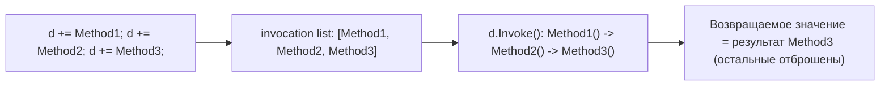

**Ресурсы:**
- [Combine delegates (Multicast Delegates) — Microsoft Learn](https://learn.microsoft.com/en-us/dotnet/csharp/programming-guide/delegates/how-to-combine-delegates-multicast-delegates)

---

### 60. Что произойдёт, если один из методов в invocation list бросит исключение? `[A]`

**Ответ.** Выполнение invocation list — это простой последовательный цикл вызовов без встроенной обработки ошибок: если `Method2` бросает исключение, оно "вылетает" из `Invoke()` немедленно, и **все последующие методы (`Method3` и далее) не будут вызваны вообще**. Это частая практическая проблема при работе с событиями, у которых несколько подписчиков: падение одного обработчика "обрывает" уведомление остальных. Обход — вручную перебирать `GetInvocationList()` и вызывать каждый делегат в собственном `try/catch`, агрегируя исключения (например, в `AggregateException`), если нужна гарантия, что все подписчики будут уведомлены независимо от ошибок друг друга.

**Ресурсы:**
- [Delegate.GetInvocationList — Microsoft Learn](https://learn.microsoft.com/en-us/dotnet/api/system.delegate.getinvocationlist)

---

### 61. Чем `event` отличается от обычного публичного поля-делегата? `[I]`

**Ответ.** Публичное поле типа delegate (`public Action OnChanged;`) полностью открыто внешнему коду: снаружи можно не только подписаться (`+=`), но и **перезаписать весь список** (`obj.OnChanged = null;` или `= SomeOtherMethod;`), стерев чужие подписки, а также вызвать делегат напрямую извне (`obj.OnChanged();`). `event` — это языковая конструкция, инкапсулирующая delegate-поле: снаружи класса доступны только `+=` и `-=`, а вызов (`Invoke`) и прямое присваивание допустимы только изнутри объявляющего класса. Это защищает инварианты публичного API от случайного/злонамеренного стирания подписок или несанкционированного вызова события посторонним кодом.

**Ресурсы:**
- [Events — Microsoft Learn](https://learn.microsoft.com/en-us/dotnet/csharp/programming-guide/events/)

---

### 62. Как event реализован под капотом (add/remove accessors)? `[A]`

**Ответ.** По умолчанию (field-like event) компилятор генерирует приватное backing-поле типа delegate плюс пару accessor-методов `add_EventName`/`remove_EventName`, которые под капотом обычно (для не-статических событий вне явной реализации) используют потокобезопасный `Delegate.Combine`/`Delegate.Remove` через `Interlocked.CompareExchange` в цикле (начиная с более новых версий компилятора) для атомарного обновления ссылки. Можно объявить **custom accessors** явно (`event Action Foo { add { ... } remove { ... } }`), взяв полный контроль над логикой подписки — например, для реализации weak-event pattern или делегирования подписки на внешний источник событий.

**Ресурсы:**
- [How to implement custom event accessors — Microsoft Learn](https://learn.microsoft.com/en-us/dotnet/csharp/programming-guide/events/how-to-implement-custom-event-accessors)

---

### 63. Почему события могут вызывать утечки памяти, и что такое weak event pattern? `[A]`

**Ответ.** Подписка (`publisher.Event += subscriber.Handler;`) создаёт **сильную ссылку** от издателя к подписчику (через delegate target). Если издатель живёт дольше, чем логически должен жить подписчик (частый случай — статический/долгоживущий издатель и короткоживущие UI-элементы/ViewModels), подписчик никогда не будет собран GC, пока явно не вызван `-=`, даже если весь остальной код перестал на него ссылаться — классическая "lapsed listener" утечка. Weak event pattern решает это, храня ссылку на подписчика через `WeakReference`, позволяя GC собрать подписчика независимо от подписки (в .NET это реализовано, например, через `WeakEventManager` в WPF).

**Ресурсы:**
- [Weak Event Patterns — Microsoft Learn](https://learn.microsoft.com/en-us/dotnet/desktop/wpf/advanced/weak-event-patterns)

---

### 64. Что такое анонимные методы (`delegate { }`) и чем они отличаются от лямбд? `[I]`

**Ответ.** Анонимные методы (C# 2.0, синтаксис `delegate(int x) { return x * 2; }`) были первым способом определить inline-реализацию делегата без отдельного именованного метода — предшественник лямбда-выражений (C# 3.0). Функционально они близки к лямбдам (тоже поддерживают захват переменных внешней области видимости — замыкания), но синтаксически более многословны и, в отличие от лямбд, **не могут быть преобразованы в Expression Tree** и не поддерживают вывод типа результата в столь же гибкой форме. Особая возможность анонимных методов, отсутствующая у лямбд, — можно опустить список параметров целиком (`delegate { DoSomething(); }`), тогда метод совместим с делегатом любой сигнатуры, параметры которого не используются.

**Ресурсы:**
- [Anonymous Methods — Microsoft Learn](https://learn.microsoft.com/en-us/dotnet/csharp/programming-guide/statements-expressions-operators/anonymous-methods)

---

### 65. Что такое конвенция `EventHandler`/`EventHandler<TEventArgs>`? `[I]`

**Ответ.** Стандартный паттерн .NET для событий: делегат сигнатуры `void Handler(object? sender, EventArgs e)` (или `EventHandler<TEventArgs>` для передачи дополнительных данных, где `TEventArgs` обычно наследует `EventArgs`). Соглашение фиксирует единообразный API: `sender` — ссылка на объект-издатель (полезно, когда один обработчик подписан на несколько источников), `e` — неизменяемый (по конвенции) пакет данных о событии. Следование этой конвенции облегчает читаемость кода и совместимость с data binding в UI-фреймворках (WPF, WinForms), которые ожидают именно такую сигнатуру.

**Ресурсы:**
- [Events — Microsoft Learn — стандартный паттерн событий .NET](https://learn.microsoft.com/en-us/dotnet/standard/events/)

---

### 66. Как безопасно (потокобезопасно) вызвать событие, избегая race condition на null-проверке? `[A]`

**Ответ.** Классический код `if (Handler != null) Handler(this, args);` содержит race condition: между проверкой `!= null` и вызовом другой поток может выполнить `-=` и обнулить последнего подписчика, приведя к `NullReferenceException` на самом вызове. Идиоматичное решение — `Handler?.Invoke(this, args);`: оператор `?.` в C# компилируется так, что значение делегата читается в локальную переменную **один раз**, после чего проверяется на null и вызывается — это устраняет TOCTOU-race именно за счёт того, что снятие подписки не может изменить уже скопированную локальную ссылку (сама подписка/отписка потокобезопасна благодаря `Delegate.Combine`/`Remove`, создающим новые неизменяемые delegate-объекты, а не мутирующим существующий).

**Ресурсы:**
- [Null-conditional operators — Microsoft Learn](https://learn.microsoft.com/en-us/dotnet/csharp/language-reference/operators/member-access-operators#null-conditional-operators--and-)

---

## 7. Лямбда-выражения и замыкания

### 67. Что такое замыкание (closure) и как компилятор его реализует? `[A]`

**Ответ.** Замыкание — лямбда или анонимный метод, захватывающий переменные из окружающей области видимости и сохраняющий доступ к ним даже после выхода из метода, где они были объявлены. Компилятор реализует это, генерируя скрытый класс ("display class"), поля которого соответствуют захваченным переменным; сама переменная в исходном методе фактически заменяется на поле экземпляра этого класса, а не остаётся локальной переменной на стеке. Лямбда компилируется в метод этого сгенерированного класса. Именно поэтому захваченная value-переменная "переживает" метод — она физически хранится в куче как поле объекта closure, а не на стеке.

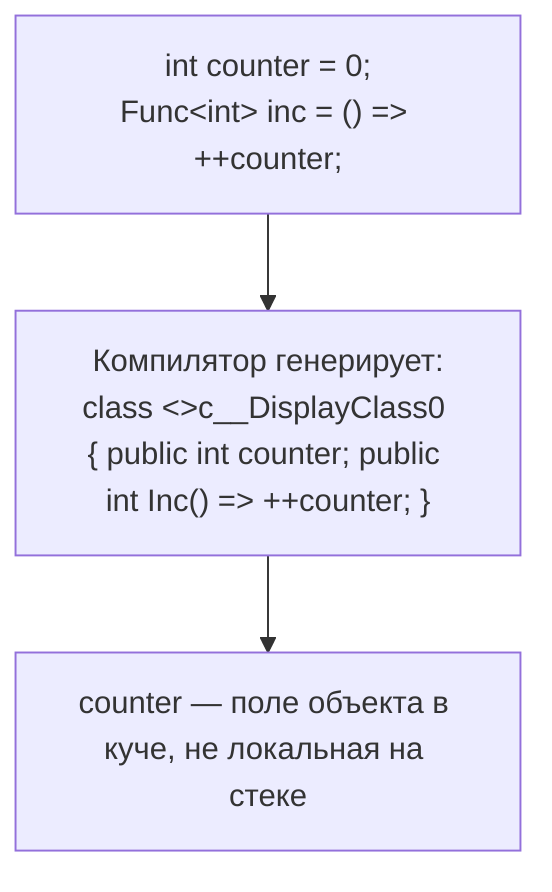

**Ресурсы:**
- [Closures — Jon Skeet's C# in Depth (концептуальное объяснение)]
- [Anonymous Functions — Microsoft Learn](https://learn.microsoft.com/en-us/dotnet/csharp/programming-guide/statements-expressions-operators/anonymous-methods)

---

### 68. Классическая ловушка: захват переменной цикла в лямбде — как менялось поведение `foreach` между версиями C#? `[A]`

**Ответ.** До C# 5 переменная итерации `foreach` была **одной и той же** переменной на все итерации — все лямбды, созданные внутри цикла и захватывающие эту переменную, разделяли одну и ту же ячейку, и после завершения цикла все они "видели" последнее значение. Начиная с C# 5, компилятор создаёт **новую переменную на каждую итерацию** `foreach` (но не `for`!) — то есть каждая лямбда теперь захватывает своё собственное значение. Для классического `for (int i = 0; ...)` переменная `i` по-прежнему одна на весь цикл (так как это соответствует явной семантике `for`), и захват `i` в лямбде внутри `for`-цикла всё ещё может привести к тому, что все лямбды увидят финальное значение `i` — это до сих пор частая причина багов и вопрос на собеседовании.

**Ресурсы:**
- [Breaking change: foreach loop variable — Microsoft Learn](https://learn.microsoft.com/en-us/dotnet/csharp/whats-new/csharp-vnext#c-version-5)

---

### 69. Чем `Expression<Func<T>>` отличается от обычной лямбды, присвоенной `Func<T>`? `[A]`

**Ответ.** Когда лямбда присваивается переменной типа `Func<T>`/`Action<T>` (delegate type), компилятор компилирует её тело в обычный IL-метод — исполняемый машинный код. Когда та же лямбда присваивается переменной типа `Expression<Func<T>>`, компилятор вместо этого строит **дерево выражений (expression tree)** — объектное представление структуры лямбды (узлы: BinaryExpression, MethodCallExpression, ParameterExpression и т.д.), которое можно анализировать, трансформировать и компилировать в делегат в рантайме (`.Compile()`), либо транслировать в другой язык (например, SQL — так работает LINQ to Entities/EF Core). Не каждая лямбда может быть выражена как Expression Tree — например, лямбды со statement-телом (блоком `{ }` с несколькими операторами) до определённых версий не поддерживались как Expression Trees.

**Ресурсы:**
- [Expression Trees — Microsoft Learn](https://learn.microsoft.com/en-us/dotnet/csharp/advanced-topics/expression-trees/)

---

### 70. Как компилятор решает, компилировать лямбду в делегат или в expression tree? `[G]`

**Ответ.** Это решение полностью определяется **целевым типом** (target type) — типом переменной/параметра, которому присваивается лямбда, а не синтаксисом самой лямбды. Одна и та же лямбда `x => x + 1` компилируется в исполняемый IL-код, если целевой тип — `Func<int,int>`, и в объектный граф `Expression`-узлов, если целевой тип — `Expression<Func<int,int>>`. Это ключевой механизм, на котором построен LINQ: `IEnumerable<T>`-версии LINQ-методов (LINQ to Objects) принимают `Func<>`-делегаты и выполняются немедленно как код, а `IQueryable<T>`-версии (LINQ to Entities, LINQ to SQL) принимают `Expression<Func<>>`, что позволяет провайдеру запроса "прочитать" лямбду как данные и транслировать в другой язык запросов (SQL) вместо выполнения на CLR.

**Ресурсы:**
- [How to execute expression trees — Microsoft Learn](https://learn.microsoft.com/en-us/dotnet/csharp/advanced-topics/expression-trees/interpreting-expressions)

---

### 71. Что такое `static` lambda (C# 9) и зачем он нужен? `[A]`

**Ответ.** Модификатор `static` перед лямбдой (`static x => x + 1`) — инструкция компилятору: гарантированно запретить захват любых переменных из внешней области видимости (включая `this`). Если тело лямбды случайно попытается захватить внешнюю переменную, это ошибка компиляции. Практическая польза — производительность: обычная (нестатическая) лямбда, даже если фактически ничего не захватывает, может по историческим причинам компилятора создавать кэшируемый delegate-объект один раз, но если лямбда *действительно* что-то захватывает — на каждый вызов внешнего метода создаётся новый closure-объект (аллокация в куче). `static`-модификатор — явная гарантия отсутствия таких скрытых аллокаций, что важно в высокопроизводительном/hot-path коде (например, внутри циклов, вызываемых миллионы раз).

**Ресурсы:**
- [Lambda improvements — C# 9 — Microsoft Learn](https://learn.microsoft.com/en-us/dotnet/csharp/whats-new/csharp-9#lambda-expression-improvements)

---

### 72. Чем local functions отличаются от лямбд? `[I]`

**Ответ.** Local function (C# 7) — именованный метод, объявленный внутри другого метода. В отличие от лямбды: (1) поддерживает рекурсию по имени напрямую; (2) может быть объявлена с `static`-модификатором для явного запрета захвата (аналогично static-лямбдам); (3) в общем случае эффективнее — компилятор чаще может избежать аллокации delegate-объекта вовсе, если local function вызывается напрямую (а не передаётся как значение делегата) — вызов компилируется как обычный статический/инстанс-метод, а не через `Invoke()` делегата; (4) поддерживает `yield return` и `await` внутри себя более естественно в некоторых сценариях компоновки кода. Лямбды, в свою очередь, необходимы там, где функция передаётся как значение (аргумент LINQ, delegate-параметр, Expression Tree).

**Ресурсы:**
- [Local functions — Microsoft Learn](https://learn.microsoft.com/en-us/dotnet/csharp/programming-guide/classes-and-structs/local-functions)

---

### 73. Как ведёт себя захват value type переменной в лямбде при её последующем изменении во внешнем коде? `[I]`

**Ответ.** Замыкание захватывает **переменную**, а не её значение на момент создания лямбды (см. вопрос 67 — переменная физически становится полем display class). Поэтому если после создания лямбды, но до её вызова, внешний код изменит значение захваченной переменной (даже value type, например `int`), лямбда при вызове увидит **новое** значение, а не то, что было на момент объявления. Это справедливо и в обратную сторону: если лямбда сама изменяет захваченную переменную внутри своего тела, изменение будет видно во внешнем коде после вызова лямбды — поведение идентично передаче по ссылке, а не по значению.

**Ресурсы:**
- [Anonymous Functions — captured variables — Microsoft Learn](https://learn.microsoft.com/en-us/dotnet/csharp/programming-guide/statements-expressions-operators/anonymous-methods#captured-variables)

---

### 74. Что такое discard-параметры в лямбдах (`_`, `_1`, `_2`)? `[I]`

**Ответ.** Начиная с C# 9, можно использовать `_` в качестве имени сразу нескольких параметров лямбды, если их значения не используются в теле: `Func<int, int, int> f = (_, _) => 42;` — компилятор трактует такие параметры как discard, не выделяя им фактически различимых идентификаторов, и такой код не конфликтует с "нельзя дважды объявить переменную с одним именем". Это улучшает читаемость сигнатур обработчиков событий/делегатов, где часть параметров синтаксически обязательна, но семантически не нужна (например, `(sender, _) => DoSomething()`, если `EventArgs` не используется).

**Ресурсы:**
- [Discards — Microsoft Learn](https://learn.microsoft.com/en-us/dotnet/csharp/fundamentals/functional/discards)

---

## 8. LINQ

### 75. Что такое deferred execution в LINQ и когда фактически выполняется запрос? `[I]`

**Ответ.** Большинство LINQ-операторов (`Where`, `Select`, `OrderBy`, `SelectMany` и др.) не выполняют вычисление сразу при вызове — они лишь строят описание запроса (для `IEnumerable<T>` — цепочку итераторов через yield-based state machines, для `IQueryable<T>` — expression tree). Реальное выполнение (перебор источника и вычисление) откладывается до момента **перечисления** результата: вызова `foreach`, `.ToList()`, `.ToArray()`, `.Count()`, `.First()` и т.п. Практическое следствие: если источник данных изменится между построением запроса и его перечислением, результат будет отражать состояние источника **на момент перечисления**, а не на момент написания LINQ-выражения.

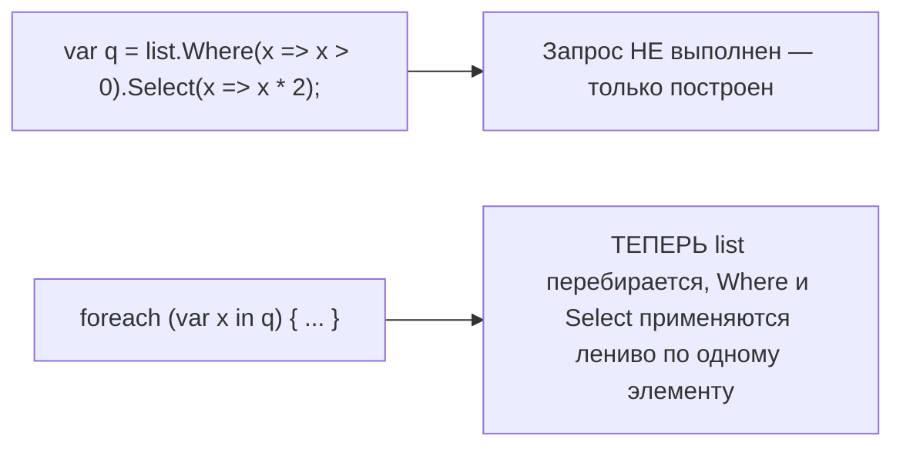

**Ресурсы:**
- [Classification of Standard Query Operators — Deferred vs Immediate — Microsoft Learn](https://learn.microsoft.com/en-us/dotnet/csharp/programming-guide/concepts/linq/classification-of-standard-query-operators-by-manner-of-execution)

---

### 76. В чём разница между LINQ to Objects (`IEnumerable<T>`) и `IQueryable<T>`? `[A]`

**Ответ.** `IEnumerable<T>`-версии LINQ-операторов принимают обычные делегаты (`Func<>`) и выполняются полностью на стороне CLR, перебирая коллекцию в памяти. `IQueryable<T>` (наследует `IEnumerable<T>`) добавляет свойство `Expression` (expression tree, описывающее весь запрос) и `Provider` (`IQueryProvider`), который отвечает за интерпретацию этого дерева. Провайдер (например, EF Core) не выполняет запрос на CLR — он **транслирует** expression tree в SQL (или другой целевой язык) и выполняет его на стороне источника данных (БД), возвращая только результат. Ключевое следствие: LINQ-операторы над `IQueryable` принимают `Expression<Func<>>`, а не `Func<>` напрямую — поэтому не любой C#-код можно использовать внутри LINQ to Entities (например, вызов произвольного метода .NET, у которого нет SQL-эквивалента, приведёт к ошибке трансляции в рантайме).

**Ресурсы:**
- [IQueryable Interface — Microsoft Learn](https://learn.microsoft.com/en-us/dotnet/api/system.linq.iqueryable)
- [Introduction to LINQ Providers](https://learn.microsoft.com/en-us/dotnet/csharp/linq/query-a-collection-of-objects)

---

### 77. Какие LINQ-операторы immediate, а какие deferred? `[I]`

**Ответ.** Deferred (отложенные): `Where`, `Select`, `SelectMany`, `OrderBy`/`OrderByDescending`, `GroupBy`, `Join`, `Take`, `Skip`, `Distinct`, `Reverse` (частично) и большинство операторов, возвращающих `IEnumerable<T>`/`IOrderedEnumerable<T>`. Immediate (немедленные): все операторы, возвращающие не-последовательность или явно материализующие результат — `ToList()`, `ToArray()`, `ToDictionary()`, `ToHashSet()`, `Count()`, `Sum()`, `Average()`, `Min()`/`Max()`, `First()`/`FirstOrDefault()`, `Single()`/`SingleOrDefault()`, `Any()`/`All()`, `Aggregate()`. Важный нюанс: даже deferred-операторы **немедленно проверяют аргументы на null** и валидность в момент вызова (throw eagerly), а не при перечислении — откладывается только сам перебор источника.

**Ресурсы:**
- [Standard Query Operators Overview — Microsoft Learn](https://learn.microsoft.com/en-us/dotnet/csharp/programming-guide/concepts/linq/standard-query-operators-overview)

---

### 78. Как LINQ-операторы вроде `Where`/`Select` реализованы внутри (через `yield return`)? `[A]`

**Ответ.** Каждый deferred-оператор LINQ to Objects реализован как метод-итератор, использующий `yield return` (см. подробный механизм в вопросе про iterator state machine в разделе про коллекции). Например, упрощённая реализация `Where`:
```csharp
public static IEnumerable<T> Where<T>(this IEnumerable<T> src, Func<T,bool> predicate)
{
    foreach (var item in src)
        if (predicate(item))
            yield return item;
}
```
Благодаря этому цепочка `.Where().Select().OrderBy()` не создаёт промежуточных материализованных коллекций — каждый элемент "протекает" через всю цепочку операторов по одному (кроме операторов, которым структурно необходим весь набор данных сразу, например `OrderBy`/`GroupBy`, которые вынуждены буферизовать вход перед выдачей результата).

**Ресурсы:**
- [Reference Source: Enumerable.cs](https://source.dot.net/#System.Linq/System/Linq/Where.cs)

---

### 79. Почему опасно перечислять один и тот же `IEnumerable<T>`-запрос несколько раз ("multiple enumeration")? `[A]`

**Ответ.** Поскольку LINQ-запрос — это не материализованные данные, а описание вычисления, каждое новое перечисление (второй `foreach`, повторный `.Count()` после `.Any()` и т.п.) **заново выполняет всю цепочку операторов от источника**. Это опасно по двум причинам: (1) производительность — дорогая операция (например, запрос к БД или файлу) выполняется повторно; (2) корректность — если источник или сайд-эффекты внутри `Select`/`Where` не идемпотентны (например, лямбда меняет внешнее состояние, или источник — `IEnumerable`, читающий поток данных, который нельзя перечитать), повторное перечисление даст другой результат или упадёт с ошибкой. Стандартная защита — материализовать результат один раз через `.ToList()`/`.ToArray()`, если планируется многократное использование.

**Ресурсы:**
- [Possible multiple enumeration of IEnumerable — Roslyn analyzer CA1851 / R# inspection]

---

### 80. Как EF Core транслирует LINQ-запрос (`IQueryable`) в SQL? `[G]`

**Ответ.** Когда вы пишете `context.Users.Where(u => u.Age > 18)`, `Where` вызывается на `IQueryable<User>`, поэтому лямбда компилируется не в делегат, а в **expression tree**. EF Core (через свой `IQueryProvider`) на этапе перечисления запроса (`ToList()`, `foreach`) обходит построенное дерево выражений, сопоставляет узлы (`MemberExpression`, `BinaryExpression`, `MethodCallExpression`) с известными паттернами трансляции и генерирует эквивалентный SQL (`WHERE Age > 18`). Не всё, что можно написать на C#, транслируемо — вызов произвольного .NET-метода без известного SQL-эквивалента (например, кастомный C# helper) либо не транслируется (исключение в рантайме — "could not be translated"), либо (в старых версиях EF6) выполняется client-side после загрузки всех данных, что было источником скрытых проблем производительности.

**Ресурсы:**
- [How Query Execution Works — EF Core — Microsoft Learn](https://learn.microsoft.com/en-us/ef/core/querying/how-query-execution-works)

---

### 81. Чем отличаются `First`, `FirstOrDefault`, `Single`, `SingleOrDefault`? `[I]`

**Ответ.** `First()` возвращает первый элемент последовательности, бросает `InvalidOperationException`, если она пуста. `FirstOrDefault()` возвращает первый элемент или `default(T)` (null/0/false), если последовательность пуста, — исключений не бросает. `Single()` требует, чтобы в последовательности был **ровно один** элемент — бросает исключение и на пустой, и на последовательности с более чем одним элементом (используется, когда наличие более одного результата означает нарушение инварианта данных, например поиск по уникальному ключу). `SingleOrDefault()` — то же, но возвращает `default(T)` вместо исключения на пустой последовательности (но всё ещё бросает исключение, если элементов больше одного). У каждого есть перегрузка с предикатом (`FirstOrDefault(x => x.Id == 5)`).

**Ресурсы:**
- [Enumerable.Single vs First — Microsoft Learn](https://learn.microsoft.com/en-us/dotnet/api/system.linq.enumerable.single)

---

### 82. Компилируется ли query syntax (`from ... where ... select`) в те же method calls, что и method syntax? `[I]`

**Ответ.** Да, query syntax — это чистый синтаксический сахар: компилятор транслирует `from x in source where predicate select x` в цепочку вызовов методов расширения (`source.Where(x => predicate).Select(x => x)`) ещё на этапе компиляции, до какой-либо оптимизации. Оба синтаксиса полностью эквивалентны по производительности и семантике — выбор чисто стилистический (query syntax часто читабельнее для сложных запросов с несколькими `join`/`group by`, method syntax — компактнее и даёт доступ ко всем операторам LINQ, для которых нет query-синтаксиса, например `Sum`, `Take`, `Skip`).

**Ресурсы:**
- [Query Syntax and Method Syntax in LINQ — Microsoft Learn](https://learn.microsoft.com/en-us/dotnet/csharp/linq/get-started/query-syntax-and-method-syntax-in-linq)

---

### 83. Как под капотом работают `GroupBy` и `Join`? `[A]`

**Ответ.** `GroupBy` (в LINQ to Objects) не может быть по-настоящему "ленивым" в чистом виде: чтобы сформировать группы, оператор вынужден **полностью перебрать источник** (буферизуя элементы по ключам в хэш-таблицу), прежде чем начать выдавать группы наружу — то есть первый элемент результата появится только после полного прохода по всему входному набору. `Join` реализует hash join: он строит хэш-таблицу по ключам одной из последовательностей (обычно внутренней/`inner`), затем перебирает вторую последовательность, для каждого элемента ищет совпадения по ключу в построенной хэш-таблице за O(1) в среднем — это даёт общую сложность около O(n + m) вместо наивного O(n × m) вложенных циклов.

**Ресурсы:**
- [Enumerable.GroupBy — Microsoft Learn](https://learn.microsoft.com/en-us/dotnet/api/system.linq.enumerable.groupby) · [Enumerable.Join](https://learn.microsoft.com/en-us/dotnet/api/system.linq.enumerable.join)

---

### 84. Что делает `SelectMany` и когда его применяют? `[I]`

**Ответ.** `SelectMany` "разворачивает" (flatten) последовательность последовательностей в одну плоскую последовательность: если у вас `IEnumerable<Order>`, где у каждого `Order` есть `IEnumerable<OrderItem> Items`, то `orders.SelectMany(o => o.Items)` вернёт единый `IEnumerable<OrderItem>` со всеми items всех заказов, а не `IEnumerable<IEnumerable<OrderItem>>`, как дал бы обычный `Select`. Есть перегрузка с проекцией результата, объединяющей элемент внешней и внутренней последовательности (`SelectMany(o => o.Items, (o, i) => new { o.Id, i.Name })`) — удобно для реализации "cross join"-подобной логики или декартова произведения нескольких последовательностей.

**Ресурсы:**
- [Enumerable.SelectMany — Microsoft Learn](https://learn.microsoft.com/en-us/dotnet/api/system.linq.enumerable.selectmany)

---

### 85. Как написать собственный LINQ-оператор через extension method + `yield return`? `[A]`

**Ответ.** Собственный оператор пишется как generic extension method над `IEnumerable<T>`, использующий итератор для сохранения ленивой (deferred) семантики, идентичной встроенным операторам:
```csharp
public static IEnumerable<T> WhereGreaterThan<T>(this IEnumerable<T> src, Func<T,int> selector, int threshold)
{
    foreach (var item in src)
        if (selector(item) > threshold)
            yield return item;
}
```
Важный нюанс: **валидация аргументов внутри метода с `yield return` фактически откладывается** до первого перечисления, потому что компилятор превращает весь метод в state machine, и тело не выполняется до вызова `MoveNext()`. Чтобы валидация (например, `ArgumentNullException` на `src == null`) происходила eagerly (сразу при вызове, как у встроенных LINQ-операторов), нужно вынести проверки в отдельный non-iterator метод-обёртку, который вызывает приватный iterator-метод.

**Ресурсы:**
- [Iterators — Microsoft Learn](https://learn.microsoft.com/en-us/dotnet/csharp/iterators)

---

### 86. Что такое PLINQ и чем он отличается от обычного LINQ? `[A]`

**Ответ.** PLINQ (Parallel LINQ) — расширение LINQ to Objects для параллельного выполнения запросов на нескольких ядрах через `.AsParallel()`: `source.AsParallel().Where(...).Select(...)`. Внутри PLINQ разбивает источник на партиции (partitioning), обрабатывает их на разных потоках пула потоков и (по умолчанию) объединяет результаты, не гарантируя исходный порядок элементов (если порядок важен, нужно явно вызвать `.AsOrdered()`, что снижает выгоду от параллелизма). PLINQ эффективен для CPU-bound операций над большими in-memory коллекциями с независимыми (stateless, без побочных эффектов) операциями на элемент; для I/O-bound работы или маленьких коллекций накладные расходы на партиционирование и синхронизацию потоков часто перевешивают выгоду.

**Ресурсы:**
- [Parallel LINQ (PLINQ) — Microsoft Learn](https://learn.microsoft.com/en-us/dotnet/standard/parallel-programming/introduction-to-plinq)

---

## 9. Методы расширения

### 87. Как технически реализованы extension methods? `[I]`

**Ответ.** Extension method — обычный `static`-метод в `static`-классе, первый параметр которого помечен модификатором `this` (`public static int WordCount(this string s)`). Компилятор — это чистый синтаксический сахар: вызов `myString.WordCount()` транслируется на этапе компиляции в обычный статический вызов `MyExtensions.WordCount(myString)`. Никакого реального "расширения" типа не происходит — рефлексия не увидит новый метод как член исходного типа, extension methods не могут обращаться к приватным членам расширяемого типа, и они не участвуют в виртуальной диспетчеризации.

**Ресурсы:**
- [Extension Methods — Microsoft Learn](https://learn.microsoft.com/en-us/dotnet/csharp/programming-guide/classes-and-structs/extension-methods)

---

### 88. Может ли extension method скрыть/переопределить метод экземпляра? Как разрешается конфликт имён? `[A]`

**Ответ.** Нет, extension method никогда не может переопределить (override) instance-метод, и приоритет разрешения всегда в пользу instance-метода: если у типа есть метод-экземпляр с совместимой сигнатурой, компилятор **всегда** выберет его, полностью игнорируя одноимённый extension method, даже не проверяя applicability последнего. Это гарантирует, что добавление extension method никогда не сломает существующий код, полагающийся на instance-методы. Более того, если добавить в класс новый instance-метод с именем, ранее занятым только extension method'ом, весь существующий код, вызывавший extension-версию, молча (без предупреждений компилятора) переключится на новый instance-метод — потенциальный источник трудноуловимого изменения поведения при рефакторинге.

**Ресурсы:**
- [Extension Methods — resolution rules — Microsoft Learn](https://learn.microsoft.com/en-us/dotnet/csharp/programming-guide/classes-and-structs/extension-methods)

---

### 89. Можно ли вызвать extension method на `null`-ссылке без `NullReferenceException`? `[A]`

**Ответ.** Да — и это частый вопрос "с подвохом" на собеседовании. Поскольку вызов extension method под капотом — это обычный статический вызов метода с явной передачей ссылки как аргумента (см. вопрос 87), а не виртуальный вызов через vtable объекта, CLR не разыменовывает `this` до входа в тело метода. Поэтому `string s = null; s.IsNullOrEmptyExtension();` благополучно "войдёт" в тело extension-метода с `s == null` — исключение возникнет только если *внутри* метода реально попытаться обратиться к члену через `this` (например, `this.Length`). Это осознанно используется в BCL-подобных helper'ах (`string.IsNullOrEmpty` — не extension, но многие кастомные null-safe helpers пишут именно как extension methods по этой причине).

**Ресурсы:**
- [Extension methods on null — behavior — Eric Lippert's blog / Microsoft Learn](https://learn.microsoft.com/en-us/dotnet/csharp/programming-guide/classes-and-structs/extension-methods)

---

### 90. Как организовать extension methods, чтобы они были легко обнаруживаемы (discoverability)? `[I]`

**Ответ.** Extension methods видны только тогда, когда их содержащее пространство имён явно подключено через `using`. Хорошая практика — размещать extension methods в отдельном, предсказуемо именованном namespace/классе (например, `MyLib.Extensions`, класс `StringExtensions`), логически сгруппированном по расширяемому типу, а не разбрасывать по случайным namespace'ам, где их сложно найти через IntelliSense. Альтернативный, более "агрессивный" подход — размещать extension methods в том же namespace, что и расширяемый тип, чтобы они были доступны автоматически везде, где виден сам тип (это делают многие библиотеки Microsoft, например `System.Linq.Enumerable`, живущий в `System.Linq`).

**Ресурсы:**
- [Extension Methods best practices — Microsoft Learn](https://learn.microsoft.com/en-us/dotnet/csharp/programming-guide/classes-and-structs/extension-methods)

---

### 91. Можно ли писать generic extension methods и накладывать на них constraints? `[I]`

**Ответ.** Да, extension method может быть generic, с constraints, применяемыми ровно так же, как в обычном generic-методе: `public static bool IsDefault<T>(this T value) where T : struct, IEquatable<T> => value.Equals(default(T));`. Type-параметр может относиться как ко всему методу, так и участвовать в типе `this`-параметра (`this IEnumerable<T> source`), что и позволяет писать универсальные LINQ-подобные операторы, работающие с любым `T`, удовлетворяющим ограничениям. Ограничение здесь общее для generics — нельзя накладывать constraint непосредственно на "экземпляр", на котором вызывается метод, если только сам тип `this`-параметра не generic.

**Ресурсы:**
- [Generic extension methods — Microsoft Learn](https://learn.microsoft.com/en-us/dotnet/csharp/programming-guide/generics/generic-methods)

---

## 10. Обработка исключений

### 92. Опишите иерархию исключений: `Exception`, `SystemException`, `ApplicationException`. `[I]`

**Ответ.** `System.Exception` — базовый класс для всех исключений. `SystemException` исторически предназначался для исключений, генерируемых самой CLR/BCL (`NullReferenceException`, `IndexOutOfRangeException`, `InvalidOperationException`). `ApplicationException` задумывался как база для пользовательских, специфичных для приложения исключений — но эта рекомендация **не прижилась и признана устаревшей**: официальная рекомендация Microsoft — наследовать пользовательские исключения напрямую от `Exception` (или от подходящего более специфичного встроенного класса, например `InvalidOperationException`), не используя `ApplicationException`, так как на практике деление по этому признаку не даёт практической пользы, а многие BCL-исключения сами не следуют этому разделению.

**Ресурсы:**
- [Exception Class — Remarks — Microsoft Learn](https://learn.microsoft.com/en-us/dotnet/api/system.exception)
- [Design Guidelines for Exceptions — Microsoft Learn](https://learn.microsoft.com/en-us/dotnet/standard/design-guidelines/exception-throwing)

---

### 93. В чём разница между `throw;` и `throw ex;` внутри `catch`? `[I]`

**Ответ.** `throw;` (без операнда) повторно выбрасывает **то же самое** исключение, **полностью сохраняя** оригинальный stack trace — трасса будет указывать на исходное место возникновения ошибки. `throw ex;` создаёт впечатление, что перевыбрасывается то же исключение, но фактически **перезаписывает** свойство `StackTrace` объекта исключения, начиная его "с нуля" от текущей точки `throw ex` — вы теряете информацию о том, где исключение изначально произошло, что критично затрудняет диагностику в продакшене. Правило: если нужно перевыбросить исключение без изменений — всегда `throw;`; если нужно обернуть в другое исключение с сохранением причины — использовать `throw new MyException("...", ex);` (конструктор с `innerException`).

**Ресурсы:**
- [Rethrow an exception — Microsoft Learn](https://learn.microsoft.com/en-us/dotnet/csharp/fundamentals/exceptions/rethrow-an-exception)

---

### 94. Что такое exception filters (`catch ... when`)? `[A]`

**Ответ.** Exception filter — условие после `when`, позволяющее решить, должен ли конкретный `catch`-блок обработать исключение, без изменения типа фильтрации по классу исключения: `catch (HttpRequestException ex) when (ex.StatusCode == 503) { ... }`. Если условие ложно, поиск подходящего обработчика продолжается дальше по цепочке `catch`/вверх по стеку — исключение не считается "пойманным" этим блоком. Важное практическое свойство: код внутри `when` выполняется **до раскрутки стека (stack unwinding)** — это значит, что filter может, например, залогировать полное состояние стека на момент возникновения исключения (через side-effect внутри filter-выражения), что невозможно сделать столь же просто внутри самого тела `catch`, где стек уже частично размотан.

**Ресурсы:**
- [Exception filters — Microsoft Learn](https://learn.microsoft.com/en-us/dotnet/csharp/language-reference/keywords/when)

---

### 95. Как `finally` взаимодействует с `return` внутри `try`/`catch`? `[I]`

**Ответ.** Блок `finally` **гарантированно выполняется** перед фактическим выходом из метода, даже если в `try` или `catch` стоит `return` — CLR вычисляет возвращаемое значение, "запоминает" его, выполняет `finally`, и только затем реально возвращает управление вызывающему коду. Более тонкий случай: если `finally` тоже содержит `return` (или `throw`, `break`, `continue`, ведущие к выходу из finally), то возвращаемое/бросаемое из `finally` **перекрывает** то, что "готовилось" вернуться/выброситься из try/catch — это считается плохой практикой именно из-за неочевидного "проглатывания" оригинального результата или исключения, и большинство статических анализаторов (включая Roslyn-анализаторы) предупреждают об этом.

**Ресурсы:**
- [try-finally — Microsoft Learn](https://learn.microsoft.com/en-us/dotnet/csharp/language-reference/statements/exception-handling-statements#the-try-finally-statement)

---

### 96. Каковы best practices при создании собственного класса исключения? `[I]`

**Ответ.** Наследовать от `Exception` (или более специфичного подходящего встроенного класса), суффикс имени — `Exception`. Реализовать как минимум три стандартных конструктора: parameterless, `(string message)`, `(string message, Exception innerException)` — это соглашение, ожидаемое инструментами и другими разработчиками. Если требуется сериализация через бинарные форматтеры (сейчас редкость и не рекомендуется, но для legacy-совместимости) — реализовать конструктор с `SerializationInfo`/`StreamingContext` и атрибут `[Serializable]`. Не класть в исключение чувствительные данные (пароли, токены), так как сообщение может попасть в логи. Добавлять дополнительные свойства с контекстной информацией об ошибке (например, `EntityId`), а не кодировать их только в текст `Message`, чтобы вызывающий код мог программно их использовать.

**Ресурсы:**
- [Design Guidelines for Exceptions — Microsoft Learn](https://learn.microsoft.com/en-us/dotnet/standard/design-guidelines/exception-throwing)

---

### 97. Почему исключения "дорогие" и почему их не стоит использовать для обычного control flow? `[A]`

**Ответ.** Выброс исключения требует от CLR построить полный stack trace (обход стека вызовов с разрешением метаданных каждого фрейма), выполнить механизм раскрутки стека (stack unwinding) с поиском подходящего `catch`-блока по всей цепочке вызовов, выполнить все `finally`-блоки на пути — это на 2–3 порядка дороже обычного возврата значения из метода (порядка микросекунд против наносекунд). Использование исключений для рутинной логики (например, "элемент не найден" вместо `TryGetValue`, или "невалидный ввод пользователя" вместо явной валидации) не только замедляет код на "горячем пути", но и затрудняет чтение кода, так как control flow становится неявным. Правило: исключения — для *исключительных*, не ожидаемых в нормальном ходе программы ситуаций; для ожидаемых альтернативных исходов — паттерн `TryXxx` (`bool TryParse(...)`) или явные результаты (`Result<T>`/nullable).

**Ресурсы:**
- [Exceptions and Performance — Microsoft Learn](https://learn.microsoft.com/en-us/dotnet/standard/exceptions/best-practices-for-exceptions)

---

### 98. Что такое `AggregateException` и когда она встречается? `[A]`

**Ответ.** `AggregateException` — контейнер, объединяющий несколько исключений в одно (свойство `InnerExceptions`), используемый там, где логически может произойти **несколько независимых ошибок одновременно**: параллельные операции (`Parallel.For`, `Parallel.ForEach`, PLINQ), а также (исторически) при синхронном ожидании `Task` через `.Wait()` или `.Result` — если сама задача (или её продолжения) упала с исключением, оно оборачивается в `AggregateException` при "разворачивании" через блокирующий вызов (в отличие от `await`, который автоматически "распаковывает" `AggregateException` и пробрасывает первое внутреннее исключение напрямую). Метод `Flatten()` полезен для "сплющивания" вложенных `AggregateException` (когда одна параллельная операция агрегирует исключения из другой) в единый плоский список.

**Ресурсы:**
- [AggregateException Class — Microsoft Learn](https://learn.microsoft.com/en-us/dotnet/api/system.aggregateexception)

---

### 99. Есть ли в C# checked exceptions (как в Java)? Как это влияет на дизайн API? `[I]`

**Ответ.** Нет, в C# все исключения — unchecked: компилятор не требует ни объявлять, какие исключения может бросить метод (аналог `throws` в Java), ни обязательно их обрабатывать вызывающей стороне. Это осознанное решение дизайнеров языка (Anders Hejlsberg открыто критиковал checked exceptions за то, что они на практике приводят к "проглатыванию" исключений пустыми `catch`-блоками ради компиляции, или к чрезмерно широким `throws Exception`). Следствие для API-дизайна — документирование возможных исключений полностью лежит на XML-doc комментариях (`<exception cref="...">`) и соглашениях, а не на принудительной проверке компилятором; разработчик обязан узнавать о возможных исключениях из документации, а не из сигнатуры метода.

**Ресурсы:**
- [The Trouble with Checked Exceptions — Anders Hejlsberg interview](https://www.artima.com/articles/the-trouble-with-checked-exceptions)

---

### 100. Что такое first-chance exception и как отловить необработанные исключения глобально? `[A]`

**Ответ.** First-chance exception — событие, сигнализируемое CLR **в момент выброса** любого исключения, ещё до того, как будет предпринята попытка его поймать каким-либо `catch` (даже если оно в итоге будет успешно поймано) — доступно через `AppDomain.CurrentDomain.FirstChanceException`, полезно для диагностики/логирования "тихо" пойманных исключений. Отдельно от этого, для реально необработанных исключений: `AppDomain.CurrentDomain.UnhandledException` ловит исключения, вылетевшие из любого потока и не пойманные нигде (приложение после этого обычно всё равно завершается — обработчик даёт последний шанс залогировать); `TaskScheduler.UnobservedTaskException` — специфично для исключений в `Task`, которые никогда не были "понаблюдены" (ни через `await`, ни через `.Result`/`.Exception`) до сборки задачи финализатором.

**Ресурсы:**
- [AppDomain.UnhandledException Event — Microsoft Learn](https://learn.microsoft.com/en-us/dotnet/api/system.appdomain.unhandledexception)
- [TaskScheduler.UnobservedTaskException — Microsoft Learn](https://learn.microsoft.com/en-us/dotnet/api/system.threading.tasks.taskscheduler.unobservedtaskexception)

---

### 101. Как распространяется исключение из `async`-метода? `[A]`

**Ответ.** Исключение, брошенное внутри `async Task`/`async Task<T>` метода, **не вылетает синхронно** в точке вызова — оно перехватывается сгенерированной компилятором state machine и сохраняется внутри возвращаемого `Task` (через `TaskCompletionSource`-подобный механизм, переводящий Task в состояние `Faulted`). Исключение реально "проявится" (будет переброшено) только в точке `await` этого таска — именно поэтому нужно `await`-ить асинхронные вызовы, обёрнутые в `try/catch`, а не пытаться поймать исключение вокруг самого вызова без await. Для `async void` (обычно только в обработчиках событий) поведение принципиально иное — исключение не сохраняется ни в каком Task, а сразу пробрасывается в `SynchronizationContext`, что обычно приводит к падению всего процесса — ещё одна причина избегать `async void`, кроме event handlers.

**Ресурсы:**
- [Exception handling (Task Parallel Library) — Microsoft Learn](https://learn.microsoft.com/en-us/dotnet/standard/parallel-programming/exception-handling-task-parallel-library)

---

## 11. Коллекции, IEnumerable/IEnumerator, yield

### 102. В чём разница между `IEnumerable` и `IEnumerator`? `[I]`

**Ответ.** `IEnumerable`/`IEnumerable<T>` — контракт "я могу быть перечислен": единственный член — `GetEnumerator()`, возвращающий объект-перечислитель. `IEnumerator`/`IEnumerator<T>` — сам перечислитель, хранящий текущую позицию и логику продвижения: `Current` (текущий элемент), `MoveNext()` (продвинуться и вернуть, есть ли ещё элемент), `Reset()` (устарел, обычно бросает `NotSupportedException`). Разделение на два интерфейса позволяет одной коллекции поддерживать **несколько независимых, одновременных** перечислений (каждый `foreach` получает свой собственный `IEnumerator` через `GetEnumerator()`, с собственным независимым состоянием позиции).

**Ресурсы:**
- [IEnumerable Interface — Microsoft Learn](https://learn.microsoft.com/en-us/dotnet/api/system.collections.ienumerable)

---

### 103. Что происходит под капотом при использовании `yield return` (iterator state machine)? `[G]`

**Ответ.** Метод с `yield return` компилятор **полностью переписывает** в класс — компилируемую вручную state machine, реализующую `IEnumerable<T>`/`IEnumerator<T>`. Локальные переменные метода становятся полями этого класса (аналогично closures), тело метода разбивается на сегменты между `yield return`, и генерируется switch по числовому полю-состоянию (`state`), определяющему, с какой точки продолжить выполнение при следующем вызове `MoveNext()`. Никакого реального выполнения тела метода не происходит при самом вызове iterator-метода — он лишь создаёт экземпляр state machine; выполнение стартует только с первого вызова `MoveNext()` (что и обеспечивает deferred execution LINQ, построенного на этом механизме).

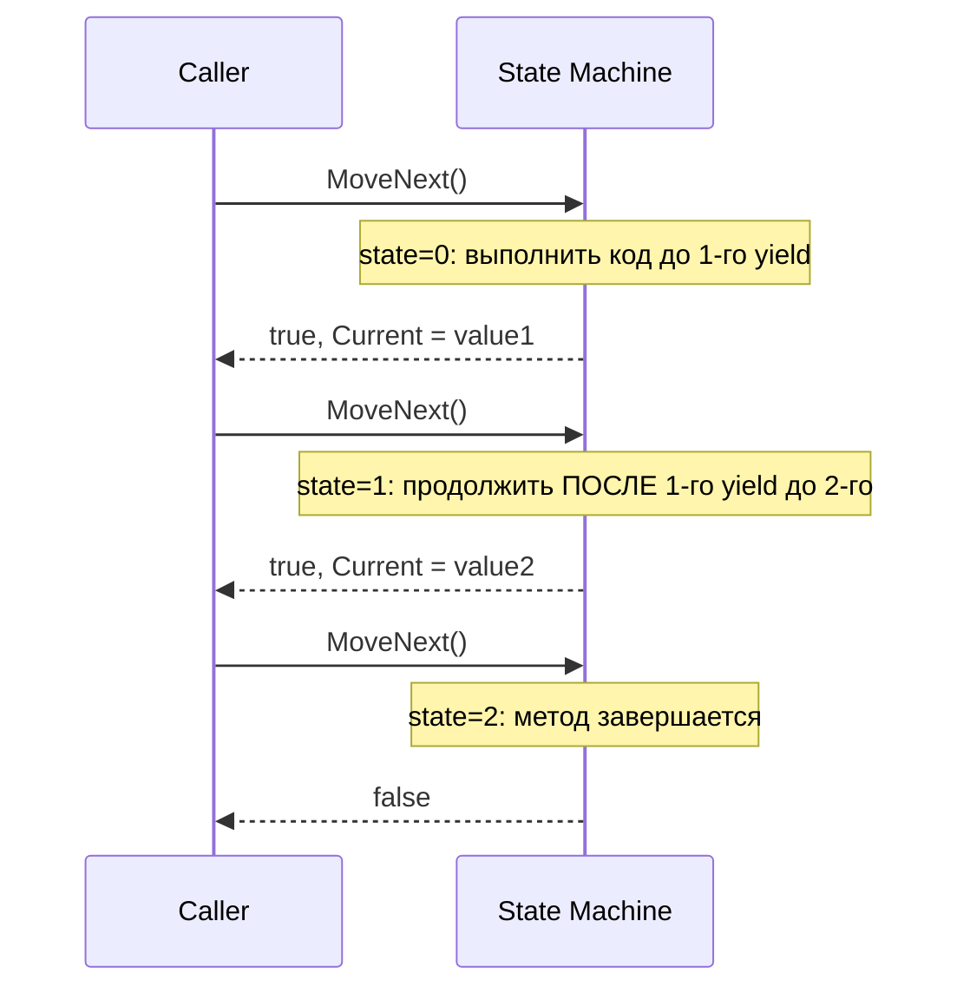

**Ресурсы:**
- [Iterators — Microsoft Learn](https://learn.microsoft.com/en-us/dotnet/csharp/iterators)
- [How iterators work — .NET Blog](https://devblogs.microsoft.com/)

---

### 104. Основные коллекции .NET и их сложность операций (Big-O) — когда что использовать? `[I]`

**Ответ.** `List<T>` — динамический массив: индексация O(1), добавление в конец амортизированно O(1), вставка/удаление в середину O(n). `LinkedList<T>` — двусвязный список: вставка/удаление у известного узла O(1), но нет индексации, поиск O(n) — используется редко, обычно только когда нужны частые вставки/удаления в середине без сдвига элементов и есть узел под рукой. `Dictionary<TKey,TValue>` — хэш-таблица: поиск/вставка/удаление в среднем O(1), но без гарантии порядка. `HashSet<T>` — то же самое для множеств (уникальные элементы), O(1) на `Contains`. `SortedDictionary`/`SortedSet` — красно-чёрное дерево: операции O(log n), но элементы упорядочены. Общее правило: `List<T>` — дефолтный выбор для последовательных данных; `Dictionary`/`HashSet` — когда нужен быстрый поиск по ключу/членство.

**Ресурсы:**
- [Collections and Data Structures — Microsoft Learn](https://learn.microsoft.com/en-us/dotnet/standard/collections/)

---

### 105. Как устроен `Dictionary<TKey,TValue>` внутри (хэш-таблица, buckets, коллизии)? `[A]`

**Ответ.** `Dictionary<TKey,TValue>` хранит два параллельных массива: массив "buckets" (индекс bucket → индекс первой записи с этим hash % bucketCount) и массив `entries` (сами записи: hash-код, ключ, значение, индекс следующей записи с тем же bucket — то есть коллизии разрешаются методом **цепочек**, chaining, реализованных как связный список внутри массива через индексы, а не отдельные heap-объекты — так эффективнее по локальности кэша). При добавлении элемента вычисляется `GetHashCode()` ключа, определяется bucket (`hash % bucketsLength`), новая запись добавляется в начало цепочки этого bucket. При превышении load factor массивы увеличиваются (resize, обычно удвоение до следующего простого числа) и все записи перехэшируются.

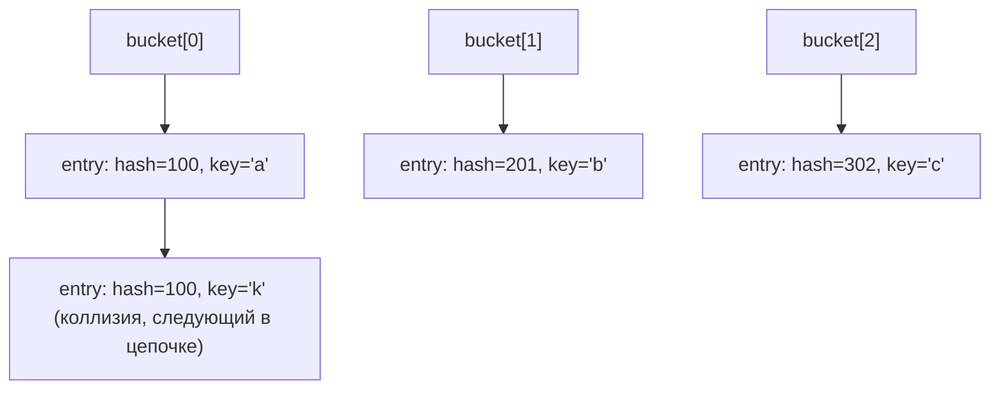

**Ресурсы:**
- [Dictionary<TKey,TValue> Source — dotnet/runtime](https://github.com/dotnet/runtime/blob/main/src/libraries/System.Private.CoreLib/src/System/Collections/Generic/Dictionary.cs)

---

### 106. В чём разница между `IReadOnlyList<T>` и реально неизменяемой коллекцией? `[I]`

**Ответ.** `IReadOnlyList<T>`/`IReadOnlyCollection<T>` — это интерфейс, скрывающий *методы мутации* от потребителя (нет `Add`/`Remove`/индексатора с сеттером), но он **не гарантирует, что базовый объект неизменяем**: если исходный `List<T>` "спрятан" за `IReadOnlyList<T>`-переменной, код, всё ещё держащий ссылку на исходный `List<T>`, может продолжать его мутировать — и все, кто смотрит через `IReadOnlyList<T>`-переменную, увидят изменения. Это "read-only view", а не immutability. Настоящая неизменяемость (защита от мутации *кем угодно*, включая владельца) достигается только через типы из `System.Collections.Immutable` (`ImmutableList<T>` и т.д.), где любая "модифицирующая" операция возвращает новый экземпляр, оставляя оригинал нетронутым.

**Ресурсы:**
- [Immutable collections — Microsoft Learn](https://learn.microsoft.com/en-us/dotnet/standard/collections/immutable-collections)

---

### 107. Когда использовать `ConcurrentDictionary`/`ConcurrentQueue` вместо `lock` + обычная коллекция? `[A]`

**Ответ.** Классы из `System.Collections.Concurrent` спроектированы для безопасного конкурентного доступа без явных блокировок со стороны потребителя, зачастую используя lock-free или fine-grained locking техники внутри (например, `ConcurrentDictionary` разбивает внутреннее состояние на несколько сегментов/locks, а не один общий лок на всю коллекцию), что даёт лучшую масштабируемость при высокой конкуренции по сравнению с одним глобальным `lock` вокруг обычного `Dictionary`. Тем не менее это не "бесплатный" выбор: некоторые операции (`Count`, перечисление через `foreach`) на concurrent-коллекциях дают лишь "снимок на момент вызова" (weakly consistent), а не строго атомарную картину состояния — и составные операции (проверка-затем-действие) должны использовать специальные атомарные методы (`GetOrAdd`, `AddOrUpdate`, `TryUpdate`) вместо ручной комбинации `ContainsKey` + индексатора, которая была бы race-condition-подвержена даже с потокобезопасной коллекцией.

**Ресурсы:**
- [Thread-Safe Collections — Microsoft Learn](https://learn.microsoft.com/en-us/dotnet/standard/collections/thread-safe/)

---

### 108. Чем `IComparable<T>` отличается от `IComparer<T>`? `[I]`

**Ответ.** `IComparable<T>` реализуется **самим типом**, задавая его "естественный", единственный порядок сортировки (`CompareTo`) — используется, например, `List<T>.Sort()` без аргументов, `Array.Sort()`. `IComparer<T>` — отдельный, внешний объект-стратегия сравнения, который можно передать в методы сортировки (`list.Sort(customComparer)`), позволяя иметь **несколько альтернативных** способов упорядочивания одного и того же типа, не изменяя сам тип (например, сортировка `Person` то по имени, то по возрасту, через разные `IComparer<Person>`). `Comparer<T>.Default` использует `IComparable<T>`, если тип его реализует, как fallback-поведение.

**Ресурсы:**
- [IComparable vs IComparer — Microsoft Learn](https://learn.microsoft.com/en-us/dotnet/api/system.icomparable-1)

---

### 109. Как `foreach` компилируется под капотом? `[I]`

**Ответ.** `foreach (var x in collection) { body }` компилируется примерно в:
```csharp
var enumerator = collection.GetEnumerator();
try
{
    while (enumerator.MoveNext())
    {
        var x = enumerator.Current;
        body
    }
}
finally
{
    if (enumerator is IDisposable d) d.Dispose();
}
```
Ключевой момент — автоматический вызов `Dispose()` в `finally`, если перечислитель реализует `IDisposable` (что важно для iterator-методов с `yield`, у которых внутри может быть `using`, требующий гарантированного освобождения ресурсов даже при досрочном выходе из цикла через `break`/`return`/исключение). Начиная с C# 9, для массивов и `List<T>` компилятор использует специализированный `struct`-перечислитель (не через интерфейс) — это позволяет избежать boxing и виртуальных вызовов, ускоряя перечисление.

**Ресурсы:**
- [foreach statement — Microsoft Learn](https://learn.microsoft.com/en-us/dotnet/csharp/language-reference/statements/iteration-statements#the-foreach-statement)

---

### 110. Продемонстрируйте "ленивость" нескольких `yield return` в одном итераторе. `[A]`

**Ответ.** В методе `IEnumerable<int> Gen() { Console.WriteLine("A"); yield return 1; Console.WriteLine("B"); yield return 2; }` вызов `Gen()` сам по себе **не печатает ничего** — только создаёт state machine. При первом `MoveNext()` выполнится код до первого `yield return` включительно — напечатается "A", вернётся 1. При втором `MoveNext()` выполнение **продолжится сразу после первого yield** (не с начала метода!) — напечатается "B", вернётся 2. Это наглядно демонстрирует, что каждая "порция" кода между yield-точками выполняется строго по требованию (pull-based), а не всё сразу — фундамент, на котором строится вся ленивость LINQ to Objects.

**Ресурсы:**
- [Iterators — Microsoft Learn](https://learn.microsoft.com/en-us/dotnet/csharp/iterators)

---

### 111. Возвращать `IEnumerable<T>` или сразу материализовывать в `List<T>`? Компромиссы. `[I]`

**Ответ.** Возврат `IEnumerable<T>` (ленивый, через iterator или LINQ-цепочку) экономит память и время, если вызывающий код может не перебрать всю последовательность (например, найдёт нужный элемент и остановится через `First`/`Take`), и откладывает вычисление до реальной необходимости. Но он же может привести к проблемам: повторное перечисление пересчитывает всё заново (см. вопрос 79), исключения из "ленивой" части кода всплывают не в момент вызова метода, а неожиданно позже — в точке перечисления, что усложняет отладку. Возврат материализованного `List<T>`/`T[]` даёт предсказуемость (данные посчитаны один раз, сразу, все ошибки проявятся немедленно) ценой немедленной аллокации памяти под всю коллекцию, даже если потребитель использует только часть.

**Ресурсы:**
- [Deferred vs immediate execution — Microsoft Learn](https://learn.microsoft.com/en-us/dotnet/csharp/programming-guide/concepts/linq/classification-of-standard-query-operators-by-manner-of-execution)

---

### 112. Чем `SortedList<TKey,TValue>` отличается от `SortedDictionary<TKey,TValue>`? `[A]`

**Ответ.** Обе поддерживают элементы, упорядоченные по ключу, но с разными компромиссами в структуре данных. `SortedList<TKey,TValue>` хранит данные в двух внутренних отсортированных массивах (ключи и значения параллельно): занимает меньше памяти (нет накладных расходов на узлы дерева), быстрее по индексу (O(log n) через бинарный поиск для доступа по индексу позиции), но вставка/удаление в середину — O(n) из-за сдвига элементов массива. `SortedDictionary<TKey,TValue>` реализован как красно-чёрное дерево: вставка/удаление/поиск все O(log n) без сдвигов, но больше накладных расходов на узел дерева (память) и нет прямого доступа по числовому индексу позиции за O(log n) так же эффективно. Правило: `SortedList` — для редких изменений после начального наполнения; `SortedDictionary` — для частых вставок/удалений после наполнения.

**Ресурсы:**
- [SortedList vs SortedDictionary — Microsoft Learn](https://learn.microsoft.com/en-us/dotnet/api/system.collections.generic.sortedlist-2)

---

### 113. Что произойдёт, если изменить объект-ключ после того, как он добавлен в `Dictionary`/`HashSet`, и его `GetHashCode()` зависит от изменённого поля? `[A]`

**Ответ.** `Dictionary`/`HashSet` вычисляют bucket для ключа на основе `GetHashCode()` **в момент вставки** и больше никогда не пересчитывают его автоматически. Если после вставки изменить состояние ключа так, что `GetHashCode()` вернёт другое значение (нарушив негласный контракт "хэш-код объекта не должен меняться, пока объект используется как ключ"), запись физически остаётся в старом bucket, но последующий поиск (`TryGetValue`, `ContainsKey`, `this[key]`) вычислит **новый** хэш и будет искать в другом bucket — запись эффективно "теряется": она физически в коллекции (виден через перечисление `foreach`), но недостижима через поиск по ключу. Практическое следствие: ключи в хэш-based коллекциях должны быть либо immutable, либо их `GetHashCode()` должен основываться только на действительно неизменяемых полях (например, на identity/ссылке через `RuntimeHelpers.GetHashCode`, а не на изменяемых бизнес-полях).

**Ресурсы:**
- [Object.GetHashCode — Remarks, contract — Microsoft Learn](https://learn.microsoft.com/en-us/dotnet/api/system.object.gethashcode)

---

## 12. Async/await, Task, TAP

### 114. Что такое `Task`/`Task<T>` и чем это принципиально отличается от `Thread`? `[I]`

**Ответ.** `Thread` — низкоуровневая обёртка над реальным потоком ОС: дорогая (мегабайты стека, накладные расходы на создание/переключение контекста), поток занят целиком, пока выполняется. `Task`/`Task<T>` — высокоуровневая абстракция единицы асинхронной работы (Task Parallel Library), представляющая **будущий результат**, не привязанная жёстко к конкретному потоку: она может выполняться на потоке из пула потоков, синхронно на текущем потоке, либо вообще не занимать никакой поток активно (при ожидании I/O — см. вопрос про I/O-bound асинхронность). `Task` поддерживает компоновку (`ContinueWith`, `WhenAll`, `WhenAny`), отслеживание состояния (`Faulted`/`Canceled`/`RanToCompletion`) и является тем типом, вокруг которого построен весь `async`/`await`.

**Ресурсы:**
- [Task-based Asynchronous Pattern (TAP) — Microsoft Learn](https://learn.microsoft.com/en-us/dotnet/csharp/asynchronous-programming/task-asynchronous-programming-model)

---

### 115. Как `async`/`await` работает под капотом (state machine)? `[G]`

**Ответ.** Метод, помеченный `async`, компилятор преобразует в state machine — концептуально похоже на механизм `yield return` (вопрос 103), но сложнее: генерируется struct или class, реализующий `IAsyncStateMachine`, с методом `MoveNext()`. Тело метода разбивается на сегменты вокруг каждого `await`; при достижении `await someTask` state machine проверяет, завершена ли задача уже (`IsCompleted`) — если да, выполнение продолжается синхронно без переключения потока; если нет, state machine регистрирует продолжение через `awaiter.OnCompleted(continuation)` и **немедленно возвращает управление** вызывающему коду (метод как бы "приостанавливается", возвращая незавершённый `Task`, представляющий весь async-метод). Когда awaited-задача завершается (возможно, на другом потоке из пула), она вызывает сохранённое продолжение, которое возобновляет `MoveNext()` с нужного сегмента — благодаря чему один физический поток не блокируется в ожидании.

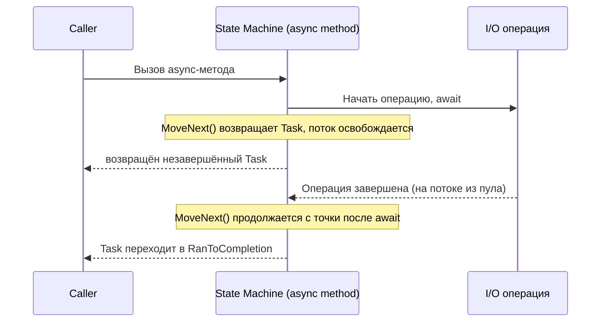

**Ресурсы:**
- [Async/Await — how it really works — .NET Blog (Stephen Toub)](https://devblogs.microsoft.com/dotnet/)

---

### 116. Что такое `SynchronizationContext` и как он влияет на продолжение после `await`? `[A]`

**Ответ.** `SynchronizationContext` — абстракция способа "доставить" код на нужный поток/очередь выполнения (например, UI-поток в WPF/WinForms, `HttpContext` в ASP.NET classic). По умолчанию, если `SynchronizationContext.Current` не null на момент `await`, компилятор захватывает его и после завершения awaited-задачи планирует продолжение **через этот контекст** (`Post`), чтобы вернуться на исходный поток (например, UI-поток — иначе обновление элементов интерфейса после `await` из фонового потока привело бы к исключению). В консольных приложениях и ASP.NET Core `SynchronizationContext.Current` обычно null (или упрощённая версия), поэтому продолжение просто выполняется на любом свободном потоке из ThreadPool — без "возврата" на конкретный исходный поток.

**Ресурсы:**
- [SynchronizationContext — Microsoft Learn](https://learn.microsoft.com/en-us/dotnet/api/system.threading.synchronizationcontext)
- [It's All About the SynchronizationContext — Stephen Cleary](https://blog.stephencleary.com/2012/02/async-and-await.html)

---

### 117. Что делает `ConfigureAwait(false)` и когда его использовать? `[A]`

**Ответ.** `ConfigureAwait(false)` указывает awaiter'у **не** захватывать и не возвращаться на исходный `SynchronizationContext`/`TaskScheduler` — продолжение после `await` выполнится на любом доступном потоке из пула, а не обязательно на том, где был вызван `await`. Это (1) избегает ненужных переключений контекста, снижая накладные расходы, и (2) — что критичнее — предотвращает классический deadlock при синхронном блокировании async-кода (см. вопрос 119). Рекомендация — использовать `ConfigureAwait(false)` в коде библиотек (не знающих и не зависящих от того, какой `SynchronizationContext` будет у потребителя), но **не** в коде верхнего уровня приложения (например, в контроллерах ASP.NET Core или обработчиках событий UI), где после `await` действительно нужен исходный контекст (обновление UI) или это просто не нужно, так как современный ASP.NET Core не использует `SynchronizationContext` вовсе.

**Ресурсы:**
- [ConfigureAwait FAQ — .NET Blog](https://devblogs.microsoft.com/dotnet/configureawait-faq/)

---

### 118. Почему `async void` — антипаттерн (кроме обработчиков событий)? `[I]`

**Ответ.** `async Task`/`async Task<T>` возвращают объект, через который вызывающий код может дождаться завершения (`await`) и получить исключение, если оно произошло. `async void` не возвращает ничего "отслеживаемого" — вызывающий код не может ни дождаться завершения, ни поймать исключение обычным `try/catch` вокруг вызова: необработанное исключение из `async void` метода пробрасывается напрямую в `SynchronizationContext`, что в большинстве хостов (консоль, ASP.NET) приводит к падению всего процесса, минуя обычную модель обработки ошибок через Task. Единственное легитимное применение — обработчики событий UI-фреймворков (`private async void Button_Click(...)`), где сигнатура делегата события исторически фиксирована как `void` и другого выбора нет.

**Ресурсы:**
- [Async void, ASP.NET, and even more await best practices — Stephen Cleary](https://learn.microsoft.com/en-us/archive/msdn-magazine/2013/march/async-await-best-practices-in-asynchronous-programming)

---

### 119. Классический deadlock при вызове `.Result`/`.Wait()` из async-кода — как он возникает? `[A]`

**Ответ.** В окружениях с "захватывающим" `SynchronizationContext` (классический ASP.NET, WPF/WinForms UI-поток): если код на UI/ASP.NET-потоке синхронно блокируется на `task.Result` или `task.Wait()`, а сама `task` внутри содержит `await` без `ConfigureAwait(false)`, то продолжение после этого внутреннего `await` пытается вернуться на тот же исходный поток (через захваченный `SynchronizationContext`) — но этот поток уже заблокирован вызовом `.Result`/`.Wait()` и ждёт, пока задача завершится. Получается циклическая зависимость: задача не может завершиться, пока не выполнится продолжение на потоке, а поток не освободится, пока не завершится задача — классический deadlock. Решение — либо использовать `await` вместо `.Result`/`.Wait()` до самого верха вызывающей цепочки ("async all the way"), либо ставить `ConfigureAwait(false)` во всех промежуточных await-вызовах внутри библиотечного кода.

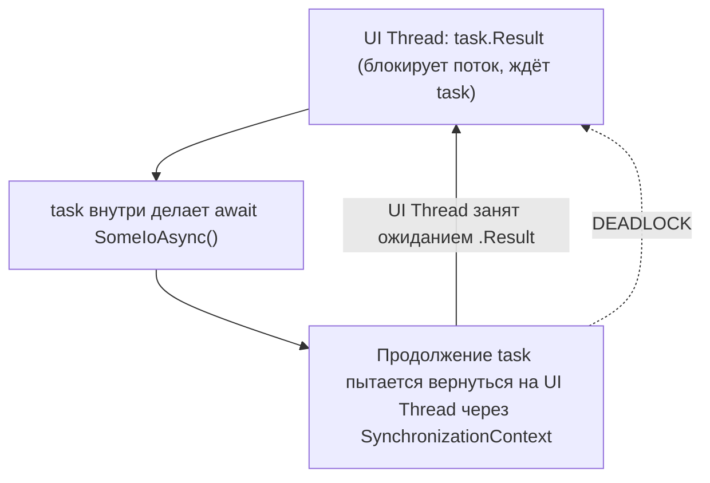

**Ресурсы:**
- [Don't Block on Async Code — Stephen Cleary](https://blog.stephencleary.com/2012/07/dont-block-on-async-code.html)

---

### 120. Когда действительно нужен `Task.Run`, а когда — просто вызов async-метода? `[A]`

**Ответ.** `Task.Run` предназначен для того, чтобы **выгрузить CPU-bound работу** на поток из ThreadPool, освободив текущий поток (типично — UI-поток, чтобы не блокировать интерфейс тяжёлыми вычислениями). Оборачивать в `Task.Run` вызов метода, который **сам уже** `async` и внутри выполняет I/O-bound работу (сетевой запрос, чтение файла через `async`-API) — избыточно и вредно: такой метод и так не блокирует поток при `await`, а обёртка в `Task.Run` лишь тратит дополнительный поток из пула впустую (thread pool hop без всякой пользы). Правило: `Task.Run` — для CPU-bound работы, вызываемой из потока, который нельзя блокировать; для I/O-bound асинхронных методов — просто `await` их напрямую.

**Ресурсы:**
- [Task.Run vs. BackgroundWorker — Stephen Toub](https://learn.microsoft.com/en-us/archive/msdn-magazine/2011/october/msdn-magazine-parallel-computing-it-s-all-about-the-simple-things)

---

### 121. В чём разница между CPU-bound и I/O-bound асинхронностью, и зачем вообще нужен `async` для I/O? `[I]`

**Ответ.** CPU-bound работа (математические вычисления, обработка данных в памяти) требует реального занятого потока всё время выполнения — `async` сам по себе не ускоряет и не "распараллеливает" такую работу, только `Task.Run`/`Parallel`/PLINQ реально задействуют дополнительные ядра. I/O-bound работа (сетевой запрос, чтение с диска, запрос к БД) большую часть времени **не потребляет CPU вообще** — поток просто ждёт ответа от внешней системы. Асинхронные I/O-API (`async`, построенные поверх настоящих асинхронных системных вызовов ОС — I/O Completion Ports в Windows) позволяют **не занимать поток вообще** во время ожидания: поток возвращается в пул и может обслуживать другие запросы, а когда операция завершится, продолжение подхватит любой свободный поток из пула. Это критично для масштабируемости серверных приложений (ASP.NET Core) — тысячи одновременных ожидающих I/O-запросов не требуют тысяч заблокированных потоков.

**Ресурсы:**
- [Async programming — Microsoft Learn](https://learn.microsoft.com/en-us/dotnet/csharp/asynchronous-programming/)

---

### 122. Что такое `ValueTask<T>` и когда его использовать вместо `Task<T>`? `[A]`

**Ответ.** `Task<T>` — reference type, поэтому каждое его создание — аллокация в куче. Если асинхронный метод очень часто завершается **синхронно** (результат уже доступен, например, из кэша, и `await` не приведёт к реальному ожиданию), постоянное создание нового `Task<T>`-объекта на каждый такой "мгновенный" вызов создаёт заметную нагрузку на GC в hot path. `ValueTask<T>` — struct-обёртка, которая в синхронном/уже-завершённом случае вообще не требует аллокации (хранит результат напрямую), а в случае реального асинхронного ожидания оборачивает обычный `Task<T>` внутри. Важное ограничение: `ValueTask<T>` **нельзя await-ить дважды** и нельзя использовать неаккуратно (сохранять, передавать в `Task.WhenAll` напрямую и т.д.) — это делает его менее универсальным, чем `Task<T>`, и его стоит применять точечно, в горячих, измеренно-критичных по производительности API, а не как замену `Task<T>` по умолчанию.

**Ресурсы:**
- [ValueTask — Microsoft Learn](https://learn.microsoft.com/en-us/dotnet/api/system.threading.tasks.valuetask-1)
- [Understanding the Whys, Whats, and Whens of ValueTask — .NET Blog](https://devblogs.microsoft.com/dotnet/understanding-the-whys-whats-and-whens-of-valuetask/)

---

### 123. Что такое `TaskCompletionSource<T>` и когда его использовать? `[A]`

**Ответ.** `TaskCompletionSource<T>` позволяет вручную создать `Task<T>` и явно управлять его завершением (`SetResult`, `SetException`, `SetCanceled`) — без того, чтобы этот Task был связан с реальным выполняющимся методом/потоком. Основное применение — обёртка callback-based (event-based) API в Task-based интерфейс: например, оборачивание старого API с событием "OperationCompleted" в `async`-совместимый метод, возвращающий `Task<T>`, который завершается изнутри обработчика этого события через `tcs.SetResult(...)`. Это фундаментальный "мост" между миром callback/событий и миром `async`/`await`.

**Ресурсы:**
- [TaskCompletionSource — Microsoft Learn](https://learn.microsoft.com/en-us/dotnet/api/system.threading.tasks.taskcompletionsource-1)

---

### 124. Как работают `Task.WhenAll`/`Task.WhenAny`, и как обрабатываются исключения при `WhenAll`? `[I]`

**Ответ.** `Task.WhenAll(tasks)` возвращает `Task`, который завершится, когда завершатся **все** переданные задачи; если несколько из них упали с исключением, `await Task.WhenAll(...)` пробросит только **первое** исключение (но все они доступны через `Task.Exception`, обёрнутое в `AggregateException`, если обращаться к результату не через `await`). `Task.WhenAny(tasks)` возвращает `Task<Task>`, завершающийся, как только **любая одна** из задач завершится первой (успешно, с ошибкой или отменой) — полезно для реализации таймаутов (`WhenAny(realTask, Task.Delay(timeout))`) или "гонки" нескольких источников за первым ответом.

**Ресурсы:**
- [Task.WhenAll — Microsoft Learn](https://learn.microsoft.com/en-us/dotnet/api/system.threading.tasks.task.whenall) · [Task.WhenAny](https://learn.microsoft.com/en-us/dotnet/api/system.threading.tasks.task.whenany)

---

### 125. Что такое async streams (`IAsyncEnumerable<T>`, `await foreach`, C# 8)? `[A]`

**Ответ.** `IAsyncEnumerable<T>` — асинхронный аналог `IEnumerable<T>`: последовательность, элементы которой производятся асинхронно (например, постранично из API, построчно из большого файла), позволяя обрабатывать их по мере готовности без ожидания загрузки всей последовательности целиком. Реализуется через iterator-метод, помеченный `async`, содержащий `yield return` вместе с `await` внутри тела:
```csharp
async IAsyncEnumerable<int> GetDataAsync()
{
    for (int i = 0; i < 10; i++)
    {
        await Task.Delay(100);
        yield return i;
    }
}
```
Потребитель использует `await foreach (var item in GetDataAsync())`, который под капотом вызывает `MoveNextAsync()` вместо синхронного `MoveNext()`, естественно интегрируясь с `async`/`await` без блокировки потока на каждой итерации.

**Ресурсы:**
- [Async Streams — Microsoft Learn](https://learn.microsoft.com/en-us/dotnet/csharp/whats-new/csharp-8#asynchronous-streams)

---

### 126. Что такое "hot" и "cold" Task? `[A]`

**Ответ.** "Hot" Task — задача, которая уже запущена (или гарантированно будет запущена) к моменту, когда вы получили на неё ссылку: все Task, возвращаемые `async`-методами, `Task.Run`, методами TPL типа `Task.WhenAll`, — hot. "Cold" Task — задача, созданная через конструктор `new Task(() => ...)`, которая **не начнёт выполняться**, пока не будет явно вызван `.Start()`. Cold Task — источник классической ошибки: если такую задачу передать в `Task.WhenAll` или попытаться `await` без предварительного `Start()`, код зависнет навсегда, ожидая никогда не начатую работу. По этой причине конструктор `new Task(...)` в современном коде считается устаревшим стилем — практически всегда предпочтительнее `Task.Run` или `async`-методы, которые всегда создают уже "горячие" задачи.

**Ресурсы:**
- [Task Class — Remarks — Microsoft Learn](https://learn.microsoft.com/en-us/dotnet/api/system.threading.tasks.task)

---

### 127. Что такое thread pool starvation и как асинхронность помогает её избежать? `[A]`

**Ответ.** Thread pool starvation — ситуация, когда все (или почти все) потоки пула потоков заняты **синхронным блокирующим ожиданием** (например, множество запросов синхронно ждут завершения I/O через `.Result`/`.Wait()` вместо `await`), а новых потоков пул не может выделить достаточно быстро (рост пула искусственно ограничен и постепенен — по умолчанию новый поток добавляется не чаще раза в ~500мс–1с при исчерпании), из-за чего новые задачи в очереди вынуждены ждать освобождения потока, хотя реальная CPU-нагрузка может быть минимальной. Правильное использование `async`/`await` для I/O-bound операций устраняет эту проблему в корне: поток не блокируется на время ожидания I/O, а возвращается в пул и обслуживает другие запросы — тот же физический пул потоков способен обслужить на порядки больше конкурентных I/O-bound операций.

**Ресурсы:**
- [ThreadPool starvation, and how to avoid it — .NET Blog](https://devblogs.microsoft.com/dotnet/)

---

### 128. Как правильно использовать `CancellationToken` в async-методах? `[I]`

**Ответ.** `CancellationToken` — кооперативный (не принудительный) механизм отмены: источник (`CancellationTokenSource`) создаёт токен, который передаётся во все асинхронные операции вниз по цепочке вызовов как параметр (по конвенции — последний параметр метода). Асинхронный метод обязан сам явно проверять `token.IsCancellationRequested` (или, чаще, передавать токен во внутренние `await`-вызовы BCL-методов, которые сами его проверяют — `Task.Delay(ms, token)`, `HttpClient.SendAsync(request, token)`) и при необходимости вызвать `token.ThrowIfCancellationRequested()`, что бросает `OperationCanceledException`, автоматически переводя `Task` в состояние `Canceled` (а не `Faulted`), которое `await` и `Task.WhenAll` трактуют иначе, чем обычную ошибку. Токен без соответствующих проверок внутри метода не остановит выполнение сам по себе — отмена **не** прерывает код принудительно, как это делает, например, `Thread.Abort` (который в современном .NET вообще недоступен на большинстве платформ).

**Ресурсы:**
- [Cancellation in Managed Threads — Microsoft Learn](https://learn.microsoft.com/en-us/dotnet/standard/threading/cancellation-in-managed-threads)

---

## 13. Многопоточность и синхронизация

### 129. В чём разница между `Thread`, `ThreadPool` и `Task` как уровнями абстракции? `[I]`

**Ответ.** `Thread` — самый низкий уровень: прямая обёртка над потоком ОС, полный ручной контроль (приоритет, имя, стек), но дорогое создание/уничтожение. `ThreadPool` — управляемый набор переиспользуемых worker-потоков, куда можно поставить в очередь единицу работы (`ThreadPool.QueueUserWorkItem`) без затрат на создание нового потока каждый раз — пул сам управляет количеством потоков (в разумных пределах, с ростом при исчерпании, см. вопрос про starvation). `Task` — самый высокий уровень: абстракция единицы асинхронной работы поверх ThreadPool (по умолчанию), с богатым API компоновки, обработки ошибок и статусов, не привязанная жёстко к одному конкретному потоку на всё время выполнения. В подавляющем большинстве современного кода `Thread` создаётся напрямую редко — предпочтителен `Task`/`async`.

**Ресурсы:**
- [Managed Threading — Microsoft Learn](https://learn.microsoft.com/en-us/dotnet/standard/threading/managed-threading-basics)

---

### 130. Как работает `lock` (`Monitor`) под капотом? `[I]`

**Ответ.** `lock (obj) { body }` — синтаксический сахар над `Monitor.Enter`/`Monitor.Exit` в блоке `try/finally` (в современных версиях компилятора — с использованием `Monitor.Enter(object, ref bool)` для атомарной гарантии, что `Exit` вызовется, только если `Enter` реально захватил лок). `Monitor` реализует mutual exclusion через связанный с каждым объектом "sync block" — если поток A уже удерживает монитор объекта `obj`, поток B, пытающийся войти в `lock(obj)`, блокируется (переходит в состояние ожидания) до освобождения. `lock` можно применять только к reference types (не к struct — попытка заблокировать по значению структуры не имеет смысла и с C# 11 выдаёт предупреждение/ошибку компилятора при боксинге).

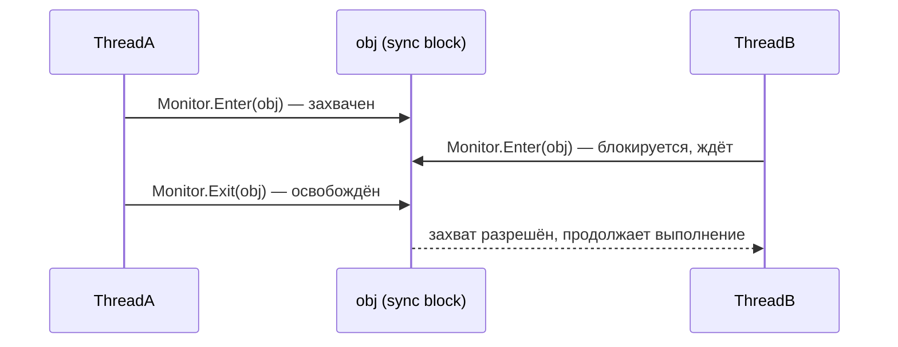

**Ресурсы:**
- [lock statement — Microsoft Learn](https://learn.microsoft.com/en-us/dotnet/csharp/language-reference/statements/lock)

---

### 131. Что такое deadlock и каковы четыре классических условия его возникновения? `[I]`

**Ответ.** Deadlock — ситуация, когда два (или более) потока бесконечно ждут друг друга, каждый удерживая ресурс, нужный другому. Классические четыре условия (Coffman conditions), при одновременном выполнении которых deadlock возможен: (1) mutual exclusion — ресурс не может использоваться совместно; (2) hold and wait — поток удерживает один ресурс, ожидая другой; (3) no preemption — ресурс нельзя принудительно отобрать у потока; (4) circular wait — существует циклическая цепочка ожидания (A ждёт B, B ждёт A). Классический пример в C# — два потока берут два `lock` в разном порядке (`lock(a){ lock(b){} }` в одном потоке и `lock(b){ lock(a){} }` в другом) — устраняется единым, согласованным порядком захвата блокировок во всём кодовом пути.

**Ресурсы:**
- [Threading Deadlocks — Microsoft Learn](https://learn.microsoft.com/en-us/dotnet/standard/threading/overview-of-synchronization-primitives)

---

### 132. Чем отличаются `lock`/`Monitor`, `Mutex`, `Semaphore` и `SemaphoreSlim`? `[A]`

**Ответ.** `lock`/`Monitor` — самая быстрая внутрипроцессная блокировка, работает только между потоками одного процесса. `Mutex` — может быть **именованным** и работать между разными процессами (system-wide синхронизация), но значительно медленнее из-за перехода в режим ядра ОС (kernel-mode) на каждый захват/освобождение. `Semaphore`/`SemaphoreSlim` контролируют доступ не одного эксклюзивного владельца, а до **N одновременных** потоков (счётчик разрешений вместо бинарного захвата) — полезно для ограничения параллелизма (например, не более 5 одновременных запросов к внешнему API). `SemaphoreSlim` — облегчённая, чисто managed-версия для внутрипроцессной синхронизации (без перехода в kernel mode в общем случае), а также, в отличие от `Semaphore`, поддерживает асинхронное ожидание через `WaitAsync()`, что критично для использования внутри `async`-кода без блокировки потока.

**Ресурсы:**
- [Overview of Synchronization Primitives — Microsoft Learn](https://learn.microsoft.com/en-us/dotnet/standard/threading/overview-of-synchronization-primitives)

---

### 133. Что такое `volatile` и когда он реально нужен? `[A]`

**Ответ.** `volatile` на поле указывает JIT-компилятору и CPU не применять к чтениям/записям этого поля определённые оптимизации переупорядочивания (reordering) и не кэшировать значение в регистре процессора — каждое чтение идёт "напрямую" из памяти, каждая запись — немедленно видна другим потокам (в терминах .NET memory model — гарантирует acquire-semantics на чтение и release-semantics на запись). Это нужно в редких low-level сценариях ручной lock-free синхронизации, где один поток пишет флаг (`volatile bool _stop`), а другой в цикле его читает без какой-либо иной синхронизации (`lock`) — без `volatile` компилятор/JIT/CPU теоретически могут закэшировать значение и поток "не увидит" изменение вовремя (или вообще никогда, в предельном случае агрессивной оптимизации). На практике `volatile` используется существенно реже, чем кажется начинающим — `lock`, `Interlocked` или `System.Threading.Channels` покрывают подавляющее большинство реальных сценариев безопаснее.

**Ресурсы:**
- [volatile keyword — Microsoft Learn](https://learn.microsoft.com/en-us/dotnet/csharp/language-reference/keywords/volatile)

---

### 134. Что такое класс `Interlocked` и атомарные операции? `[I]`

**Ответ.** `Interlocked` предоставляет статические методы (`Increment`, `Decrement`, `Add`, `Exchange`, `CompareExchange`) для выполнения простых операций над числовыми полями **атомарно**, без явного `lock` — на уровне процессора это одна неделимая инструкция (или их аппаратно-гарантированная последовательность), что значительно дешевле полноценной блокировки для простых сценариев вроде инкремента общего счётчика из нескольких потоков. `CompareExchange` — фундаментальный строительный блок для lock-free алгоритмов: атомарно сравнивает значение с ожидаемым и, если совпадает, заменяет на новое, возвращая исходное значение — на этом паттерне ("CAS", compare-and-swap) построены многие lock-free структуры данных и spin-based retry-циклы.

**Ресурсы:**
- [Interlocked Class — Microsoft Learn](https://learn.microsoft.com/en-us/dotnet/api/system.threading.interlocked)

---

### 135. В чём разница между race condition и deadlock? `[I]`

**Ответ.** Race condition — некорректный **результат**, возникающий, когда исход зависит от непредсказуемого порядка/тайминга выполнения нескольких потоков, обращающихся к общим данным без должной синхронизации (например, два потока одновременно инкрементируют общую переменную без `lock`/`Interlocked`, и одно из увеличений "теряется"). Deadlock — не неправильный результат, а полная **остановка** прогресса: потоки живы, но бесконечно ждут друг друга и никогда не завершают работу. Race condition может произойти и без единой блокировки в коде вообще, deadlock, напротив, обычно возникает именно *из-за* использования блокировок (в неправильном порядке).

**Ресурсы:**
- [Threading concepts overview — Microsoft Learn](https://learn.microsoft.com/en-us/dotnet/standard/threading/)

---

### 136. Как реализовать потокобезопасный Singleton? Что не так с наивным double-checked locking? `[A]`

**Ответ.** Наивная реализация (`if (instance == null) { lock(...) { if (instance == null) instance = new(); } }` — double-checked locking) в C# исторически считалась ненадёжной без `volatile` на поле `instance`, потому что присвоение ссылки могло теоретически быть видно другому потоку **до** полной инициализации всех полей создаваемого объекта (проблема переупорядочивания записи в memory model некоторых платформ/старых JIT) — другой поток мог получить "частично сконструированный" объект. Современная, идиоматичная и гарантированно корректная замена — `Lazy<T>` с `LazyThreadSafetyMode.ExecutionAndPublication` (поведение по умолчанию): `private static readonly Lazy<Singleton> _instance = new(() => new Singleton());` — CLR гарантирует, что фабрика вызовется ровно один раз, потокобезопасно, без ручной реализации блокировки.

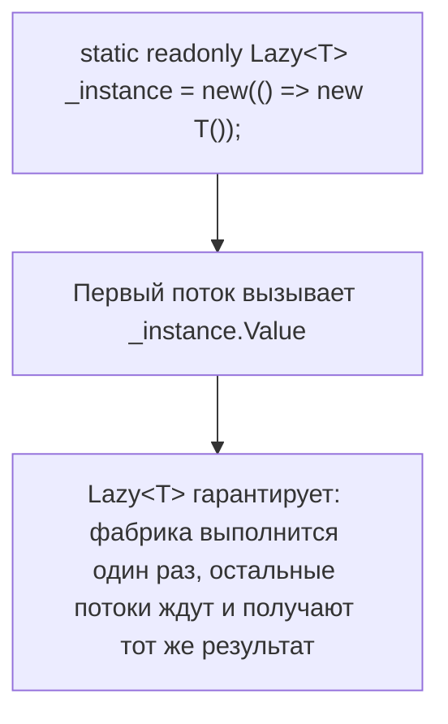

**Ресурсы:**
- [Lazy<T> Class — Microsoft Learn](https://learn.microsoft.com/en-us/dotnet/api/system.lazy-1)
- [Implementing Singleton in C# — Jon Skeet](https://csharpindepth.com/articles/singleton)

---

### 137. Что такое `ReaderWriterLockSlim` и когда он предпочтительнее обычного `lock`? `[A]`

**Ответ.** Обычный `lock` даёт эксклюзивный доступ ровно одному потоку одновременно, независимо от того, читает он данные или пишет — если код в основном **читает** общие данные и лишь изредка их изменяет, это избыточно ограничительно: множество читателей могли бы безопасно работать параллельно. `ReaderWriterLockSlim` разделяет захват на `EnterReadLock` (множество читателей одновременно, пока нет писателя) и `EnterWriteLock` (эксклюзивный доступ, блокирует всех читателей и писателей) — что даёт лучшую пропускную способность при read-heavy нагрузке. Компромисс — сама эта более сложная логика имеет более высокие накладные расходы на единичную операцию, чем простой `Monitor`, поэтому выгода проявляется только при реально высокой конкуренции читателей и относительно редких записях.

**Ресурсы:**
- [ReaderWriterLockSlim Class — Microsoft Learn](https://learn.microsoft.com/en-us/dotnet/api/system.threading.readerwriterlockslim)

---

### 138. Что такое memory barrier и happens-before relationship в .NET memory model? `[G]`

**Ответ.** Современные CPU и компиляторы агрессивно переупорядочивают инструкции чтения/записи памяти ради производительности, если это не меняет наблюдаемое поведение **в пределах одного потока** — но в многопоточном коде это переупорядочивание может стать видимым другим потокам, нарушая интуитивные ожидания о порядке. Memory barrier (fence) — инструкция, запрещающая определённые виды переупорядочивания вокруг себя. .NET memory model гарантирует, что операции синхронизации (`lock`, `Interlocked`, `volatile`) устанавливают "happens-before" отношения: если поток A выполняет запись перед `Monitor.Exit`, а поток B выполняет чтение после соответствующего `Monitor.Enter` того же объекта, поток B гарантированно увидит запись потока A. Без явной синхронизации порядок видимости операций между потоками **не гарантирован** формальной спецификацией, даже если на конкретном железе (например, x86 с его сильной моделью памяти) эмпирически "обычно работает" — что опасно, так как код может сломаться на другой архитектуре (ARM) с более слабой моделью памяти.

**Ресурсы:**
- [Memory Model — Microsoft Learn (.NET Runtime specs)](https://github.com/dotnet/runtime/blob/main/docs/design/specs/Memory-model.md)

---

### 139. Правда ли, что `async`/`await` сам по себе создаёт новые потоки? `[I]`

**Ответ.** Нет — это одно из самых частых заблуждений. `async`/`await` — это механизм **асинхронности**, а не параллелизма: он про неблокирующее ожидание, а не про выполнение на дополнительном потоке. Если внутри `async`-метода `await`-ится настоящая I/O-bound операция (сетевой запрос, файловый ввод-вывод через асинхронные системные вызовы), во время самого ожидания **не занят вообще никакой поток** — ни исходный, ни какой-либо другой (у ОС нет активного потока для этой операции, только структура данных в ядре, ждущая аппаратного прерывания). Новый поток из пула потоков задействуется только (а) для CPU-bound работы, явно выгруженной через `Task.Run`, или (б) как поток, на котором выполнится продолжение после `await`, если `SynchronizationContext` не требует возврата на конкретный исходный поток.

**Ресурсы:**
- [There Is No Thread — Stephen Cleary](https://blog.stephencleary.com/2013/11/there-is-no-thread.html)

---

### 140. Что такое `SpinLock`/`SpinWait` и когда их использовать вместо обычного `lock`? `[A]`

**Ответ.** Обычная блокировка (`Monitor`/`lock`), не сумев немедленно захватить ресурс, переводит поток в состояние ожидания через переход в режим ядра ОС (context switch) — относительно дорогая операция. `SpinLock`/`SpinWait` вместо этого заставляют поток активно "крутиться" в цикле (busy-wait), периодически проверяя доступность ресурса, не отдавая управление ОС — это может быть быстрее *только* если ожидаемая блокировка удерживается крайне короткое время (наносекунды-единицы микросекунд) на многоядерной системе, потому что стоимость busy-wait ниже стоимости context switch именно на таких коротких интервалах. Для любых блокировок с потенциально заметной длительностью удержания spin-подход резко проигрывает (впустую расходует CPU без прогресса) — поэтому это узкоспециализированный инструмент для low-level, высокопроизводительного кода, а не замена `lock` по умолчанию.

**Ресурсы:**
- [SpinLock Structure — Microsoft Learn](https://learn.microsoft.com/en-us/dotnet/api/system.threading.spinlock)

---

## 14. Управление памятью, GC, IDisposable

### 141. Как работает generational Garbage Collector (Gen0/Gen1/Gen2, LOH)? `[A]`

**Ответ.** .NET GC основан на гипотезе поколений (generational hypothesis): большинство объектов "умирают молодыми". Новые объекты попадают в **Gen0** (маленький, быстро собираемый регион). Когда Gen0 заполняется, происходит сборка Gen0: живые объекты (на которые ещё есть ссылки) перемещаются (компактируются) в **Gen1**, мёртвые — просто "забываются" (их память переиспользуется, никакого перебора мёртвых объектов не требуется). Аналогично, при заполнении Gen1 — сборка Gen1, выжившие идут в **Gen2** (долгоживущие объекты — кэши, синглтоны). Сборки Gen0 очень частые и дешёвые, Gen2 — редкие и дорогие (сканируется весь долгоживущий граф объектов). **Large Object Heap (LOH)** — отдельная область для объектов ≥ 85 000 байт, собирается вместе с Gen2, но по умолчанию **не компактируется** (ради производительности — перемещение больших блоков памяти дорого), что может приводить к фрагментации LOH.


**Ресурсы:**
- [Fundamentals of Garbage Collection — Microsoft Learn](https://learn.microsoft.com/en-us/dotnet/standard/garbage-collection/fundamentals)

---

### 142. Зачем нужен паттерн `Dispose(bool disposing)` вместо простого `Dispose()`? `[I]`

**Ответ.** Стандартный (рекомендованный Microsoft) Dispose-паттерн выделяет защищённый виртуальный метод `protected virtual void Dispose(bool disposing)`, куда переносится вся реальная логика освобождения ресурсов, а публичный `Dispose()` лишь вызывает `Dispose(true)` и `GC.SuppressFinalize(this)`. Параметр `disposing` различает два сценария вызова: `true` — детерминированный вызов через явный `Dispose()`/`using` (безопасно обращаться и освобождать другие managed-объекты, так как они ещё гарантированно живы); `false` — вызов из финализатора (`~ClassName()`) сборщиком мусора, когда трогать другие managed-объекты небезопасно (порядок финализации не гарантирован, они могли уже быть собраны) — в этом случае следует освобождать только неуправляемые (unmanaged) ресурсы напрямую. Такой паттерн позволяет производным классам корректно переопределять и добавлять свою логику очистки, вызывая `base.Dispose(disposing)`.

**Ресурсы:**
- [Implement a Dispose method — Microsoft Learn](https://learn.microsoft.com/en-us/dotnet/standard/garbage-collection/implementing-dispose)

---

### 143. Чем `Dispose()` принципиально отличается от финализатора (`~ClassName`)? Когда каждый вызывается? `[I]`

**Ответ.** `Dispose()` — **детерминированный**: вызывается явно разработчиком (напрямую или через `using`) в точно известный момент времени, сразу освобождая ресурсы. Финализатор — **недетерминированный**: вызывается GC когда-нибудь, если объект стал мусором, но конкретный момент (и даже сам факт вызова до завершения процесса) не гарантирован и не контролируется разработчиком напрямую; более того, наличие финализатора добавляет объекту дополнительный "проход" через сборку мусора (объект переживает минимум одну сборку, попадая сначала в finalization queue — см. вопрос 151), что делает его сбор дороже и медленнее. Правило: финализатор нужен только как **страховочная сетка** для освобождения по-настоящему неуправляемых ресурсов (хендлы ОС, неуправляемая память), на случай, если потребитель забыл вызвать `Dispose()`; для чисто managed-ресурсов финализатор не нужен вовсе.

**Ресурсы:**
- [Object destruction and finalizers — Microsoft Learn](https://learn.microsoft.com/en-us/dotnet/csharp/programming-guide/classes-and-structs/destructors)

---

### 144. Как компилируются `using`-statement и `using`-declaration? `[I]`

**Ответ.** `using (var res = GetResource()) { body }` компилируется в `try/finally`, где в `finally` вызывается `res.Dispose()` (с проверкой на null для nullable-ссылок). `using`-declaration (C# 8, без фигурных скобок: `using var res = GetResource();`) — эквивалентный эффект, но область действия `finally` неявно продолжается **до конца содержащего блока** (метода или блока `{}`, в котором объявлена переменная), а не до явно указанных скобок — это уменьшает вложенность кода при последовательном использовании нескольких disposable-ресурсов. Оба варианта требуют, чтобы тип реализовывал `IDisposable` (или `IAsyncDisposable` для `await using`).

**Ресурсы:**
- [using statement — Microsoft Learn](https://learn.microsoft.com/en-us/dotnet/csharp/language-reference/statements/using)

---

### 145. Зачем в `Dispose()` вызывается `GC.SuppressFinalize(this)`? `[A]`

**Ответ.** Если класс реализует и `Dispose()`, и финализатор (в соответствии с полным Dispose-паттерном), то после успешного явного вызова `Dispose()` все ресурсы уже освобождены — вызывать финализатор впоследствии не нужно и вредно (лишние накладные расходы, попадание в finalization queue, потенциальная попытка повторно освободить уже освобождённые ресурсы). `GC.SuppressFinalize(this)` сообщает GC "снять" объект с очереди финализации, экономя лишний проход сборки мусора для этого объекта — он будет собран как обычный объект без финализатора при следующей подходящей сборке, а не переживёт дополнительный цикл.

**Ресурсы:**
- [GC.SuppressFinalize — Microsoft Learn](https://learn.microsoft.com/en-us/dotnet/api/system.gc.suppressfinalize)

---

### 146. Что такое `WeakReference<T>` и когда его использовать? `[A]`

**Ответ.** `WeakReference<T>` хранит ссылку на объект, которая **не** учитывается сборщиком мусора при определении достижимости — объект может быть собран GC, даже если единственные оставшиеся ссылки на него — слабые. Это позволяет держать "опциональный" доступ к объекту (например, для кэша), не продлевая его время жизни искусственно: если память понадобится, GC вправе собрать объект, и попытка получить его через `TryGetTarget(out var target)` вернёт false. Типичные применения — кэши, которые не должны мешать сборке мусора (в противовес обычному словарю-кэшу, который держит объекты живыми вечно, пока запись явно не удалена), и weak event pattern (см. вопрос 63).

**Ресурсы:**
- [WeakReference<T> — Microsoft Learn](https://learn.microsoft.com/en-us/dotnet/api/system.weakreference-1)

---

### 147. Что такое Large Object Heap (LOH) и почему он не компактируется по умолчанию? `[A]`

**Ответ.** LOH хранит объекты размером ≥ 85 000 байт (большие массивы, длинные строки, крупные буферы) отдельно от обычной кучи, потому что перемещение (компактирование, характерное для Gen0/Gen1/Gen2 при обычной сборке) больших блоков памяти — дорогая операция по времени (копирование мегабайтов данных), поэтому исторически LOH собирается без компактирования: мёртвые объекты просто освобождают место, но живые объекты **не сдвигаются**, что со временем может привести к фрагментации (свободное место есть в сумме, но не единым непрерывным блоком, достаточным для нового большого объекта — что может привести к `OutOfMemoryException` даже при достаточном общем объёме свободной памяти). С .NET Core можно явно запросить компактирование LOH через `GCSettings.LargeObjectHeapCompactionMode`, но это разовая, явная операция, а не поведение по умолчанию.

**Ресурсы:**
- [Large Object Heap — Microsoft Learn](https://learn.microsoft.com/en-us/dotnet/standard/garbage-collection/large-object-heap)

---

### 148. Чем отличаются Server GC и Workstation GC? Что такое Concurrent/Background GC? `[A]`

**Ответ.** Workstation GC оптимизирован под приложения с низкой задержкой на клиентских машинах — использует минимум ресурсов, сборка обычно идёт на одном (управляющем) потоке. Server GC (типичен для ASP.NET Core, серверных приложений) создаёт **отдельную кучу и поток сборки на каждое логическое ядро CPU**, распараллеливая работу сборщика — существенно выше пропускная способность на многоядерных серверах ценой большего потребления памяти. Background (Concurrent) GC позволяет выполнять большую часть сборки Gen2 **параллельно с выполнением программы** (на отдельном фоновом потоке), а не полностью останавливая все managed-потоки ("stop-the-world") на всё время сборки — это снижает паузы (latency) ценой некоторого дополнительного потребления CPU/памяти. Оба режима настраиваются через `runtimeconfig.json`/`.csproj` (`ServerGarbageCollection`, `ConcurrentGarbageCollection`).

**Ресурсы:**
- [Workstation and server garbage collection — Microsoft Learn](https://learn.microsoft.com/en-us/dotnet/standard/garbage-collection/workstation-server-gc)

---

### 149. Как возможна утечка памяти в managed-языке с GC? `[I]`

**Ответ.** GC собирает только объекты, которые **недостижимы** — то есть на них нет ни одной живой ссылки из корней (roots: статические поля, локальные переменные активных стек-фреймов, поля живых объектов и т.д.). "Утечка" в managed-мире — это не потерянная память в классическом C++ смысле (где указатель просто забыт), а **удержание достижимости** объектов, которые логически больше не нужны приложению: незаписанные обработчики событий (см. вопрос 63), статические коллекции/кэши, в которые постоянно добавляют, но никогда не удаляют, замкнутые (captured) в долгоживущих замыканиях ссылки, забытые `IDisposable` с неуправляемыми ресурсами внутри. Со временем такие "живые, но не нужные" объекты накапливаются, потребление памяти растёт неограниченно, хотя формально всё, что можно, GC собирает исправно.

**Ресурсы:**
- [Diagnosing memory leaks — Microsoft Learn](https://learn.microsoft.com/en-us/dotnet/core/diagnostics/dotnet-gcdump)

---

### 150. Почему обычно не стоит вызывать `GC.Collect()` вручную? `[I]`

**Ответ.** GC самостоятельно оптимизирует, когда и какого поколения сборку запускать, основываясь на эвристиках заполненности поколений и наблюдаемом паттерне выделения памяти приложением. Принудительный вызов `GC.Collect()` (особенно без указания поколения — по умолчанию полная сборка всех поколений) нарушает эти оптимизации: (1) заставляет собирать даже те поколения, которые ещё не заполнились и не нуждались бы в сборке в этот момент; (2) полная сборка Gen2/LOH — дорогая операция с заметной паузой; (3) если вызывать это регулярно (например, "на всякий случай" после каждой операции), объекты, которые могли бы состариться и осесть в Gen2 естественным путём с малой частотой сборок, вместо этого продвигаются туда преждевременно, что в итоге может **увеличить**, а не уменьшить общую нагрузку на GC. Легитимные исключения крайне редки — например, сразу после заведомо разового пика аллокаций перед длительным периодом бездействия (некоторые серверные сценарии с явным управлением паузами).

**Ресурсы:**
- [GC.Collect Method — Remarks — Microsoft Learn](https://learn.microsoft.com/en-us/dotnet/api/system.gc.collect)

---

### 151. Как устроена финализация объекта (finalization queue, freachable queue)? `[G]`

**Ответ.** Объект с финализатором при создании регистрируется в **finalization queue**. Когда GC обнаруживает, что такой объект недостижим обычным путём, он **не собирает его сразу**: вместо этого объект перемещается из finalization queue в **freachable queue** ("finalization-reachable" — специальный корень GC, который держит эти объекты формально живыми), а отдельный выделенный поток-финализатор постепенно вызывает `Finalize()` для объектов из freachable queue. Только **после** выполнения финализатора и следующей подходящей сборки объект реально освобождается. Отсюда следствие вопроса 143 — объекты с финализаторами переживают минимум **два** цикла сборки (в момент, когда они стали бы мусором, и ещё раз — после финализации), что заметно дороже обычных объектов.


**Ресурсы:**
- [Object.Finalize — Remarks — Microsoft Learn](https://learn.microsoft.com/en-us/dotnet/api/system.object.finalize)

---

### 152. Нужно ли реализовывать `IDisposable` для `struct`, содержащей `IDisposable`-поле? `[A]`

**Ответ.** Технически да — если struct содержит поле disposable-типа, разумно реализовать `IDisposable` и на самой структуре, делегируя вызов `Dispose()` внутреннего поля. Но здесь есть тонкость: struct нельзя финализировать (у value types нет финализаторов), и, что важнее, struct легко **скопировать** (при передаче по значению, помещении в коллекцию) — каждая копия будет содержать ссылку на **тот же самый** внутренний disposable-объект (если это reference type), и вызов `Dispose()` на одной копии сделает недействительными все остальные копии, которые могут об этом не знать и попытаться использовать/освободить объект повторно. По этой причине структуры, владеющие disposable-ресурсами, — рискованный паттерн: предпочтительнее оборачивать такую ответственность в class, где отсутствие непреднамеренного копирования владения гарантировано самой природой reference type.

**Ресурсы:**
- [Dispose pattern for structs — Microsoft Learn discussion](https://learn.microsoft.com/en-us/dotnet/standard/garbage-collection/implementing-dispose)

---

## 15. Nullable reference types и Nullable&lt;T&gt;

### 153. Что такое nullable reference types (NRT, C# 8) и как они работают? `[I]`

**Ответ.** До C# 8 любая переменная reference type (`string`, класс) могла быть `null` без каких-либо предупреждений компилятора — обращение к члену такой переменной без предварительной проверки было частой причиной `NullReferenceException`. NRT вводит различие на уровне синтаксиса: `string` (без `?`) означает "предполагается non-nullable — компилятор будет предупреждать, если сюда может попасть null", `string?` — явно nullable, обращение к членам которого без проверки на null также вызовет предупреждение. Это **чисто статический анализ на этапе компиляции** (реализованный через nullable-аннотации в метаданных и flow analysis), не меняющий поведение в рантайме — включение NRT не добавляет никаких рантайм-проверок и не может само по себе предотвратить NRE, оно лишь показывает предупреждения компилятора там, где потенциальный null не был проверен.

**Ресурсы:**
- [Nullable reference types — Microsoft Learn](https://learn.microsoft.com/en-us/dotnet/csharp/nullable-references)

---

### 154. Есть ли разница между `string?` и `string` в рантайме? `[I]`

**Ответ.** Нет — на уровне CLR/IL никакой разницы нет: оба компилируются в один и тот же `System.String`. Различие существует **только на уровне компилятора C#** как метаданные-аннотации (атрибуты `[Nullable]` на уровне сборки для публичных API) и статический анализ потока данных внутри компилируемого проекта. Это значит, что вызов кода, скомпилированного без включённого nullable-контекста (например, старая библиотека), не даёт никаких рантайм-гарантий ненуля, даже если сигнатура метода в новом коде утверждает non-nullable параметр — компилятор предупредит, но фактическая защита от `null` в рантайме по-прежнему требует явных проверок (`ArgumentNullException.ThrowIfNull` и т.п.) там, где это действительно критично (границы публичного API, данные извне).

**Ресурсы:**
- [Nullable reference types — Microsoft Learn](https://learn.microsoft.com/en-us/dotnet/csharp/nullable-references)

---

### 155. Что такое null-forgiving оператор (`!`) и когда его уместно применять? `[I]`

**Ответ.** Оператор `!` (null-forgiving/damnit-оператор), поставленный после выражения (`someValue!`), говорит компилятору "я, разработчик, точно знаю, что здесь не может быть null, даже если твой статический анализ этого не видит" — подавляет предупреждение о возможном null для данного конкретного выражения, не меняя реального рантайм-поведения (если значение действительно null, `NullReferenceException` всё равно произойдёт при обращении к члену). Уместно использовать, когда у разработчика есть информация, недоступная компилятору (например, инвариант, который compiler flow analysis не в состоянии отследить — сложная бизнес-логика, гарантирующая инициализацию). Злоупотребление `!` "чтобы заставить предупреждение замолчать" без реальной уверенности — плохая практика, обесценивающая весь смысл включения NRT в проекте.

**Ресурсы:**
- [Null-forgiving operator — Microsoft Learn](https://learn.microsoft.com/en-us/dotnet/csharp/language-reference/operators/null-forgiving)

---

### 156. Как компилятор выполняет null-state static analysis (flow analysis) с NRT? `[A]`

**Ответ.** Компилятор отслеживает для каждой переменной/выражения одно из состояний в каждой точке кода: "not null" (доказано ненулевым по предыдущим проверкам/присваиваниям), "maybe null" (возможно null), анализируя поток управления через ветвления (`if (x != null)`, `x is not null`, паттерны, ранние `return`/`throw`). После блока `if (x == null) return;` компилятор "сужает" (narrows) состояние `x` до not-null во всём коде после этой проверки. Аналогично работают операторы `??`, `?.`, а также вызовы, помеченные специальными атрибутами (`[NotNullWhen]`, см. вопрос 159), которые сообщают компилятору о зависимости между возвращаемым `bool` и null-состоянием параметров. Этот анализ — эвристический, а не формально доказанный: сложные условия или косвенные проверки через сторонние методы без атрибутов-подсказок компилятор может не "понять", выдавая ложные предупреждения.

**Ресурсы:**
- [Nullable static analysis — Microsoft Learn](https://learn.microsoft.com/en-us/dotnet/csharp/nullable-references#nullable-contexts)

---

### 157. Как работают директивы `#nullable enable`/`disable` и nullable context на уровне проекта/файла? `[I]`

**Ответ.** Nullable-контекст можно включить глобально на уровне проекта (`<Nullable>enable</Nullable>` в `.csproj`, применяется ко всем файлам) либо точечно внутри файла через директивы `#nullable enable`/`#nullable disable`/`#nullable restore`, действующие с точки объявления до конца файла или до следующей директивы — что удобно для постепенной миграции legacy-кода (включить NRT только в новых/уже приведённых в порядок файлах, оставив остальные без изменений поведения предупреждений). Директивы имеют раздельные под-режимы: `annotations` (влияет только на то, компилируется ли `?`-синтаксис и распознаются ли аннотации) и `warnings` (влияет на то, выдаются ли предупреждения потока данных) — `#nullable enable` включает оба сразу, но можно управлять раздельно (`#nullable enable annotations`).

**Ресурсы:**
- [Nullable contexts — Microsoft Learn](https://learn.microsoft.com/en-us/dotnet/csharp/nullable-references#nullable-contexts)

---

### 158. Какие есть стратегии включения NRT в большом legacy-проекте? `[A]`

**Ответ.** Резкое включение `<Nullable>enable</Nullable>` на весь большой существующий проект обычно порождает сотни/тысячи предупреждений одномоментно, что делает эту работу трудноуправляемой. Практические стратегии: (1) включить NRT глобально, но временно понизить severity предупреждений nullable (`CS8600`–`CS8629` и др.) до "info" вместо "warning" через `.editorconfig`, постепенно поднимая обратно по мере исправления; (2) включать `#nullable enable` файл за файлом (или проект за проектом в большом solution), начиная с самых "низкоуровневых"/самых часто переиспользуемых модулей, чтобы их корректные nullable-аннотации давали пользу при использовании из ещё не мигрированного кода; (3) использовать `<WarningsAsErrors>` выборочно только на новых Pull Request'ах (например, через различие baseline), не требуя немедленного исправления всей истории сразу.

**Ресурсы:**
- [Migrate an existing codebase to nullable references — Microsoft Learn](https://learn.microsoft.com/en-us/dotnet/csharp/nullable-migration-strategies)

---

### 159. Что такое атрибуты `[NotNullWhen]`, `[MaybeNullWhen]` и другие nullable-атрибуты? `[A]`

**Ответ.** Это набор атрибутов из `System.Diagnostics.CodeAnalysis`, позволяющих описать компилятору более сложные зависимости между возвращаемым значением метода и null-состоянием его параметров/возврата, которые невозможно выразить только через `?`/отсутствие `?`. Классический пример — `bool TryGetValue([NotNullWhen(true)] out string? value)`: атрибут говорит компилятору "если метод вернул true, `value` гарантированно не null, даже несмотря на объявленный тип `string?`" — после такого вызова в ветке `if (TryGetValue(out var v))` компилятор сужает `v` до not-null без необходимости в null-forgiving операторе. Похожие атрибуты: `[MaybeNull]`/`[MaybeNullWhen]` (обратная связь — значение может быть null в определённом случае, несмотря на не-nullable объявленный тип), `[NotNull]` (значение параметра/возврата гарантированно не null на выходе, даже если было объявлено как nullable на входе — например, метод, бросающий исключение при null).

**Ресурсы:**
- [Attributes for null-state static analysis — Microsoft Learn](https://learn.microsoft.com/en-us/dotnet/csharp/language-reference/attributes/nullable-analysis)

---

### 160. Почему `Nullable<T>` (value types) и nullable reference types реализованы принципиально по-разному? `[A]`

**Ответ.** `Nullable<T>` для value types — **реальная структура времени выполнения** (см. вопрос 12): `int?` физически хранит дополнительный `bool`-флаг, это меняет представление данных в памяти и есть настоящая рантайм-семантика null для типа, который иначе физически не мог бы представлять "отсутствие значения" (value types по природе всегда содержат какие-то биты). Nullable reference types, напротив, — **чисто компиляционная фикция**: reference type всегда мог быть null на уровне CLR (null — это просто нулевой указатель), NRT лишь добавляет статический анализ поверх уже существующей возможности, не меняя представление в памяти (см. вопрос 154). Такое разное решение продиктовано обратной совместимостью: изменить физическое представление `string`/классов в CLR под флаг null-состояния сломало бы бинарную совместимость всей экосистемы .NET, тогда как для value types механизм `Nullable<T>` был спроектирован "с нуля" ещё в .NET 2.0 без такого груза legacy-совместимости.

**Ресурсы:**
- [Nullable value types vs nullable reference types — Microsoft Learn](https://learn.microsoft.com/en-us/dotnet/csharp/language-reference/builtin-types/nullable-value-types)

---

## 16. Pattern matching и switch expressions

### 161. Какие основные виды паттернов поддерживает C# (обзор)? `[I]`

**Ответ.** C# (по состоянию на актуальные версии) поддерживает: type pattern (`x is Foo`), declaration pattern (`x is Foo f`), constant pattern (`x is 5`, `x is null`), var pattern (`x is var v`), property pattern (`x is { Length: 0 }`), positional/deconstruction pattern (`x is (int a, int b)`), relational pattern (`x is > 0`), logical patterns `and`/`or`/`not` (`x is > 0 and < 100`), list pattern (`x is [1, 2, ..]`, C# 11), а также их произвольная комбинация/вложенность. Pattern matching используется как в `is`-выражениях, так и в `switch`-statement/expression, что делает его унифицированным механизмом сопоставления структуры и значений данных, выходящим далеко за рамки простой проверки типа.

**Ресурсы:**
- [Pattern matching overview — Microsoft Learn](https://learn.microsoft.com/en-us/dotnet/csharp/fundamentals/functional/pattern-matching)

---

### 162. Чем `switch expression` (C# 8) отличается от `switch statement`? `[I]`

**Ответ.** `switch statement` — оператор управления потоком с `case`-метками и обязательным `break`/`return`/`goto case` в каждой ветке, ничего не возвращающий сам по себе. `switch expression` — выражение, вычисляющее и **возвращающее значение**: `var result = x switch { 1 => "one", 2 => "two", _ => "other" };`. Синтаксически компактнее (нет повторяющихся `case`/`break`), поддерживает более богатый набор паттернов "из коробки" в удобной форме, и, что важно, компилятор проверяет **исчерпанность (exhaustiveness)** — предупреждает, если не все возможные варианты покрыты и нет `_` (discard, аналог default).

**Ресурсы:**
- [Switch expression — Microsoft Learn](https://learn.microsoft.com/en-us/dotnet/csharp/language-reference/operators/switch-expression)

---

### 163. Что такое type pattern и declaration pattern? `[I]`

**Ответ.** Type pattern проверяет, что значение времени выполнения совместимо с указанным типом: `if (shape is Circle)`. Declaration pattern делает то же самое, но одновременно **объявляет новую переменную** нужного типа, доступную в области видимости после успешной проверки: `if (shape is Circle c) { Console.WriteLine(c.Radius); }` — компилятор гарантирует, что `c` доступна и типизирована как `Circle` только в ветке, где проверка прошла успешно (flow analysis сужает тип). Это заменяет старую идиому "проверка `is` + отдельный явный каст `as`/`(Circle)`", устраняя избыточность и риск рассинхронизации проверки и каста.

**Ресурсы:**
- [Type-testing operators and cast expressions — Microsoft Learn](https://learn.microsoft.com/en-us/dotnet/csharp/language-reference/operators/type-testing-and-cast)

---

### 164. Что такое property patterns? `[I]`

**Ответ.** Property pattern сопоставляет значение по состоянию его свойств: `if (person is { Age: >= 18, Name: not null })`. Можно вкладывать произвольную глубину: `order is { Customer: { Address: { City: "Moscow" } } }` (а начиная с C# 10 — сокращённая запись через `.`: `order is { Customer.Address.City: "Moscow" }`). Это особенно полезно в `switch expression` для выразительной обработки разных комбинаций состояния объекта без явных цепочек `if`/`else if`, приближая код к декларативному стилю сопоставления с образцом, привычному в функциональных языках.

**Ресурсы:**
- [Property patterns — Microsoft Learn](https://learn.microsoft.com/en-us/dotnet/csharp/language-reference/operators/patterns#property-pattern)

---

### 165. Что такое positional (deconstruction) patterns? `[A]`

**Ответ.** Positional pattern сопоставляет значение через его `Deconstruct`-метод (или встроенную деконструкцию tuple/positional record): `if (point is (0, 0))` работает, если у `Point` есть подходящий `Deconstruct(out int x, out int y)`, сопоставляя оба выведенных значения с паттернами `0` и `0`. Можно комбинировать с захватом переменных и вложенными паттернами: `if (point is (var x, > 0 and < 100 var y))`. Для positional records (вопрос 18) `Deconstruct` генерируется автоматически, что делает positional patterns особенно органичными именно для records — паттерн буквально "распаковывает" record по позиции его конструктора.

**Ресурсы:**
- [Positional patterns — Microsoft Learn](https://learn.microsoft.com/en-us/dotnet/csharp/language-reference/operators/patterns#positional-pattern)

---

### 166. Что такое relational patterns и logical patterns (`and`, `or`, `not`)? `[I]`

**Ответ.** Relational pattern (C# 9) проверяет значение через операторы сравнения: `x is > 0`, `x is <= 100`. Logical patterns комбинируют другие паттерны: `and` (оба паттерна должны совпасть — `x is > 0 and < 100`), `or` (хотя бы один — `x is 1 or 2 or 3`), `not` (отрицание — `x is not null`). Комбинация relational и logical patterns часто заменяет громоздкие цепочки `if (x > 0 && x < 100)` на более читаемое `x is > 0 and < 100` прямо в условии `is` или в `switch`-ветке, а `not null` стал идиоматичной, статически анализируемой NRT-совместимой заменой `!= null`.

**Ресурсы:**
- [Pattern matching — logical, relational — Microsoft Learn](https://learn.microsoft.com/en-us/dotnet/csharp/whats-new/csharp-9#pattern-matching-enhancements)

---

### 167. Что такое list patterns (C# 11)? `[A]`

**Ответ.** List pattern сопоставляет структуру массивов/списков (любой тип с индексатором и `Length`/`Count`, либо реализующий `IEnumerable`): `arr is [1, 2, 3]` (ровно эти три элемента по порядку), `arr is [1, ..]` (первый элемент 1, дальше что угодно), `arr is [.., var last]` (захват последнего элемента независимо от длины), `arr is [var first, .. var middle, var last]` (захват первого, среза "середины" и последнего одновременно). Slice-паттерн `..` может использоваться максимум один раз в одном list pattern. Это существенно упрощает код парсеров, валидаторов входных данных и обработку структурированных последовательностей без ручной работы с индексами.


**Ресурсы:**
- [List patterns — Microsoft Learn](https://learn.microsoft.com/en-us/dotnet/csharp/whats-new/csharp-11#list-patterns)

---

### 168. Как компилятор проверяет `switch expression` на полноту (exhaustiveness)? `[A]`

**Ответ.** Для `switch expression` без `_`-ветки (default) компилятор пытается статически определить, покрыты ли все возможные значения — для перечислений (`enum`) это относительно надёжно (все именованные значения плюс, формально, любое произвольное числовое значение вне enum, так как enum в CLR — просто типизированное число без реальных рантайм-ограничений на диапазон!). Если exhaustiveness не доказана, компилятор выдаёт предупреждение `CS8509`/`CS8524` о том, что switch не исчерпывающий, и в рантайме непокрытый случай приведёт к `SwitchExpressionException`, если он реально произойдёт и в код не добавлена `_`-ветка. Важный нюанс интервью-уровня: даже `switch` по всем значениям `enum` без `_` формально не exhaustive с точки зрения CLR, потому что вызывающий код может передать любое int-значение через явный каст, не входящее ни в одно объявленное имя enum.

**Ресурсы:**
- [Switch expressions — exhaustiveness — Microsoft Learn](https://learn.microsoft.com/en-us/dotnet/csharp/language-reference/operators/switch-expression)

---

### 169. Что такое `var` pattern и discard pattern (`_`)? `[I]`

**Ответ.** `var` pattern (`x is var v`) **всегда успешно совпадает** (безусловно) и просто присваивает сопоставляемое значение новой переменной `v` с выведенным (compile-time) типом — полезен для захвата промежуточного результата вычисления прямо внутри условия или для комбинирования с последующей проверкой через `when` в `switch`-ветке. Discard pattern (`_`) также всегда совпадает, но **не** создаёт переменную — используется как "во всех остальных случаях" (аналог `default` в старом switch), либо как заполнитель в positional/list patterns для значений, которые не нужно захватывать (`(_, var y) = point;` — интересует только `y`).

**Ресурсы:**
- [Discard pattern — Microsoft Learn](https://learn.microsoft.com/en-us/dotnet/csharp/fundamentals/functional/discards#a-standalone-discard)

---

### 170. Можно ли делать pattern matching по кортежу (`switch` на несколько значений одновременно)? `[I]`

**Ответ.** Да — tuple pattern позволяет сопоставлять сразу комбинацию нескольких значений: `(x, y) switch { (0, 0) => "origin", (_, 0) => "on X axis", (0, _) => "on Y axis", _ => "elsewhere" }`. Это устраняет необходимость во вложенных `switch`/`if` для логики, реально зависящей от **комбинации** нескольких переменных — частый паттерн в реализации конечных автоматов (state machines), где переход зависит от пары (текущее состояние, событие): `(state, evt) switch { (State.Idle, Event.Start) => State.Running, ... }`.

**Ресурсы:**
- [Tuple patterns — Microsoft Learn](https://learn.microsoft.com/en-us/dotnet/csharp/language-reference/operators/patterns#positional-pattern)

---

## 17. Равенство: Equals, GetHashCode, ==

### 171. В чём разница между `==` и `.Equals()` для reference types по умолчанию? `[I]`

**Ответ.** По умолчанию (если не переопределены) оба сравнивают **ссылки** (identity): `a == b` для reference types без перегрузки оператора компилируется в `ReferenceEquals`-подобное сравнение указателей — true, только если это буквально один и тот же объект в памяти. `Equals(object)` унаследован от `System.Object` и по умолчанию делает то же самое. Разница проявляется, когда один из этих механизмов переопределяют: `Equals` часто переопределяют для value-based сравнения (см. records), а оператор `==` при этом переопределяется **отдельно и независимо** — переопределение `Equals` само по себе не меняет поведение `==`, если явно не перегрузить и его тоже (что как раз и делает компилятор автоматически для `record`).

**Ресурсы:**
- [Object.Equals — Microsoft Learn](https://learn.microsoft.com/en-us/dotnet/api/system.object.equals)

---

### 172. Почему `Equals` и `GetHashCode` нужно переопределять **вместе**? `[I]`

**Ответ.** Контракт (задокументированный в `Object.GetHashCode`) требует: если `a.Equals(b) == true`, то обязательно `a.GetHashCode() == b.GetHashCode()`. Обратное не обязано быть верным (разные объекты могут иметь одинаковый хэш — коллизия, это нормально). Если переопределить только `Equals` (например, чтобы два "равных по значению" объекта считались равными), но оставить унаследованный `GetHashCode` (основанный на identity объекта), контракт нарушится: `Dictionary`/`HashSet` при поиске сначала вычисляют hash и ищут по нему подходящий bucket, а *затем* проверяют `Equals` только среди объектов в этом bucket — если хэши двух "равных" по вашей логике объектов различаются, `Dictionary` их никогда не найдёт друг через друга, они попадут в разные buckets, и поиск/дедупликация сломаются незаметно (без исключений — просто неверный результат).

**Ресурсы:**
- [Object.GetHashCode — Remarks — Microsoft Learn](https://learn.microsoft.com/en-us/dotnet/api/system.object.gethashcode)

---

### 173. В чём разница между `ReferenceEquals`, `Equals` и `==`, когда `==` переопределён? `[A]`

**Ответ.** `object.ReferenceEquals(a, b)` — статический метод, **всегда** сравнивающий чистую идентичность (указатели), независимо от каких-либо переопределений в конкретных типах — это единственный надёжный способ проверить "это буквально один и тот же объект", даже если `Equals`/`==` у типа переопределены на value-based сравнение. `Equals` — виртуальный метод, диспетчеризуемый по фактическому типу объекта в рантайме (полиморфно). `==` — статически резолвится **на этапе компиляции** по типу операндов, известному компилятору: если у статического типа переменной есть перегруженный `operator ==`, будет вызван именно он, даже если фактический (runtime) тип объекта отличается — то есть `==`, в отличие от `Equals`, не полиморфен по своей природе (хотя может казаться таковым при работе с `record`, где оператор корректно сгенерирован с учётом иерархии).

**Ресурсы:**
- [Object.ReferenceEquals — Microsoft Learn](https://learn.microsoft.com/en-us/dotnet/api/system.object.referenceequals)

---

### 174. Зачем реализовывать `IEquatable<T>`, если уже есть `Equals(object)`? `[A]`

**Ответ.** `Equals(object obj)` принимает параметр типа `object` — для value types это означает **обязательный boxing** при каждом вызове, если сравниваемое значение изначально типизировано конкретно (например, `int`), а не как `object`. `IEquatable<T>.Equals(T other)` даёт строго типизированную, generic-совместимую перегрузку без boxing и без необходимости внутреннего приведения типа (`obj as T`) с проверкой на null/неудачный каст. Generic-коллекции (`List<T>.Contains`, `Dictionary<TKey,_>`) и compiler-сгенерированный код (records) явно проверяют, реализует ли `T` интерфейс `IEquatable<T>`, и используют его вместо `Equals(object)`, когда он доступен — это прямая оптимизация производительности, особенно значимая для value types в hot path.

**Ресурсы:**
- [IEquatable<T> Interface — Microsoft Learn](https://learn.microsoft.com/en-us/dotnet/api/system.iequatable-1)

---

### 175. Как работает value equality для `struct` по умолчанию, и почему это может быть медленно? `[A]`

**Ответ.** Если struct не переопределяет `Equals`/`GetHashCode` явно, используется реализация из `System.ValueType`, которая **через reflection** сравнивает все поля структуры попарно (и, для reference-type полей внутри структуры, — по значению через их собственный `Equals`). Reflection здесь — не бесплатная операция: перебор полей через `FieldInfo` заметно медленнее, чем прямое сравнение сгенерированного вручную/компилятором кода (как это делает `record struct` — см. вопрос 19, где генерируется прямой, не-reflection код сравнения). Практическая рекомендация — для value types, участвующих в сравнениях в горячих путях (используемых как ключи словарей, в циклах сравнения), всегда явно переопределять `Equals`/`GetHashCode` (или использовать `record struct`, получая это бесплатно).

**Ресурсы:**
- [ValueType.Equals — Remarks — Microsoft Learn](https://learn.microsoft.com/en-us/dotnet/api/system.valuetype.equals)

---

### 176. Что произойдёт, если переопределить только `Equals`, но не `GetHashCode` (или наоборот)? `[I]`

**Ответ.** Компилятор C# выдаст **предупреждение** (`CS0659` — "переопределяет Equals, но не GetHashCode"), но скомпилирует код: класс унаследует `GetHashCode` от `object` (identity-based), в то время как `Equals` теперь сравнивает по значению — это прямое нарушение контракта из вопроса 172. Практический эффект: сравнение через `==`/`Equals()` напрямую в коде (`a.Equals(b)`) будет работать корректно по вашей value-логике, но использование объектов как ключей `Dictionary`/элементов `HashSet` будет вести себя некорректно и непредсказуемо — объекты, "равные" по `Equals`, будут считаться разными записями хэш-коллекции, потому что физически окажутся в разных buckets.

**Ресурсы:**
- [CS0659 — Microsoft Learn](https://learn.microsoft.com/en-us/dotnet/csharp/misc/cs0659)

---

### 177. Как правильно реализовать `GetHashCode`, комбинирующий несколько полей? `[I]`

**Ответ.** Наивный подход (`return field1.GetHashCode() ^ field2.GetHashCode();`) даёт слабое распределение хэшей и легко создаёт коллизии для симметричных данных (например, `(1, 2)` и `(2, 1)` дадут одинаковый XOR-хэш). Современный идиоматичный способ в .NET — статический хелпер `HashCode.Combine(field1, field2, field3, ...)` (до 8 значений в одной перегрузке), реализующий качественный, хорошо распределённый алгоритм (основан на нерилизованном "Fowler–Noll–Vo"-подобном/xxHash-подобном смешивании), учитывающий позицию каждого значения (не симметричен, в отличие от XOR). Для большего числа полей или потокового построения используется `HashCode`-структура через последовательные вызовы `Add()` и финальный `ToHashCode()`.

**Ресурсы:**
- [HashCode.Combine — Microsoft Learn](https://learn.microsoft.com/en-us/dotnet/api/system.hashcode.combine)

---

### 178. В чём разница между structural equality, reference equality и identity? `[I]`

**Ответ.** Reference equality (identity) — два указателя указывают на один и тот же физический объект в памяти (`ReferenceEquals`). Structural (value) equality — два разных объекта считаются "равными", если их наблюдаемое состояние (значения полей/свойств) совпадает, независимо от того, один это объект или два разных экземпляра — именно такую семантику получают `record`/`record struct` "из коробки" и `struct` по умолчанию (через reflection). Выбор между ними — не техническая деталь, а концептуальное архитектурное решение о том, что значит "быть одним и тем же" для конкретного типа: для entity-подобных объектов с явным identity (например, строка в базе данных с первичным ключом) обычно уместнее reference/identity-based равенство (иногда — по ключу, а не по ссылке), для value-подобных объектов (Money, Point, DTO) — structural.

**Ресурсы:**
- [Equality comparisons — Microsoft Learn](https://learn.microsoft.com/en-us/dotnet/csharp/programming-guide/statements-expressions-operators/equality-comparisons)

---

## 18. Перегрузка операторов и конверсии

### 179. Как перегрузить оператор и какие есть ограничения? `[I]`

**Ответ.** Операторы перегружаются через `public static` методы вида `public static Vector operator +(Vector a, Vector b) { ... }` — оператор обязан быть `static`, минимум один из параметров обязан быть типом объявляющего класса (нельзя перегрузить оператор так, чтобы оба операнда были сторонними типами). Некоторые операторы должны перегружаться **парами** — если перегружен `==`, компилятор требует обязательного одновременного переопределения `!=` (и наоборот), аналогично для `<`/`>` и `<=`/`>=`. Не все операторы можно перегрузить: `&&`/`||` напрямую не перегружаются (см. следующий вопрос), `=` (простое присваивание) не перегружается вовсе (только составные типа `+=` перегружаются автоматически, если перегружен базовый `+`).

**Ресурсы:**
- [Overloadable operators — Microsoft Learn](https://learn.microsoft.com/en-us/dotnet/csharp/language-reference/operators/operator-overloading)

---

### 180. В чём разница между `implicit` и `explicit` user-defined conversions? `[I]`

**Ответ.** `implicit`-конверсия (`public static implicit operator Celsius(Fahrenheit f)`) позволяет компилятору автоматически применять преобразование без явного каста в коде: `Celsius c = someFahrenheit;`. Её следует объявлять только тогда, когда преобразование **гарантированно не теряет информацию и не может выбросить исключение** — иначе неявное срабатывание в неожиданных местах может маскировать баги. `explicit`-конверсия требует явного каста (`Celsius c = (Celsius)someFahrenheit;`) — используется, когда преобразование может потерять точность/данные или потенциально бросить исключение (аналогично встроенным числовым конверсиям: `int → long` implicit, `long → int` explicit, так как возможно переполнение).

**Ресурсы:**
- [User-defined conversion operators — Microsoft Learn](https://learn.microsoft.com/en-us/dotnet/csharp/language-reference/operators/user-defined-conversion-operators)

---

### 181. Почему нельзя напрямую перегрузить `&&`/`||`, и как это связано с `true`/`false` операторами? `[A]`

**Ответ.** `&&`/`||` реализуют short-circuit-семантику (второй операнд не вычисляется, если результат уже определён первым), что несовместимо с простой моделью "оператор = метод, вычисляющий оба переданных аргумента" (аргументы метода в C# вычисляются всегда до вызова). Вместо этого C# позволяет перегрузить `&`/`|` (небитовые операторы AND/OR без short-circuit) вместе со специальными операторами `true`/`false` (`public static bool operator true(T t)`, `public static bool operator false(T t)`) — если оба этих условия выполнены для типа, компилятор автоматически синтезирует short-circuit поведение для `&&`/`||` на основе перегруженных `&`/`|` и `true`/`false`, определяющих, когда можно "закоротить" вычисление. Этот приём сегодня используется редко (в основном в специализированных DSL-подобных библиотеках, например для tri-state логики), но остаётся классическим "с подвохом" вопросом о механике операторов в C#.

**Ресурсы:**
- [User-defined && and || operators — Microsoft Learn](https://learn.microsoft.com/en-us/dotnet/csharp/language-reference/operators/true-false-operators)

---

### 182. Что такое `checked`/`unchecked` контекст? `[I]`

**Ответ.** По умолчанию арифметическое переполнение над целочисленными типами **не** бросает исключение (значение "заворачивается" по модулю, wraparound) — это поведение `unchecked`, применяемое неявно, если не указано иное (кроме констант, которые всегда checked на этапе компиляции). Блок/выражение `checked { ... }` заставляет CLR проверять переполнение при каждой операции и бросать `OverflowException`, если оно произошло — полезно для кода, где переполнение указывает на реальный баг/некорректные данные, и его лучше поймать явно, а не получить тихо неверный результат. Поведение по умолчанию для всего проекта можно задать глобально через `<CheckForOverflowUnderflow>` в `.csproj`, а `checked`/`unchecked` блоки переопределяют глобальную настройку локально.

**Ресурсы:**
- [checked and unchecked — Microsoft Learn](https://learn.microsoft.com/en-us/dotnet/csharp/language-reference/operators/checked-and-unchecked)

---

### 183. Можно ли перегрузить `==` без переопределения `Equals`? Какие будут последствия? `[A]`

**Ответ.** Технически можно — это не запрещено компилятором, но это плохая практика с реальными последствиями: код, использующий явно оператор `a == b`, увидит вашу переопределённую (например, value-based) логику, а код, использующий `a.Equals(b)` (в том числе неявно — LINQ `Contains`, `Dictionary`, `List.IndexOf`), продолжит использовать унаследованную identity-семантику из `object.Equals`. Получается **несогласованное** поведение равенства в зависимости от того, каким именно способом сравнение вызвано в конкретном месте кода — источник трудноуловимых, зависящих от контекста багов. Компилятор в этом случае обычно выдаёт предупреждение (`CS0660`/`CS0661`) — рекомендация всегда переопределять `==`/`!=`/`Equals`/`GetHashCode` согласованно, вместе.

**Ресурсы:**
- [CS0660, CS0661 — Microsoft Learn](https://learn.microsoft.com/en-us/dotnet/csharp/misc/cs0660)

---

### 184. Можно ли перегрузить оператор, различая только возвращаемый тип? `[A]`

**Ответ.** Нет. Как и для обычной перегрузки методов, overload resolution в C# для операторов не учитывает возвращаемый тип как часть сигнатуры, определяющей уникальность перегрузки — уникальность определяется только типами (и количеством, для применимых операторов) операндов. Нельзя объявить `public static Foo operator +(Foo a, Foo b)` и одновременно `public static Bar operator +(Foo a, Foo b)` — это конфликт сигнатур, ошибка компиляции. Это же правило распространяется и на user-defined conversion operators: нельзя иметь одновременно `implicit operator A(B b)` и `explicit operator A(B b)` для одной и той же пары типов — конверсия между двумя конкретными типами в одном направлении должна быть либо implicit, либо explicit, но не обе одновременно.

**Ресурсы:**
- [Operator overloading — Microsoft Learn](https://learn.microsoft.com/en-us/dotnet/csharp/language-reference/operators/operator-overloading)

---

## 19. Reflection и атрибуты

### 185. Что такое reflection и для чего его используют? `[I]`

**Ответ.** Reflection (`System.Reflection`) — механизм исследования и манипуляции метаданными типов **в рантайме**: получение списка методов/свойств/полей произвольного типа (`Type.GetMethods()`), создание экземпляров без знания типа на этапе компиляции (`Activator.CreateInstance`), вызов методов динамически (`MethodInfo.Invoke`), чтение пользовательских атрибутов. Типичные use cases: сериализация (обход всех свойств объекта), Dependency Injection контейнеры (создание графа объектов по описанным типам), ORM (маппинг колонок БД на свойства), unit-test фреймворки (обнаружение методов, помеченных `[Test]`), плагинные архитектуры (загрузка и инстанцирование типов из внешних сборок, неизвестных на этапе компиляции основного приложения).

**Ресурсы:**
- [Reflection in .NET — Microsoft Learn](https://learn.microsoft.com/en-us/dotnet/fundamentals/reflection/reflection)

---

### 186. Как reflection влияет на производительность, и как её ускорить? `[A]`

**Ответ.** Прямые вызовы через reflection (`MethodInfo.Invoke`) на порядки медленнее прямого вызова метода — каждый вызов проходит через дополнительные проверки безопасности типов, упаковку аргументов в `object[]`, отсутствие JIT-инлайнинга. Для сценариев, где reflection нужен многократно на один и тот же член (например, сериализатор, работающий с одной и той же моделью тысячи раз), стандартная оптимизация — **скомпилировать** доступ один раз через `System.Linq.Expressions` (построить `Expression`-дерево вызова/доступа и скомпилировать в делегат через `.Compile()`) или через `System.Reflection.Emit` (генерация IL напрямую), а затем кэшировать и переиспользовать этот скомпилированный делегат вместо повторных вызовов `MethodInfo.Invoke`/`PropertyInfo.GetValue` — это даёт производительность, близкую к прямому вызову, ценой единоразовых затрат на компиляцию при первом обращении.

**Ресурсы:**
- [Reflection performance considerations — Microsoft Learn](https://learn.microsoft.com/en-us/dotnet/fundamentals/reflection/reflection)

---

### 187. Как создать и прочитать custom attribute? `[I]`

**Ответ.** Custom attribute — класс, наследующий `System.Attribute` (по конвенции с суффиксом `Attribute`, который можно опускать при применении): `public class MyAttribute : Attribute { public string Note { get; } public MyAttribute(string note) => Note = note; }`, применяется как `[My("hello")] class Foo { }`. Атрибут — это просто метаданные, "приклеенные" к элементу кода компилятором в сборку; сам по себе он ничего не делает, пока какой-то код явно не прочитает его через reflection: `typeof(Foo).GetCustomAttribute<MyAttribute>()` (или `GetCustomAttributes` для нескольких). Атрибуты не влияют на выполнение программы напрямую — вся "логика" атрибута реализуется внешним кодом, который решает их интерпретировать (JSON-сериализатор, ASP.NET routing, тестовый фреймворк и т.д.).

**Ресурсы:**
- [Attributes — Microsoft Learn](https://learn.microsoft.com/en-us/dotnet/csharp/advanced-topics/reflection-and-attributes/)

---

### 188. Чем отличаются параметры `AllowMultiple` и `Inherited` у `[AttributeUsage]`? `[I]`

**Ответ.** `[AttributeUsage(AttributeTargets.Class, AllowMultiple = true, Inherited = false)]` управляет правилами применения самого атрибута к другим элементам кода. `AllowMultiple` разрешает применять один и тот же атрибут **несколько раз** к одному элементу (`[Author("A")] [Author("B")] class Foo`) — по умолчанию `false`, повторное применение — ошибка компиляции. `Inherited` определяет, "видит" ли reflection этот атрибут на производном классе, если он объявлен только на базовом (при вызове `GetCustomAttribute` с `inherit: true`, что тоже нужно явно указать при вызове метода reflection) — по умолчанию `true` для атрибутов классов. Оба параметра критичны для правильного проектирования собственных атрибутов, предназначенных для повторного использования в библиотеках.

**Ресурсы:**
- [AttributeUsageAttribute — Microsoft Learn](https://learn.microsoft.com/en-us/dotnet/api/system.attributeusageattribute)

---

### 189. Как в целом работает исследование метаданных сборки (Assembly, Type, MemberInfo)? `[I]`

**Ответ.** Иерархия объектов reflection: `Assembly` (загруженная сборка, `Assembly.GetTypes()` — все типы в ней) → `Type` (описание конкретного типа, `GetMethods()`/`GetProperties()`/`GetFields()`/`GetConstructors()` и т.д.) → `MemberInfo`-производные (`MethodInfo`, `PropertyInfo`, `FieldInfo` — детальное описание конкретного члена: параметры, модификаторы доступа, атрибуты). Через `Type.GetMethods(BindingFlags.NonPublic | BindingFlags.Instance)` можно получить доступ даже к приватным членам (нарушая инкапсуляцию намеренно — используется в unit-тестах для приватных методов, сериализаторах и т.п.). Важно указывать корректные `BindingFlags` (Public/NonPublic, Instance/Static) — без них многие методы reflection по умолчанию возвращают только публичные члены экземпляра.

**Ресурсы:**
- [Type Class — Microsoft Learn](https://learn.microsoft.com/en-us/dotnet/api/system.type)

---

### 190. Чем source generators лучше reflection для некоторых сценариев? `[A]`

**Ответ.** Source generators (C# 9+) — компоненты, подключаемые к процессу компиляции, которые анализируют исходный код проекта **на этапе компиляции** и генерируют дополнительный C#-код, добавляемый в сборку. В отличие от reflection (работающего в рантайме, с накладными расходами на каждый вызов), source generators переносят всю "магию" на compile-time: сгенерированный код — это обычные, статически типизированные, JIT-оптимизируемые методы, не требующие reflection в рантайме вовсе. Классический пример — `System.Text.Json` source-generated сериализация (см. вопрос 235): вместо reflection-based обхода свойств объекта в рантайме генерируется прямой код чтения/записи каждого свойства, что значительно быстрее и, что немаловажно, совместимо с trimming/AOT-компиляцией (Native AOT), где reflection над "невидимыми" на этапе анализа типами может не работать вовсе.

**Ресурсы:**
- [Source Generators — Microsoft Learn](https://learn.microsoft.com/en-us/dotnet/csharp/roslyn-sdk/source-generators-overview)

---

### 191. Что такое `System.Reflection.Emit` и динамическая генерация кода? `[G]`

**Ответ.** `System.Reflection.Emit` позволяет генерировать **IL-код в рантайме** программно (через `ILGenerator`, испускающий отдельные IL-инструкции), создавая новые типы/методы, которых не существовало на этапе компиляции, и JIT-компилировать их для реального исполнения — с производительностью, сопоставимой с обычным, статически скомпилированным кодом (в отличие от медленных вызовов через `MethodInfo.Invoke`). Это низкоуровневый, сложный в использовании инструмент, применяемый внутри самих динамических инфраструктур .NET — построения динамических прокси (Castle DynamicProxy, используемого многими DI/AOP-библиотеками), некоторых ORM (генерация proxy-классов Entity Framework), и в целом там, где нужна максимальная производительность динамически сгенерированного поведения, недостижимая через expression trees или чистый reflection.

**Ресурсы:**
- [Emitting Dynamic Methods and Assemblies — Microsoft Learn](https://learn.microsoft.com/en-us/dotnet/fundamentals/reflection/emitting-dynamic-methods-and-assemblies)

---

### 192. Чем `dynamic` (DLR) отличается от reflection? `[A]`

**Ответ.** `dynamic` — тип, отключающий статическую проверку типов компилятором: любой вызов члена на `dynamic`-переменной разрешается **в рантайме** через Dynamic Language Runtime (DLR), который на первом вызове определяет фактический тип объекта и способ разрешения вызова (через reflection внутри, но с кэшированием — DLR использует call-site caching, запоминая "как разрешить этот конкретный вызов для этого конкретного типа", что делает повторные вызовы на том же типе значительно быстрее, чем наивный reflection каждый раз). Ключевое отличие от прямого reflection API — синтаксическая прозрачность: код с `dynamic` выглядит как обычный статически типизированный код (`dynamic d = GetSomething(); d.Foo();`), тогда как явный reflection требует громоздкого explicit API (`type.GetMethod("Foo").Invoke(d, null)`). `dynamic` в первую очередь предназначен для взаимодействия с COM-объектами, динамическими языками (Python через IronPython) и объектами с изначально динамической структурой (`ExpandoObject`, JSON без строгой схемы).

**Ресурсы:**
- [Using type dynamic — Microsoft Learn](https://learn.microsoft.com/en-us/dotnet/csharp/advanced-topics/interop/using-type-dynamic)

---

## 20. Span&lt;T&gt;, Memory&lt;T&gt;, производительность

### 193. Что такое `Span<T>` и зачем он нужен? `[A]`

**Ответ.** `Span<T>` — типобезопасное, "безопасное для памяти" представление **смежного участка памяти** произвольного происхождения (массив, часть массива, `stackalloc`-память, неуправляемая память) без копирования данных. Он позволяет писать код, работающий со срезами (slices) данных — например, парсинг подстроки — не выделяя новых объектов в куче под каждую подстроку/подмассив, как это делают `string.Substring()` или `array.Skip().Take()`. Это ключевой строительный блок для высокопроизводительного, low-allocation кода в .NET (используется массово внутри самого BCL — `Utf8Parser`, `Span`-перегрузки `int.Parse`, сетевых буферов ASP.NET Core Kestrel).

**Ресурсы:**
- [Span<T> — Microsoft Learn](https://learn.microsoft.com/en-us/dotnet/api/system.span-1)
- [All About Span — .NET Blog](https://devblogs.microsoft.com/dotnet/all-about-span-exploring-a-new-net-mainstay/)

---

### 194. Почему `Span<T>` — это `ref struct`, и какие ограничения это накладывает? `[A]`

**Ответ.** `Span<T>` реализован как `ref struct` — специальная категория структур, которые могут существовать **только на стеке**, никогда в куче. Это необходимо для безопасности: `Span<T>` может указывать на память в стеке (например, результат `stackalloc`), и если бы экземпляр `Span<T>` мог "утечь" в кучу (стать полем class-объекта, элементом массива, быть захваченным в closure, использоваться внутри async-метода, где state machine может стать heap-объектом), он мог бы пережить кадр стека, на который указывает, — classic use-after-free / dangling pointer. Ограничения, следующие из этого: `Span<T>` нельзя использовать как поле class, нельзя использовать в async-методах (state machine которых обычно — heap-объект), нельзя использовать как type-параметр generic (до недавних экспериментальных послаблений), нельзя boxing (в object/interface).

**Ресурсы:**
- [ref struct — Microsoft Learn](https://learn.microsoft.com/en-us/dotnet/csharp/language-reference/builtin-types/ref-struct)

---

### 195. В чём разница между `Span<T>` и `Memory<T>`? Когда что использовать? `[A]`

**Ответ.** `Span<T>`, будучи `ref struct`, не может использоваться в асинхронном коде (async-методы, `Task`-based API) и не может храниться как поле обычного класса — а именно там часто нужно передавать "срез данных" между слоями кода. `Memory<T>` — обычная (не ref) struct, которая может жить в куче, храниться как поле, передаваться через async-границы, но за это платит небольшой оверхед косвенности при каждом реальном доступе к данным. Практическое правило: `Span<T>` — для синхронного, "локального" (в пределах одного стек-фрейма/цепочки вызовов без async) высокопроизводительного кода; `Memory<T>` — когда срез данных нужно передать через `await`, сохранить в объекте на будущее использование, или передать в API, работающее асинхронно (например, `Stream.WriteAsync(ReadOnlyMemory<byte>)`). Из `Memory<T>` можно получить `Span<T>` через `.Span` в синхронном контексте, когда он реально нужен.

**Ресурсы:**
- [Memory<T> and Span<T> usage guidelines — Microsoft Learn](https://learn.microsoft.com/en-us/dotnet/standard/memory-and-spans/memory-t-usage-guidelines)

---

### 196. Что такое `stackalloc` и как `Span<T>` безопасно его оборачивает? `[A]`

**Ответ.** `stackalloc` выделяет блок памяти прямо в стеке текущего метода (`Span<int> numbers = stackalloc int[100];`), избегая какого-либо взаимодействия с GC — память освобождается автоматически при выходе из стек-фрейма, без давления на сборщик мусора. До появления `Span<T>` `stackalloc` был доступен только через `unsafe`-контекст и возвращал сырой указатель, требующий ручного контроля границ (легко получить buffer overrun). `Span<T>` позволяет использовать `stackalloc` в **safe**-коде (без `unsafe`), автоматически инкапсулируя длину блока внутри себя и выполняя проверку границ при каждом доступе по индексу — совмещая производительность стековой аллокации с безопасностью типов и границ. Важное ограничение — компилятор и разработчик должны следить, чтобы полученный `Span<T>` не "убежал" за пределы метода (что и обеспечивается природой `ref struct`).

**Ресурсы:**
- [stackalloc expression — Microsoft Learn](https://learn.microsoft.com/en-us/dotnet/csharp/language-reference/operators/stackalloc)

---

### 197. Как `Span<T>` помогает избежать лишних аллокаций при работе со строками? `[I]`

**Ответ.** `string.Substring()` **всегда** создаёт новый объект `string` в куче с копией символов — даже если вызывающему коду нужно лишь временно прочитать часть исходной строки. `ReadOnlySpan<char> slice = someString.AsSpan(start, length);` создаёт "окно" на существующие данные строки **без копирования и без аллокации** — вы можете парсить, сравнивать, искать внутри этого среза точно так же, как со строкой (многие методы `string`/`int.Parse` и др. имеют `Span`-совместимые перегрузки), а затем, если конечный результат действительно нужно материализовать как отдельную строку, сделать это один раз в конце (`slice.ToString()`), а не создавать промежуточные строки на каждом шаге парсинга.

**Ресурсы:**
- [MemoryExtensions.AsSpan — Microsoft Learn](https://learn.microsoft.com/en-us/dotnet/api/system.memoryextensions.asspan)

---

### 198. Что такое `ArrayPool<T>` и как он снижает нагрузку на GC? `[A]`

**Ответ.** `ArrayPool<T>.Shared` — общий пул переиспользуемых массивов: вместо того, чтобы каждый раз выделять новый `byte[8192]` под временный буфер (например, для чтения из потока) и позволять GC его собирать после использования, код "берёт" массив из пула (`Rent(minimumLength)`) и после использования **возвращает** его обратно (`Return(array)`), позволяя другому коду переиспользовать тот же физический массив без новой аллокации. Это заметно снижает частоту сборок мусора в коде с частыми, короткоживущими, одинаковыми по типу буферами (сетевой/файловый I/O, парсеры). Важные нюансы: арендованный массив может быть **больше** запрошенного размера (нужно использовать только первые `minimumLength` элементов, если это важно), и его содержимое **не гарантированно обнулено** при получении — если нужны нули, надо очищать явно либо передавать `clearArray: true` в `Return`.

**Ресурсы:**
- [ArrayPool<T> Class — Microsoft Learn](https://learn.microsoft.com/en-us/dotnet/api/system.buffers.arraypool-1)

---

### 199. Что такое `StructLayout` и padding/alignment полей структуры? `[G]`

**Ответ.** По умолчанию (`LayoutKind.Auto` для управляемых структур, фактически часто ведёт себя как `Sequential` для простых случаев) CLR/JIT вправе переупорядочивать поля структуры в памяти для оптимального выравнивания (alignment) — например, размещая поля так, чтобы минимизировать padding (пустые байты-заполнители, вставляемые, чтобы каждое поле начиналось с адреса, кратного его размеру, что требуется большинством процессоров для эффективного доступа). `[StructLayout(LayoutKind.Sequential)]` фиксирует порядок полей ровно таким, каким он объявлен в коде (важно для interop с нативным кодом/C-структурами, где порядок байт должен точно соответствовать внешнему контракту). `[StructLayout(LayoutKind.Explicit)]` вместе с `[FieldOffset(n)]` на каждом поле позволяет вручную указать точное байтовое смещение — используется для union-подобных структур (несколько полей, перекрывающих одну и ту же память) в низкоуровневом interop-коде.

**Ресурсы:**
- [StructLayoutAttribute — Microsoft Learn](https://learn.microsoft.com/en-us/dotnet/api/system.runtime.interopservices.structlayoutattribute)

---

### 200. Что такое string interning, и как строки сравниваются в .NET? `[I]`

**Ответ.** String interning — механизм, при котором CLR поддерживает единый внутренний пул уникальных строковых литералов ("intern pool"): все строковые литералы, встречающиеся в исходном коде на этапе компиляции, автоматически интернируются — если два разных места кода содержат литерал `"hello"`, обе переменные фактически ссылаются на **один и тот же** объект `string` в памяти (можно проверить через `ReferenceEquals` — вернёт true для литералов, но не для строк, построенных динамически, например через `StringBuilder`, даже если содержимое совпадает). `string.Intern(str)` позволяет вручную добавить произвольную строку в общий пул. Сравнение строк через `==`/`Equals()` для `string` **переопределено на посимвольное (value-based) сравнение содержимого**, а не на ссылочное — это единственный "обычный" reference type в BCL, где `==` по умолчанию сравнивает по значению, что часто становится вопросом-ловушкой на собеседовании.

**Ресурсы:**
- [String.Intern — Microsoft Learn](https://learn.microsoft.com/en-us/dotnet/api/system.string.intern)

---

### 201. Почему `ref struct` не мог реализовывать интерфейсы (и что изменилось)? `[G]`

**Ответ.** Исторически `ref struct` не мог реализовывать интерфейсы вовсе, потому что любое обращение к типу через интерфейсную переменную потенциально требует boxing (превращения в reference type для хранения ссылки на интерфейс) — что напрямую противоречило бы фундаментальному ограничению `ref struct` "никогда не жить в куче". C# 13 (.NET 9) частично снял это ограничение, разрешив `ref struct` реализовывать интерфейсы **при условии**, что использование происходит только через generic-код с соответствующими constraint'ами (`allows ref struct`), где компилятор статически гарантирует отсутствие boxing на этапе компиляции, а не полноценный полиморфный вызов через интерфейсную переменную в общем случае. Это специализированное, продвинутое расширение модели типов, актуальное для написания высокопроизводительных generic-алгоритмов, работающих одновременно и с обычными, и с `ref struct` типами.

**Ресурсы:**
- [ref struct interfaces — C# 13 — Microsoft Learn](https://learn.microsoft.com/en-us/dotnet/csharp/whats-new/csharp-13#implicit-index-access)

---

### 202. Каковы best practices при бенчмаркинге C#-кода (BenchmarkDotNet)? `[I]`

**Ответ.** Измерять производительность вручную через `Stopwatch` вокруг одного запуска ненадёжно: JIT-компиляция происходит "на лету" при первых вызовах (первый прогон включает JIT-warmup, давая заведомо неверные, завышенные тайминги), GC может сработать в середине измерения, а фоновые процессы ОС добавляют шум. `BenchmarkDotNet` — стандартная библиотека для надёжного микробенчмаркинга: автоматически выполняет warmup-итерации перед реальным замером, запускает метод многократно для статистической значимости, изолирует каждый бенчмарк в отдельном процессе, измеряет не только время, но и аллокации памяти (через `[MemoryDiagnoser]`), выдаёт результаты с доверительными интервалами вместо единственного "сырого" числа, которому нельзя доверять без контекста статистического разброса.

**Ресурсы:**
- [BenchmarkDotNet documentation](https://benchmarkdotnet.org/articles/overview.html)

---

## 21. Unsafe код и указатели

### 203. Что такое `unsafe`-контекст и когда он нужен? `[I]`

**Ответ.** По умолчанию C# — типобезопасный язык, запрещающий прямую работу с указателями и адресами памяти. Ключевое слово `unsafe` (на метод, блок кода или тип) открывает доступ к "небезопасным" возможностям: указателям (`int*`), операциям `&` (взятие адреса) и `*` (разыменование), `sizeof` для произвольных типов, `stackalloc` без Span-обёртки. Компиляция unsafe-кода требует явного разрешения (`<AllowUnsafeBlocks>true</AllowUnsafeBlocks>` в `.csproj`). Типичные легитимные случаи применения — низкоуровневая работа с нативной памятью (interop с C/C++ библиотеками), крайне производительно-критичный код (игровые движки, обработка изображений/аудио на низком уровне), где накладные расходы safe-абстракций (даже `Span<T>`) неприемлемы, либо необходим прямой доступ к сырой памяти, недоступный через безопасные API.

**Ресурсы:**
- [Unsafe code, pointer types — Microsoft Learn](https://learn.microsoft.com/en-us/dotnet/csharp/language-reference/unsafe-code)

---

### 204. Как работают указатели в C# по сравнению с C/C++? `[I]`

**Ответ.** Синтаксис почти идентичен C: `int x = 5; int* p = &x; *p = 10;`. Однако указатели в C# доступны только для **unmanaged**-типов (примитивы и структуры, целиком состоящие из unmanaged-полей — см. constraint `unmanaged`, вопрос 51) — нельзя получить указатель на обычный managed-объект напрямую, потому что GC может **переместить** объект в памяти при компактирующей сборке, и любой "сырой" указатель на него мгновенно стал бы невалидным (dangling). Указатель на поле managed-объекта возможен только внутри блока `fixed` (см. вопрос 205), временно "закрепляющего" объект. В остальном арифметика указателей (`p++`, `p + n`), разыменование, приведение типов указателей — работают аналогично C, без встроенных проверок границ (в отличие от `Span<T>`).

**Ресурсы:**
- [Pointer types — Microsoft Learn](https://learn.microsoft.com/en-us/dotnet/csharp/language-reference/unsafe-code#pointer-types)

---

### 205. Зачем нужен `fixed`-statement и что такое "pinning"? `[A]`

**Ответ.** GC периодически **перемещает** объекты в куче при компактирующей сборке (для устранения фрагментации, см. вопрос 141) — это означает, что физический адрес managed-объекта может измениться в любой момент между двумя строками кода. `fixed (byte* p = &myArray[0]) { ... }` "закрепляет" (pins) объект на время выполнения блока — сообщает GC не перемещать этот конкретный объект, пока указатель используется, гарантируя, что `p` останется валидным на протяжении блока. Важный побочный эффект — закреплённые объекты **мешают компактированию** кучи в области вокруг себя (GC вынужден оставить их на месте), поэтому длительное или частое закрепление больших объектов может привести к фрагментации кучи — `fixed`-блоки должны быть максимально короткими по времени жизни.

**Ресурсы:**
- [fixed statement — Microsoft Learn](https://learn.microsoft.com/en-us/dotnet/csharp/language-reference/statements/fixed)

---

### 206. Чем `stackalloc` в чистом `unsafe`-коде отличается от `stackalloc` со `Span<T>`? `[I]`

**Ответ.** В `unsafe`-контексте `stackalloc` возвращает сырой указатель (`byte* p = stackalloc byte[100];`) — никакой информации о длине блока не сохраняется автоматически, и любой доступ по индексу за пределы выделенного диапазона (`p[200]`) **не** проверяется рантаймом — это неопределённое поведение (чтение/запись случайной памяти стека, потенциальная порча данных других переменных). Тот же `stackalloc`, присвоенный переменной типа `Span<T>` в safe-коде, инкапсулирует длину внутри структуры `Span<T>` и **проверяет границы** при каждом индексированном доступе, бросая `IndexOutOfRangeException` при выходе за пределы — та же физическая память, но с гарантиями безопасности поверх неё.

**Ресурсы:**
- [stackalloc expression — Microsoft Learn](https://learn.microsoft.com/en-us/dotnet/csharp/language-reference/operators/stackalloc)

---

### 207. Какие основные риски несёт unsafe-код? `[I]`

**Ответ.** Потеря гарантий, которые обычно даёт CLR: возможен выход за границы буфера (buffer overrun/underrun) без исключения — тихая порча соседней памяти вместо явной ошибки; возможна порча type safety (приведение указателя к несовместимому типу и интерпретация чужих байт как другого типа данных); использование "висячих" (dangling) указателей на память, которая уже была перемещена GC или освобождена (unmanaged-память после `Marshal.FreeHGlobal`); в целом unsafe-код исключает часть работы верификатора типов CLR, что делает такую сборку потенциально небезопасной для выполнения в средах с ограничениями доверия (например, некоторые sandboxed-хостинги требуют полностью verifiable-код). Помимо чисто технических рисков, unsafe-код существенно сложнее в отладке — многие классы багов (переполнение буфера, use-after-free), характерные для C/C++, снова становятся возможны, хотя managed-язык обычно от них защищает.

**Ресурсы:**
- [Unsafe code guidelines — Microsoft Learn](https://learn.microsoft.com/en-us/dotnet/csharp/language-reference/unsafe-code)

---

### 208. Что такое function pointers (`delegate*`, C# 9) и чем они отличаются от обычных делегатов? `[A]`

**Ответ.** `delegate*<int, int, int> funcPtr = &Add;` — это "сырой" указатель на нативную точку входа метода (аналог `IntPtr` на адрес функции), а не полноценный объект `System.Delegate`. В отличие от обычного delegate-объекта (см. вопрос 57), function pointer **не** является reference type, не требует аллокации в куче при присваивании метода, не поддерживает multicast (только одна цель), но зато вызов через него — практически бесплатная операция (прямой вызов по адресу, без косвенности через объект-делегат и его `Invoke`). `delegate* unmanaged<...>` дополнительно позволяет задать соглашение о вызове (calling convention) для interop с нативным кодом. Это низкоуровневая, узкоспециализированная фича для performance-critical сценариев (в основном interop и очень горячие пути), требующая `unsafe`-контекста.

**Ресурсы:**
- [Function pointers — Microsoft Learn](https://learn.microsoft.com/en-us/dotnet/csharp/language-reference/unsafe-code#function-pointers)

---

## 22. Свойства и индексаторы

### 209. Как компилятор реализует auto-implemented properties? `[I]`

**Ответ.** `public int Age { get; set; }` компилятор превращает в приватное скрытое backing-поле (с генерируемым, недоступным напрямую из C#-кода именем вида `<Age>k__BackingField`) плюс пару методов-accessor'ов `get_Age()`/`set_Age(int value)`, физически идентичных тому, что вы бы написали вручную (`private int _age; public int Age { get => _age; set => _age = value; }`). Свойство на уровне CLR — это не поле, а пара методов плюс метаданные, связывающие их как единое "property"-описание (что и позволяет, например, data binding в UI-фреймворках находить свойства через reflection единообразно, независимо от того, авто-реализованы они или нет).

**Ресурсы:**
- [Auto-Implemented Properties — Microsoft Learn](https://learn.microsoft.com/en-us/dotnet/csharp/programming-guide/classes-and-structs/auto-implemented-properties)

---

### 210. Что такое expression-bodied members? `[I]`

**Ответ.** Синтаксический сахар для методов/свойств/accessor'ов, тело которых — единственное выражение: `public int Square => value * value;` вместо `public int Square { get { return value * value; } }`. Применимо к методам (`public int Add(int a, int b) => a + b;`), свойствам (только getter в такой форме — для полноценного get/set требуется явно разделённый блок `{ get => ...; set => ...; }`), конструкторам, финализаторам, индексаторам. Это чисто стилистическое упрощение, не меняющее семантику или производительность — компилируется в идентичный IL, что и полная форма с фигурными скобками и `return`.

**Ресурсы:**
- [Expression-bodied members — Microsoft Learn](https://learn.microsoft.com/en-us/dotnet/csharp/programming-guide/statements-expressions-operators/expression-bodied-members)

---

### 211. Что такое индексаторы, и можно ли иметь несколько перегруженных индексаторов? `[I]`

**Ответ.** Индексатор (`public T this[int index] { get; set; }`) позволяет обращаться к объекту через синтаксис `obj[index]`, как к массиву, скрывая за этим произвольную логику (например, доступ к элементу внутренней коллекции с валидацией). Да, индексаторы можно перегружать по типу/количеству параметров индекса — класс может одновременно иметь `this[int index]` и `this[string key]`, компилятор выбирает нужную перегрузку по типу переданного в скобках значения, аналогично overload resolution обычных методов. Под капотом индексатор компилируется в методы с зарезервированным именем `get_Item`/`set_Item` (или переопределяемым через `[IndexerName("...")]`, что полезно, если нужно избежать конфликта имён при реализации нескольких интерфейсов с индексаторами).

**Ресурсы:**
- [Indexers — Microsoft Learn](https://learn.microsoft.com/en-us/dotnet/csharp/programming-guide/indexers/)

---

### 212. Что такое `required` members (C# 11) и как они взаимодействуют с `init`? `[A]`

**Ответ.** Модификатор `required` на свойстве (`public required string Name { get; init; }`) обязывает **любой** код, создающий экземпляр типа, явно инициализировать это свойство через object initializer — компилятор выдаст ошибку компиляции, если создать объект без указания всех `required`-свойств (`new Person()` без `{ Name = "..." }` не скомпилируется, если `Name` required). Это решает давнюю проблему конструкторов с большим числом обязательных параметров против удобства именованного object initializer syntax: `required` даёт compile-time гарантию обязательности параметра **без** необходимости писать явный конструктор со всеми аргументами. Чаще всего сочетается с `init` (обязательное значение можно установить только на этапе инициализации, а не изменить позже), но формально может сочетаться и с обычным `set`.

**Ресурсы:**
- [Required members — Microsoft Learn](https://learn.microsoft.com/en-us/dotnet/csharp/whats-new/csharp-11#required-members)

---

### 213. Зачем нужны свойства, если можно использовать публичное поле? `[I]`

**Ответ.** Публичное поле — это прямой доступ к памяти без какой-либо возможности перехватить чтение/запись. Свойство, даже auto-implemented, даёт **точку расширения**: можно позже добавить валидацию, логирование, вычисление "на лету", уведомление об изменении (`INotifyPropertyChanged`), лениво инициализировать значение — не меняя публичный контракт/API типа и не требуя перекомпиляции кода-потребителя (изменение поля на свойство — breaking change на уровне бинарной совместимости сборок, так как поле и свойство компилируются в принципиально разные метаданные CLR — прямой доступ к memory offset против вызова метода). Кроме того, многие механизмы платформы (data binding, сериализация, reflection-based ORM) по конвенции ожидают именно свойства, а не поля.

**Ресурсы:**
- [Properties — Microsoft Learn](https://learn.microsoft.com/en-us/dotnet/csharp/programming-guide/classes-and-structs/properties)

---

### 214. Может ли индексатор принимать несколько параметров (многомерный индексатор)? `[A]`

**Ответ.** Да — индексатор может принимать любое количество параметров: `public T this[int row, int col] { get; set; }` позволяет обращаться как `matrix[2, 3]`, реализуя, например, двумерную матрицу поверх одномерного внутреннего массива с ручным вычислением плоского индекса (`row * width + col`). В отличие от настоящих многомерных массивов CLR (`T[,]`), такой индексатор — просто метод с несколькими параметрами и полным контролем над внутренним представлением данных и логикой валидации границ, что часто предпочтительнее для доменных типов (матрицы, таблицы, сетки), где нужна собственная семантика хранения/доступа, а не встроенное поведение массива.

**Ресурсы:**
- [Indexers — Microsoft Learn](https://learn.microsoft.com/en-us/dotnet/csharp/programming-guide/indexers/)

---

## 23. Статические члены и конструкторы

### 215. Когда вызывается static-конструктор, и какие гарантии по потокобезопасности даёт CLR? `[I]`

**Ответ.** Static-конструктор выполняется ровно **один раз** за время жизни AppDomain/процесса, автоматически, непосредственно перед первым обращением к любому static-члену типа или первым созданием экземпляра — разработчик не может вызвать его вручную и не контролирует точный момент напрямую (только гарантию "до первого использования"). CLR **гарантирует потокобезопасность**: если несколько потоков одновременно первыми обращаются к типу, CLR обеспечивает, что static-конструктор выполнится ровно один раз, а все прочие потоки заблокируются до его завершения — этим часто пользуются как встроенным, бесплатным механизмом ленивой потокобезопасной инициализации (альтернатива вручную реализуемому double-checked locking, см. вопрос 136).

**Ресурсы:**
- [Static Constructors — Microsoft Learn](https://learn.microsoft.com/en-us/dotnet/csharp/programming-guide/classes-and-structs/static-constructors)

---

### 216. Что такое `beforefieldinit`, и как оно влияет на момент инициализации static-полей? `[G]`

**Ответ.** `beforefieldinit` — метаданный-флаг типа в IL, который компилятор C# добавляет типам, у которых **нет явно написанного** static-конструктора, но есть static-поля с инициализаторами. Он разрешает CLR инициализировать static-поля **в любой момент до** первого фактического использования типа (не обязательно точно "непосредственно перед" первым обращением) — что даёт JIT больше свободы для оптимизации (инициализация может произойти раньше, "заранее", если это удобнее рантайму). Если же static-конструктор написан явно (`static Foo() { ... }`), флаг `beforefieldinit` не устанавливается — CLR обязана строго соблюдать "ленивую" семантику: инициализация происходит точно перед первым обращением, не раньше. Это тонкое различие иногда влияет на порядок побочных эффектов в редких сценариях с явными static-конструкторами, взаимодействующими друг с другом между несколькими типами.

**Ресурсы:**
- [beforefieldinit — ECMA-335 CLI specification / Jon Skeet, C# in Depth]

---

### 217. Чем `static class` отличается от обычного `class`, состоящего только из static-членов? `[I]`

**Ответ.** `static class` — специальная декларация, накладывающая дополнительные ограничения компилятора: класс не может быть инстанцирован (нет `new`), не может наследоваться и не может наследовать ничего кроме `object`, не может содержать инстанс-члены (только static). Обычный (не-static) класс, даже если разработчик вручную сделал все его члены static, технически всё ещё может быть инстанцирован (`new Foo()`, просто бесполезный пустой объект) и унаследован — компилятор не защищает от случайного неправильного использования. `static class` — явная декларация намерения "это набор статических утилит/точка входа, а не сущность, предназначенная для инстанцирования" (классический пример — `Math`, `Console`, класс с extension methods).

**Ресурсы:**
- [Static Classes — Microsoft Learn](https://learn.microsoft.com/en-us/dotnet/csharp/programming-guide/classes-and-structs/static-classes-and-static-class-members)

---

### 218. Что произойдёт, если static-конструктор бросит исключение? `[A]`

**Ответ.** Если static-конструктор бросает необработанное исключение, CLR оборачивает его в `TypeInitializationException` (с оригинальным исключением как `InnerException`) и — что критично — **тип становится непригодным к использованию на всё оставшееся время жизни процесса**: любая последующая попытка обратиться к любому static-члену или создать экземпляр этого типа снова бросит `TypeInitializationException`, даже если условие, вызвавшее исходную ошибку, уже устранено (например, временная недоступность внешнего ресурса, к которому обращался static-конструктор, впоследствии восстановилась) — CLR не делает повторных попыток. Практический вывод — static-конструкторы должны быть максимально простыми и надёжными, без обращений к потенциально нестабильным внешним ресурсам (сеть, файлы, БД) — такую инициализацию стоит делать лениво в обычном коде с возможностью повтора, а не в static-конструкторе.

**Ресурсы:**
- [TypeInitializationException — Microsoft Learn](https://learn.microsoft.com/en-us/dotnet/api/system.typeinitializationexception)

---

### 219. Что такое module initializers (`[ModuleInitializer]`, C# 9)? `[A]`

**Ответ.** Метод, помеченный атрибутом `[ModuleInitializer]` (обязан быть `static void`, без параметров, доступен как минимум `internal`), гарантированно выполняется автоматически **при загрузке модуля сборки** — раньше, чем любой пользовательский код этой сборки, и точно один раз за процесс, ещё до вызова `Main` или любого static-конструктора конкретного типа. Это применяется преимущественно в библиотечном/инфраструктурном коде (в том числе часто генерируется source generators) для однократной глобальной регистрации/настройки (например, регистрация кастомных конвертеров сериализации, инициализация DI-инфраструктуры) без необходимости, чтобы потребитель библиотеки явно вызывал какой-то метод инициализации вручную в своём `Main`.

**Ресурсы:**
- [Module Initializers — Microsoft Learn](https://learn.microsoft.com/en-us/dotnet/csharp/whats-new/csharp-9#module-initializers)

---

### 220. Чем `[ThreadStatic]` отличается от `AsyncLocal<T>`? `[A]`

**Ответ.** `[ThreadStatic]` на static-поле делает его значение **уникальным для каждого физического потока ОС** — каждый поток видит и модифицирует собственную независимую копию поля. Проблема: в асинхронном коде (`async`/`await`) продолжение после `await` может выполниться на **другом** физическом потоке из пула (см. вопрос 115) — значит, `[ThreadStatic]`-состояние "теряется"/не сохраняется корректно через границы `await`, что делает его непригодным для передачи контекстных данных (например, request ID, current user) через асинхронные вызовы. `AsyncLocal<T>` решает именно эту проблему: его значение логически привязано к "потоку выполнения" (execution/logical call context) и корректно **перетекает** через `await`, копируясь в новый асинхронный контекст (включая, при необходимости, независимое изменение в дочерних асинхронных операциях без утечки изменений обратно к родителю) — это фундамент, на котором построен, например, `ILogger`-scoped context и distributed tracing в ASP.NET Core.

**Ресурсы:**
- [AsyncLocal<T> Class — Microsoft Learn](https://learn.microsoft.com/en-us/dotnet/api/system.threading.asynclocal-1)
- [ThreadStaticAttribute — Microsoft Learn](https://learn.microsoft.com/en-us/dotnet/api/system.threadstaticattribute)

---

## 24. Современный C# (8–12): новые возможности языка

### 221. Что такое top-level statements (C# 9)? `[I]`

**Ответ.** Top-level statements позволяют писать код точки входа приложения без явного объявления `class Program { static void Main(string[] args) { ... } }` — просто писать исполняемый код прямо в файле `Program.cs`. Компилятор за кулисами по-прежнему генерирует класс и метод `Main` — это чистый синтаксический сахар, убирающий boilerplate-код для простых программ и учебных примеров. В одном проекте top-level statements допустимы только в **одном** файле; параметр `args` и `async Task Main` доступны неявно, если используются в коде. Особенно заметно используется в шаблонах ASP.NET Core Minimal API (`Program.cs`, начиная с .NET 6).

**Ресурсы:**
- [Top-level statements — Microsoft Learn](https://learn.microsoft.com/en-us/dotnet/csharp/fundamentals/program-structure/top-level-statements)

---

### 222. Что такое file-scoped namespaces (C# 10)? `[I]`

**Ответ.** `namespace MyApp.Services;` (с точкой с запятой вместо фигурных скобок) объявляет, что **весь оставшийся файл** принадлежит этому namespace, без необходимости оборачивать всё содержимое файла в дополнительный уровень отступа `{ ... }`. В файле может быть только одно такое объявление, и оно не может сочетаться с "традиционным" блочным namespace в том же файле. Это чисто косметическое улучшение читаемости — уменьшает уровень вложенности отступов для типичного случая "один файл — один namespace", наиболее частого в реальных проектах.

**Ресурсы:**
- [File-scoped namespaces — Microsoft Learn](https://learn.microsoft.com/en-us/dotnet/csharp/whats-new/csharp-10#file-scoped-namespace-declaration)

---

### 223. Что такое raw string literals (C# 11)? `[A]`

**Ответ.** Raw string literal (`"""текст"""`, минимум три двойные кавычки) позволяет писать многострочный текст **без экранирования** каких-либо специальных символов внутри (включая обратные слэши, кавычки) — удобно для встраивания JSON, regex-паттернов, кода на других языках прямо в C#-код без "лестницы" из экранирующих `\\`/`\"`. Отступ первой и последней строки определяет базовый уровень отступа, который автоматически "срезается" со всех промежуточных строк, позволяя писать литерал с естественным для контекста отступом, не портя итоговое содержимое лишними пробелами. Количество открывающих кавычек можно увеличивать (`""""..."""" `), если сам текст должен содержать последовательности из трёх кавычек подряд.

**Ресурсы:**
- [Raw string literals — Microsoft Learn](https://learn.microsoft.com/en-us/dotnet/csharp/whats-new/csharp-11#raw-string-literals)

---

### 224. Что даёт модификатор `required` в сочетании с наследованием и конструкторами (детально)? `[A]`

**Ответ.** (См. также вопрос 212.) Если базовый класс объявляет `required`-свойство, оно остаётся обязательным и для инициализации производных классов через object initializer, если только производный класс не переопределяет его (`required` может быть "снят" в переопределении, если базовое свойство virtual/override-able, но это редкий и осторожный сценарий). Для типов, у которых есть явный конструктор, устанавливающий все нужные значения программно (а не через object initializer), можно применить атрибут `[SetsRequiredMembers]` на этом конструкторе — он сообщает компилятору "этот конструктор сам гарантирует инициализацию всех required-свойств", снимая необходимость дополнительно указывать их через `{ }` при вызове именно этого конструктора.

**Ресурсы:**
- [SetsRequiredMembersAttribute — Microsoft Learn](https://learn.microsoft.com/en-us/dotnet/api/system.diagnostics.codeanalysis.setsrequiredmembersattribute)

---

### 225. Что такое generic attributes (C# 11)? `[A]`

**Ответ.** До C# 11 атрибуты не могли быть generic-типами — приходилось эмулировать типизированные атрибуты через `Type`-параметр (`[MyAttribute(typeof(Foo))]`) с последующей ручной валидацией через reflection в рантайме. C# 11 разрешил `public class ValidatorAttribute<T> : Attribute where T : IValidator { }`, применяемый как `[Validator<MyValidator>]` — это даёт компиляционную (не рантайм) проверку типа аргумента атрибута, устраняя целый класс потенциальных ошибок ("забыли, что `typeof(Foo)` должен реализовывать конкретный интерфейс — узнали об этом только в рантайме"). Ограничение — сама generic-специализация атрибута (`Attribute<T>`, но не открытый generic `Attribute<>`) должна быть constructed (закрытым типом) на этапе применения.

**Ресурсы:**
- [Generic attributes — Microsoft Learn](https://learn.microsoft.com/en-us/dotnet/csharp/whats-new/csharp-11#generic-attributes)

---

### 226. Что такое UTF-8 string literals (C# 11)? `[A]`

**Ответ.** `ReadOnlySpan<byte> data = "hello"u8;` — суффикс `u8` заставляет компилятор представить строковый литерал сразу в виде UTF-8-закодированных байтов (`ReadOnlySpan<byte>`), а не как обычный UTF-16 `System.String` (внутреннее представление .NET-строк по умолчанию — UTF-16). Это устраняет необходимость в рантайм-конвертации (`Encoding.UTF8.GetBytes(str)`, которая сама по себе аллоцирует новый массив байт каждый вызов) там, где данные в итоге нужны именно в UTF-8-байтах — например, при построении сетевых пакетов, HTTP-заголовков, JSON вручную. Байты вычисляются **на этапе компиляции** и встраиваются в сборку как готовые данные, что даёт нулевые рантайм-издержки на кодирование.

**Ресурсы:**
- [UTF-8 string literals — Microsoft Learn](https://learn.microsoft.com/en-us/dotnet/csharp/whats-new/csharp-11#utf-8-string-literals)

---

### 227. Что такое collection expressions (`[1, 2, 3]`, C# 12)? `[I]`

**Ответ.** Collection expression — единый, унифицированный синтаксис создания коллекции любого совместимого типа: `int[] arr = [1, 2, 3]; List<int> list = [1, 2, 3]; Span<int> span = [1, 2, 3];` — компилятор выбирает наиболее подходящий способ конструирования на основе целевого типа (target-typed, аналогично лямбдам, см. вопрос 70). Поддерживается spread-оператор `..` для "разворачивания" одной коллекции внутри литерала другой: `int[] combined = [..arr1, 0, ..arr2];`. Цель — унификация ранее разрозненного синтаксиса инициализации массивов, списков и других коллекций под единый, компактный и предсказуемый вид, применимый к любому типу, реализующему нужный паттерн (включая пользовательские коллекции через `CollectionBuilder`-атрибут).

**Ресурсы:**
- [Collection expressions — Microsoft Learn](https://learn.microsoft.com/en-us/dotnet/csharp/whats-new/csharp-12#collection-expressions)

---

### 228. Что такое `using`-алиасы для произвольных типов (C# 12)? `[A]`

**Ответ.** До C# 12 директива `using Alias = SomeType;` была ограничена именованными типами (класс, интерфейс, generic constructed type) — нельзя было создать алиас для tuple-типа или других "неименованных" конструкций. C# 12 разрешил `using Point = (int X, int Y);` — алиас для tuple-типа (и в целом расширил, какие типы допустимы как правая часть). Это упрощает работу с повторяющимися составными сигнатурами (например, часто используемый tuple как результат метода), давая ему короткое, читаемое имя без необходимости объявлять полноценный `record`/`struct` только ради этого.

**Ресурсы:**
- [Alias any type — Microsoft Learn](https://learn.microsoft.com/en-us/dotnet/csharp/whats-new/csharp-12#alias-any-type)

---

### 229. Что такое default-параметры в лямбда-выражениях (C# 12)? `[I]`

**Ответ.** C# 12 разрешил указывать значения по умолчанию для параметров лямбд, ранее доступные только для обычных методов: `var greet = (string name = "World") => $"Hello, {name}!";`. Вызов `greet()` без аргумента использует значение по умолчанию. Это относительно небольшое улучшение, но полезное там, где лямбда хранится и переиспользуется как настраиваемый делегат (например, в конфигурации/DSL-подобном коде), убирая необходимость городить перегрузки или ручные проверки на "аргумент не передан".

**Ресурсы:**
- [Lambda expression default parameters — Microsoft Learn](https://learn.microsoft.com/en-us/dotnet/csharp/whats-new/csharp-12#default-lambda-parameters)

---

### 230. Что такое `ref readonly` параметры (C# 12)? `[A]`

**Ответ.** `in`-параметры (вопрос 6) технически позволяли вызывающей стороне передавать как переменную (по ссылке), так и обычное значение/выражение (компилятор молча создаёт временную переменную) — то есть по коду вызова не всегда очевидно, что параметр передаётся именно по ссылке. `ref readonly` (C# 12) требует от вызывающего кода **явно** использовать `ref` (или `in`) при вызове, сохраняя семантику "только для чтения внутри метода" (как `in`), но делая передачу по ссылке синтаксически явной и обязательной на месте вызова — что улучшает читаемость и предсказуемость API, особенно в высокопроизводительном коде, где важно визуально видеть в каждом call site, что копирования не происходит.

**Ресурсы:**
- [ref readonly parameters — Microsoft Learn](https://learn.microsoft.com/en-us/dotnet/csharp/whats-new/csharp-12#ref-readonly-parameters)

---

### 231. Что такое checked user-defined operators (C# 11)? `[A]`

**Ответ.** C# 11 позволил определять **отдельные** перегрузки операторов для checked-контекста: `public static Money operator checked +(Money a, Money b) { /* бросает при переполнении */ }` рядом с обычной (unchecked) версией `operator +`. Когда сложение вызывается внутри `checked`-блока (вопрос 182), компилятор выбирает checked-версию оператора (если она определена — иначе fallback на обычную); в unchecked-контексте — всегда обычную. Это позволяет авторам собственных числовых типов (custom numeric types, актуально в связке с generic math, вопрос 38) предоставлять корректную, предсказуемую семантику переполнения, симметричную встроенным числовым типам, а не полагаться на то, что пользователи типа будут вручную проверять переполнение снаружи.

**Ресурсы:**
- [User-defined checked operators — Microsoft Learn](https://learn.microsoft.com/en-us/dotnet/csharp/whats-new/csharp-11#checked-user-defined-operators)

---

### 232. Что такое `nint`/`nuint` (native-sized integers)? `[A]`

**Ответ.** `nint`/`nuint` (введены в C# 9) — целочисленные типы, размер которых **зависит от разрядности платформы** времени выполнения: 32 бита на 32-битной платформе, 64 бита на 64-битной (аналог `IntPtr`/`UIntPtr`, но с полноценной поддержкой арифметических операторов как у обычных числовых типов, без явных приведений, необходимых для `IntPtr`). Практическое применение — низкоуровневый/interop-код, где нужно работать с размерами, естественно совпадающими с разрядностью указателей платформы (индексы в очень больших массивах/буферах, арифметика указателей, взаимодействие с нативными API, ожидающими `size_t`-подобные значения) — избегая жёсткой привязки к конкретной битности через `int`/`long`.

**Ресурсы:**
- [Native-sized integers — Microsoft Learn](https://learn.microsoft.com/en-us/dotnet/csharp/whats-new/csharp-9#native-sized-integers)

---

## 25. Сериализация

### 233. Чем `System.Text.Json` отличается от `Newtonsoft.Json (Json.NET)`? `[I]`

**Ответ.** `System.Text.Json` (встроен в .NET Core 3+/.NET 5+) спроектирован в первую очередь ради производительности и низкого потребления памяти: построен поверх `Span<T>`/`Utf8JsonReader`/`Utf8JsonWriter`, работает напрямую с UTF-8 байтами без промежуточного преобразования в UTF-16 строки, поддерживает source generators для полностью reflection-free сериализации (см. вопрос 235). `Newtonsoft.Json` — более старая, чрезвычайно гибкая и функционально богатая библиотека (глубокая кастомизация через `JsonConverter`, `JsonSerializerSettings`, поддержка `LINQ to JSON` через `JObject`/`JToken`, автоматическая обработка многих "неудобных" случаев из коробки), но обычно медленнее и требует внешней NuGet-зависимости. Microsoft рекомендует `System.Text.Json` как выбор по умолчанию для новых проектов, но `Newtonsoft.Json` остаётся широко используемым там, где нужна его специфичная гибкость или legacy-совместимость.

**Ресурсы:**
- [System.Text.Json overview — Microsoft Learn](https://learn.microsoft.com/en-us/dotnet/standard/serialization/system-text-json/overview)

---

### 234. Как контролировать JSON-сериализацию через атрибуты? `[I]`

**Ответ.** `[JsonPropertyName("custom_name")]` переопределяет имя свойства в JSON, отличное от имени C#-свойства (полезно для соответствия snake_case/camelCase внешним API-контрактам). `[JsonIgnore]` исключает свойство из сериализации/десериализации целиком (либо только в одном направлении через `Condition`). `[JsonInclude]` заставляет сериализовать поле или non-public свойство, которое иначе было бы пропущено. `[JsonConstructor]` указывает, какой из нескольких конструкторов использовать при десериализации в immutable-типы без parameterless-конструктора. `[JsonConverter(typeof(MyConverter))]` подключает кастомную логику сериализации для конкретного свойства/типа, когда встроенное поведение не подходит (например, для нестандартного формата дат).

**Ресурсы:**
- [How to customize property names — Microsoft Learn](https://learn.microsoft.com/en-us/dotnet/standard/serialization/system-text-json/customize-properties)

---

### 235. Что такое source-generated JSON serialization и зачем она нужна? `[A]`

**Ответ.** По умолчанию `System.Text.Json` использует reflection в рантайме для обнаружения свойств типа и построения сериализационного плана при первом обращении к каждому типу — платя за это стартовым overhead и, что критичнее, несовместимостью с полным Native AOT-компилированием и агрессивным trimming (обрезкой неиспользуемого кода), где reflection над типами, не проанализированными статически на этапе сборки, может просто не сработать. Source generator для JSON (`[JsonSerializable(typeof(MyType))] partial class MyJsonContext : JsonSerializerContext`) генерирует весь код сериализации/десериализации **на этапе компиляции** как обычные, статически типизированные методы — без reflection в рантайме вовсе, что даёт заметно более быстрый старт, меньшее потребление памяти и полную совместимость с Native AOT.

**Ресурсы:**
- [Source generation in System.Text.Json — Microsoft Learn](https://learn.microsoft.com/en-us/dotnet/standard/serialization/system-text-json/source-generation)

---

### 236. Как решается проблема сериализации циклических ссылок? `[A]`

**Ответ.** Объектный граф с циклической ссылкой (`Parent.Children[0].Parent == Parent`) при наивной рекурсивной сериализации приводит к бесконечной рекурсии и `JsonException` (в `System.Text.Json` по умолчанию — обнаружение циклов и явное исключение, а не переполнение стека). Решения: (1) `ReferenceHandler.Preserve` — сериализатор добавляет метаданные `$id`/`$ref`, кодируя граф со ссылками как в .NET-специфичном формате (десериализуется обратно только тем же `System.Text.Json`, не универсально совместим с другими JSON-потребителями); (2) `[JsonIgnore]` на "обратной" стороне связи (например, игнорировать `Parent` при сериализации `Child`), что превращает граф в дерево — самый практичный подход для API, потребляемых внешними/неизвестными клиентами; (3) использование отдельных DTO-моделей для сериализации вместо прямой сериализации доменных сущностей с двусторонними навигационными свойствами (частая рекомендация вообще не сериализовать EF-сущности напрямую).

**Ресурсы:**
- [Handle circular references — Microsoft Learn](https://learn.microsoft.com/en-us/dotnet/standard/serialization/system-text-json/preserve-references)

---

### 237. Почему `BinaryFormatter` считается устаревшим и небезопасным? `[A]`

**Ответ.** `BinaryFormatter` сериализует не только данные, но и полную информацию о типах, а при десериализации **инстанцирует произвольные типы, указанные во входном потоке**, без должной валидации — это классическая уязвимость deserialization RCE (remote code execution): злоумышленник, контролирующий сериализованные байты, может сконструировать payload, который при десериализации выполнит произвольный код (через "gadget chains" — цепочки конструкторов/сеттеров существующих в приложении типов, дающие побочные эффекты). Microsoft официально признал `BinaryFormatter` небезопасным по дизайну и **удалил его из .NET 9+** (в более ранних версиях он помечен obsolete и отключён по умолчанию для большинства сценариев). Современные альтернативы для бинарной сериализации — `System.Text.Json` (JSON, не бинарный, но безопасный и быстрый), `MessagePack`, `protobuf-net`, либо ручная сериализация через явно контролируемые контракты без произвольной type-resolution из потока данных.

**Ресурсы:**
- [BinaryFormatter security guide — Microsoft Learn](https://learn.microsoft.com/en-us/dotnet/standard/serialization/binaryformatter-security-guide)

---

### 238. Как сериализация работает с `record`, init-only свойствами и `required`-членами? `[I]`

**Ответ.** `System.Text.Json` (и большинство современных сериализаторов) полноценно поддерживает десериализацию в типы с `init`-only свойствами и позиционными records: для positional record сериализатор автоматически распознаёт основной конструктор и сопоставляет JSON-поля с его параметрами (регистр-независимо по умолчанию, либо по `[JsonPropertyName]`), вызывая конструктор напрямую вместо attempted post-construction присвоения через `set` (которого у `init`-свойств снаружи после конструирования просто нет). Для `required`-членов (вопрос 212) сериализатор обязан предоставить значение для каждого из них при десериализации — если JSON не содержит нужное поле, будет брошено исключение несоответствия контракта, что даёт дополнительную гарантию целостности данных прямо на границе десериализации внешнего, потенциально неполного входа.

**Ресурсы:**
- [Immutable types and records — System.Text.Json — Microsoft Learn](https://learn.microsoft.com/en-us/dotnet/standard/serialization/system-text-json/immutability)

---

## 26. Namespaces, сборки, модули

### 239. Как соотносятся namespace, сборка (assembly) и модуль (module)? `[I]`

**Ответ.** `namespace` — чисто логическая, компиляционная группировка имён типов в коде (`System.Collections.Generic`), никак не привязанная физически к файлам/сборкам — один namespace может быть "размазан" по многим сборкам, и одна сборка может содержать множество разных namespace'ов. `Assembly` (`.dll`/`.exe`) — физическая, самодостаточная единица развёртывания и версионирования в .NET: содержит IL-код, метаданные о содержащихся типах, манифест (версия, ссылки на зависимые сборки, культура для локализации). `Module` — более гранулярная единица внутри сборки (одна сборка может технически состоять из нескольких файлов-модулей), но на практике мультимодульные сборки используются крайне редко в современной разработке — почти всегда одна сборка = один module.

**Ресурсы:**
- [Assemblies in .NET — Microsoft Learn](https://learn.microsoft.com/en-us/dotnet/standard/assembly/)

---

### 240. Что такое strong-named (strongly named) assemblies, и зачем они нужны? `[A]`

**Ответ.** Strong naming — криптографическая подпись сборки открытым/закрытым ключом, встраивающая в её identity (наряду с именем и версией) публичный ключ и хэш-подпись содержимого — это гарантирует уникальность идентичности сборки (нельзя случайно/злонамеренно подменить сборку другой с тем же простым именем) и позволяет размещать несколько версий одной и той же сборки бок о бок (side-by-side) в Global Assembly Cache (GAC — актуально в первую очередь для .NET Framework; в современном .NET Core/.NET 5+ роль GAC и strong naming значительно снизилась в пользу NuGet-based версионирования зависимостей per-application). Strong naming не является защитой от reverse engineering (код по-прежнему полностью декомпилируем) — это гарантия идентичности и целостности, а не конфиденциальности содержимого.

**Ресурсы:**
- [Strong-named assemblies — Microsoft Learn](https://learn.microsoft.com/en-us/dotnet/standard/assembly/strong-named)

---

### 241. Что такое `InternalsVisibleTo`, и когда его использовать? `[I]`

**Ответ.** `[assembly: InternalsVisibleTo("MyProject.Tests")]` (обычно в `AssemblyInfo.cs` или через `.csproj`) открывает доступ к `internal`-членам сборки для указанной **другой** сборки — чаще всего используется, чтобы unit-тестовый проект мог обращаться к внутренним (не предназначенным для внешних потребителей библиотеки) классам/методам напрямую, не делая их публичными только ради тестируемости. Это позволяет сохранить чистоту публичного API (не раскрывая implementation details наружу для реальных потребителей библиотеки), одновременно давая тестам полный доступ к внутренней логике. Побочный эффект — если сборка подписана strong name (вопрос 240), в `InternalsVisibleTo` для целевой сборки также необходимо указывать её публичный ключ, а не только имя.

**Ресурсы:**
- [InternalsVisibleToAttribute — Microsoft Learn](https://learn.microsoft.com/en-us/dotnet/api/system.runtime.compilerservices.internalsvisibletoattribute)

---

### 242. Что такое `AssemblyLoadContext`, и зачем он нужен для динамической загрузки/выгрузки сборок? `[A]`

**Ответ.** `AssemblyLoadContext` (.NET Core+) — изолированный контекст загрузки сборок, позволяющий загружать сборки (в том числе плагины/расширения, неизвестные на этапе компиляции основного приложения) в отдельный, изолированный "пузырь" — с собственным разрешением зависимостей, независимым от основного приложения, и, что важно, с возможностью **выгрузки** (`Unload()`) — сборки, загруженные в *collectible* `AssemblyLoadContext`, могут быть выгружены целиком (при отсутствии оставшихся живых ссылок на их типы/объекты), освобождая занятую ими память, что невозможно было сделать в классическом .NET Framework без создания целого отдельного `AppDomain` (концепция `AppDomain` не поддерживается в .NET Core/.NET 5+ в прежнем виде). Это основа современных plugin-архитектур (например, MSBuild task loading, расширяемые редакторы/IDE на .NET).

**Ресурсы:**
- [AssemblyLoadContext — Microsoft Learn](https://learn.microsoft.com/en-us/dotnet/core/dependency-loading/understanding-assemblyloadcontext)

---

### 243. Что такое global using directives (C# 10) и implicit usings? `[I]`

**Ответ.** `global using System.Linq;`, объявленный в любом файле проекта, распространяет этот `using` **на все файлы** проекта, устраняя необходимость повторять одни и те же общеупотребимые `using`-директивы (`System`, `System.Collections.Generic`, `System.Linq` и т.д.) в начале каждого файла. Обычно такие директивы выносят в отдельный файл (`GlobalUsings.cs`) для наглядности. `Implicit usings` (`<ImplicitUsings>enable</ImplicitUsings>` в `.csproj`) идёт ещё дальше — автоматически, без явного кода, добавляет `global using` для набора самых распространённых namespace'ов, зависящих от типа SDK проекта (например, для Web SDK дополнительно неявно подключаются `Microsoft.AspNetCore.Builder` и подобные) — оба механизма вместе существенно сокращают "шаблонный" boilerplate-код, особенно заметный в новых, небольших проектах и файлах.

**Ресурсы:**
- [Global using directives — Microsoft Learn](https://learn.microsoft.com/en-us/dotnet/csharp/language-reference/keywords/using-directive#global-modifier)

---

*Конец списка вопросов.*
