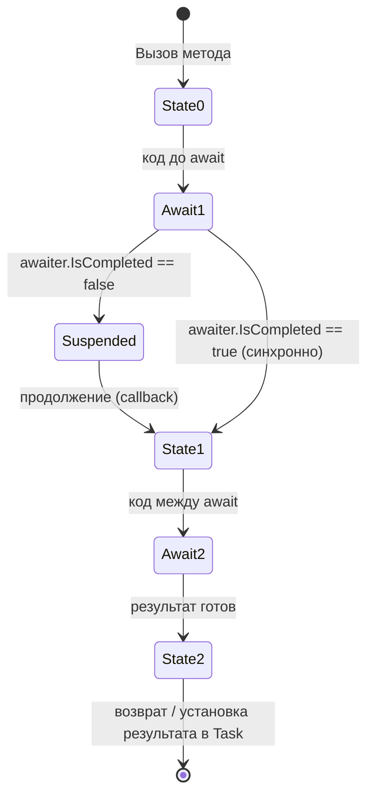
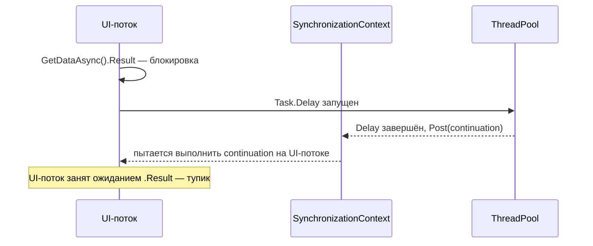
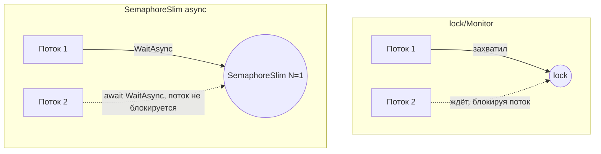
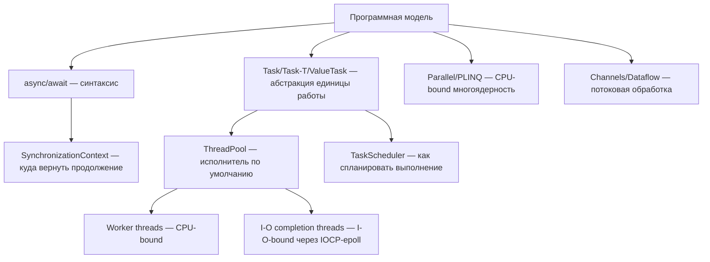

# Асинхронное программирование в .NET / C# — вопросы для собеседований

Более 150 вопросов уровня intermediate–advanced по асинхронному и многопоточному программированию в .NET Core / .NET Framework на C#. Вопросы сгруппированы по темам, к каждому дан развёрнутый ответ, а к ключевым концепциям — схемы и код.

**Как пользоваться:** это справочник для подготовки к собеседованиям и для углубления понимания темы. Рекомендуется не просто заучивать ответы, а проверять их на практике в небольших консольных проектах.

## Оглавление

1. [Основы: Task, Thread, async/await](#1-основы-task-thread-asyncawait)
2. [Как работает async/await под капотом (state machine, SynchronizationContext)](#2-как-работает-asyncawait-под-капотом)
3. [ConfigureAwait и deadlock-и](#3-configureawait-и-deadlock-и)
4. [CancellationToken и отмена операций](#4-cancellationtoken-и-отмена-операций)
5. [Обработка исключений в асинхронном коде](#5-обработка-исключений-в-асинхронном-коде)
6. [Композиция задач: WhenAll, WhenAny, ContinueWith](#6-композиция-задач-whenall-whenany-continuewith)
7. [ValueTask и производительность](#7-valuetask-и-производительность)
8. [Parallel-программирование: Parallel.For, PLINQ](#8-parallel-программирование)
9. [Примитивы синхронизации](#9-примитивы-синхронизации)
10. [Concurrent-коллекции](#10-concurrent-коллекции)
11. [IAsyncEnumerable и асинхронные потоки](#11-iasyncenumerable-и-асинхронные-потоки)
12. [Thread Pool изнутри](#12-thread-pool-изнутри)
13. [Асинхронность в ASP.NET Core](#13-асинхронность-в-aspnet-core)
14. [Тестирование асинхронного кода](#14-тестирование-асинхронного-кода)
15. [Антипаттерны и best practices](#15-антипаттерны-и-best-practices)
16. [Продвинутые темы: Channels, Dataflow, IAsyncDisposable](#16-продвинутые-темы)

---

## 1. Основы: Task, Thread, async/await

### 1.1. В чём разница между `Thread` и `Task`?

`Thread` — это низкоуровневая обёртка над потоком ОС: создание дорогое (~1 МБ стека), явное управление жизненным циклом, нет встроенной поддержки возврата результата или композиции. `Task` — это высокоуровневая абстракция единицы работы из TPL (Task Parallel Library): она не обязательно создаёт новый поток, может выполняться на потоке из `ThreadPool`, поддерживает возврат результата (`Task<T>`), продолжения (`ContinueWith`, `await`), отмену и обработку исключений через `AggregateException`. `Task` — это "что нужно сделать", `Thread` — это "на чём это выполняется".

### 1.2. Что такое asynchronous и что такое parallel — в чём разница?

Асинхронность — про неблокирующее ожидание результата (например, I/O): поток не простаивает, а освобождается для другой работы, пока операция выполняется где-то ещё (диск, сеть, ОС). Параллелизм — про одновременное выполнение нескольких вычислений на нескольких ядрах CPU. Асинхронный код не обязательно параллельный (может выполняться на одном потоке), а параллельный код не обязательно асинхронный (может быть синхронным, но многопоточным, как `Parallel.For`).

### 1.3. Что означают ключевые слова `async` и `await`?

`async` — модификатор метода, который сообщает компилятору, что метод содержит точки приостановки (`await`) и должен быть преобразован в конечный автомат (state machine). Сам по себе `async` не делает код асинхронным. `await` — оператор, который приостанавливает выполнение метода до завершения awaitable-объекта (обычно `Task`/`Task<T>`/`ValueTask`), не блокируя вызывающий поток, и подписывает продолжение метода на завершение этой задачи.

### 1.4. Какие сигнатуры возврата допустимы для async-метода?

`Task`, `Task<T>`, `void` (только для обработчиков событий — "fire and forget", крайне не рекомендуется в остальных случаях), `ValueTask`, `ValueTask<T>`, а начиная с C# 7 — любой тип, реализующий паттерн awaitable (имеющий метод `GetAwaiter()`, возвращающий объект с `IsCompleted`, `GetResult()` и реализующий `INotifyCompletion`). Также поддерживаются `IAsyncEnumerable<T>` для `await foreach`.

### 1.5. Почему `async void` считается антипаттерном?

Исключения, выброшенные внутри `async void`-метода, нельзя перехватить через `try/catch` в вызывающем коде — они попадают напрямую в `SynchronizationContext` (или в `AppDomain.UnhandledException`) и обычно приводят к падению процесса. `async void` также нельзя дождаться (`await`) и невозможно узнать, когда операция завершилась, что усложняет тестирование и композицию. Единственное легитимное применение — обработчики событий UI, где сигнатура события фиксирована.

### 1.6. Что возвращает вызов async-метода до его завершения?

Немедленно возвращается объект `Task`/`Task<T>` (или `ValueTask`), представляющий незавершённую операцию — своего рода "обещание" (promise) будущего результата. Синхронная часть метода до первого `await` выполняется сразу же, на текущем потоке, в рамках вызова.

### 1.7. Правда ли, что `async` метод всегда выполняется в отдельном потоке?

Нет. Код до первой точки `await` выполняется синхронно на вызывающем потоке. Если awaitable уже завершён (`IsCompleted == true`), выполнение может продолжиться синхронно дальше без переключения потока. Новый поток создаётся только если внутри метода явно запускается работа через `Task.Run`, `Task.Factory.StartNew` или похожий механизм, либо продолжение планируется на поток из пула после реального I/O-ожидания.

### 1.8. Чем `Task.Run` отличается от простого вызова async-метода?

`Task.Run` ставит делегат в очередь `ThreadPool` для выполнения на фоновом потоке — это способ вынести CPU-bound работу с текущего потока (например, UI-потока). Простой вызов `async`-метода не создаёт новый поток сам по себе — он лишь оборачивает синхронную часть выполнения и точки `await` в state machine. `Task.Run(async () => ...)` часто используется для оффлоада CPU-bound работы, но бессмысленен для I/O-bound кода, который и так не блокирует поток.

### 1.9. Когда стоит использовать `Task.Run`, а когда нет?

Использовать — когда нужно перенести CPU-интенсивную синхронную операцию на фоновый поток из UI/ASP.NET-контекста, чтобы не блокировать основной поток. Не стоит — оборачивать в `Task.Run` уже асинхронный I/O-bound код (например, `HttpClient.GetAsync`) — это лишь тратит поток из пула впустую. Также не рекомендуется использовать `Task.Run` внутри библиотек ASP.NET Core (там нет UI-потока, которого нужно "разгружать", а лишний поток из пула — это накладные расходы под нагрузкой).

### 1.10. Что такое "hot" и "cold" задачи?

"Hot" (горячая) задача — уже запущена планировщиком в момент создания объекта `Task` (так работает большинство API, включая `Task.Run` и async-методы). "Cold" (холодная) задача создаётся через `new Task(...)` и требует явного вызова `.Start()`. Библиотека TPL Dataflow и обычные `async`-методы всегда создают горячие задачи; `new Task()` без `Start()` — редкий и обычно нежелательный паттерн, легко приводящий к "задачам", которые никогда не выполнятся.

### 1.11. В чём разница между `Task.Delay` и `Thread.Sleep`?

`Thread.Sleep` блокирует текущий поток на заданное время — поток простаивает и недоступен для другой работы. `Task.Delay` не блокирует поток: он возвращает `Task`, который завершится через указанное время благодаря таймеру ОС, а поток в это время можно использовать для другой работы. `await Task.Delay(...)` — правильный неблокирующий способ "подождать" в асинхронном коде.

### 1.12. Может ли async-метод быть синхронным по факту (не содержать `await`)?

Да, технически компилируется, но компилятор выдаст предупреждение CS1998 ("async method lacks await operators"). Такой метод выполняется полностью синхронно и оборачивает результат в уже завершённый `Task`, что создаёт ненужные накладные расходы на аллокацию. Обычно это сигнал, что модификатор `async` не нужен и метод стоит переписать как обычный, возвращающий `Task.FromResult(...)` явно, либо (лучше) сделать сигнатуру синхронной.

## 2. Как работает async/await под капотом

### 2.1. Во что компилятор превращает async-метод?

В конечный автомат (state machine) — структуру или класс, реализующий `IAsyncStateMachine`, с методом `MoveNext()`. Каждая точка `await` становится точкой сохранения состояния: локальные переменные переносятся в поля state machine, а текущий "шаг" отслеживается целочисленным полем состояния. При недостигнутом завершении awaiter'а `MoveNext` подписывается на продолжение и возвращает управление вызывающему коду; при завершении awaiter'а выполнение продолжается с сохранённого шага.



### 2.2. Что такое `AsyncTaskMethodBuilder` и зачем он нужен?

Это вспомогательная структура, которую компилятор использует внутри сгенерированной state machine для создания и управления результирующим `Task`/`Task<T>`. Она отвечает за: создание `Task`, установку результата (`SetResult`), установку исключения (`SetException`), и планирование продолжения (`AwaitOnCompleted`/`AwaitUnsafeOnCompleted`), которое связывает awaiter с `MoveNext()` state machine.

### 2.3. Что такое `SynchronizationContext` и как он влияет на `await`?

`SynchronizationContext` — абстракция, представляющая "среду выполнения" потока: как поставить delegate в очередь на выполнение именно в этом контексте (например, UI-поток WPF/WinForms должен выполнять весь код, трогающий контролы). По умолчанию, если `SynchronizationContext.Current` не `null`, продолжение после `await` планируется через `Post()` обратно в этот контекст. В консольных приложениях и в ASP.NET Core `SynchronizationContext.Current` равен `null`, поэтому продолжение выполняется на произвольном потоке из `ThreadPool`.

### 2.4. Какие типы `SynchronizationContext` существуют в .NET и чем отличаются?

`WindowsFormsSynchronizationContext` и `DispatcherSynchronizationContext` (WPF) гарантируют, что продолжение выполнится на UI-потоке (через message loop). Классический ASP.NET (System.Web) использовал `AspNetSynchronizationContext`, который ограничивал одновременное выполнение одним потоком на запрос (что порождало классические deadlock-и при `.Result`/`.Wait()`). ASP.NET Core отказался от `SynchronizationContext` вообще — там `Current == null`, поэтому продолжения планируются напрямую в `ThreadPool` без привязки к "потоку запроса".

### 2.5. Что такое `TaskScheduler` и чем он отличается от `SynchronizationContext`?

`TaskScheduler` — абстракция TPL для планирования выполнения задач (по умолчанию `TaskScheduler.Default` использует `ThreadPool`). `SynchronizationContext` — более общая, независимая от TPL абстракция для маршалинга кода в конкретный поток/очередь (используется не только `Task`, но и `BackgroundWorker`, таймерами и т.д.). `await` по умолчанию учитывает именно `SynchronizationContext.Current`, а не `TaskScheduler.Current`, что часто вызывает путаницу.

### 2.6. Что такое awaiter и какому контракту он должен соответствовать (awaitable pattern)?

Awaiter — это объект, возвращаемый методом `GetAwaiter()` у awaitable-типа. Он должен реализовывать интерфейс `INotifyCompletion` (или `ICriticalNotifyCompletion`) и иметь: свойство `bool IsCompleted`, метод `void OnCompleted(Action continuation)` и метод `GetResult()` (возвращающий `void` или `T`). Компилятор генерирует код именно под этот структурный контракт (duck typing), поэтому можно сделать awaitable даже собственный тип, не связанный с `Task`.

### 2.7. Как выглядит упрощённо сгенерированный код для простого async-метода?

```csharp
// Исходный код
async Task<int> GetValueAsync()
{
    var x = await SomeAsync();
    return x + 1;
}

// Упрощённо (концептуально) компилятор генерирует:
Task<int> GetValueAsync()
{
    var stateMachine = new GetValueAsyncStateMachine();
    stateMachine.builder = AsyncTaskMethodBuilder<int>.Create();
    stateMachine.state = -1;
    stateMachine.builder.Start(ref stateMachine);
    return stateMachine.builder.Task;
}
```

Внутри `MoveNext()` реализована логика переключения между состояниями с `try/catch`, который перехватывает исключения и передаёт их в `builder.SetException(...)`.

### 2.8. Почему стек вызовов у асинхронного кода "теряется" в отладчике/логах исключений?

Потому что физически выполнение метода после `await` может продолжиться на другом потоке и в другом кадре стека — исходный стек вызовов, существовавший до `await`, к этому моменту уже размотан. .NET компенсирует это через "asynchronous call stacks" — компилятор добавляет отладочную информацию (state machine builder помечает continuation), и современные отладчики Visual Studio/Rider умеют восстанавливать логическую цепочку `await`-вызовов, хотя физического стека там уже нет.

### 2.9. Что такое `ExecutionContext` и как он связан с `async/await`?

`ExecutionContext` переносит "окружение" потока — включая `AsyncLocal<T>`, контекст безопасности, культуру — через асинхронные точки продолжения. Когда выполнение приостанавливается на `await`, .NET автоматически захватывает текущий `ExecutionContext` и восстанавливает его при возобновлении на новом потоке — поэтому значения `AsyncLocal<T>` (например, TraceId в логировании) "путешествуют" вместе с асинхронной операцией, даже если она продолжается на другом потоке пула.

### 2.10. Что делает `ConfigureAwait(false)` на низком уровне?

Он указывает awaiter'у не захватывать текущий `SynchronizationContext` (и, начиная с .NET Core, также `TaskScheduler.Current`, если он не `Default`) для планирования продолжения. Это возвращает булев флаг `continueOnCapturedContext` в структуру `ConfiguredTaskAwaitable`. Продолжение в этом случае просто ставится в очередь `ThreadPool`, а не маршалируется обратно в исходный контекст.

## 3. ConfigureAwait и deadlock-и

### 3.1. Зачем нужен `ConfigureAwait(false)` и когда его использовать?

Он отключает захват `SynchronizationContext`/`TaskScheduler` для продолжения после `await`, что экономит на маршалинге и снижает риск deadlock-ов при блокирующем ожидании. Рекомендуется использовать в библиотечном коде (не UI, не ASP.NET-контроллерах), которому не важно, на каком потоке продолжится выполнение после `await`. Не нужен там, где после `await` требуется вернуться в исходный контекст — например, для обновления элементов UI.

### 3.2. Нужен ли `ConfigureAwait(false)` в ASP.NET Core?

Начиная с ASP.NET Core, `SynchronizationContext.Current` всегда `null` (в отличие от классического ASP.NET), поэтому `ConfigureAwait(false)` не даёт функционального эффекта в контроллерах и middleware — там нет контекста, который нужно "не захватывать". Тем не менее, многие команды продолжают использовать его в библиотечном коде для универсальности (если библиотека также используется в WPF/WinForms-приложениях) и по инерции — Microsoft теперь допускает его опускать в чисто ASP.NET Core проектах.

### 3.3. Классический пример deadlock-а с `.Result`/`.Wait()` — объясните механизм

```csharp
// В UI/классическом ASP.NET потоке:
var result = GetDataAsync().Result; // блокирует поток

async Task<string> GetDataAsync()
{
    await Task.Delay(1000); // без ConfigureAwait(false)
    return "data"; // продолжение хочет вернуться в исходный SynchronizationContext
}
```

Вызывающий поток блокируется вызовом `.Result`, ожидая завершения `Task`. Но продолжение метода `GetDataAsync` после `await Task.Delay` запланировано на возврат именно в этот же `SynchronizationContext` (например, UI-поток), а этот поток занят ожиданием — он не может обработать очередь продолжения. Возникает циклическая зависимость: поток ждёт задачу, задача ждёт свободный поток. Классический deadlock.



### 3.4. Как избежать deadlock-а без `ConfigureAwait(false)`?

Главный способ — не блокировать асинхронный код синхронными вызовами (`.Result`, `.Wait()`, `.GetAwaiter().GetResult()`) вообще, а использовать `await` "до самого верха" (async all the way). Если блокировка неизбежна (например, в `Main` до C# 7.1 или в синхронном интерфейсе, который нельзя изменить), можно: обернуть вызов в `Task.Run(() => AsyncMethod())` (выполнит асинхронный код на потоке пула без захваченного контекста) или расставить `ConfigureAwait(false)` во всей цепочке вызовов.

### 3.5. Чем отличается `.Result`/`.Wait()` от `.GetAwaiter().GetResult()`?

Функционально оба блокируют текущий поток до завершения задачи. Разница — в обработке исключений: `.Result` и `.Wait()` оборачивают любое исключение в `AggregateException`, даже если внутри было одно исключение. `.GetAwaiter().GetResult()` разворачивает `AggregateException` и выбрасывает первое исходное исключение напрямую, сохраняя более чистый стек — именно это использует сам компилятор внутри `await`, поэтому `GetAwaiter().GetResult()` считается более "правильной" заменой при вынужденной блокировке.

### 3.6. Что такое "sync-over-async" и почему это плохая практика?

Это паттерн, при котором асинхронный API вызывается синхронно через блокировку (`.Result`, `.Wait()`). Проблемы: риск deadlock-а (см. выше), неэффективное расходование потоков (поток простаивает в ожидании вместо того, чтобы вернуться в пул), потенциальное истощение `ThreadPool` под нагрузкой из-за thread pool starvation. Правильная альтернатива — распространять `async`/`await` по всей цепочке вызовов ("async all the way down").

### 3.7. Что такое "async over sync" и когда он оправдан?

Обратный паттерн — оборачивание синхронного (блокирующего) API в `Task.Run`, чтобы вызвать его "асинхронно". Оправдан, когда нужно не блокировать текущий поток (например, UI) синхронным вызовом стороннего API, у которого нет асинхронной версии. Но это не делает саму операцию быстрее — она просто выполняется на другом потоке пула, и в высоконагруженном серверном сценарии (ASP.NET Core) такой паттерн лишь тратит поток пула впустую и не даёт выигрыша в масштабируемости.

### 3.8. Может ли deadlock возникнуть в ASP.NET Core (в отличие от классического ASP.NET)?

Гораздо реже, потому что `SynchronizationContext.Current == null`, и продолжения не пытаются вернуться на "поток запроса" — они просто выполняются на любом свободном потоке пула. Тем не менее полностью исключить проблемы sync-over-async нельзя: при интенсивном использовании `.Result`/`.Wait()` под нагрузкой возможен thread pool starvation (все потоки заняты ожиданием), что не является классическим deadlock-ом, но приводит к деградации отзывчивости приложения вплоть до полной остановки обработки новых запросов.

## 4. CancellationToken и отмена операций

### 4.1. Как устроена модель отмены в .NET (`CancellationTokenSource`/`CancellationToken`)?

`CancellationTokenSource` — источник, владеющий состоянием отмены и предоставляющий метод `Cancel()`. `CancellationToken` — облегчённая, доступная только для чтения структура, которую передают в асинхронные/долгие операции; они периодически проверяют `IsCancellationRequested` или регистрируют callback через `Register()`. Это кооперативная модель: сама операция должна явно проверять токен и завершаться — принудительно "убить" задачу через токен нельзя.

```mermaid
flowchart LR
    A[CancellationTokenSource] -->|Token| B[CancellationToken]
    B --> C[Метод 1: проверяет IsCancellationRequested]
    B --> D[Метод 2: вызывает ThrowIfCancellationRequested]
    B --> E[Метод 3: Register callback]
    A -->|Cancel()| A
```

### 4.2. Разница между проверкой `IsCancellationRequested` и вызовом `ThrowIfCancellationRequested()`?

`IsCancellationRequested` — просто булев флаг, который можно проверить и обработать произвольно (например, корректно свернуть операцию и вернуть частичный результат). `ThrowIfCancellationRequested()` — бросает `OperationCanceledException`, если флаг установлен, что является стандартным конвенциональным способом сообщить о том, что задача была отменена, и позволяет `Task` перейти в статус `Canceled` (а не `Faulted`), если исключение содержит именно тот токен, что был передан в задачу.

### 4.3. Почему важно, чтобы `OperationCanceledException` содержал именно тот `CancellationToken`, что был передан задаче?

Инфраструктура TPL проверяет, что `CancellationToken` в брошенном `OperationCanceledException.CancellationToken` совпадает с токеном, ассоциированным с `Task` (например, переданным в `Task.Run(action, token)`). Если совпадает — `Task.Status` становится `Canceled`, а не `Faulted`, и при ожидании через `await` бросается именно `TaskCanceledException` (наследник `OperationCanceledException`), что позволяет вызывающему коду корректно отличить "отмену" от "ошибки" через `catch (OperationCanceledException)`.

### 4.4. Как объединить несколько токенов отмены в один?

Через `CancellationTokenSource.CreateLinkedTokenSource(tokenA, tokenB)` — возвращает новый источник, токен которого сработает, если сработает любой из связанных. Это удобно, например, при комбинировании токена отмены запроса (из ASP.NET `HttpContext.RequestAborted`) с собственным таймаутом:

```csharp
using var timeoutCts = new CancellationTokenSource(TimeSpan.FromSeconds(30));
using var linkedCts = CancellationTokenSource.CreateLinkedTokenSource(
    httpContext.RequestAborted, timeoutCts.Token);
await DoWorkAsync(linkedCts.Token);
```

### 4.5. Что произойдёт, если не удалить (`Dispose`) `CancellationTokenSource`?

`CancellationTokenSource` держит внутренние ресурсы, включая, при использовании таймера (`new CancellationTokenSource(TimeSpan)`), объект `Timer` из системы таймеров. Отсутствие `Dispose()` приводит к утечке этих ресурсов, хотя обычно это не критично для приложений с коротким временем жизни объектов CTS, но становится проблемой при частом создании CTS в горячем пути (например, на каждый HTTP-запрос без `using`).

### 4.6. Как реализовать таймаут для операции, у которой нет встроенной поддержки CancellationToken?

Через гонку (`Task.WhenAny`) между самой операцией и `Task.Delay(timeout)`:

```csharp
var task = SomeOperationAsync();
var completed = await Task.WhenAny(task, Task.Delay(timeout));
if (completed != task)
    throw new TimeoutException();
await task; // пробросить исключение, если оно было
```

Важный нюанс: сама операция не отменяется — она просто "оставляется позади" и продолжает выполняться в фоне, потребляя ресурсы, если у неё нет собственной поддержки `CancellationToken`.

### 4.7. Чем `CancellationToken.None` отличается от `default`?

Фактически идентичны: `CancellationToken.None` реализован как `default(CancellationToken)` — структура без связанного `CancellationTokenSource`, у которой `CanBeCanceled == false`, а `IsCancellationRequested` всегда `false`. Это удобное значение по умолчанию для методов, у которых нет реальной поддержки отмены, либо когда отмена не требуется вызывающей стороне.

### 4.8. Как правильно передавать `CancellationToken` через сигнатуры методов?

Соглашение: `CancellationToken` — последний параметр метода, часто с `default` в качестве значения по умолчанию для публичных API. Токен должен "протекать" (flow) через всю цепочку вызовов вплоть до самых низкоуровневых awaitable-операций (запросы к БД, HTTP-вызовы), а не теряться на полпути — иначе отмена верхнего уровня не остановит реальную работу внизу.

### 4.9. Что происходит с `Task`, отменённым через `CancellationToken`, при `await`?

При `await` такой `Task` бросает `TaskCanceledException` (или `OperationCanceledException`) в месте ожидания — это позволяет обработать отмену как управляемый поток исключений через `try/catch`. `Task.Status` при этом равен `TaskStatus.Canceled`, а не `RanToCompletion`, что важно учитывать при агрегатных операциях типа `Task.WhenAll`, где отменённые задачи не считаются "ошибочными" автоматически.

### 4.10. Как отменить `CancellationTokenSource` с задержкой и зачем это нужно?

`CancellationTokenSource.CancelAfter(TimeSpan)` — планирует автоматическую отмену через заданное время без блокирующего ожидания, часто используется как встроенный механизм таймаута:

```csharp
using var cts = new CancellationTokenSource();
cts.CancelAfter(TimeSpan.FromSeconds(5));
await DoWorkAsync(cts.Token);
```

Это удобнее ручной гонки через `Task.WhenAny` в случаях, когда операция сама поддерживает кооперативную отмену через токен.

## 5. Обработка исключений в асинхронном коде

### 5.1. Как исключения "путешествуют" из async-метода к вызывающему коду?

Исключение, выброшенное внутри тела async-метода, перехватывается сгенерированным компилятором `try/catch` внутри state machine и передаётся в `AsyncTaskMethodBuilder.SetException(...)`, что переводит возвращённый `Task` в статус `Faulted` с сохранённым исключением внутри `Task.Exception`. Оно повторно выбрасывается только тогда, когда кто-то делает `await` этой задачи (или обращается к `.Result`/`.Wait()`).

### 5.2. Почему `Task.Exception` — это `AggregateException`, а `await` бросает исходное исключение?

`Task.Exception` исторически спроектирован под TPL, где одна задача (например, из `Parallel.For` или `Task.WhenAll`) может агрегировать несколько исключений от разных внутренних операций — отсюда `AggregateException`, содержащий коллекцию `InnerExceptions`. `await` же (через `TaskAwaiter.GetResult()`) разворачивает `AggregateException` и бросает только первое внутреннее исключение — это сделано для более естественной работы с `try/catch` в линейном асинхронном коде.

### 5.3. Что произойдёт, если исключение возникает после нескольких `await`, а не сразу?

Не имеет значения, на каком именно `await` возникло исключение — оно так же будет перехвачено state machine и сохранено в `Task`. Каждый `await` внутри метода находится в едином try/catch, обёртывающем всё тело метода, поэтому логика не отличается вне зависимости от того, на первом или на пятом `await` произошла ошибка.

### 5.4. Как обрабатывать несколько исключений из `Task.WhenAll`?

`await Task.WhenAll(tasks)` пробросит только первое исключение, но все исключения доступны через `Task.Exception.InnerExceptions` объекта, возвращённого `Task.WhenAll`, если обратиться к нему до `await` (либо перехватить исключение, а затем проверить исходный `Task`):

```csharp
var whenAllTask = Task.WhenAll(tasks);
try { await whenAllTask; }
catch
{
    var allExceptions = whenAllTask.Exception?.Flatten().InnerExceptions;
    foreach (var ex in allExceptions ?? Enumerable.Empty<Exception>())
        Log(ex);
}
```

### 5.5. Что такое `AggregateException.Flatten()` и зачем он нужен?

Когда исключения агрегируются из вложенных задач (например, `Parallel.For` внутри `Task.Run`), может получиться `AggregateException`, чьи `InnerExceptions` сами являются `AggregateException`. Метод `Flatten()` рекурсивно "разворачивает" такую иерархию в единый плоский список исключений, что упрощает их перебор и обработку.

### 5.6. Что такое TaskScheduler.UnobservedTaskException и почему он важен?

Событие, которое срабатывает, когда задача завершилась с исключением, но никто не обратился к её результату/исключению (например, "fire and forget" `Task.Run(...)` без `await`), и объект `Task` был собран сборщиком мусора. До .NET 4.5 необработанное исключение в такой ситуации могло завершить процесс; сейчас процесс не падает по умолчанию, но подписка на `TaskScheduler.UnobservedTaskException` позволяет хотя бы залогировать такие "потерянные" ошибки для диагностики.

### 5.7. Как правильно логировать исключения без потери stack trace?

Использовать `catch (Exception ex) { Log(ex); throw; }` (голый `throw;` без указания переменной) — он сохраняет исходный stack trace. `throw ex;` пересоздаёт stack trace с точки повторного выброса, теряя информацию о реальном месте возникновения ошибки. Для дополнительного контроля можно использовать `ExceptionDispatchInfo.Capture(ex).Throw()`, что гарантирует полное сохранение исходного stack trace даже при передаче исключения между методами.

### 5.8. Как ведёт себя `try/finally` относительно `await` внутри тела?

`finally`-блок выполнится корректно после завершения (или отмены/ошибки) внутренней асинхронной операции, даже если `await` находится внутри `try`. Компилятор корректно генерирует state machine так, чтобы `finally` срабатывал ровно один раз в правильной точке, независимо от того, синхронно или асинхронно завершился внутренний awaiter. Это отличает C# от многих других языков, где комбинирование async-конструкций с finally требует ручной аккуратности.

### 5.9. Что произойдёт при исключении внутри `using`/`await using` с асинхронным Dispose?

`await using` (для `IAsyncDisposable`) гарантирует, что `DisposeAsync()` будет вызван асинхронно и корректно дождан даже при возникновении исключения в теле блока — аналогично тому, как `using` гарантирует вызов `Dispose()`. Исключение из основного блока не подавляется исключением из `DisposeAsync`, если только в самом `DisposeAsync` не возникнет новое исключение — тогда сработает стандартное для C# правило "последнее исключение маскирует предыдущее", если не используется `try/finally` с явной обработкой.

### 5.10. В чём разница между `catch (OperationCanceledException)` и `catch (TaskCanceledException)`?

`TaskCanceledException` — наследник `OperationCanceledException`, специфичный для `Task`. Если код должен ловить отмену в общем виде (не важно, откуда — из `Task`, `Stream`, LINQ-провайдера и т.д.), правильнее ловить именно `OperationCanceledException`, так как он используется во всей платформе как общий базовый класс для сигнализации об отмене. Ловить `TaskCanceledException` имеет смысл только если нужно специфично отличить отмену задачи от прочих `OperationCanceledException`.

## 6. Композиция задач: WhenAll, WhenAny, ContinueWith

### 6.1. Чем `Task.WhenAll` отличается от последовательного вызова `await` в цикле?

`Task.WhenAll` запускает все задачи параллельно (они уже "горячие" к моменту вызова, если были созданы заранее) и дожидается завершения всех сразу — общее время равно самой долгой задаче. Последовательный `await` в цикле выполняет задачи одну за другой — общее время равно сумме времён всех задач. Важно: сами задачи должны быть уже запущены (например, через вызов async-метода без немедленного `await`) до передачи в `WhenAll`, иначе выигрыша не будет.

```csharp
// Параллельно — быстрее
var t1 = DownloadAsync(url1);
var t2 = DownloadAsync(url2);
await Task.WhenAll(t1, t2);

// Последовательно — медленнее
await DownloadAsync(url1);
await DownloadAsync(url2);
```

### 6.2. Как получить результаты от `Task.WhenAll<T>`?

`Task.WhenAll` для набора `Task<T>` возвращает `Task<T[]>`, содержащий результаты всех задач в исходном порядке (не в порядке завершения):

```csharp
Task<int>[] tasks = { GetAAsync(), GetBAsync(), GetCAsync() };
int[] results = await Task.WhenAll(tasks);
```

### 6.3. Для чего используется `Task.WhenAny` и какие есть подводные камни?

`Task.WhenAny` возвращает задачу, которая завершается, как только завершится первая из переданных задач (используется для реализации таймаутов, "гонки" нескольких источников данных, отмены по первому ответу). Подводный камень: остальные незавершённые задачи не отменяются автоматически — они продолжают выполняться в фоне, если их явно не отменить через `CancellationToken`, что может привести к утечкам ресурсов или необработанным исключениям в "проигравших" задачах.

### 6.4. Чем `ContinueWith` отличается от `await`?

`ContinueWith` — низкоуровневый API TPL для явного планирования продолжения после завершения задачи, требует ручного управления `TaskScheduler` (по умолчанию `TaskScheduler.Current`, что может неожиданно захватывать контекст), ручной обработки `AggregateException`, ручной обработки статусов (`OnlyOnFaulted`, `OnlyOnCanceled` и т.д.). `await` — более высокоуровневая и безопасная конструкция, автоматически корректно обрабатывающая контекст, исключения и отмену. В современном коде `ContinueWith` практически не используется, за исключением специфичных низкоуровневых сценариев.

### 6.5. Какие есть подводные камни при использовании `ContinueWith` без явного `TaskScheduler`?

По умолчанию `ContinueWith` использует `TaskScheduler.Current`, который внутри async-метода может оказаться неожиданным (например, если вызов происходит из UI-обработчика). Явное указание `TaskScheduler.Default` предотвращает случайный захват UI-контекста для фоновой логики:

```csharp
task.ContinueWith(t => DoWork(t.Result), TaskScheduler.Default);
```

### 6.6. Как объединить `Task.WhenAll` с ограничением степени параллелизма?

Через `SemaphoreSlim` для троттлинга количества одновременно выполняющихся задач:

```csharp
var semaphore = new SemaphoreSlim(maxDegreeOfParallelism);
var tasks = items.Select(async item =>
{
    await semaphore.WaitAsync();
    try { return await ProcessAsync(item); }
    finally { semaphore.Release(); }
});
var results = await Task.WhenAll(tasks);
```

Начиная с .NET 6, для этой задачи также удобно использовать `Parallel.ForEachAsync` с `ParallelOptions.MaxDegreeOfParallelism`.

### 6.7. В чём разница между `Task.FromResult`, `Task.CompletedTask` и `Task.FromException`?

`Task.FromResult(value)` — создаёт уже завершённый `Task<T>` с готовым результатом, полезно для реализации синхронных путей в асинхронных интерфейсах без накладных расходов на state machine. `Task.CompletedTask` — статический, кэшированный, уже завершённый `Task` без результата (эквивалент для `void`-подобных операций). `Task.FromException(ex)` — создаёт уже завершённую задачу в статусе `Faulted` с заданным исключением, полезно для возврата ошибки из синхронного пути async-интерфейса без выброса исключения напрямую (что могло бы сломать контракт "исключение только через Task").

### 6.8. Как реализовать retry-логику для асинхронной операции?

```csharp
async Task<T> RetryAsync<T>(Func<Task<T>> action, int maxAttempts, TimeSpan delay)
{
    for (int attempt = 1; ; attempt++)
    {
        try { return await action(); }
        catch (Exception) when (attempt < maxAttempts)
        {
            await Task.Delay(delay * attempt); // экспоненциальный backoff
        }
    }
}
```

В production-коде для этого обычно используют готовую библиотеку **Polly**, которая предоставляет retry, circuit breaker, timeout и другие политики устойчивости "из коробки".

### 6.9. Как дождаться завершения набора задач, обрабатывая их по мере готовности (а не всех сразу)?

Через паттерн "убывающего списка" с `Task.WhenAny` в цикле, либо (проще и эффективнее) через `Task.WhenEach` (появился в .NET 9) или сторонний хелпер `Task.OrderByCompletion`:

```csharp
var tasks = items.Select(ProcessAsync).ToList();
while (tasks.Count > 0)
{
    var finished = await Task.WhenAny(tasks);
    tasks.Remove(finished);
    var result = await finished;
    Console.WriteLine(result);
}
```

### 6.10. Что произойдёт, если внутри `Task.WhenAll` одна из задач отменена, а другая упала с исключением?

`Task.WhenAll` дожидается завершения (успешного, ошибочного или отменённого) всех переданных задач, прежде чем сама завершиться. Если хотя бы одна задача завершилась с исключением, результирующая задача переходит в `Faulted`, и `await` бросит первое исключение (в порядке следования задач в списке, не по времени завершения). Статус `Canceled` отдельной задачи не считается ошибкой сам по себе, но если единственная "проблемная" задача была отменена (без Faulted других), то итоговый статус `WhenAll` тоже станет `Canceled`.

## 7. ValueTask и производительность

### 7.1. Зачем был введён `ValueTask<T>`, если уже есть `Task<T>`?

`Task<T>` — ссылочный тип, каждое его создание — это аллокация в куче. Для горячих путей, где результат часто доступен синхронно (например, значение уже в кэше), постоянная аллокация `Task<T>` создаёт заметное давление на GC. `ValueTask<T>` — структура (value type), которая может обернуть либо уже готовый результат без аллокации, либо (при необходимости реального ожидания) — обычный `Task<T>` внутри. Это оптимизация для очень горячих, часто синхронно завершающихся асинхронных путей.

### 7.2. Какие ограничения есть у `ValueTask`, которых нет у `Task`?

`ValueTask` нельзя дожидаться (`await`) более одного раза — повторный `await` может привести к неопределённому поведению или исключению. Нельзя одновременно ожидать `ValueTask` из нескольких мест (`Task.WhenAll`/`WhenAny` с `ValueTask` требует явного преобразования через `.AsTask()`). Нельзя проверять `.IsCompleted` после того, как результат уже был получен. Из-за этих ограничений `ValueTask` не должен храниться и использоваться повторно как обычный объект — только "используй один раз и выбрось".

### 7.3. Когда стоит использовать `ValueTask<T>`, а когда — обычный `Task<T>`?

`ValueTask<T>` оправдан в высокопроизводительных, часто вызываемых API, где значительная доля вызовов завершается синхронно (типичный пример — методы кэшей, `Stream.ReadAsync` в современных реализациях, парсеры). В обычном прикладном/бизнес-коде, где такой профиль вызовов не гарантирован, лучше использовать привычный `Task<T>` — код с ним проще, безопаснее и не имеет описанных выше подводных камней.

### 7.4. Что такое `IValueTaskSource<T>` и зачем он нужен?

Интерфейс, позволяющий реализовать собственный низкоуровневый источник для `ValueTask<T>` без аллокации `Task` вообще — даже в асинхронном (не завершившемся сразу) сценарии, за счёт переиспользуемых пулов состояния (`ManualResetValueTaskSourceCore<T>`). Используется в высокопроизводительных библиотеках (например, Kestrel, System.IO.Pipelines) там, где обычная аллокация `Task` на каждый вызов недопустима по соображениям производительности при огромном количестве операций в секунду.

### 7.5. Почему нельзя вызывать `.Result` на `ValueTask` так же свободно, как на `Task`?

У `ValueTask<T>` есть свойство `.Result`, но обращаться к нему безопасно можно только после того, как известно, что операция завершена (`IsCompleted == true`) — иначе поведение аналогично блокирующему ожиданию, но с менее предсказуемой семантикой в случае, если внутри `ValueTask` используется кастомный `IValueTaskSource`, не поддерживающий блокирующее ожидание "из коробки". Общая рекомендация — использовать `ValueTask` только через `await`, избегая прямого обращения к `.Result`.

### 7.6. Какие есть накладные расходы у `async`/`await`, если оценивать их "в вакууме"?

Аллокация объекта `Task`/state machine (для классов; структуры state machine для методов без async-лямбд могут избегать части аллокаций в оптимизированных сценариях), аллокация замыкания при захвате переменных, накладные расходы на переключение контекста при реальном асинхронном ожидании, накладные расходы на диспетчеризацию через `ThreadPool`. Для CPU-bound кода с мгновенным завершением синхронный код всегда быстрее; выигрыш `async/await` проявляется именно на I/O-bound операциях, где поток иначе простаивал бы.

### 7.7. Как измерить накладные расходы async-кода на практике?

Через **BenchmarkDotNet** — стандартный инструмент для микробенчмарков в .NET, который корректно учитывает JIT-прогрев, GC-паузы и статистическую погрешность измерений (что критично, так как ручное измерение через `Stopwatch` в цикле легко даёт искажённые результаты из-за JIT-компиляции "на лету" и эффектов GC).

### 7.8. Что такое "state machine boxing" и когда он происходит?

Компилятор по возможности генерирует state machine как `struct` (для производительности — без аллокации на каждый вызов). Однако при определённых условиях (например, если async-метод вызывается через интерфейс, или state machine передаётся как объект в `AsyncTaskMethodBuilder` не напрямую) структура "боксится" в объект в куче — эта аллокация частично нивелирует оптимизацию. В .NET Core начиная с некоторых версий JIT/компилятор старается минимизировать такое боксирование, но полностью избежать его в общем случае нельзя.

## 8. Parallel-программирование

### 8.1. Чем `Parallel.For`/`Parallel.ForEach` отличаются от асинхронного кода с `Task.WhenAll`?

`Parallel.For`/`Parallel.ForEach` предназначены для CPU-bound работы: они синхронно (блокируя вызывающий поток) распределяют итерации по нескольким потокам `ThreadPool`, максимизируя использование ядер CPU, и возвращают управление только после завершения всех итераций. `Task.WhenAll` — асинхронный, неблокирующий способ дождаться набора задач, изначально предназначенный для I/O-bound операций (хотя может использоваться и для CPU-bound через `Task.Run`).

### 8.2. Как ограничить степень параллелизма в `Parallel.ForEach`?

Через `ParallelOptions.MaxDegreeOfParallelism`:

```csharp
var options = new ParallelOptions { MaxDegreeOfParallelism = Environment.ProcessorCount };
Parallel.ForEach(items, options, item => Process(item));
```

Значение `-1` означает "без ограничений" (используется столько потоков, сколько посчитает нужным планировщик).

### 8.3. Что такое `Parallel.ForEachAsync` (появился в .NET 6) и зачем он нужен?

Асинхронный аналог `Parallel.ForEach`, позволяющий выполнять асинхронную работу (I/O-bound) с ограничением степени параллелизма без ручной реализации через `SemaphoreSlim`:

```csharp
await Parallel.ForEachAsync(urls,
    new ParallelOptions { MaxDegreeOfParallelism = 10 },
    async (url, ct) => await DownloadAsync(url, ct));
```

Это стандартизированное решение задачи "троттлинг параллельных асинхронных операций", которая раньше требовала ручной обвязки через семафор.

### 8.4. Что такое PLINQ и когда его стоит применять?

Parallel LINQ — расширение LINQ to Objects, автоматически распараллеливающее обработку последовательностей через `.AsParallel()`. Подходит для CPU-bound, "чистых" (без сайд-эффектов) вычислительных операций над большими коллекциями в памяти. Плохо подходит для I/O-bound операций, для маленьких коллекций (накладные расходы на распараллеливание превысят выигрыш) и для операций с существенными побочными эффектами или требующих сохранения порядка (если не указан `.AsOrdered()`).

### 8.5. Какие подводные камни есть у PLINQ?

Порядок элементов не гарантируется без `.AsOrdered()` (что снижает производительность). Исключения агрегируются в `AggregateException`. Не каждая операция эффективно распараллеливается — для некоторых операций (`Take`, `First` без сортировки) PLINQ может автоматически вернуться к последовательному выполнению. Побочные эффекты (запись в общую немодопасную коллекцию) внутри лямбды PLINQ — частый источник race condition.

### 8.6. Что такое race condition и приведите пример в контексте `Parallel.For`?

Race condition — ситуация, когда результат зависит от непредсказуемого порядка выполнения потоков, обращающихся к общим данным без должной синхронизации:

```csharp
int total = 0;
Parallel.For(0, 1000000, i => total++); // НЕ потокобезопасно — total++ не атомарен
Console.WriteLine(total); // результат непредсказуем, обычно меньше 1000000
```

Правильное решение — `Interlocked.Increment(ref total)` либо thread-local аккумуляция с последующим объединением через перегрузку `Parallel.For` с `localInit`/`localFinally`.

### 8.7. Как правильно агрегировать результат в `Parallel.For` без гонок?

Через перегрузку с thread-local состоянием:

```csharp
long total = 0;
Parallel.For(0, data.Length,
    () => 0L, // localInit — начальное значение для каждого потока
    (i, state, localSum) => localSum + data[i], // тело
    localSum => Interlocked.Add(ref total, localSum)); // localFinally — объединение
```

Такой подход избегает конкуренции за общий счётчик на каждой итерации, синхронизируя только финальное сложение частичных сумм.

### 8.8. Что такое `System.Threading.Channels` и как он связан с параллелизмом?

`Channel<T>` — потокобезопасная асинхронная очередь производитель-потребитель (producer/consumer) из современного .NET, во многом заменяющая `BlockingCollection<T>` для асинхронных сценариев. Поддерживает как ограниченную (`BoundedChannel`, с backpressure), так и неограниченную (`UnboundedChannel`) ёмкость, и предоставляет асинхронные `WriteAsync`/`ReadAsync`/`await foreach` через `IAsyncEnumerable`.

### 8.9. Чем `Parallel.Invoke` отличается от `Parallel.For`?

`Parallel.Invoke` предназначен для параллельного выполнения фиксированного, заранее известного набора разнородных операций (делегатов), в то время как `Parallel.For`/`ForEach` — для однородной операции, применяемой к множеству элементов/индексов. `Parallel.Invoke(A, B, C)` — удобный способ сказать "выполни эти три независимые операции одновременно и дождись всех".

### 8.10. Как работает алгоритм work-stealing в `ThreadPool`/TPL и зачем он нужен?

Каждый рабочий поток пула имеет собственную локальную очередь задач. Когда поток исчерпывает свою очередь, он "крадёт" (steals) задачи из очередей других, ещё занятых потоков (обычно с конца их очереди, чтобы минимизировать конфликты за блокировки). Это балансирует нагрузку между потоками без централизованной очереди-узкого места и снижает конкуренцию за блокировки при высоком уровне параллелизма, что особенно важно при рекурсивном порождении задач (например, `Parallel.For` с вложенными операциями).

## 9. Примитивы синхронизации

### 9.1. Чем `lock` (Monitor) отличается от `SemaphoreSlim`?

`lock` (синтаксический сахар над `Monitor.Enter`/`Exit`) — эксклюзивная блокировка, допускающая доступ только одному потоку одновременно, работает только синхронно (нельзя использовать с `await` внутри блока — компилятор запретит `await` внутри `lock`). `SemaphoreSlim` — более гибкий примитив, допускающий заданное число одновременных "владельцев" (не обязательно один) и поддерживающий асинхронное ожидание через `WaitAsync()`, что делает его основным инструментом синхронизации в асинхронном коде.



### 9.2. Почему нельзя использовать `await` внутри блока `lock`?

Компилятор C# явно запрещает это (ошибка CS1996), потому что `lock` привязывает освобождение блокировки к конкретному потоку через `Monitor.Exit`, а после `await` выполнение может продолжиться на совершенно другом потоке — Monitor не поддерживает освобождение блокировки не тем потоком, который её захватил. Кроме того, удержание блокировки во время потенциально долгого асинхронного ожидания — плохая практика само по себе (риск deadlock-ов и падения пропускной способности).

### 9.3. Как реализовать асинхронно-совместимую взаимоисключающую секцию?

Через `SemaphoreSlim` с начальным и максимальным значением 1, используемый как асинхронный аналог `lock`:

```csharp
private readonly SemaphoreSlim _mutex = new(1, 1);

async Task DoWorkAsync()
{
    await _mutex.WaitAsync();
    try { /* критическая секция, можно await внутри */ }
    finally { _mutex.Release(); }
}
```

### 9.4. Чем `Monitor` отличается от `Mutex`?

`Monitor` (используется через `lock`) — внутрипроцессный примитив, легковесный, реализован полностью в управляемом коде и работает только в пределах одного процесса. `Mutex` — обёртка над ОС-объектом, может быть именованным (`named mutex`) и использоваться для синхронизации между разными процессами, но существенно дороже по производительности из-за перехода в режим ядра (kernel mode) при каждом захвате/освобождении.

### 9.5. Что такое `ReaderWriterLockSlim` и когда его применять?

Примитив, разделяющий доступ на "читателей" (может быть много одновременно) и "писателей" (эксклюзивный доступ, блокирует читателей). Оправдан, когда операции чтения значительно превалируют над операциями записи и данные достаточно велики/дороги для копирования — иначе накладные расходы на управление этим более сложным примитивом могут превысить выигрыш по сравнению с простым `lock`.

### 9.6. Что такое `Interlocked` и когда его использовать вместо `lock`?

`Interlocked` предоставляет атомарные операции (`Increment`, `Decrement`, `Add`, `CompareExchange`, `Exchange`) над примитивными типами (int, long, ссылки) без захвата блокировки на уровне ОС — они реализованы через аппаратные атомарные инструкции процессора (например, `LOCK CMPXCHG`). Использовать их стоит для простых атомарных операций (счётчики, флаги), где полноценная блокировка избыточна и дороже по производительности.

### 9.7. Что такое `SpinLock` и `SpinWait`, и почему их редко используют?

`SpinLock` — блокировка, при которой ожидающий поток активно "крутится" в цикле (busy-wait), проверяя доступность ресурса, вместо перехода в состояние ожидания (что дешевле по латентности при очень короткой критической секции, но расточительно по CPU при долгом ожидании). Используется крайне редко, только в узкоспециализированных высокопроизводительных сценариях с гарантированно очень короткими критическими секциями — в общем случае `lock`/`Monitor` эффективнее и безопаснее.

### 9.8. Как реализовать "асинхронный ManualResetEvent"?

Через `TaskCompletionSource<T>`, который можно "завершить" (`SetResult`) в произвольный момент из любого места кода, а другие части кода могут асинхронно ожидать его через `await tcs.Task`:

```csharp
private TaskCompletionSource<bool> _signal = new(TaskCreationOptions.RunContinuationsAsynchronously);
async Task WaitForSignalAsync() => await _signal.Task;
void RaiseSignal() => _signal.TrySetResult(true);
```

Также существует готовый класс `SemaphoreSlim(0, 1)` как альтернатива для сценария "сигнал/ожидание".

### 9.9. Зачем нужен `TaskCreationOptions.RunContinuationsAsynchronously` у `TaskCompletionSource`?

По умолчанию продолжения (`await`, зарегистрированные на `Task` из `TaskCompletionSource`), могут выполняться синхронно на потоке, который вызывает `SetResult`/`TrySetResult` — это может привести к неожиданному "вложенному" выполнению чужого кода прямо внутри критической секции, из которой был вызван `SetResult` (риск deadlock-ов или искажённого порядка выполнения). Флаг `RunContinuationsAsynchronously` гарантирует, что продолжения будут запланированы асинхронно через `ThreadPool`, а не выполнены синхронно "здесь и сейчас".

### 9.10. Что такое deadlock, livelock и starvation — в чём различие?

Deadlock — взаимная блокировка, при которой два и более потока бесконечно ждут друг друга, ни один не может продолжить работу (классический пример: поток A держит ресурс 1 и ждёт ресурс 2, поток B держит ресурс 2 и ждёт ресурс 1). Livelock — потоки не заблокированы, но постоянно меняют состояние в ответ друг на друга, не делая полезного прогресса (например, оба вежливо "уступают" ресурс друг другу бесконечно). Starvation — поток не получает доступа к ресурсу в течение неопределённо долгого времени из-за того, что другие потоки постоянно опережают его (например, из-за несправедливого планирования приоритетов).

### 9.11. Как избежать deadlock-а при захвате нескольких блокировок?

Главное правило — всегда захватывать несколько блокировок в едином, согласованном порядке во всех местах кода (например, всегда сначала лочить объект A, потом B, никогда не наоборот). Также помогает использовать таймауты при захвате (`Monitor.TryEnter(obj, timeout)`) вместо бесконечного ожидания, что позволяет как минимум обнаружить проблему и откатиться, вместо зависания навсегда.

### 9.12. Что такое `lock` на `this` или на публичном объекте и почему это плохая практика?

Блокировка на `this` или на любом публично доступном объекте рискует привести к неконтролируемому захвату той же блокировки внешним кодом (который тоже может решить сделать `lock(someInstance)`), что усложняет анализ и повышает риск deadlock-ов. Правильная практика — использовать приватное, недоступное извне поле, специально созданное только для целей блокировки: `private readonly object _lock = new();`.

## 10. Concurrent-коллекции

### 10.1. Зачем нужны коллекции из `System.Collections.Concurrent`, если можно обернуть обычную коллекцию в `lock`?

Concurrent-коллекции (`ConcurrentDictionary`, `ConcurrentQueue`, `ConcurrentBag`, `ConcurrentStack`) используют более тонкую внутреннюю синхронизацию (частичные блокировки по сегментам, lock-free алгоритмы на основе `Interlocked`/`CompareExchange`), что даёт существенно лучшую производительность при высокой конкуренции по сравнению с одной глобальной блокировкой (`lock`) вокруг обычной коллекции, особенно при большом числе потоков.

### 10.2. Чем `ConcurrentDictionary.GetOrAdd` отличается от проверки `ContainsKey` + `Add`?

`ContainsKey` + `Add` — не атомарная последовательность из двух операций, между которыми другой поток может успеть вставить тот же ключ, что приведёт либо к гонке, либо к исключению `ArgumentException` ("ключ уже существует"). `GetOrAdd` — атомарная операция, которая гарантированно либо вернёт существующее значение, либо вставит новое за одну операцию. Важный нюанс: делегат-фабрика значения может быть вызван несколько раз при конкуренции (сам вызов делегата не атомарен, атомарна только сама вставка), поэтому фабрика не должна иметь побочных эффектов.

### 10.3. Что такое `BlockingCollection<T>` и когда его использовать вместо `Channel<T>`?

`BlockingCollection<T>` — классическая реализация паттерна "производитель-потребитель" из TPL, основанная на синхронной, блокирующей семантике (`Take()` блокирует поток при пустой коллекции). `Channel<T>` — более современная альтернатива с полностью асинхронным API (`ReadAsync`, `await foreach`), не блокирующая поток при ожидании. Для нового кода, особенно в асинхронных сценариях, `Channel<T>` предпочтительнее; `BlockingCollection<T>` остаётся оправданным выбором в чисто синхронном, многопоточном (не асинхронном) коде.

### 10.4. Почему `ConcurrentBag<T>` не гарантирует порядок элементов?

`ConcurrentBag<T>` оптимизирован под сценарий, когда один и тот же поток одновременно и добавляет, и извлекает элементы (использует thread-local хранилища для минимизации конкуренции): каждый поток имеет собственный локальный список, и извлечение сначала пытается взять элемент из локального списка потока, а при его отсутствии — "ворует" из списка другого потока. Из-за этой архитектуры порядок вставки не сохраняется — если порядок важен, стоит использовать `ConcurrentQueue<T>` (FIFO).

### 10.5. Что такое lock-free и wait-free алгоритмы?

Lock-free — алгоритм гарантирует, что хотя бы один поток из конкурирующих всегда сможет сделать прогресс в конечное время (даже если другие потоки приостановлены системой), обычно реализуется через атомарные операции `Compare-And-Swap` (CAS) в цикле повторных попыток. Wait-free — более строгая гарантия: каждый отдельный поток гарантированно завершит операцию за ограниченное число шагов независимо от поведения других потоков. Многие concurrent-коллекции .NET (например, `ConcurrentQueue`) внутри используют lock-free алгоритмы на основе `Interlocked.CompareExchange`.

### 10.6. Как безопасно перечислять (enumerate) `ConcurrentDictionary` во время параллельной записи?

Перечисление через `foreach` над `ConcurrentDictionary` потокобезопасно в том смысле, что не бросит исключение `InvalidOperationException` (в отличие от обычного `Dictionary`), но представляет собой "снимок на момент времени" (snapshot-like), не гарантирующий, что вы увидите все изменения, произошедшие во время самого перечисления — какие-то элементы, добавленные/удалённые параллельно, могут не попасть или попасть в промежуточном состоянии. Для строгой консистентности при чтении+записи может потребоваться дополнительная внешняя синхронизация.

### 10.7. Что произойдёт при обычном `Dictionary<TKey,TValue>` под конкурентным доступом без синхронизации?

`Dictionary<TKey, TValue>` не потокобезопасен: одновременная модификация из нескольких потоков (даже просто параллельные `Add`) может привести не только к некорректным данным, но и к повреждению внутренней структуры (например, зацикливанию в связном списке бакетов при коллизиях), что может вызвать бесконечный цикл или `IndexOutOfRangeException` в совершенно неожиданном месте кода — крайне сложная для диагностики ошибка.

### 10.8. Как выбрать между `ImmutableDictionary<TKey,TValue>` и `ConcurrentDictionary<TKey,TValue>`?

`ConcurrentDictionary` оптимален, когда коллекция часто и активно модифицируется многими потоками "на месте" (in-place mutation). `ImmutableDictionary` подходит, когда нужна семантика "снимка" — например, когда несколько потоков должны безопасно работать с согласованной версией коллекции без блокировок вообще, а изменения происходят через создание новой версии коллекции (`.Add()` возвращает новый экземпляр, не модифицируя исходный) — это устраняет саму возможность гонки за счёт неизменяемости, но с более высокими затратами памяти при частых модификациях.

## 11. IAsyncEnumerable и асинхронные потоки

### 11.1. Что такое `IAsyncEnumerable<T>` и зачем он появился в C# 8?

Асинхронный аналог `IEnumerable<T>`, позволяющий асинхронно (без блокировки потока) получать элементы последовательности один за другим — например, читая страницы результатов из БД или сетевого API по мере их поступления. Итерируется через `await foreach`, а метод-генератор реализуется как `async` итератор с `yield return` внутри метода, возвращающего `IAsyncEnumerable<T>`.

```csharp
async IAsyncEnumerable<int> GetNumbersAsync()
{
    for (int i = 0; i < 10; i++)
    {
        await Task.Delay(100);
        yield return i;
    }
}

await foreach (var number in GetNumbersAsync())
    Console.WriteLine(number);
```

### 11.2. Чем `await foreach` отличается от обычного `foreach` над результатом, уже загруженным в память?

`await foreach` обрабатывает элементы по мере их асинхронного поступления, не дожидаясь загрузки всей последовательности в память — это существенно снижает потребление памяти и позволяет начать обработку первых элементов раньше, особенно важно для потенциально больших или бесконечных последовательностей (стриминг данных из API с пагинацией, чтение большого файла построчно).

### 11.3. Как передать `CancellationToken` в `IAsyncEnumerable`?

Через атрибут `[EnumeratorCancellation]` на параметре метода-генератора, что позволяет компилятору корректно связать токен с реальным вызовом `GetAsyncEnumerator(token)`:

```csharp
async IAsyncEnumerable<int> GetNumbersAsync(
    [EnumeratorCancellation] CancellationToken ct = default)
{
    for (int i = 0; i < 10; i++)
    {
        ct.ThrowIfCancellationRequested();
        await Task.Delay(100, ct);
        yield return i;
    }
}

await foreach (var n in GetNumbersAsync().WithCancellation(myToken)) { ... }
```

### 11.4. Что такое `IAsyncDisposable` и когда его нужно реализовывать?

Интерфейс с методом `ValueTask DisposeAsync()`, предназначенный для объектов, чьё освобождение ресурсов требует асинхронных операций (например, закрытие сетевого соединения с отправкой финального пакета, асинхронный flush буфера в файл). Используется через `await using`. Стоит реализовывать, когда синхронный `Dispose()` вынужден был бы либо блокировать поток (`.Wait()`/`.Result` внутри), либо не мог бы корректно завершить асинхронную операцию очистки.

### 11.5. Можно ли реализовать одновременно и `IDisposable`, и `IAsyncDisposable`?

Да, это распространённая практика для обратной совместимости — класс предоставляет оба метода, и потребитель выбирает `using` или `await using` в зависимости от контекста. Обычно синхронный `Dispose()` в таком случае либо дублирует логику синхронно (без await), либо в крайнем случае блокирующе ожидает асинхронную очистку (`DisposeAsync().AsTask().GetAwaiter().GetResult()`), что менее желательно, но иногда неизбежно для сохранения совместимости с синхронным API.

### 11.6. Как реализовать таймаут для `await foreach`?

Комбинируя `CancellationTokenSource.CancelAfter` (или связанный токен) с `WithCancellation`:

```csharp
using var cts = new CancellationTokenSource(TimeSpan.FromSeconds(10));
await foreach (var item in GetItemsAsync().WithCancellation(cts.Token))
{
    Process(item);
}
```

При срабатывании токена `await foreach` бросит `OperationCanceledException` в точке ожидания следующего элемента.

### 11.7. Как асинхронно фильтровать/трансформировать `IAsyncEnumerable<T>` без сторонних библиотек?

Через собственный async-итератор либо расширения из пакета `System.Linq.Async` (предоставляет `Select`, `Where`, `SelectMany` и другие LINQ-операторы для `IAsyncEnumerable<T>`, аналогично обычному LINQ). Без сторонних пакетов можно реализовать вручную:

```csharp
async IAsyncEnumerable<TOut> SelectAsync<TIn, TOut>(
    IAsyncEnumerable<TIn> source, Func<TIn, TOut> selector)
{
    await foreach (var item in source)
        yield return selector(item);
}
```

### 11.8. Чем `IAsyncEnumerable<T>` концептуально отличается от `IObservable<T>` (Rx.NET)?

`IAsyncEnumerable<T>` — модель "pull" (потребитель сам запрашивает следующий элемент через `MoveNextAsync`), удобна для конечных или управляемых потребителем последовательностей. `IObservable<T>` (Rx) — модель "push" (источник сам решает, когда и что отправлять подписчикам через `OnNext`), лучше подходит для событийных, потенциально бесконечных потоков данных (UI-события, сообщения из очереди), где темп поступления данных диктует источник, а не потребитель.

## 12. Thread Pool изнутри

### 12.1. Как устроен `ThreadPool` в .NET и зачем он нужен?

`ThreadPool` — управляемый пул переиспользуемых рабочих потоков, избавляющий от накладных расходов на постоянное создание/уничтожение потоков ОС (дорогая операция — выделение стека, регистрация в планировщике ОС). Задачи (`Task`, делегаты через `ThreadPool.QueueUserWorkItem`) ставятся в очередь, а свободные потоки пула забирают их на выполнение. Пул автоматически управляет количеством потоков, подстраиваясь под нагрузку в определённых пределах.


### 12.2. Что такое "thread pool starvation" и как его диагностировать?

Ситуация, когда все доступные потоки пула заняты (часто — заблокированы синхронным ожиданием асинхронных операций, sync-over-async), из-за чего новые задачи вынуждены ждать в очереди, а `ThreadPool` слишком медленно добавляет новые потоки (алгоритм роста пула — "hill climbing", добавляет примерно один новый поток в ~500 мс при устойчивой нехватке), что приводит к резкой деградации отзывчивости приложения. Диагностируется через счётчики производительности (`ThreadPool Queue Length`, `ThreadPool Completed Work Item Rate`), дампы потоков (много потоков в состоянии `Blocked` на `.Wait()`/`.Result`) или через `EventListener`/`dotnet-trace`.

### 12.3. Что такое `ThreadPool.SetMinThreads` и когда его стоит использовать?

Позволяет задать минимальное число потоков, которые пул создаёт сразу, не дожидаясь постепенного алгоритма роста. В редких случаях (известный всплеск нагрузки в начале работы сервиса, где нужно избежать эффекта "холодного старта" пула) может быть оправдан явный вызов `ThreadPool.SetMinThreads(workerThreads, ioThreads)`. Однако в большинстве современных сценариев (.NET 6+) это скорее антипаттерн — правильнее устранить причину избыточной блокировки потоков (sync-over-async), чем маскировать симптом увеличением минимального числа потоков.

### 12.4. Чем отличаются worker threads и I/O completion threads в `ThreadPool`?

Worker threads выполняют обычную поставленную в очередь работу (`Task.Run`, `QueueUserWorkItem`). I/O completion threads (или "completion port threads") обрабатывают завершения асинхронных I/O-операций через порты завершения ввода-вывода ОС (IOCP на Windows) — например, завершение сетевого запроса. Оба типа управляются одним и тем же пулом, но имеют раздельные лимиты min/max, так как решают разные задачи.

### 12.5. Что такое IOCP (I/O Completion Ports) и как он связан с асинхронным I/O в .NET?

IOCP — механизм ОС Windows (аналоги есть и в Linux — epoll), позволяющий эффективно ожидать завершения множества I/O-операций без выделения отдельного потока на каждую ожидающую операцию. При выполнении, например, `Stream.ReadAsync` реальный запрос уходит в ОС, а поток, инициировавший его, немедленно освобождается; когда ОС завершает операцию, уведомление приходит через IOCP, и один из I/O completion потоков пула подхватывает продолжение. Именно это обеспечивает главное преимущество асинхронного I/O — обработку тысяч одновременных соединений при небольшом числе потоков ("C10K problem").

### 12.6. Почему `Task.Run` для CPU-bound работы в ASP.NET Core может не улучшить, а ухудшить производительность?

ASP.NET Core уже обрабатывает входящие запросы на потоках пула. Если внутри обработки запроса выполнить `Task.Run` для CPU-bound работы, эта работа просто ставится в ту же самую очередь пула, что и обработка новых запросов — вместо реального выигрыша происходит дополнительное переключение контекста (постановка задачи в очередь, извлечение другим потоком) без увеличения общей пропускной способности CPU, а иногда — с дополнительными накладными расходами.

### 12.7. Как `ThreadPool` принимает решение о добавлении новых потоков?

Использует эвристический алгоритм ("hill climbing"), отслеживающий пропускную способность (throughput) при разном числе активных потоков и постепенно подстраивающий их количество для максимизации throughput, избегая как избыточного числа потоков (накладные расходы на переключение контекста), так и их нехватки (простаивающая очередь задач). Рост числа потоков сверх минимального порога происходит постепенно, а не мгновенно — именно поэтому внезапный всплеск блокирующих операций может привести к заметной задержке до того, как пул адаптируется.

## 13. Асинхронность в ASP.NET Core

### 13.1. Почему в ASP.NET Core рекомендуется писать асинхронные контроллеры/эндпоинты?

Каждый входящий HTTP-запрос обрабатывается на потоке из `ThreadPool`. Если обработчик синхронно блокируется на I/O (запрос к БД, вызов внешнего API), поток простаивает всё это время и недоступен для обработки других запросов — под нагрузкой это быстро приводит к исчерпанию пула и деградации пропускной способности сервера. Асинхронный обработчик освобождает поток на время реального I/O-ожидания, позволяя пулу обслуживать намного больше одновременных запросов при том же числе потоков.

### 13.2. Что такое `HttpContext.RequestAborted` и зачем его передавать в асинхронные вызовы?

`CancellationToken`, который автоматически срабатывает, когда клиент разрывает соединение (закрывает вкладку, обрывается сеть) до завершения обработки запроса. Передача этого токена во все нижележащие асинхронные вызовы (запросы к БД, HTTP-клиенту) позволяет прекратить бесполезную работу сразу же, как только становится ясно, что результат уже никому не нужен, экономя ресурсы сервера.

### 13.3. Почему `SynchronizationContext.Current == null` в ASP.NET Core, в отличие от классического ASP.NET (System.Web)?

Классический ASP.NET использовал `AspNetSynchronizationContext` для поддержки таких вещей, как `HttpContext.Current`, доступный "по потоку" без явной передачи, и для гарантии, что весь код одного запроса выполняется последовательно (не более одного потока одновременно на запрос). ASP.NET Core изначально спроектирован без глобального изменяемого состояния, привязанного к потоку — `HttpContext` передаётся явно через DI/параметры, поэтому необходимость в специальном `SynchronizationContext` отпала, что заодно устранило целый класс deadlock-ов, характерных для классического ASP.NET.

### 13.4. Как правильно регистрировать `HttpClient` в ASP.NET Core и почему это важно для асинхронного кода?

Через `IHttpClientFactory` (`services.AddHttpClient(...)`), а не через ручное создание `new HttpClient()` на каждый запрос (что приводит к исчерпанию сокетов из-за задержки освобождения TCP-соединений в `TIME_WAIT`) и не через один статический `HttpClient` на всё приложение без обновления DNS (что может приводить к использованию устаревших IP-адресов при смене DNS-записей). `IHttpClientFactory` управляет пулом `HttpMessageHandler` с ротацией, решая обе проблемы.

### 13.5. Что такое middleware pipeline и как в нём работает асинхронность?

Каждый middleware в ASP.NET Core — это, по сути, асинхронная функция вида `Func<HttpContext, Task>`, вызывающая следующий middleware через делегат `next` (`await next(context)`). Цепочка middleware образует последовательный асинхронный конвейер: каждый компонент может выполнить код до вызова `next`, дождаться выполнения всей "нижней" части конвейера, а затем выполнить код после — это, по сути, вложенная структура `try/finally` вокруг асинхронных операций.

### 13.6. Можно ли использовать `async void` в middleware или контроллерах ASP.NET Core?

Нет — фреймворк ожидает `Task`/`Task<IActionResult>` от экшенов контроллеров и `Task` от middleware именно для того, чтобы иметь возможность дождаться завершения обработки перед переходом к следующему шагу конвейера (например, записи ответа клиенту) и корректно перехватывать исключения. `async void` здесь сломает и обработку ошибок, и корректность последовательности выполнения конвейера.

### 13.7. Как работает `IHostedService`/`BackgroundService` с точки зрения асинхронности?

`BackgroundService` — базовый класс для фоновых задач с абстрактным методом `ExecuteAsync(CancellationToken stoppingToken)`, который хост вызывает при старте приложения и не дожидается его завершения синхронно (задача выполняется в фоне). При остановке приложения хост передаёт сигнал отмены через `stoppingToken` и, с некоторым таймаутом, дожидается завершения задачи через `StopAsync`, что даёт фоновой задаче шанс на graceful shutdown.

### 13.8. Что произойдёт, если необработанное исключение возникнет внутри `BackgroundService.ExecuteAsync`?

Если исключение выходит за пределы `ExecuteAsync` и не перехвачено, по умолчанию (начиная с .NET 6, через `HostOptions.BackgroundServiceExceptionBehavior`) хост завершает работу всего приложения (`StopApplication`), исходя из предположения, что "упавший" фоновый сервис — это критическая ошибка. Более старое поведение (.NET 5 и ранее) просто "тихо" останавливало конкретный сервис, оставляя остальное приложение работать, что часто маскировало серьёзные проблемы — отсюда изменение поведения по умолчанию.

### 13.9. Как правильно организовать graceful shutdown для асинхронных операций при остановке приложения?

Через `IHostApplicationLifetime` (события `ApplicationStopping`/`ApplicationStopped`) и корректную поддержку `CancellationToken` во всех долгих операциях, чтобы при получении сигнала остановки (SIGTERM/Ctrl+C) приложение успело корректно завершить обрабатываемые запросы в разумный таймаут (настраивается через `HostOptions.ShutdownTimeout`), а не было принудительно убито ОС/оркестратором (Kubernetes) до завершения важной работы.

### 13.10. Как асинхронность влияет на потокобезопасность DI-сервисов в ASP.NET Core?

Scoped и Transient сервисы создаются заново на каждый HTTP-запрос, поэтому в них обычно не нужна дополнительная синхронизация между запросами (но всё ещё нужна, если внутри одного запроса код разветвляется на параллельные асинхронные операции, использующие один и тот же экземпляр сервиса). Singleton-сервисы существуют на протяжении всего времени жизни приложения и разделяются между всеми одновременными запросами — любое изменяемое состояние в них требует явной потокобезопасной синхронизации (concurrent-коллекции, `lock`/`SemaphoreSlim`), так как к ним могут одновременно обращаться множество параллельно обрабатываемых запросов.

## 14. Тестирование асинхронного кода

### 14.1. Как правильно писать unit-тесты для async-методов?

Тестовый метод сам должен быть `async Task` (не `async void`!), чтобы test runner (xUnit, NUnit, MSTest) мог дождаться его завершения и корректно перехватить исключения:

```csharp
[Fact]
public async Task GetDataAsync_ReturnsExpectedValue()
{
    var result = await _service.GetDataAsync();
    Assert.Equal("expected", result);
}
```

Использование `async void` в тесте приведёт к тому, что исключения не будут пойманы test runner-ом, и тест может "зелёно" пройти, даже если внутри произошла ошибка.

### 14.2. Как протестировать метод, использующий `CancellationToken`, включая сценарий отмены?

Создать `CancellationTokenSource`, вызвать `Cancel()` до или во время выполнения операции и проверить, что метод бросает `OperationCanceledException`/`TaskCanceledException`:

```csharp
[Fact]
public async Task Method_ThrowsWhenCancelled()
{
    using var cts = new CancellationTokenSource();
    cts.Cancel();
    await Assert.ThrowsAsync<OperationCanceledException>(
        () => _service.DoWorkAsync(cts.Token));
}
```

### 14.3. Как тестировать код, зависящий от времени (`Task.Delay`, таймауты), без реального ожидания?

Оборачивать зависимость от времени в абстракцию (например, интерфейс `ITimeProvider`/`TimeProvider` из .NET 8, или `IDelayProvider`), которую можно подменить фейковой реализацией в тестах, не тратящей реальное время. Начиная с .NET 8, `TimeProvider` и связанный `FakeTimeProvider` (из пакета `Microsoft.Extensions.TimeProvider.Testing`) — стандартизированное решение именно этой проблемы, позволяющее "перематывать" виртуальное время в тестах.

### 14.4. Как проверить в тесте, что метод действительно выполняется параллельно, а не последовательно?

Обычно через измерение затраченного времени с достаточным запасом (не строгим равенством, а диапазоном) — например, запустить несколько операций с искусственной задержкой `Task.Delay(1000)` внутри и проверить, что суммарное время выполнения близко к 1 секунде, а не к сумме (N секунд), что указывало бы на случайно получившееся последовательное выполнение. Более надёжный способ — подсчитывать через `Interlocked` максимальное число одновременно выполняющихся операций (пиковую конкурентность) с помощью синхронизирующих примитивов внутри теста.

### 14.5. Какие есть распространённые ошибки при мокировании асинхронных методов?

Забыть, что мок должен возвращать `Task`/`Task<T>`, а не `null` (что приведёт к `NullReferenceException` при `await`) — правильно использовать `Task.FromResult(value)` или `Task.CompletedTask`. В Moq это выглядит как `mock.Setup(x => x.GetDataAsync()).ReturnsAsync(value)`, а не `.Returns(value)`. Также забывают мокировать сценарий отмены/исключения для проверки обработки ошибок, тестируя только "счастливый путь".

### 14.6. Как обнаружить deadlock в интеграционных тестах?

Настроить общий таймаут для тестов (например, через атрибуты `[Timeout(...)]` в NUnit/MSTest или через `CancellationTokenSource` с таймаутом внутри самого теста) — зависший из-за deadlock тест иначе может "висеть" бесконечно, блокируя весь тестовый прогон/CI pipeline. Также полезно избегать `.Result`/`.Wait()` в самих тестах — используя `await` последовательно, что снижает риск deadlock-ов, специфичных именно для тестового окружения (например, при наличии кастомного `SynchronizationContext`, установленного тестовым фреймворком).

### 14.7. Как тестировать код с использованием `IAsyncEnumerable<T>`?

Собрать результаты в список через `await foreach` внутри теста и затем проверить содержимое обычными ассертами:

```csharp
[Fact]
public async Task GetNumbersAsync_ReturnsExpectedSequence()
{
    var results = new List<int>();
    await foreach (var n in _service.GetNumbersAsync())
        results.Add(n);
    Assert.Equal(new[] { 0, 1, 2 }, results);
}
```

Для более сложных сценариев можно использовать `ToListAsync()` из `System.Linq.Async`.

## 15. Антипаттерны и best practices

### 15.1. Составьте краткий чек-лист "async all the way" — что это означает на практике?

Правило гласит: если метод вызывает асинхронный API, он сам должен быть асинхронным и возвращать `Task`/`Task<T>`/`ValueTask`, распространяя `async`/`await` вверх по всей цепочке вызовов вплоть до самой верхней точки входа (например, `Main`, обработчика события, экшена контроллера), не прибегая к блокирующим вызовам (`.Result`, `.Wait()`) посередине цепочки. Нарушение этого правила — главная причина deadlock-ов и thread pool starvation.

### 15.2. Почему `async void` в обработчиках событий Windows Forms/WPF всё же приемлем, но требует осторожности?

Сигнатура делегата обработчика события (`EventHandler`) фиксирована и не может возвращать `Task`, поэтому `async void` — единственный способ сделать обработчик асинхронным. Осторожность нужна из-за необработанных исключений (нужно оборачивать тело в `try/catch` вручную, так как штатной возможности перехватить исключение снаружи нет) и из-за того, что UI может отреагировать на повторный вызов обработчика до завершения предыдущего (например, повторный клик по кнопке), что требует ручной защиты (например, отключение кнопки на время операции).

### 15.3. Почему не стоит смешивать `Task.Run` с `async` без необходимости ("Task.Run overuse")?

Оборачивание уже неблокирующего асинхронного I/O-вызова в `Task.Run` (`await Task.Run(() => httpClient.GetAsync(url))`) не даёт выигрыша, а лишь добавляет накладные расходы на постановку в очередь пула и лишний переход между потоками — исходный `GetAsync` и так не блокирует поток. `Task.Run` оправдан только для реально синхронной, блокирующей или CPU-bound работы.

### 15.4. Что не так с паттерном "fire and forget" без явной обработки ошибок?

```csharp
_ = DoWorkAsync(); // явный, но всё равно необработанный fire-and-forget
```

Даже с явным отбрасыванием результата через `_ =`, необработанное исключение внутри `DoWorkAsync` не будет замечено вызывающим кодом — оно попадёт либо в `TaskScheduler.UnobservedTaskException`, либо будет полностью потеряно. Если "выстрелить и забыть" — осознанное архитектурное решение, необходимо явно обернуть тело в `try/catch` с логированием внутри самого метода, чтобы не терять диагностическую информацию об ошибках.

### 15.5. В чём опасность использования `Task.Result`/`Task.Wait()` в конструкторах?

Конструкторы в C# не могут быть `async`, что провоцирует разработчиков использовать блокирующее ожидание асинхронной инициализации прямо в конструкторе — с высоким риском deadlock-а (см. раздел 3) и, в целом, смешения синхронной и асинхронной семантики. Правильная альтернатива — паттерн асинхронной фабрики (async factory method): приватный конструктор + публичный статический `async Task<T> CreateAsync(...)`, выполняющий асинхронную инициализацию перед возвратом готового объекта.

### 15.6. Почему не стоит захватывать `CancellationToken` в поле класса вместо передачи параметром?

Хранение токена как состояния объекта затрудняет повторное использование объекта с другим временем жизни операции и смешивает жизненный цикл объекта с жизненным циклом конкретного вызова — токен обычно должен быть привязан к конкретной операции/запросу, а не к долгоживущему объекту. Явная передача параметром делает зависимость от отмены очевидной в сигнатуре метода и облегчает тестирование.

### 15.7. Почему стоит избегать `async`-лямбд в конструкторах событий (`event`) без осторожности?

Если событие вызывает несколько подписчиков-`async void` делегатов, `Invoke` не дожидается их завершения — все подписчики "запускаются" почти одновременно и независимо, а исключение в одном из них может помешать выполнению остальных (в зависимости от реализации). Такое поведение сложно предсказать и отследить, поэтому события с асинхронными обработчиками — известный источник трудноуловимых багов.

### 15.8. Что такое "goroutine leak"-подобная проблема в .NET и как она проявляется?

Аналог — задачи, запущенные без отслеживания их жизненного цикла и без `CancellationToken`, которые продолжают выполняться в фоне даже после того, как их результат больше никому не нужен (например, породившая их HTTP-сессия давно завершилась). Со временем такие "висящие" задачи накапливаются, потребляя память и потоки пула, постепенно деградируя производительность приложения — классический пример утечки ресурсов, специфичной для асинхронного кода.

### 15.9. Почему стоит избегать избыточного использования `Task<List<T>>` вместо `IAsyncEnumerable<T>` для больших наборов данных?

`Task<List<T>>` требует полной загрузки всего набора данных в память перед возвратом результата вызывающему коду — при больших объёмах данных это увеличивает пиковое потребление памяти и задержку до получения первого элемента. `IAsyncEnumerable<T>` позволяет начать обработку данных потоково, по мере поступления, что особенно важно для API с пагинацией или потоковой передачей больших файлов/выборок из БД.

### 15.10. Почему важно избегать блокирующих вызовов (`Console.ReadLine`, синхронный файловый I/O) внутри асинхронных методов?

Синхронный блокирующий вызов внутри `async`-метода всё равно блокирует поток, на котором выполняется метод в данный момент — модификатор `async` сам по себе не делает синхронный код неблокирующим. Если внутри асинхронного метода необходим блокирующий вызов без асинхронного аналога, стоит явно вынести его в `Task.Run`, чтобы не блокировать поток, изначально предназначенный для обработки других асинхронных операций (например, поток запроса ASP.NET Core).

### 15.11. Как избежать "перегрузки" из-за создания слишком большого количества параллельных задач?

Использовать явное ограничение степени параллелизма (`SemaphoreSlim`, `Parallel.ForEachAsync` с `MaxDegreeOfParallelism`, `Channel<T>` с ограниченной ёмкостью) вместо бездумного `Task.WhenAll` над тысячами элементов одновременно — иначе можно исчерпать сетевые соединения, лимиты внешнего API (rate limiting), память или потоки пула, что приводит к каскадным сбоям вместо ожидаемого ускорения.

### 15.12. Почему важно документировать поведение метода при отмене операции (частичный результат vs. полная отмена)?

Не всегда очевидно, должен ли метод при отмене вернуть накопленный частичный результат, выбросить исключение немедленно или откатить уже выполненные побочные эффекты (например, частично записанные в БД данные) — разные подходы уместны в разных сценариях. Явная документация (и покрытие тестами) ожидаемого поведения при отмене — важная часть контракта асинхронного API, часто упускаемая при код-ревью.

## 16. Продвинутые темы

### 16.1. Что такое `System.Threading.Channels.Channel<T>` и как реализовать producer/consumer?

```csharp
var channel = Channel.CreateBounded<int>(capacity: 100);

// Producer
async Task ProduceAsync()
{
    for (int i = 0; i < 1000; i++)
        await channel.Writer.WriteAsync(i);
    channel.Writer.Complete();
}

// Consumer
async Task ConsumeAsync()
{
    await foreach (var item in channel.Reader.ReadAllAsync())
        Process(item);
}
```

Ограниченная ёмкость (`Bounded`) обеспечивает backpressure: производитель асинхронно приостанавливается на `WriteAsync`, если канал заполнен, что предотвращает неконтролируемый рост очереди в памяти.

### 16.2. Чем `Channel<T>` отличается от TPL Dataflow (`BufferBlock<T>`, `ActionBlock<T>`)?

`Channel<T>` — минималистичный, низкоуровневый примитив производитель-потребитель. TPL Dataflow — более высокоуровневая библиотека для построения конвейеров обработки данных (data flow pipelines) из связанных блоков (`TransformBlock`, `ActionBlock`, `BroadcastBlock`), с встроенной поддержкой ограничения параллелизма на уровне каждого блока и связывания блоков друг с другом (`LinkTo`). Dataflow удобнее для сложных многошаговых конвейеров, `Channel<T>` — для простых сценариев или как строительный блок для собственных абстракций.

### 16.3. Что такое `AsyncLocal<T>` и чем он отличается от `ThreadLocal<T>`?

`ThreadLocal<T>` хранит отдельное значение для каждого физического потока — при переключении потоков (что регулярно происходит при `await`) значение "теряется" для логической асинхронной операции. `AsyncLocal<T>` хранит значение, привязанное к логическому потоку выполнения (flow) через `ExecutionContext` — оно корректно "путешествует" вместе с асинхронной операцией через все `await`, даже если фактическое выполнение продолжается на разных потоках пула. Используется, например, в `ILogger` для распространения контекста трассировки (TraceId, CorrelationId).

### 16.4. Как реализовать асинхронный "lazy" (ленивую однократную инициализацию с кэшированием результата)?

Через `Lazy<Task<T>>` с `LazyThreadSafetyMode.ExecutionAndPublication`:

```csharp
private readonly Lazy<Task<Config>> _config = new(
    () => LoadConfigAsync(),
    LazyThreadSafetyMode.ExecutionAndPublication);

Task<Config> GetConfigAsync() => _config.Value;
```

Важный нюанс: если фабрика (`LoadConfigAsync`) может завершиться с исключением, `Lazy<T>` по умолчанию закэширует и само исключение при повторных обращениях (в зависимости от режима потокобезопасности) — для устойчивой к повторным попыткам ленивой инициализации существуют паттерны "AsyncLazy" с повторной попыткой при ошибке, реализуемые вручную или через сторонние библиотеки (например, Nito.AsyncEx).

### 16.5. Что предоставляет библиотека Nito.AsyncEx и когда она полезна?

Стороння библиотека (автор — Stephen Cleary), расширяющая стандартный набор примитивов асинхронного программирования: `AsyncLock` (полноценный асинхронный аналог `lock`, в отличие от ручной обвязки над `SemaphoreSlim`), `AsyncLazy<T>`, `AsyncManualResetEvent`, `AsyncAutoResetEvent`, `AsyncCollection<T>`, а также `AsyncContext` для запуска асинхронного кода в контекстах без `SynchronizationContext` (например, консольные приложения, юнит-тесты). Полезна, когда стандартной библиотеки .NET не хватает для реализации сложных сценариев асинхронной синхронизации.

### 16.6. Что такое "async disposal chain" и как правильно освобождать несколько асинхронных ресурсов?

При наличии нескольких `IAsyncDisposable`-ресурсов важно освободить каждый из них, даже если освобождение одного из них бросает исключение — иначе остальные ресурсы "утекут". Правильный паттерн — вложенные `await using` (компилятор корректно генерирует освобождение в обратном порядке создания, аналогично `using`) либо явный `try/finally` с последовательным вызовом `DisposeAsync()` для каждого ресурса при более сложной логике управления временем жизни.

### 16.7. Как реализовать паттерн "circuit breaker" для защиты от каскадных сбоев в асинхронных вызовах внешних сервисов?

На практике почти всегда используется библиотека **Polly** (`Policy.Handle<HttpRequestException>().CircuitBreakerAsync(...)` или современный `ResiliencePipeline` из Polly v8), которая отслеживает частоту сбоев вызовов к внешнему сервису и временно "размыкает цепь" (сразу возвращая ошибку без реального вызова), давая перегруженному/недоступному сервису время на восстановление, вместо того чтобы продолжать заваливать его запросами.

### 16.8. Что такое `IAsyncEnumerable` в контексте потоковой передачи в gRPC/SignalR?

Оба фреймворка используют `IAsyncEnumerable<T>` как естественную абстракцию для server-streaming/bidirectional-streaming: сервер может асинхронно генерировать элементы (`yield return`) по мере их готовности, а клиент — обрабатывать их по мере поступления через `await foreach`, без необходимости дожидаться завершения всего потока или вручную реализовывать протокол пагинации.

### 16.9. Что такое cooperative multitasking в контексте async/await и чем оно отличается от preemptive multitasking потоков ОС?

`async`/`await` реализует кооперативную многозадачность на уровне логических операций: код сам явно "уступает" управление в точках `await`, позволяя другому коду выполниться на этом же (или другом) потоке. Потоки ОС используют вытесняющую (preemptive) многозадачность — планировщик ОС может прервать выполнение потока в произвольный момент времени без его "согласия". Кооперативная модель `async/await` дешевле по накладным расходам (нет переключения контекста уровня ОС на каждой точке приостановки), но требует дисциплины — код, который "забывает" уступить управление (например, синхронный CPU-bound цикл без `await`), блокирует поток так же, как и в вытесняющей модели.

### 16.10. Как избежать "context capture" накладных расходов в горячих путях библиотечного кода?

Последовательно применять `ConfigureAwait(false)` во всех `await` внутри библиотечного кода (или, начиная с .NET 8, можно использовать атрибут уровня сборки `[assembly: System.Runtime.CompilerServices.SkipLocalsInit]`-подобные глобальные настройки — но для `ConfigureAwait` пока нет прямого аналога на уровне сборки, кроме сторонних Roslyn-анализаторов, автоматически подсказывающих забытые места). Также помогает минимизация числа `await`-точек в критичных к производительности путях за счёт объединения операций.

### 16.11. Что такое `PeriodicTimer` (появился в .NET 6) и чем он лучше `Timer`/`Task.Delay` в цикле?

`PeriodicTimer` предоставляет полностью асинхронный API (`await timer.WaitForNextTickAsync(token)`) для периодического выполнения кода с заданным интервалом, без накопления дрейфа времени и без риска наложения нескольких одновременных срабатываний (в отличие от классического `System.Threading.Timer`, callback которого может быть вызван повторно до завершения предыдущего вызова, если обработка занимает больше времени, чем интервал). Также корректно поддерживает отмену через `CancellationToken` и не требует ручного `Task.Delay` в цикле.

```csharp
using var timer = new PeriodicTimer(TimeSpan.FromSeconds(5));
while (await timer.WaitForNextTickAsync(cancellationToken))
{
    await DoPeriodicWorkAsync();
}
```

### 16.12. Как в целом соотносятся между собой Task, async/await, потоки и параллелизм — итоговая карта понятий?



Иначе говоря: `async/await` — это синтаксический механизм приостановки и возобновления; `Task` — единица работы, которую он приостанавливает/возобновляет; `ThreadPool` — исполнитель по умолчанию для этой работы; `SynchronizationContext`/`TaskScheduler` — правила, определяющие, где именно продолжится выполнение после приостановки; а `Parallel`/PLINQ/Channels — специализированные надстройки для конкретных сценариев (многоядерные вычисления, потоковая обработка) поверх этой базовой модели.

---

## Рекомендуемые ресурсы

**Официальная документация:**
- [Asynchronous programming in C# — Microsoft Learn](https://learn.microsoft.com/en-us/dotnet/csharp/asynchronous-programming/)
- [Task-based Asynchronous Pattern (TAP) — Microsoft Learn](https://learn.microsoft.com/en-us/dotnet/standard/asynchronous-programming-patterns/task-based-asynchronous-pattern-tap)
- [Async/await best practices in .NET — Microsoft Learn](https://learn.microsoft.com/en-us/archive/msdn-magazine/2013/march/async-await-best-practices-in-asynchronous-programming)
- [Threading in C# — Microsoft Learn](https://learn.microsoft.com/en-us/dotnet/standard/threading/)
- [System.Threading.Channels — Microsoft Learn](https://learn.microsoft.com/en-us/dotnet/core/extensions/channels)
- [IAsyncDisposable interface — Microsoft Learn](https://learn.microsoft.com/en-us/dotnet/api/system.iasyncdisposable)

**Книги:**
- Stephen Cleary, *Concurrency in C# Cookbook* (2nd/3rd ed.) — лучший практический сборник паттернов async/await, отмены, синхронизации.
- Jeffrey Richter, *CLR via C#* — глубокое погружение в потоки, ThreadPool, синхронизацию на уровне CLR.
- Joseph Albahari, *Threading in C#* (бесплатная онлайн-версия на albahari.com/threading) — компактный и очень точный разбор примитивов синхронизации.

**Блоги и статьи:**
- Stephen Toub (Microsoft, .NET team) — серия статей в блоге .NET о внутреннем устройстве Task, ValueTask, async/await performance (devblogs.microsoft.com/dotnet).
- Stephen Cleary — блог blog.stephencleary.com, включая классическую статью "There Is No Thread" и разбор deadlock-ов async/await.
- David Fowler (ASP.NET Core team) — заметки "Async Guidance" (github.com/davidfowl/AspNetCoreDiagnosticScenarios) с разбором реальных антипаттернов из продакшена.

**Инструменты:**
- BenchmarkDotNet — для точных измерений производительности асинхронного/синхронного кода.
- Polly — библиотека resilience-политик (retry, circuit breaker, timeout) для асинхронных вызовов.
- dotnet-trace / dotnet-counters — диагностика thread pool starvation и поведения ThreadPool в реальном времени.

---

*Документ подготовлен как справочник для подготовки к техническим собеседованиям по .NET/C#. Рекомендуется дополнять практикой: реализация небольших примеров кода для каждой темы значительно улучшает усвоение материала по сравнению с одним лишь чтением.*
