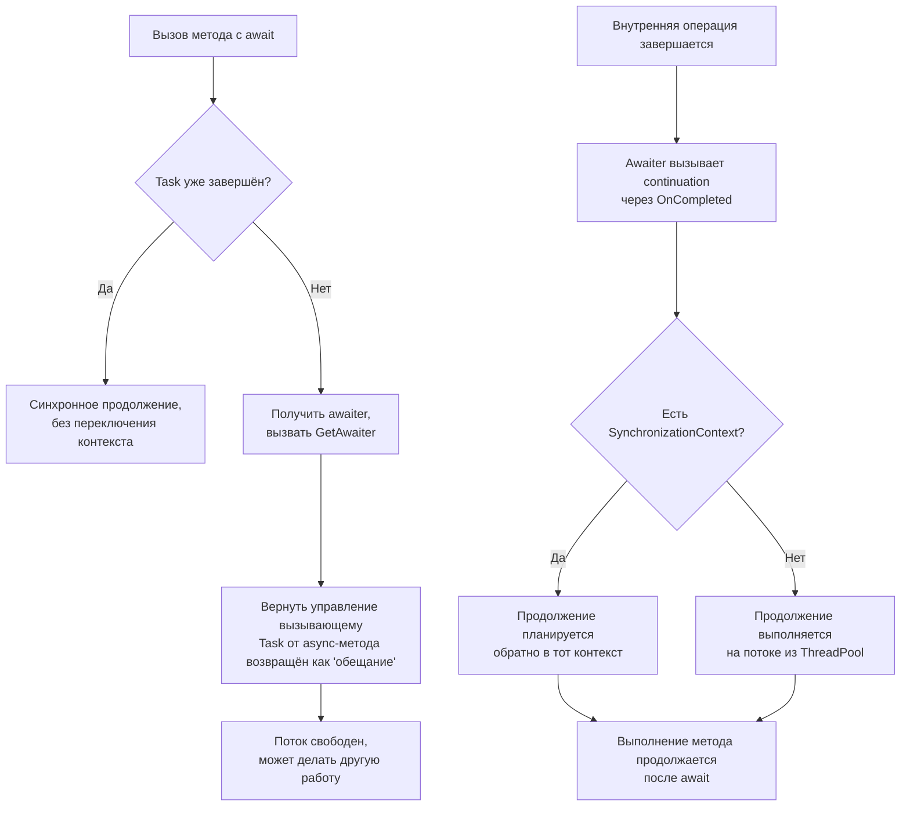
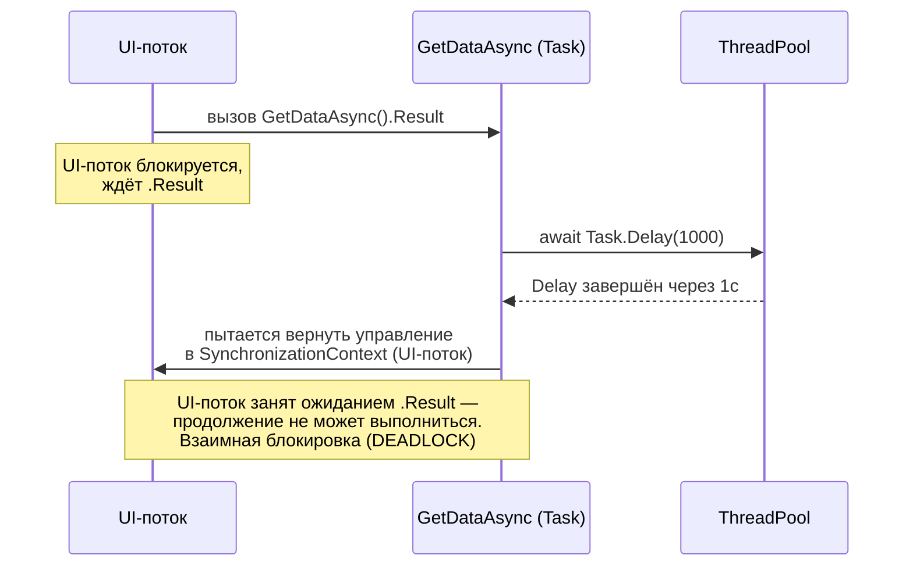
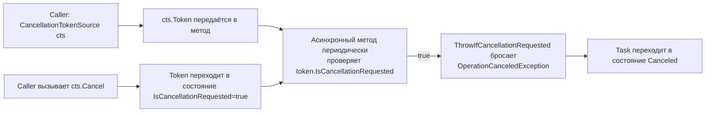
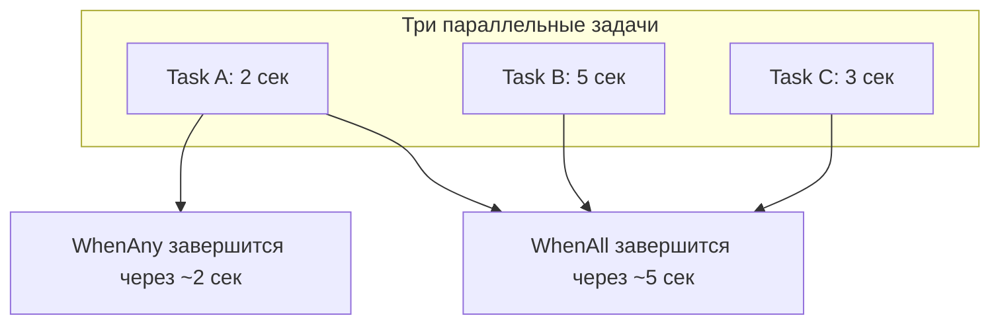
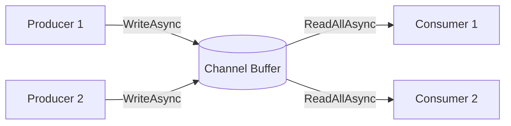
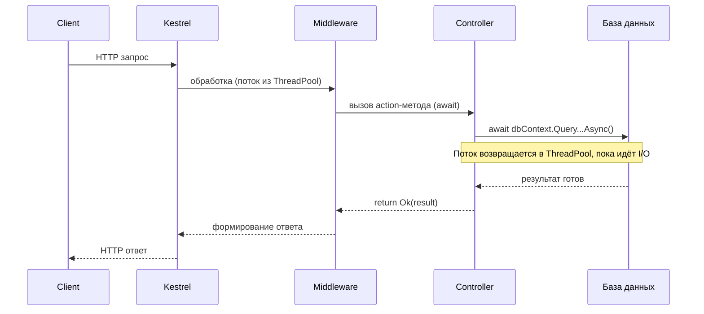

# 120+ вопросов по асинхронному программированию в .NET / C# (Task, async/await)
### Подготовка к собеседованию — уровень intermediate и выше

---

## Раздел 1. Основы Task и TAP (Task-based Asynchronous Pattern)

**1. Чем `Task` отличается от потока (`Thread`)?**
`Thread` — это реальный поток ОС, дорогой ресурс (стек ~1 МБ, переключение контекста). `Task` — это абстракция единицы асинхронной работы поверх `ThreadPool` (или вообще без потока, если это I/O-bound операция). Один `Task` не обязательно означает один поток: во время `await` на I/O-операции поток вообще не занят.

**2. Что такое TAP (Task-based Asynchronous Pattern)?**
Соглашение, по которому асинхронный метод возвращает `Task`/`Task<T>`, имеет суффикс `Async` в имени, принимает опционально `CancellationToken` последним параметром и не бросает исключения синхронно (исключения оборачиваются в `Task`).

**3. В чём разница между `Task` и `Task<T>`?**
`Task` представляет асинхронную операцию без результата (аналог `void`), `Task<T>` — операцию, возвращающую значение типа `T` через свойство `Result`.

**4. Что делает `Task.Run`?**
Ставит делегат в очередь `ThreadPool` для выполнения на фоновом потоке и возвращает `Task`, представляющий эту работу. Используется для CPU-bound операций, которые нужно вынести с UI/основного потока.

**5. Когда НЕ стоит использовать `Task.Run`?**
Для I/O-bound операций (запросы к БД, HTTP, файлы) — там нет смысла занимать поток из пула, если библиотека уже поддерживает `async` I/O нативно (через `await` без потока). `Task.Run` для I/O — это антипаттерн "fake asynchrony".

**6. Что произойдёт, если обратиться к `.Result` или `.Wait()` у `Task`?**
Поток блокируется синхронно до завершения задачи. Это "sync-over-async" — антипаттерн, может привести к deadlock (см. раздел про `SynchronizationContext`) и снижает пропускную способность приложения.

**7. Чем `Task.Delay` отличается от `Thread.Sleep`?**
`Thread.Sleep` блокирует текущий поток на заданное время. `Task.Delay` не занимает поток вообще — планирует продолжение через таймер, поток возвращается в пул и может обслуживать другую работу.

**8. Какие состояния может иметь `Task`?**
`Created`, `WaitingForActivation`, `WaitingToRun`, `Running`, `WaitingForChildrenToComplete`, `RanToCompletion`, `Canceled`, `Faulted`. Проверяются через `IsCompleted`, `IsCompletedSuccessfully`, `IsFaulted`, `IsCanceled`.

**9. Что такое "hot" и "cold" Task?**
"Hot" task уже запущен (например, созданный через `Task.Run` или возвращённый из `async`-метода). "Cold" task создан через конструктор `new Task(...)` и требует явного вызова `.Start()`. На практике почти всегда работают с "hot"-задачами.

**10. Что такое `TaskCompletionSource<T>`?**
Класс для ручного создания `Task`, результат которого управляется вручную (`SetResult`, `SetException`, `SetCanceled`), а не выполнением делегата. Используется для оборачивания callback-based API (например, событий) в `Task`-based API.

```csharp
public Task<int> ReadAsync()
{
    var tcs = new TaskCompletionSource<int>();
    legacyApi.OnDataReady += data => tcs.SetResult(data);
    legacyApi.OnError += ex => tcs.SetException(ex);
    return tcs.Task;
}
```

---

## Раздел 2. Механика async/await

**11. Что реально делает компилятор с методом, помеченным `async`?**
Компилятор генерирует конечный автомат (state machine) — структуру (или класс), реализующую `IAsyncStateMachine`. Метод разбивается на части по точкам `await`, каждая точка сохраняет состояние (локальные переменные, текущий "шаг") и подписывается на продолжение через `awaiter.OnCompleted`.

**12. Диаграмма: что происходит при вызове `await someTask`?**



**13. Что возвращает `async void` метод и почему это плохо?**
`async void` не возвращает `Task`, поэтому вызывающий код не может ни дождаться завершения, ни поймать исключение через `try/catch` вокруг вызова — необработанное исключение уйдёт в `SynchronizationContext` (или в UI-обработчик необработанных исключений) и может уронить процесс. Единственное легитимное применение — обработчики событий (`private async void Button_Click(...)`).

**14. Чем отличаются `async Task` и `async Task<T>` методы от `async void`?**
Они возвращают объект `Task`/`Task<T>`, который можно ожидать (`await`), к которому можно прикрепить обработку исключений, отмену, продолжения. Это "правильная" асинхронность.

**15. Что такое `awaiter` и метод `GetAwaiter()`?**
`await` работает не только с `Task`, а с любым типом, у которого есть метод `GetAwaiter()`, возвращающий объект с `IsCompleted`, `GetResult()` и реализующий `INotifyCompletion`/`ICriticalNotifyCompletion`. Именно поэтому можно писать `await` для `ValueTask`, `Task`, кастомных awaitable-типов и даже `YieldAwaitable` (`Task.Yield()`).

**16. Что делает `Task.Yield()`?**
Немедленно возвращает управление в пул потоков/контекст синхронизации, ставя продолжение метода в конец очереди — используется, чтобы "разбить" длинную синхронную CPU-работу и не блокировать UI/контекст надолго.

**17. Что произойдёт при `await` таска, который уже выброшен с исключением?**
Исключение будет повторно выброшено (re-thrown) в точке `await` с сохранением исходного стека вызовов (в отличие от `.Result`, который оборачивает его в `AggregateException`).

**18. Почему `await task.Result` и `await task` ведут себя по-разному при исключении?**
`.Result`/`.Wait()` оборачивают любое исключение в `AggregateException` (может содержать несколько исключений от нескольких дочерних задач). `await` разворачивает `AggregateException` и выбрасывает первое внутреннее исключение напрямую, сохраняя `StackTrace` благодаря `ExceptionDispatchInfo`.

**19. Как выполняется несколько `await` подряд — последовательно или параллельно?**
```csharp
var a = await GetAAsync();
var b = await GetBAsync();
```
Последовательно: `GetBAsync` не начнёт выполняться, пока не завершится `GetAAsync`, потому что вызов метода и его выполнение до первого внутреннего `await` происходит только в момент вызова.

**20. Как запустить несколько операций параллельно с `await`?**
Сначала запустить обе задачи (не дожидаясь), затем ожидать обе:
```csharp
var taskA = GetAAsync();
var taskB = GetBAsync();
await Task.WhenAll(taskA, taskB);
```

**21. Что такое "точка возобновления" (continuation) и на каком потоке она выполняется?**
Это код после `await`. Поток выполнения зависит от `SynchronizationContext`/`TaskScheduler`, который был активен в момент `await`: если контекст присутствует (UI, ASP.NET classic) — продолжение планируется обратно в него; если нет (консоль, ASP.NET Core, `ConfigureAwait(false)`) — продолжение выполняется на произвольном потоке `ThreadPool`.

**22. Может ли `async` метод быть без `await` внутри? Что тогда произойдёт?**
Да, скомпилируется с предупреждением CS4014-подобным (точнее CS1998), метод будет выполняться полностью синхронно, и вернётся уже завершённый `Task`.

**23. Что делает ключевое слово `await` с точки зрения производительности при уже завершённой задаче?**
Если задача уже завершена (`IsCompleted == true`) на момент `await`, продолжение выполняется синхронно в том же потоке без выделения состояния и без переключения контекста — оптимизация "synchronous completion path".

**24. В чём разница между `Task.FromResult`, `Task.CompletedTask` и `Task.FromException`?**
Все три создают уже завершённый `Task` без реального асинхронного ожидания: `Task.FromResult(T)` — успешно завершённый с результатом; `Task.CompletedTask` — успешно завершённый `Task` без результата; `Task.FromException` — сразу помечен как `Faulted` с заданным исключением. Полезны для синхронных путей в асинхронных интерфейсах (кэш-хиты и т.п.).

**25. Что такое `ConfiguredTaskAwaitable` и когда он появляется?**
Возвращается вызовом `.ConfigureAwait(bool)` у `Task`. Это обёртка, которая говорит await-инфраструктуре, нужно ли восстанавливать исходный `SynchronizationContext` при продолжении.

---

## Раздел 3. Обработка исключений в асинхронном коде

**26. Как поймать исключение из `async` метода?**
Обычным `try/catch` вокруг `await`:
```csharp
try
{
    await DoWorkAsync();
}
catch (InvalidOperationException ex)
{
    // обработка
}
```
Работает благодаря разворачиванию `AggregateException` в точке `await`.

**27. Что произойдёт, если не обработать исключение в `Task`, к которому никогда не применили `await`/`.Result`?**
До .NET 4.5 необработанные исключения в "забытых" задачах приводили к падению процесса при сборке мусора (через `UnobservedTaskException`, если не подписаться). Начиная с .NET 4.5, по умолчанию процесс не падает — событие `TaskScheduler.UnobservedTaskException` можно подписать для логирования, но поведение зависит от конфигурации (`ThrowUnobservedTaskExceptions`).

**28. Как объединить исключения из нескольких задач в `Task.WhenAll`?**
`Task.WhenAll` при завершении с ошибками бросает только первое исключение при `await`, но все собранные исключения доступны через `Task.Exception` (это `AggregateException` со всеми `InnerExceptions`):
```csharp
var t = Task.WhenAll(task1, task2, task3);
try { await t; }
catch { foreach (var e in t.Exception.InnerExceptions) Log(e); }
```

**29. Как выбросить исключение с сохранением исходного стека вызовов вручную?**
Через `ExceptionDispatchInfo.Capture(ex).Throw()` — сохраняет полный `StackTrace` при повторном выбросе, в отличие от простого `throw ex;`.

**30. Что произойдёт при исключении внутри `catch`-блока, содержащего `await`?**
С C# 6+ это разрешено (до этого `await` в `catch`/`finally` был запрещён) — исключение из `await`-выражения внутри `catch` заменит текущее обрабатываемое исключение обычным образом.

**31. Как правильно логировать исключения при "fire-and-forget" вызове задачи?**
Обернуть вызов в обработку самостоятельно, не полагаясь на `UnobservedTaskException`:
```csharp
_ = SafeFireAndForget(DoWorkAsync());

static async Task SafeFireAndForget(Task task)
{
    try { await task; }
    catch (Exception ex) { Log(ex); }
}
```

**32. Чем `Task.Exception` отличается от исключения, полученного через `await`?**
`Task.Exception` всегда возвращает `AggregateException` (или `null`, если задача не в состоянии Faulted). `await` разворачивает и бросает первое внутреннее исключение напрямую.

**33. Что произойдёт, если в `finally` есть `await`, а перед этим исключение уже выброшено?**
`await` внутри `finally` выполнится как обычно (дождётся завершения), после чего оригинальное исключение продолжит распространяться дальше, если не было поймано.

**34. Как обработать `OperationCanceledException` отдельно от прочих исключений?**
```csharp
try { await DoWorkAsync(token); }
catch (OperationCanceledException) when (token.IsCancellationRequested)
{
    // штатная отмена
}
catch (Exception ex)
{
    // реальная ошибка
}
```

**35. Почему `catch (Exception)` без `when` может случайно "проглотить" отмену как ошибку?**
Потому что `OperationCanceledException`/`TaskCanceledException` — это тоже `Exception`, и если ловить всё подряд без различения, штатная отмена операции будет залогирована/обработана как ошибка, что затрудняет диагностику.

---

## Раздел 4. Deadlock, SynchronizationContext, ConfigureAwait

**36. Что такое `SynchronizationContext`?**
Абстракция, представляющая "среду выполнения" (например, UI-поток WPF/WinForms с сообщением-циклом, или ASP.NET classic request context), которая позволяет запланировать выполнение делегата обратно в этот контекст через `Post`.

**37. Классический пример deadlock от смешивания sync и async:**
```csharp
// UI поток (WPF/WinForms) или ASP.NET classic (не Core!)
public void Button_Click(object sender, EventArgs e)
{
    var result = GetDataAsync().Result; // DEADLOCK
}

public async Task<string> GetDataAsync()
{
    await Task.Delay(1000); // без ConfigureAwait(false)
    return "data";
}
```

**38. Диаграмма deadlock:**



**39. Почему объяснённый deadlock НЕ возникает в ASP.NET Core?**
В ASP.NET Core (в отличие от classic ASP.NET) нет `SynchronizationContext` по умолчанию — продолжения планируются просто в `ThreadPool`, поэтому нет единственного потока, за который все "борются".

**40. Что делает `.ConfigureAwait(false)`?**
Говорит await-инфраструктуре не восстанавливать исходный `SynchronizationContext`/`TaskScheduler` для продолжения после `await` — продолжение выполнится на любом доступном потоке пула. Убирает необходимость "возврата" в исходный контекст.

**41. Помогает ли `ConfigureAwait(false)` полностью избежать deadlock в примере выше?**
Да, если `ConfigureAwait(false)` стоит **у всех** `await` в цепочке вызовов внутри `GetDataAsync` — тогда продолжение не пытается вернуться в UI-поток и `.Result` в UI не блокирует его навечно. Но правильнее не блокировать вообще (`await` вместо `.Result`).

**42. Где `ConfigureAwait(false)` обычно не нужен?**
В ASP.NET Core (нет `SynchronizationContext`), в консольных приложениях без своего контекста, в конце цепочки вызовов (top-level `async Task Main`) — а также начиная с .NET Core эту практику многие библиотеки упростили. Тем не менее для библиотечного кода общего назначения (NuGet-пакеты) рекомендация — использовать `ConfigureAwait(false)` везде, где нет нужды в UI-контексте.

**43. Что произойдёт, если использовать `ConfigureAwait(false)` в WPF-коде, где после `await` нужно обновить UI-элемент?**
Будет исключение о доступе к UI-элементу из чужого потока (`InvalidOperationException: The calling thread cannot access this object`), потому что продолжение выполнится не на UI-потоке.

**44. Что такое `ExecutionContext` и чем он отличается от `SynchronizationContext`?**
`ExecutionContext` переносит "окружение" выполнения — `CallContext`/`AsyncLocal<T>`, культуру потока, контекст безопасности — через асинхронные границы независимо от того, есть ли `SynchronizationContext`. `SynchronizationContext` отвечает конкретно за то, "куда" планировать продолжение (какой поток/очередь).

**45. Как избежать deadlock, не трогая библиотечный код?**
Использовать `await` вместо `.Result`/`.Wait()` "сверху донизу" (async all the way), либо, если совсем нельзя переписать вызывающий код, выполнить блокирующий вызов на отдельном потоке через `Task.Run(() => GetDataAsync().Result)` — это освобождает исходный поток от необходимости продолжения в том же контексте.

---

## Раздел 5. Отмена операций (CancellationToken)

**46. Как устроена модель отмены в .NET?**
Кооперативная модель: `CancellationTokenSource` создаёт токен, отмена инициируется через `.Cancel()`, а сам асинхронный код должен добровольно проверять `token.IsCancellationRequested` или вызывать `token.ThrowIfCancellationRequested()` в подходящих точках.

**47. Пример правильного использования токена отмены:**
```csharp
public async Task ProcessAsync(CancellationToken token)
{
    for (int i = 0; i < 1000; i++)
    {
        token.ThrowIfCancellationRequested();
        await StepAsync(i, token);
    }
}
```

**48. Диаграмма кооперативной отмены:**



**49. В чём разница между `CancellationToken.None` и `default(CancellationToken)`?**
Никакой — `CancellationToken.None` фактически равно `default`, оба представляют токен, который никогда не будет отменён (`CanBeCanceled == false`).

**50. Как задать таймаут отмены?**
```csharp
using var cts = new CancellationTokenSource(TimeSpan.FromSeconds(5));
await DoWorkAsync(cts.Token);
```
Либо `cts.CancelAfter(TimeSpan)` для существующего источника.

**51. Как объединить несколько токенов отмены (например, таймаут + внешний токен)?**
```csharp
using var linked = CancellationTokenSource.CreateLinkedTokenSource(externalToken, timeoutCts.Token);
await DoWorkAsync(linked.Token);
```
Отмена сработает, если сработает любой из связанных токенов.

**52. Что делает `CancellationToken.Register(...)`?**
Регистрирует callback, который выполнится в момент отмены токена — полезно для оборачивания API, не поддерживающих токены напрямую (например, освобождение ресурсов, отписка от событий).

**53. В чём разница между `TaskCanceledException` и `OperationCanceledException`?**
`TaskCanceledException` — наследник `OperationCanceledException`, специфичный для `Task`. В `catch` обычно достаточно ловить базовый тип `OperationCanceledException`, чтобы охватить оба случая единым обработчиком.

**54. Что произойдёт с `Task`, если внутри метода просто выбросить `OperationCanceledException` без использования `CancellationToken`?**
Задача перейдёт в состояние `Faulted`, а не `Canceled` — состояние `Canceled` присваивается автоматически рантаймом только тогда, когда исключение связано с токеном, который реально был отменён (`token.IsCancellationRequested == true` в момент выброса, и это тот же токен, что был передан методу через инфраструктуру `async`).

**55. Как проверить, что задача была отменена именно нужным токеном?**
```csharp
catch (OperationCanceledException ex) when (ex.CancellationToken == myToken)
{
    // отмена именно этим токеном
}
```

**56. Как реализовать периодическую проверку отмены в CPU-bound цикле без async?**
```csharp
void HeavyLoop(CancellationToken token)
{
    for (int i = 0; i < N; i++)
    {
        token.ThrowIfCancellationRequested();
        DoWork(i);
    }
}
```
Проверку стоит делать не на каждой итерации в супер-горячем цикле, а раз в N итераций, чтобы не тратить лишний такт на проверку атомарного флага миллионы раз.

**57. Можно ли отменить уже запущенный `Task.Run`, если делегат не проверяет токен?**
Нет — если делегат не проверяет `IsCancellationRequested`/не пробрасывает токен дальше, отмена не остановит уже выполняющийся код. Однако если передать токен вторым параметром в `Task.Run(action, token)`, задача не начнёт выполняться вовсе, если отмена произошла ДО старта (переходит в `Canceled` без выполнения делегата).

---

## Раздел 6. Композиция задач: WhenAll, WhenAny, ContinueWith

**58. Что делает `Task.WhenAll`?**
Возвращает `Task` (или `Task<T[]>`), который завершается, когда завершились ВСЕ переданные задачи. Если несколько из них упали с ошибкой, при `await` будет выброшено первое исключение, но все они доступны через `.Exception`.

**59. Что делает `Task.WhenAny`?**
Возвращает `Task<Task>`, который завершается, как только завершилась ЛЮБАЯ из переданных задач (успешно, с ошибкой или отменой) — остальные продолжают выполняться в фоне, если их явно не отменить.

**60. Диаграмма WhenAll vs WhenAny:**



**61. Типичный паттерн реализации таймаута через `WhenAny`:**
```csharp
var workTask = DoWorkAsync();
var completed = await Task.WhenAny(workTask, Task.Delay(5000));
if (completed != workTask)
    throw new TimeoutException();
var result = await workTask;
```
(Более современный вариант — `CancellationTokenSource(TimeSpan)` + передача токена внутрь работы.)

**62. Чем `ContinueWith` отличается от `await`?**
`ContinueWith` — низкоуровневый API TPL для явного прикрепления продолжения к задаче, требует ручного управления `TaskScheduler`, обработкой исключений и `TaskContinuationOptions`. `await` — синтаксический сахар, который делает то же самое проще, безопаснее и с лучшей читаемостью. В современном коде `ContinueWith` практически не используется напрямую.

**63. Какие подводные камни есть у `ContinueWith`, если не указать `TaskScheduler` явно?**
По умолчанию используется `TaskScheduler.Current`, что в контексте UI может привести к неожиданному выполнению продолжения на UI-потоке. Рекомендуется явно указывать `TaskScheduler.Default` для фонового выполнения.

**64. Как обработать частичное завершение группы задач (получить результаты по мере готовности)?**
```csharp
var tasks = urls.Select(DownloadAsync).ToList();
while (tasks.Count > 0)
{
    var finished = await Task.WhenAny(tasks);
    tasks.Remove(finished);
    var result = await finished;
    Process(result);
}
```

**65. Что делает `Task.WaitAll` и чем отличается от `Task.WhenAll`?**
`Task.WaitAll` — синхронный блокирующий вызов, блокирует текущий поток. `Task.WhenAll` — асинхронный, возвращает `Task`, который можно `await`-ить без блокировки потока.

**66. Как задать ограничение параллелизма при обработке большого списка задач ("throttling")?**
```csharp
var semaphore = new SemaphoreSlim(maxDegreeOfParallelism);
var tasks = items.Select(async item =>
{
    await semaphore.WaitAsync();
    try { return await ProcessAsync(item); }
    finally { semaphore.Release(); }
});
var results = await Task.WhenAll(tasks);
```
Альтернатива в .NET 6+ — `Parallel.ForEachAsync` с `ParallelOptions.MaxDegreeOfParallelism`.

**67. Пример `Parallel.ForEachAsync` (.NET 6+):**
```csharp
await Parallel.ForEachAsync(items,
    new ParallelOptions { MaxDegreeOfParallelism = 4, CancellationToken = token },
    async (item, ct) => await ProcessAsync(item, ct));
```

---

## Раздел 7. Параллельное программирование: Parallel, PLINQ, Dataflow

**68. Чем `Parallel.For`/`Parallel.ForEach` отличаются от `Task.WhenAll` с массивом задач?**
`Parallel.*` предназначены для CPU-bound синхронной параллельной работы через `Partitioner`, без создания отдельного `Task` на каждую итерацию. `Task.WhenAll` — про асинхронную (обычно I/O-bound) параллельность через отдельные `Task` на каждую операцию.

**69. Что такое PLINQ и когда его использовать?**
`.AsParallel()` над LINQ-запросом распараллеливает обработку коллекции на несколько потоков автоматически. Эффективен для CPU-bound операций над большими in-memory коллекциями; вреден для маленьких коллекций или I/O-bound операций из-за накладных расходов.

**70. Что такое TPL Dataflow (`System.Threading.Tasks.Dataflow`)?**
Библиотека для построения конвейеров обработки данных из блоков (`BufferBlock`, `TransformBlock`, `ActionBlock`, `BatchBlock`), которые можно связывать (`LinkTo`) и которые сами управляют буферизацией, параллелизмом и backpressure.

**71. В чём разница между `lock` и `SemaphoreSlim.WaitAsync()` в асинхронном коде?**
`lock` (через `Monitor`) — синхронный примитив, нельзя использовать вокруг `await` (ошибка CS1996), так как он привязан к потоку. `SemaphoreSlim.WaitAsync()` — асинхронный, безопасно работает вокруг `await`.

**72. Пример неправильного и правильного взаимного исключения в async-коде:**
```csharp
// НЕПРАВИЛЬНО — не скомпилируется
lock (_lock)
{
    await DoWorkAsync(); // CS1996
}

// ПРАВИЛЬНО
await _semaphore.WaitAsync();
try { await DoWorkAsync(); }
finally { _semaphore.Release(); }
```

**73. Как выглядит producer-consumer через `Channel<T>` (System.Threading.Channels)?**
```csharp
var channel = Channel.CreateUnbounded<int>();

_ = Task.Run(async () =>
{
    for (int i = 0; i < 10; i++)
        await channel.Writer.WriteAsync(i);
    channel.Writer.Complete();
});

await foreach (var item in channel.Reader.ReadAllAsync())
    Console.WriteLine(item);
```

**74. Диаграмма Channel<T> producer/consumer:**



**75. Что такое `Interlocked` и когда он предпочтительнее `lock`?**
`Interlocked.Increment/CompareExchange/Add` выполняют атомарные операции над примитивными типами без блокировки потока на уровне ОС — быстрее `lock` для простых счётчиков и флагов.

---

## Раздел 8. Частые ошибки, антипаттерны и производительность

**76. Что такое "sync-over-async" и почему это плохо?**
Вызов `.Result`/`.Wait()`/`.GetAwaiter().GetResult()` у асинхронного метода из синхронного кода. Блокирует поток впустую, может вызвать deadlock, истощает пул потоков.

**77. Что такое "async-over-sync" и почему это тоже плохо?**
Обёртка синхронного блокирующего кода в `Task.Run(() => SyncMethod())` там, где ожидался нативный асинхронный I/O — просто перекладывает блокировку на другой поток пула.

**78. Что такое "thread pool starvation" и как оно возникает?**
Ситуация, когда все потоки пула заняты блокирующим ожиданием, из-за чего новым задачам не хватает потоков, а `ThreadPool` добавляет новые потоки медленно (hill-climbing алгоритм).

**79. Как избежать thread pool starvation в высоконагруженном ASP.NET Core сервисе?**
Async all the way, не блокировать `.Result`/`.Wait()`, использовать нативные async-версии клиентов БД/HTTP; ручная настройка `ThreadPool.SetMinThreads` — лишь временная мера.

**80. Что такое `ValueTask<T>` и зачем он нужен?**
Value type — альтернатива `Task<T>` для горячего пути, когда результат часто доступен синхронно (кэш), позволяет избежать аллокации `Task` в куче.

**81. Какие ограничения у `ValueTask`, которых нет у `Task`?**
Нельзя await-ить дважды или одновременно из нескольких мест. Для многократного использования результата нужно преобразовать в `Task` через `.AsTask()`.

**82. Когда НЕ стоит использовать `ValueTask`?**
Если метод почти всегда выполняется асинхронно, либо результат нужно ожидать несколько раз — тогда `Task` безопаснее.

**83. Что произойдёт при вызове async-метода без await внутри вызывающего кода?**
"Fire-and-forget" — предупреждение CS4014, исключения из задачи теряются, метод продолжает выполнение не дожидаясь.

**84. Как правильно обозначить намеренный fire-and-forget вызов?**
```csharp
_ = FireAndForgetAsync();
```
Лучше — обернуть в безопасную обёртку с try/catch логированием.

**85. Почему `async` методы не должны принимать `out`/`ref` параметры?**
Стек метода приостанавливается на `await`, и адрес локальной/ссылочной переменной вызывающего кода может стать невалидным к моменту завершения операции.

**86. Как избежать избыточных аллокаций state machine для "горячих" async-методов?**
Использовать `ValueTask` для синхронного завершения, избегать лишних `async`/`await` там, где можно вернуть `Task` напрямую, минимизировать замыкания в async-лямбдах.

**87. Когда можно убрать `async`/`await` и просто вернуть `Task` напрямую?**
```csharp
// Избыточно
public async Task<int> GetValueAsync() => await InnerAsync();
// Эффективнее
public Task<int> GetValueAsync() => InnerAsync();
```
Компромисс: синхронно выброшенные исключения из `InnerAsync()` попадут в вызывающий код немедленно, а не через `Task` — это нужно учитывать.

**88. Что такое "captured context" и как оно влияет на память в долгоживущих операциях?**
Каждый `await` без `ConfigureAwait(false)` захватывает `SynchronizationContext`/`ExecutionContext` — накладные расходы на каждое продолжение, значимые в горячих путях библиотек.

**89. Как замерить количество потоков ThreadPool, занятых блокирующими операциями?**
Через `ThreadPool.GetAvailableThreads`, счётчики `.NET ThreadPool Queue Length` и `dotnet-counters`/`dotnet-trace` в проде.

**90. Какие проблемы возникают при рекурсивных `async` методах без ограничения глубины?**
Каждый уровень создаёт новый state machine и продолжение — рост потребления памяти и, в редких случаях, переполнение стека при синхронном завершении цепочки.

---

## Раздел 9. IAsyncEnumerable и асинхронные потоки данных (C# 8+)

**91. Что такое `IAsyncEnumerable<T>` и когда он появился?**
Интерфейс (C# 8 / .NET Core 3.0) для асинхронного перечисления последовательности, где каждый элемент может требовать асинхронного ожидания — используется через `await foreach`.

**92. Пример реализации async-стрима:**
```csharp
public async IAsyncEnumerable<int> GenerateAsync(
    [EnumeratorCancellation] CancellationToken token = default)
{
    for (int i = 0; i < 10; i++)
    {
        token.ThrowIfCancellationRequested();
        await Task.Delay(100, token);
        yield return i;
    }
}

await foreach (var item in GenerateAsync(token))
{
    Console.WriteLine(item);
}
```

**93. Зачем нужен атрибут `[EnumeratorCancellation]`?**
Позволяет прокинуть токен из `WithCancellation(token)` внутрь метода-генератора — без него токен не долетит до тела итератора.

**94. Чем `IAsyncEnumerable<T>` отличается от `Task<IEnumerable<T>>`?**
`Task<IEnumerable<T>>` требует, чтобы вся коллекция была готова целиком. `IAsyncEnumerable<T>` отдаёт элементы по одному по мере готовности — экономит память и уменьшает задержку до первого элемента.

**95. Как отменить `await foreach` посреди перечисления?**
```csharp
await foreach (var item in GenerateAsync().WithCancellation(token))
{
    // ...
}
```

---

## Раздел 10. Синхронизация и потокобезопасность в асинхронном коде

**96. Почему `static` переменные особенно опасны в асинхронном многопоточном коде?**
Асинхронный код может выполняться на разных потоках пула в разное время — обращение к общему изменяемому `static`-состоянию без синхронизации приводит к race condition.

**97. Что такое `AsyncLocal<T>` и чем отличается от `ThreadStatic`?**
`ThreadStatic` привязан к конкретному потоку ОС — ломается в async-коде. `AsyncLocal<T>` следует за логическим потоком выполнения через `await`, независимо от физического потока — например, для correlation id.

**98. Потокобезопасны ли коллекции `ConcurrentDictionary`, `ConcurrentQueue` в асинхронном коде?**
Да, они спроектированы для конкурентного доступа без внешней блокировки.

**99. Как безопасно инициализировать дорогой ресурс один раз в конкурентной среде асинхронно?**
```csharp
private static readonly Lazy<Task<Connection>> _connection =
    new(() => CreateConnectionAsync(), LazyThreadSafetyMode.ExecutionAndPublication);

var conn = await _connection.Value;
```

**100. Что произойдёт, если использовать обычный (не async) `Lazy<T>` с блокирующим вызовом `.Result` внутри фабрики?**
Те же проблемы sync-over-async — предпочтительнее `Lazy<Task<T>>`.

---

## Раздел 11. ASP.NET Core и асинхронность

**101. Почему в ASP.NET Core рекомендуется писать полностью асинхронные контроллеры/действия?**
Во время `await` I/O-операции поток обработки запроса возвращается в пул и может обслуживать другие запросы — критично для масштабируемости под нагрузкой.

**102. Есть ли `SynchronizationContext` в ASP.NET Core?**
Нет — начиная с ASP.NET Core, контекста для запросов нет, поэтому классический UI-подобный deadlock менее вероятен, но thread pool starvation остаётся актуальной проблемой.

**103. Как правильно передавать `CancellationToken` запроса клиента в контроллере?**
```csharp
[HttpGet]
public async Task<IActionResult> Get(CancellationToken cancellationToken)
{
    var data = await _service.GetDataAsync(cancellationToken);
    return Ok(data);
}
```
Фреймворк автоматически привяжет его к `HttpContext.RequestAborted`.

**104. Что произойдёт с `DbContext` EF Core при параллельных `await` вызовах на одном экземпляре?**
`InvalidOperationException` — `DbContext` не потокобезопасен. Каждая параллельная ветка должна использовать свой экземпляр (через `IDbContextFactory`).

**105. Как правильно комбинировать несколько независимых запросов к БД параллельно?**
Через отдельные `DbContext`-инстансы для каждой параллельной ветки.

**106. Что такое `BackgroundService` и как в нём правильно обрабатывать отмену?**
```csharp
public class Worker : BackgroundService
{
    protected override async Task ExecuteAsync(CancellationToken stoppingToken)
    {
        while (!stoppingToken.IsCancellationRequested)
        {
            await DoWorkAsync(stoppingToken);
            await Task.Delay(TimeSpan.FromSeconds(5), stoppingToken);
        }
    }
}
```

---

## Раздел 12. Тестирование асинхронного кода

**107. Почему тестовые методы должны быть `async Task`, а не `async void`?**
Test runner умеет ожидать `Task` и ловить исключения из него; `async void` не даёт такой возможности — тест может "пройти" зелёным при упавшей асинхронной части.

**108. Как протестировать отмену через `CancellationToken`?**
```csharp
[Fact]
public async Task Should_Cancel_Operation()
{
    using var cts = new CancellationTokenSource();
    cts.Cancel();
    await Assert.ThrowsAsync<OperationCanceledException>(
        () => _service.DoWorkAsync(cts.Token));
}
```

**109. Как замокать async-метод зависимости через Moq?**
```csharp
mockRepo.Setup(r => r.GetByIdAsync(It.IsAny<int>()))
        .ReturnsAsync(new Entity { Id = 1 });
```

**110. Как проверить, что задачи выполняются параллельно, а не последовательно?**
Замерить общее время выполнения и убедиться, что оно близко к самой долгой задаче, а не к сумме всех, либо использовать управляемые `TaskCompletionSource` для детерминированного контроля порядка.

---

## Раздел 13. Продвинутые темы

**111. Что такое `IValueTaskSource<T>` и зачем он нужен?**
Низкоуровневый интерфейс для реализации `ValueTask<T>` с полным контролем над пулингом состояния — используется в высокопроизводительных библиотеках (Kestrel, `System.IO.Pipelines`) для исключения аллокаций.

**112. Что такое `TaskScheduler` и зачем можно писать свой?**
Абстракция, определяющая, как и где выполняются задачи. Кастомный планировщик пишут для гарантии выполнения строго в один поток или ограничения параллелизма на уровне планировщика.

**113. В чём разница между `Task.Factory.StartNew` и `Task.Run`?**
`Task.Run` — упрощённый вызов `StartNew` с безопасными параметрами по умолчанию и авто-unwrap вложенных задач; `StartNew` требует ручного управления планировщиком и `Unwrap()`.

**114. Что такое `Unwrap()` у `Task<Task<T>>`?**
Преобразует "задачу задачи" в плоский `Task<T>`, завершающийся только после завершения внутренней задачи.

**115. Как реализовать retry с экспоненциальной задержкой вручную?**
```csharp
async Task<T> RetryAsync<T>(Func<Task<T>> action, int maxAttempts = 3)
{
    for (int attempt = 1; ; attempt++)
    {
        try { return await action(); }
        catch (Exception) when (attempt < maxAttempts)
        {
            await Task.Delay(TimeSpan.FromSeconds(Math.Pow(2, attempt)));
        }
    }
}
```
В продакшене чаще используют Polly с той же идеей плюс circuit breaker и jitter.

**116. Что такое "структурированная конкурентность" и есть ли она в .NET?**
Концепция, при которой время жизни дочерних асинхронных операций ограничено временем жизни родительской. В .NET нет отдельной встроенной конструкции, но приближённо достигается через `CancellationTokenSource` + `Task.WhenAll` + `using`.

**117. Как работает `await using` (C# 8+)?**
Для типов с `IAsyncDisposable` гарантирует асинхронный вызов `DisposeAsync()` при выходе из блока, не блокируя поток на синхронном `Dispose()`.
```csharp
await using var connection = await CreateConnectionAsync();
```

**118. Нужен ли `ConfigureAwait(false)` после `Task.Run(...)` в библиотеке?**
Да — сам делегат `Task.Run` уже выполняется без контекста, но продолжение ПОСЛЕ `await Task.Run(...)` всё равно попытается вернуться в исходный контекст, если не указано `ConfigureAwait(false)`.

**119. Схема жизненного цикла асинхронного HTTP-запроса в ASP.NET Core:**



**120. Итоговый чек-лист "золотых правил" асинхронного кода на собеседовании:**
1. Async all the way — не смешивать `.Result`/`.Wait()` с `await` в одной цепочке.
2. `ConfigureAwait(false)` в библиотечном коде без нужды в UI/HttpContext.
3. Никогда `async void`, кроме обработчиков событий UI.
4. Всегда прокидывать и проверять `CancellationToken`.
5. `Task.Run` — только для CPU-bound, не для I/O-bound.
6. Один `DbContext` — не для параллельного использования.
7. `lock` нельзя оборачивать вокруг `await` — использовать `SemaphoreSlim.WaitAsync`.
8. Ловить `OperationCanceledException` отдельно от прочих ошибок.
9. Не игнорировать возвращённый `Task` без логирования исключений.
10. `ValueTask` — только для действительно горячих путей с частым синхронным завершением.

---

### Как пользоваться этим материалом
Порядок подготовки: разделы 1–4 (must-know база, deadlock — самый частый практический вопрос), затем 5–8 (типичные ловушки и best practices для middle/senior), затем 9–13 (продвинутые темы для senior/lead и системного дизайна под нагрузкой).
