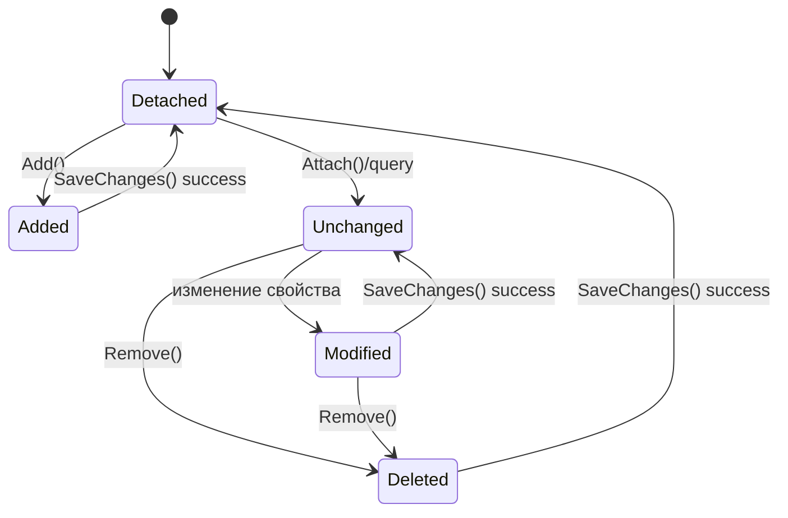
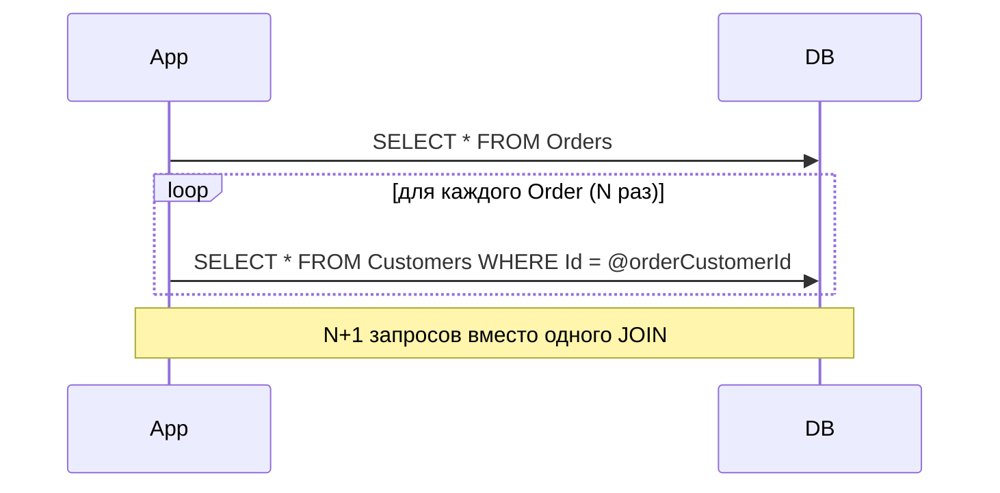
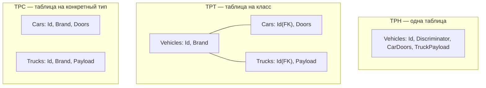

\
# Entity Framework Core — вопросы для собеседования (Intermediate → Advanced)

> 160 вопросов, сгруппированных по темам, с детальными ответами, примерами кода и диаграммами.
> Актуально для EF Core 6/7/8/9. Там, где поведение отличается между версиями, это указано отдельно.

---

## Содержание

1. [Архитектура и основы EF Core](#1-архитектура-и-основы-ef-core)
2. [DbContext и его жизненный цикл](#2-dbcontext-и-его-жизненный-цикл)
3. [Change Tracking и состояния сущностей](#3-change-tracking-и-состояния-сущностей)
4. [LINQ-запросы, IQueryable и отложенное выполнение](#4-linq-запросы-iqueryable-и-отложенное-выполнение)
5. [Отношения между сущностями](#5-отношения-между-сущностями)
6. [Стратегии загрузки данных](#6-стратегии-загрузки-данных)
7. [Миграции и управление схемой БД](#7-миграции-и-управление-схемой-бд)
8. [Производительность и оптимизация запросов](#8-производительность-и-оптимизация-запросов)
9. [Конкурентность и транзакции](#9-конкурентность-и-транзакции)
10. [Raw SQL, хранимые процедуры и bulk-операции](#10-raw-sql-хранимые-процедуры-и-bulk-операции)
11. [Value Conversions, Owned Types, Shadow Properties, Backing Fields](#11-value-conversions-owned-types-shadow-properties-backing-fields)
12. [Наследование (TPH / TPT / TPC)](#12-наследование-tph--tpt--tpc)
13. [Query Filters, Interceptors, события SaveChanges](#13-query-filters-interceptors-события-savechanges)
14. [Асинхронное программирование в EF Core](#14-асинхронное-программирование-в-ef-core)
15. [Тестирование кода на EF Core](#15-тестирование-кода-на-ef-core)
16. [Продвинутые темы и best practices](#16-продвинутые-темы-и-best-practices)

---

## 1. Архитектура и основы EF Core

### 1.1. Что такое EF Core и чем он отличается от EF6?
EF Core — это кроссплатформенный, легковесный, расширяемый ORM (Object-Relational Mapper) от Microsoft, полностью переписанный «с нуля» (не является продолжением кодовой базы EF6). Ключевые отличия: работает на .NET Core/.NET 5+ и полном .NET Framework, модульная архитектура на NuGet-пакетах (Sqlite, SqlServer, Npgsql и т.д.), нет EDMX/дизайнера моделей (только Code First / Code-Based Configuration), добавлены Owned Types, Global Query Filters, лучшая поддержка NoSQL-провайдеров (Cosmos DB), компиляция запросов, DbContext pooling. При этом часть возможностей EF6 (например, Lazy Loading без прокси «из коробки», Multiple Result Sets по умолчанию) реализована иначе или требует дополнительных пакетов.

**Ресурс:** https://learn.microsoft.com/en-us/ef/efcore-and-ef6/index

### 1.2. Опишите основной pipeline выполнения LINQ-запроса в EF Core.
1. Разработчик строит `IQueryable<T>` через LINQ-методы (`Where`, `Select`, `Include` и т.д.) — при этом ничего не выполняется, строится дерево выражений (Expression Tree).
2. При материализации (`ToList()`, `foreach`, `First()`, `await ToListAsync()` и т.п.) LINQ-провайдер EF Core транслирует дерево выражений в промежуточное представление на основе реляционной модели.
3. Query Compilation Pipeline проходит через `QueryTranslationPreprocessor` → `QueryableMethodTranslatingExpressionVisitor` → `QuerySqlGenerator`, генерируя SQL-команду, специфичную для провайдера.
4. Команда кэшируется (Query Plan Cache) по «форме» запроса (с параметризацией констант), чтобы избежать повторной компиляции при следующих вызовах с другими значениями параметров.
5. ADO.NET-провайдер выполняет SQL к БД, DbDataReader читает результат.
6. Material­izer собирает объекты из строк результата, ChangeTracker (если запрос не `AsNoTracking`) начинает отслеживать сущности.


**Ресурс:** https://learn.microsoft.com/en-us/ef/core/querying/how-query-execution-works

### 1.3. Что такое DbContext и DbSet?
`DbContext` — это фасад над Unit of Work и Repository паттернами: управляет соединением с БД, кэшем сущностей (change tracker), транзакциями и конфигурацией модели. `DbSet<TEntity>` — коллекция-обёртка, представляющая таблицу (или view/query) в БД для конкретного типа сущности, через которую строятся запросы (`context.Users.Where(...)`) и выполняются операции добавления/удаления (`Add`, `Remove`).

### 1.4. Какие есть способы конфигурации модели в EF Core?
Три подхода, которые можно комбинировать: (1) Data Annotations — атрибуты над свойствами класса (`[Key]`, `[Required]`, `[MaxLength]`); (2) Fluent API — конфигурация в `OnModelCreating` через `modelBuilder.Entity<T>()...`, имеет наивысший приоритет и покрывает больше сценариев (составные ключи, индексы, конверсии значений); (3) `IEntityTypeConfiguration<T>` — вынесение Fluent API конфигурации каждой сущности в отдельный класс для чистоты кода (`modelBuilder.ApplyConfigurationsFromAssembly(...)`).

Приоритет при конфликте: Fluent API > Data Annotations > Conventions.

### 1.5. Что такое Conventions в EF Core и как их переопределить?
Conventions — это набор правил по умолчанию, которые EF Core применяет при построении модели без явной конфигурации (например, свойство `Id` или `<TypeName>Id` становится первичным ключом, строки маппятся в `nvarchar(max)`, навигационные свойства коллекций определяют связь один-ко-многим). Начиная с EF Core 6 можно писать собственные bulk-conventions через `IConventionSetPlugin` или настраивать через `ConfigureConventions` в `DbContext` (например, задать дефолтный тип для `decimal` глобально вместо аннотирования каждого свойства).

```csharp
protected override void ConfigureConventions(ModelConfigurationBuilder builder)
{
    builder.Properties<decimal>().HavePrecision(18, 2);
    builder.Properties<string>().HaveMaxLength(256);
}
```

### 1.6. Какие провайдеры баз данных поддерживает EF Core?
Официальные: SQL Server/Azure SQL, SQLite, Azure Cosmos DB, In-Memory (для тестов, не для продакшена), и через community/партнёров: Npgsql (PostgreSQL), Pomelo (MySQL/MariaDB), Oracle, DB2, Firebird и др. Провайдер задаётся при регистрации контекста: `options.UseSqlServer(connStr)`, `options.UseNpgsql(connStr)`.

### 1.7. Что такое Code First, Database First и Model First? Что актуально в EF Core?
Code First — модель описывается классами C#, схема БД генерируется/синхронизируется миграциями (основной подход в EF Core). Database First — модель генерируется из существующей БД (`dotnet ef dbcontext scaffold`), используется для legacy-баз. Model First (визуальный дизайнер EDMX) в EF Core отсутствует — не поддерживается.

### 1.8. Чем отличается `IQueryable<T>` от `IEnumerable<T>` в контексте EF Core?
`IQueryable<T>` хранит дерево выражений и провайдера запроса; операции LINQ над ним компонуются в SQL и выполняются на сервере БД при материализации. `IEnumerable<T>` работает над уже полученной в память последовательностью — если привести `IQueryable` к `IEnumerable` до вызова `Where`/`Select`, дальнейшая фильтрация выполнится на клиенте (client-side evaluation), что может привести к загрузке всей таблицы в память. Частая ошибка — случайный ранний вызов метода, не транслируемого в SQL (например, кастомный C#-метод), что заставляет EF Core выполнить фильтрацию в памяти или выбросить исключение (в EF Core 3.0+ client evaluation в `Where` запрещена по умолчанию).

### 1.9. Как EF Core транслирует LINQ в SQL — что происходит, если метод нельзя транслировать?
EF Core пытается сопоставить каждый вызов метода/оператора с известным SQL-эквивалентом через `IMethodCallTranslator`. Если трансляция невозможна (например, вызов произвольного C#-метода внутри `Where`), начиная с EF Core 3.0 это приводит к исключению `InvalidOperationException` во время выполнения запроса (а не тихому переключению на client evaluation, как было в EF Core 2.x). Решение — либо переписать выражение так, чтобы оно транслировалось, либо явно материализовать данные (`AsEnumerable()`/`ToList()`) перед применением нетранслируемой логики, отдавая себе отчёт, что это загрузит данные в память.

### 1.10. Что такое DbContext options и как их конфигурировать?
`DbContextOptions<TContext>` инкапсулирует настройки контекста: провайдер БД и строку соединения, поведение логирования, уровень отслеживания по умолчанию (`UseQueryTrackingBehavior`), таймауты команд, retry-policy и т.д. Настраивается через `AddDbContext<T>(options => ...)` в DI-контейнере или через переопределение `OnConfiguring` внутри самого контекста (полезно для дизайн-тайм сценариев/миграций без DI).

```csharp
services.AddDbContext<AppDbContext>(options =>
    options.UseSqlServer(connectionString,
            sql => sql.EnableRetryOnFailure(3))
           .UseQueryTrackingBehavior(QueryTrackingBehavior.NoTrackingWithIdentityResolution)
           .LogTo(Console.WriteLine, LogLevel.Information));
```

---

## 2. DbContext и его жизненный цикл

### 2.1. Какой жизненный цикл (lifetime) должен быть у DbContext в DI-контейнере и почему?
`Scoped` (по умолчанию у `AddDbContext`) — один экземпляр на HTTP-запрос/бизнес-операцию. `DbContext` не потокобезопасен и не предназначен для долгого хранения состояния (тем более `Singleton`) — накопление сущностей в change tracker приводит к утечкам памяти и деградации производительности (O(n) сравнение при `DetectChanges`). `Transient` тоже плох — теряется Unit of Work семантика в рамках одной операции (разные экземпляры не видят изменений друг друга без явного `SaveChanges`).

### 2.2. В чём разница между `AddDbContext` и `AddDbContextPool`?
`AddDbContext` создаёт новый экземпляр `DbContext` на каждый scope. `AddDbContextPool` держит пул уже созданных и «сброшенных до заводского состояния» экземпляров, что уменьшает нагрузку на GC и стоимость конструирования модели/сервисов на каждый запрос (существенный прирост производительности при высокой нагрузке). Ограничение — контекст не должен иметь состояния, зависящего от конкретного запроса, задаваемого в конструкторе (например, нельзя захватывать `HttpContext.User` в конструкторе и хранить как поле, так как экземпляр переиспользуется — нужно использовать `DbContext.SavingChanges`/сервисы через DI или сбрасывать состояние в `OnConfiguring`).

### 2.3. Что делает метод `SaveChanges()` «под капотом»?
1. Вызывает (если не отключено) `DetectChanges()`, чтобы синхронизировать snapshot-значения с текущими значениями свойств отслеживаемых сущностей и найти новые/удалённые связанные объекты.
2. Строит граф изменений и определяет порядок операций INSERT/UPDATE/DELETE с учётом зависимостей внешних ключей (топологическая сортировка).
3. Оборачивает все команды в одну транзакцию БД (если их несколько), если не выполняется внутри уже открытой внешней транзакции.
4. Выполняет команды через `IUpdateBatchExecutor`, при необходимости группируя несколько команд в один batch (batching многострочных INSERT).
5. После успешного выполнения обновляет сгенерированные БД значения (identity, `rowversion`) в CLR-объектах и переводит сущности в состояние `Unchanged`, вызывает событие `SavedChanges`.

### 2.4. Как работает пул соединений (connection pooling) в EF Core?
Пул соединений реализуется на уровне ADO.NET-провайдера (например, `Microsoft.Data.SqlClient`), а не самим EF Core. EF Core открывает соединение лениво (перед первым запросом) и закрывает его сразу после выполнения операции (по умолчанию не держит открытым между запросами), полагаясь на то, что физическое TCP-соединение фактически возвращается в пул провайдера, а не разрывается. Это отличается от `DbContextPool`, который переиспользует сами объекты `DbContext`, а не физические соединения с БД.

### 2.5. Что означает «disconnected» / «connected» сценарий работы с сущностями?
Connected — сущность получена и изменяется в рамках одного и того же экземпляра `DbContext` (например, в одном HTTP-запросе): изменения отслеживаются автоматически. Disconnected — сущность была получена в одном контексте (или, например, десериализована из DTO на клиенте), а изменяется/сохраняется уже в другом экземпляре `DbContext` (типично для Web API): нужно явно указать состояние через `Attach()` / `Update()` / `Entry(entity).State = EntityState.Modified`, так как новый контекст не знает историю изменений сущности.

### 2.6. Как безопасно использовать DbContext в многопоточном коде?
Никак «безопасно» — один экземпляр `DbContext` не является потокобезопасным и не поддерживает параллельное выполнение нескольких операций (в том числе `Task.WhenAll` с несколькими асинхронными запросами на одном контексте выбросит `InvalidOperationException: A second operation started on this context before a previous operation completed`). Правильный подход: создавать отдельный экземпляр контекста на каждую параллельную ветку работы (через `IDbContextFactory<TContext>` или новый scope DI), либо выполнять операции последовательно (`await` один запрос за другим).

### 2.7. Что такое `IDbContextFactory<TContext>` и когда его использовать?
Фабрика для создания независимых экземпляров `DbContext` вне обычного per-request Scoped-жизненного цикла — актуально для Blazor Server (один компонент/подключение живёт долго, поэтому DbContext должен создаваться по требованию на операцию), фоновых сервисов (`BackgroundService`), а также при необходимости параллельного выполнения нескольких независимых запросов из нескольких контекстов одновременно.

```csharp
services.AddDbContextFactory<AppDbContext>(options => options.UseSqlServer(cs));

public class MyService(IDbContextFactory<AppDbContext> factory)
{
    public async Task DoWorkAsync()
    {
        await using var context = await factory.CreateDbContextAsync();
        // ...
    }
}
```

### 2.8. Что происходит при вызове `Dispose()` у DbContext?
Закрывается и освобождается лежащее в основе соединение с БД (если оно ещё открыто), освобождаются внутренние сервисы контекста (change tracker, model cache остаётся общим на уровне приложения), а сам объект переходит в состояние, в котором любые дальнейшие обращения выбрасывают `ObjectDisposedException`. При использовании DI со `Scoped`-регистрацией `Dispose` вызывается контейнером автоматически по завершении scope — вручную оборачивать в `using` нужно только при ручном создании контекста (например, через `IDbContextFactory` или `new AppDbContext(...)`).

### 2.9. Как переопределить строку подключения во время выполнения (multi-tenancy)?
Варианты: (1) передавать `DbContextOptions` с уже нужной строкой подключения при создании контекста для конкретного тенанта через фабрику; (2) использовать `DbConnectionInterceptor`, чтобы подменить соединение перед открытием; (3) в EF Core 5+ вызывать `context.Database.SetConnectionString(newConnectionString)` до открытия соединения. Также для мультитенантности часто применяют Global Query Filters по `TenantId` в дополнение (а не вместо) отдельных строк подключения/схем при физическом разделении данных.

### 2.10. Как получить сгенерированный EF Core SQL для отладки конкретного запроса?
Способы: (1) `context.Users.Where(u => u.Age > 18).ToQueryString()` — синхронно возвращает финальный SQL без выполнения запроса (EF Core 5+); (2) настроить логирование через `LogTo` или простое `services.AddDbContext<T>(o => o.UseSqlServer(cs).LogTo(Console.WriteLine, LogLevel.Information))`; (3) `EnableSensitiveDataLogging()` в Development, чтобы видеть значения параметров (никогда не включать в проде — риск утечки данных в логи); (4) SQL Server Profiler / расширенные события на стороне сервера.

---

## 3. Change Tracking и состояния сущностей

### 3.1. Какие состояния сущности существуют в EF Core (`EntityState`)?
`Detached` — сущность не отслеживается контекстом; `Added` — будет вставлена (`INSERT`) при `SaveChanges`; `Unchanged` — отслеживается, но изменений не обнаружено; `Modified` — хотя бы одно свойство изменено, будет `UPDATE`; `Deleted` — будет удалена (`DELETE`) при `SaveChanges`.



### 3.2. Как работает `DetectChanges()` и когда он вызывается автоматически?
`DetectChanges()` сравнивает текущие значения свойств отслеживаемых сущностей со snapshot-значениями, зафиксированными при последнем чтении/сохранении, чтобы обнаружить изменения скалярных свойств и изменения в навигационных коллекциях/ссылках (добавленные/удалённые связанные объекты). Вызывается автоматически перед `SaveChanges()`, при обращении к `ChangeTracker.Entries()`, а также перед выполнением большинства LINQ-запросов (если не отключено). Это операция O(n) от числа отслеживаемых сущностей и свойств, поэтому при работе с большим количеством сущностей в памяти она может стать узким местом — можно временно отключить через `context.ChangeTracker.AutoDetectChangesEnabled = false` и вызывать `DetectChanges()` вручную в нужный момент (например, один раз после batch-вставки).

### 3.3. В чём разница между Snapshot Change Tracking и Notification-based Change Tracking?
Snapshot-based (по умолчанию) — EF Core хранит копию оригинальных значений при загрузке сущности и сравнивает их с текущими при `DetectChanges()` — работает с обычными POCO-классами без дополнительных требований. Notification-based — сущность реализует `INotifyPropertyChanging`/`INotifyPropertyChanged`, и ChangeTracker подписывается на события, узнавая об изменениях мгновенно без полного сравнения снапшотов — эффективнее для больших графов объектов, но требует, чтобы все сущности реализовывали эти интерфейсы (более инвазивный подход к дизайну доменных классов).

### 3.4. Что такое `AsNoTracking()` и когда его использовать?
`AsNoTracking()` указывает EF Core не добавлять полученные сущности в change tracker: не создаётся snapshot, не отслеживаются изменения, сущности возвращаются как «одноразовые» объекты. Использовать для read-only сценариев (GET-эндпоинты, отчёты, DTO-проекции), где не планируется вызывать `SaveChanges()` — даёт заметный прирост производительности и снижение потребления памяти, особенно на больших выборках.

```csharp
var users = await context.Users.AsNoTracking().Where(u => u.IsActive).ToListAsync();
```

### 3.5. Что такое `AsNoTrackingWithIdentityResolution()`?
Разновидность no-tracking запроса, при которой EF Core всё же гарантирует, что одна и та же логическая сущность (по первичному ключу), встречающаяся несколько раз в результате запроса (например, из-за нескольких `Include` с раскрытием "многие-ко-многим"), будет представлена одним и тем же CLR-объектом в результирующем графе, а не дублирующимися инстансами — но при этом сущности всё равно не отслеживаются для последующего `SaveChanges()`. Полезно для сложных read-only графов, где важна корректность ссылочной идентичности (например, сериализация в JSON без дублирования).

### 3.6. Как изменить состояние сущности вручную и когда это нужно?
Через `context.Entry(entity).State = EntityState.Modified` (или `Added`/`Deleted`) — типично в disconnected-сценариях Web API, когда сущность пришла с клиента (десериализована из JSON) и не отслеживается текущим контекстом. `context.Update(entity)` — удобный шорткат, помечающий всю сущность (и весь граф) как `Modified` (даже если реально изменилось одно поле — при полном `Update` в `UPDATE`-запрос попадут все столбцы). Для точечного обновления только изменённых полей используют `context.Entry(entity).Property(x => x.Name).IsModified = true` для конкретных свойств.

### 3.7. Чем `Attach()` отличается от `Update()`?
`Attach(entity)` переводит сущность (и весь граф, если не указано иное) в состояние `Unchanged` — используется, когда объект точно не изменился и просто нужно связать его с контекстом (например, чтобы прикрепить связанную сущность по внешнему ключу без её повторного изменения). `Update(entity)` переводит сущность в состояние `Modified` (весь граф целиком помечается изменённым), даже если реально ничего не поменялось — приводит к полному `UPDATE` всех колонок при `SaveChanges()`.

### 3.8. Как работает `ChangeTracker.Entries<T>()` и для чего его применяют?
Возвращает набор `EntityEntry<T>` для всех отслеживаемых сущностей заданного типа с доступом к текущему состоянию, оригинальным и текущим значениям свойств. Часто используется для реализации сквозной логики аудита (проставление `CreatedAt`/`ModifiedBy` перед `SaveChanges`), soft-delete (перехват `EntityState.Deleted` и замена на `Modified` с флагом `IsDeleted = true`), логирования изменений.

```csharp
public override int SaveChanges()
{
    foreach (var entry in ChangeTracker.Entries<IAuditable>())
    {
        if (entry.State == EntityState.Added) entry.Entity.CreatedAt = DateTime.UtcNow;
        if (entry.State == EntityState.Modified) entry.Entity.UpdatedAt = DateTime.UtcNow;
    }
    return base.SaveChanges();
}
```

### 3.9. Что такое graph tracking и как EF Core решает, что делать со связанными сущностями при `Add`/`Update`?
При добавлении/обновлении корневой сущности с заполненным графом навигационных свойств EF Core обходит весь граф (`GraphUpdateBehavior`) и для каждой связанной сущности решает состояние на основе того, есть ли у неё значение первичного ключа: если ключ «пустой»/default — сущность считается новой (`Added`), если ключ задан — по умолчанию для `Attach`/`Update` она будет считаться существующей (`Unchanged`/`Modified` соответственно). Это может приводить к неожиданным `INSERT` вместо ожидаемого `UPDATE` (или наоборот) для «отсоединённых» графов — рекомендуется явно управлять состоянием критичных сущностей вручную в disconnected-сценариях, а не полагаться полностью на graph tracking.

### 3.10. Что такое temporary/shadow values для сгенерированных БД ключей до `SaveChanges()`?
Для сущностей с `Added`-состоянием, у которых первичный ключ генерируется базой данных (identity/sequence), EF Core присваивает временное (temporary) значение ключа в памяти для внутренних целей (связывание графа объектов, построение зависимостей внешних ключей до реального сохранения). После успешного `SaveChanges()` временные значения заменяются на реальные, сгенерированные БД (через `OUTPUT INSERTED.Id` в SQL Server, например), и объект в памяти автоматически обновляется без дополнительного round-trip к БД.

---

## 4. LINQ-запросы, IQueryable и отложенное выполнение

### 4.1. Что означает «отложенное выполнение» (deferred execution) применительно к LINQ в EF Core?
Построение `IQueryable` через методы `Where`, `Select`, `OrderBy` и т.д. не обращается к БД — оно лишь строит дерево выражений. Реальный запрос к БД выполняется только в момент материализации: перечисление (`foreach`), вызов терминальных методов (`ToList()`, `ToArray()`, `First()`, `Single()`, `Count()`, `Any()`, `Sum()` и т.п.). Это позволяет компоновать запрос по частям (например, добавлять условия фильтрации динамически) и получить один финальный SQL-запрос вместо нескольких.

### 4.2. Что такое "N+1 problem" и как её обнаружить и решить в EF Core?
Проблема возникает, когда для получения связанных данных выполняется 1 запрос на список родительских сущностей плюс по одному дополнительному запросу на каждую сущность для получения её связанных данных (итого N+1 запросов вместо одного JOIN-а) — типично при Lazy Loading без явной загрузки или при обращении к навигационному свойству в цикле после `AsNoTracking()`-запроса без `Include`. Обнаружить можно через логирование SQL (`LogTo`) — видно множество похожих запросов подряд, либо профилировщик БД. Решение: `Include()`/`ThenInclude()` для явной eager-загрузки, проекция через `Select` с указанием нужных связанных полей, либо явная пакетная загрузка через `Load()`.



### 4.3. Как работает `Include()` и `ThenInclude()`?
`Include(x => x.Navigation)` указывает EF Core выполнить eager loading связанной сущности/коллекции в рамках того же запроса — как правило, через `LEFT JOIN` (или отдельный дополнительный запрос при `AsSplitQuery`). `ThenInclude(x => x.NestedNavigation)` продолжает цепочку для загрузки вложенного уровня связей (например, `Blog -> Posts -> Comments`). Порядок вызовов важен: `ThenInclude` относится к результату предыдущего `Include`/`ThenInclude`, а не к корневой сущности.

```csharp
var blogs = await context.Blogs
    .Include(b => b.Posts)
        .ThenInclude(p => p.Comments)
    .Include(b => b.Owner)
    .ToListAsync();
```

### 4.4. В чём разница между `Single()`, `SingleOrDefault()`, `First()`, `FirstOrDefault()`?
`First`/`FirstOrDefault` возвращают первый элемент, удовлетворяющий условию (или по порядку в результирующем наборе), не проверяя наличие других совпадений — генерируют `SELECT TOP(1)`. `Single`/`SingleOrDefault` требуют, чтобы совпадение было ровно одно — генерируют `SELECT TOP(2)` (чтобы проверить отсутствие второго совпадения) и выбрасывают исключение, если найдено больше одного элемента. `First`/`Single` выбрасывают исключение, если элементов нет вообще; `*OrDefault`-версии возвращают `default(T)` (обычно `null`) в этом случае. Использовать `Single` стоит там, где по бизнес-логике действительно должна быть уникальность (например, поиск по первичному ключу), чтобы явно ловить нарушение инварианта.

### 4.5. Как правильно использовать проекции (`Select`) для оптимизации запросов?
Проекция в DTO/анонимный тип позволяет EF Core сгенерировать SQL, выбирающий только нужные колонки (а не `SELECT *` для всей сущности со всеми связями), что уменьшает объём передаваемых данных, избегает ненужного tracking-а полноценных сущностей и часто позволяет избежать отдельного `Include` (EF Core сам построит нужные `JOIN` под структуру проекции).

```csharp
var dto = await context.Orders
    .Where(o => o.CustomerId == id)
    .Select(o => new OrderDto { Id = o.Id, Total = o.Total, CustomerName = o.Customer.Name })
    .ToListAsync();
```

### 4.6. Что такое client-side evaluation и почему в EF Core 3+ он ограничен?
Client-side evaluation — ситуация, когда часть выражения LINQ-запроса не может быть транслирована в SQL и выполняется на стороне клиента (в памяти приложения) после (или вместо) выполнения запроса к БД. В EF Core 2.x это происходило неявно и «молча» в том числе внутри `Where`, что могло приводить к загрузке всей таблицы в память без ведома разработчика (серьёзная проблема производительности, незаметная в дев-среде на маленьких данных). Начиная с EF Core 3.0 client evaluation в `Where`/`OrderBy` (в предложениях фильтрации/сортировки) запрещена — при невозможности трансляции выбрасывается исключение; допускается только в верхнеуровневой проекции последнего `Select` результирующего набора.

### 4.7. Как работает `Any()`/`All()`/`Count()` в контексте генерации SQL?
`Any(predicate)` транслируется в `SELECT CASE WHEN EXISTS(...) THEN 1 ELSE 0 END` — эффективнее, чем `Count() > 0`, так как БД может остановиться на первом совпадении, не пересчитывая все строки. `All(predicate)` транслируется через `NOT EXISTS` с инвертированным условием. `Count()` требует полного подсчёта строк (`SELECT COUNT(*)`), что может быть заметно дороже на больших таблицах — если нужен лишь факт наличия хотя бы одной записи, всегда предпочтительнее `Any()`.

### 4.8. Что такое `Load()` и когда его использовать вместо `ToList()`?
`Load()` — метод расширения (`Microsoft.EntityFrameworkCore`) для `IQueryable`, который выполняет запрос и помещает результат в change tracker текущего контекста, но не возвращает саму коллекцию (в отличие от `ToList()`). Используется как альтернатива explicit loading (`context.Entry(blog).Collection(b => b.Posts).Load()`), либо для «прогрева» change tracker связанными данными до последующей работы с уже загруженными навигационными свойствами без повторного запроса к БД.

### 4.9. Как реализовать пагинацию правильно с EF Core (`Skip`/`Take`)?
```csharp
var page = await context.Products
    .OrderBy(p => p.Id)          // обязательна детерминированная сортировка
    .Skip((pageNumber - 1) * pageSize)
    .Take(pageSize)
    .ToListAsync();
```
Важно: `Skip`/`Take` без `OrderBy` дают недетерминированный порядок строк на стороне БД (сервер не гарантирует стабильный порядок без `ORDER BY`), что может приводить к дублирующимся/пропущенным записям между страницами. На больших таблицах `OFFSET/FETCH` (то, во что транслируется `Skip/Take`) деградирует по производительности с ростом номера страницы — для очень больших наборов данных рассматривают keyset pagination (`WHERE Id > lastSeenId ORDER BY Id LIMIT n`) вместо offset-пагинации.

### 4.10. Что такое Split Queries (`AsSplitQuery`) и зачем они нужны?
При загрузке нескольких коллекций через `Include` в одном запросе (single query) EF Core строит один SQL с несколькими `JOIN`, что приводит к «cartesian explosion» — количество строк в результирующем наборе перемножается по числу элементов каждой коллекции, увеличивая объём передаваемых по сети данных и время на дедупликацию строк при материализации. `AsSplitQuery()` заставляет EF Core выполнить отдельный SQL-запрос на каждую коллекцию из `Include`, что устраняет декартово произведение ценой дополнительных round-trip-ов к БД (компромисс: меньше данных vs больше запросов). Выбор между `AsSingleQuery` (по умолчанию) и `AsSplitQuery` зависит от количества и размера включаемых коллекций и латентности сети до БД.

```csharp
var blogs = await context.Blogs
    .Include(b => b.Posts)
    .Include(b => b.Tags)
    .AsSplitQuery()
    .ToListAsync();
```

**Ресурс:** https://learn.microsoft.com/en-us/ef/core/querying/single-split-queries

### 4.11. Как работают compiled queries (`EF.CompileQuery`) и когда их применять?
`EF.CompileAsyncQuery`/`EF.CompileQuery` позволяют явно скомпилировать LINQ-выражение в делегат один раз (обычно как статическое поле), минуя повторный проход через query compilation pipeline при каждом вызове (хотя обычный query plan cache и так кэширует скомпилированный план по форме запроса — compiled query экономит ещё и на поиске в кэше и повторной трансляции выражения). Даёт измеримый выигрыш только в очень горячих участках кода с высокой частотой вызова одного и того же запроса — для большинства приложений выигрыш от обычного query caching уже достаточен, и compiled queries усложняют код без явной необходимости.

```csharp
private static readonly Func<AppDbContext, int, Task<User?>> GetUserById =
    EF.CompileAsyncQuery((AppDbContext ctx, int id) =>
        ctx.Users.FirstOrDefault(u => u.Id == id));
```

### 4.12. Как EF Core обрабатывает `GroupBy` — на стороне сервера или клиента?
Начиная с EF Core 5, большинство `GroupBy`-сценариев с последующей агрегацией (`Sum`, `Count`, `Average`, `Max`, `Min`) транслируются в SQL `GROUP BY` целиком на сервере. До этого (и в некоторых сложных сценариях сейчас, например, при попытке материализовать сами группы как коллекции элементов, а не агрегаты) EF Core может выбросить исключение о невозможности трансляции или потребовать явного `.AsEnumerable()` перед `GroupBy`, чтобы группировка выполнилась в памяти клиента. Стоит явно проверять сгенерированный SQL (`ToQueryString()`) при использовании `GroupBy` на важных с точки зрения производительности запросах.

---

## 5. Отношения между сущностями

### 5.1. Как настроить связь один-ко-многим (One-to-Many)?
Через навигационные свойства по конвенции (коллекция в одной сущности + ссылка на родителя в другой) EF Core автоматически распознаёт связь один-ко-многим. Явно — через Fluent API:
```csharp
modelBuilder.Entity<Blog>()
    .HasMany(b => b.Posts)
    .WithOne(p => p.Blog)
    .HasForeignKey(p => p.BlogId)
    .OnDelete(DeleteBehavior.Cascade);
```

### 5.2. Как настроить связь один-к-одному (One-to-One)?
Обе стороны используют `HasOne`/`WithOne`, и обязательно нужно явно указать, какая сущность является «зависимой» (содержит внешний ключ) через `HasForeignKey<TDependent>`:
```csharp
modelBuilder.Entity<User>()
    .HasOne(u => u.Profile)
    .WithOne(p => p.User)
    .HasForeignKey<UserProfile>(p => p.UserId);
```
Без явного `HasForeignKey` EF Core может не суметь однозначно определить principal/dependent и выбросит исключение при построении модели.

### 5.3. Как настроить связь многие-ко-многим (Many-to-Many)?
С EF Core 5+ можно объявить связь без явного класса соединительной таблицы (skip navigation) — EF Core сам создаст промежуточную таблицу:
```csharp
public class Student { public List<Course> Courses { get; set; } = new(); }
public class Course { public List<Student> Students { get; set; } = new(); }
// конфигурация не обязательна — распознаётся по конвенции с EF Core 5+
```
Если в соединительной таблице нужны дополнительные поля (например, `EnrollmentDate`), нужен явный класс-сущность для join-таблицы (`Enrollment`) с двумя связями один-ко-многим — по сути «ручная» реализация many-to-many через промежуточную сущность (актуально и для версий до EF Core 5, и как более гибкий подход в целом).

### 5.4. Что такое `DeleteBehavior` и какие значения бывают?
Определяет поведение при удалении principal-сущности относительно зависимых записей: `Cascade` — зависимые записи удаляются автоматически (в БД, если ключ required, либо на уровне EF Core при tracked-сущностях); `Restrict` — удаление блокируется, если есть зависимые записи (ошибка на уровне БД/приложения); `SetNull` — внешний ключ у зависимых записей выставляется в `NULL` (только если FK nullable); `NoAction` — БД никак не реагирует автоматически (ответственность на приложении); `ClientSetNull`/`ClientCascade`/`ClientNoAction` — аналогичное поведение, но применяется на уровне отслеживаемого графа в памяти EF Core, а не как констрейнт в самой БД.

### 5.5. В чём разница между required и optional relationship?
Required relationship — внешний ключ non-nullable, зависимая сущность не может существовать без principal (при попытке сохранить без указания FK — исключение). Optional — FK nullable, зависимая запись может существовать без связанной principal-сущности (`FK = NULL`). Определяется автоматически по типу свойства внешнего ключа в CLR-классе (`int BlogId` — required, `int? BlogId` — optional) либо явно через `.IsRequired(false)` в Fluent API.

### 5.6. Что такое shadow foreign key и когда он используется?
Shadow property для внешнего ключа — это FK-свойство, которое существует в модели EF Core и в таблице БД, но не объявлено явно как свойство CLR-класса. EF Core создаёт его автоматически, если в сущности есть навигационное свойство, но нет соответствующего явного FK-свойства (например, `Post.Blog` есть, а `Post.BlogId` в классе не объявлено) — в этом случае модель добавляет теневой `BlogId`. Полезно, когда FK не должен «протекать» в доменную модель, но при этом усложняет прямые SQL-подобные операции над ключом (доступ только через `context.Entry(post).Property("BlogId")`).

### 5.7. Как настроить составной первичный ключ (composite key)?
Составной ключ можно задать только через Fluent API (Data Annotations этого не поддерживают):
```csharp
modelBuilder.Entity<OrderItem>()
    .HasKey(oi => new { oi.OrderId, oi.ProductId });
```
Используется, в частности, для join-сущностей many-to-many с дополнительными полями, где естественный ключ — комбинация двух внешних ключей.

### 5.8. Как настроить alternate key (уникальный ключ, не являющийся PK)?
```csharp
modelBuilder.Entity<User>()
    .HasAlternateKey(u => u.Email);
// или проще для уникальности без alternate key semantics:
modelBuilder.Entity<User>()
    .HasIndex(u => u.Email)
    .IsUnique();
```
`HasAlternateKey` создаёт полноценный уникальный ключ, на который можно ссылаться внешними ключами других сущностей (например, связь по `Email`, а не по `Id`); для простой гарантии уникальности значения без ссылок на него как на ключ обычно достаточно уникального индекса.

### 5.9. Как EF Core обрабатывает циклические ссылки при сериализации сущностей (например, в JSON для API)?
EF Core сам по себе не сериализует объекты, но навигационные свойства часто образуют циклы (`Blog.Posts[].Blog == Blog`), что приводит к `JsonException: A possible object cycle was detected` при использовании `System.Text.Json` по умолчанию. Решения: возвращать DTO вместо сущностей напрямую из API (рекомендуемый подход, дополнительно решает over-fetching), либо настроить сериализатор на игнорирование циклов (`ReferenceHandler.IgnoreCycles` в `System.Text.Json`), либо использовать `[JsonIgnore]` на «обратных» навигационных свойствах.

### 5.10. Как настроить self-referencing relationship (например, дерево категорий с родителем)?
```csharp
public class Category
{
    public int Id { get; set; }
    public int? ParentCategoryId { get; set; }
    public Category? ParentCategory { get; set; }
    public List<Category> SubCategories { get; set; } = new();
}

modelBuilder.Entity<Category>()
    .HasOne(c => c.ParentCategory)
    .WithMany(c => c.SubCategories)
    .HasForeignKey(c => c.ParentCategoryId)
    .OnDelete(DeleteBehavior.Restrict); // избегаем многопутевого каскада, недопустимого в SQL Server
```
Важный нюанс: SQL Server не разрешает несколько каскадных путей удаления, ведущих к одной таблице, поэтому для self-referencing связей часто приходится явно указывать `DeleteBehavior.Restrict` или `NoAction` вместо `Cascade`.

---

## 6. Стратегии загрузки данных

### 6.1. Какие три стратегии загрузки связанных данных существуют в EF Core?
Eager Loading (`Include`/`ThenInclude`) — связанные данные загружаются сразу вместе с основным запросом. Explicit Loading (`context.Entry(entity).Collection/Reference(...).Load()`) — связанные данные загружаются отдельным запросом по явной команде после получения основной сущности. Lazy Loading — связанные данные автоматически подгружаются при первом обращении к навигационному свойству, без явного вызова разработчиком.


### 6.2. Как включить Lazy Loading в EF Core и какие у него подводные камни?
Требуется пакет `Microsoft.EntityFrameworkCore.Proxies`, вызов `UseLazyLoadingProxies()` при конфигурации контекста, а также навигационные свойства должны быть объявлены как `virtual` (EF Core создаёт runtime-прокси, наследующийся от класса сущности, переопределяющий виртуальные свойства). Подводные камни: провоцирует N+1 проблему, если разработчик не осознаёт, что каждое обращение к навигационному свойству — это отдельный SQL-запрос; сущности, полученные через `AsNoTracking()`, не поддерживают lazy loading (прокси нужен tracked context); сериализация «съедает» лишние навигационные свойства, вызывая каскад скрытых запросов при обходе графа сериализатором. В целом в большинстве production-кодовых баз lazy loading считается анти-паттерном и предпочитают explicit/eager loading для предсказуемости числа запросов.

### 6.3. Как реализовать Explicit Loading?
```csharp
var blog = await context.Blogs.FirstAsync(b => b.Id == id);

// коллекция
await context.Entry(blog).Collection(b => b.Posts).LoadAsync();

// одиночная ссылка
await context.Entry(post).Reference(p => p.Blog).LoadAsync();

// с дополнительной фильтрацией/сортировкой коллекции
var recentPosts = await context.Entry(blog)
    .Collection(b => b.Posts)
    .Query()
    .Where(p => p.CreatedAt > cutoff)
    .ToListAsync();
```
Explicit loading полезен, когда заранее неизвестно, понадобятся ли связанные данные (избегаем лишнего `Include`), либо когда нужно загрузить связанные данные с дополнительной фильтрацией через `.Query()`.

### 6.4. Как проверить, была ли уже загружена навигационная коллекция/ссылка, не вызывая лишний запрос?
```csharp
bool isLoaded = context.Entry(blog).Collection(b => b.Posts).IsLoaded;
```
Полезно перед условным explicit loading, чтобы не выполнять повторный запрос, если данные уже присутствуют в контексте (например, были загружены ранее через `Include` в другом запросе того же контекста).

### 6.5. Чем `Filtered Include` отличается от обычного `Include`?
Filtered Include (EF Core 5+) позволяет применить `Where`/`OrderBy`/`Skip`/`Take` непосредственно внутри вызова `Include` для коллекций, ограничивая загружаемые связанные данные без отдельного запроса или загрузки полной коллекции с последующей фильтрацией в памяти:
```csharp
var blogs = await context.Blogs
    .Include(b => b.Posts.Where(p => p.IsPublished).OrderByDescending(p => p.Date).Take(5))
    .ToListAsync();
```
Ограничение: фильтрация/сортировка допускается только на самом верхнем уровне `Include` конкретной коллекции (нельзя мешать фильтр с дальнейшим `ThenInclude` внутри того же условия произвольно) и не для каждого промежуточного `ThenInclude`, а по документированным правилам конкретной версии EF Core.

### 6.6. Как EF Core избегает дублирования при `Include` коллекций (когда используется JOIN)?
При eager loading с `AsSingleQuery` (по умолчанию) EF Core строит `LEFT JOIN`, из-за чего строка родителя дублируется по числу связанных записей коллекции (декартово произведение). Материализатор EF Core распознаёт повторяющиеся значения первичного ключа родителя в результирующем наборе строк и группирует их обратно в одну сущность с заполненной коллекцией, не создавая дублирующихся CLR-объектов родителя — это происходит благодаря identity resolution в рамках одного запроса на основе значений первичных ключей.

### 6.7. Когда лучше использовать проекцию (`Select`) вместо `Include`?
Когда клиенту (например, API-контракту) не нужны все поля связанной сущности — проекция позволяет выбрать только необходимые поля, снижая объём передаваемых данных и избегая полной материализации и tracking-а связанных сущностей целиком. `Include` оправдан, когда действительно нужен полный граф доменных сущностей для дальнейшей бизнес-логики или модификации (например, добавление элемента в коллекцию перед `SaveChanges`).

### 6.8. Что произойдёт, если обратиться к навигационному свойству без Include/Lazy Loading и без Explicit Loading?
Если навигационное свойство — ссылочный тип, не проинициализированный запросом, оно останется `null` (для одиночной ссылки) или пустой инициализированной коллекцией/`null` (в зависимости от того, как объявлено свойство в классе, — не будет автоматически заполнено данными из БД). Без lazy loading proxy никакого дополнительного запроса выполнено не будет — разработчик получит либо `NullReferenceException` при попытке использовать несуществующий объект, либо пустую коллекцию, ошибочно принятую за «действительно пустую» в БД, хотя на деле она просто не была загружена.

---

## 7. Миграции и управление схемой БД

### 7.1. Как создать и применить миграцию через CLI?
```bash
dotnet ef migrations add InitialCreate --project Data --startup-project Web
dotnet ef database update --project Data --startup-project Web
```
`migrations add` генерирует класс миграции (`Up`/`Down` методы) на основе разницы между текущей моделью и последним снапшотом модели (`ModelSnapshot`). `database update` применяет ещё не применённые миграции к целевой БД в правильном порядке.

**Ресурс:** https://learn.microsoft.com/en-us/ef/core/managing-schemas/migrations/

### 7.2. Что такое `ModelSnapshot` и зачем он нужен?
Класс `<ContextName>ModelSnapshot`, автоматически поддерживаемый EF Core в папке миграций, фиксирует полное состояние модели после применения всех существующих миграций. При добавлении новой миграции EF Core сравнивает текущую конфигурацию модели (Fluent API, аннотации, conventions) с этим снапшотом, чтобы вычислить точный diff и сгенерировать код `Up`/`Down`. Ручное редактирование снапшота без понимания последствий может привести к рассинхронизации между реальной схемой БД и представлением EF Core о ней.

### 7.3. Как откатить миграцию?
```bash
dotnet ef database update <ИмяПредыдущейМиграции>
# либо откат до состояния "без миграций":
dotnet ef database update 0
```
Откатывает схему БД, выполняя метод `Down()` всех миграций после указанной, в обратном порядке. Важно: `Down()` не всегда безопасен для операций, теряющих данные (например, `DropColumn`) — откат восстановит колонку, но не сможет восстановить удалённые данные, если явно не написана логика их сохранения.

### 7.4. В чём разница между `dotnet ef database update` и генерацией SQL-скрипта миграций?
```bash
dotnet ef migrations script <From> <To> -o migration.sql
```
Генерирует idempotent (или не) SQL-скрипт, который можно передать DBA для ручного review/применения в контролируемых окружениях (staging/production), вместо прямого применения через `database update` из среды разработки. Флаг `--idempotent` оборачивает каждую миграцию в проверку `IF NOT EXISTS` по таблице `__EFMigrationsHistory`, что позволяет безопасно применять скрипт даже к базе, где часть миграций уже накатана.

### 7.5. Что такое таблица `__EFMigrationsHistory` и для чего она нужна?
Служебная таблица, которую EF Core создаёт в целевой БД для отслеживания, какие миграции (по `MigrationId` и версии EF Core `ProductVersion`) уже применены. При `database update` EF Core сверяется с этой таблицей, чтобы применить только недостающие миграции в правильном порядке — ручное удаление записей или рассинхронизация этой таблицы с реальной схемой является частой причиной ошибок вида "table already exists"/"column already exists" при следующем деплое.

### 7.6. Как безопасно вносить breaking-изменения в схему (например, переименование колонки) без потери данных?
Переименование колонки через `RenameColumn` в миграции сохраняет данные (это DDL rename, а не drop+add). Для более сложных изменений (например, разделение одной колонки на две, смена типа с несовместимым преобразованием) применяют многошаговый подход: (1) миграция, добавляющая новую колонку; (2) миграция или скрипт данных, копирующий/трансформирующий значения из старой колонки в новую; (3) обновление приложения на использование новой колонки; (4) отдельная миграция, удаляющая старую колонку — растянутая на несколько релизов, чтобы избежать простоя и потери данных при откате.

### 7.7. Как применять миграции автоматически при старте приложения — и почему это часто не рекомендуется в production?
```csharp
using var scope = app.Services.CreateScope();
var db = scope.ServiceProvider.GetRequiredService<AppDbContext>();
db.Database.Migrate();
```
В production это не рекомендуется при горизонтальном масштабировании (несколько экземпляров приложения одновременно пытаются применить миграции — состояние гонки, риск конфликтов блокировок схемы), а также усложняет контроль над тем, что именно и когда применяется к боевой БД. Предпочтительный подход — отдельный этап деплоя (CI/CD job), выполняющий `dotnet ef database update` или сгенерированный SQL-скрипт до/отдельно от запуска новых экземпляров приложения.

### 7.8. Чем `EnsureCreated()` отличается от миграций и когда его использовать?
`context.Database.EnsureCreated()` создаёт схему БД напрямую из текущей модели, минуя систему миграций (не создаёт и не проверяет таблицу `__EFMigrationsHistory`), и ничего не делает, если БД уже существует (не применяет последующие изменения модели). Подходит только для быстрых прототипов, демо и модульных тестов с In-Memory/SQLite провайдером — несовместим с последующим использованием миграций на той же БД (при смешивании возникают конфликты, так как EF Core не будет знать о структуре, созданной в обход миграций).

### 7.9. Как настроить кастомное имя таблицы, схему, тип колонки через Fluent API?
```csharp
modelBuilder.Entity<Order>(e =>
{
    e.ToTable("Orders", schema: "sales");
    e.Property(o => o.Total).HasColumnType("decimal(18,2)").HasColumnName("TotalAmount");
    e.HasIndex(o => o.CreatedAt).HasDatabaseName("IX_Orders_CreatedAt");
});
```

### 7.10. Как обрабатывать конфликты миграций при параллельной разработке в команде (несколько feature-веток)?
Конфликты возникают, когда несколько разработчиков одновременно добавляют миграции от одного и того же "родительского" состояния модели — при слиянии веток может рассинхронизироваться `ModelSnapshot` или порядок применения. Практики: держать миграции маленькими и часто мёржить в общую ветку, чтобы минимизировать окно конфликта; при конфликте — пересоздать свою миграцию после слияния (`migrations remove`, затем `migrations add` заново на основе актуального снапшота) вместо ручного редактирования сгенерированного кода; избегать редактирования уже смёрженных и применённых в shared-окружениях миграций — вместо этого добавлять новую компенсирующую миграцию.

---

## 8. Производительность и оптимизация запросов

### 8.1. Топ практик оптимизации производительности EF Core (обзорный вопрос).
Использовать `AsNoTracking()` для read-only запросов; проецировать (`Select`) только нужные поля вместо загрузки полных сущностей; избегать N+1 через `Include`/явную загрузку с продуманным выбором single vs split query; использовать `Any()` вместо `Count() > 0`; включать пакетирование команд (batching, включено по умолчанию для большинства провайдеров) при массовых INSERT/UPDATE; использовать `DbContextPooling`; избегать client-side evaluation; использовать индексы на колонки, участвующие в `Where`/`OrderBy`/`JOIN`; для действительно массовых операций (тысячи+ строк) рассматривать `ExecuteUpdate`/`ExecuteDelete` (EF Core 7+) вместо загрузки сущностей в память.

### 8.2. Что такое batching команд SaveChanges и как оно работает?
Вместо отправки отдельного round-trip к БД на каждую вставку/обновление/удаление, EF Core группирует несколько DML-команд в один сетевой пакет (например, несколько `INSERT` через один multi-row `INSERT ... VALUES (...), (...), (...)` для SQL Server, или несколько отдельных команд в одном batch-е протокола), уменьшая число обращений к серверу БД. Управляется параметром `MaxBatchSize` (`options.UseSqlServer(cs, o => o.MaxBatchSize(100))`); слишком большой batch может, наоборот, увеличить время ожидания транзакции и потребление памяти — размер стоит подбирать эмпирически под конкретную нагрузку.

### 8.3. Что такое `ExecuteUpdate`/`ExecuteDelete` (EF Core 7+) и чем они лучше загрузки сущностей в память?
Позволяют выполнить массовое обновление/удаление напрямую на стороне БД одной SQL-командой (`UPDATE`/`DELETE` с `WHERE`), без загрузки затрагиваемых строк в память приложения, без включения change tracker и без построчного `SaveChanges`. Существенно быстрее и менее ресурсоёмко для операций над большим числом строк по сравнению с классическим паттерном "загрузить -> изменить в цикле -> SaveChanges".

```csharp
await context.Products
    .Where(p => p.CategoryId == oldCategoryId)
    .ExecuteUpdateAsync(setters => setters.SetProperty(p => p.CategoryId, newCategoryId));

await context.Orders
    .Where(o => o.Status == OrderStatus.Cancelled && o.CreatedAt < cutoff)
    .ExecuteDeleteAsync();
```
Нюанс: эти операции обходят change tracker и не вызывают события `SavingChanges`/бизнес-логику, завязанную на `SaveChanges` (например, кастомный аудит через override `SaveChanges`), поэтому такую логику нужно продублировать явно, если она критична.

### 8.4. Как правильно настроить и использовать индексы через EF Core?
```csharp
modelBuilder.Entity<Order>()
    .HasIndex(o => o.CustomerId);

modelBuilder.Entity<Order>()
    .HasIndex(o => new { o.CustomerId, o.CreatedAt })
    .HasDatabaseName("IX_Orders_Customer_Date");

modelBuilder.Entity<Order>()
    .HasIndex(o => o.OrderNumber)
    .IsUnique();

// фильтрованный индекс (SQL Server)
modelBuilder.Entity<Order>()
    .HasIndex(o => o.Status)
    .HasFilter("[Status] = 'Pending'");
```
Индексы стоит добавлять на колонки, часто участвующие в `WHERE`, `JOIN`, `ORDER BY`, но избыточное индексирование замедляет `INSERT`/`UPDATE`/`DELETE` (каждый индекс нужно поддерживать в актуальном состоянии) — баланс между скоростью чтения и записи нужно оценивать под конкретный профиль нагрузки.

### 8.5. Как EF Core параметризует запросы и почему это важно для производительности и безопасности?
Значения из C#-переменных, использованные в LINQ-выражениях (например, `u.Age > minAge`), транслируются в параметризованные SQL-команды (`WHERE Age > @__minAge_0`), а не встраиваются как строковые литералы — это (а) защищает от SQL-инъекций и (б) позволяет БД переиспользовать закэшированный execution plan для запросов с одинаковой «формой», но разными значениями параметров, что существенно экономит на компиляции плана на стороне СУБД при высокой частоте похожих запросов.

### 8.6. Что такое "parameter sniffing" и как он может влиять на EF Core запросы (на примере SQL Server)?
СУБД (например, SQL Server) при первой компиляции execution plan для параметризованного запроса «подсматривает» переданные в этот конкретный вызов значения параметров и строит план, оптимальный именно для них (например, выбор индекса под конкретную селективность значения). Если распределение данных сильно неравномерно (skewed) и первый вызов произошёл с нетипичным значением параметра, закэшированный план может быть крайне неоптимальным для последующих вызовов с типичными значениями — проявляется как «то запрос быстрый, то внезапно медленный» без изменений кода. Решается на стороне БД (query hints, `OPTIMIZE FOR`, принудительный recompile) — EF Core сам по себе эту проблему не решает, так как параметризация происходит корректно, просто побочный эффект оптимизатора СУБД.

### 8.7. Как измерить и профилировать производительность EF Core запросов?
Способы: включить структурированное логирование (`LogTo`) и смотреть на количество и текст выполняемых SQL-команд; использовать `context.Database.GetCommandTimeout()`/`SetCommandTimeout()` для контроля таймаутов долгих запросов; сторонние инструменты — MiniProfiler (с интеграцией `MiniProfiler.EntityFrameworkCore`), Application Insights (SQL dependency tracking), SQL Server Profiler/Extended Events на стороне БД; в самом коде — замер через `Stopwatch` вокруг конкретных операций для A/B сравнения оптимизаций (например, `Include` vs `Split Query` vs проекция).

### 8.8. В чём разница в производительности между `Find()` и `FirstOrDefault(x => x.Id == id)`?
`context.Set<T>().Find(id)` сначала проверяет, есть ли уже сущность с таким первичным ключом в локальном change tracker текущего контекста, и если да — возвращает её без обращения к БД вообще. Если сущности нет в памяти — выполняет запрос к БД (аналогичный по сути `WHERE Id = @id`). `FirstOrDefault` всегда выполняет запрос к БД, даже если сущность уже отслеживается в контексте (хотя после получения результата из БД, если сущность с тем же ключом уже отслеживается, EF Core вернёт существующий tracked-инстанс благодаря identity map, а не создаст дубликат). Итог: `Find` может быть быстрее за счёт пропуска round-trip к БД при повторном обращении к уже загруженной сущности по PK.

### 8.9. Что такое "cartesian explosion" при множественных `Include` и как её избежать?
Как описано в 4.10 и 6.6 — при нескольких `Include` коллекций в одном single query число строк результирующего `JOIN`-а перемножается (например, 10 постов × 5 тегов = 50 строк для одного блога вместо 15 логических строк), что резко увеличивает объём передаваемых по сети данных и нагрузку на материализацию/дедупликацию. Избежать: использовать `AsSplitQuery()` для множественных коллекций, ограничивать глубину/ширину графа через проекции вместо полного `Include`, либо загружать коллекции раздельными явными запросами.

### 8.10. Как оптимизировать вставку большого количества записей (bulk insert)?
Штатный `AddRange()` + `SaveChanges()` с настроенным batching-ом справляется с несколькими тысячами записей приемлемо, но при десятках/сотнях тысяч записей стоит рассмотреть: отключение `AutoDetectChangesEnabled` на время массовой вставки; увеличение `MaxBatchSize`; сторонние библиотеки для настоящего bulk insert через `SqlBulkCopy` (например, EFCore.BulkExtensions) — они обходят построчный INSERT-протокол ADO.NET и используют нативный bulk copy API конкретной СУБД, давая на порядок больший throughput ценой обхода части возможностей change tracker/validation.

### 8.11. Почему стоит избегать больших графов отслеживаемых сущностей в долгоживущем контексте?
Каждая отслеживаемая сущность требует памяти под snapshot оригинальных значений и участвует в O(n)-по-сложности операции `DetectChanges()`, которая вызывается перед каждым `SaveChanges()` и большинством запросов. При накоплении десятков тысяч tracked-сущностей (типичная ошибка — использование одного долгоживущего контекста для batch-обработки большого количества записей без периодического создания нового контекста или `AsNoTracking`) время выполнения `DetectChanges` растёт линейно и может стать доминирующим фактором замедления всего приложения.

### 8.12. Что такое query splitting vs query filtering — в чём разница в контексте оптимизации?
Query splitting (см. 4.10) — техника уменьшения объёма данных за счёт разбиения одного запроса с несколькими `Include` на несколько отдельных SQL-запросов. Query filtering — сужение самого набора данных через `Where`, включая Global Query Filters (раздел 13), которые применяются автоматически ко всем запросам данного типа (например, фильтрация по `IsDeleted == false` или `TenantId == currentTenant`) — снижает объём обрабатываемых строк ещё до того, как встаёт вопрос о JOIN-ах и splitting.

### 8.13. Как работает и когда полезен `TagWith()`?
```csharp
var query = context.Orders
    .TagWith("GetPendingOrders_OrderService")
    .Where(o => o.Status == OrderStatus.Pending);
```
`TagWith` добавляет комментарий в сгенерированный SQL-запрос, что упрощает идентификацию конкретного LINQ-запроса в логах СУБД/профилировщиках (например, SQL Server Extended Events показывает этот комментарий прямо в тексте выполненной команды) — полезно в крупных кодовых базах, где по одному тексту SQL сложно понять, из какого именно места в коде он был сгенерирован.

### 8.14. Как настроить и когда использовать `CommandTimeout`?
```csharp
context.Database.SetCommandTimeout(60); // секунды
// или при регистрации:
options.UseSqlServer(cs, sql => sql.CommandTimeout(60));
```
Таймаут по умолчанию у большинства провайдеров — 30 секунд; для заведомо тяжёлых отчётных запросов/batch-операций его увеличивают, а для критичных к отзывчивости пользовательских сценариев иногда, наоборот, уменьшают, чтобы быстро fail-fast при аномально медленном запросе вместо долгого зависания запроса пользователя.

---

## 9. Конкурентность и транзакции

### 9.1. В чём разница между optimistic и pessimistic concurrency control, и что использует EF Core по умолчанию?
Optimistic concurrency предполагает, что конфликты редки: несколько пользователей могут читать одни и те же данные, и конфликт обнаруживается только в момент сохранения (проверка, что данные не были изменены кем-то ещё с момента чтения) — это подход по умолчанию в EF Core через concurrency tokens. Pessimistic concurrency блокирует данные на время чтения+изменения (например, `SELECT ... FOR UPDATE` в PostgreSQL или уровень изоляции `SERIALIZABLE`/явные блокировки в SQL Server), что EF Core не делает автоматически — для pessimistic locking нужно явно писать raw SQL с нужными блокировочными хинтами или использовать соответствующий уровень изоляции транзакции.

### 9.2. Как настроить optimistic concurrency через concurrency token / rowversion?
```csharp
public class Product
{
    public int Id { get; set; }
    public string Name { get; set; } = "";
    [Timestamp]
    public byte[] RowVersion { get; set; } = null!; // SQL Server rowversion
}
// либо Fluent API для произвольного свойства:
modelBuilder.Entity<Product>()
    .Property(p => p.Price)
    .IsConcurrencyToken();
```
При `UPDATE`/`DELETE` EF Core добавляет условие `WHERE Id = @id AND RowVersion = @originalRowVersion` (или соответствующее условие по всем concurrency token свойствам) — если ни одна строка не затронута (кто-то уже изменил запись между чтением и сохранением), EF Core выбрасывает `DbUpdateConcurrencyException`.

### 9.3. Как обработать `DbUpdateConcurrencyException`?
```csharp
try
{
    await context.SaveChangesAsync();
}
catch (DbUpdateConcurrencyException ex)
{
    foreach (var entry in ex.Entries)
    {
        var databaseValues = await entry.GetDatabaseValuesAsync();
        if (databaseValues is null)
        {
            // запись была удалена кем-то другим
        }
        else
        {
            // стратегия разрешения конфликта: например, "last write wins" —
            // принять текущие значения БД как базовые и повторить попытку,
            // либо показать пользователю разницу для ручного merge
            entry.OriginalValues.SetValues(databaseValues);
        }
    }
    await context.SaveChangesAsync(); // повторная попытка после разрешения конфликта
}
```

### 9.4. Как EF Core управляет транзакциями по умолчанию при вызове `SaveChanges()`?
Если `SaveChanges()` генерирует более одной SQL-команды, EF Core автоматически оборачивает их в локальную транзакцию БД (`BEGIN TRAN ... COMMIT`), гарантируя атомарность — либо применяются все изменения, либо ни одно (при ошибке — автоматический `ROLLBACK`). Если команда всего одна, отдельная транзакция явно не создаётся (хотя единичная DML-команда сама по себе атомарна на уровне БД).

### 9.5. Как явно управлять транзакциями, охватывающими несколько вызовов `SaveChanges()`?
```csharp
using var transaction = await context.Database.BeginTransactionAsync();
try
{
    context.Orders.Add(order);
    await context.SaveChangesAsync();

    context.Payments.Add(payment);
    await context.SaveChangesAsync();

    await transaction.CommitAsync();
}
catch
{
    await transaction.RollbackAsync();
    throw;
}
```
Нужно, когда бизнес-операция состоит из нескольких логически связанных шагов сохранения, каждый из которых должен либо полностью примениться, либо полностью откатиться вместе с остальными.

### 9.6. Как работать с транзакциями, охватывающими несколько разных `DbContext`?
```csharp
using var connection = new SqlConnection(connectionString);
await connection.OpenAsync();
using var transaction = await connection.BeginTransactionAsync();

context1.Database.UseTransaction(transaction);
context2.Database.UseTransaction(transaction);
// операции с обоими контекстами...
await transaction.CommitAsync();
```
Позволяет двум независимым экземплярам `DbContext` (например, из разных модулей/bounded contexts одного приложения) участвовать в одной физической транзакции на одном и том же соединении к БД.

### 9.7. Что такое `IExecutionStrategy` и зачем нужен `EnableRetryOnFailure`?
`IExecutionStrategy` — абстракция, определяющая, как EF Core обрабатывает транзиентные сбои (например, кратковременные обрывы сети/throttling в Azure SQL). `EnableRetryOnFailure()` включает стратегию, автоматически повторяющую операцию при обнаружении транзиентной ошибки (по кодам ошибок, специфичным для провайдера):
```csharp
options.UseSqlServer(cs, sql => sql.EnableRetryOnFailure(maxRetryCount: 5));
```
Важный нюанс: при включённой retry-стратегии явные транзакции, созданные вручную через `BeginTransaction()`, нужно оборачивать в `context.Database.CreateExecutionStrategy().ExecuteAsync(...)`, иначе EF Core выбросит исключение, так как повторный retry всей пользовательской транзакции требует, чтобы вся логика внутри неё была идемпотентной и учитывалась execution strategy.

### 9.8. Как работают уровни изоляции транзакций в EF Core?
EF Core по умолчанию использует уровень изоляции, заданный по умолчанию для конкретной СУБД/провайдера (например, `READ COMMITTED` для SQL Server), но можно указать явно при старте транзакции:
```csharp
using var transaction = await context.Database.BeginTransactionAsync(IsolationLevel.Serializable);
```
Выбор уровня изоляции — компромисс между строгостью консистентности (защита от phantom reads, non-repeatable reads) и производительностью/параллелизмом (более строгие уровни увеличивают вероятность блокировок и deadlock-ов).

### 9.9. Что такое Deadlock и как EF Core-приложения могут его провоцировать/избегать?
Deadlock возникает, когда две (или более) транзакции блокируют ресурсы в порядке, создающем циклическую зависимость (транзакция A ждёт ресурс, заблокированный B, а B ждёт ресурс, заблокированный A) — СУБД обнаруживает цикл и принудительно завершает одну из транзакций с ошибкой (в SQL Server — `SqlException` с номером 1205). В EF Core-приложениях типичная причина — несогласованный порядок изменения сущностей/таблиц в разных частях кода при конкурентных запросах. Снижение риска: соблюдать единый порядок доступа к таблицам/строкам во всех транзакциях приложения, минимизировать длительность и объём транзакции, использовать retry-логику (см. 9.7) для автоматического повтора после deadlock-victim.

### 9.10. Как реализовать pessimistic locking в EF Core (при необходимости)?
EF Core не предоставляет встроенного API для pessimistic locking — реализуется через raw SQL с хинтами блокировок конкретной СУБД внутри явной транзакции:
```csharp
using var transaction = await context.Database.BeginTransactionAsync();
var row = await context.Products
    .FromSqlRaw("SELECT * FROM Products WITH (UPDLOCK, ROWLOCK) WHERE Id = {0}", id)
    .FirstAsync();
// ... изменения ...
await context.SaveChangesAsync();
await transaction.CommitAsync();
```
Используется в узких случаях, где optimistic concurrency недостаточно (например, критичные к строгой последовательности финансовые операции над одной записью с высокой частотой конфликтов), но увеличивает время удержания блокировок и снижает параллелизм — применять точечно, а не повсеместно.

---

## 10. Raw SQL, хранимые процедуры и bulk-операции

### 10.1. Как выполнить raw SQL-запрос, возвращающий сущности EF Core?
```csharp
var users = await context.Users
    .FromSqlInterpolated($"SELECT * FROM Users WHERE Age > {minAge}")
    .ToListAsync();
```
`FromSqlInterpolated` автоматически параметризует значения из интерполированной строки (защита от SQL-инъекций), в отличие от наивной конкатенации строк. Результат должен содержать все колонки, соответствующие маппингу сущности (как минимум обязательные), запрос можно комбинировать с последующим LINQ (`Where`, `Include`) — с оговоркой, что не все LINQ-операции безопасно компонуются поверх raw SQL (например, `Skip`/`Take` после `FromSql` иногда требует, чтобы сам raw SQL был "компонуемым" запросом без `ORDER BY`/`TOP` внутри).

### 10.2. В чём разница между `FromSqlRaw` и `FromSqlInterpolated`?
`FromSqlInterpolated` принимает `FormattableString` — компилятор сохраняет плейсхолдеры отдельно от текста, и EF Core автоматически превращает их в параметризованные `DbParameter`, что безопасно по умолчанию. `FromSqlRaw` принимает обычную строку и отдельный массив параметров (`FromSqlRaw("... WHERE Age > {0}", minAge)`) — тоже безопасен при использовании плейсхолдеров `{0}`, но при неосторожной прямой конкатенации пользовательского ввода в строку запроса (`"WHERE Name = '" + userInput + "'"`) создаёт риск SQL-инъекции — этого нужно избегать всегда.

### 10.3. Как выполнить SQL-запрос, возвращающий не сущность, а произвольный/скалярный результат?
```csharp
// произвольный тип (не замаппленный как DbSet), EF Core 8+ через SqlQuery:
var counts = await context.Database
    .SqlQuery<int>($"SELECT COUNT(*) FROM Orders WHERE Status = {status}")
    .ToListAsync();

// выполнение команды без возврата данных (INSERT/UPDATE/DELETE напрямую):
int rowsAffected = await context.Database.ExecuteSqlInterpolatedAsync(
    $"UPDATE Orders SET Status = {newStatus} WHERE Id = {orderId}");
```

### 10.4. Как вызвать хранимую процедуру из EF Core?
```csharp
var results = await context.Users
    .FromSqlInterpolated($"EXEC dbo.GetActiveUsers {regionId}")
    .ToListAsync();

// процедура без результата, с выходными параметрами — через ADO.NET напрямую:
var connection = context.Database.GetDbConnection();
await connection.OpenAsync();
using var command = connection.CreateCommand();
command.CommandText = "dbo.ArchiveOldOrders";
command.CommandType = CommandType.StoredProcedure;
var affectedParam = command.CreateParameter();
affectedParam.ParameterName = "@AffectedCount";
affectedParam.Direction = ParameterDirection.Output;
affectedParam.DbType = DbType.Int32;
command.Parameters.Add(affectedParam);
await command.ExecuteNonQueryAsync();
```
Для сложных сценариев с output-параметрами/множественными result set-ами часто удобнее работать напрямую через `context.Database.GetDbConnection()` и обычный ADO.NET API, так как высокоуровневый LINQ-API EF Core заточен в первую очередь под работу с сущностями, а не под произвольные сигнатуры хранимых процедур.

### 10.5. Как замаппить хранимую процедуру на insert/update/delete операции сущности (EF Core 7+ Stored Procedure Mapping)?
```csharp
modelBuilder.Entity<Order>()
    .InsertUsingStoredProcedure("Orders_Insert",
        s => s.HasParameter(o => o.CustomerId)
              .HasParameter(o => o.Total)
              .HasResultColumn(o => o.Id));
```
EF Core 7+ позволяет декларативно указать, что при `SaveChanges()` вставка/обновление/удаление конкретной сущности должны выполняться не автоматически сгенерированным `INSERT`/`UPDATE`/`DELETE`, а вызовом заданной хранимой процедуры — полезно в организациях с политикой "вся модификация данных только через SP" по требованиям безопасности/аудита на уровне БД.

### 10.6. Как выполнить массовое обновление без загрузки сущностей — сравнение подходов.
| Подход | Round-trips | Change tracking | Когда использовать |
|---|---|---|---|
| Загрузка + цикл + `SaveChanges` | 1 select + 1 batch update | Да | Малое число строк, нужна бизнес-логика/валидация на каждой |
| `ExecuteUpdateAsync` (EF Core 7+) | 1 | Нет | Массовое условное обновление без построчной логики |
| `ExecuteSqlRaw`/`ExecuteSqlInterpolated` UPDATE | 1 | Нет | То же, когда нужен нестандартный SQL, не выражаемый через LINQ |
| `SqlBulkCopy`/bulk-библиотеки | 1 (потоково) | Нет | Десятки/сотни тысяч+ строк, максимальный throughput |

### 10.7. Какие риски у raw SQL-запросов в контексте миграций и типобезопасности?
Raw SQL не проверяется компилятором и не отслеживается при рефакторинге (переименование колонки/таблицы через миграцию не обновит текст raw SQL-запроса автоматически) — рассинхронизация обнаруживается только в рантайме через исключение. Кроме того, raw SQL, завязанный на специфичный диалект конкретной СУБД, снижает переносимость между провайдерами (если это важно для проекта). Рекомендация — использовать raw SQL точечно, там, где LINQ действительно не справляется (сложные оконные функции, специфичные хинты СУБД, вызов хранимых процедур), покрывая эти места интеграционными тестами.

### 10.8. Как EF Core обрабатывает результат SQL-запроса, если возвращаемые колонки не совпадают со всеми свойствами сущности?
Для запросов через `FromSql*`, возвращающих сущности (а не через `SqlQuery<T>` для произвольных типов), результирующий набор колонок должен содержать все свойства, замапленные на реальные колонки БД (включая обязательные не-nullable свойства) — при отсутствии части колонок EF Core выбросит исключение при попытке материализации. Для частичных/произвольных наборов колонок, не соответствующих полной сущности, начиная с EF Core 8 удобнее использовать keyless-типы (`modelBuilder.Entity<T>().HasNoKey()`) или `context.Database.SqlQuery<T>()` для простых DTO/скалярных проекций.

---

## 11. Value Conversions, Owned Types, Shadow Properties, Backing Fields

### 11.1. Что такое Value Conversions и для чего они нужны?
Value Converters позволяют задать двустороннее преобразование между типом свойства в CLR-модели и типом, фактически хранимым в БД — например, хранить enum как строку вместо int, хранить `DateTime` в UTC независимо от того, как он используется в коде, сериализовать сложный объект в JSON-строку для хранения в одной колонке.

```csharp
modelBuilder.Entity<Order>()
    .Property(o => o.Status)
    .HasConversion<string>(); // enum как строка в БД

modelBuilder.Entity<Order>()
    .Property(o => o.Metadata)
    .HasConversion(
        v => JsonSerializer.Serialize(v, (JsonSerializerOptions?)null),
        v => JsonSerializer.Deserialize<Dictionary<string, string>>(v, (JsonSerializerOptions?)null)!);
```

### 11.2. Что такое `ValueConverter<TModel, TProvider>` как класс, и когда его выносить отдельно?
Вместо инлайновых лямбд можно определить переиспользуемый класс-конвертер, наследующий `ValueConverter<TModel, TProvider>`, если один и тот же тип конверсии применяется к нескольким свойствам в разных сущностях (например, кастомный `Money` value object, конвертируемый в `decimal`) — упрощает поддержку и тестируемость логики конверсии в одном месте вместо дублирования лямбд по всей модели.

### 11.3. Что такое Owned Types (Owned Entity Types) и зачем они нужны?
Owned Types — способ моделирования value objects (объектов без собственной идентичности, существующих только в контексте владельца) — например, `Address` внутри `Customer`. По умолчанию owned type маппится в те же колонки той же таблицы, что и владелец (не создаётся отдельная таблица), но можно явно вынести в отдельную таблицу через `ToTable`.

```csharp
public class Customer { public Address ShippingAddress { get; set; } = null!; }
public class Address { public string City { get; set; } = ""; public string Street { get; set; } = ""; }

modelBuilder.Entity<Customer>().OwnsOne(c => c.ShippingAddress);
```

### 11.4. Чем Owned Types отличаются от обычных связанных сущностей (regular entities)?
Owned type не имеет собственного независимого жизненного цикла и первичного ключа с точки зрения приложения (концептуально не может существовать без владельца, всегда удаляется вместе с ним, не может быть查ращена как отдельная сущность через свой `DbSet`), тогда как обычная связанная сущность имеет собственную идентичность, может независимо запрашиваться и участвовать в отношениях с несколькими другими сущностями. Технически EF Core всё равно создаёт для owned type «скрытый» первичный ключ, но он не предназначен для использования в доменной логике.

### 11.5. Как настроить Owned Type как коллекцию (`OwnsMany`)?
```csharp
modelBuilder.Entity<Order>()
    .OwnsMany(o => o.LineItems, li =>
    {
        li.WithOwner().HasForeignKey("OrderId");
        li.Property(x => x.Quantity);
        li.ToTable("OrderLineItems");
    });
```
`OwnsMany` создаёт отдельную таблицу (owned коллекции не могут маппиться в ту же таблицу, что владелец, в отличие от `OwnsOne`), связанную с владельцем через скрытый внешний ключ.

### 11.6. Что такое Shadow Properties и для чего их применяют?
Shadow property — свойство, существующее в модели EF Core и в таблице БД, но не объявленное как свойство CLR-класса сущности — доступно только через API EF Core (`context.Entry(entity).Property("PropertyName")`). Применяется для полей, которые не должны «протекать» в доменную модель, но нужны инфраструктурно — типичный пример: аудиторские поля `CreatedAt`/`ModifiedAt`, которые проставляются перед `SaveChanges` через перехват `ChangeTracker`, не загромождая класс сущности этими техническими деталями.

```csharp
modelBuilder.Entity<Order>().Property<DateTime>("CreatedAt");

public override int SaveChanges()
{
    foreach (var entry in ChangeTracker.Entries().Where(e => e.State == EntityState.Added))
        entry.Property("CreatedAt").CurrentValue = DateTime.UtcNow;
    return base.SaveChanges();
}
```

### 11.7. Что такое Backing Fields и когда их использовать вместо auto-property?
Backing field — приватное поле, к которому EF Core обращается напрямую (в обход публичного property-геттера/сеттера) для чтения/записи значения при материализации/сохранении — позволяет инкапсулировать доменную логику в сущности так, чтобы публичный API не давал произвольно менять состояние (например, коллекция экспонируется только как `IReadOnlyCollection<T>`, а изменяется только через доменные методы вроде `AddItem()`), при этом EF Core всё равно может читать/писать реальное приватное поле-коллекцию для materialization.

```csharp
public class Order
{
    private readonly List<OrderLine> _lines = new();
    public IReadOnlyCollection<OrderLine> Lines => _lines.AsReadOnly();
    public void AddLine(OrderLine line) => _lines.Add(line);
}

modelBuilder.Entity<Order>()
    .Metadata.FindNavigation(nameof(Order.Lines))!
    .SetPropertyAccessMode(PropertyAccessMode.Field);
```

### 11.8. Как реализовать value object (например, `Money` с валютой и суммой) без owned type, через value conversion в один столбец?
```csharp
public record Money(decimal Amount, string Currency);

modelBuilder.Entity<Order>()
    .Property(o => o.Price)
    .HasConversion(
        m => $"{m.Amount}|{m.Currency}",
        s => new Money(decimal.Parse(s.Split('|')[0]), s.Split('|')[1]));
```
Альтернатива owned type, когда нужно хранить весь value object в одной колонке (например, для совместимости с существующей схемой БД) вместо нескольких колонок, как это делает `OwnsOne`.

---

## 12. Наследование (TPH / TPT / TPC)

### 12.1. Что такое три стратегии маппинга наследования и в чём их принципиальное отличие?
Table Per Hierarchy (TPH) — вся иерархия классов хранится в одной таблице с дискриминирующей колонкой, определяющей конкретный тип строки. Table Per Type (TPT) — у каждого класса иерархии (включая базовый) своя таблица, связанная через общий первичный ключ, строка сущности "собирается" JOIN-ом таблиц от базового класса к конкретному. Table Per Concrete Type (TPC, EF Core 7+) — у каждого конкретного (не абстрактного) класса своя таблица, содержащая все свойства, включая унаследованные от базового класса, без JOIN-ов между таблицами иерархии.



### 12.2. Как настроить TPH (стратегия по умолчанию в EF Core)?
```csharp
modelBuilder.Entity<Vehicle>()
    .HasDiscriminator<string>("VehicleType")
    .HasValue<Car>("Car")
    .HasValue<Truck>("Truck");
```
TPH — стратегия по умолчанию без какой-либо явной конфигурации (EF Core сам создаст дискриминирующую колонку с именем `Discriminator`, если её не задать явно). Плюсы: запросы к базовому типу не требуют JOIN (быстрее), простая схема. Минусы: много nullable-колонок в одной таблице (свойства, специфичные только для одного из подклассов), денормализация.

### 12.3. Как настроить TPT?
```csharp
modelBuilder.Entity<Vehicle>().ToTable("Vehicles");
modelBuilder.Entity<Car>().ToTable("Cars");
modelBuilder.Entity<Truck>().ToTable("Trucks");
```
Плюсы: нормализованная схема, нет nullable-колонок под чужие подтипы, ближе к классическому реляционному дизайну. Минусы: запросы к базовому типу или ко всей иерархии требуют `JOIN` между таблицами — производительность хуже, чем у TPH, особенно с ростом глубины иерархии.

### 12.4. Как настроить TPC (доступно с EF Core 7)?
```csharp
modelBuilder.Entity<Vehicle>().UseTpcMappingStrategy();
modelBuilder.Entity<Car>().ToTable("Cars");
modelBuilder.Entity<Truck>().ToTable("Trucks");
```
Плюсы: нет JOIN-ов для запросов к конкретному подтипу (обращение к `Cars` напрямую даёт все нужные колонки), лучше для write-heavy сценариев на конкретных подтипах. Минусы: запрос к базовому типу по всей иерархии требует `UNION ALL` между таблицами всех подтипов, что тоже не бесплатно, а генерация PK-значений усложняется (нельзя просто полагаться на identity внутри одной общей таблицы — нужны, например, sequences, общие для всех таблиц иерархии, чтобы избежать коллизий ключей).

### 12.5. Как выбрать между TPH, TPT и TPC на практике?
TPH — разумный выбор по умолчанию для большинства случаев, особенно когда иерархия неглубокая, а число специфичных для подтипов свойств невелико: даёт лучшую производительность чтения за счёт простоты схемы. TPT стоит рассматривать, если критична нормализация схемы (например, требования корпоративного DBA/строгая 3NF) и нет высоких требований к производительности запросов к иерархии в целом. TPC подходит, когда запросы почти всегда идут к конкретному известному подтипу (а не к базовому типу целиком), и важна максимальная производительность записи/чтения именно для этих узких запросов, при готовности мириться с сложностью генерации ключей и `UNION ALL` при редких запросах ко всей иерархии.

### 12.6. Как EF Core обрабатывает запросы `OfType<T>()` и явные касты в иерархии наследования?
```csharp
var cars = await context.Vehicles.OfType<Car>().ToListAsync();
```
Для TPH `OfType<T>()` транслируется в дополнительное условие `WHERE Discriminator = 'Car'` поверх обычного запроса к единой таблице. Для TPT — дополнительно к `WHERE`-условию добавляется `INNER JOIN` только с таблицей нужного подтипа (без JOIN-а с другими "сестринскими" подтипами). Для TPC — запрос сразу таргетируется на конкретную таблицу нужного подтипа без необходимости в дискриминаторе вообще, так как разделение уже физическое (по таблицам), а не логическое (по колонке).

---

## 13. Query Filters, Interceptors, события SaveChanges

### 13.1. Что такое Global Query Filters и для чего они применяются?
Global Query Filter — предикат `Where`, автоматически применяемый ко всем LINQ-запросам (включая через навигационные свойства/`Include`) для указанного типа сущности, без необходимости явно повторять условие в каждом запросе. Типичные сценарии: soft delete (`!IsDeleted`), multi-tenancy (`TenantId == currentTenantId`), row-level security на уровне приложения.

```csharp
modelBuilder.Entity<Order>().HasQueryFilter(o => !o.IsDeleted);

// временное отключение фильтра для конкретного запроса:
var allIncludingDeleted = await context.Orders.IgnoreQueryFilters().ToListAsync();
```

### 13.2. Какие есть ограничения и подводные камни Global Query Filters?
Фильтр не может ссылаться на навигационные свойства, ведущие через required relationship, если это создаёт проблему при построении SQL в некоторых сценариях (нужно аккуратно проверять на конкретной версии EF Core); фильтр, ссылающийся на значение из внешнего сервиса (например, текущий `TenantId` через DI), должен получать это значение через поле/свойство самого `DbContext` (замыкание на `this`), а не напрямую внедрять сервис в лямбду фильтра; фильтр незаметно "молча" исключает данные из результата — при отладке неожиданно пустых результатов запроса стоит в первую очередь проверить, не срабатывает ли где-то Global Query Filter.

### 13.3. Как реализовать multi-tenancy через Global Query Filter?
```csharp
public class AppDbContext : DbContext
{
    private readonly ITenantProvider _tenantProvider;
    public AppDbContext(DbContextOptions options, ITenantProvider tenantProvider) : base(options)
        => _tenantProvider = tenantProvider;

    protected override void OnModelCreating(ModelBuilder modelBuilder)
    {
        modelBuilder.Entity<Order>().HasQueryFilter(o => o.TenantId == _tenantProvider.CurrentTenantId);
    }
}
```
`_tenantProvider` захватывается как поле контекста, а не как параметр лямбды — EF Core компилирует фильтр один раз при построении модели и переоценивает значение `_tenantProvider.CurrentTenantId` на каждый запрос через это поле экземпляра контекста.

### 13.4. Что такое Interceptors в EF Core и какие их виды существуют?
Interceptors — расширяемая точка перехвата различных этапов работы EF Core: `IDbCommandInterceptor` (перехват выполнения ADO.NET-команд — можно модифицировать/логировать/подменять SQL перед выполнением), `ISaveChangesInterceptor` (перехват до/после `SaveChanges`), `IDbConnectionInterceptor` (открытие/закрытие соединения), `IDbTransactionInterceptor` (начало/commit/rollback транзакции). Регистрируются через `optionsBuilder.AddInterceptors(new MyInterceptor())`.

```csharp
public class AuditSaveChangesInterceptor : SaveChangesInterceptor
{
    public override InterceptionResult<int> SavingChanges(DbContextEventData eventData, InterceptionResult<int> result)
    {
        foreach (var entry in eventData.Context!.ChangeTracker.Entries<IAuditable>())
            if (entry.State == EntityState.Modified) entry.Entity.UpdatedAt = DateTime.UtcNow;
        return result;
    }
}
```

### 13.5. В чём разница между переопределением `SaveChanges()` в контексте и использованием `ISaveChangesInterceptor`?
Переопределение `SaveChanges()`/`SaveChangesAsync()` в самом классе `DbContext` — самый простой способ добавить сквозную логику (аудит, валидация), но логика привязана к конкретному контексту и плохо переиспользуется между разными `DbContext` в одном приложении. `ISaveChangesInterceptor` — более модульный, тестируемый и переиспользуемый способ (можно подключить один и тот же interceptor к нескольким разным контекстам через DI), а также даёт доступ к более гранулярным точкам (`SavingChanges`, `SavedChanges`, `SaveChangesFailed`) без необходимости писать `try/catch` вручную вокруг `base.SaveChanges()`.

### 13.6. Как реализовать soft delete глобально через interceptor вместо ручного условия в каждом месте удаления?
```csharp
public class SoftDeleteInterceptor : SaveChangesInterceptor
{
    public override InterceptionResult<int> SavingChanges(DbContextEventData eventData, InterceptionResult<int> result)
    {
        foreach (var entry in eventData.Context!.ChangeTracker.Entries<ISoftDeletable>())
        {
            if (entry.State == EntityState.Deleted)
            {
                entry.State = EntityState.Modified;
                entry.Entity.IsDeleted = true;
            }
        }
        return result;
    }
}
```
В сочетании с Global Query Filter (`!IsDeleted`) это даёт полностью прозрачный soft delete — код вызывает `context.Remove(entity)` как обычно, а физическое удаление подменяется на пометку и последующую фильтрацию из выборок.

### 13.7. Что такое `SavingChanges`/`SavedChanges`/`SaveChangesFailed` события `DbContext`?
Начиная с EF Core 5, `DbContext` предоставляет обычные .NET события (`context.SavingChanges += ...`), на которые можно подписаться извне без наследования от `DbContext` или создания отдельного класса interceptor-а — удобно для быстрых точечных сценариев (например, простого логирования), хотя для более сложной переиспользуемой логики `ISaveChangesInterceptor` предпочтительнее по архитектурным причинам (явное разделение ответственности, тестируемость через DI).

### 13.8. Как логировать/перехватывать конкретно выполняемые SQL-команды через `IDbCommandInterceptor`?
```csharp
public class SlowQueryLoggingInterceptor : DbCommandInterceptor
{
    public override async ValueTask<DbDataReader> ReaderExecutingAsync(
        DbCommand command, CommandEventData eventData, InterceptionResult<DbDataReader> result, CancellationToken ct = default)
    {
        var sw = Stopwatch.StartNew();
        var actualResult = await base.ReaderExecutingAsync(command, eventData, result, ct);
        if (sw.ElapsedMilliseconds > 500)
            _logger.LogWarning("Slow query ({Ms}ms): {Sql}", sw.ElapsedMilliseconds, command.CommandText);
        return actualResult;
    }
}
```
Позволяет реализовать кастомный мониторинг медленных запросов без внешнего APM-инструмента, либо динамически модифицировать команду перед выполнением (редкий, но иногда полезный сценарий — например, добавление query hints ко всем командам определённого типа).

---

## 14. Асинхронное программирование в EF Core

### 14.1. Почему важно использовать асинхронные методы (`ToListAsync`, `SaveChangesAsync` и т.д.) вместо синхронных в веб-приложениях?
Синхронные методы EF Core блокируют поток из пула потоков (thread pool thread) на всё время ожидания ответа от БД (I/O-bound операция), тогда как асинхронные освобождают поток обратно в пул на время ожидания, позволяя серверу обрабатывать другие запросы тем же потоком. При высокой конкурентной нагрузке использование синхронных методов приводит к исчерпанию пула потоков (thread starvation) и деградации throughput всего приложения, даже если сама БД не перегружена.

### 14.2. Что произойдёт при попытке выполнить два асинхронных запроса параллельно на одном экземпляре `DbContext`?
`InvalidOperationException: A second operation started on this context before a previous operation completed` — `DbContext` не поддерживает параллельное выполнение нескольких операций на одном соединении/экземпляре. Даже `Task.WhenAll(context.Query1Async(), context.Query2Async())` на одном контексте некорректен — нужно либо выполнять запросы последовательно (`await` один за другим), либо использовать отдельные экземпляры контекста (через `IDbContextFactory`) для действительно параллельного выполнения.

### 14.3. Как правильно комбинировать `IAsyncEnumerable` и потоковую обработку больших результатов запроса?
```csharp
await foreach (var order in context.Orders.AsAsyncEnumerable())
{
    // обработка по одной сущности за раз, без буферизации всего результата в памяти
    ProcessOrder(order);
}
```
`AsAsyncEnumerable()` полезен, когда результирующий набор очень большой и нежелательно материализовать его целиком в список перед обработкой (стриминг результата по мере поступления строк от БД, снижение пикового потребления памяти) — актуально для batch-job-ов, экспорта больших отчётов и т.п.

### 14.4. Как правильно передавать `CancellationToken` через асинхронные вызовы EF Core?
```csharp
public async Task<List<Order>> GetOrdersAsync(CancellationToken cancellationToken)
{
    return await context.Orders
        .Where(o => o.IsActive)
        .ToListAsync(cancellationToken);
}
```
Передача `CancellationToken` во все асинхронные вызовы EF Core (особенно в ASP.NET Core, где токен привязан к отмене HTTP-запроса клиентом) позволяет прервать выполнение долгого запроса к БД при отмене операции на более высоком уровне, освобождая ресурсы БД и приложения раньше, вместо ожидания завершения уже никому не нужного запроса.

### 14.5. Какие типичные ошибки допускают разработчики при работе с async/await в EF Core?
Смешивание синхронных и асинхронных вызовов через `.Result`/`.Wait()` (риск deadlock в определённых контекстах синхронизации, например, старых ASP.NET на полном .NET Framework); попытка выполнить несколько запросов параллельно на одном контексте (см. 14.2); использование `async void` вместо `async Task` (потеря возможности дожидаться завершения и обрабатывать исключения); отсутствие `ConfigureAwait(false)` в библиотечном коде, не привязанном к UI-контексту (менее критично в современном ASP.NET Core без `SynchronizationContext`, но остаётся хорошей практикой для переиспользуемых библиотек).

### 14.6. В чём разница по производительности между `Count()` и `CountAsync()` — есть ли накладные расходы у async в принципе?
Асинхронные методы имеют небольшие накладные расходы на выделение state machine и переключение контекста по сравнению с синхронным вызовом на "горячем" пути с уже готовыми данными в памяти, но применительно к EF Core это несопоставимо мало по сравнению с временем ожидания I/O (сетевого round-trip к БД) — асинхронный вызов почти всегда предпочтительнее в серверных сценариях именно из-за экономии потоков во время этого ожидания (см. 14.1), а не из-за чистой "скорости выполнения" самого метода.

---

## 15. Тестирование кода на EF Core

### 15.1. Какие подходы существуют для тестирования кода, использующего EF Core?
(1) In-Memory провайдер (`Microsoft.EntityFrameworkCore.InMemory`) — быстрый, но не проверяет реальное поведение реляционной БД (транзакции, constraints, специфичный SQL-диалект). (2) SQLite in-memory режим (`UseSqlite("DataSource=:memory:")`) — намного ближе к реальной реляционной СУБД (поддерживает ограничения, транзакции), хороший баланс между скоростью и реалистичностью для unit/интеграционных тестов. (3) Реальная БД в контейнере (Testcontainers с SQL Server/PostgreSQL) — самый реалистичный вариант, ловит специфичные для конкретной СУБД проблемы (типы данных, особенности диалекта SQL, поведение constraints), но медленнее и требует Docker в CI.

### 15.2. Почему In-Memory провайдер не рекомендуется для полноценного тестирования бизнес-логики?
In-Memory провайдер не является реляционной БД — не проверяет ограничения (`UNIQUE`, `CHECK`, foreign key constraints), не выполняет реальный SQL (соответственно, не ловит ошибки трансляции LINQ-выражений, специфичные для конкретного провайдера), по-другому обрабатывает некоторые операции (например, `SaveChanges` без реальных транзакций и constraint-ов может "пропустить" сохранение данных, нарушающих бизнес-правила, которые в реальной БД вызвали бы ошибку). Тесты, зелёные на In-Memory, могут падать в проде на реальной БД — официальная документация Microsoft прямо предупреждает не использовать этот провайдер для проверки поведения, зависящего от специфики реляционной модели.

**Ресурс:** https://learn.microsoft.com/en-us/ef/core/testing/choosing-a-testing-strategy

### 15.3. Как настроить SQLite in-memory для интеграционных тестов?
```csharp
var connection = new SqliteConnection("DataSource=:memory:");
connection.Open(); // соединение нужно держать открытым всё время жизни теста

var options = new DbContextOptionsBuilder<AppDbContext>()
    .UseSqlite(connection)
    .Options;

using var context = new AppDbContext(options);
context.Database.EnsureCreated();
// ... тестовые операции ...
```
Важно: SQLite in-memory база существует только пока живо соединение — при его закрытии данные теряются, поэтому соединение открывается явно и передаётся в контекст, а не создаётся автоматически из строки подключения при каждом обращении.

### 15.4. Как правильно мокать `DbContext`/`DbSet` для чистых unit-тестов (без реальной БД)?
Прямое мокирование `DbSet<T>` (например, через `Moq`) сложно и хрупко, так как `DbSet` реализует несколько интерфейсов (`IQueryable`, `IAsyncEnumerable` и т.д.), которые нужно согласованно эмулировать вручную (существуют помогающие библиотеки/паттерны для построения mock `IQueryable` через `TestAsyncEnumerable`). На практике для большинства проектов предпочтительнее не мокать `DbContext` напрямую, а либо (а) вынести доступ к данным за интерфейс репозитория/сервиса и мокать уже этот интерфейс в unit-тестах бизнес-логики, либо (б) использовать реальный (SQLite/Testcontainers) провайдер в интеграционных тестах для кода, непосредственно обращающегося к `DbContext`.

### 15.5. Как организовать тестовую фикстуру (test fixture) с общим для всех тестов классом `DbContext`, обеспечивая изоляцию между тестами?
Типичный паттерн — создавать новый экземпляр `DbContext` (и, при использовании SQLite, новое in-memory соединение) для каждого теста, а не переиспользовать один и тот же экземпляр между тестами, чтобы изменения в одном тесте не "утекали" в другой (test pollution). Для более тяжёлых интеграционных тестов на реальной БД в контейнере — общий контейнер на весь тестовый прогон, но с очисткой/пересозданием данных (через транзакцию с rollback в конце каждого теста, либо respawn-подобные библиотеки для очистки таблиц) между отдельными тестами.

### 15.6. Как протестировать, что LINQ-запрос действительно транслируется в SQL, а не падает на client evaluation?
Явный способ — вызвать `query.ToQueryString()` в тесте и заассертить (например, через `Assert.DoesNotThrow` в сочетании с реальным выполнением на SQLite/Testcontainers, а не на In-Memory провайдере, который не выполняет реальную трансляцию в SQL и потому не может обнаружить такие проблемы). In-Memory провайдер для этой цели непригоден именно потому, что не имеет полноценного SQL-транслятора — многие вещи, падающие на реальном провайдере, "тихо" работают на In-Memory за счёт LINQ-to-Objects семантики.

### 15.7. Как тестировать миграции (что они корректно накатываются и откатываются)?
Интеграционный тест поднимает реальную (или максимально близкую) БД в контейнере, выполняет `context.Database.Migrate()` с самого начала истории миграций, опционально проверяет откат последней миграции (`Migrate()` до предыдущей) и повторное применение — это ловит ошибки вида забытых `Down()`-методов, конфликтов между параллельно смёрженными миграциями, и рассинхронизацию `ModelSnapshot` с реальной итоговой схемой ещё в CI, а не при деплое в production.

### 15.8. Как избежать медленных тестов при большом количестве интеграционных тестов, использующих реальную БД?
Практики: переиспользовать один контейнер/инстанс БД на весь прогон тестов вместо поднятия нового на каждый тест (дорого по времени старта); изолировать тесты через транзакции с откатом в конце каждого теста вместо полного пересоздания схемы; распараллеливать независимые группы тестов на разные схемы/базы внутри одного инстанса СУБД; держать основную массу тестов бизнес-логики как чистые unit-тесты (без БД вообще, через абстракцию репозитория), оставляя интеграционные тесты с реальным EF Core провайдером для меньшего числа целевых сценариев, специфично проверяющих маппинг/трансляцию запросов/поведение constraints.

---

## 16. Продвинутые темы и best practices

### 16.1. Как правильно спроектировать Repository/Unit of Work поверх EF Core — и нужно ли это вообще?
`DbContext` уже сам по себе реализует паттерны Unit of Work (накопление изменений, единый `SaveChanges`) и отчасти Repository (`DbSet<T>` как коллекция-репозиторий) — дополнительный слой абстракции репозитория поверх EF Core оправдан не всегда: он добавляет пользы, если нужно абстрагироваться от EF Core как технологии для смены ORM в будущем (редкий в реальности сценарий), упростить unit-тестирование бизнес-логики через мокирование интерфейса, или инкапсулировать сложные, часто переиспользуемые запросы в одном месте. Минус — риск создать "leaky abstraction", либо urезающую возможности EF Core (LINQ-композицию, `Include`, проекции) до примитивного CRUD, либо просто дублирующую `DbContext` тонкой прослойкой без реальной пользы, добавляя лишний слой поддержки без выигрыша.

### 16.2. Что такое DDD-подход (Domain-Driven Design) в применении к EF Core — как совмещать rich domain model и ORM?
Ключевые техники: приватные сеттеры/конструкторы у сущностей с фабричными методами вместо публичных auto-property (`public void ChangeStatus(...)` вместо прямого `Status = ...` извне) для инкапсуляции инвариантов; Backing Fields (см. 11.7) для коллекций, экспонируемых только как read-only снаружи; Owned Types (раздел 11) для value objects внутри агрегатов; настройка EF Core на доступ через приватные поля/приватные конструкторы через Fluent API (`.UsePropertyAccessMode(PropertyAccessMode.Field)`, `.HasConstructorBinding` для приватных конструкторов). Компромисс — такая модель сложнее конфигурируется и требует больше явного Fluent API, чем "анемичные" DTO-подобные сущности с публичными auto-property.

### 16.3. Как обеспечить корректную работу EF Core с `record`-типами и immutable-сущностями?
EF Core поддерживает `record`/`record class` как типы сущностей начиная с EF Core 5+, но обновление immutable-сущности (все свойства `init`-only) через change tracker затруднено — снапшот-based tracking рассчитан на возможность мутации свойств через сеттер, а `with`-выражение для record создаёт новый объект, а не мутирует существующий, что требует явного `context.Entry(oldEntity).CurrentValues.SetValues(newRecord)` вместо простого присваивания свойств. На практике полностью immutable-сущности реже используются как основные "entity"-классы EF Core именно из-за этого трения с change tracking, чаще применяются как immutable value objects (owned types) или DTO для чтения.

### 16.4. Что такое `HasConstructorBinding` и когда сущности нужен явный конструктор с параметрами?
```csharp
public class Order
{
    public Order(int customerId) { CustomerId = customerId; Status = OrderStatus.New; }
    public int Id { get; private set; }
    public int CustomerId { get; private set; }
    public OrderStatus Status { get; private set; }
}
```
EF Core по конвенции пытается автоматически найти подходящий конструктор (в том числе параметризованный, если параметры соответствуют свойствам по имени/типу) для материализации сущностей из БД — это позволяет проектировать сущности без публичного parameterless-конструктора и без публичных сеттеров, обеспечивая невозможность создания сущности в невалидном состоянии в обход доменной логики.

### 16.5. Как настроить и когда использовать Keyless Entity Types (`HasNoKey`)?
```csharp
modelBuilder.Entity<OrderSummaryDto>().HasNoKey().ToView("OrderSummaryView");
```
Используется для сущностей, не имеющих естественного первичного ключа с точки зрения EF Core — типично для маппинга на database view, результатов сложных raw SQL-запросов/хранимых процедур, или DTO для агрегированных отчётных данных. Ограничение: keyless-сущности не отслеживаются change tracker-ом (только для чтения), не могут участвовать в `Add`/`Update`/`Remove`.

### 16.6. Что такое Database Views в контексте EF Core и как их замапить?
```csharp
modelBuilder.Entity<ActiveCustomersView>().HasNoKey().ToView("vw_ActiveCustomers");
```
View маппится аналогично таблице, но обычно как keyless-тип (если у view нет явного уникального идентификатора) и только для чтения (EF Core по умолчанию не пытается генерировать `INSERT`/`UPDATE` против view, если явно не настроено иное, например через stored procedure mapping для operations). Полезно для сложных отчётных запросов, уже оптимизированных на уровне БД как view, которые удобно переиспользовать через LINQ на стороне приложения.

### 16.7. Как EF Core работает с JSON-колонками (JSON columns, EF Core 7+ для SQL Server/PostgreSQL через провайдеры)?
```csharp
modelBuilder.Entity<Order>()
    .OwnsOne(o => o.ShippingDetails, sd => sd.ToJson());
```
`ToJson()` (EF Core 7+) хранит owned type (или целую цепочку owned types) как единую JSON-колонку вместо отдельных реляционных колонок/таблиц, с возможностью выполнять LINQ-запросы, фильтрующие/проецирующие по вложенным JSON-полям (транслируется в JSON-функции конкретной СУБД, например `JSON_VALUE` в SQL Server). Полезно для полуструктурированных данных, где полная нормализация не оправдана, но нужна типобезопасная работа через EF Core вместо ручного парсинга строки.

### 16.8. Какие есть подходы к организации connection resiliency (устойчивости к сбоям соединения) кроме `EnableRetryOnFailure`?
Помимо встроенной retry-стратегии (раздел 9.7), на уровне инфраструктуры применяют: health checks для БД (`AddDbContextCheck` в ASP.NET Core health checks), circuit breaker паттерн на уровне выше EF Core (например, через Polly, если retry на уровне EF Core недостаточен для конкретного сценария), мониторинг метрик пула соединений и таймаутов для раннего обнаружения деградации до того, как она станет заметна пользователям.

### 16.9. Как использовать EF Core с Dapper (или другим micro-ORM) в одном приложении — оправдан ли такой гибридный подход?
Гибридный подход оправдан, когда EF Core хорошо покрывает большую часть CRUD и связанных доменных операций (с преимуществами change tracking, миграций, LINQ-композиции), но для отдельных высоконагруженных read-путей (сложные отчёты, агрегации, дашборды) требуется максимальный контроль над точным SQL и минимальные накладные расходы материализации, которые лучше обеспечивает micro-ORM вроде Dapper. Оба инструмента могут использовать одно и то же ADO.NET-соединение (`context.Database.GetDbConnection()`) для согласованного участия в одной транзакции при необходимости.

### 16.10. Что такое `DbContext` pooling и Dependency Injection scope mismatch — какие проблемы возникают при использовании scoped-сервисов внутри pooled context?
При `AddDbContextPool` экземпляр `DbContext` физически переиспользуется между разными логическими scope (разными HTTP-запросами), поэтому нельзя безопасно захватывать в конструкторе контекста состояние, специфичное для конкретного запроса (например, `IHttpContextAccessor.HttpContext.User`, закэшированное как поле в момент создания) — при переиспользовании из пула это состояние окажется устаревшим/неверным для нового логического запроса. Правильный подход — либо получать такие зависимости через метод, вызываемый заново на каждую операцию (а не кэшировать в конструкторе), либо использовать `DbContext.ConfigureConventions`/явный сброс состояния через хуки пула, либо просто не использовать pooling, если контекст сильно завязан на request-scoped состояние.

### 16.11. Как спроектировать модель EF Core для поддержки нескольких СУБД (например, SQL Server в проде и SQLite в тестах)?
Избегать провайдер-специфичных возможностей в основном коде модели (raw SQL с диалектными хинтами, специфичные типы данных вроде SQL Server `rowversion`, если планируется реальный кросс-провайдерный запуск, а не только SQLite в тестах "для скорости"); выносить действительно провайдер-специфичную конфигурацию в условные блоки в `OnModelCreating` (`if (Database.IsSqlServer()) {...}`); тестировать на том же семействе провайдера, что и в проде, там, где это критично (см. раздел 15 — SQLite отличается от SQL Server по многим тонкостям типов данных и constraints, поэтому "полная" переносимость между произвольными провайдерами редко достигается бесплатно и должна закладываться в архитектуру осознанно).

### 16.12. Какие ключевые различия стоит проверять при апгрейде EF Core между мажорными версиями (например, EF Core 6 → 8)?
Изменения в поведении client evaluation и трансляции LINQ (некоторые ранее нетранслируемые конструкции становятся транслируемыми, и наоборот, редко — трансляция может стать более строгой); изменения дефолтного поведения `DeleteBehavior` для некоторых типов связей между версиями; новые возможности, требующие сознательного решения об использовании (`ExecuteUpdate`/`ExecuteDelete` в 7, JSON columns в 7, TPC в 7); изменения в системе миграций/снапшотов, требующие регенерации после апгрейда пакетов; проверка release notes конкретной версии на breaking changes перед апгрейдом production-кодовой базы, а не полагаться только на семантику "minor/major version" по SemVer, так как ORM-слой особенно чувствителен к тонким изменениям в генерации SQL.

**Ресурс:** https://learn.microsoft.com/en-us/ef/core/what-is-new/

---

## Дополнительные ресурсы

- Официальная документация EF Core: https://learn.microsoft.com/en-us/ef/core/
- Query execution internals: https://learn.microsoft.com/en-us/ef/core/querying/how-query-execution-works
- Single vs Split queries: https://learn.microsoft.com/en-us/ef/core/querying/single-split-queries
- Change Tracking: https://learn.microsoft.com/en-us/ef/core/change-tracking/
- Concurrency: https://learn.microsoft.com/en-us/ef/core/saving/concurrency
- Migrations: https://learn.microsoft.com/en-us/ef/core/managing-schemas/migrations/
- Testing strategies: https://learn.microsoft.com/en-us/ef/core/testing/choosing-a-testing-strategy
- Performance diagnostics: https://learn.microsoft.com/en-us/ef/core/performance/
- What's new by version: https://learn.microsoft.com/en-us/ef/core/what-is-new/
- EF Core GitHub repo (issues/design notes — полезно для глубокого понимания edge-кейсов): https://github.com/dotnet/efcore
