# База знаний: Reference-гайд по реляционным БД, дизайну схем и SQL (300 вопросов, Intermediate → Guru)

> Сборник вопросов для подготовки к собеседованиям и для углублённого понимания реляционных баз данных, проектирования схем и SQL. Каждый вопрос содержит развёрнутый ответ, уровень сложности, ссылки на дополнительные материалы и, где это полезно, диаграмму (в формате Mermaid — рендерится в GitHub, Obsidian, Typora, VS Code и т.д.).
>
> Легенда уровней: 🟡 Intermediate · 🟠 Advanced · 🔴 Guru/Expert

## Оглавление

1. [Реляционная модель и теория БД](#1-реляционная-модель-и-теория-бд)
2. [Нормализация и дизайн схемы](#2-нормализация-и-дизайн-схемы)
3. [ER-моделирование](#3-er-моделирование)
4. [Ключи и ограничения целостности](#4-ключи-и-ограничения-целостности)
5. [SQL: DDL, DML, DQL основы](#5-sql-ddl-dml-dql-основы)
6. [JOIN и теоретико-множественные операции](#6-join-и-теоретико-множественные-операции)
7. [Подзапросы и CTE](#7-подзапросы-и-cte)
8. [Агрегация и оконные функции](#8-агрегация-и-оконные-функции)
9. [Индексы](#9-индексы)
10. [Оптимизация запросов и планы выполнения](#10-оптимизация-запросов-и-планы-выполнения)
11. [Транзакции и ACID](#11-транзакции-и-acid)
12. [Уровни изоляции и блокировки](#12-уровни-изоляции-и-блокировки)
13. [Views, Materialized Views, процедуры и функции](#13-views-materialized-views-процедуры-и-функции)
14. [Триггеры](#14-триггеры)
15. [Партиционирование и шардинг](#15-партиционирование-и-шардинг)
16. [Репликация и высокая доступность](#16-репликация-и-высокая-доступность)
17. [Типы данных и внутреннее устройство хранения](#17-типы-данных-и-внутреннее-устройство-хранения)
18. [Безопасность, роли и права доступа](#18-безопасность-роли-и-права-доступа)
19. [Распределённые системы: CAP, консистентность](#19-распределённые-системы-cap-консистентность)
20. [Продвинутые SQL-паттерны и антипаттерны дизайна](#20-продвинутые-sql-паттерны-и-антипаттерны-дизайна)

---

## 1. Реляционная модель и теория БД

### 1.1 Что такое реляционная модель данных и кто её предложил? 🟡
Реляционная модель предложена Эдгаром Коддом (E.F. Codd) в 1970 году в статье "A Relational Model of Data for Large Shared Data Banks". Данные представляются в виде отношений (relations) — математических множеств кортежей (tuples), которые визуально отображаются как таблицы со строками и столбцами. Модель опирается на теорию множеств и логику предикатов первого порядка, а не на физическую организацию хранения — отсюда независимость от способа хранения (data independence).
**Ресурсы:** C.J. Date, "An Introduction to Database Systems"; оригинальная статья Кодда (ACM, 1970).

### 1.2 Чем "отношение" (relation) отличается от "таблицы" (table) в строгом смысле? 🟠
Отношение — математический объект: множество кортежей без порядка и без дублей, где каждый атрибут имеет имя и домен. Таблица в SQL — это практическая реализация, которая допускает дубликаты строк (если не задан PRIMARY KEY/UNIQUE), допускает NULL (чего нет в чистой реляционной алгебре) и имеет неявный физический порядок строк. Поэтому SQL — это не 100% реализация реляционной модели, а её приближение с рядом отступлений (мультимножества вместо множеств, NULL, порядок столбцов).
**Ресурсы:** C.J. Date, "SQL and Relational Theory".

### 1.3 Что такое реляционная алгебра и какие в ней базовые операции? 🟠
Реляционная алгебра — формальный язык запросов к реляционным БД, состоящий из операций: селекция (σ, фильтрация строк), проекция (π, выбор столбцов), объединение (∪), пересечение (∩), разность (−), декартово произведение (×), соединение (⋈, join), деление (÷) и переименование (ρ). SQL-запросы транслируются оптимизатором именно в дерево реляционной алгебры, которое затем преобразуется в физический план выполнения.
**Ресурсы:** Silberschatz, Korth, Sudarshan — "Database System Concepts", гл. 2 и 6.

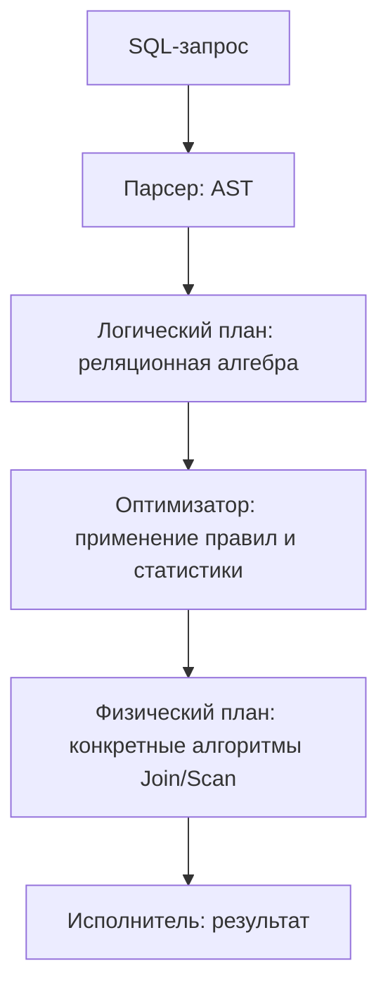

### 1.4 Что такое домен (domain) атрибута? 🟡
Домен — множество допустимых значений, которые может принимать атрибут (например, "целые числа от 0 до 150" для возраста). В SQL домен частично реализуется через типы данных (INT, VARCHAR(50)) и дополнительно уточняется через CHECK-ограничения или пользовательские домены (CREATE DOMAIN в PostgreSQL/стандарте SQL).
**Ресурсы:** PostgreSQL docs — CREATE DOMAIN.

### 1.5 В чём разница между схемой (schema) и экземпляром (instance) БД? 🟡
Схема — статическое описание структуры: таблицы, столбцы, типы, ограничения, связи. Экземпляр (instance) — конкретное состояние данных в определённый момент времени. Схема меняется редко (миграциями), экземпляр меняется постоянно (INSERT/UPDATE/DELETE). Это аналогично разнице между классом и объектом в ООП.
**Ресурсы:** Silberschatz — "Database System Concepts", гл. 1.

### 1.6 Что такое реляционное исчисление (relational calculus) и чем оно отличается от алгебры? 🔴
Реляционное исчисление — декларативный язык запросов, основанный на логике предикатов: запрос описывает "что нужно получить", а не "как это вычислить" (в отличие от процедурной алгебры). Есть два варианта: доменное исчисление (переменные — значения доменов) и кортежное исчисление (переменные — кортежи, на нём фактически основан SQL SELECT). Кодд доказал эквивалентность по выразительной мощности алгебры и исчисления ("Codd's theorem") — это формальный фундамент того, что SQL по выразительности эквивалентен реляционной алгебре.
**Ресурсы:** Date — "An Introduction to Database Systems", гл. 7-8.

### 1.7 Что такое замкнутость (closure) реляционной алгебры и почему это важно? 🟠
Результатом любой операции реляционной алгебры является снова отношение (таблица), что позволяет свободно komponировать операции — результат одного join можно сразу использовать как вход для следующего join или фильтра. Именно свойство замкнутости лежит в основе возможности писать вложенные запросы и цепочки CTE в SQL.
**Ресурсы:** Silberschatz, гл. 2.

### 1.8 Почему в реляционной модели NULL считается "проблемным" элементом? 🟠
NULL нарушает двузначную (булеву) логику: сравнение с NULL даёт не TRUE/FALSE, а UNKNOWN (трёхзначная логика, three-valued logic). Это приводит к неочевидному поведению: `WHERE col <> NULL` никогда не вернёт строк, `NOT IN` с NULL в списке может вернуть пустой результат, агрегатные функции (кроме COUNT(*)) игнорируют NULL. Кодд и Дейт критиковали включение NULL в SQL как отход от строгой реляционной теории.
**Ресурсы:** Date — "SQL and Relational Theory", гл. 3 ("Nulls, three-valued logic").

### 1.9 Чем реляционные БД принципиально отличаются от иерархических и сетевых моделей? 🟡
Иерархическая (IMS) и сетевая (CODASYL) модели требуют навигационного доступа — программист явно обходит указатели/дерево для получения данных, зная физическую структуру. Реляционная модель декларативна: клиент описывает что нужно, а СУБД сама выбирает путь доступа (data independence). Это упростило разработку и позволило оптимизатору запросов эволюционировать независимо от прикладного кода.
**Ресурсы:** Date, гл. 1; исторический обзор — статья Кодда 1970 г.

### 1.10 Что такое физическая и логическая независимость данных? 🟠
Логическая независимость — возможность менять логическую схему (добавлять таблицы/столбцы) без изменения приложений, использующих представления (views). Физическая независимость — возможность менять способ хранения (индексы, файловую организацию, партиционирование) без изменения логической схемы и запросов. Обе концепции — ключевая цель, ради которой создавалась реляционная модель (в противовес навигационным БД).
**Ресурсы:** ANSI/SPARC трёхуровневая архитектура БД (внешний/концептуальный/внутренний уровни).

### 1.11 Что такое реляционная полнота (relational completeness) языка запросов? 🔴
Язык запросов считается реляционно полным, если он способен выразить любой запрос, представимый в реляционной алгебре (или эквивалентном исчислении). SQL реляционно полон и даже превосходит "чистую" реляционную алгебру за счёт агрегатов, рекурсивных CTE (WITH RECURSIVE), оконных функций — эти возможности выходят за рамки классической реляционной алгебры первого порядка.
**Ресурсы:** Codd, "Relational Completeness of Data Base Sublanguages" (1972).

### 1.12 Чем отличаются понятия "ключ-кандидат", "суперключ" и "первичный ключ"? 🟡
Суперключ (superkey) — любой набор атрибутов, однозначно идентифицирующий строку (может включать лишние атрибуты). Ключ-кандидат (candidate key) — минимальный суперключ (без лишних атрибутов, убрать любой — потеряется уникальность). Первичный ключ (primary key) — выбранный из кандидатов ключ, который СУБД использует как основной идентификатор строки (обычно с физическим индексом).
**Ресурсы:** Date, гл. 5 ("Integrity").

### 1.13 Что такое функциональная зависимость (functional dependency, FD)? 🟠
FD X → Y означает, что значение атрибута(ов) X однозначно определяет значение Y: для любых двух строк с одинаковым X всегда одинаковый Y. Это фундаментальное понятие для теории нормализации — все нормальные формы (2NF-BCNF) формулируются через устранение "нежелательных" FD (частичных, транзитивных). Пример: `сотрудник_id → зарплата` — по id однозначно определяется зарплата.
**Ресурсы:** Armstrong's axioms (1974) — правила вывода FD; Silberschatz, гл. 8.

### 1.14 Что такое аксиомы Армстронга и зачем они нужны? 🔴
Аксиомы Армстронга — набор правил вывода (inference rules) для функциональных зависимостей: рефлексивность (если Y⊆X, то X→Y), пополнение/augmentation (если X→Y, то XZ→YZ) и транзитивность (если X→Y и Y→Z, то X→Z). Из них выводятся дополнительные полезные правила (объединение, декомпозиция, псевдотранзитивность). Аксиомы используются для вычисления замыкания атрибутов (attribute closure) — алгоритма, определяющего все FD, выводимые из заданного набора, что критично при проектировании нормализованных схем.
**Ресурсы:** W.W. Armstrong, "Dependency Structures of Data Base Relationships" (1974).

### 1.15 Что такое реляционная СУБД (RDBMS) в противовес просто "реляционной модели"? 🟡
Реляционная модель — теоретическая абстракция (математика множеств и логики). RDBMS (PostgreSQL, MySQL, Oracle, SQL Server) — программная система, реализующая эту модель с практическими компромиссами: физическое хранение на диске, индексы, транзакции, конкурентный доступ, оптимизатор запросов, язык SQL как интерфейс. Ни одна промышленная RDBMS не реализует модель Кодда на 100% (например, из-за NULL, дублирующихся строк, порядка столбцов).
**Ресурсы:** Date — "Database Design and Relational Theory: Normal Forms and All That Jazz".

---

## 2. Нормализация и дизайн схемы

### 2.1 Что такое нормализация и зачем она нужна? 🟡
Нормализация — процесс структурирования схемы БД для минимизации избыточности (redundancy) данных и предотвращения аномалий модификации (insert/update/delete anomalies). Достигается путём декомпозиции таблиц на более мелкие связанные таблицы согласно функциональным зависимостям, до достижения определённой "нормальной формы" (1NF, 2NF, 3NF, BCNF и выше).
**Ресурсы:** C.J. Date, "Database Design and Relational Theory"; Silberschatz, гл. 8.

### 2.2 Что такое аномалии вставки, обновления и удаления? 🟡
Аномалия вставки — невозможность добавить факт без наличия несвязанного факта (например, нельзя добавить курс без хотя бы одного записанного студента, если данные о курсе и студентах смешаны в одной таблице). Аномалия обновления — необходимость менять одно и то же значение в нескольких строках (риск рассинхронизации). Аномалия удаления — удаление одной строки стирает и другую полезную информацию (удалив единственного сотрудника отдела, теряем информацию об отделе). Нормализация устраняет эти проблемы декомпозицией.
**Ресурсы:** Elmasri & Navathe, "Fundamentals of Database Systems", гл. 14.

### 2.3 Что такое первая нормальная форма (1NF)? 🟡
Таблица в 1NF, если: все атрибуты атомарны (нет составных/многозначных значений в одной ячейке, нет массивов/вложенных таблиц в классическом смысле), нет повторяющихся групп столбцов, и у таблицы есть первичный ключ. Пример нарушения: столбец `телефоны = "111-222, 333-444"` — нужно вынести в отдельную таблицу `phone(user_id, phone)`.
**Ресурсы:** Codd, "Further Normalization of the Data Base Relational Model" (1971).

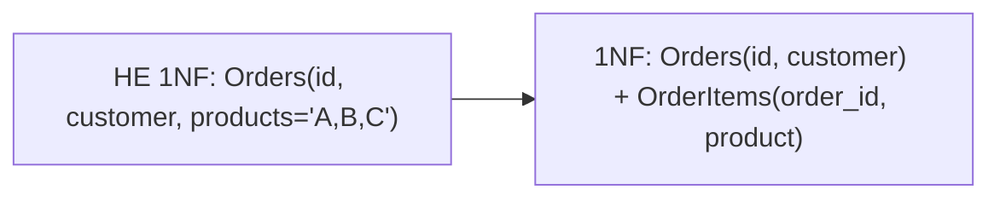

### 2.4 Что такое вторая нормальная форма (2NF)? 🟡
Таблица в 2NF, если она уже в 1NF и каждый неключевой атрибут полностью функционально зависит от всего составного первичного ключа (нет частичных зависимостей от части ключа). Проблема актуальна только при составном PK. Пример нарушения: `OrderItems(order_id, product_id, product_name, qty)` — `product_name` зависит только от `product_id`, а не от всей пары ключа → выносим `product_name` в таблицу `Products`.
**Ресурсы:** Elmasri & Navathe, гл. 14.

### 2.5 Что такое третья нормальная форма (3NF)? 🟡
Таблица в 3NF, если она в 2NF и нет транзитивных зависимостей неключевых атрибутов друг от друга (каждый неключевой атрибут зависит только от ключа, напрямую). Пример нарушения: `Employees(emp_id, dept_id, dept_name)` — `dept_name` зависит от `dept_id`, а не напрямую от `emp_id` (транзитивная зависимость emp_id → dept_id → dept_name) → выносим в `Departments(dept_id, dept_name)`.
**Ресурсы:** Codd (1971); Date, гл. 7.

### 2.6 Что такое нормальная форма Бойса-Кодда (BCNF) и чем она сильнее 3NF? 🟠
BCNF требует, чтобы для каждой нетривиальной FD X → Y атрибут X был суперключом (в 3NF допускается исключение, если Y — часть какого-либо ключа-кандидата). BCNF устраняет аномалии, которые могут остаться в 3NF при наличии нескольких пересекающихся ключей-кандидатов. Классический пример: `Enrollment(student, subject, teacher)`, где каждый teacher ведёт один subject, но subject может вести несколько teacher-ов — здесь есть FD `teacher → subject`, но teacher не суперключ → нарушение BCNF, хотя 3NF может выполняться.
**Ресурсы:** Date, гл. 7 ("Further Normalization II: BCNF").

### 2.7 Что такое четвёртая нормальная форма (4NF) и многозначные зависимости? 🔴
4NF устраняет многозначные зависимости (multivalued dependency, MVD), не связанные с функциональными. MVD X →→ Y означает, что множество значений Y, ассоциированных с X, не зависит от значений других атрибутов при фиксированном X. Классический пример: таблица `Employee(emp, skill, language)`, где skill и language независимы друг от друга — хранение всех комбинаций создаёт избыточность. Декомпозируем на `Employee_Skill(emp, skill)` и `Employee_Language(emp, language)`.
**Ресурсы:** Fagin, "Multivalued Dependencies and a New Normal Form for Relational Databases" (1977).

### 2.8 Что такое пятая нормальная форма (5NF / PJNF)? 🔴
5NF (Project-Join Normal Form) устраняет зависимости соединения (join dependency), не сводимые к FD/MVD — ситуации, когда таблицу нужно разбить на три и более частей, чтобы при обратном соединении не создавались "фантомные" (ложные) строки. Это редкий на практике случай (например, поставщики-продукты-проекты, где связь тройственная, а не сумма трёх бинарных). 5NF — теоретический предел классической нормализации.
**Ресурсы:** Fagin, "Normal Forms and Relational Database Operators" (1979).

### 2.9 Что такое доменно-ключевая нормальная форма (DKNF)? 🔴
DKNF — теоретический "идеал" нормализации, при котором все ограничения целостности БД являются логическим следствием определений доменов (допустимых значений атрибутов) и ключей. Если схема в DKNF, никакие аномалии невозможны в принципе. На практике DKNF труднодостижима и не имеет алгоритма проверки для произвольной схемы, поэтому используется скорее как концептуальный ориентир, а не практический чеклист.
**Ресурсы:** Fagin, "A Normal Form for Relational Databases That Is Based on Domains and Keys" (1981).

### 2.10 Когда денормализация оправдана и как её грамотно применять? 🟠
Денормализация — намеренное введение избыточности ради производительности чтения (меньше JOIN-ов) в обмен на сложность поддержания консистентности при записи. Оправдана в OLAP/аналитических системах, read-heavy сервисах, кешах агрегатов (например, хранить `orders_count` в таблице `customers` вместо COUNT() каждый раз), star schema в DWH. Правило: денормализовать осознанно, поверх нормализованной модели, с чёткой стратегией синхронизации (триггеры, batch-обновления, событийная модель), а не вместо нормализации с самого начала.
**Ресурсы:** Kimball & Ross, "The Data Warehouse Toolkit".

### 2.11 Как декомпозиция без потерь (lossless-join decomposition) связана с нормализацией? 🟠
При разбиении таблицы на две (R1, R2) декомпозиция без потерь означает, что JOIN R1 и R2 обратно по общему атрибуту восстанавливает исходные данные без появления "лишних" строк. Формальный критерий (теорема Дейта): декомпозиция R на R1(X,Y) и R2(X,Z) безопасна тогда и только тогда, когда X является суперключом хотя бы одного из R1 или R2 (X → Y или X → Z выполняется). Все стандартные алгоритмы нормализации (2NF→3NF→BCNF) гарантируют lossless-join декомпозицию.
**Ресурсы:** Silberschatz, гл. 8.4.

### 2.12 Что такое сохранение зависимостей (dependency preservation) при декомпозиции? 🟠
Декомпозиция сохраняет зависимости, если объединение FD, которые можно проверить в отдельных декомпозированных таблицах, эквивалентно исходному набору FD — то есть не нужно делать JOIN, чтобы проверить целостность. Важный нюанс: разложение до BCNF всегда без потерь (lossless), но не всегда сохраняет зависимости (иногда приходится жертвовать одним ради другого — 3NF гарантирует оба свойства одновременно, BCNF — только lossless-join).
**Ресурсы:** Elmasri & Navathe, гл. 15.

### 2.13 Как спроектировать схему для связи "многие-ко-многим" (M:N)? 🟡
Через промежуточную (junction/associative) таблицу с двумя внешними ключами, ссылающимися на обе стороны связи, и обычно составным первичным ключом (или суррогатным PK + UNIQUE-ограничением на пару FK). Пример: `students(id)`, `courses(id)`, `enrollments(student_id, course_id, enrolled_at, PRIMARY KEY(student_id, course_id))`. Такая таблица может нести и собственные атрибуты связи (дата записи, оценка).
**Ресурсы:** Silberschatz, гл. 7 (ER → реляционное преобразование).

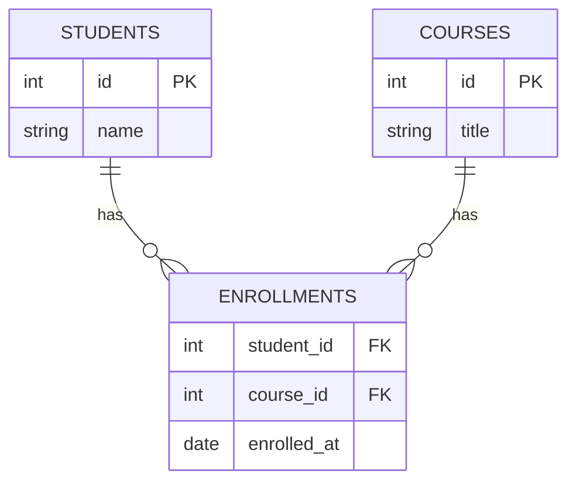

### 2.14 Что такое паттерн EAV (Entity-Attribute-Value) и когда его допустимо использовать? 🟠
EAV хранит атрибуты сущности как строки таблицы вида `(entity_id, attribute_name, value)` вместо отдельных столбцов — позволяет динамически добавлять атрибуты без изменения схемы. Плюсы: гибкость для сильно вариативных атрибутов (медицинские карты, кастомные поля CRM). Минусы: теряются типизация, ограничения, простота JOIN и агрегации, запросы становятся сложными pivot-конструкциями, страдает производительность индексов. Часто лучшая альтернатива — JSONB-столбец (в PostgreSQL) с GIN-индексом, который даёт гибкость EAV, но с лучшей выразительностью запросов.
**Ресурсы:** Martin Fowler, обсуждения EAV anti-pattern; PostgreSQL JSONB docs.

### 2.15 Как нормализовать данные с иерархической/древовидной структурой (например, категории с подкатегориями)? 🟠
Основные подходы: Adjacency List (`category(id, parent_id)` — просто, но рекурсивные запросы требуют WITH RECURSIVE), Path Enumeration/Materialized Path (хранить путь строкой `1/4/12/`, быстрое чтение поддерева через LIKE, но дороже писать), Nested Sets (lft/rgt числа — очень быстрое чтение поддерева одним запросом, но дорогая вставка/сдвиг), Closure Table (отдельная таблица всех пар предок-потомок — быстрые чтения в обе стороны ценой доп. хранилища). Выбор зависит от соотношения частоты чтений и записей.
**Ресурсы:** Bill Karwin, "SQL Antipatterns", гл. про Trees; статья "Models for Hierarchical Data" (Joe Celko).

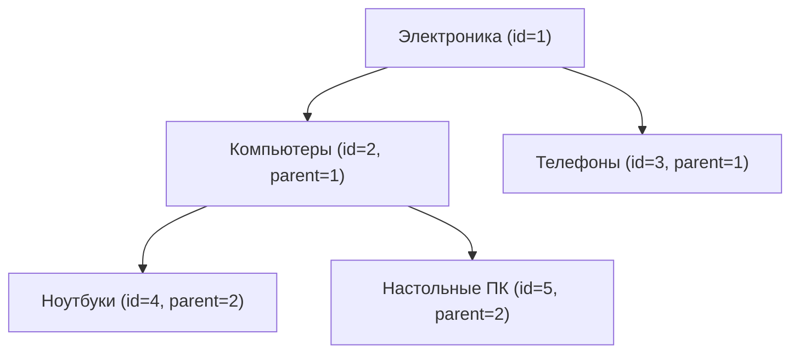


---

## 3. ER-моделирование

### 3.1 Что такое ER-модель (Entity-Relationship) и кто её предложил? 🟡
ER-модель предложена Питером Ченом (Peter Chen) в 1976 году как способ концептуального моделирования данных до перевода в реляционную схему. Основные элементы: сущности (entities) — объекты предметной области, атрибуты (attributes) — их свойства, связи (relationships) — ассоциации между сущностями. ER-диаграмма служит мостом между требованиями бизнеса и физической схемой БД.
**Ресурсы:** P. Chen, "The Entity-Relationship Model — Toward a Unified View of Data" (1976).

### 3.2 В чём разница между сильной (strong) и слабой (weak) сущностью? 🟠
Сильная сущность имеет собственный первичный ключ и существует независимо. Слабая сущность не имеет собственного уникального идентификатора и зависит от "владеющей" сильной сущности — её PK включает FK родителя плюс частичный ключ (discriminator). Пример: `Room(hotel_id, room_number)` — room_number уникален только в рамках отеля, поэтому Room — слабая сущность, зависящая от Hotel.
**Ресурсы:** Elmasri & Navathe, гл. 7.

### 3.3 Что такое степень связи (cardinality) и как она обозначается? 🟡
Кардинальность описывает, сколько экземпляров одной сущности могут быть связаны с экземплярами другой: 1:1, 1:N, M:N. Дополнительно указывается модальность (participation) — обязательная (mandatory, min=1) или необязательная (optional, min=0) связь. В нотации "вороньей лапки" (Crow's Foot) это изображается символами на концах линии связи.
**Ресурсы:** нотация Crow's Foot; Chen notation.

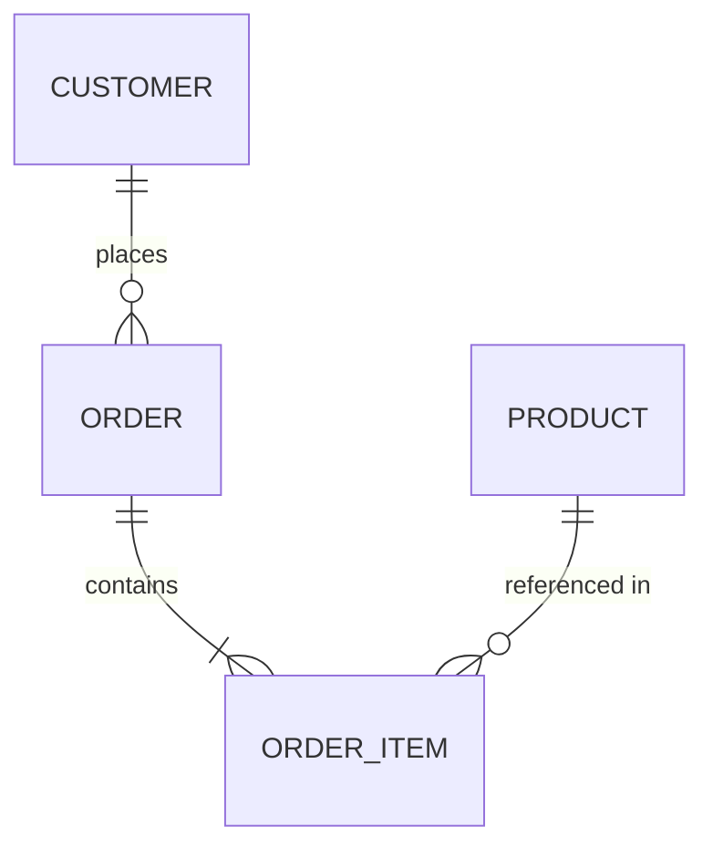

### 3.4 Как реализовать связь "один-к-одному" (1:1) на уровне таблиц? 🟡
Два способа: (1) вынести общий PK в обе таблицы, где PK одной таблицы одновременно является FK на другую, с UNIQUE-ограничением на FK; (2) просто добавить все столбцы в одну таблицу, если связь действительно всегда 1:1 и обязательна. Разделение на две таблицы обычно оправдано, когда часть данных редко используется, содержит "тяжёлые" поля (BLOB), или имеет разные правила доступа/безопасности (например, `users` и `user_private_data`).
**Ресурсы:** Silberschatz, гл. 7.

### 3.5 Как в ER-модели изображаются атрибуты: простые, составные, многозначные, производные? 🟡
Простой (atomic) атрибут неделим (age). Составной (composite) состоит из частей (address = street + city + zip). Многозначный (multivalued) может иметь несколько значений для одной сущности (phone_numbers) — в реляционной схеме превращается в отдельную таблицу. Производный (derived) вычисляется из других атрибутов (age из birth_date) и обычно не хранится физически, а вычисляется на лету или через generated column.
**Ресурсы:** Elmasri & Navathe, гл. 7.

### 3.6 Что такое рекурсивная связь (recursive/unary relationship)? 🟡
Связь сущности с самой собой, например `Employee` со связью "manages" (сотрудник управляет другими сотрудниками). Реализуется self-referencing внешним ключом: `employees(id, manager_id REFERENCES employees(id))`. Частый источник иерархических структур (оргструктура, категории, комментарии с ответами).
**Ресурсы:** Joe Celko, "Trees and Hierarchies in SQL for Smarties".

### 3.7 Как моделировать тернарную (n-арную) связь и почему её обычно лучше избегать? 🟠
Тернарная связь соединяет три и более сущностей одновременно (например, Supplier-Part-Project: "поставщик S поставляет деталь P для проекта J"). Её нельзя корректно разложить на три отдельные бинарные связи без потери информации (это как раз пример join dependency из 5NF). Реализуется отдельной таблицей с тремя FK. Рекомендация: тернарные связи усложняют запросы и понимание — стоит явно проверить, действительно ли связь неразложима, прежде чем моделировать её как одну n-арную таблицу.
**Ресурсы:** Elmasri & Navathe, обсуждение n-арных связей, гл. 7.

### 3.8 Что такое расширенная ER-модель (EER) и суперкласс/подкласс (generalization/specialization)? 🟠
EER добавляет к базовой ER-модели ООП-подобные концепции: generalization (обобщение нескольких сущностей в суперкласс, "снизу вверх") и specialization (выделение подклассов из суперкласса по атрибуту-дискриминатору, "сверху вниз"). Пример: `Vehicle` (суперкласс) → `Car`, `Truck` (подклассы) с дополнительными специфичными атрибутами. Также вводится понятие категории (union type) — подкласс, являющийся объединением нескольких разнородных суперклассов.
**Ресурсы:** Elmasri & Navathe, гл. 8 ("Enhanced ER Modeling").

### 3.9 Как переводить наследование (superclass/subclass) из EER в реляционные таблицы — какие есть стратегии? 🟠
Три классических подхода: **Single Table Inheritance** — одна таблица со всеми полями всех подклассов и дискриминатором + допустимыми NULL для нерелевантных полей (просто, но много NULL и нет строгих constraints по подтипу); **Class Table Inheritance (Table-per-Type)** — таблица на суперкласс + отдельные таблицы на каждый подкласс с FK=PK родителя (нормализовано, но требует JOIN); **Concrete Table Inheritance (Table-per-Concrete-Class)** — отдельная независимая таблица на каждый конкретный подкласс без общей таблицы (дублирование общих полей, сложно делать полиморфные запросы по всем типам).
**Ресурсы:** Martin Fowler, "Patterns of Enterprise Application Architecture" — паттерны наследования.

```mermaid
erDiagram
    VEHICLE ||--o| CAR : "is-a"
    VEHICLE ||--o| TRUCK : "is-a"
    VEHICLE {
        int id PK
        string vin
        int year
    }
    CAR {
        int vehicle_id PK_FK
        int num_doors
    }
    TRUCK {
        int vehicle_id PK_FK
        float payload_capacity
    }
```

### 3.10 Чем отличаются нотации Chen, Crow's Foot и IDEF1X? 🟠
Chen notation — оригинальная нотация с прямоугольниками (сущности), эллипсами (атрибуты) и ромбами (связи), наглядна для обучения, но громоздка для больших схем. Crow's Foot ("воронья лапка") — компактнее: связи обозначаются линиями с символами на концах (единица, "0 или много" и т.п.), самая распространённая в промышленных CASE-инструментах (MySQL Workbench, dbdiagram.io). IDEF1X — федеральный стандарт США, строже формализует идентифицирующие/неидентифицирующие связи и используется в гос./оборонных проектах.
**Ресурсы:** сравнение нотаций — Lucidchart/draw.io документация по ER-нотациям.

### 3.11 Что такое идентифицирующая (identifying) и неидентифицирующая (non-identifying) связь? 🟠
Идентифицирующая связь означает, что PK дочерней (слабой) сущности включает FK родителя — дочерняя сущность не может существовать без родителя, и её идентичность зависит от него (изображается сплошной линией в Crow's Foot). Неидентифицирующая связь — FK является просто обычным атрибутом дочерней таблицы, не частью её PK (сущность может существовать сама по себе, связь опциональна или её можно сменить) — изображается пунктирной линией.
**Ресурсы:** IDEF1X стандарт (FIPS 184).

### 3.12 Как выбрать между естественным (natural) и суррогатным (surrogate) первичным ключом на этапе ER-моделирования? 🟠
Естественный ключ — существующий в предметной области уникальный атрибут (email, ИНН, VIN автомобиля). Суррогатный — искусственно сгенерированный идентификатор (auto-increment integer, UUID), не несущий бизнес-смысла. Суррогатные ключи предпочтительны, когда естественный ключ может измениться (email можно сменить), составной (несколько полей — неудобно для FK в дочерних таблицах) или не гарантированно уникален глобально. Естественные ключи хороши для справочников с редко меняющимися значениями (коды стран ISO) и когда важна читаемость/проверяемость без JOIN.
**Ресурсы:** Karwin, "SQL Antipatterns", гл. 4 ("Keyless Entry" / выбор ключей).

### 3.13 Как ER-диаграмма помогает выявлять пропущенные бизнес-правила до написания кода? 🟡
Формализация связей и кардинальностей на ER-этапе заставляет явно ответить на вопросы, которые часто упускают в требованиях: может ли заказ существовать без клиента? может ли товар быть без категории? может ли сотрудник иметь несколько менеджеров? Явное определение min/max кардинальности и обязательности (mandatory/optional participation) на диаграмме до написания DDL сильно снижает число последующих миграций схемы и находит противоречия в требованиях раньше.
**Ресурсы:** практики Domain-Driven Design для сверки модели с бизнес-экспертами (event storming, домейн-моделирование).

### 3.14 Что такое атрибуты связи (relationship attributes) и когда связь нужно превращать в отдельную сущность? 🟡
Атрибуты связи — свойства, относящиеся не к одной из сущностей, а к самой связи (например, `enrolled_at`, `grade` в связи Student-Course). Если у связи M:N появляются собственные атрибуты, её физически всегда нужно материализовать как отдельную таблицу (junction table) с этими атрибутами, а не пытаться "размазать" их по одной из сторон.
**Ресурсы:** Elmasri & Navathe, гл. 7.

### 3.15 Какие популярные инструменты используются для ER-моделирования и генерации DDL из диаграммы? 🟡
dbdiagram.io, MySQL Workbench, pgModeler, ERwin, Lucidchart, draw.io, DataGrip (JetBrains), dbForge Studio, а также code-first подходы через ORM-миграции (Django, Rails ActiveRecord, Prisma, SQLAlchemy/Alembic), где схема описывается кодом, а DDL генерируется автоматически. Выбор зависит от того, нужен ли diagram-first (визуальное проектирование → DDL) или code-first (код → миграции → диаграмма как побочный артефакт) подход.
**Ресурсы:** dbdiagram.io docs; документация выбранного ORM.

---

## 4. Ключи и ограничения целостности

### 4.1 Что такое первичный ключ (PRIMARY KEY) и какие у него свойства? 🟡
PRIMARY KEY — столбец (или набор столбцов), однозначно идентифицирующий каждую строку таблицы. Свойства: уникальность (UNIQUE) + запрет NULL (NOT NULL) для всех входящих в него столбцов, в таблице может быть только один PRIMARY KEY (в отличие от нескольких UNIQUE-ограничений), обычно автоматически создаёт кластерный или обычный индекс в зависимости от СУБД.
**Ресурсы:** документация СУБД (PostgreSQL/MySQL) — раздел Constraints.

### 4.2 Чем FOREIGN KEY отличается от простого столбца-ссылки без ограничения? 🟡
FOREIGN KEY — декларативное ограничение ссылочной целостности (referential integrity): СУБД гарантирует, что значение в дочерней таблице либо NULL, либо существует в родительской таблице как значение PK/UNIQUE. Без FK-ограничения это просто обычный столбец, и целостность нужно поддерживать вручную в коде приложения — что приводит к "осиротевшим" (orphaned) записям при багах или гонках (race conditions).
**Ресурсы:** SQL Standard — Referential Integrity constraints.

### 4.3 Какие действия ON DELETE / ON UPDATE бывают у FOREIGN KEY и когда их использовать? 🟠
`CASCADE` — удаление/обновление родителя автоматически удаляет/обновляет дочерние строки (удобно для строго зависимых сущностей, например удаление заказа удаляет его позиции). `RESTRICT`/`NO ACTION` — запрещает удаление родителя, если есть зависимые строки (безопасный дефолт для важных сущностей). `SET NULL` — FK-столбец становится NULL (требует, чтобы столбец допускал NULL; например, при удалении менеджера у сотрудников manager_id становится NULL). `SET DEFAULT` — FK ставится в значение по умолчанию. Выбор зависит от семантики домена: агрессивный CASCADE может привести к неожиданной массовой потере данных.
**Ресурсы:** PostgreSQL docs — Foreign Key Constraints.

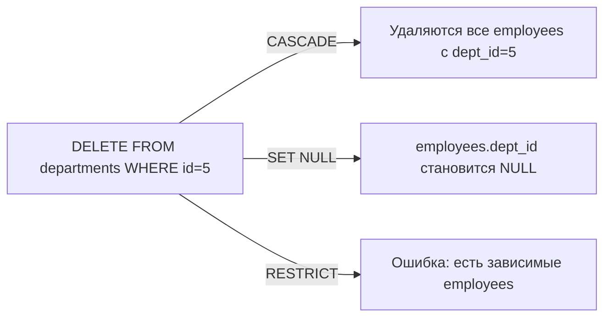

### 4.4 Что такое составной ключ (composite key) и в чём его недостатки? 🟠
Составной ключ — PK/UNIQUE из нескольких столбцов вместе (например, `(order_id, product_id)`). Недостатки: дочерние таблицы должны дублировать все столбцы составного ключа как FK (раздувание схемы), сложнее писать JOIN-условия, некоторые ORM хуже поддерживают композитные PK. Альтернатива — суррогатный ключ + UNIQUE-ограничение на комбинацию столбцов, что упрощает связи, но добавляет лишний столбец.
**Ресурсы:** Karwin, "SQL Antipatterns".

### 4.5 Что такое CHECK-ограничение и для чего его использовать вместо валидации в приложении? 🟡
CHECK — ограничение, проверяющее произвольное булево выражение при вставке/обновлении строки (например, `CHECK (price >= 0)`, `CHECK (end_date > start_date)`). Важно применять на уровне БД, а не только в приложении, потому что: несколько приложений/сервисов могут писать в одну БД, миграции данных и ручные UPDATE обходят код приложения, а CHECK гарантирует целостность независимо от источника записи (defence in depth).
**Ресурсы:** PostgreSQL docs — CHECK Constraints.

### 4.6 Чем UNIQUE-ограничение отличается от уникального индекса? 🟠
Концептуально UNIQUE constraint — ограничение целостности (декларативное правило), а unique index — физическая структура. На практике в большинстве СУБД (PostgreSQL, MySQL InnoDB) UNIQUE constraint реализуется именно через создание уникального индекса "под капотом" — то есть они синонимичны по эффекту, но UNIQUE constraint дополнительно явно документирует бизнес-намерение в схеме и участвует в системном каталоге ограничений (information_schema.table_constraints), а не только индексов.
**Ресурсы:** PostgreSQL docs — Unique Constraints vs Indexes.

### 4.7 Что такое NOT NULL и почему важно явно указывать его, а не полагаться на дефолт? 🟡
По умолчанию столбцы в SQL допускают NULL, если явно не указано NOT NULL. Отсутствие NOT NULL там, где значение логически обязательно, — источник багов: агрегаты молча пропускают NULL, сравнения дают UNKNOWN, приложения получают неожиданные null-указатели. Правило хорошей практики: делать столбцы NOT NULL по умолчанию и явно разрешать NULL только там, где отсутствие значения — законное бизнес-состояние.
**Ресурсы:** документация СУБД — раздел Column Constraints.

### 4.8 Что такое ограничение EXCLUDE в PostgreSQL и для каких задач оно нужно? 🔴
EXCLUDE constraint обобщает UNIQUE на произвольные операторы сравнения через GiST/SP-GiST индексы — позволяет запретить не только точное совпадение, но и пересечение диапазонов. Классический пример: запретить пересекающиеся бронирования переговорной комнаты — `EXCLUDE USING gist (room_id WITH =, during WITH &&)`, где during — tsrange. Это решает задачу, которую без EXCLUDE пришлось бы реализовывать через триггеры или блокировки уровня приложения.
**Ресурсы:** PostgreSQL docs — CREATE TABLE ... EXCLUDE; range types.

### 4.9 Что такое отложенные ограничения (deferrable constraints) и когда они нужны? 🔴
DEFERRABLE constraint (обычно FK) можно настроить на проверку не сразу при каждом операторе, а в конце транзакции (`DEFERRABLE INITIALLY DEFERRED`). Это нужно для взаимных ссылок или циклических зависимостей, когда нужно вставить несколько связанных строк, каждая из которых временно нарушает FK, пока не вставлены все (например, `employees.manager_id` ссылается на `employees.id`, и нужно вставить сотрудника и его будущего подчинённого одной транзакцией в любом порядке).
**Ресурсы:** PostgreSQL docs — SET CONSTRAINTS DEFERRED.

### 4.10 Как ссылочная целостность (referential integrity) соотносится с производительностью при массовых загрузках данных? 🟠
FK-проверки при массовой вставке (bulk load) добавляют накладные расходы — каждая вставка требует поиска в родительской таблице по индексу. При больших ETL/миграциях распространённая практика: временно отключить/удалить FK-ограничения (`ALTER TABLE ... DISABLE TRIGGER ALL` или DROP CONSTRAINT), загрузить данные, затем пересоздать constraint с `NOT VALID` + последующей валидацией (`VALIDATE CONSTRAINT` в PostgreSQL — не блокирует запись во время валидации). Компромисс: скорость загрузки против временного окна без гарантий целостности.
**Ресурсы:** PostgreSQL docs — ALTER TABLE VALIDATE CONSTRAINT (для больших таблиц без длительной блокировки).

### 4.11 Что такое естественный ключ (natural key) vs суррогатный ключ (surrogate key) с точки зрения ограничений целостности? 🟠
См. также раздел ER-моделирования (3.12). С точки зрения constraints: естественный ключ уже несёт смысловую уникальность, которую полезно продублировать явным UNIQUE-ограничением, даже если PK — суррогатный (`id SERIAL PRIMARY KEY, email TEXT UNIQUE NOT NULL`). Это распространённый паттерн: суррогатный PK для внутренних связей + естественный UNIQUE-ключ для бизнес-целостности и удобства поиска.
**Ресурсы:** Karwin, "SQL Antipatterns", гл. 4.

### 4.12 Что такое self-referencing FK и какие сложности он создаёт при DELETE/INSERT? 🟠
Self-referencing FK — таблица ссылается сама на себя (`employees(id, manager_id REFERENCES employees(id))`). Сложности: нельзя просто TRUNCATE или массово удалить без учёта порядка (нужен ON DELETE SET NULL/CASCADE или удаление "снизу вверх" по иерархии), при вставке корневого узла с самоссылкой возможен временный конфликт (решается через deferrable constraint или два шага: вставить с NULL, затем UPDATE). Циклические self-reference (A→B→A) требуют либо deferred constraints, либо запрета циклов на уровне приложения/триггера.
**Ресурсы:** Celko, "Trees and Hierarchies in SQL for Smarties".

### 4.13 Как ограничения (constraints) помогают оптимизатору запросов, а не только гарантируют целостность? 🔴
Оптимизатор использует constraints для доказательства эквивалентных, но более дешёвых планов: NOT NULL позволяет убрать лишние проверки IS NULL; CHECK-ограничения (constraint exclusion в PostgreSQL) позволяют пропускать целые партиции, если условие запроса противоречит CHECK партиции; FK может подсказать оптимизатору точную мощность (cardinality) join-результата (join elimination — если очевидно, что каждой строке родителя соответствует ровно одна дочерняя, JOIN можно вообще убрать из плана, если её столбцы не используются). Это одна из причин не пренебрегать constraints "ради простоты".
**Ресурсы:** PostgreSQL docs — Table Partitioning: Partition Pruning; "join elimination" в документации Oracle/PostgreSQL.

### 4.14 Что произойдёт при попытке добавить FOREIGN KEY на существующую таблицу с "грязными" данными? 🟡
СУБД просканирует всю таблицу и вернёт ошибку на первой же строке, где значение FK-столбца не NULL и не существует в родительской таблице — ALTER TABLE ADD CONSTRAINT завершится неудачей. Практический путь: сначала найти и исправить/удалить "осиротевшие" строки запросом `SELECT ... WHERE fk_col NOT IN (SELECT pk FROM parent) AND fk_col IS NOT NULL`, затем добавлять constraint. В PostgreSQL можно добавить `NOT VALID` constraint мгновенно (без полной проверки) и провалидировать отдельно, не блокируя таблицу надолго.
**Ресурсы:** PostgreSQL docs — ADD CONSTRAINT ... NOT VALID.

### 4.15 Может ли внешний ключ ссылаться не на PRIMARY KEY, а на любой столбец? 🟠
FK может ссылаться на любой столбец (или набор столбцов) родительской таблицы, для которого есть UNIQUE-ограничение (или UNIQUE-индекс) — необязательно именно на PRIMARY KEY. Это полезно, например, чтобы FK ссылался на "естественный" уникальный столбец (email) вместо суррогатного PK, если так удобнее семантически. Требование именно уникальности (а не PK) — потому что СУБД должна гарантированно найти ровно одну или ноль совпадающих строк при проверке FK.
**Ресурсы:** SQL Standard — REFERENCES clause requirements.


---

## 5. SQL: DDL, DML, DQL основы

### 5.1 Что такое DDL, DML, DQL, DCL, TCL — на какие категории делится SQL? 🟡
DDL (Data Definition Language) — CREATE, ALTER, DROP, TRUNCATE — определяет структуру. DML (Data Manipulation Language) — INSERT, UPDATE, DELETE — изменяет данные. DQL (Data Query Language) — SELECT — читает данные (иногда относят к DML). DCL (Data Control Language) — GRANT, REVOKE — управляет правами доступа. TCL (Transaction Control Language) — COMMIT, ROLLBACK, SAVEPOINT — управляет транзакциями. Деление помогает понимать, какие операторы автокоммитятся (DDL в большинстве СУБД, кроме PostgreSQL, где DDL транзакционен) и какие входят в область транзакций.
**Ресурсы:** SQL Standard (ISO/IEC 9075); документация конкретной СУБД.

### 5.2 Чем DELETE отличается от TRUNCATE и DROP? 🟡
DELETE — DML, удаляет строки построчно (можно с WHERE), пишет в журнал транзакций (WAL/redo log) построчно, можно откатить, срабатывают триггеры ON DELETE, не сбрасывает auto-increment. TRUNCATE — DDL-подобная операция, мгновенно освобождает страницы данных целиком, минимальное логирование, обычно сбрасывает счётчик автоинкремента, не работает с WHERE, в некоторых СУБД не откатывается (в PostgreSQL — откатывается, т.к. DDL там транзакционен). DROP полностью удаляет саму таблицу вместе со структурой, индексами, правами.
**Ресурсы:** PostgreSQL docs — TRUNCATE vs DELETE.

### 5.3 В каком порядке логически выполняются части SELECT-запроса? 🟠
Логический (не текстовый!) порядок выполнения: `FROM` → `JOIN` (включая ON) → `WHERE` → `GROUP BY` → `HAVING` → `SELECT` (включая вычисление алиасов) → `DISTINCT` → `ORDER BY` → `LIMIT/OFFSET`. Это объясняет, почему нельзя использовать алиас из SELECT в WHERE (WHERE выполняется раньше SELECT), но можно в ORDER BY (выполняется позже), и почему HAVING фильтрует после агрегации, а WHERE — до.
**Ресурсы:** Itzik Ben-Gan, "T-SQL Fundamentals" — диаграмма логического порядка выполнения запроса.


### 5.4 Чем WHERE отличается от HAVING? 🟡
WHERE фильтрует отдельные строки до группировки и не может использовать агрегатные функции. HAVING фильтрует уже сгруппированные результаты (после GROUP BY) и обычно используется именно для условий по агрегатам (`HAVING COUNT(*) > 5`). Если условие не связано с агрегатом, его почти всегда эффективнее и правильнее ставить в WHERE — оптимизатор отфильтрует строки раньше, до дорогой группировки.
**Ресурсы:** документация СУБД — SELECT syntax.

### 5.5 Что возвращает COUNT(*), COUNT(1) и COUNT(column_name) — есть ли разница? 🟡
COUNT(*) считает все строки, включая те, где все столбцы NULL. COUNT(1) практически идентичен COUNT(*) по семантике и в большинстве современных оптимизаторов (PostgreSQL, MySQL, SQL Server) генерирует одинаковый план выполнения — разницы в производительности нет. COUNT(column_name) считает только строки, где значение этого конкретного столбца NOT NULL — это единственный вариант с иной семантикой.
**Ресурсы:** PostgreSQL/MySQL EXPLAIN сравнение планов COUNT(*) vs COUNT(1).

### 5.6 Что такое GENERATED ALWAYS AS (computed/generated column)? 🟠
Вычисляемый столбец, значение которого автоматически рассчитывается из других столбцов той же строки при вставке/обновлении (`total GENERATED ALWAYS AS (price * qty) STORED`). STORED — значение физически хранится на диске и пересчитывается при изменении зависимых столбцов; VIRTUAL (MySQL) — вычисляется на лету при чтении, не хранится. Полезно для денормализованных агрегатов без риска рассинхронизации, характерного для триггеров, и может индексироваться.
**Ресурсы:** PostgreSQL docs — Generated Columns; MySQL docs — Generated Columns.

### 5.7 В чём разница между UPSERT-подходами: ON CONFLICT (PostgreSQL), ON DUPLICATE KEY UPDATE (MySQL) и MERGE (стандарт SQL)? 🟠
`INSERT ... ON CONFLICT (col) DO UPDATE/NOTHING` (PostgreSQL) явно указывает конфликтующий индекс/constraint и что делать. `INSERT ... ON DUPLICATE KEY UPDATE` (MySQL) срабатывает при конфликте любого UNIQUE/PK индекса таблицы. `MERGE INTO` (стандарт SQL, Oracle, SQL Server, PostgreSQL 15+) — самый мощный вариант: позволяет одним оператором обрабатывать WHEN MATCHED (UPDATE/DELETE) и WHEN NOT MATCHED (INSERT), сравнивая с произвольным источником (включая другую таблицу), что удобно для синхронизации данных (SCD-паттерны в DWH).
**Ресурсы:** PostgreSQL docs — INSERT ON CONFLICT, MERGE (с v15); MySQL docs — INSERT ON DUPLICATE KEY UPDATE.

### 5.8 Что такое RETURNING в INSERT/UPDATE/DELETE и зачем это нужно? 🟡
RETURNING (PostgreSQL, поддерживается частично в др. СУБД через OUTPUT в SQL Server) возвращает изменённые строки прямо из DML-оператора без дополнительного SELECT — полезно для получения сгенерированного id при вставке или атомарного получения "старых" значений при UPDATE/DELETE без гонки условий (race condition) между записью и последующим чтением.
**Ресурсы:** PostgreSQL docs — INSERT/UPDATE/DELETE ... RETURNING.

### 5.9 Как работает LIMIT/OFFSET и почему OFFSET на больших значениях медленный? 🟠
LIMIT ограничивает число возвращаемых строк, OFFSET пропускает N строк перед этим. Проблема: СУБД физически должна прочитать (или хотя бы просканировать индекс) все OFFSET+LIMIT строк, отбросив первые OFFSET — то есть `OFFSET 1000000` требует прохода через миллион строк даже если возвращается всего 10. Для пагинации на больших таблицах используют keyset pagination ("seek method"): `WHERE id > :last_seen_id ORDER BY id LIMIT 10` — работает за счёт индекса без сканирования пропускаемых строк.
**Ресурсы:** статья "We need tool support for keyset pagination" (Markus Winand, use-the-index-luke.com/no-offset).

### 5.10 Чем UNION отличается от UNION ALL и почему UNION ALL обычно предпочтительнее? 🟡
UNION объединяет результаты двух запросов и удаляет дубликаты (требует неявной сортировки/хеширования для дедупликации — дороже). UNION ALL просто конкатенирует результаты без проверки на дубли — значительно быстрее. Если заранее известно, что дублей быть не может (например, объединяются непересекающиеся по условию наборы), или дубли не важны для бизнес-логики, всегда стоит использовать UNION ALL.
**Ресурсы:** документация СУБД — SELECT UNION; EXPLAIN-сравнение UNION vs UNION ALL.

### 5.11 Что такое DEFAULT-значение столбца и чем оно отличается от NOT NULL с проверкой в приложении? 🟡
DEFAULT задаёт значение, которое СУБД подставит автоматически, если INSERT не указал значение для столбца явно (`created_at TIMESTAMP DEFAULT now()`). В отличие от валидации в приложении, DEFAULT гарантированно срабатывает для любого источника записи (ручные скрипты, другие сервисы, миграции), снижая риск NULL там, где ожидалось конкретное значение.
**Ресурсы:** документация СУБД — Column Defaults.

### 5.12 Как правильно экранировать пользовательский ввод в SQL и почему обязательны параметризованные запросы? 🟠
Никогда нельзя конкатенировать пользовательский ввод напрямую в текст SQL-запроса — это прямой путь к SQL-инъекциям. Правильный подход — параметризованные запросы (prepared statements) с placeholder-ами (`?`, `$1`, `:name` в зависимости от драйвера), где значения передаются отдельно от текста запроса и никогда не интерпретируются как SQL-код. Дополнительная защита: принцип наименьших привилегий для учётной записи приложения, ORM с параметризацией "из коробки", WAF как дополнительный, но не единственный слой защиты.
**Ресурсы:** OWASP SQL Injection Prevention Cheat Sheet.

### 5.13 Что такое table alias и column alias, и когда алиас обязателен? 🟡
Table alias (`FROM orders o`) сокращает обращение к таблице в запросе и обязателен при self-join (одна и та же таблица дважды под разными именами) или при работе с подзапросами/производными таблицами (derived table обязана иметь алиас в большинстве СУБД, например MySQL). Column alias (`SELECT price * qty AS total`) даёт имя вычисляемому выражению, обязателен для ссылки на это выражение в ORDER BY по алиасу в некоторых СУБД, и полезен для читаемости JSON/API-ответов.
**Ресурсы:** документация СУБД — SELECT AS.

### 5.14 Чем оператор LIKE отличается от ILIKE, SIMILAR TO и регулярных выражений (~)? 🟡
LIKE — простой паттерн-матчинг с `%` (любое количество символов) и `_` (один символ), регистрозависим по умолчанию. ILIKE (PostgreSQL) — регистронезависимый LIKE. SIMILAR TO — SQL-стандартный паттерн, комбинирующий LIKE-синтаксис с ограниченными возможностями regex (|, +, *). Оператор `~`/`~*` (PostgreSQL) или REGEXP (MySQL) даёт полноценные POSIX-регулярные выражения — самый мощный, но и самый медленный вариант, обычно не использующий обычный B-tree индекс без специальных расширений (pg_trgm).
**Ресурсы:** PostgreSQL docs — Pattern Matching; pg_trgm extension для ускорения LIKE '%...%'.

### 5.15 Что такое CASE WHEN и как его использовать для условной агрегации? 🟡
CASE WHEN — SQL-эквивалент if/else внутри выражения. Часто используется для "pivot"-агрегации: `SUM(CASE WHEN status='paid' THEN amount ELSE 0 END) AS paid_total, SUM(CASE WHEN status='refunded' THEN amount ELSE 0 END) AS refunded_total` — позволяет получить несколько условных сумм в одном проходе по таблице без нескольких отдельных запросов или подзапросов.
**Ресурсы:** документация СУБД — CASE Expressions.

---

## 6. JOIN и теоретико-множественные операции

### 6.1 Какие основные типы JOIN существуют и чем они отличаются? 🟡
INNER JOIN — только строки с совпадением с обеих сторон. LEFT (OUTER) JOIN — все строки левой таблицы + совпадения справа (NULL, если нет совпадения). RIGHT JOIN — зеркально для правой. FULL OUTER JOIN — все строки из обеих таблиц, с NULL там, где нет совпадения. CROSS JOIN — декартово произведение (каждая строка с каждой, без условия ON).
**Ресурсы:** документация СУБД — JOIN Types.

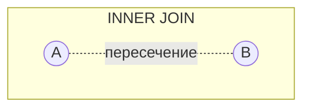

### 6.2 Что такое SELF JOIN и для каких задач он применяется? 🟡
SELF JOIN — соединение таблицы саму с собой (через два разных алиаса), используется для сравнения строк внутри одной таблицы: поиск пар сотрудник-менеджер (`employees e JOIN employees m ON e.manager_id = m.id`), поиск дубликатов, сравнение цен по периодам, построение иерархий на один уровень вглубь.
**Ресурсы:** документация СУБД — примеры self-join.

### 6.3 Чем NATURAL JOIN отличается от JOIN ... USING и JOIN ... ON, и почему NATURAL JOIN считается опасным? 🟠
NATURAL JOIN автоматически соединяет по всем одноимённым столбцам в обеих таблицах — удобно, но крайне хрупко: добавление нового столбца с совпадающим именем в любую из таблиц незаметно меняет семантику JOIN без изменения текста запроса. `JOIN ... USING(col)` явно указывает список общих столбцов для соединения (компромисс между краткостью и явностью). `JOIN ... ON` — самый явный и рекомендуемый способ, условие может быть произвольным выражением, а не только равенством одноимённых столбцов.
**Ресурсы:** Karwin, "SQL Antipatterns" — предупреждение против NATURAL JOIN.

### 6.4 Как эмулировать FULL OUTER JOIN в СУБД, которая его не поддерживает (например, старый MySQL)? 🟠
Через UNION (или UNION ALL с фильтром от дублей) LEFT JOIN и RIGHT JOIN: `SELECT * FROM A LEFT JOIN B ON ... UNION SELECT * FROM A RIGHT JOIN B ON ...`, либо `LEFT JOIN ... UNION ALL SELECT * FROM A RIGHT JOIN B ON ... WHERE a.id IS NULL` — второй запрос добавляет только "непарные" строки правой таблицы, избегая дублирования пересечения. MySQL 8.0+ по-прежнему не имеет нативного FULL OUTER JOIN, этот паттерн остаётся актуальным.
**Ресурсы:** MySQL docs — обходной путь для FULL OUTER JOIN.

### 6.5 В чём разница между JOIN-условием в ON и дополнительным условием в WHERE для OUTER JOIN? 🔴
Для INNER JOIN условие в ON и WHERE эквивалентно по результату. Для OUTER JOIN — принципиально разное поведение: условие в ON применяется до "достраивания" NULL для непарных строк (фильтрует, какие строки правой таблицы считаются совпадением, но левые строки без совпадения всё равно останутся с NULL справа). Условие в WHERE применяется после LEFT JOIN, то есть отфильтрует (уберёт) те самые NULL-строки, фактически превратив LEFT JOIN обратно в INNER JOIN — частая ошибка новичков.
**Ресурсы:** Itzik Ben-Gan, "T-SQL Querying" — глава про OUTER JOIN pitfalls.

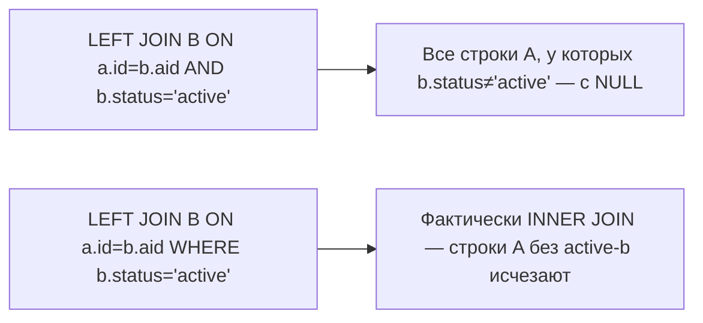

### 6.6 Как работает алгоритм Nested Loop Join и когда он эффективен? 🟠
Nested Loop Join перебирает каждую строку внешней (driving) таблицы и для каждой ищет совпадения во внутренней таблице (обычно через индекс — index nested loop). Эффективен, когда внешняя таблица маленькая (или сильно отфильтрована WHERE) и по столбцу соединения внутренней таблицы есть хороший индекс — тогда сложность близка к O(N × log M) вместо полного перебора. Плохо масштабируется, если обе таблицы большие и нет индекса (тогда сложность O(N×M)).
**Ресурсы:** Use The Index, Luke! (use-the-index-luke.com) — глава про Nested Loop Join.

### 6.7 Как работает Hash Join и когда оптимизатор его выбирает? 🟠
Hash Join строит хеш-таблицу в памяти по столбцу соединения меньшей ("build") таблицы, затем проходит по большей ("probe") таблице, ища совпадения по хешу — сложность около O(N+M), не требует индексов и не требует сортировки. Оптимизатор выбирает Hash Join, когда таблицы большие, нет полезного индекса для Nested Loop, а условие соединения — равенство (Hash Join не работает для неравенств `<`, `>`). Ограничение — требует достаточно памяти (work_mem в PostgreSQL); при нехватке памяти происходит spill на диск (grace hash join), что замедляет выполнение.
**Ресурсы:** PostgreSQL docs — Hash Join, work_mem tuning.

### 6.8 Как работает Merge Join (Sort-Merge Join)? 🟠
Merge Join требует, чтобы оба входных набора были отсортированы по ключу соединения (либо уже отсортированы благодаря индексу, либо сортируются явно), после чего оба набора проходятся параллельно "слиянием", как в merge sort — O(N log N + M log M) на сортировку либо O(N+M), если сортировка не нужна (данные уже упорядочены индексом). Эффективен для больших предварительно отсортированных наборов и хорошо подходит для равенств и неравенств, в отличие от Hash Join.
**Ресурсы:** Use The Index, Luke! — глава Sort-Merge Join.

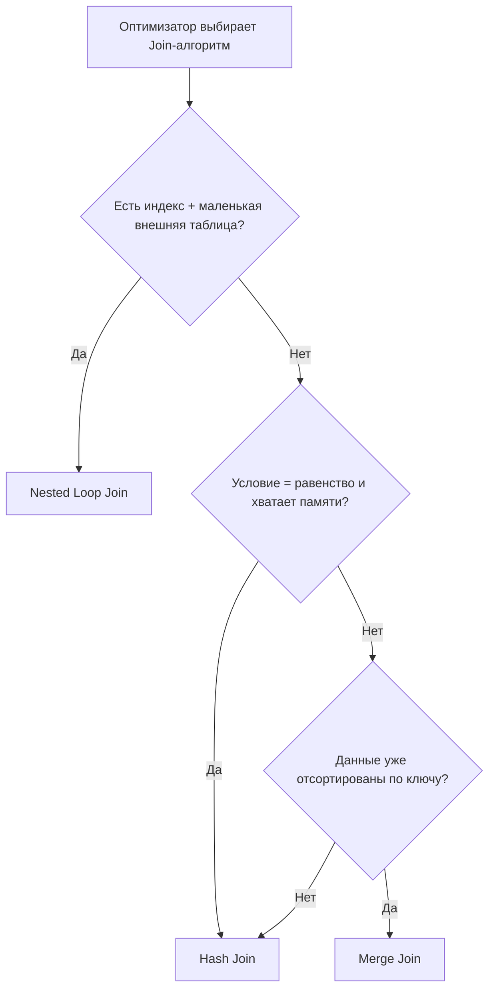

### 6.9 Что такое семи-джойн (semi-join) и анти-джойн (anti-join)? 🟠
Semi-join возвращает строки левой таблицы, для которых существует хотя бы одна совпадающая строка справа, но без дублирования и без столбцов правой таблицы — семантически это то, что делает `WHERE EXISTS (...)` или `WHERE col IN (SELECT ...)`. Anti-join — противоположность: строки левой таблицы, для которых совпадений справа НЕТ (`WHERE NOT EXISTS`, `WHERE col NOT IN (...)`, или `LEFT JOIN ... WHERE right.id IS NULL`). Оптимизаторы современных СУБД распознают эти паттерны и строят специальные физические планы (Hash Semi Join, Hash Anti Join), эффективнее наивного JOIN+DISTINCT.
**Ресурсы:** PostgreSQL EXPLAIN вывод — "Hash Semi Join" / "Hash Anti Join" ноды.

### 6.10 Почему NOT IN с подзапросом, содержащим NULL, может дать неожиданный (пустой) результат? 🔴
`WHERE col NOT IN (SELECT x FROM t)` разворачивается в `col <> v1 AND col <> v2 AND ...`. Если хотя бы одно значение `vi` в подзапросе — NULL, сравнение `col <> NULL` даёт UNKNOWN, а `TRUE AND UNKNOWN AND ...` = UNKNOWN — вся строка не проходит фильтр, независимо от остальных значений. В итоге весь NOT IN может вернуть пустой набор, даже если очевидно, что col не совпадает ни с одним "нормальным" значением. Безопасная альтернатива — `WHERE NOT EXISTS (SELECT 1 FROM t WHERE t.x = col)` или явно отфильтровать NULL в подзапросе (`WHERE x IS NOT NULL`).
**Ресурсы:** классическая статья "The Trouble with NOT IN" (множество блог-разборов на use-the-index-luke.com и pgexercises.com).

### 6.11 Как соединить три и более таблиц и в каком порядке оптимизатор их обрабатывает? 🟡
Синтаксически JOIN просто цепочкой: `A JOIN B ON ... JOIN C ON ...`. Физически оптимизатор не обязан соблюдать текстовый порядок — он строит дерево join-ов (join order), перебирая варианты (для небольшого числа таблиц — полный перебор, для большого — динамическое программирование или genetic query optimizer в PostgreSQL при > geqo_threshold таблиц), опираясь на статистику по селективности условий и размерам таблиц, чтобы минимизировать промежуточные результаты.
**Ресурсы:** PostgreSQL docs — Genetic Query Optimizer; "join order" в EXPLAIN.

### 6.12 Что такое LATERAL JOIN и когда он нужен? 🔴
LATERAL (PostgreSQL, SQL Server через APPLY, MySQL 8.0.14+) позволяет подзапросу в правой части JOIN ссылаться на столбцы из таблиц слева — то есть подзапрос выполняется "для каждой строки" левой таблицы, как коррелированный подзапрос, но с полной мощью JOIN (может возвращать несколько строк/столбцов). Классический случай: "для каждого клиента получить топ-3 последних заказа" — `FROM customers c, LATERAL (SELECT * FROM orders o WHERE o.customer_id=c.id ORDER BY created_at DESC LIMIT 3) recent_orders`.
**Ресурсы:** PostgreSQL docs — LATERAL Subqueries; SQL Server docs — CROSS APPLY/OUTER APPLY.

### 6.13 Как EXCEPT/MINUS и INTERSECT реализуют теоретико-множественные операции разности и пересечения? 🟠
INTERSECT возвращает строки, присутствующие в обоих запросах (аналог ∩). EXCEPT (PostgreSQL, SQL Server) / MINUS (Oracle) возвращает строки первого запроса, отсутствующие во втором (аналог разности множеств −). Оба по умолчанию удаляют дубликаты (как UNION), есть варианты EXCEPT ALL/INTERSECT ALL в некоторых СУБД, сохраняющие дубли с учётом кратности. Требуют одинакового числа и совместимых типов столбцов в обоих запросах, как и UNION.
**Ресурсы:** SQL Standard — Set Operators.

### 6.14 Что такое CROSS JOIN и в каких легитимных сценариях он используется (не по ошибке)? 🟡
CROSS JOIN даёт декартово произведение — каждая строка левой таблицы с каждой строкой правой (N×M строк). Легитимные применения: генерация всех комбинаций (например, все пары "размер × цвет" товара для создания вариаций), генерация календарной сетки дат × список объектов для отчёта с заполнением пропусков, joining с CTE-генератором чисел/дат (`generate_series`) для построения временных рядов без пропущенных периодов.
**Ресурсы:** PostgreSQL docs — generate_series + CROSS JOIN паттерн для fill-gaps отчётов.

### 6.15 Как отличить проблему "fan-out" (размножение строк) при JOIN с несколькими 1:N связями и как её избежать? 🔴
Fan-out возникает, когда таблица соединяется сразу с двумя независимыми 1:N-таблицами (например, `orders JOIN order_items ... JOIN order_reviews ...`, где у заказа несколько items и несколько reviews) — итоговое число строк становится произведением количеств (items × reviews), а агрегаты (SUM) по каждой ветке задваиваются/утраиваются. Решения: агрегировать каждую ветку в отдельном подзапросе/CTE до JOIN (`(SELECT order_id, SUM(qty) FROM items GROUP BY order_id)`), использовать LATERAL, либо DISTINCT-агрегацию с осторожностью, либо разделить на два независимых запроса на уровне приложения.
**Ресурсы:** статья "Fan traps" в контексте DWH-моделирования (Kimball); практические разборы на use-the-index-luke.com.


---

## 7. Подзапросы и CTE

### 7.1 Чем скалярный подзапрос отличается от табличного и от коррелированного? 🟡
Скалярный подзапрос возвращает ровно одно значение (одна строка, один столбец) и может использоваться в SELECT/WHERE как обычное выражение. Табличный (несвязанный) подзапрос возвращает набор строк/столбцов, используется во FROM или через IN/EXISTS, выполняется один раз независимо от внешнего запроса. Коррелированный подзапрос ссылается на столбцы внешнего запроса и логически выполняется заново для каждой строки внешнего запроса (хотя оптимизатор часто переписывает его в JOIN для эффективности).
**Ресурсы:** документация СУБД — Subqueries.

### 7.2 Что такое CTE (Common Table Expression) и чем он отличается от подзапроса в FROM? 🟡
CTE (`WITH cte_name AS (SELECT ...) SELECT ... FROM cte_name`) — именованный временный результат, определяемый перед основным запросом, улучшает читаемость за счёт разбиения сложного запроса на логические шаги, может переиспользоваться несколько раз в одном запросе. Функционально в большинстве современных СУБД (PostgreSQL 12+, SQL Server, MySQL 8+) CTE и подзапрос в FROM оптимизируются одинаково (инлайнятся), кроме случаев материализации.
**Ресурсы:** документация СУБД — WITH Queries (CTE).

### 7.3 Что такое materialized CTE и как PostgreSQL решает, инлайнить CTE или материализовать его? 🔴
До PostgreSQL 12 CTE всегда материализовался (выполнялся как "оптимизационный барьер" — результат сохранялся во временную структуру, отдельно от остального плана), что иногда мешало оптимизатору "протолкнуть" фильтры внутрь. С версии 12 PostgreSQL по умолчанию инлайнит CTE (как подзапрос), если он используется один раз и не рекурсивный, но позволяет явно указать `AS MATERIALIZED` для принудительного барьера (полезно, если CTE переиспользуется несколько раз — избегаем повторного вычисления) или `AS NOT MATERIALIZED` для принудительного инлайна.
**Ресурсы:** PostgreSQL 12 Release Notes — WITH queries; PostgreSQL docs — Query Language (CTE materialization).

### 7.4 Что такое рекурсивный CTE (WITH RECURSIVE) и как он выполняется? 🟠
WITH RECURSIVE состоит из "якорной" части (anchor member — базовый случай, выполняется один раз) и "рекурсивной" части (recursive member — ссылается на сам CTE), объединённых через UNION ALL. Выполнение похоже на цикл: якорь даёт начальный набор строк, рекурсивная часть применяется к результату предыдущей итерации, пока она не вернёт пустой результат. Используется для обхода иерархий (оргструктуры, категории, графы), генерации последовательностей чисел/дат.
**Ресурсы:** PostgreSQL docs — WITH RECURSIVE examples; SQL Server docs — Recursive Queries Using CTE.

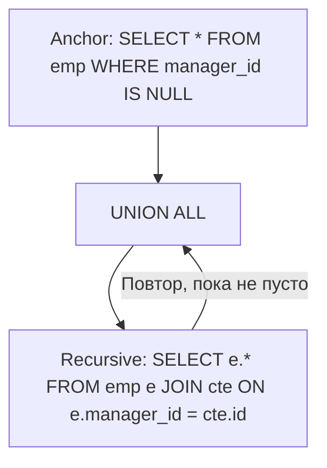

### 7.5 Как защититься от бесконечного цикла в рекурсивном CTE при циклических данных (граф с циклами)? 🟠
Добавить накопление пути (`path` массив/строка посещённых id) в CTE и условие `WHERE NOT (next_id = ANY(path))` в рекурсивной части, чтобы прервать обход при возврате в уже посещённый узел. PostgreSQL также поддерживает `CYCLE` clause (стандарт SQL:1999/2003, доступен с PostgreSQL 14) — `WITH RECURSIVE cte(...) AS (...) CYCLE id SET is_cycle USING path`, автоматически отслеживающий и помечающий циклы. Дополнительно полезно ограничить максимальную глубину рекурсии как защитный механизм.
**Ресурсы:** PostgreSQL docs — WITH RECURSIVE, CYCLE clause.

### 7.6 Чем EXISTS отличается от IN с точки зрения производительности и семантики NULL? 🟠
EXISTS проверяет только факт наличия хотя бы одной строки (СУБД может остановить сканирование подзапроса на первом совпадении — часто эффективнее для больших вложенных наборов) и не чувствителен к NULL внутри подзапроса. IN сравнивает значение со всем списком результатов подзапроса — как обсуждалось в 6.10, чувствителен к NULL в списке (может дать неожиданно пустой результат при NOT IN). Современные оптимизаторы часто переписывают IN/EXISTS в одинаковый физический план (semi-join), но для NOT IN vs NOT EXISTS разница в поведении с NULL остаётся принципиальной, а не просто оптимизационной.
**Ресурсы:** use-the-index-luke.com — "EXISTS vs IN vs JOIN".

### 7.7 Как переписать коррелированный подзапрос в JOIN и когда это ускоряет запрос? 🟠
Коррелированный подзапрос вида `SELECT * FROM orders o WHERE total > (SELECT AVG(total) FROM orders WHERE customer_id = o.customer_id)` часто можно переписать через JOIN с предварительно агрегированным подзапросом: `JOIN (SELECT customer_id, AVG(total) avg_total FROM orders GROUP BY customer_id) a ON a.customer_id = o.customer_id WHERE o.total > a.avg_total`. Хотя современные оптимизаторы (PostgreSQL, Oracle) часто сами делают такую трансформацию (subquery unnesting/decorrelation), не для всех паттернов это гарантировано — стоит проверять EXPLAIN и переписывать вручную, если план показывает построчное перевыполнение подзапроса.
**Ресурсы:** PostgreSQL EXPLAIN — сравнение планов до/после decorrelation.

### 7.8 Можно ли использовать DML (INSERT/UPDATE/DELETE) внутри CTE и зачем? 🔴
Да, в PostgreSQL поддерживаются "Data-Modifying CTE" — `WITH deleted AS (DELETE FROM orders WHERE status='cancelled' RETURNING *) INSERT INTO orders_archive SELECT * FROM deleted`. Это позволяет атомарно в одном запросе удалить строки из одной таблицы и переместить их в другую (архивирование), без отдельной транзакции из двух операторов. Важный нюанс: все CTE в одном WITH-запросе видят одно и то же "снимок" состояния данных (как в одном уровне изоляции) — второй CTE не видит промежуточных изменений первого, только через RETURNING.
**Ресурсы:** PostgreSQL docs — Data-Modifying Statements in WITH.

### 7.9 Что такое коррелированный подзапрос в SELECT-списке и почему он может быть источником проблемы N+1 на уровне SQL? 🟠
`SELECT c.name, (SELECT COUNT(*) FROM orders o WHERE o.customer_id = c.id) AS order_count FROM customers c` — логически выполняет отдельный подзапрос для каждой строки customers, аналогично проблеме N+1 запросов в ORM, только внутри одного SQL-запроса. Для больших таблиц эффективнее заменить на LEFT JOIN с предагрегированным подзапросом (`LEFT JOIN (SELECT customer_id, COUNT(*) c FROM orders GROUP BY customer_id) o ON o.customer_id=c.id`), выполняемый один раз для всех строк.
**Ресурсы:** сравнение планов EXPLAIN для скалярного подзапроса vs LEFT JOIN + GROUP BY.

### 7.10 Что такое производная таблица (derived table) и обязателен ли для неё алиас? 🟡
Производная таблица — подзапрос, используемый в предложении FROM как временный источник строк: `SELECT * FROM (SELECT ...) AS derived`. В стандарте SQL и в большинстве СУБД (обязательно в MySQL, желательно везде) производная таблица должна иметь алиас — иначе к её столбцам нельзя корректно обратиться извне, и часть парсеров просто отклонит запрос без алиаса.
**Ресурсы:** MySQL docs — Derived Tables (обязательность алиаса).

### 7.11 Как использовать CTE для "разбиения" сложного аналитического запроса на читаемые шаги (query decomposition)? 🟡
Цепочка CTE позволяет линейно описать пайплайн трансформации данных: `WITH raw AS (...), filtered AS (SELECT * FROM raw WHERE ...), aggregated AS (SELECT ... FROM filtered GROUP BY ...) SELECT * FROM aggregated WHERE ...` — каждый шаг именован и тестируем отдельно (можно временно заменить финальный SELECT на `SELECT * FROM filtered` для отладки промежуточного шага). Значительно улучшает читаемость по сравнению с глубоко вложенными подзапросами.
**Ресурсы:** практики "readable SQL" — блог Modern SQL (modern-sql.com).

### 7.12 Что такое рекурсивный CTE для генерации последовательности чисел или дат, и чем это отличается от generate_series? 🟡
Оба подхода дают числовую/датовую последовательность, но `generate_series(1, 100)` (PostgreSQL) — встроенная функция, оптимизированная и лаконичная, тогда как рекурсивный CTE (`WITH RECURSIVE seq AS (SELECT 1 n UNION ALL SELECT n+1 FROM seq WHERE n<100) SELECT * FROM seq`) — более переносимый между СУБД способ (работает и там, где нет generate_series, например SQL Server через рекурсию или MySQL 8+). Для PostgreSQL/специфичных задач generate_series почти всегда предпочтительнее по производительности и простоте.
**Ресурсы:** PostgreSQL docs — generate_series.

### 7.13 Что такое "quirky update" в контексте рекурсивных вычислений в SQL Server и почему это считается антипаттерном? 🔴
"Quirky update" — недокументированный приём в SQL Server, использующий особенность физического порядка обновления строк в UPDATE с переменной для эмуляции построчных вычислений с накоплением (running total) без курсора — работал за счёт недетерминированного, но часто предсказуемого на практике порядка сканирования. Считается антипаттерном, потому что порядок формально не гарантирован документацией Microsoft и может измениться между версиями/планами выполнения, ломая вычисления без предупреждения. Правильная замена — оконные функции (SUM() OVER (ORDER BY ...)).
**Ресурсы:** блог-разборы "Quirky Update" (Jeff Moden, SQLServerCentral) — как исторический пример, актуальность заменена оконными функциями.

### 7.14 Как ограничить видимость CTE только текущим запросом и можно ли ссылаться на CTE из другого CTE? 🟡
CTE видим только в пределах того SQL statement, в котором объявлен WITH — не сохраняется между запросами (в отличие от временных таблиц). Один CTE в цепочке WITH может ссылаться на ранее объявленные CTE в том же WITH-блоке (`WITH a AS (...), b AS (SELECT * FROM a WHERE ...)`), но не может ссылаться "вперёд" на CTE, объявленный позже него (кроме случая рекурсивной самоссылки внутри WITH RECURSIVE).
**Ресурсы:** SQL Standard — WITH Clause scoping rules.

### 7.15 Когда стоит предпочесть временную таблицу (TEMP TABLE) вместо CTE? 🟠
Временную таблицу стоит предпочесть, когда: промежуточный результат нужно переиспользовать в нескольких последующих отдельных запросах (не в одном SQL statement), нужна явная индексация промежуточных данных для ускорения последующих JOIN, объём промежуточных данных большой и материализация с оптимизатором статистики (ANALYZE на temp table) даёт заметно лучший план, чем инлайнинг CTE. CTE предпочтительнее для читаемости одного сложного запроса и когда данные не нужны повторно за пределами этого запроса.
**Ресурсы:** PostgreSQL Wiki — "CTE vs Temp Table" performance discussion.

---

## 8. Агрегация и оконные функции

### 8.1 Чем отличаются агрегатные функции (GROUP BY) от оконных функций (OVER)? 🟡
GROUP BY "схлопывает" множество строк в одну строку на группу — теряется доступ к отдельным строкам исходной группы в SELECT (кроме агрегатов и столбцов группировки). Оконная функция (`SUM(x) OVER (PARTITION BY ...)`) вычисляет агрегат для "окна" строк, но сохраняет каждую исходную строку в результате — можно одновременно видеть и деталь, и агрегат по группе в одной строке результата.
**Ресурсы:** PostgreSQL docs — Window Functions Tutorial.

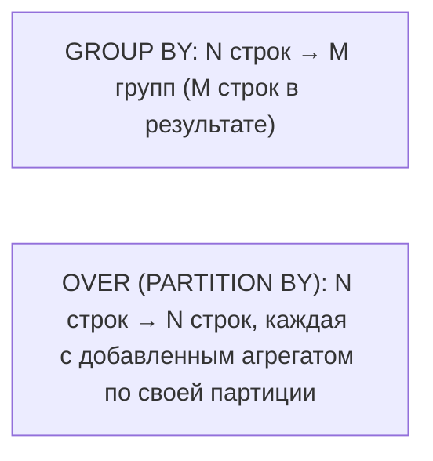

### 8.2 Что такое PARTITION BY в оконной функции и чем оно отличается от GROUP BY? 🟡
PARTITION BY делит набор строк на группы (партиции) для вычисления оконной функции внутри каждой независимо, но, в отличие от GROUP BY, не сокращает число строк результата — каждая исходная строка остаётся, просто получает значение, вычисленное в контексте своей партиции. Пример: `SELECT *, AVG(salary) OVER (PARTITION BY dept_id) FROM employees` покажет среднюю зарплату отдела рядом с каждым сотрудником, не теряя детализацию по сотрудникам.
**Ресурсы:** PostgreSQL docs — Window Function Calls.

### 8.3 Что такое frame clause (ROWS/RANGE BETWEEN) в оконных функциях? 🔴
Frame clause уточняет, какое подмножество строк внутри партиции участвует в вычислении для текущей строки — например, `ROWS BETWEEN 2 PRECEDING AND CURRENT ROW` (скользящее окно из 3 строк: текущая + 2 предыдущие по физическому порядку) или `RANGE BETWEEN INTERVAL '7 days' PRECEDING AND CURRENT ROW` (все строки со значением ORDER BY в пределах 7 дней от текущей — логический диапазон значений, а не число строк). ROWS оперирует физическими позициями строк, RANGE — логическими значениями сортировочного столбца (важно при дублирующихся значениях ORDER BY).
**Ресурсы:** PostgreSQL docs — Window Function Frame Clause; Markus Winand, "SQL Performance Explained" — Window Functions chapter.

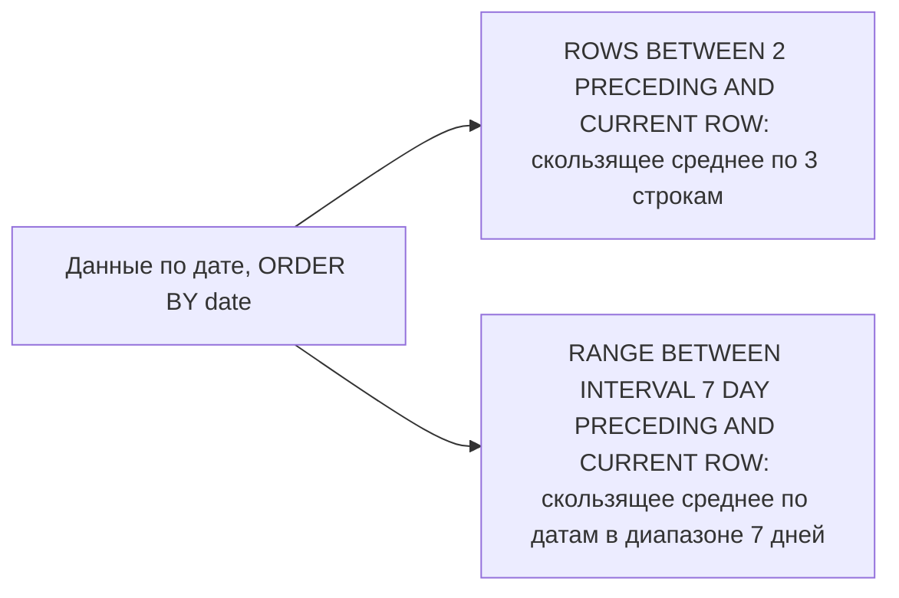

### 8.4 Чем отличаются ROW_NUMBER(), RANK() и DENSE_RANK()? 🟡
ROW_NUMBER() присваивает уникальный последовательный номер каждой строке в партиции без учёта дублей значений (1,2,3,4...). RANK() присваивает одинаковый ранг строкам с одинаковым значением ORDER BY, но "пропускает" следующие номера (1,2,2,4 — после дубля на 2 месте пропущено 3). DENSE_RANK() тоже даёт одинаковый ранг дублям, но без пропусков (1,2,2,3). Выбор зависит от бизнес-семантики: медальный зачёт обычно использует RANK() (пропуск мест), топ-N без дублей — ROW_NUMBER().
**Ресурсы:** PostgreSQL docs — Window Functions List.

### 8.5 Как найти "N-ю по величине запись в каждой группе" с помощью оконных функций (топ-N per group)? 🟠
Классический паттерн: обернуть ROW_NUMBER() OVER (PARTITION BY group_col ORDER BY value_col DESC) в CTE/подзапрос, затем отфильтровать `WHERE rn <= N` во внешнем запросе (нельзя использовать оконную функцию напрямую в WHERE того же уровня SELECT — она логически вычисляется после WHERE). Пример: топ-3 самых дорогих товара в каждой категории. Альтернатива для топ-1 конкретно — DISTINCT ON (col) ORDER BY ... (специфично для PostgreSQL, часто эффективнее).
**Ресурсы:** PostgreSQL docs — DISTINCT ON; use-the-index-luke.com — "Top-N per group".

### 8.6 Что такое LAG() и LEAD() и для каких задач они применяются? 🟡
LAG(col, n) возвращает значение столбца из строки, отстоящей на n позиций назад по ORDER BY внутри партиции; LEAD(col, n) — вперёд. Типичные применения: вычисление разницы между текущим и предыдущим значением (`price - LAG(price) OVER (ORDER BY date)` для дневного изменения цены), обнаружение "разрывов" в последовательности, сравнение с соседними по времени событиями без self-join.
**Ресурсы:** PostgreSQL docs — Window Functions, LAG/LEAD.

### 8.7 Как вычислить накопительную сумму (running total) и скользящее среднее (moving average) в SQL? 🟡
Running total: `SUM(amount) OVER (ORDER BY date ROWS BETWEEN UNBOUNDED PRECEDING AND CURRENT ROW)` (или просто `SUM(amount) OVER (ORDER BY date)` — по умолчанию frame именно такой при наличии ORDER BY). Moving average за 7 записей: `AVG(amount) OVER (ORDER BY date ROWS BETWEEN 6 PRECEDING AND CURRENT ROW)`. Оба паттерна заменяют ранее необходимые процедурные курсоры или self-join с неравенством, будучи значительно эффективнее.
**Ресурсы:** Markus Winand, "SQL Performance Explained" — практические примеры running totals.

### 8.8 Чем FIRST_VALUE()/LAST_VALUE() отличаются от MIN()/MAX() в контексте окна, и в чём частая ошибка с LAST_VALUE? 🔴
FIRST_VALUE/LAST_VALUE берут значение конкретно первой/последней строки окна по заданному ORDER BY (сохраняя её "форму", а не просто число, как MIN/MAX). Частая ошибка: `LAST_VALUE(price) OVER (ORDER BY date)` без явного frame возвращает не последнее значение партиции, а значение "текущей" строки — потому что дефолтный frame при наличии ORDER BY — `RANGE BETWEEN UNBOUNDED PRECEDING AND CURRENT ROW`, а не вся партиция. Исправление: явно указать `ROWS BETWEEN UNBOUNDED PRECEDING AND UNBOUNDED FOLLOWING`.
**Ресурсы:** известная "gotcha" — множество разборов на StackOverflow "LAST_VALUE returns wrong value"; PostgreSQL docs — Frame Clause defaults.

### 8.9 Что такое NTILE() и для каких задач он используется? 🟠
NTILE(n) делит строки партиции на n примерно равных по размеру групп (bucket-ов), пронумерованных 1..n по порядку ORDER BY — используется для квартилей/децилей/перцентилей (`NTILE(4)` — квартили), сегментации клиентов по объёму покупок, построения гистограмм распределения без внешних инструментов аналитики.
**Ресурсы:** PostgreSQL docs — Window Functions List (NTILE).

### 8.10 Что такое GROUPING SETS, ROLLUP и CUBE? 🔴
Это расширения GROUP BY для вычисления нескольких уровней агрегации одним запросом вместо UNION ALL нескольких GROUP BY. GROUPING SETS явно перечисляет нужные комбинации группировки (`GROUPING SETS ((dept, year), (dept), ())`). ROLLUP строит иерархический набор подытогов от самого детального к общему итогу (`ROLLUP(year, month, day)` → итоги по year+month+day, year+month, year, и общий итог). CUBE строит все возможные комбинации группировки (полное декартово произведение измерений) — используется для многомерных сводных таблиц (аналог OLAP-куба).
**Ресурсы:** PostgreSQL docs — GROUPING SETS, CUBE, ROLLUP; SQL Standard OLAP extensions.

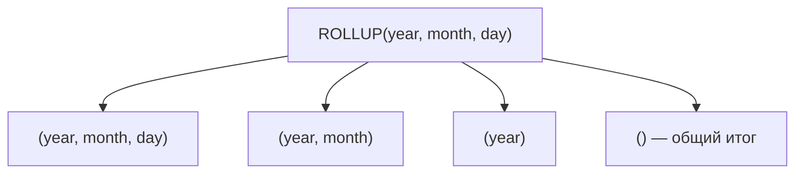

### 8.11 Как отличить строку "общего итога" при использовании ROLLUP/CUBE от строки с настоящим NULL в данных? 🔴
Обе ситуации визуально выглядят как NULL в столбце группировки, но их можно различить функцией `GROUPING(col)` — возвращает 1, если NULL в этой строке появился из-за "схлопывания" в ROLLUP/CUBE (это строка агрегата более высокого уровня), и 0, если это настоящее значение NULL из исходных данных. Пример: `SELECT dept, GROUPING(dept) AS is_total, SUM(salary) FROM emp GROUP BY ROLLUP(dept)`.
**Ресурсы:** SQL Standard — GROUPING function; PostgreSQL docs.

### 8.12 Как посчитать медиану и процентили в SQL? 🟠
Через встроенные функции упорядоченного набора (ordered-set aggregate functions): `PERCENTILE_CONT(0.5) WITHIN GROUP (ORDER BY value)` — непрерывная интерполяция (настоящая медиана с интерполяцией между соседними значениями), `PERCENTILE_DISC(0.5) WITHIN GROUP (ORDER BY value)` — дискретная версия (возвращает фактическое значение из набора). Поддерживается в PostgreSQL, Oracle, SQL Server (через отдельный синтаксис PERCENTILE_CONT как оконная/агрегатная функция). В СУБД без поддержки — эмулируется через ROW_NUMBER()/NTILE() и ручную интерполяцию.
**Ресурсы:** PostgreSQL docs — Ordered-Set Aggregate Functions (PERCENTILE_CONT/DISC).

### 8.13 Как работает FILTER clause в агрегатных функциях (PostgreSQL) и чем он лучше CASE WHEN внутри агрегата? 🟠
`COUNT(*) FILTER (WHERE status = 'paid')` эквивалентен `SUM(CASE WHEN status='paid' THEN 1 ELSE 0 END)`, но более читаем, явно декларативен и в некоторых случаях лучше оптимизируется планировщиком (особенно с несколькими условиями фильтрации разных агрегатов в одном запросе). Стандарт SQL:2003, хорошо поддержан в PostgreSQL, отсутствует в MySQL и SQL Server (там используется CASE WHEN подход).
**Ресурсы:** PostgreSQL docs — Aggregate Expressions (FILTER clause).

### 8.14 Как оконные функции соотносятся по логическому порядку выполнения с WHERE, GROUP BY, HAVING? 🔴
Оконные функции вычисляются после WHERE, GROUP BY и HAVING, но до финального ORDER BY и до DISTINCT — то есть нельзя напрямую использовать оконную функцию в WHERE/HAVING того же уровня SELECT (она ещё не вычислена на этом этапе). Чтобы отфильтровать по результату оконной функции, её нужно вычислить в подзапросе/CTE и отфильтровать во внешнем запросе (как в 8.5). Уточнённый порядок: FROM/JOIN → WHERE → GROUP BY → HAVING → **оконные функции** → SELECT DISTINCT → ORDER BY → LIMIT.
**Ресурсы:** PostgreSQL docs — The Query Language (порядок вычисления window functions).

### 8.15 Как эффективно посчитать "разрывы и острова" (gaps and islands) в последовательности с помощью оконных функций? 🔴
Классическая техника: пронумеровать строки внутри группы (`ROW_NUMBER() OVER (ORDER BY date)`), затем вычесть номер строки из значения даты/последовательности (`date - ROW_NUMBER() OVER (...) * INTERVAL '1 day'`) — для непрерывных подряд идущих дат результат вычитания будет одинаковым (константа), формируя "остров", который затем группируется через обычный GROUP BY по этой разности. Применяется для поиска непрерывных периодов активности пользователя, серий последовательных дней логина, объединения смежных диапазонов дат бронирования.
**Ресурсы:** Itzik Ben-Gan, "T-SQL Window Functions" — глава "Gaps and Islands".


---

## 9. Индексы

### 9.1 Что такое индекс и зачем он нужен? 🟡
Индекс — дополнительная структура данных (обычно B-tree), хранящая отсортированные значения одного или нескольких столбцов вместе со ссылками на физическое расположение строк (row pointer/TID), позволяющая находить строки за O(log N) вместо полного сканирования таблицы O(N). Цена — дополнительное место на диске и замедление INSERT/UPDATE/DELETE (нужно поддерживать индекс в актуальном состоянии).
**Ресурсы:** Markus Winand, "SQL Performance Explained" (use-the-index-luke.com) — фундаментальный бесплатный ресурс по теме.

### 9.2 Как устроен B-tree индекс изнутри? 🟠
B-tree (сбалансированное дерево) состоит из корневого узла, внутренних узлов и листовых узлов. Внутренние узлы хранят диапазоны значений-указателей на дочерние узлы, листовые узлы хранят отсортированные значения ключа вместе со ссылками на строки (или сами данные — в случае кластерного индекса) и связаны между собой в двусвязный список для эффективного range-scan. Дерево всегда сбалансировано — путь от корня до любого листа одинаковой длины, что даёт гарантированную сложность поиска O(log N).
**Ресурсы:** Use The Index, Luke! — глава "Anatomy of an Index".

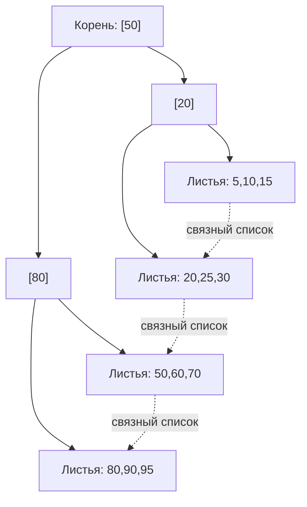

### 9.3 Чем кластерный (clustered) индекс отличается от некластерного (non-clustered / secondary)? 🟠
Кластерный индекс определяет физический порядок хранения строк на диске — данные таблицы физически отсортированы по ключу индекса, поэтому на таблицу может быть только один кластерный индекс (в MySQL InnoDB — по умолчанию это всегда PRIMARY KEY). Некластерный индекс — отдельная структура, хранящая значения ключа + указатель на строку (в InnoDB — значение PK; в SQL Server/PostgreSQL — физический row locator/CTID), поэтому таких индексов может быть много, но чтение по ним требует дополнительного перехода к таблице (bookmark/heap lookup), если не все нужные столбцы покрыты индексом.
**Ресурсы:** Use The Index, Luke! — "Clustered Index"; MySQL InnoDB docs — Clustered and Secondary Indexes.

### 9.4 Что такое PostgreSQL heap и почему в PostgreSQL нет "настоящего" кластерного индекса по умолчанию? 🟠
В PostgreSQL таблица хранится как неупорядоченная куча (heap) строк, а все индексы (включая PK) — некластерные вторичные структуры, ссылающиеся на физический адрес строки (CTID: номер страницы + номер слота). Команда `CLUSTER table USING index` может один раз физически переупорядочить heap по индексу, но это не поддерживается автоматически при последующих вставках (в отличие от MySQL InnoDB, где кластеризация по PK поддерживается постоянно).
**Ресурсы:** PostgreSQL docs — CLUSTER command; PostgreSQL docs — Database Physical Storage.

### 9.5 Что такое покрывающий индекс (covering index) и Index-Only Scan? 🟠
Покрывающий индекс включает все столбцы, необходимые запросу (и в WHERE/JOIN, и в SELECT), позволяя СУБД полностью ответить на запрос, читая только индекс — без обращения к самой таблице (heap/table lookup). Это Index-Only Scan — самый быстрый способ выполнить запрос. В PostgreSQL достигается через `CREATE INDEX ... (col1, col2) INCLUDE (col3)` (INCLUDE-столбцы хранятся в индексе, но не участвуют в сортировке/поиске — экономят место по сравнению с добавлением их в основной ключ индекса) при условии актуальной visibility map (для проверки видимости строки без чтения heap).
**Ресурсы:** PostgreSQL docs — Index-Only Scans and Covering Indexes.

### 9.6 Что такое составной (композитный) индекс и как порядок столбцов в нём влияет на его полезность? 🟠
Композитный индекс `(col1, col2, col3)` эффективен для запросов, фильтрующих по col1, или по col1+col2, или по всем трём (левый префикс, leftmost prefix rule) — но НЕ эффективен для запроса, фильтрующего только по col2 или col3 без col1 (аналогично поиску в телефонной книге по имени, отсортированной по фамилии). Правило выбора порядка столбцов: сначала столбцы с равенством (=) в частых запросах, затем столбец с диапазоном (BETWEEN, >, <) или сортировкой (ORDER BY) последним — так как после первого диапазонного условия индекс перестаёт быть полностью упорядоченным для последующих столбцов.
**Ресурсы:** Use The Index, Luke! — "The Equality-Range-Sort Rule".

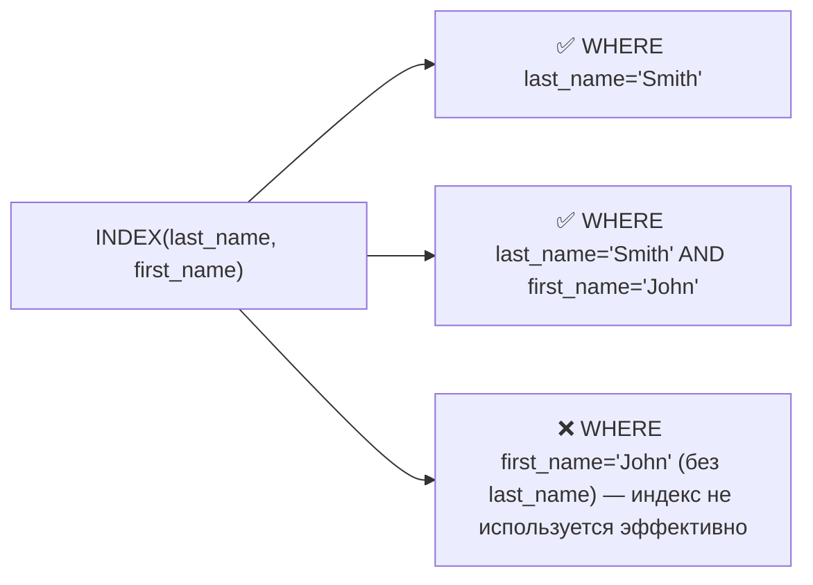

### 9.7 Что такое селективность (selectivity) индекса и как она влияет на решение оптимизатора использовать индекс? 🟠
Селективность — доля уникальных значений столбца относительно общего числа строк (высокая селективность = много уникальных значений, например email; низкая = мало уникальных значений, например boolean-флаг is_active). При низкой селективности (условие возвращает большой % строк таблицы) оптимизатор часто выбирает полное сканирование таблицы (Seq Scan) вместо индекса, потому что случайный доступ по индексу к большому числу разбросанных по диску строк дороже последовательного чтения всей таблицы целиком.
**Ресурсы:** PostgreSQL docs — planner statistics (pg_stats), n_distinct; Use The Index, Luke! — Selectivity.

### 9.8 Что такое частичный индекс (partial index) и когда он полезен? 🟠
Частичный индекс строится не по всей таблице, а только по подмножеству строк, удовлетворяющих условию WHERE в определении индекса: `CREATE INDEX ON orders (created_at) WHERE status = 'pending'`. Полезен, когда запросы почти всегда фильтруют по конкретному "рабочему" подмножеству данных (например, только необработанные заказы из миллионов исторических) — индекс получается значительно меньше, быстрее строится и обновляется, занимает меньше памяти в кеше.
**Ресурсы:** PostgreSQL docs — Partial Indexes.

### 9.9 Что такое функциональный (expression) индекс? 🟠
Индекс строится не по значению столбца напрямую, а по результату выражения/функции от него: `CREATE INDEX ON users (LOWER(email))`. Необходим, когда запросы фильтруют по преобразованному значению (`WHERE LOWER(email) = 'a@b.com'`) — обычный индекс по `email` не будет использован для такого запроса, потому что применение функции к индексированному столбцу в WHERE делает индекс бесполезным (не sargable), если только сам индекс не построен на той же функции.
**Ресурсы:** PostgreSQL docs — Indexes on Expressions.

### 9.10 Что означает термин "sargable" (Search ARGument ABLE) запрос и какие конструкции его нарушают? 🟠
Sargable-запрос — такой, где условие WHERE позволяет СУБД напрямую использовать индекс для поиска (Search Argument). Non-sargable конструкции, ломающие использование индекса: применение функции к индексируемому столбцу (`WHERE YEAR(created_at) = 2024` вместо `WHERE created_at >= '2024-01-01' AND created_at < '2025-01-01'`), неявное приведение типов (сравнение TEXT-столбца с числом), `LIKE '%text%'` с ведущим wildcard, `col + 1 > 100` вместо `col > 99`, использование `OR` вместо `UNION`/`IN` в некоторых планировщиках.
**Ресурсы:** SQL Performance Explained — "Where Clauses"; множество разборов sargability на use-the-index-luke.com.

### 9.11 Как работают индексы GiST, GIN, BRIN, Hash в PostgreSQL и когда какой выбирать? 🔴
B-tree — универсальный дефолт для равенства и диапазонов. Hash — только для точного равенства (=), компактнее B-tree для этого случая, но не поддерживает диапазоны/сортировку. GiST (Generalized Search Tree) — для геометрических данных, диапазонных типов, полнотекстового поиска, поддерживает операторы пересечения/включения (используется для EXCLUDE constraints, см. 4.8). GIN (Generalized Inverted Index) — для составных значений, где каждый элемент индексируется отдельно: массивы, JSONB, полнотекстовый поиск (tsvector) — эффективен для "содержит элемент X" запросов. BRIN (Block Range Index) — очень компактный индекс, хранящий min/max значения для блоков страниц, эффективен для очень больших таблиц с физически коррелированными с порядком вставки значениями (например, timestamp во append-only логах).
**Ресурсы:** PostgreSQL docs — Index Types (B-tree, Hash, GiST, GIN, BRIN, SP-GiST).

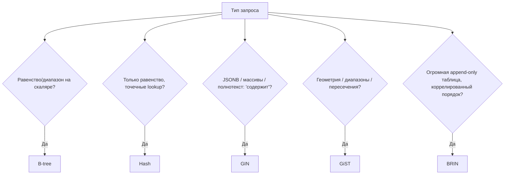

### 9.12 Почему слишком много индексов на таблице — это плохо? 🟡
Каждый индекс должен обновляться при каждом INSERT/UPDATE/DELETE, затрагивающем индексируемые столбцы — это замедляет запись пропорционально числу индексов, увеличивает объём WAL/redo-логов, занимает дополнительное дисковое пространство и память в buffer cache (вытесняя более полезные страницы данных из кеша), а также усложняет работу оптимизатора (больше вариантов планов для перебора при построении запроса, дольше планирование). Правило: индексировать осознанно под реальные паттерны запросов, периодически проверять и удалять неиспользуемые индексы (`pg_stat_user_indexes`).
**Ресурсы:** PostgreSQL docs — pg_stat_user_indexes (поиск неиспользуемых индексов).

### 9.13 Что такое фрагментация индекса (index bloat) и как с ней бороться? 🟠
Bloat — накопление "мёртвых" (устаревших после UPDATE/DELETE) записей и частично заполненных страниц в структуре индекса из-за MVCC (см. раздел 11) — индекс физически растёт, не давая пропорционального прироста полезных данных, что замедляет чтение и увеличивает потребление диска/памяти. В PostgreSQL решается через VACUUM (обычный, автоматически через autovacuum) для пометки места как переиспользуемого, либо `REINDEX`/`VACUUM FULL` для полной перестройки и физического сжатия при сильном bloat. В MySQL InnoDB — `OPTIMIZE TABLE`.
**Ресурсы:** PostgreSQL docs — Routine Vacuuming; pgstattuple extension для измерения bloat.

### 9.14 Как индекс влияет на ORDER BY и почему "индекс для сортировки" может убрать явную сортировку из плана? 🟠
Поскольку B-tree индекс физически хранит значения в отсортированном порядке, запрос с `ORDER BY col` может использовать индекс для чтения строк уже в нужном порядке (Index Scan с сохранением порядка), полностью избегая отдельного дорогого шага Sort в плане выполнения — особенно ценно в комбинации с LIMIT (не нужно сортировать всю таблицу, чтобы получить первые N строк). Для DESC-сортировки нужен либо индекс, явно созданный с DESC, либо СУБД должна уметь читать B-tree в обратном порядке (backward index scan, поддерживается в PostgreSQL).
**Ресурсы:** Use The Index, Luke! — "Sorting and Grouping".

### 9.15 В чём разница между "widest" (широким) многостолбцовым индексом и несколькими отдельными однoстолбцовыми индексами? 🔴
Отдельные однoстолбцовые индексы на разных столбцах, объединённые оптимизатором через bitmap index scan (пересечение/объединение bitmap-ов совпадающих строк по каждому индексу отдельно), — гибкое решение, работающее для разных комбинаций условий, но дороже по CPU на слияние bitmap и не даёт покрывающего индекса. Широкий составной индекс эффективнее для конкретного часто повторяющегося набора условий (быстрее, может быть covering index), но бесполезен для запросов, не совпадающих с его leftmost-префиксом (см. 9.6). Практика: строить составные индексы под самые "горячие" (частые, дорогие) запросы, полагаясь на bitmap scan для менее предсказуемых комбинаций фильтров.
**Ресурсы:** PostgreSQL docs — Combining Multiple Indexes (Bitmap Index Scan).

---

## 10. Оптимизация запросов и планы выполнения

### 10.1 Что такое EXPLAIN и чем EXPLAIN отличается от EXPLAIN ANALYZE? 🟡
EXPLAIN показывает план выполнения запроса, который оптимизатор построил на основе статистики (оценочная стоимость, ожидаемое число строк), но НЕ выполняет запрос фактически. EXPLAIN ANALYZE реально выполняет запрос и добавляет к оценкам фактические измеренные значения (реальное время выполнения каждого узла плана, реальное число строк) — что позволяет сравнить оценку с реальностью и найти узлы, где оптимизатор сильно ошибся (обычно из-за устаревшей статистики), — главный источник проблем производительности.
**Ресурсы:** PostgreSQL docs — Using EXPLAIN; explain.depesz.com / explain.dalibo.com — визуализаторы вывода EXPLAIN.

### 10.2 Что такое cost-based optimizer (CBO) и на основе чего он оценивает "стоимость" плана? 🟠
CBO выбирает физический план выполнения запроса, минимизирующий оценочную "стоимость" (условные единицы, комбинирующие ожидаемое число операций чтения диска и CPU), основываясь на статистике: количество строк в таблице, распределение значений столбцов (гистограммы), селективность условий, наличие индексов, настройки стоимости операций (`seq_page_cost`, `random_page_cost`, `cpu_tuple_cost` в PostgreSQL). Чем точнее и свежее статистика (обновляется через ANALYZE), тем точнее оценка и тем правильнее выбор плана.
**Ресурсы:** PostgreSQL docs — Planner Cost Constants; PostgreSQL docs — ANALYZE statistics.

### 10.3 Почему статистика (ANALYZE) критична для качества планов, и что происходит при устаревшей статистике? 🟠
Оптимизатор принимает решения (использовать индекс или Seq Scan, порядок JOIN, алгоритм JOIN) на основе оценки числа строк, а не реального их количества. Если статистика устарела (например, после массовой загрузки данных без ANALYZE), оценки могут быть в разы или на порядки неверны — оптимизатор может выбрать Nested Loop там, где нужен Hash Join, что превращает запрос на секунды в запрос на часы. В большинстве СУБД есть автоматический сборщик статистики (autovacuum ANALYZE в PostgreSQL, автообновление статистики в SQL Server), но при больших разовых изменениях данных стоит запускать ANALYZE вручную сразу после операции.
**Ресурсы:** PostgreSQL docs — autovacuum, ANALYZE.

### 10.4 Что такое узел Seq Scan, Index Scan, Index Only Scan, Bitmap Heap Scan в плане PostgreSQL? 🟠
Seq Scan — последовательное чтение всей таблицы страница за страницей (эффективно для малых таблиц или когда нужна большая часть строк). Index Scan — поиск по индексу с переходом к каждой строке таблицы по отдельности (эффективно для малого числа совпадений). Index Only Scan — чтение только из индекса без обращения к таблице (см. 9.5). Bitmap Heap Scan — двухэтапный подход: сначала строится "битовая карта" совпадающих страниц/строк по индексу (Bitmap Index Scan), затем страницы читаются в физическом порядке (эффективно для среднего числа совпадений — компромисс между Seq Scan и Index Scan, снижает число случайных обращений к диску).
**Ресурсы:** PostgreSQL docs — EXPLAIN output node types.

### 10.5 Что такое проблема "N+1 запросов" и как её обнаружить и исправить на уровне SQL/ORM? 🟡
N+1 возникает, когда для получения связанных данных выполняется 1 запрос на список сущностей + N дополнительных запросов (по одному на каждую сущность) для получения связанных данных — вместо одного JOIN или одного batched-запроса. Часто возникает из-за "ленивой" загрузки (lazy loading) в ORM. Обнаруживается через логирование числа запросов на бизнес-операцию, APM-инструменты, или явный подсчёт в тестах. Исправляется через eager loading (JOIN FETCH/includes/prefetch_related в зависимости от ORM) или явный batched запрос (`WHERE id IN (...)`) вместо цикла отдельных запросов.
**Ресурсы:** документация используемого ORM — раздел про eager/lazy loading.

### 10.6 Что такое параметр sniffing (parameter sniffing) в контексте кешированных планов запросов? 🔴
При первом выполнении параметризованного запроса (prepared statement) СУБД (особенно SQL Server, а также PostgreSQL при `plan_cache_mode`) может закешировать план, построенный под конкретные значения параметров первого вызова — и переиспользовать этот же план для последующих вызовов с другими значениями параметров, даже если для них оптимальный план был бы иным (например, из-за сильно разной селективности). Это может привести к неожиданно медленным запросам при "неудачном" первом вызове. Решения: подсказки force recompile для конкретных запросов, отключение generic plan caching для проблемных случаев, оптимистичное перепланирование при сильном отклонении оценки от факта.
**Ресурсы:** SQL Server docs — Parameter Sniffing; PostgreSQL docs — plan_cache_mode (generic vs custom plan).

### 10.7 Как оптимизатор решает, стоит ли использовать индекс, если выборка составляет значительную долю таблицы? 🟠
Есть эмпирическое (не строгое) правило "правила 5-10%" — если условие WHERE отбирает больше примерно 5-10% строк таблицы, случайный построчный доступ по индексу (много отдельных random I/O) становится дороже, чем просто последовательно прочитать всю таблицу целиком (Seq Scan, дешёвый последовательный I/O) — оптимизатор переключается на Seq Scan. Точный порог зависит от соотношения `random_page_cost`/`seq_page_cost`, наличия покрывающего индекса и того, насколько данные "тёплые" (в кеше памяти против чтения с диска).
**Ресурсы:** PostgreSQL docs — random_page_cost tuning; Use The Index, Luke! — "Slow Indexes, Part I".

### 10.8 Что такое SELECT * и почему это часто считается антипаттерном производительности? 🟡
`SELECT *` читает и передаёт по сети все столбцы таблицы, даже неиспользуемые, что: увеличивает объём переданных данных и I/O, не позволяет использовать Index Only Scan (нужны все столбцы, а не только индексируемые), делает запрос хрупким к изменениям схемы (добавление столбца молча меняет результат приложения), затрудняет ревью производительности запроса. Хорошая практика — явно перечислять только нужные столбцы.
**Ресурсы:** Use The Index, Luke! — "SELECT to Avoid".

### 10.9 Как влияет большой OFFSET на производительность и какие есть альтернативы (см. также 5.9)? 🟠
СУБД физически обязана вычислить и отбросить все строки до OFFSET, даже используя индекс — стоимость растёт линейно с ростом OFFSET, что критично для "дальних" страниц пагинации. Альтернативы: keyset/seek pagination (`WHERE id > :cursor ORDER BY id LIMIT N`, требует индекс на столбец курсора), курсоры на стороне СУБД (DECLARE CURSOR + FETCH) для потоковой обработки без повторного полного прохода, предвычисленные "снапшоты" номеров страниц для очень больших датасетов с редко меняющимися данными.
**Ресурсы:** use-the-index-luke.com/no-offset.

### 10.10 Что такое query rewriting/query transformation, выполняемое оптимизатором до построения физического плана? 🔴
До построения физического плана оптимизатор применяет логические преобразования, сохраняющие результат, но упрощающие/удешевляющие выполнение: predicate pushdown (протаскивание условий WHERE вглубь подзапросов/JOIN, чтобы фильтровать данные как можно раньше), constant folding (вычисление константных выражений на этапе планирования), subquery unnesting/decorrelation (превращение коррелированных подзапросов в JOIN), view inlining (разворачивание VIEW в его определение), join elimination (удаление ненужных JOIN, если их результат не влияет на итоговые столбцы при наличии FK-гарантий, см. 4.13), constraint exclusion / partition pruning (отбрасывание целых партиций, не удовлетворяющих условию).
**Ресурсы:** PostgreSQL docs — Planner/Optimizer overview; Oracle docs — Query Transformations.

### 10.11 Как диагностировать "медленный запрос" системно, а не через угадывание? 🟠
Системный подход: (1) собрать реальные метрики — pg_stat_statements (PostgreSQL) / Performance Schema (MySQL) / Query Store (SQL Server) для нахождения самых дорогих/частых запросов по суммарному времени, а не по единичным жалобам; (2) EXPLAIN ANALYZE конкретного запроса, найти узел с наибольшим расхождением между оценкой и фактом или наибольшим временем; (3) проверить статистику (ANALYZE), индексы, блокировки (не ждёт ли запрос лока); (4) проверить конфигурацию ресурсов (work_mem, shared_buffers, недостаточная память → spill на диск); (5) воспроизвести на копии с реальным объёмом данных перед изменением в проде.
**Ресурсы:** PostgreSQL docs — pg_stat_statements; "PostgreSQL Query Optimization" (Henrietta Dombrovskaya) — методология.

### 10.12 Что такое "план кэш" (plan cache / prepared statement cache) и как переиспользование плана влияет на производительность? 🟠
После первого разбора и оптимизации запроса СУБД может закешировать построенный физический план (особенно для prepared statements), чтобы избежать повторных затрат на парсинг и планирование при повторном выполнении того же запроса с другими значениями параметров. Экономит CPU на планирование, но создаёт риск parameter sniffing (10.6) — переиспользуемый план может быть неоптимален для новых значений параметров. Настраивается балансом между "generic plan" (один план на все вызовы) и "custom plan" (перепланирование под каждый набор параметров).
**Ресурсы:** PostgreSQL docs — PREPARE, plan_cache_mode.

### 10.13 Как работает оптимизация LIMIT + ORDER BY (Top-N) в физическом плане? 🟠
Вместо полной сортировки всего набора строк с последующим отсечением LIMIT-ом, оптимизатор может применить специальный алгоритм "Top-N heapsort" — поддерживает в памяти кучу (heap) размером LIMIT N, проходя по данным один раз и обновляя кучу, что даёт сложность O(M log N) вместо O(M log M) полной сортировки (где M — общее число строк, N — размер LIMIT, N << M). В плане PostgreSQL это видно как узел `Sort` с `Sort Method: top-N heapsort`.
**Ресурсы:** PostgreSQL EXPLAIN output — "top-N heapsort" в Sort Method.

### 10.14 Что такое hint (подсказка оптимизатору) и почему PostgreSQL принципиально не поддерживает query hints "из коробки"? 🔴
Query hints — явные директивы разработчика оптимизатору, какой план/индекс/алгоритм JOIN использовать (`/*+ INDEX(...) */` в Oracle/MySQL). PostgreSQL сознательно не включает hints в ядро (позиция комьюнити: hints быстро устаревают при изменении данных/статистики и превращаются в "забытый костыль", тогда как усилия сообщества лучше вкладывать в улучшение самого оптимизатора) — вместо этого предлагаются косвенные механизмы: `SET enable_seqscan=off` (грубый инструмент для отладки, не для прода), настройка cost-констант, статистики (`ALTER TABLE ... SET STATISTICS`), CTE materialization hints, расширение `pg_hint_plan` (неофициальное, сторонний плагин).
**Ресурсы:** PostgreSQL Wiki — "OptimizerHintDiscussion" (официальная позиция проекта); pg_hint_plan extension docs.

### 10.15 Как избежать проблемы "неявного приведения типов" (implicit type casting), убивающего использование индекса? 🟠
Если тип столбца в WHERE не совпадает с типом сравниваемого литерала/параметра (например, VARCHAR-столбец сравнивается с числом, или INT сравнивается со строкой), СУБД может быть вынуждена привести к общему типу весь столбец целиком, что делает индекс на этом столбце неприменимым (аналогично применению функции к столбцу, см. 9.10). Решение: следить за соответствием типов в параметризованных запросах (особенно при работе через ORM с динамической типизацией, например Python/JS, где `'123' == 123` может незаметно передаться как строка в числовой столбец), явно приводить константу, а не столбец, при необходимости.
**Ресурсы:** PostgreSQL EXPLAIN — обнаружение неявных cast в плане (`::text` появляется у столбца вместо константы).


---

## 11. Транзакции и ACID

### 11.1 Что означает аббревиатура ACID? 🟡
Atomicity (атомарность) — транзакция выполняется полностью или не выполняется вовсе (all-or-nothing). Consistency (согласованность) — транзакция переводит БД из одного валидного состояния в другое, не нарушая constraints/инварианты. Isolation (изолированность) — параллельно выполняющиеся транзакции не видят промежуточных, незафиксированных изменений друг друга (степень зависит от уровня изоляции). Durability (долговечность) — после COMMIT изменения гарантированно сохранены даже при сбое питания/краше сервера (обеспечивается через WAL/redo log с fsync).
**Ресурсы:** Härder & Reuter, "Principles of Transaction-Oriented Database Recovery" (1983, статья, впервые сформулировавшая ACID).

### 11.2 Что такое атомарность транзакции конкретно на примере, и как она реализуется физически? 🟡
Классический пример — банковский перевод: списание с одного счёта и зачисление на другой должны произойти вместе или не произойти вовсе (иначе деньги "исчезнут" или "появятся из ниоткуда" при сбое между двумя операциями). Физически атомарность обеспечивается через журнал упреждающей записи (WAL/redo log): все изменения сначала пишутся в лог, и только запись COMMIT в лог делает транзакцию необратимо зафиксированной; при откате (ROLLBACK) или крахе до COMMIT все изменения отменяются (undo) по этому же логу.
**Ресурсы:** PostgreSQL docs — Write-Ahead Logging (WAL).

### 11.3 Что означает Consistency (C) в ACID и чем это отличается от согласованности в контексте CAP-теоремы? 🟠
В ACID Consistency — это про соблюдение объявленных ограничений целостности (constraints, foreign keys, triggers) в каждом зафиксированном состоянии БД, то есть ответственность распределена между СУБД (проверка constraints) и разработчиком (корректная бизнес-логика внутри транзакции). В CAP-теореме Consistency означает нечто другое — что все узлы распределённой системы видят одинаковые (линеаризуемые) данные в любой момент времени. Совпадение термина "Consistency" в двух разных контекстах — частый источник путаницы на собеседованиях.
**Ресурсы:** Martin Kleppmann, "Designing Data-Intensive Applications", гл. 7 (явно разбирает это терминологическое пересечение).

### 11.4 Что такое Durability и какую роль в ней играет fsync? 🟠
Durability гарантирует, что данные зафиксированной (committed) транзакции переживут сбой системы (отключение питания, краш процесса). Обеспечивается тем, что перед подтверждением COMMIT клиенту СУБД гарантированно сбрасывает WAL-запись на физический диск через системный вызов fsync (а не оставляет в буфере ОС/кеше диска, который может быть потерян при отключении питания). Отключение fsync (иногда делают для тестовых сред ради скорости) полностью убивает гарантию durability — реальный риск потери данных при сбое.
**Ресурсы:** PostgreSQL docs — fsync parameter, "Reliability and the Write-Ahead Log".

### 11.5 Что такое SAVEPOINT и для чего он нужен внутри транзакции? 🟠
SAVEPOINT создаёт именованную "точку отката" внутри уже начатой транзакции — позволяет откатить (`ROLLBACK TO SAVEPOINT name`) только часть изменений транзакции, не отменяя всю транзакцию целиком, и продолжить работу дальше. Полезно для обработки ожидаемых ошибок в middle of a larger transaction (например, попытка вставки, которая может нарушить UNIQUE — при ошибке откатываемся к savepoint и пробуем альтернативный путь, не теряя остальные уже сделанные в транзакции изменения).
**Ресурсы:** PostgreSQL docs — SAVEPOINT.

### 11.6 Чем отличается неявная (autocommit) транзакция от явной (BEGIN...COMMIT)? 🟡
В режиме autocommit (по умолчанию в большинстве клиентов/СУБД) каждый отдельный SQL-оператор автоматически оборачивается в собственную транзакцию и коммитится сразу после выполнения. Явная транзакция (`BEGIN`/`START TRANSACTION` ... `COMMIT`/`ROLLBACK`) группирует несколько операторов в одну атомарную единицу — необходимо всегда, когда несколько операций должны либо все успешно применяться, либо ни одна (например, множественные UPDATE, отражающие один бизнес-факт).
**Ресурсы:** документация СУБД — Transaction Control.

### 11.7 Что такое распределённая транзакция и протокол two-phase commit (2PC)? 🔴
Распределённая транзакция охватывает несколько независимых узлов/БД (например, два разных сервера БД, или БД + очередь сообщений), которые должны либо все зафиксировать изменения, либо все откатить. 2PC координирует это через "координатора": фаза Prepare (все участники подтверждают готовность зафиксировать и переходят в состояние "готов", записывая это в свой лог) и фаза Commit (координатор рассылает финальную команду commit всем, только если ВСЕ ответили "готов" на первой фазе; иначе — rollback всем). Проблема: если координатор падает после фазы Prepare, участники "зависают" в неопределённом состоянии (blocking protocol) — эта слабость мотивировала развитие альтернатив (Saga pattern, 3PC, Paxos-based consensus).
**Ресурсы:** Kleppmann, "Designing Data-Intensive Applications", гл. 9; PostgreSQL docs — PREPARE TRANSACTION (реализация 2PC).

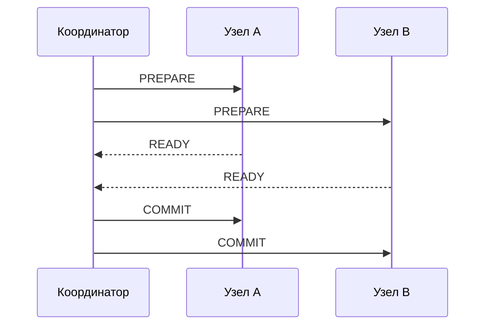

### 11.8 Что такое проблема "потерянного обновления" (lost update) и как её предотвратить? 🟠
Lost update возникает, когда две транзакции читают одно значение, обе вычисляют новое значение на основе прочитанного, и обе пишут — вторая запись "затирает" первую, теряя её эффект (классика: два одновременных `UPDATE accounts SET balance = balance - 100`, если реализовано как read-modify-write на уровне приложения, а не атомарным SQL-выражением). Решения: атомарные SQL-выражения (`UPDATE ... SET balance = balance - 100` — сама СУБД гарантирует атомарность read-modify-write на уровне строки), уровень изоляции REPEATABLE READ/SERIALIZABLE с обнаружением конфликта, явная оптимистическая блокировка через версионирование строки (столбец version/updated_at + `WHERE version = :expected`).
**Ресурсы:** Kleppmann, гл. 7 ("Lost Updates").

### 11.9 Чем оптимистическая блокировка (optimistic locking) отличается от пессимистической (pessimistic locking)? 🟠
Пессимистическая блокировка захватывает лок на строку/ресурс до начала работы с ней (`SELECT ... FOR UPDATE`), блокируя другие транзакции от параллельного изменения — эффективна при высокой вероятности конфликтов, но снижает параллелизм и рискует deadlock-ами. Оптимистическая блокировка не блокирует ничего заранее — читает данные вместе с "версией" (номер версии или timestamp), а при записи проверяет, не изменилась ли версия с момента чтения (`UPDATE ... SET ..., version = version + 1 WHERE id = ? AND version = ?`), и если 0 строк обновлено — значит был конфликт, нужно повторить операцию. Эффективна при низкой вероятности конфликтов и высоком параллелизме чтения.
**Ресурсы:** Kleppmann, гл. 7; PostgreSQL docs — SELECT FOR UPDATE.

### 11.10 Что такое идемпотентность операции и почему это важно для повторных попыток (retries) транзакций? 🟠
Идемпотентная операция даёт одинаковый результат при однократном и многократном применении (например, `SET balance = 100` идемпотентна, а `balance = balance + 100` — нет). При retry-логике на стороне клиента (сетевой таймаут, неизвестно — применилась транзакция или нет) идемпотентность критична для избежания двойного списания/начисления. Реализуется через уникальный idempotency key (сохранённый в отдельной таблице с UNIQUE-ограничением) — повторный запрос с тем же ключом обнаруживается и не применяется повторно.
**Ресурсы:** Stripe API docs — Idempotency Keys (де-факто отраслевой стандарт паттерна).

### 11.11 Что такое конфликт записи (write skew) и почему его не всегда предотвращают "обычные" уровни изоляции? 🔴
Write skew — аномалия, при которой две транзакции читают перекрывающиеся данные, каждая на основе прочитанного делает "безопасное" на первый взгляд изменение РАЗНЫХ строк, но вместе эти изменения нарушают инвариант, который ни одна транзакция по отдельности не нарушила. Классический пример: правило "минимум 1 дежурный врач должен остаться на смене" — два врача одновременно проверяют, что кроме них есть ещё хотя бы один дежурный, и оба увольняются/уходят на больничный — итог 0 дежурных. Snapshot Isolation (и даже REPEATABLE READ в некоторых СУБД) НЕ предотвращает write skew, потому что каждая транзакция изменяет только "свою" строку без прямого конфликта записи; требуется SERIALIZABLE (истинно сериализуемая изоляция) или явная блокировка (`SELECT ... FOR UPDATE` на затрагиваемые строки-инварианты).
**Ресурсы:** Kleppmann, гл. 7 ("Write Skew and Phantoms") — лучшее объяснение темы.

### 11.12 Что такое "phantom read" в контексте write skew и как SERIALIZABLE в PostgreSQL решает это через SSI? 🔴
Phantom read — ситуация, когда транзакция повторно выполняет запрос с условием WHERE и получает другой набор строк (не изменение существующих строк, а появление/исчезновение строк, попадающих под условие) из-за параллельной вставки/удаления другой транзакцией. PostgreSQL реализует истинный SERIALIZABLE через Serializable Snapshot Isolation (SSI) — алгоритм, который не блокирует заранее, а отслеживает "опасные" паттерны чтения-записи между конкурентными транзакциями и откатывает (с ошибкой сериализации) одну из них при обнаружении цикла зависимостей, который мог бы привести к неserializable результату — включая write skew и phantom-сценарии.
**Ресурсы:** PostgreSQL docs — Serializable Isolation Level (SSI); статья Cahill, Röhm, Fekete "Serializable Isolation for Snapshot Databases" (2008, основа алгоритма).

### 11.13 Что такое MVCC (Multi-Version Concurrency Control) и как она позволяет читателям не блокировать писателей? 🟠
MVCC хранит несколько версий строки одновременно (каждая версия помечена диапазоном транзакций, в котором она видима), вместо блокировки строки при чтении. Читающая транзакция видит "снимок" (snapshot) данных на момент своего старта (или каждого оператора, в зависимости от уровня изоляции), не дожидаясь завершения параллельных писателей и не блокируя их — писатель создаёт новую версию строки, не трогая старую, видимую читателям. Реализовано в PostgreSQL (через xmin/xmax системные столбцы), MySQL InnoDB (через undo log), Oracle (через undo segments).
**Ресурсы:** PostgreSQL docs — Concurrency Control (MVCC); статья "How does PostgreSQL MVCC work" (множество популярных технических блогов).

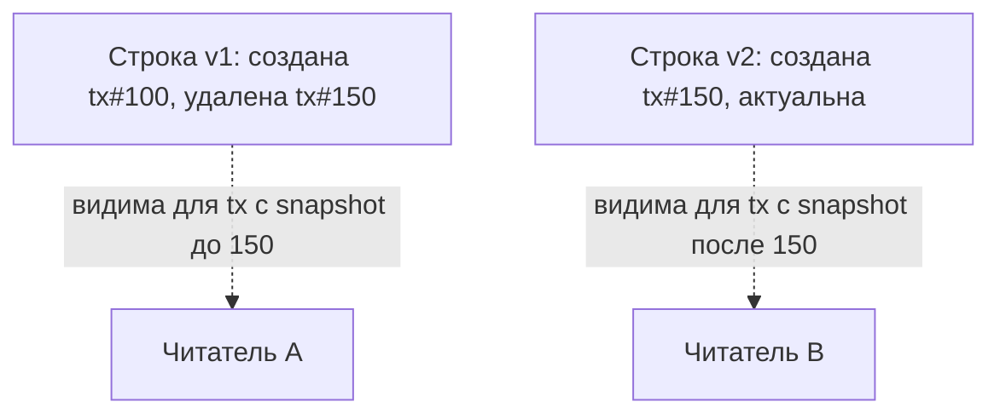

### 11.14 Что такое проблема "грязное чтение" (dirty read) и почему её обычно предотвращают даже на самом низком уровне изоляции? 🟡
Dirty read — чтение незафиксированных (uncommitted) изменений другой транзакции, которые впоследствии могут быть откачены (ROLLBACK) — то есть чтение данных, которых "формально никогда не было". Это самая опасная и наименее полезная аномалия, поэтому даже самый слабый стандартный уровень изоляции READ UNCOMMITTED крайне редко используется на практике (а некоторые СУБД, например PostgreSQL, вообще не реализуют его физически — READ UNCOMMITTED в PostgreSQL ведёт себя как READ COMMITTED).
**Ресурсы:** SQL Standard (ISO/IEC 9075) — Isolation Levels definitions.

### 11.15 Как соотносятся размер транзакции (long-running transaction) и производительность/bloat в MVCC-системах? 🔴
Долгая открытая транзакция в MVCC-системе (PostgreSQL, MySQL InnoDB) удерживает "старый" snapshot видимости — это не даёт VACUUM (PostgreSQL) или purge (InnoDB) очистить устаревшие версии строк, даже если они уже никому кроме этой долгой транзакции не нужны, потому что теоретически она ещё может их прочитать. Результат — накопление bloat (раздувание таблиц/индексов), деградация производительности всей системы, а не только самой долгой транзакции. Практическая рекомендация: держать транзакции максимально короткими, мониторить долгие/idle-in-transaction сессии (`pg_stat_activity`), настраивать `idle_in_transaction_session_timeout`.
**Ресурсы:** PostgreSQL docs — Preventing Transaction ID Wraparound Failures; статья "The dangers of long-running transactions in Postgres".

---

## 12. Уровни изоляции и блокировки

### 12.1 Какие четыре стандартных уровня изоляции определены в SQL Standard и какие аномалии они допускают? 🟠
READ UNCOMMITTED — допускает dirty read, non-repeatable read, phantom read (на практике почти нигде физически не реализован отдельно). READ COMMITTED — запрещает dirty read, но допускает non-repeatable read и phantom read (дефолт в PostgreSQL, Oracle, SQL Server). REPEATABLE READ — запрещает dirty read и non-repeatable read, формально по стандарту всё ещё допускает phantom read (дефолт в MySQL InnoDB, хотя InnoDB дополнительно частично предотвращает фантомы через next-key locking). SERIALIZABLE — запрещает все три аномалии, гарантирует результат, эквивалентный какому-то последовательному (не параллельному) порядку выполнения транзакций.
**Ресурсы:** SQL Standard Isolation Levels; PostgreSQL docs — Transaction Isolation.

```mermaid
graph TD
    A[READ UNCOMMITTED] -->|запрещает dirty read| B[READ COMMITTED]
    B -->|запрещает non-repeatable read| C[REPEATABLE READ]
    C -->|запрещает phantom read| D[SERIALIZABLE]
```

### 12.2 Что такое non-repeatable read и чем он отличается от phantom read? 🟠
Non-repeatable read — повторное чтение ОДНОЙ И ТОЙ ЖЕ строки в рамках транзакции возвращает разные значения, потому что другая транзакция успела её изменить и закоммитить между двумя чтениями. Phantom read — повторное выполнение запроса с условием (не по конкретному id, а по WHERE-диапазону) возвращает другой НАБОР строк (появились/исчезли строки), потому что другая транзакция вставила/удалила строки, попадающие под условие. Разница: non-repeatable read — про изменение существующей строки, phantom — про появление/исчезновение строк.
**Ресурсы:** Kleppmann, гл. 7.

### 12.3 Чем именно PostgreSQL REPEATABLE READ (Snapshot Isolation) отличается от "стандартного" REPEATABLE READ по SQL Standard? 🔴
PostgreSQL реализует REPEATABLE READ через Snapshot Isolation — транзакция видит консистентный снимок данных на момент своего первого запроса и не видит изменений других транзакций до своего завершения, что фактически предотвращает и non-repeatable read, И phantom read (сильнее минимальных требований стандарта для этого уровня). Однако Snapshot Isolation всё ещё допускает write skew (см. 11.11) — аномалию, которую формальный SERIALIZABLE обязан предотвращать, поэтому PostgreSQL REPEATABLE READ ≠ PostgreSQL SERIALIZABLE, хотя оба "сильнее" минимума стандарта для REPEATABLE READ.
**Ресурсы:** PostgreSQL docs — "13.2. Transaction Isolation" (явно описывает это несовпадение с классической таблицей аномалий стандарта).

### 12.4 Как MySQL InnoDB REPEATABLE READ (дефолтный уровень) предотвращает часть phantom read через next-key locking? 🔴
InnoDB в REPEATABLE READ использует комбинацию record lock (блокировка конкретной строки индекса) и gap lock (блокировка "промежутка" между значениями индекса, чтобы предотвратить вставку новых строк в этот промежуток) — вместе это называется next-key lock. Это позволяет частично предотвратить phantom read при использовании блокирующих операторов (`SELECT ... FOR UPDATE`, UPDATE, DELETE) даже на уровне REPEATABLE READ, не переходя на SERIALIZABLE — поведение, специфичное именно для InnoDB и отличающееся от других СУБД.
**Ресурсы:** MySQL docs — InnoDB Locking (Record Locks, Gap Locks, Next-Key Locks).

### 12.5 Что такое разделяемая (Shared, S) и монопольная (Exclusive, X) блокировка? 🟡
Shared lock (S) позволяет нескольким транзакциям одновременно читать заблокированный ресурс, но запрещает любой записи, пока держится хотя бы один S-лок. Exclusive lock (X) захватывается для записи, запрещает любые другие S- или X-локи на этот же ресурс до своего снятия (полная монополия). Совместимость: S+S совместимы (несколько читателей одновременно), S+X и X+X несовместимы (writer блокирует всех, и наоборот — writer ждёт, пока уйдут все readers).
**Ресурсы:** Silberschatz, гл. 15 ("Concurrency Control").

### 12.6 Что такое дедлок (deadlock) и как СУБД его обнаруживает и разрешает? 🟠
Deadlock — циклическое ожидание: транзакция A держит лок на ресурсе 1 и ждёт лок на ресурсе 2, а транзакция B держит лок на ресурсе 2 и ждёт лок на ресурсе 1 — обе никогда не продвинутся без вмешательства. СУБД периодически строит граф ожидания (wait-for graph) и при обнаружении цикла принудительно откатывает (ROLLBACK) одну из транзакций-участников (обычно ту, что "дешевле" отменить — например, сделавшую меньше работы), возвращая ей ошибку deadlock, чтобы разорвать цикл; вторая транзакция продолжает работу. Приложение должно быть готово перехватывать эту ошибку и делать retry.
**Ресурсы:** PostgreSQL docs — Deadlocks; MySQL InnoDB docs — Deadlock Detection.

```mermaid
graph LR
    TxA["Транзакция A"] -->|держит лок на| R1["Ресурс 1"]
    TxA -->|ждёт лок на| R2["Ресурс 2"]
    TxB["Транзакция B"] -->|держит лок на| R2
    TxB -->|ждёт лок на| R1
```

### 12.7 Как минимизировать вероятность deadlock на уровне дизайна приложения? 🟠
Основное правило: всегда захватывать блокировки на несколько ресурсов в одном и том же порядке во всех местах кода (например, всегда сначала блокировать строку с меньшим id, потом с большим), избегать длинных транзакций с множеством разных таблиц, минимизировать время удержания локов (делать транзакции короткими), использовать `SELECT ... FOR UPDATE SKIP LOCKED` или `NOWAIT` там, где применимо (например, очереди задач), явно ретраить транзакции при получении ошибки deadlock (это ожидаемая, а не исключительная ситуация в высоконагруженных системах).
**Ресурсы:** PostgreSQL docs — Deadlocks (рекомендации по избеганию).

### 12.8 Что такое SELECT ... FOR UPDATE, FOR SHARE, FOR UPDATE SKIP LOCKED, FOR UPDATE NOWAIT? 🟠
`FOR UPDATE` — явно захватывает эксклюзивную блокировку строк результата запроса, предотвращая их изменение другими транзакциями до конца текущей (пессимистическая блокировка для read-modify-write). `FOR SHARE` — захватывает разделяемую блокировку (защита от изменения, но не от параллельного чтения/FOR SHARE другими). `SKIP LOCKED` — пропускает строки, уже заблокированные другой транзакцией, вместо ожидания — классический паттерн для реализации очереди задач с несколькими воркерами (`SELECT * FROM jobs WHERE status='pending' FOR UPDATE SKIP LOCKED LIMIT 1`), чтобы разные воркеры не конкурировали за одну и ту же строку. `NOWAIT` — вместо ожидания сразу возвращает ошибку, если строка уже заблокирована.
**Ресурсы:** PostgreSQL docs — Explicit Locking, "FOR UPDATE/SHARE".

### 12.9 Что такое блокировка на уровне таблицы (table lock) vs блокировка на уровне строки (row lock)? 🟡
Row-level locking блокирует только конкретные затронутые строки, позволяя максимальный параллелизм (разные транзакции могут одновременно работать с разными строками одной таблицы) — стандарт для современных OLTP-нагрузок (PostgreSQL, MySQL InnoDB). Table-level locking блокирует таблицу целиком — проще реализовать, меньше накладных расходов на управление множеством мелких локов, но резко снижает параллелизм; используется для DDL-операций (ALTER TABLE) или в системах, изначально не поддерживающих row-level locking (старый MyISAM в MySQL).
**Ресурсы:** MySQL docs — сравнение InnoDB (row-level) vs MyISAM (table-level) locking.

### 12.10 Что такое advisory lock в PostgreSQL и для каких задач он применяется? 🟠
Advisory lock — блокировка, управляемая приложением по произвольному числовому ключу, не привязанная к конкретной строке/таблице — сама СУБД не проверяет её при обычных операциях, ответственность за соблюдение лежит на коде, который явно её запрашивает (`pg_advisory_lock(key)`/`pg_try_advisory_lock(key)`). Применяется для распределённой координации между инстансами приложения, не связанной напрямую с данными таблиц: например, гарантия, что только один инстанс воркера выполняет конкретную периодическую задачу (cron-подобную), или блокировка на время выполнения миграции.
**Ресурсы:** PostgreSQL docs — Advisory Locks.

### 12.11 Что такое оптимистическая конкурентность через version column (optimistic concurrency control, OCC) в деталях? 🟠
См. также 11.9. Реализация: у строки есть столбец `version INT` (или `updated_at`). Чтение возвращает данные + текущую версию. Запись выполняется условно: `UPDATE t SET data=?, version=version+1 WHERE id=? AND version=?` — если версия с момента чтения изменилась (другая транзакция уже записала), затронутых строк будет 0, приложение обнаруживает это и либо повторяет операцию с новыми данными, либо сообщает пользователю о конфликте. Не требует удержания локов в БД, хорошо масштабируется при низкой частоте конфликтов, но требует явной обработки конфликта в коде приложения (в отличие от пессимистической блокировки, где СУБД просто заставляет ждать).
**Ресурсы:** паттерн широко описан в контексте REST API (ETag/If-Match headers — HTTP-аналог того же принципа).

### 12.12 Как уровень изоляции влияет на пропускную способность (throughput) и почему более строгая изоляция не всегда "безопаснее" на практике? 🔴
Более строгие уровни изоляции (REPEATABLE READ, SERIALIZABLE) снижают параллелизм — больше конфликтов, больше откатов (в SSI-подходе PostgreSQL) или больше времени ожидания локов, что снижает throughput под высокой конкурентной нагрузкой. При этом слишком слабый уровень (READ COMMITTED без явных мер) может допускать реальные аномалии (lost update, write skew), приводящие к трудноуловимым багам целостности данных. Практический подход: использовать READ COMMITTED как дефолт для большинства операций (баланс производительности/корректности), явно повышать до SERIALIZABLE или использовать explicit locking (SELECT FOR UPDATE) только для конкретных критичных бизнес-операций, где корректность важнее throughput.
**Ресурсы:** Kleppmann, гл. 7 (итоговое сравнение trade-off изоляции и производительности).

### 12.13 Что такое двухфазная блокировка (Two-Phase Locking, 2PL) как теоретическая основа сериализуемости через блокировки? 🔴
2PL — протокол, гарантирующий сериализуемость через блокировки: транзакция делится на фазу роста (growing phase — можно только захватывать новые локи, не освобождая) и фазу сжатия (shrinking phase — можно только освобождать локи, не захватывая новые), причём после первого освобождения лока новые локи брать нельзя. Строгий вариант (Strict 2PL) требует держать все локи до самого конца транзакции (до COMMIT/ROLLBACK), что и реализовано практически во всех промышленных СУБД для write-локов — это теоретическая основа того, почему блокировки, взятые транзакцией, освобождаются только при её завершении, а не раньше.
**Ресурсы:** Silberschatz, гл. 15.4 ("Two-Phase Locking Protocol").

### 12.14 Как долгие транзакции с открытыми блокировками влияют на другие сессии, и как это диагностировать? 🟠
Долгая транзакция, удерживающая X-lock на часто используемых строках, блокирует все остальные транзакции, пытающиеся изменить (а иногда и прочитать, в зависимости от уровня изоляции и типа лока) эти же строки — они встают в очередь ожидания, что может каскадно вызвать таймауты по всей системе при высокой нагрузке ("lock convoy"). Диагностика: `pg_stat_activity` + `pg_locks` в PostgreSQL (найти blocking_pid через рекурсивный self-join по `pg_locks`), `SHOW ENGINE INNODB STATUS` в MySQL (секция LATEST DETECTED DEADLOCK / TRANSACTIONS), APM/мониторинг длительности транзакций.
**Ресурсы:** PostgreSQL Wiki — "Lock Monitoring" (готовые запросы для поиска блокирующих сессий).

### 12.15 Что такое "starvation" (голодание) в контексте конкурентного доступа и чем оно отличается от deadlock? 🔴
Deadlock — транзакции взаимно блокируют друг друга навсегда (обнаруживается и разрешается принудительным откатом). Starvation — транзакция технически может в итоге получить нужный ресурс, но систематически "оттесняется" другими транзакциями с более высоким приоритетом или более удачным таймингом, и ждёт неограниченно долго (например, если СУБД или планировщик локов отдаёт приоритет более "коротким" запросам, длинная транзакция может годами не получить свой шанс под высокой нагрузкой). Решение — политики честного разрешения очереди (FIFO для ожидающих локов, что и реализовано в большинстве СУБД), тайм-ауты с последующим retry.
**Ресурсы:** Silberschatz, гл. 15 (обсуждение starvation vs deadlock в контексте lock scheduling).


---

## 13. Views, Materialized Views, процедуры и функции

### 13.1 Что такое обычное представление (VIEW) и как оно выполняется физически? 🟡
VIEW — сохранённый именованный SELECT-запрос, не хранящий данные физически: при обращении к VIEW СУБД подставляет (инлайнит) его определение в основной запрос и оптимизирует как единое целое. Используется для инкапсуляции сложной логики (упрощение доступа для потребителей), ограничения видимых столбцов/строк (security через view вместо прямого доступа к таблице), обеспечения обратной совместимости при изменении схемы нижележащих таблиц.
**Ресурсы:** документация СУБД — CREATE VIEW.

### 13.2 Чем materialized view отличается от обычного view? 🟠
Materialized view физически хранит результат запроса на диске (как обычная таблица) на момент последнего обновления, а не пересчитывает его при каждом обращении — чтение очень быстрое (просто SELECT из готовых данных), но данные могут быть устаревшими до следующего REFRESH. Обычный view всегда актуален (выполняется заново каждый раз), но может быть медленным для сложных агрегаций по большим таблицам. Выбор — trade-off между свежестью данных и скоростью чтения.
**Ресурсы:** PostgreSQL docs — Materialized Views; Oracle docs — Materialized View Concepts.

```mermaid
graph LR
    A[VIEW] -->|каждый SELECT| B[Заново выполняет запрос к базовым таблицам]
    C[MATERIALIZED VIEW] -->|REFRESH| D[Физически хранит результат]
    C -->|SELECT| E[Читает готовые данные мгновенно]
```

### 13.3 Что такое CONCURRENTLY при REFRESH MATERIALIZED VIEW и зачем это нужно? 🟠
`REFRESH MATERIALIZED VIEW view_name` по умолчанию блокирует чтение из view на время пересчёта (эксклюзивная блокировка) и требует полного пересчёта с нуля. `REFRESH MATERIALIZED VIEW CONCURRENTLY view_name` (PostgreSQL) пересчитывает данные в теневую копию и атомарно подменяет, не блокируя параллельные SELECT-ы, но требует наличия UNIQUE-индекса на materialized view и занимает больше ресурсов (сравнение старой/новой версии построчно).
**Ресурсы:** PostgreSQL docs — REFRESH MATERIALIZED VIEW.

### 13.4 Что такое updatable view и какие ограничения на возможность UPDATE/INSERT через view? 🟠
Простой view (без JOIN, GROUP BY, DISTINCT, агрегатов, оконных функций, UNION — основанный на одной таблице) обычно автоматически "обновляемый" (updatable) — INSERT/UPDATE/DELETE через него транслируются в изменения базовой таблицы. Сложные view (с JOIN нескольких таблиц, агрегацией) по умолчанию не обновляемы напрямую средствами СУБД, либо обновляемы только частично (в PostgreSQL можно определить `INSTEAD OF` триггер, явно описывающий, как транслировать DML-операцию над view в операции над базовыми таблицами).
**Ресурсы:** PostgreSQL docs — Updatable Views, INSTEAD OF Triggers; SQL Standard — updatable view rules.

### 13.5 Что такое WITH CHECK OPTION для view и зачем оно нужно? 🟠
`CREATE VIEW active_users AS SELECT * FROM users WHERE is_active=true WITH CHECK OPTION` запрещает через этот view вставлять/обновлять строки так, чтобы результат перестал удовлетворять условию WHERE самого view (например, нельзя через этот view создать пользователя с `is_active=false`, хотя это возможно напрямую через таблицу users). Полезно для view, используемых как "ограниченный интерфейс" для приложения/роли с меньшими правами, чтобы гарантировать соблюдение бизнес-инварианта именно через этот канал доступа.
**Ресурсы:** PostgreSQL docs — CREATE VIEW ... WITH CHECK OPTION.

### 13.6 Чем хранимая процедура (STORED PROCEDURE) отличается от пользовательской функции (FUNCTION)? 🟡
Функция обычно должна возвращать значение и может использоваться внутри SELECT-выражения (`SELECT my_func(col) FROM t`), не может напрямую управлять транзакциями (COMMIT/ROLLBACK внутри неё, за редкими исключениями). Процедура вызывается отдельным оператором (`CALL my_proc(...)`), не обязана возвращать значение (может возвращать несколько результирующих наборов или out-параметры), и в некоторых СУБД (PostgreSQL начиная с 11) может явно управлять транзакциями внутри своего тела (COMMIT/ROLLBACK), что функциям не разрешено.
**Ресурсы:** PostgreSQL docs — CREATE PROCEDURE vs CREATE FUNCTION.

### 13.7 Какие плюсы и минусы у бизнес-логики в хранимых процедурах против бизнес-логики в коде приложения? 🟠
Плюсы хранимых процедур: меньше сетевых round-trip-ов (вся логика выполняется рядом с данными), гарантия единого поведения независимо от того, какой сервис/язык обращается к БД, возможность более тонкого контроля прав доступа (GRANT EXECUTE вместо прямого доступа к таблицам). Минусы: сложнее тестировать и версионировать вне обычных CI/CD-пайплайнов приложения, "размазывание" бизнес-логики между кодом приложения и БД усложняет понимание системы, сложнее горизонтально масштабировать логику независимо от БД, специфичный для СУБД синтаксис (PL/pgSQL, T-SQL) снижает переносимость и портит "vendor lock-in". Решение обычно зависит от команды/организации, а не является универсально правильным.
**Ресурсы:** дискуссии "stored procedures vs application logic" — устоявшаяся тема архитектурных споров, нет единого "правильного" ответа в индустрии.

### 13.8 Что такое SECURITY DEFINER vs SECURITY INVOKER для функций/процедур? 🔴
SECURITY INVOKER (по умолчанию) — функция выполняется с правами доступа пользователя, который её вызвал. SECURITY DEFINER — функция выполняется с правами пользователя, который её создал (владельца), независимо от того, кто её вызывает — позволяет дать ограниченному пользователю доступ к операции, требующей более высоких привилегий, без прямой выдачи этих привилегий (например, функция для сброса пароля, которой нужен доступ к защищённой таблице, вызываемая обычным пользователем). Требует осторожности — потенциальный вектор эскалации привилегий при небрежном написании (например, если внутри используются нефиксированные имена схем, уязвимо к search_path атакам).
**Ресурсы:** PostgreSQL docs — SECURITY DEFINER Functions (включая предупреждения про search_path).

### 13.9 Что такое CTE vs VIEW vs хранимая функция с точки зрения переиспользования логики? 🟠
CTE переиспользуемо только внутри одного запроса. VIEW переиспользуемо между разными запросами/приложениями, хранится в схеме БД как объект, но остаётся "просто SELECT" без параметров (кроме WHERE-фильтрации снаружи). Хранимая функция (особенно table-returning function, `RETURNS TABLE` /`RETURNS SETOF`) даёт параметризуемое переиспользование — можно передавать аргументы, что невозможно в обычном view без дополнительных ухищрений (например, использования session-переменных или конвенции "view + WHERE").
**Ресурсы:** PostgreSQL docs — Set-Returning Functions (RETURNS TABLE / SETOF).

### 13.10 Что такое партиционированное представление (partitioned view) в контексте старых версий MySQL/SQL Server до нативного партиционирования? 🔴
До появления нативного table partitioning в некоторых СУБД использовался паттерн: несколько отдельных физических таблиц (например, по одной на месяц/год) объединялись через `UNION ALL` внутри одного VIEW с CHECK-ограничениями на каждой таблице, гарантирующими непересекающиеся диапазоны — оптимизатор мог применить partition pruning на основе этих CHECK-ограничений (constraint exclusion), не сканируя таблицы, заведомо не содержащие нужный диапазон. Сегодня это в основном заменено нативным декларативным партиционированием (PostgreSQL PARTITION BY, MySQL PARTITION BY), но паттерн полезен понимать для legacy-систем.
**Ресурсы:** PostgreSQL docs — историческое "Partitioning by inheritance and constraint exclusion" (до появления PARTITION BY в v10).

### 13.11 Как versioning (управление изменениями) хранимых процедур/функций встраивается в CI/CD процесс? 🟠
Практики: хранить DDL функций/процедур как обычные файлы миграций в системе контроля версий (Flyway, Liquibase, golang-migrate, Alembic и т.п.), использовать `CREATE OR REPLACE FUNCTION` для идемпотентных обновлений в миграциях, писать unit/integration тесты, вызывающие функции напрямую через тестовую БД (pgTAP для PostgreSQL — специализированный TAP-фреймворк тестирования на уровне SQL), избегать прямых ручных изменений в проде в обход миграционного пайплайна.
**Ресурсы:** pgTAP docs (pgtap.org); Flyway/Liquibase docs — управление версионированием схемы БД.

### 13.12 Что такое table-valued function (TVF) и чем она полезнее скалярной функции, вызываемой построчно? 🟠
Table-valued function возвращает набор строк (таблицу), может использоваться прямо в предложении FROM как обычная таблица, в том числе с JOIN/LATERAL и параметрами. В отличие от скалярной функции, вызываемой для каждой строки в SELECT-списке (что часто приводит к построчному, немасштабируемому выполнению — своего рода "скрытый N+1" внутри одного запроса), TVF позволяет оптимизатору обработать её как единый источник данных, что часто даёт значительно лучшую производительность для сложной построчной логики, применяемой к множеству строк.
**Ресурсы:** PostgreSQL docs — CREATE FUNCTION ... RETURNS TABLE.

### 13.13 Как view влияет на возможность оптимизатора "видеть насквозь" (view inlining) при построении плана? 🔴
Простой view (не содержащий агрегатов, LIMIT, DISTINCT, рекурсии — то, что можно чисто механически "развернуть") обычно инлайнится оптимизатором в основной запрос, как если бы его текст был вставлен напрямую — предикаты внешнего запроса могут "протолкнуться" (predicate pushdown) внутрь определения view, что позволяет использовать индексы базовых таблиц эффективно. Сложные view с ограничивающими конструкциями (например, содержащие оконные функции или LIMIT внутри) могут стать "оптимизационным барьером" — СУБД вынуждена материализовать промежуточный результат view полностью до применения внешних фильтров, что может резко ухудшить производительность.
**Ресурсы:** PostgreSQL docs — "Query Planning" (обсуждение view flattening).

### 13.14 Чем recursive VIEW отличается от WITH RECURSIVE CTE, и поддерживается ли рекурсия в VIEW напрямую? 🔴
Стандарт SQL и PostgreSQL позволяют определить `CREATE RECURSIVE VIEW` как синтаксический сахар, эквивалентный view, тело которого — `WITH RECURSIVE`-запрос — то есть по сути это просто способ сохранить рекурсивный CTE-запрос как постоянный именованный объект схемы для многократного переиспользования, семантика вычисления полностью идентична обычному WITH RECURSIVE.
**Ресурсы:** PostgreSQL docs — CREATE VIEW, "Recursive View".

### 13.15 Что такое DDL внутри транзакции (транзакционный DDL) и как PostgreSQL здесь отличается от MySQL? 🟠
PostgreSQL поддерживает полностью транзакционный DDL — `CREATE TABLE`, `ALTER TABLE`, `DROP TABLE` можно обернуть в BEGIN...COMMIT/ROLLBACK вместе с обычными DML-операциями, и при ROLLBACK структурные изменения тоже отменятся. MySQL (и многие другие СУБД) не поддерживают это в полной мере — DDL-операторы часто вызывают неявный commit текущей транзакции (implicit commit) до и/или после себя, что делает невозможным откат DDL вместе с окружающими DML-операциями и требует особой осторожности при написании миграций, содержащих смесь DDL и DML.
**Ресурсы:** PostgreSQL docs — "DDL is Transactional"; MySQL docs — "Statements That Cause an Implicit Commit".

---

## 14. Триггеры

### 14.1 Что такое триггер (TRIGGER) и какие бывают типы по времени срабатывания? 🟡
Триггер — код (обычно на PL/pgSQL, PL/SQL, T-SQL), автоматически выполняемый СУБД в ответ на DML-событие (INSERT/UPDATE/DELETE) над таблицей. По времени срабатывания: BEFORE (выполняется до применения изменения — может модифицировать вставляемые/обновляемые данные через NEW, или отменить операцию через RAISE EXCEPTION), AFTER (выполняется после применения — данные уже физически изменены, используется для каскадных эффектов, аудита, уведомлений), INSTEAD OF (только для VIEW — заменяет саму DML-операцию собственной логикой, см. 13.4).
**Ресурсы:** PostgreSQL docs — CREATE TRIGGER; SQL Standard Triggers.

### 14.2 Чем ROW-level триггер отличается от STATEMENT-level триггера? 🟠
ROW-level триггер (`FOR EACH ROW`) выполняется отдельно для каждой затронутой строки, имеет доступ к NEW/OLD значениям конкретно этой строки — используется, когда логика зависит от данных строки. STATEMENT-level триггер (`FOR EACH STATEMENT`) выполняется один раз на весь SQL-оператор, независимо от числа затронутых строк — не имеет прямого построчного доступа к NEW/OLD (в PostgreSQL 10+ доступен через `REFERENCING NEW TABLE/OLD TABLE` — transition tables, дающие доступ ко всем изменённым строкам сразу как к временной таблице), эффективнее для логики, не зависящей от конкретных значений строк (например, инвалидация общего кеша после любого изменения таблицы).
**Ресурсы:** PostgreSQL docs — Overview of Trigger Behavior (Row vs Statement, Transition Tables).

### 14.3 Как NEW и OLD используются в разных типах DML-триггеров? 🟡
В INSERT-триггере доступен только NEW (вставляемая строка), OLD не существует. В DELETE-триггере доступен только OLD (удаляемая строка), NEW не существует. В UPDATE-триггере доступны оба: OLD — значения до изменения, NEW — значения после. В BEFORE-триггере можно модифицировать NEW перед фактической записью (например, автоматически проставить `updated_at = now()`); в AFTER-триггере NEW уже отражает финально сохранённое состояние, но его изменение не повлияет на уже выполненную запись.
**Ресурсы:** PostgreSQL docs — PL/pgSQL Trigger Procedures.

### 14.4 Для каких типичных задач применяются триггеры? 🟡
Аудит изменений (запись истории изменений в отдельную audit-таблицу), поддержание денормализованных агрегатов (обновление счётчика/суммы в родительской таблице при изменении дочерних строк), обеспечение сложных бизнес-инвариантов, которые невозможно выразить через CHECK/FK (например, кросс-табличные проверки), автоматическое проставление служебных полей (updated_at, created_by), каскадная синхронизация денормализованных копий данных между таблицами.
**Ресурсы:** PostgreSQL docs — Trigger examples (audit log pattern).

### 14.5 Какие риски и недостатки у чрезмерного использования триггеров? 🟠
"Скрытая" логика — поведение при простом INSERT/UPDATE может быть неочевидно без явного просмотра определения триггеров, что усложняет отладку и понимание системы (magic behavior). Каскад триггеров (триггер на таблице A вызывает изменение таблицы B, у которой свой триггер, вызывающий изменение таблицы C...) может стать труднопрослеживаемым и создавать неожиданные циклы или сильно замедлять массовые операции (bulk INSERT с ROW-level триггером выполняет триггер на каждую из миллионов строк). Рекомендация: использовать триггеры точечно и документированно, для действительно кросс-cutting инвариантов, а не как основной механизм бизнес-логики.
**Ресурсы:** статьи "why triggers are considered harmful" — распространённая, хотя и не безусловная позиция в инженерном сообществе.

### 14.6 Как реализовать таблицу аудита (audit log) через AFTER-триггер? 🟠
Стандартный паттерн: `CREATE TRIGGER audit_trigger AFTER INSERT OR UPDATE OR DELETE ON orders FOR EACH ROW EXECUTE FUNCTION log_change()`, где функция `log_change()` определяет тип операции через `TG_OP` (специальную переменную PL/pgSQL: 'INSERT'/'UPDATE'/'DELETE'), сериализует OLD/NEW (часто через `row_to_json`/`to_jsonb`) и вставляет запись в отдельную `audit_log(table_name, operation, old_data, new_data, changed_at, changed_by)`. Это даёт полную, гарантированную на уровне БД историю изменений, независимую от того, какое приложение/сервис инициировало изменение.
**Ресурсы:** PostgreSQL Wiki — "Audit trigger 91plus" (готовый эталонный пример реализации).

```mermaid
sequenceDiagram
    participant App as Приложение
    participant Tbl as orders
    participant Trg as AFTER триггер
    participant Log as audit_log
    App->>Tbl: UPDATE orders SET status='shipped'
    Tbl->>Trg: срабатывает FOR EACH ROW
    Trg->>Log: INSERT (old_data, new_data, changed_at)
```

### 14.7 Что такое TG_OP, TG_TABLE_NAME и другие специальные переменные внутри триггерной функции PostgreSQL? 🟠
PL/pgSQL внутри тела триггерной функции предоставляет специальные переменные: `TG_OP` (тип операции: INSERT/UPDATE/DELETE/TRUNCATE), `TG_TABLE_NAME`/`TG_TABLE_SCHEMA` (имя и схема таблицы, на которой сработал триггер — полезно для одной универсальной функции, применённой к нескольким таблицам), `TG_WHEN` (BEFORE/AFTER/INSTEAD OF), `TG_LEVEL` (ROW/STATEMENT), `TG_ARGV`/`TG_NARGS` (аргументы, переданные при CREATE TRIGGER). Это позволяет писать одну переиспользуемую generic-функцию (например, `set_updated_at()`), навешиваемую на множество разных таблиц без дублирования кода.
**Ресурсы:** PostgreSQL docs — PL/pgSQL Trigger Procedures (Special Variables).

### 14.8 Как избежать бесконечной рекурсии триггеров, если триггер сам модифицирует свою же таблицу? 🔴
Если BEFORE/AFTER триггер на таблице A выполняет UPDATE над той же таблицей A, это снова вызывает срабатывание того же триггера — риск бесконечного цикла. Защита: проверка условия внутри триггера, предотвращающая повторный вход (например, флаг/сравнение, что новое значение действительно отличается от текущего, прежде чем делать UPDATE), использование `pg_trigger_depth()` для проверки глубины вложенности и явного выхода при превышении разумного порога, либо архитектурный пересмотр — вынесение логики из AFTER-триггера, модифицирующего ту же таблицу, в BEFORE-триггер, который просто меняет NEW напрямую (не требует отдельного UPDATE, не вызывает рекурсии).
**Ресурсы:** PostgreSQL docs — pg_trigger_depth().

### 14.9 Как порядок срабатывания нескольких триггеров одного типа на одной таблице определяется в PostgreSQL? 🟠
Если на таблице определено несколько триггеров одного типа (например, несколько BEFORE INSERT), они выполняются в алфавитном порядке имени триггера (а не порядке создания!) — поэтому явные конвенции именования (`01_validate`, `02_normalize`, `03_audit`) часто используются намеренно, чтобы гарантировать предсказуемый и явный порядок выполнения, если порядок имеет значение для бизнес-логики.
**Ресурсы:** PostgreSQL docs — CREATE TRIGGER, "Trigger Execution Order".

### 14.10 Можно ли отключить триггеры временно (например, при массовой загрузке данных) и как? 🟠
Да: `ALTER TABLE table_name DISABLE TRIGGER trigger_name` (или `DISABLE TRIGGER ALL` для всех триггеров на таблице), с последующим `ENABLE TRIGGER` после завершения массовой операции. Полезно при bulk-загрузках, миграциях данных или восстановлении из бэкапа, где триггеры (аудит, каскадные обновления) либо не нужны, либо радикально замедляют операцию, либо должны быть применены отдельным batch-процессом после загрузки, а не построчно.
**Ресурсы:** PostgreSQL docs — ALTER TABLE DISABLE/ENABLE TRIGGER.

### 14.11 В чём разница между реализацией "мягкого удаления" (soft delete) через триггер vs через явную бизнес-логику приложения? 🟠
Soft delete (пометка `deleted_at`/`is_deleted` вместо физического удаления) можно реализовать: (1) полностью в коде приложения (все DELETE-запросы заменяются на UPDATE) — прозрачно, но требует дисциплины во всех местах кода и не защищает от прямых ручных DELETE в БД; (2) через `BEFORE DELETE` триггер, который отменяет фактическое удаление (`RAISE EXCEPTION` или просто не даёт INSTEAD OF выполнить физический DELETE через VIEW) и вместо этого делает UPDATE deleted_at — гарантированно работает независимо от источника запроса, но "магически" меняет ожидаемое поведение DELETE, что может путать разработчиков, ожидающих реального удаления.
**Ресурсы:** обсуждения паттерна soft delete в контексте GDPR-требований (иногда конфликтует с "правом на забвение").

### 14.12 Что такое CONSTRAINT TRIGGER в PostgreSQL и чем он отличается от обычного триггера? 🔴
CONSTRAINT TRIGGER — специальная разновидность AFTER-триггера, которая, в отличие от обычного, может быть DEFERRABLE (см. 4.9) — то есть отложена до конца транзакции, а не выполняться немедленно после каждого оператора. Полезен для реализации сложных кросс-табличных constraint-подобных проверок (то, что нельзя выразить через обычный CHECK/FK/EXCLUDE), которые допустимо временно нарушать в середине транзакции, но обязательно должны выполняться к моменту COMMIT.
**Ресурсы:** PostgreSQL docs — CREATE TRIGGER, "CONSTRAINT" clause.

### 14.13 Как триггеры взаимодействуют с массовыми (bulk) операциями и MERGE/UPSERT? 🟠
ROW-level триггер выполняется для каждой затронутой строки независимо от того, вызвана ли она одиночным INSERT или INSERT из тысяч строк (`INSERT INTO ... SELECT ...`) — при массовых операциях это может стать узким местом производительности (тысячи вызовов функции PL/pgSQL вместо одной операции). STATEMENT-level триггер с transition tables (`REFERENCING NEW TABLE AS new_rows`) — более эффективная альтернатива для bulk-сценариев, позволяющая обработать все изменённые строки одним batch-запросом внутри триггера вместо построчной обработки.
**Ресурсы:** PostgreSQL docs — Transition Tables (REFERENCING).

### 14.14 Может ли BEFORE-триггер предотвратить выполнение операции полностью, и как? 🟡
Да — BEFORE-триггер может вернуть NULL вместо NEW (для ROW-level триггера) — это молча пропускает операцию для конкретной строки без ошибки (СУБД просто не выполняет запись для этой строки, как будто её не было в результате оператора), либо явно вызвать `RAISE EXCEPTION` — это прерывает весь оператор (и, если не перехвачено, всю транзакцию) с ошибкой, видимой вызывающему коду. Выбор между "молчаливым пропуском" и явной ошибкой зависит от того, должен ли вызывающий код узнать о том, что операция была заблокирована бизнес-правилом.
**Ресурсы:** PostgreSQL docs — PL/pgSQL Trigger Procedures (return value semantics).

### 14.15 Как соотносятся триггеры и генерируемые столбцы (GENERATED ALWAYS AS) для поддержания вычисляемых/денормализованных значений? 🟠
Для простых вычислений, зависящих только от других столбцов ТОЙ ЖЕ строки, `GENERATED ALWAYS AS (STORED)` (см. 5.6) предпочтительнее триггера — декларативнее, эффективнее, гарантированно консистентно, не требует ручного написания и поддержки процедурного кода. Триггер необходим, когда логика сложнее: зависит от данных ДРУГИХ таблиц/строк (например, обновление суммы заказа в родительской таблице при изменении дочерних order_items), требует side-эффектов (запись в audit log), или включает условную логику, невыразимую одним SQL-выражением.
**Ресурсы:** PostgreSQL docs — Generated Columns vs Triggers (сравнение применимости).


---

## 15. Партиционирование и шардинг

### 15.1 Что такое партиционирование таблицы и зачем оно нужно? 🟡
Партиционирование разбивает одну логическую таблицу на несколько физических частей (партиций) по определённому правилу, оставаясь при этом одной таблицей с точки зрения запросов. Цели: ускорение запросов через partition pruning (сканирование только нужных партиций вместо всей таблицы), упрощение обслуживания (можно быстро удалить/архивировать целую старую партицию вместо DELETE миллионов строк), возможность распределить партиции по разным физическим носителям/tablespace по "температуре" данных (горячие/холодные данные).
**Ресурсы:** PostgreSQL docs — Table Partitioning.

### 15.2 Какие бывают стратегии партиционирования: RANGE, LIST, HASH? 🟠
RANGE — партиции по диапазонам значений (обычно дата: партиция на каждый месяц/год) — самый частый случай для временных рядов. LIST — партиции по явному перечислению значений (например, по коду региона/страны). HASH — партиции по хешу от значения ключа, распределяя строки максимально равномерно, когда нет естественного диапазона/списка для разбиения, но нужно распределить нагрузку записи по нескольким физическим частям.
**Ресурсы:** PostgreSQL docs — CREATE TABLE ... PARTITION BY RANGE/LIST/HASH.

```mermaid
graph TD
    P["orders (партиционированная таблица)"] --> R1["orders_2024 (RANGE: 2024-01-01..2025-01-01)"]
    P --> R2["orders_2025 (RANGE: 2025-01-01..2026-01-01)"]
    P --> R3["orders_2026 (RANGE: 2026-01-01..2027-01-01)"]
```

### 15.3 Что такое partition pruning (constraint exclusion) и как убедиться, что он работает через EXPLAIN? 🟠
Partition pruning — способность оптимизатора отбросить (не сканировать вообще) партиции, которые заведомо не содержат строк, удовлетворяющих условию WHERE запроса (на основе диапазона/списка значений партиции). Работает надёжно, когда условие WHERE напрямую сравнивает столбец партиционирования с константой/параметром (`WHERE created_at >= '2025-01-01'`). Проверяется через `EXPLAIN` — в выводе должны отображаться только релевантные партиции, а не все существующие; если pruning не сработал (видны все партиции), часто причина — несоответствие типов, использование функции над партиционирующим столбцом, или условие через JOIN с параметром, не позволяющее статический pruning (только runtime pruning в некоторых версиях).
**Ресурсы:** PostgreSQL docs — Partition Pruning (в т.ч. различие static vs runtime pruning).

### 15.4 Как индексы работают с партиционированными таблицами — есть ли "глобальный" индекс, покрывающий все партиции? 🟠
В PostgreSQL (native declarative partitioning) индекс, определённый на "родительской" партиционированной таблице (`CREATE INDEX ON orders (customer_id)`), автоматически создаёт отдельный локальный индекс на каждой существующей и будущей партиции — это partitioned index (логически один, физически много отдельных B-tree). Настоящего единого "глобального" индекса, физически охватывающего сразу все партиции одной структурой (как в некоторых других СУБД, например Oracle global indexes), в PostgreSQL нет — каждая партиция обслуживается своим независимым индексом.
**Ресурсы:** PostgreSQL docs — Partitioning and Indexes.

### 15.5 Какие ограничения есть у PRIMARY KEY и UNIQUE constraints в партиционированных таблицах PostgreSQL? 🔴
До PostgreSQL 11 PRIMARY KEY/UNIQUE constraint на партиционированной таблице был невозможен вовсе. Начиная с версии 11+ — возможен, но с обязательным требованием: партиционирующий столбец(ы) должен входить в состав PK/UNIQUE constraint (потому что уникальность физически проверяется независимо в пределах каждой партиции — глобальную уникальность across partitions без включения ключа партиционирования гарантировать нельзя без единого глобального индекса, которого, как отмечено в 15.4, не существует).
**Ресурсы:** PostgreSQL docs — "Partition Maintenance" / "Unique constraints on partitioned tables" (ограничения явно описаны в разделе Partitioning).

### 15.6 Как безопасно добавить новую и удалить старую партицию без блокировки всей таблицы (rolling partition maintenance)? 🟠
Добавление: `CREATE TABLE orders_2027 PARTITION OF orders FOR VALUES FROM (...) TO (...)` — быстрая метаданная-операция. Удаление старых данных: вместо дорогого `DELETE FROM orders WHERE created_at < ...` (построчное удаление, генерирует много WAL, долго держит локи) используется `ALTER TABLE orders DETACH PARTITION orders_2020` (мгновенно отсоединяет партицию как самостоятельную таблицу, не блокируя надолго) с последующим `DROP TABLE orders_2020` (или архивированием отсоединённой таблицы). Этот паттерн — стандартная практика для управления временными рядами с TTL (time-to-live).
**Ресурсы:** PostgreSQL docs — ALTER TABLE ... DETACH PARTITION (включая CONCURRENTLY опцию для неблокирующего отсоединения).

### 15.7 Что такое subpartitioning (композитное партиционирование) и когда оно нужно? 🔴
Партиция сама может быть дополнительно партиционирована по другому (или тому же) критерию — например, RANGE по дате на верхнем уровне, а внутри каждой месячной партиции ещё HASH по customer_id для дополнительного распределения записи. Применяется, когда один уровень партиционирования не даёт достаточной гранулярности — например, очень большие месячные партиции всё ещё слишком велики, и нужно дополнительно разбить их для управляемости обслуживания или параллелизма запросов.
**Ресурсы:** PostgreSQL docs — "Sub-partitioning" пример в разделе Table Partitioning.

### 15.8 Чем горизонтальное партиционирование отличается от вертикального? 🟡
Горизонтальное партиционирование (то, что описано выше) разбивает таблицу по строкам — разные партиции содержат разные строки, но одинаковый набор столбцов. Вертикальное партиционирование разбивает таблицу по столбцам — например, редко используемые "тяжёлые" столбцы (BLOB, длинный текст) выносятся в отдельную таблицу с тем же PK, чтобы основные "горячие" запросы к часто используемым столбцам не читали лишние данные со страниц диска (аналог денормализации 1:1 связи, см. 3.4, но с мотивацией производительности, а не структуры данных).
**Ресурсы:** Silberschatz — общее обсуждение стратегий партиционирования.

### 15.9 Чем шардинг (sharding) принципиально отличается от партиционирования? 🟠
Партиционирование (в контексте одной СУБД) распределяет данные по физическим частям в пределах ОДНОГО сервера БД, оставаясь прозрачным для клиента — единая точка подключения. Шардинг распределяет данные между РАЗНЫМИ, независимыми серверами БД (часто физически разными машинами) — клиент/приложение (или прокси-слой) должно знать или вычислять, на каком шарде находятся нужные данные, что добавляет сложность на уровне маршрутизации запросов, кросс-шардовых JOIN и транзакций (которые становятся распределёнными, см. 11.7).
**Ресурсы:** Kleppmann, гл. 6 ("Partitioning") — там же разбирается терминологическая путаница sharding vs partitioning.

```mermaid
graph TD
    App[Приложение / Router] --> S1["Шард 1: customer_id % 3 = 0"]
    App --> S2["Шард 2: customer_id % 3 = 1"]
    App --> S3["Шард 3: customer_id % 3 = 2"]
```

### 15.10 Какие стратегии выбора ключа шардирования (shard key) существуют и какие у них риски? 🟠
Хеш-шардирование (по хешу от ключа) — равномерное распределение нагрузки, но затрудняет range-запросы (диапазон значений разбросан по всем шардам). Range-шардирование (по диапазону значений ключа) — эффективны range-запросы (соседние значения на одном шарде), но риск "горячих" шардов (hotspot), если данные распределены неравномерно (например, все новые записи с растущим timestamp попадают на один "последний" шард). Directory-based (по явной таблице соответствия ключ→шард) — максимальная гибкость перебалансировки, но добавляет дополнительный компонент (lookup service) как точку отказа/задержки.
**Ресурсы:** Kleppmann, гл. 6 — детальный разбор компромиссов hash vs range partitioning.

### 15.11 Что такое проблема "горячего шарда" (hot shard / hotspot) и как её избежать? 🟠
Возникает, когда shard key коррелирует с неравномерным паттерном доступа — например, шардирование по customer_id, где один крупный клиент генерирует 50% всего трафика, весь этот трафик идёт на один физический шард, не масштабируясь горизонтально вместе с остальными. Решения: составной shard key (customer_id + доп. критерий для "расщепления" крупных клиентов), выделение особо крупных сущностей на отдельный dedicated шард, консистентное хеширование с виртуальными узлами для более равномерного распределения и упрощения ребалансировки.
**Ресурсы:** Kleppmann, гл. 6 ("Skewed Workloads and Relieving Hot Spots").

### 15.12 Как выполнять JOIN между данными, находящимися на разных шардах? 🔴
Прямого распределённого JOIN на уровне СУБД в классическом шардинге обычно нет (в отличие от специализированных распределённых СУБД типа CockroachDB, Citus, Vitess, которые предоставляют это прозрачно поверх шардов). Практические подходы: денормализация (дублирование данных на нужных шардах, чтобы избежать кросс-шардового JOIN вовсе), scatter-gather на уровне приложения (запрос параллельно к нескольким шардам, объединение результатов в коде приложения — усложняет пагинацию/сортировку по объединённому результату), co-location стратегия (шардировать связанные таблицы по одному и тому же ключу, чтобы связанные данные физически оказывались на одном шарде — например, и orders, и order_items шардировать по customer_id).
**Ресурсы:** Citus docs — "Distributed Query Execution" (co-location strategy для PostgreSQL-расширения).

### 15.13 Что такое ресaмплинг/ребалансировка шардов (rebalancing) и почему это сложная операция? 🔴
Ребалансировка — перераспределение данных между шардами при добавлении/удалении шардов или обнаружении неравномерной нагрузки. Сложность: наивная стратегия (`hash(key) % N`) при изменении N (числа шардов) требует перемещения почти ВСЕХ данных (модуль меняется для большинства ключей), что создаёт огромную нагрузку и downtime-риск при большом объёме данных. Consistent hashing минимизирует объём необходимого перемещения (в среднем только K/N ключей нужно переместить при добавлении нового узла среди N), поэтому широко применяется в распределённых системах именно ради упрощения ребалансировки.
**Ресурсы:** Kleppmann, гл. 6 ("Rebalancing Partitions", в т.ч. разбор consistent hashing).

### 15.14 Как партиционирование влияет на стратегию бэкапа и восстановления больших таблиц? 🟠
Партиционирование позволяет делать инкрементальные/выборочные бэкапы — например, "холодные" (неизменяемые исторические) партиции можно забэкапить один раз и больше не трогать, тогда как только "горячую" (текущую) партицию нужно бэкапить часто. Это резко снижает объём данных, обрабатываемых при каждом регулярном бэкапе, по сравнению с полным бэкапом всей огромной немpartitioned таблицы. Восстановление также может быть точечным — восстановить только повреждённую/нужную партицию, не трогая остальные.
**Ресурсы:** PostgreSQL docs — Backup Strategies with Partitioning; pg_dump с фильтрацией по конкретным таблицам-партициям.

### 15.15 Когда партиционирование не оправдано и может ухудшить производительность? 🟠
Партиционирование добавляет накладные расходы на планирование запроса (больше метаданных для перебора, особенно при сотнях партиций), может ухудшить производительность запросов, не использующих партиционирующий ключ в WHERE (нужно сканировать все партиции — иногда хуже, чем один большой индекс на непартиционированной таблице), усложняет схему и миграции. Партиционирование оправдано обычно начиная с десятков-сотен миллионов строк и явного паттерна доступа, соответствующего границам партиций (временные ряды с запросами по датам, TTL-очистка старых данных) — для небольших/средних таблиц (до нескольких миллионов строк) обычно достаточно просто хороших индексов.
**Ресурсы:** PostgreSQL docs — "When To Use Partitioning" (официальный раздел с рекомендациями и предостережениями).

---

## 16. Репликация и высокая доступность

### 16.1 Что такое репликация базы данных и зачем она нужна? 🟡
Репликация — поддержание одной или нескольких копий (реплик) данных на дополнительных серверах, синхронизируемых с основным (primary/master). Цели: отказоустойчивость (при падении primary можно переключиться на реплику — failover), масштабирование чтения (read replicas разгружают primary от read-нагрузки), географическое распределение (реплики ближе к пользователям в разных регионах для снижения латентности), возможность делать тяжёлые аналитические запросы/бэкапы на реплике, не нагружая продакшн-primary.
**Ресурсы:** PostgreSQL docs — High Availability, Load Balancing, and Replication.

### 16.2 Чем синхронная репликация отличается от асинхронной? 🟠
При синхронной репликации primary ждёт подтверждения от (как минимум одной) реплики о записи данных, прежде чем подтвердить COMMIT клиенту — гарантирует нулевую потерю данных (RPO=0) при падении primary, но увеличивает латентность записи и снижает доступность (если реплика недоступна, запись блокируется/задерживается). При асинхронной репликации primary подтверждает COMMIT сразу, не дожидаясь реплики — низкая латентность записи, но при падении primary до того, как изменения дошли до реплики, эти изменения будут потеряны (replication lag = потенциальное окно потери данных).
**Ресурсы:** PostgreSQL docs — Synchronous Replication.

```mermaid
sequenceDiagram
    participant C as Клиент
    participant P as Primary
    participant R as Replica
    C->>P: COMMIT
    alt Синхронная
        P->>R: Отправить WAL
        R-->>P: Подтверждение записи
        P-->>C: OK (после подтверждения реплики)
    else Асинхронная
        P-->>C: OK (сразу)
        P->>R: Отправить WAL (в фоне)
    end
```

### 16.3 Что такое replication lag и как его мониторить? 🟠
Replication lag — задержка между моментом фиксации изменения на primary и моментом его применения на реплике (измеряется во времени или в объёме непереданных данных/WAL). Причины: сетевая задержка, недостаточная производительность реплики для применения потока изменений, долгие транзакции/запросы на реплике, блокирующие применение WAL. Мониторится через `pg_stat_replication` (на primary — видно `replay_lag`, `write_lag`, `flush_lag` в PostgreSQL), `SHOW REPLICA STATUS` (`Seconds_Behind_Master` в MySQL). Большой lag критичен для read replica, обслуживающих запросы, чувствительные к свежести данных.
**Ресурсы:** PostgreSQL docs — pg_stat_replication view.

### 16.4 Что такое проблема "чтение своей же записи" (read-your-writes consistency) при работе с асинхронными репликами? 🟠
Если приложение записывает данные на primary, а затем сразу читает с асинхронной реплики (например, для распределения нагрузки), пользователь может не увидеть только что сделанное им изменение из-за replication lag — что воспринимается как баг ("я только что сохранил профиль, а он показывает старые данные"). Решения: читать сразу после записи с primary (а не с реплики) в течение "окна свежести", отслеживать позицию в WAL/LSN, которую видел клиент, и ждать, пока реплика её догонит перед чтением (read-your-writes через явный tracking), либо использовать sticky routing (привязка сессии пользователя к primary на короткое время после записи).
**Ресурсы:** Kleppmann, гл. 5 ("Problems with Replication Lag" — read-your-writes, monotonic reads, consistent prefix reads).

### 16.5 Что такое physical replication vs logical replication в PostgreSQL? 🔴
Physical (streaming) replication работает на уровне байтов WAL — реплика получает и применяет точную бинарную копию изменений страниц данных, реплика идентична primary побайтово (вплоть до версии PostgreSQL и архитектуры), не позволяет реплицировать выборочно (только всю БД целиком) и не допускает независимой записи на реплику. Logical replication работает на уровне логических изменений строк (INSERT/UPDATE/DELETE как логические события), позволяет реплицировать выборочно (отдельные таблицы, publications/subscriptions), между разными версиями/архитектурами PostgreSQL, и даже в другие СУБД — но с большими накладными расходами и без гарантии побайтовой идентичности.
**Ресурсы:** PostgreSQL docs — "Logical Replication" vs "Log-Shipping Standby Servers" (physical).

### 16.6 Что такое failover и чем автоматический failover отличается от ручного (manual)? 🟠
Failover — процесс переключения роли primary на одну из реплик при падении текущего primary. Ручной failover требует явного вмешательства оператора (DBA запускает команду promote вручную после диагностики) — безопаснее (меньше риск false positive — ошибочного failover при временном сетевом сбое), но медленнее (downtime до реакции человека). Автоматический failover использует инструменты консенсуса/мониторинга (Patroni, repmgr, Orchestrator для MySQL) для обнаружения падения primary и автоматического промоушена реплики без участия человека — быстрее восстановление, но риск "split-brain" при неправильной настройке кворума.
**Ресурсы:** Patroni docs (patroni.readthedocs.io) — популярный инструмент HA для PostgreSQL.

### 16.7 Что такое split-brain в контексте репликации и как его предотвращают? 🔴
Split-brain — ситуация, когда из-за сетевого разделения (network partition) два узла ОДНОВРЕМЕННО считают себя primary и оба принимают запись — данные расходятся (divergence), что крайне трудно и болезненно исправить постфактум (нужно вручную решать конфликты). Предотвращается через механизмы консенсуса с кворумом (Raft, Paxos — большинство узлов должно согласиться на промоушен нового primary), fencing (физическая изоляция старого primary — STONITH, "Shoot The Other Node In The Head" — принудительное отключение узла, потерявшего кворум, прежде чем он сможет продолжать принимать запись), использование внешнего координатора с собственным консенсусом (etcd/Consul/ZooKeeper в связке с Patroni).
**Ресурсы:** Patroni docs — "How does Patroni work" (DCS-based consensus для предотвращения split-brain).

### 16.8 Что такое каскадная репликация (cascading replication)? 🟠
Реплика может сама выступать источником для дальнейших реплик (primary → replica1 → replica2), а не все реплики получают поток напрямую от primary. Снижает нагрузку на primary (не нужно поддерживать множество прямых сетевых соединений и генерировать множество копий потока WAL) и полезно для географически распределённых setup-ов (одна реплика в удалённом дата-центре получает данные от primary, а остальные реплики в том же дата-центре каскадно получают их от неё, экономя межрегиональный трафик).
**Ресурсы:** PostgreSQL docs — Cascading Replication.

### 16.9 Чем логическая репликация полезна для миграции между версиями СУБД с почти нулевым downtime? 🟠
Поскольку logical replication работает на уровне логических изменений (а не побайтовых WAL), можно настроить publication на старой версии PostgreSQL и subscription на новой (более поздней) версии — обе БД работают параллельно, новая версия постепенно "догоняет" через поток логических изменений, затем происходит быстрое переключение трафика приложения на новую версию с минимальным downtime (в отличие от pg_upgrade "в оффлайне" или классического dump/restore, требующих значительного окна недоступности).
**Ресурсы:** PostgreSQL docs — Logical Replication, "Migrating with logical replication" (популярный паттерн zero/near-zero downtime upgrade).

### 16.10 Что такое multi-master (multi-leader) репликация и какие проблемы она решает и создаёт? 🔴
Multi-master позволяет принимать запись более чем на одном узле одновременно (в отличие от single-leader, где запись возможна только на primary). Решает: снижение латентности записи в географически распределённых системах (запись в ближайший регион), доступность записи даже при недоступности одного из дата-центров. Создаёт: конфликты записи (два узла независимо изменяют одну и ту же строку почти одновременно) — требуется явная стратегия разрешения конфликтов (last-write-wins по timestamp — риск потери данных; merge-функции; CRDT — конфликт-свободные структуры данных, автоматически сходящиеся к одному результату независимо от порядка применения).
**Ресурсы:** Kleppmann, гл. 5 ("Multi-Leader Replication", "Handling Write Conflicts").

### 16.11 Что такое leaderless (dynamo-style) репликация и quorum reads/writes (W+R>N)? 🔴
Leaderless-репликация (в духе Amazon Dynamo, используется в Cassandra, Riak) не имеет выделенного primary — клиент пишет и читает напрямую с нескольких реплик одновременно. Согласованность обеспечивается через кворумы: при N репликах, запись считается успешной после подтверждения от W реплик, чтение опрашивает R реплик и берёт самое "свежее" значение (по версии/timestamp); если W+R>N, гарантируется, что множества реплик, участвовавших в записи и чтении, обязательно пересекаются хотя бы в одном узле, что даёт строгую консистентность на уровне отдельной операции (при отсутствии одновременных конфликтующих записей). Это принципиально другая архитектура по сравнению со стандартными реляционными primary/replica-СУБД.
**Ресурсы:** Kleppmann, гл. 5 ("Quorums for reading and writing"); оригинальная статья Amazon "Dynamo: Amazon's Highly Available Key-value Store" (2007).

### 16.12 Что такое RPO и RTO и как они связаны с выбором стратегии репликации/бэкапа? 🟠
RPO (Recovery Point Objective) — максимально допустимый объём потерянных данных при сбое, измеряемый временем ("сколько данных с момента последнего надёжно сохранённого состояния мы готовы потерять"): синхронная репликация даёт RPO≈0, асинхронная — RPO равен текущему replication lag. RTO (Recovery Time Objective) — максимально допустимое время простоя до восстановления работоспособности: автоматический failover с горячей репликой даёт RTO в секундах-минутах, восстановление из холодного бэкапа — часы. Бизнес-требования к RPO/RTO определяют, какая архитектура репликации/бэкапа оправдана (и оправдывает свою стоимость).
**Ресурсы:** общая терминология disaster recovery, используемая независимо от конкретной СУБД (AWS/GCP Well-Architected Framework — раздел Reliability).

### 16.13 Как read replica используется для балансировки нагрузки, и какие запросы туда нельзя направлять бездумно? 🟠
Приложение (или прокси типа PgBouncer/ProxySQL/HAProxy с read/write split) направляет SELECT-запросы на реплики, а все write-операции — на primary. Осторожность нужна для: запросов, требующих строгой свежести (read-your-writes, см. 16.4), длинных аналитических запросов, которые могут вызывать конфликт с применением WAL на реплике (в PostgreSQL — `hot_standby_feedback`/`max_standby_streaming_delay` регулируют этот компромисс между задержкой применения WAL и отменой долгих read-запросов на реплике), транзакций, требующих согласованного чтения нескольких связанных сущностей одновременно (риск чтения "полу-применённого" состояния при неудачно выбранном моменте, если запросы идут на разные реплики с разным lag).
**Ресурсы:** PostgreSQL docs — Hot Standby (в т.ч. конфликты между запросами и применением WAL).

### 16.14 Что такое "streaming replication slot" в PostgreSQL и зачем он нужен? 🔴
Replication slot — механизм, гарантирующий, что primary не удалит WAL-сегменты, ещё не полученные конкретной репликой (даже если реплика временно отключилась или отстаёт), предотвращая ситуацию, когда реплика не может продолжить репликацию из-за того, что нужный WAL уже был очищен (потребовался бы полный пересоздание реплики с нуля). Риск: если реплика отключена надолго, а слот активен, WAL будет бесконтрольно накапливаться на primary, потенциально заполняя диск — требуется мониторинг неиспользуемых/"застрявших" слотов.
**Ресурсы:** PostgreSQL docs — Replication Slots.

### 16.15 Как архитектура "primary + несколько reader-реплик" отличается от полноценной распределённой СУБД (NewSQL, например CockroachDB, YugabyteDB, Spanner)? 🔴
Классическая primary/replica-архитектура остаётся single-writer системой (масштабируется только чтение, запись ограничена мощностью одного primary-сервера) с относительно простой, понятной моделью консистентности. NewSQL-системы реализуют настоящее распределённое хранение с шардированием "из коробки", multi-region consensus-based репликацией (Raft/Paxos на уровне каждого шарда), горизонтальное масштабирование ЗАПИСИ (не только чтения), сохраняя при этом строгую транзакционную семантику (ACID, часто вплоть до serializable изоляции глобально) — ценой существенно большей архитектурной сложности, задержки на межузловой консенсус при каждой транзакции и более узкого практического опыта эксплуатации в индустрии по сравнению с "классическими" RDBMS.
**Ресурсы:** Google, "Spanner: Google's Globally-Distributed Database" (2012); CockroachDB Architecture docs.


---

## 17. Типы данных и внутреннее устройство хранения

### 17.1 Чем VARCHAR(N) отличается от TEXT/VARCHAR без ограничения длины? 🟡
В PostgreSQL VARCHAR(N), VARCHAR (без N) и TEXT физически хранятся абсолютно одинаково (одна и та же внутренняя реализация переменной длины) — единственная разница: VARCHAR(N) добавляет constraint-проверку максимальной длины при записи, что стоит незначительных накладных расходов. В MySQL разница более значима: VARCHAR хранится "инлайн" в строке таблицы (быстрее для доступа), TEXT может храниться отдельно (off-page storage) в зависимости от размера, что влияет на производительность и на то, какие индексы к нему можно применить напрямую.
**Ресурсы:** PostgreSQL docs — Character Types; MySQL docs — String Type Storage Requirements.

### 17.2 Что такое TOAST в PostgreSQL и зачем он нужен? 🔴
TOAST (The Oversized-Attribute Storage Technique) — механизм PostgreSQL для хранения значений, не помещающихся в стандартную страницу данных (8 КБ по умолчанию): большие TEXT, BYTEA, JSONB значения автоматически (1) сжимаются (compression) и/или (2) выносятся в отдельную скрытую TOAST-таблицу, ассоциированную с основной, с хранением лишь указателя в основной строке. Это позволяет хранить значения размером до 1 ГБ в одном столбце, не нарушая ограничение размера страницы, но требует дополнительного I/O при чтении "распухших" значений (detoasting).
**Ресурсы:** PostgreSQL docs — TOAST (The Oversized-Attribute Storage Technique).

### 17.3 Как правильно хранить деньги (money/currency) в БД и почему FLOAT — плохой выбор? 🟠
FLOAT/DOUBLE (числа с плавающей точкой, IEEE 754) не могут точно представить многие десятичные дроби (например, 0.1 в двоичном виде — бесконечная периодическая дробь), что приводит к накоплению ошибок округления при финансовых вычислениях — недопустимо для денег. Правильный выбор: DECIMAL/NUMERIC(precision, scale) — точное десятичное представление без ошибок округления (хранится как целое число + масштаб), либо хранение в минимальных единицах (центы) как обычное целое число (BIGINT), что полностью исключает проблему дробной арифметики. Специализированный тип MONEY (есть в PostgreSQL) обычно не рекомендуется из-за проблем с локалью/форматированием валюты и меньшей гибкости, чем NUMERIC.
**Ресурсы:** PostgreSQL docs — Numeric Types (сравнение NUMERIC, MONEY, floating-point).

### 17.4 Чем TIMESTAMP отличается от TIMESTAMPTZ (WITH TIME ZONE) в PostgreSQL, и какой использовать по умолчанию? 🟠
TIMESTAMP (WITHOUT TIME ZONE) хранит "наивное" дата-время без информации о часовом поясе — интерпретация зависит от контекста приложения, риск ошибок при работе с пользователями из разных часовых поясов. TIMESTAMPTZ физически хранит момент времени в UTC (внутреннее представление всегда UTC), а при выводе автоматически конвертирует в часовой пояс текущей сессии (`timezone` setting) — рекомендуемый практический дефолт для большинства приложений, работающих с реальными пользователями/событиями, поскольку исключает целый класс ошибок, связанных с неоднозначностью часового пояса.
**Ресурсы:** PostgreSQL docs — Date/Time Types; "Falsehoods programmers believe about time" (популярная статья-чеклист).

### 17.5 Как физически хранится строка данных на странице (page/block) в реляционной СУБД? 🔴
Страница (обычно 4-16 КБ, 8 КБ по умолчанию в PostgreSQL) содержит заголовок страницы (метаданные), массив указателей на элементы (item pointers/line pointers, растёт от начала страницы), и сами данные строк (tuples, растут от конца страницы к началу) — свободное пространство находится между ними и сокращается по мере заполнения. Каждая строка также имеет собственный заголовок (в PostgreSQL — включая системные столбцы xmin/xmax для MVCC, см. 11.13). Понимание этой структуры объясняет, почему UPDATE в MVCC-системах физически создаёт новую версию строки (может не поместиться в оставшееся место на той же странице), а не просто перезаписывает старую "на месте".
**Ресурсы:** PostgreSQL docs — Database Page Layout; interdb.jp (внутреннее устройство PostgreSQL, детальный технический ресурс).

### 17.6 Что такое HOT update (Heap-Only Tuple) в PostgreSQL и почему это важно для производительности UPDATE? 🔴
Обычный UPDATE в MVCC создаёт новую версию строки и обычно требует обновления ВСЕХ индексов, ссылающихся на эту строку (даже если изменённые столбцы не входят в индекс — потому что физический адрес новой версии строки изменился). HOT update — оптимизация: если (1) новая версия строки помещается на той же странице, что и старая, и (2) ни один индексированный столбец не изменился, PostgreSQL может создать новую версию "по цепочке" на той же странице без обновления вторичных индексов вообще — что значительно ускоряет UPDATE-нагрузку. Практический вывод: оставлять "запас" свободного места на странице (через `fillfactor` < 100%) для часто обновляемых таблиц явно способствует большему числу HOT-обновлений.
**Ресурсы:** PostgreSQL docs — Heap-Only Tuples (HOT); fillfactor storage parameter.

### 17.7 Чем ENUM тип отличается от CHECK IN (...) constraint для ограничения набора допустимых значений? 🟠
ENUM (`CREATE TYPE status AS ENUM ('pending','shipped','delivered')`) хранится компактно (внутри как число), задаёт явный порядок значений (полезно для сравнений `<`/`>`/ORDER BY по логическому порядку, а не алфавитному), но изменение набора значений ENUM (добавление, тем более удаление/переименование) требует ALTER TYPE и в некоторых версиях/СУБД накладывает ограничения (например, добавление нового значения ENUM в PostgreSQL нельзя было использовать в той же транзакции до версии 12). CHECK IN (...) constraint более гибко/просто изменяется (обычный ALTER TABLE), хранится как обычный TEXT/VARCHAR (немного больше места), не даёт естественного порядка. Выбор часто зависит от того, насколько часто ожидается менять набор значений.
**Ресурсы:** PostgreSQL docs — Enumerated Types (включая ограничения ALTER TYPE ADD VALUE).

### 17.8 Что такое JSON vs JSONB в PostgreSQL и какие компромиссы у каждого типа? 🟠
JSON хранит данные как есть — точную текстовую копию входа (сохраняет порядок ключей, дублирующиеся ключи, форматирование/пробелы), но перепарсивается при каждом обращении к содержимому (медленнее для запросов), не поддерживает индексирование содержимого напрямую. JSONB хранит данные в разобранном бинарном формате (без сохранения исходного форматирования/порядка ключей/дублей — дедуплицирует ключи), быстрее для операций доступа/сравнения/индексирования (поддерживает GIN-индексы для запросов "содержит"), занимает немного больше места при записи из-за парсинга. Практическая рекомендация — JSONB почти всегда предпочтительнее для реальных запросов, JSON оправдан только когда критично сохранить точное текстовое представление входных данных.
**Ресурсы:** PostgreSQL docs — JSON Types (JSON vs JSONB comparison).

### 17.9 Как индексировать JSONB для эффективных запросов по вложенным полям? 🟠
Стандартный GIN-индекс на весь JSONB-столбец (`CREATE INDEX ON t USING GIN (data)`) ускоряет операторы "содержит" (`@>`, `?`, `?|`, `?&`) по любому пути внутри документа, но относительно "тяжёлый" по размеру. Функциональный (expression) B-tree индекс на конкретный извлекаемый путь (`CREATE INDEX ON t ((data->>'status'))`) значительно компактнее и эффективнее, если запросы стабильно фильтруют по одному конкретному полю — но работает только для этого конкретного пути, а не произвольных запросов внутрь документа. `jsonb_path_ops` — более компактный вариант GIN-оператора класса, оптимизированный именно под `@>` ценой отсутствия поддержки оператора существования ключа (`?`).
**Ресурсы:** PostgreSQL docs — JSON Indexing (GIN indexes on jsonb, jsonb_path_ops).

### 17.10 Что такое массив (ARRAY) как тип данных в PostgreSQL и когда его использование оправдано, а когда — нет? 🟠
PostgreSQL нативно поддерживает столбцы-массивы (`tags TEXT[]`), с операторами проверки вхождения, пересечения, и GIN-индексированием. Оправдано для действительно простых, атомарных с точки зрения предметной области списков без собственных атрибутов и без необходимости связи многие-ко-многим с другой сущностью (например, список тегов/меток строки), где нормализация через отдельную junction-таблицу добавила бы неоправданную сложность для простого случая использования. НЕ оправдано, если элементам массива нужны собственные атрибуты, ссылочная целостность (FK) на другую таблицу для каждого элемента, или сложные запросы/агрегация по отдельным элементам — тогда классическая нормализованная M:N таблица (см. 2.13) остаётся правильным выбором.
**Ресурсы:** PostgreSQL docs — Arrays; обсуждение "when to use arrays vs junction tables".

### 17.11 Как работает сжатие данных на уровне страниц/строк в разных СУБД (например, TOAST-компрессия, InnoDB Page Compression)? 🔴
PostgreSQL TOAST автоматически сжимает большие значения атрибутов (по умолчанию — алгоритм PGLZ, начиная с PostgreSQL 14 доступен более быстрый LZ4) перед выносом во внешнее хранилище (см. 17.2). InnoDB (MySQL) поддерживает Page Compression на уровне файловой системы страниц целиком (не по отдельным атрибутам). Специализированные колоночные/аналитические СУБД (не классические строчные RDBMS) используют значительно более агрессивное сжатие (dictionary encoding, run-length encoding) благодаря колоночному хранению, где значения одного столбца физически расположены рядом и часто повторяются — принципиальное архитектурное отличие OLTP (строчное хранение) от OLAP-ориентированных систем.
**Ресурсы:** PostgreSQL docs — TOAST compression methods (pglz vs lz4); MySQL InnoDB docs — Page Compression.

### 17.12 Что такое UUID как первичный ключ и какие у него компромиссы против auto-increment integer? 🟠
UUID (обычно v4, случайный) даёт глобальную уникальность без координации между узлами (полезно для распределённых систем, offline-генерации id на клиенте до вставки в БД, избегания утечки информации о количестве записей через последовательный id). Компромиссы: занимает больше места (16 байт против 4-8 у INT/BIGINT), случайный (не монотонный) UUID v4 приводит к фрагментации B-tree индекса и худшей кеш-локальности при вставке (новые значения "разбросаны" по всему дереву индекса, а не добавляются последовательно в конец, как с auto-increment) — что заметно на больших таблицах под высокой нагрузкой записи. Частичное решение — UUID v7 (или ULID) с временной составляющей в начале значения, дающей монотонно возрастающий (упорядоченный по времени) UUID, сохраняющий преимущества случайности для остальной части при лучшей производительности индекса.
**Ресурсы:** RFC 9562 (UUID v7); статья "The mysterious ID: auto-increment vs UUID vs ULID" (популярный сравнительный разбор).

### 17.13 Как СУБД физически хранит NULL-значения в строке и какова цена наличия NULL-столбцов? 🔴
NULL не хранится как отдельное значение "внутри" данных столбца — вместо этого строка имеет битовую карту (null bitmap) в заголовке строки, по одному биту на каждый столбец, отмечающую, является ли значение этого столбца NULL, без выделения места под само значение для NULL-полей. Это делает NULL относительно дешёвым по месту хранения (не тратится место переменной/фиксированной длины столбца), но накладные расходы всё равно есть — сам null bitmap занимает место пропорционально числу столбцов таблицы, что имеет значение для таблиц с очень большим числом столбцов.
**Ресурсы:** PostgreSQL docs — Database Page Layout (null bitmap в заголовке tuple).

### 17.14 Чем FIXED-length типы (CHAR(N), INT) отличаются от variable-length (VARCHAR, TEXT) с точки зрения физического хранения и производительности? 🟠
Fixed-length типы всегда занимают фиксированный объём места независимо от фактического значения (CHAR(50) всегда займёт 50 байт, дополняясь пробелами, если строка короче) — это упрощает вычисление смещения (offset) до следующего столбца в строке (можно вычислить напрямую, без сканирования), что немного быстрее для доступа, но тратит место впустую на короткие значения. Variable-length типы занимают ровно столько места, сколько нужно фактическому значению (+небольшой заголовок длины), экономят место, но требуют последовательного сканирования предыдущих variable-length полей для вычисления смещения нужного столбца (для не-первых variable-length столбцов).
**Ресурсы:** Database Internals (Alex Petrov), гл. 3 — "File Formats".

### 17.15 Что такое column-oriented (колоночное) хранение и чем оно принципиально отличается от row-oriented (строчного), используемого в классических RDBMS? 🔴
Row-oriented (строчное) хранение физически хранит все столбцы одной строки рядом друг с другом на диске — эффективно для OLTP-нагрузки (чтение/запись целой строки или небольшого числа строк, например `SELECT * FROM orders WHERE id=?`). Column-oriented хранение физически группирует значения ОДНОГО столбца всех строк вместе — крайне эффективно для OLAP-аналитики (агрегация по одному-двум столбцам из миллионов строк без чтения остальных ненужных столбцов, лучшее сжатие за счёт однородности данных в столбце), но неэффективно для точечной вставки/обновления отдельной строки целиком (нужно писать в множество разных физических мест). Классические RDBMS (PostgreSQL, MySQL) — row-oriented по умолчанию; специализированные аналитические системы (ClickHouse, Amazon Redshift, а также расширения типа Citus columnar, TimescaleDB) используют columnar-хранение.
**Ресурсы:** Kleppmann, гл. 3 ("Column-Oriented Storage"); Database Internals (Alex Petrov), гл. 4.

---

## 18. Безопасность, роли и права доступа

### 18.1 В чём разница между ROLE и USER в PostgreSQL? 🟡
В PostgreSQL начиная с версии 8.1 USER и ROLE — по сути одна и та же сущность (`CREATE USER` — это синтаксический сахар над `CREATE ROLE ... LOGIN`): роль с атрибутом `LOGIN` может использоваться для подключения к БД (ведёт себя как "пользователь"), роль без LOGIN используется как группа привилегий, назначаемая другим ролям через membership (`GRANT role_name TO other_role`), удобная для управления правами группами, а не индивидуально каждому пользователю.
**Ресурсы:** PostgreSQL docs — Database Roles.

### 18.2 Что такое принцип наименьших привилегий (principle of least privilege) применительно к БД? 🟡
Каждой учётной записи (пользователю приложения, отдельному сервису, аналитику) должны выдаваться только те права, которые строго необходимы для её задач — не более. Практика: отдельные роли для приложения (только нужные SELECT/INSERT/UPDATE/DELETE на конкретных таблицах, без DDL-прав), для read-only аналитики (только SELECT, возможно только на специальных view/схеме), для миграций (DDL-права, используется отдельно от обычного runtime-подключения приложения), избегание использования superuser/root-подобных ролей для повседневных операций приложения.
**Ресурсы:** OWASP Database Security Cheat Sheet.

### 18.3 Как GRANT/REVOKE работают на уровне таблиц, столбцов, схем и всей БД? 🟡
GRANT/REVOKE применяются иерархически на разных уровнях детализации: на уровне БД (`GRANT CONNECT ON DATABASE`), схемы (`GRANT USAGE ON SCHEMA`), таблицы (`GRANT SELECT, INSERT ON TABLE`), и даже на уровне конкретных столбцов (`GRANT SELECT (col1, col2) ON TABLE`) — позволяет, например, дать доступ на чтение большинства столбцов, но скрыть чувствительный столбец (зарплата, пароль-хеш) от определённой роли. Права наследуются иерархически (нужен USAGE на схему, чтобы вообще видеть объекты внутри неё, независимо от прав на сами объекты).
**Ресурсы:** PostgreSQL docs — GRANT, Privileges.

### 18.4 Что такое Row-Level Security (RLS) и для каких задач multi-tenant систем она применяется? 🔴
RLS (PostgreSQL, SQL Server как Row-Level Security, Oracle как Virtual Private Database) позволяет определить политику (`CREATE POLICY`), автоматически фильтрующую видимые строки таблицы в зависимости от текущего пользователя/контекста сессии — без необходимости добавлять `WHERE tenant_id = current_tenant()` вручную в каждый запрос приложения. Критично для multi-tenant SaaS-архитектур с общей БД (shared database, shared schema) — RLS гарантирует изоляцию данных между тенантами на уровне СУБД (defence in depth), даже если разработчик забудет добавить фильтр в конкретном запросе приложения.
**Ресурсы:** PostgreSQL docs — Row Security Policies.

```mermaid
graph LR
    A["Пользователь tenant_id=42 делает SELECT * FROM orders"] --> B["RLS policy: USING (tenant_id = current_setting('app.tenant_id'))"]
    B --> C["Физически видны только строки с tenant_id=42"]
```

### 18.5 Что такое SQL-инъекция и какие есть уровни защиты помимо параметризованных запросов? 🟡
SQL-инъекция — внедрение вредоносного SQL-кода через непроверенный пользовательский ввод, конкатенированный напрямую в текст запроса, позволяющее атакующему читать/изменять/удалять произвольные данные или обходить аутентификацию. Многоуровневая защита (defence in depth): параметризованные запросы/prepared statements (основная и обязательная защита — см. 5.12), валидация и санитизация ввода на уровне приложения, принцип наименьших привилегий для учётной записи приложения (ограничивает ущерб даже при успешной инъекции), WAF как дополнительный, но не самодостаточный слой, регулярные security-ревью и статический анализ кода на паттерны небезопасной конкатенации SQL.
**Ресурсы:** OWASP SQL Injection Prevention Cheat Sheet.

### 18.6 Что такое маскирование/анонимизация данных (data masking) и когда оно применяется в БД? 🟠
Маскирование скрывает или заменяет чувствительные данные (PII — персональные данные, номера карт) для непривилегированных потребителей, сохраняя структуру/формат данных для тестирования/аналитики без раскрытия реальных значений: динамическое маскирование (данные маскируются "на лету" при чтении определённой ролью — через view или встроенные фичи, например SQL Server Dynamic Data Masking), статическое маскирование (создаётся отдельная физическая копия БД с уже "испорченными" реальными значениями — для staging/dev окружений, куда нельзя передавать реальные PII).
**Ресурсы:** SQL Server docs — Dynamic Data Masking; общие практики GDPR-compliant data handling.

### 18.7 Что такое шифрование данных at rest и in transit применительно к БД? 🟠
Encryption at rest — шифрование физических файлов данных на диске (Transparent Data Encryption/TDE в SQL Server/Oracle, шифрование на уровне файловой системы/диска, pgcrypto для шифрования отдельных столбцов в PostgreSQL) — защищает от кражи физического носителя/бэкапа, но не защищает от атаки через легитимное SQL-соединение (данные расшифровываются автоматически для авторизованного запроса). Encryption in transit — шифрование сетевого соединения между клиентом и СУБД (SSL/TLS, `sslmode=require` в PostgreSQL) — защищает от перехвата трафика (man-in-the-middle) между приложением и БД.
**Ресурсы:** PostgreSQL docs — SSL Support; pgcrypto extension docs.

### 18.8 Чем шифрование на уровне столбца (column-level encryption) отличается от шифрования всей БД (TDE)? 🟠
TDE прозрачно шифрует все данные на диске целиком, без изменения логики приложения/запросов (СУБД сама расшифровывает при чтении для любого авторизованного запроса) — защищает только от кражи физических файлов. Column-level encryption (например, через pgcrypto `pgp_sym_encrypt`) шифрует конкретные чувствительные столбцы (номер карты, SSN) с ключом, известным только приложению — данные остаются зашифрованными даже для запросов напрямую в БД без ключа (защита от инсайдерской угрозы/скомпрометированного DBA-доступа), но требует явного шифрования/дешифрования в коде запросов, теряет возможность прямой индексации/поиска по значению без дополнительных техник (например, детерминированное шифрование или хеш для точного поиска).
**Ресурсы:** PostgreSQL docs — pgcrypto (Column-level encryption).

### 18.9 Что такое аудит доступа (access audit logging) в БД и зачем он нужен помимо триггерного аудита изменений? 🟠
Аудит доступа фиксирует не только изменения данных (как audit-триггер, см. 14.6), но и сами события подключения, выполнения запросов (включая SELECT), неудачные попытки аутентификации — важно для compliance-требований (SOX, HIPAA, PCI-DSS), расследования инцидентов безопасности, обнаружения аномальной активности (например, массовая выгрузка данных нетипичным для роли образом). В PostgreSQL реализуется через `log_statement`/`log_connections` конфигурацию или специализированное расширение `pgaudit` для более детального и настраиваемого аудита на уровне объектов/операций.
**Ресурсы:** pgaudit extension docs (pgaudit.org).

### 18.10 Как правильно управлять секретами (паролями подключения к БД) в приложении и почему хардкодинг — плохая практика? 🟡
Хардкодинг паролей/connection string в коде/конфиг-файлах, попадающих в систему контроля версий — прямой риск утечки (случайный публичный репозиторий, доступ бывшего сотрудника к истории коммитов). Правильные практики: переменные окружения (минимальный уровень), выделенные секрет-менеджеры (HashiCorp Vault, AWS Secrets Manager, Azure Key Vault) с автоматической ротацией паролей, аутентификация без пароля где возможно (IAM-based authentication в managed облачных БД, сертификаты вместо паролей), различные учётные данные для разных окружений (dev/staging/prod) без общих секретов между ними.
**Ресурсы:** OWASP Secrets Management Cheat Sheet.

### 18.11 Что такое SQL Server/Oracle-специфичный термин "schema" как контейнер владения объектами, и чем это отличается от PostgreSQL-схемы как пространства имён? 🟠
В PostgreSQL схема — преимущественно пространство имён (namespace) внутри одной БД для организации объектов (таблиц, функций) и управления видимостью через `search_path`, независимое от концепции владения пользователем. В более старых версиях SQL Server/Oracle термин "schema" исторически тесно связан с конкретным пользователем-владельцем (схема как бы "принадлежит" пользователю), хотя современные версии этих СУБД тоже поддерживают схемы как отдельные от пользователя контейнеры. Важно не путать эту терминологию между СУБД на собеседовании — в PostgreSQL "схема" ближе к "namespace"/"folder", чем к "владельцу".
**Ресурсы:** PostgreSQL docs — Schemas; Oracle docs — Schema Objects (сравнение терминологии).

### 18.12 Как ограничить доступ пользователя только к определённым столбцам/строкам без RLS, используя view + GRANT? 🟠
Классический (доступный во всех СУБД, не только тех, что поддерживают нативный RLS) паттерн: создать view, выбирающий только разрешённые столбцы и/или содержащий WHERE-фильтр под конкретную роль/контекст (`CREATE VIEW sales_view AS SELECT * FROM orders WHERE region = current_setting('app.region')`), затем выдать роли права ТОЛЬКО на этот view, отозвав прямой доступ к базовой таблице (`REVOKE ALL ON orders FROM analyst_role; GRANT SELECT ON sales_view TO analyst_role`). Менее гибко и требует больше ручного администрирования view, чем декларативный RLS, но универсально поддерживается.
**Ресурсы:** общий паттерн "security through views", описан в документации большинства СУБД.

### 18.13 Что такое привилегия PUBLIC в PostgreSQL и почему важно проверять её значение по умолчанию для новых объектов? 🟠
PUBLIC — псевдо-роль, представляющая "всех пользователей" — права, выданные PUBLIC, автоматически доступны любому пользователю БД. Исторически (до PostgreSQL 15) новая схема `public` по умолчанию давала право CREATE любому подключившемуся пользователю — что часто было нежелательным избыточным правом. Начиная с PostgreSQL 15 это поведение изменено (CREATE на public больше не даётся PUBLIC по умолчанию), но важно явно проверять и осознанно настраивать права PUBLIC при аудите безопасности, особенно на унаследованных БД, мигрировавших из старых версий.
**Ресурсы:** PostgreSQL 15 Release Notes — изменение прав схемы public; PostgreSQL docs — GRANT (PUBLIC pseudo-role).

### 18.14 Как защититься от атаки через search_path (search_path hijacking) в SECURITY DEFINER функциях? 🔴
Если SECURITY DEFINER функция (см. 13.8) вызывает объекты по неполному имени (например, просто `my_table` без явного указания схемы), а `search_path` сессии вызывающего пользователя манипулируется атакующим (создаётся вредоносная таблица/функция с тем же именем в схеме, которая окажется раньше в search_path), функция может неожиданно обратиться к подставному объекту вместо ожидаемого — классическая эскалация привилегий через SECURITY DEFINER. Защита: всегда явно фиксировать search_path внутри самой функции (`SET search_path = pg_catalog, public` или конкретная защищённая схема) как часть определения функции, а не полагаться на search_path вызывающей сессии.
**Ресурсы:** PostgreSQL docs — Writing SECURITY DEFINER Functions Safely (официальный раздел, целиком посвящённый этой уязвимости).

### 18.15 Что такое connection pooling с точки зрения безопасности и почему совместное использование пула несколькими ролями рискованно? 🟠
Connection pooler (PgBouncer, pgpool) переиспользует физические соединения к БД между разными логическими клиентами приложения для снижения накладных расходов на установку соединения. Риск: если пул настроен в режиме transaction/statement pooling с общим (shared) пользователем БД для разных конечных пользователей приложения (вместо одной роли на пользователя), приложение само становится единственной точкой контроля доступа (БД "не знает" о конечных пользователях) — вся модель авторизации (RLS, GRANT по ролям) на уровне БД становится неприменимой, вся ответственность смещается в код приложения. Компромисс между эффективностью пулинга и детализацией security-модели на уровне БД — осознанное архитектурное решение.
**Ресурсы:** PgBouncer docs — Pooling modes (session vs transaction vs statement) и их влияние на SET ROLE/RLS.


---

## 19. Распределённые системы: CAP, консистентность

### 19.1 Что такое теорема CAP и как её правильно формулировать? 🟠
CAP-теорема (Eric Brewer, 2000; формально доказана Gilbert & Lynch, 2002) утверждает, что распределённая система хранения данных не может одновременно гарантировать все три свойства при наличии сетевого разделения (partition): Consistency (все узлы видят одинаковые, линеаризуемые данные), Availability (каждый запрос к неотказавшему узлу получает ответ, не обязательно самый свежий), Partition tolerance (система продолжает работать при потере части сетевых сообщений между узлами). Важное уточнение (частая ошибка): поскольку partition tolerance на практике необходима (сети реального мира ненадёжны), правильнее говорить, что выбор фактически происходит между C и A именно В МОМЕНТ разделения сети, а не то, что "нужно выбрать 2 из 3" как постоянное архитектурное свойство.
**Ресурсы:** Gilbert & Lynch, "Brewer's Conjecture and the Feasibility of Consistent, Available, Partition-Tolerant Web Services" (2002); Kleppmann, гл. 9 (критический разбор ограничений формулировки CAP).

```mermaid
graph TD
    A["Сетевое разделение произошло"] --> B{Выбор}
    B -->|CP| C["Отказать в ответе на части узлов, пока не восстановится консистентность"]
    B -->|AP| D["Продолжить отвечать на всех узлах, допуская временную рассинхронизацию"]
```

### 19.2 Почему классические реляционные СУБД (single-node PostgreSQL/MySQL) обычно называют "CA", и что это на самом деле означает? 🟠
Классическая single-node RDBMS в строгом смысле не является распределённой системой в терминах CAP — CAP-теорема формально применима к системам, распределённым по нескольким узлам с возможностью сетевого разделения между ними. Ярлык "CA" для single-node СУБД по сути означает "partition tolerance не актуальна, потому что нет нескольких узлов, между которыми могла бы произойти сетевая партиция" — а не то, что система каким-то образом "выигрывает" все три свойства теоремы одновременно, что теоремой прямо запрещено для действительно распределённых систем.
**Ресурсы:** Kleppmann, гл. 9 — критика чрезмерно упрощённого применения ярлыков CA/CP/AP к реальным системам.

### 19.3 Чем строгая консистентность (strong/linearizable consistency) отличается от eventual consistency? 🟠
Strong (linearizable) consistency гарантирует, что любая операция чтения после завершения операции записи увидит именно эту запись (или более позднюю) — система ведёт себя так, будто существует только одна копия данных, обновляемая мгновенно и атомарно, независимо от реального числа физических реплик. Eventual consistency гарантирует лишь, что ЕСЛИ прекратить новые записи, ВСЕ реплики со временем сойдутся к одинаковому состоянию — но не даёт гарантий, что будет видно во время чтения непосредственно после записи (см. read-your-writes, 16.4). Eventual consistency обычно даёт лучшую доступность и производительность ценой более сложной модели рассуждений для разработчика.
**Ресурсы:** Kleppmann, гл. 9 ("Linearizability", "Eventual Consistency").

### 19.4 Что такое модель консистентности "read-your-writes", "monotonic reads" и "consistent prefix reads"? 🟠
Это промежуточные ("session") гарантии консистентности слабее строгой линеаризуемости, но сильнее чистой eventual consistency, часто практически достаточные для реальных приложений: read-your-writes гарантирует, что пользователь всегда видит свои собственные недавние записи (см. 16.4). Monotonic reads гарантирует, что после того, как пользователь один раз увидел определённую версию данных, он никогда впоследствии не увидит более старую версию (защита от "отката во времени" при чтении с разных реплик с разным lag). Consistent prefix reads гарантирует, что если запись A произошла причинно раньше записи B, то любой читатель, увидевший B, обязательно увидит и A (сохранение причинно-следственного порядка, важно для реплицированных систем с несколькими независимыми потоками записи).
**Ресурсы:** Kleppmann, гл. 5 ("Problems with Replication Lag" — детальный разбор всех трёх гарантий).

### 19.5 Что такое BASE как альтернативная (NoSQL-ориентированная) модель в противовес ACID? 🟠
BASE (Basically Available, Soft state, Eventually consistent) — набор принципов, часто ассоциируемый с распределёнными NoSQL-системами, сознательно жертвующими строгой транзакционной консистентностью ACID ради доступности и горизонтальной масштабируемости: Basically Available — система в целом отвечает почти всегда (может отдавать неполные/устаревшие данные, но не полностью недоступна). Soft state — состояние системы может изменяться со временем даже без новой записи (за счёт eventual consistency механизмов синхронизации). Eventually consistent — данные со временем сходятся к консистентному состоянию. Это не строгая теория, как ACID, а скорее прагматичный набор эмпирических принципов, описывающих компромисс, характерный для многих NoSQL-систем.
**Ресурсы:** Eric Brewer, "Towards Robust Distributed Systems" (доклад, впервые представивший CAP и связанные с ним идеи BASE).

### 19.6 Что такое distributed consensus (консенсус) и зачем он нужен в контексте репликации и выбора primary? 🔴
Consensus-алгоритм (Paxos, Raft) решает задачу: как множество узлов, часть из которых может отказать или иметь ненадёжную сеть между собой, могут договориться об одном общем значении/решении (например, "кто сейчас primary"), гарантированно избегая split-brain (см. 16.7). Raft (более понятный для практического изучения, чем оригинальный Paxos) работает через механизм выбора лидера (leader election) с ограниченным сроком (term) и репликацию лога команд с подтверждением от большинства (majority quorum) узлов — именно на этом принципе построены Patroni/etcd (используемые для HA PostgreSQL-кластеров), а также внутренняя репликация в NewSQL-системах (CockroachDB, Spanner использует похожую, но более сложную схему на базе Paxos + TrueTime).
**Ресурсы:** Diego Ongaro, John Ousterhout, "In Search of an Understandable Consensus Algorithm (Raft)" (2014) — оригинальная и очень доступно написанная статья про Raft.

### 19.7 Чем NoSQL-подходы (document, key-value, wide-column, graph) принципиально отличаются от реляционной модели по гибкости схемы? 🟡
Document-ориентированные БД (MongoDB) хранят гибкие, самоописывающие JSON-подобные документы без жёсткой единой схемы для всей коллекции (schema-on-read вместо schema-on-write) — удобно для быстро эволюционирующих или сильно вариативных данных, но теряет строгие constraints/ссылочную целостность на уровне СУБД. Key-value (Redis, DynamoDB) — простейшая модель: доступ строго по ключу, максимальная скорость и масштабируемость, минимум структуры. Wide-column (Cassandra, HBase) — денормализованные, оптимизированные под конкретный паттерн запроса "широкие" таблицы, спроектированные "от запроса", а не от предметной области (в противовес нормализации в RDBMS). Graph-БД (Neo4j) — оптимизированы для обхода сложных, глубоко вложенных связей (социальные графы, рекомендации), где множественные JOIN в реляционной модели становятся неэффективны.
**Ресурсы:** Kleppmann, гл. 2 ("Data Models and Query Languages") — сравнительный разбор моделей данных.

### 19.8 Когда стоит выбирать реляционную БД, а когда NoSQL — какие практические критерии? 🟠
Реляционная БД предпочтительна, когда: данные хорошо структурированы и стабильны по схеме, критична строгая транзакционная целостность (финансы, инвентарь), нужны сложные ad-hoc запросы с множественными JOIN и агрегацией, важна зрелость экосистемы инструментов (миграции, ORM, мониторинг). NoSQL предпочтителен, когда: схема данных сильно вариативна или быстро эволюционирует, нужна экстремальная горизонтальная масштабируемость записи за пределы возможностей одного узла (даже с шардированием RDBMS), паттерн доступа простой и предсказуемый (в основном по первичному ключу), допустима ослабленная консистентность ради доступности/латентности. На практике многие системы используют polyglot persistence — сочетание нескольких типов хранилищ под разные подсистемы одного продукта.
**Ресурсы:** Kleppmann, вводная часть гл. 2-3; Martin Fowler, "Polyglot Persistence".

### 19.9 Что такое NewSQL и чем он пытается совместить лучшее из RDBMS и NoSQL? 🔴
NewSQL (Google Spanner, CockroachDB, YugabyteDB, TiDB) — класс систем, стремящихся предоставить полноценные ACID-транзакции и знакомый SQL-интерфейс реляционных БД, но с архитектурой, изначально спроектированной для горизонтального масштабирования (шардирование, распределённый consensus) как у NoSQL-систем — то есть убрать традиционный компромисс "либо строгие транзакции на одном узле, либо масштабируемость через отказ от строгих транзакций". Достигается ценой большей задержки на межузловой consensus при каждой распределённой транзакции (compared to single-node commit) и существенно большей операционной сложности эксплуатации кластера.
**Ресурсы:** Google, "Spanner: Google's Globally-Distributed Database" (2012); CockroachDB "Architecture Overview" docs.

### 19.10 Что такое TrueTime в Google Spanner и как она позволяет достичь внешней консистентности (external consistency) в глобально распределённой системе? 🔴
TrueTime — API, предоставляемый Google Spanner на основе GPS и атомных часов в дата-центрах, возвращающий не единственное значение "текущего времени", а гарантированный интервал [earliest, latest], в пределах которого точно находится реальное время (с очень узкой, известной границей неопределённости, порядка нескольких миллисекунд). Spanner использует эту гарантированную границу неопределённости, чтобы при commit транзакции "подождать" истечения интервала неопределённости (commit-wait), гарантируя, что временные метки транзакций отражают истинный причинный порядок глобально распределённых событий — это позволяет достичь строгой внешней консистентности без полноценного глобального consensus на каждое чтение, что было бы непозволительно медленно.
**Ресурсы:** Google, "Spanner: Google's Globally-Distributed Database" (2012), раздел про TrueTime API.

### 19.11 Что такое CRDT (Conflict-free Replicated Data Type) и как они решают проблему конфликтов в multi-master репликации? 🔴
CRDT — специальные структуры данных, спроектированные так, что любые конфликтующие параллельные изменения ГАРАНТИРОВАННО и автоматически сходятся (converge) к одному и тому же результату, независимо от порядка их применения на разных узлах, без необходимости явного разрешения конфликтов вручную (в отличие от простого last-write-wins, который может незаметно терять данные, см. 16.10). Примеры: G-Counter (счётчик, только увеличивающийся, объединение = сложение независимых частичных сумм по узлам), OR-Set (множество, добавление/удаление элементов, разрешающее конфликт добавления и удаления одного элемента через уникальные теги операций). Используются в distributed collaborative-редакторах (текстовые CRDT), некоторых NoSQL-системах (Riak).
**Ресурсы:** Marc Shapiro et al., "Conflict-Free Replicated Data Types" (2011).

### 19.12 Как понятие "consistency" в реляционной модели/ACID соотносится с "consistency" в распределённых системах — почему на собеседовании важно уточнять, о каком контексте речь? 🔴
См. частично 11.3. Это одна из самых частых терминологических ловушек: ACID-Consistency — гарантия соблюдения объявленных ограничений целостности (constraints) внутри одной транзакции на одном логическом состоянии данных, ответственность приложения+СУБД. CAP/распределённая Consistency — гарантия того, что РАЗНЫЕ узлы распределённой системы видят ОДИНАКОВЫЕ данные в один момент времени (близко по смыслу к linearizability). Система может быть полностью ACID-consistent на каждом отдельном узле, но не consistent в CAP-смысле между узлами (классический пример — асинхронная репликация PostgreSQL: каждая отдельная реплика ACID-consistent, но между ними в моменте есть рассинхронизация из-за lag).
**Ресурсы:** Kleppmann, гл. 7 (введение), явно разбирает и предупреждает об этой терминологической коллизии.

### 19.13 Что такое "linearizability" и чем она отличается от "serializability" (транзакционной сериализуемости)? 🔴
Serializability (см. также 12.1, 12.13) — гарантия для ТРАНЗАКЦИЙ (возможно, состоящих из нескольких операций чтения/записи): результат параллельного выполнения набора транзакций эквивалентен какому-то последовательному порядку их выполнения. Linearizability — гарантия для ОТДЕЛЬНЫХ операций чтения/записи (не обязательно сгруппированных в транзакции) над одним объектом: как только запись завершилась, все последующие (по реальному времени) операции чтения ЛЮБОГО клиента обязаны увидеть эту запись — то есть система ведёт себя как если бы существовала только одна копия данных, доступная строго последовательно во времени. Комбинация обеих гарантий одновременно (strict serializability) — самая сильная и самая дорогая по производительности модель консистентности из существующих.
**Ресурсы:** Kleppmann, гл. 9 ("Linearizability" vs "Serializability" — отдельный явный подраздел, разбирающий разницу).

### 19.14 Что такое географически распределённая (geo-distributed) БД и какие компромиссы задержки (latency) она создаёт? 🟠
Geo-distributed БД хранит/реплицирует данные в дата-центрах в разных регионах мира для снижения задержки доступа локальным пользователям и повышения отказоустойчивости на уровне целого региона. Компромисс: если требуется строгая консистентность (синхронный consensus между удалёнными регионами при каждой записи), задержка записи неизбежно ограничена скоростью света между регионами (десятки-сотни миллисекунд для трансконтинентальных расстояний) — что может быть неприемлемо для latency-чувствительных операций. Практические архитектуры идут на компромиссы: региональная запись с асинхронной межрегиональной репликацией (быстро, но eventual consistency между регионами), либо принятие более высокой задержки записи ради строгой консистентности (Spanner-подобные системы).
**Ресурсы:** Kleppmann, гл. 9 (обсуждение latency vs consistency trade-off в geo-distributed контексте).

### 19.15 Как микросервисная архитектура с БД "по одной на сервис" (database-per-service) соотносится с распределёнными транзакциями и паттерном Saga? 🔴
При database-per-service (каждый микросервис владеет своей изолированной БД, недоступной напрямую другим сервисам) классическая ACID-транзакция, охватывающая несколько сервисов, невозможна без 2PC (см. 11.7), который плохо сочетается с независимым масштабированием/деплоем микросервисов. Паттерн Saga решает это через последовательность локальных транзакций в каждом сервисе, где каждый шаг публикует событие, вызывающее следующий шаг в другом сервисе, а при неудаче любого шага выполняются явно написанные компенсирующие транзакции (compensating transactions), откатывающие эффект уже выполненных предыдущих шагов — жертвуя строгой атомарностью ACID ради операционной независимости сервисов, ценой существенно большей сложности написания корректной, идемпотентной, устойчивой к частичным сбоям бизнес-логики.
**Ресурсы:** Chris Richardson, "Microservices Patterns" (книга, детально описывающая Saga pattern); microservices.io/patterns/data/saga.html.

---

## 20. Продвинутые SQL-паттерны и антипаттерны дизайна

### 20.1 Что такое антипаттерн "Jaywalking" (хранение списка значений в одном столбце через запятую)? 🟡
Хранение нескольких значений в одном столбце как разделённой запятыми строки (`tags = 'red,blue,green'`) нарушает 1NF (см. 2.3), делает невозможным эффективный поиск/индексирование по отдельному значению, требует хрупкого парсинга строк в запросах (LIKE '%blue%' — не sargable, см. 9.10), затрудняет обеспечение ссылочной целостности отдельных значений через FK. Правильное решение — вынести в отдельную таблицу связи (junction table) или, для действительно простых атомарных списков без собственных атрибутов, использовать нативный тип массива, если СУБД его поддерживает (см. 17.10).
**Ресурсы:** Bill Karwin, "SQL Antipatterns", гл. 2 ("Jaywalking").

### 20.2 Что такое антипаттерн "Naive Trees" при хранении иерархий только через adjacency list без учёта паттернов доступа? 🟠
Использование простого adjacency list (`parent_id`) без осознанного выбора подходящей модели (см. 2.15) для реальных паттернов запроса приводит к тому, что даже простые операции ("получить все элементы поддерева", "получить путь от узла до корня") требуют либо множества последовательных запросов на каждом уровне из кода приложения (N+1-подобная проблема для деревьев), либо рекурсивных CTE, которые могут быть значительно медленнее, чем альтернативные модели (Nested Sets, Closure Table) для read-heavy сценариев с глубокими деревьями.
**Ресурсы:** Karwin, "SQL Antipatterns", гл. 3 ("Naive Trees").

### 20.3 Что такое антипаттерн "ID Required" (обязательный суррогатный ID даже для junction/связующих таблиц)? 🟠
Добавление отдельного суррогатного `id SERIAL PRIMARY KEY` в junction-таблицу M:N связи (`enrollments(id, student_id, course_id)`), когда естественный композитный ключ `(student_id, course_id)` уже полностью и однозначно идентифицирует строку связи — избыточно, добавляет лишний индекс и лишний столбец без функциональной пользы, а также рискует случайно допустить дублирующиеся связи (student+course дважды с разным id), если не добавить отдельно ещё и UNIQUE-ограничение на пару. Не универсальный запрет (иногда суррогатный id для junction-таблицы оправдан, если на саму связь есть FK из третьей таблицы), но стоит осознанно решать, а не делать "по умолчанию" для каждой таблицы.
**Ресурсы:** Karwin, "SQL Antipatterns", гл. 4 ("ID Required").

### 20.4 Что такое антипаттерн "Keyless Entry" (отсутствие внешних ключей "ради производительности")? 🟠
Сознательный отказ от FK-ограничений в надежде "ускорить" запись (аргумент, что проверка constraint стоит времени CPU) — на практике часто приводит к накоплению "осиротевших" записей (orphaned rows) из-за багов в приложении или гонок между разными сервисами, что со временем создаёт трудноуловимые баги целостности данных, а выигрыш в производительности от отсутствия FK-проверки обычно незначителен по сравнению с общей стоимостью транзакции (и полностью теряется по сравнению со стоимостью последующей ручной чистки "грязных" данных). Осознанный отказ от FK допустим только в специфичных высоконагруженных сценариях после явного измерения, а не как дефолтная практика "на всякий случай".
**Ресурсы:** Karwin, "SQL Antipatterns", гл. 4 ("Keyless Entry").

### 20.5 Что такое антипаттерн "Multicolumn Attributes" (несколько пронумерованных столбцов вместо строк, phone1/phone2/phone3)? 🟡
Создание столбцов `phone1, phone2, phone3` для хранения переменного числа однотипных значений (вместо отдельной связанной таблицы) искусственно ограничивает максимальное число значений жёстким числом столбцов, усложняет поиск ("есть ли номер X среди любого из трёх столбцов" требует `OR`-условия по каждому столбцу отдельно вместо простого `WHERE phone = X` в дочерней таблице), затрудняет добавление лимита (нужен ALTER TABLE, а не просто новая строка). Классический признак нарушения 1NF (см. 2.3), решаемый стандартной декомпозицией в дочернюю таблицу с внешним ключом.
**Ресурсы:** Karwin, "SQL Antipatterns", гл. 5 ("Multicolumn Attributes").

### 20.6 Что такое антипаттерн "Metadata Tribbles" (создание отдельной таблицы на каждый период/сегмент вместо партиционирования/столбца)? 🟠
Создание отдельных таблиц `sales_2023`, `sales_2024`, `sales_2025` (вместо одной таблицы с столбцом года или, для действительно больших объёмов, нативного партиционирования, см. раздел 15) резко усложняет запросы, требующие данных за несколько периодов (нужен UNION ALL по всем таблицам вручную, приложение должно "знать" актуальный список таблиц), ломает единообразие FK-связей с другими таблицами (на какую из N таблиц ссылаться?), требует постоянного ручного создания новых таблиц-"близнецов" при появлении нового периода. Правильное решение — единая таблица (с индексом/партиционированием по периоду при реальной необходимости масштаба), а не механическое размножение идентичных по структуре таблиц.
**Ресурсы:** Karwin, "SQL Antipatterns", гл. 6 ("Metadata Tribbles").

### 20.7 Как правильно реализовать паттерн "мягкого удаления" (soft delete) без нарушения UNIQUE-ограничений? 🟠
Проблема: если строка помечена `deleted_at IS NOT NULL`, но физически остаётся в таблице, обычный UNIQUE-constraint (например, на email) помешает создать НОВУЮ активную запись с тем же email, который раньше использовала уже "удалённая" запись — конфликт с историческими "мягко удалёнными" данными. Решение — частичный уникальный индекс (partial unique index, см. 9.8): `CREATE UNIQUE INDEX ON users(email) WHERE deleted_at IS NULL` — гарантирует уникальность email только среди активных (не удалённых) записей, позволяя переиспользовать email после мягкого удаления прежней записи.
**Ресурсы:** PostgreSQL docs — Partial Indexes (пример именно с soft-delete паттерном).

### 20.8 Как эмулировать оператор "разница между двумя таблицами" (сравнение снапшотов) для нахождения изменённых/новых/удалённых строк? 🟠
Полный внешний JOIN двух версий (старой и новой) таблицы с классификацией через CASE/COALESCE по признаку наличия строки с каждой из сторон: `FULL OUTER JOIN old o ON o.id=n.id`, где `o.id IS NULL` → строка добавлена, `n.id IS NULL` → строка удалена, `o.id=n.id AND o.updated_hash <> n.updated_hash` → строка изменена (часто с предвычисленным хешем всех отслеживаемых полей для быстрого сравнения "изменилось/не изменилось" без построчного сравнения каждого столбца). Применяется для CDC-подобных (change data capture) сценариев без специализированных инструментов потоковой репликации.
**Ресурсы:** паттерн широко используется в ETL/DWH-пайплайнах, например при реализации SCD Type 2 (Slowly Changing Dimensions) в Kimball-методологии.

### 20.9 Что такое SCD (Slowly Changing Dimension) Type 1/2/3 в контексте дизайна DWH-таблиц измерений? 🔴
SCD Type 1 — просто перезаписывает старое значение новым при изменении (не хранит историю — подходит, когда история изменений неважна, например исправление опечатки). SCD Type 2 — сохраняет полную историю: при изменении атрибута текущая строка помечается как неактуальная (`valid_to = now()`, `is_current = false`), вставляется новая строка с новым значением и `valid_from = now()`, `is_current = true` — позволяет точно восстановить, каким было значение измерения на любой момент в прошлом (критично для корректных исторических отчётов, например "какой был адрес клиента на момент конкретного заказа"). SCD Type 3 — хранит только ограниченную историю (обычно "текущее" и "предыдущее" значение как отдельные столбцы в той же строке), компромисс между простотой Type 1 и полнотой Type 2.
**Ресурсы:** Kimball & Ross, "The Data Warehouse Toolkit" — глава про Slowly Changing Dimensions (фундаментальный источник по теме).

```mermaid
graph LR
    A["SCD Type 1: перезапись"] --> A1["История теряется"]
    B["SCD Type 2: новая строка + valid_from/valid_to"] --> B1["Полная история сохраняется"]
    C["SCD Type 3: доп. столбец previous_value"] --> C1["Только 1 уровень истории"]
```

### 20.10 Что такое звёздная (star schema) и снежинка (snowflake schema) в дизайне DWH, и чем они отличаются от нормализованной OLTP-схемы? 🟠
Star schema — центральная таблица фактов (fact table, содержащая измеримые события/метрики и внешние ключи) окружена денормализованными таблицами измерений (dimension tables, каждая — плоская, не нормализованная сама по себе, например `dim_customer` со всеми атрибутами клиента в одной таблице). Snowflake schema — то же самое, но таблицы измерений дополнительно частично нормализованы (например, `dim_customer` ссылается на отдельную `dim_city`, которая ссылается на `dim_country`) — экономит место, но требует больше JOIN для аналитических запросов. Оба паттерна намеренно денормализованы по сравнению с классической 3NF OLTP-схемой (см. 2.10) ради максимальной скорости аналитических запросов и простоты понимания для BI-инструментов.
**Ресурсы:** Kimball & Ross, "The Data Warehouse Toolkit" — фундаментальный источник по dimensional modeling.

```mermaid
erDiagram
    FACT_SALES }o--|| DIM_CUSTOMER : has
    FACT_SALES }o--|| DIM_PRODUCT : has
    FACT_SALES }o--|| DIM_DATE : has
    FACT_SALES {
        int customer_id FK
        int product_id FK
        int date_id FK
        decimal amount
        int quantity
    }
```

### 20.11 Что такое паттерн "Outbox" (transactional outbox) для надёжной публикации событий вместе с изменением данных в БД? 🔴
Проблема: если приложение сначала сохраняет изменение в БД, а затем отдельным вызовом публикует событие в очередь сообщений (Kafka/RabbitMQ), между этими двумя шагами может произойти сбой — либо данные сохранены, но событие не опубликовано, либо наоборот (при неудачном порядке) — что нарушает консистентность между БД и системой обмена сообщениями. Transactional Outbox решает это, записывая событие в отдельную `outbox`-таблицу ТОЙ ЖЕ БД в ОДНОЙ транзакции с основным изменением данных (атомарность гарантирована обычным ACID, без 2PC) — отдельный фоновый процесс (или CDC-инструмент, например Debezium, читающий WAL) затем асинхронно читает outbox-таблицу и надёжно публикует события во внешнюю систему, помечая их как отправленные.
**Ресурсы:** microservices.io/patterns/data/transactional-outbox.html; Debezium docs — Outbox Event Router.

### 20.12 Как правильно проектировать таблицу для реализации очереди задач (job queue) поверх обычной реляционной таблицы? 🟠
Ключевые элементы дизайна: столбец `status` (pending/processing/completed/failed) с индексом (часто частичным — только по pending, см. 9.8), `SELECT ... FOR UPDATE SKIP LOCKED LIMIT N` для безопасного параллельного захвата задач несколькими воркерами без конфликтов и без ожидания (см. 12.8), столбец `locked_at`/`worker_id` + периодическая проверка "зависших" задач (worker упал, не освободив/не завершив задачу — нужен timeout-based recovery), столбец `attempts`/`max_attempts` для контроля повторных попыток при сбое обработки, `available_at`/`scheduled_for` для отложенного выполнения. Это классический паттерн "poor man's queue" поверх RDBMS, применимый при умеренных объёмах, когда не оправдано вводить отдельную специализированную систему очередей.
**Ресурсы:** статья "What is SKIP LOCKED for in PostgreSQL 9.5?" (2ndQuadrant/Craig Ringer) — эталонное объяснение паттерна.

### 20.13 Что такое CQRS (Command Query Responsibility Segregation) применительно к дизайну БД, и как это связано с денормализацией? 🔴
CQRS разделяет модель данных для записи (command side — обычно нормализованная, оптимизированная для корректности и атомарности изменений) и модель данных для чтения (query side — часто отдельная, сильно денормализованная структура или даже отдельное хранилище, оптимизированная под конкретные паттерны запросов UI). Read-модель асинхронно синхронизируется с write-моделью (например, через тот же Outbox-паттерн + проекции событий), что даёт eventual consistency между двумя сторонами, но позволяет каждой стороне независимо оптимизироваться под свои принципиально разные требования (запись — целостность и низкая латентность одной транзакции; чтение — скорость сложных агрегированных запросов для множества разных UI-сценариев).
**Ресурсы:** Martin Fowler, "CQRS" (martinfowler.com/bliki/CQRS.html); Greg Young, оригинальные доклады про CQRS+Event Sourcing.

### 20.14 Что такое Event Sourcing и как эта модель принципиально отличается от классического хранения "текущего состояния" в реляционной БД? 🔴
Классическая реляционная модель хранит только ТЕКУЩЕЕ состояние сущности (UPDATE перезаписывает предыдущее значение, историю приходится восстанавливать отдельно через audit-триггеры, см. 14.6). Event Sourcing хранит ПОЛНУЮ, неизменяемую (append-only) последовательность событий, приведших к текущему состоянию (`AccountOpened`, `MoneyDeposited`, `MoneyWithdrawn`), а текущее состояние всегда является ВЫЧИСЛЯЕМОЙ проекцией (сверткой/replay) этой последовательности событий — что даёт полный, естественный аудит "из коробки", возможность воспроизвести состояние на любой момент времени, но требует принципиально другого подхода к запросам (обычно в сочетании с CQRS — отдельные материализованные read-проекции, а не прямые SQL-запросы к таблице событий) и добавляет существенную архитектурную сложность.
**Ресурсы:** Martin Fowler, "Event Sourcing" (martinfowler.com/eaaDev/EventSourcing.html); Greg Young — доклады "CQRS and Event Sourcing".

### 20.15 Как избежать "God table" (таблица-бог со слишком многими ответственностями и десятками nullable-столбцов) — какие практические признаки этого антипаттерна? 🟠
Признаки: таблица с 50+ столбцами, из которых большинство NOT applicable/NULL для типичной строки в зависимости от "типа" записи (часто указывающего на нераспознанное наследование подтипов, см. 3.9), множество несвязанных смысловых групп столбцов в одной таблице (например, платёжные данные, данные доставки и данные учётной записи все вперемешку в одной `orders`), таблица, к которой обращается практически весь код системы по любому поводу (потеря модульности, единая точка конфликтов при параллельной разработке схемы). Решение — последовательная декомпозиция по фактическим границам предметной области (bounded contexts в терминах DDD) и по паттернам совместного изменения атрибутов (если группа столбцов всегда меняется вместе и независимо от остальных — вероятный кандидат на отдельную таблицу через 1:1 или наследование, см. 3.4 и 3.9).
**Ресурсы:** Karwin, "SQL Antipatterns" (общая философия декомпозиции, пронизывающая всю книгу); Eric Evans, "Domain-Driven Design" — концепция bounded context как инструмент для решения этой проблемы на уровне архитектуры.

---

## Итоговый список ключевых источников для дальнейшего изучения

Ниже — компактный список ресурсов, покрывающих большинство тем этого документа глубже, чем отдельные ответы:

- **C.J. Date** — "An Introduction to Database Systems" и "SQL and Relational Theory" — теоретический фундамент реляционной модели.
- **Elmasri & Navathe** — "Fundamentals of Database Systems" — университетский учебник по проектированию и нормализации.
- **Silberschatz, Korth, Sudarshan** — "Database System Concepts" — классический учебник, охватывающий теорию, транзакции, индексы, восстановление.
- **Martin Kleppmann** — "Designing Data-Intensive Applications" — лучший современный источник по распределённым системам, репликации, консистентности, CAP.
- **Markus Winand** — "SQL Performance Explained" и сайт use-the-index-luke.com — практический бесплатный ресурс по индексам и оптимизации запросов.
- **Bill Karwin** — "SQL Antipatterns" — систематизация типичных ошибок дизайна схемы.
- **Alex Petrov** — "Database Internals" — внутреннее устройство хранения данных и распределённых СУБД.
- **Itzik Ben-Gan** — "T-SQL Fundamentals" / "T-SQL Querying" / "T-SQL Window Functions" — глубокое практическое погружение в оконные функции и логику SQL (применимо не только к T-SQL).
- **Ralph Kimball & Margy Ross** — "The Data Warehouse Toolkit" — dimensional modeling, star schema, SCD.
- **Официальная документация PostgreSQL** (postgresql.org/docs) — один из лучших примеров технической документации в индустрии, отдельно рекомендуется как основной справочник.
- **Chris Richardson** — "Microservices Patterns" — Saga, Outbox и другие паттерны на стыке БД и распределённых систем.

